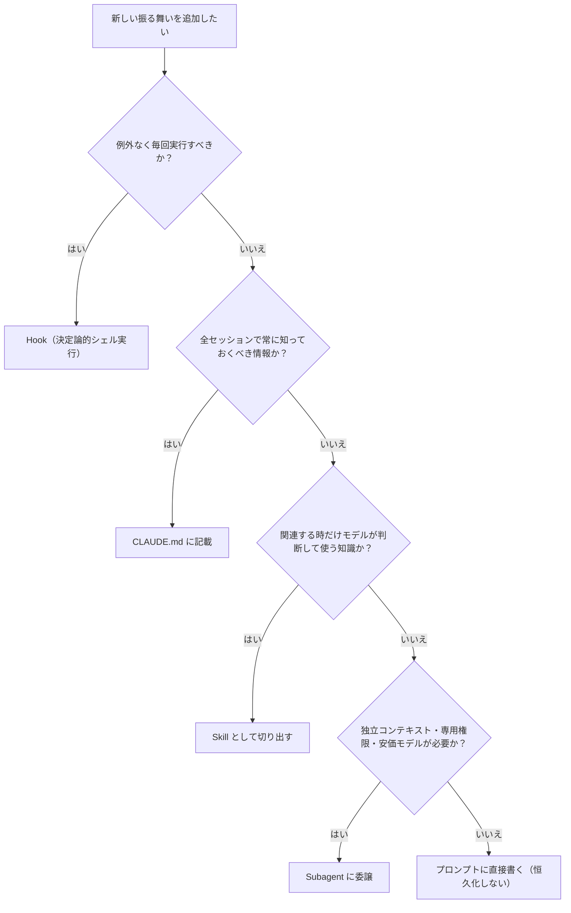
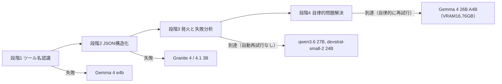
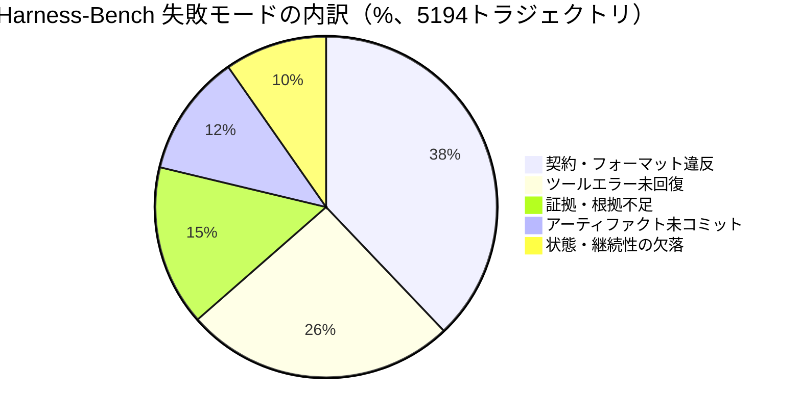

# Daily Briefing 2026-08-30

## 1. Hookは保証、Skillは知識、Subagentは他人（原題: Hooks are guarantees, skills are knowledge, subagents are other people）

- **URL**: https://nick-liu.com/posts/claude-code-skills-hooks-subagents/
- **公開日**: 2026-07-15（2026-08-02 更新）
- **著者・媒体**: Nick Liu（Meta所属ソフトウェアエンジニア／個人ブログ）

### 本文翻訳
Claude Codeを使い込むほど、CLAUDE.md・Hook・Skill・Subagentという4つの拡張ポイントのどれに何を書くべきか、判断に迷う場面が増えていく。著者のNick Liuは、この判断を「誰が実行を決めるか」という一本の軸で整理し直すことを提案する。

まずCLAUDE.mdは「モデルが常に知っておくべき情報」の置き場所であり、判断主体は存在しない――常にコンテキストに載っているからだ。次にHookは「例外なく毎回実行されるべきこと」に答える層で、実行主体はシェルスクリプトによる決定論的処理である。著者は、新しいセッションを開始するたびに自動でセッション名を付けるSessionStartフックを例に挙げ、「1回でも実行し忘れると不快に感じるなら、モデルの判断に依存してはいけない」と述べる。

Skillは「この領域ではどう振る舞うか」という知識層であり、関連性が高いと判断された時だけモデル自身がロードする。著者のブログでは、文章の執筆規約や短縮表現のルールなど約200行がSkillとして管理され、記事作成時にだけ読み込まれる。著者は、Skillの説明文に「MUST」のような強制語を見つけたら、それは実はHookにすべき兆候だと警告する――「毎回やるべきこと」をモデルの任意判断に委ねてしまっているからだ。

Subagentは独立したコンテキストウィンドウ、ツール権限、そしてモデル選択を持つ層である。著者にとって最大の転換点は、Subagentを単なる文脈分離の手段ではなく「コスト最適化の手段」として使い始めたことだった。grep実行、バッチ編集、チェックリスト検証のような処理を、最上位モデルの10分の1程度のコストで済む廉価モデルのSubagentに委譲することで、利用上限に達する問題を解消したという。

記事は判断フローチャートも提示する。「例外なく毎回か→Hook」「全セッションで必要な情報か→CLAUDE.md」「関連時にだけ使う知識か→Skill」「独立コンテキストや廉価モデルが必要か→Subagent」「どれでもなければプロンプトに直接書く」という順番だ。著者自身の現在の設定は、2つのHook・10個のSkill・3つのカスタムSubagentで構成されている。最後に、Subagentやフックの定義を追加・変更した後はセッションを再起動しないと反映されない点にも注意を促している。

### 重要ポイント
- 4つの拡張ポイントを「誰が実行を決めるか」で分類：CLAUDE.md=常時、Hook=決定論的スクリプト、Skill=モデルの任意判断、Subagent=独立コンテキスト
- Skillの説明文に「MUST」など強制語があれば、それはHook化すべきサイン
- Subagentは文脈分離だけでなく「コスト最適化」の手段（廉価モデルへの委譲で利用上限問題を解消）
- 著者の実運用構成は2 Hook・10 Skill・3 Subagent
- Hook/Subagentの定義変更はセッション再起動後にしか反映されない

### 図解


### 現場での適用方法

**CLAUDE.md への追記例**
```markdown
## Claude Code 拡張ポイント選定ルール

新しいルールや自動化を追加する前に、必ず以下の順で判定すること。

1. 「例外なく毎回実行されるべきか？」→ Yes: Hook として `.claude/hooks/` に実装する
2. 「全セッションで常に知っておくべき前提か？」→ Yes: この CLAUDE.md に直接書く
3. 「特定の作業をする時だけ必要な手順・規約か？」→ Yes: Skill (`.claude/skills/<name>/SKILL.md`) として切り出す
4. 「独立したコンテキスト、専用のツール権限、または安価なモデルへの委譲が必要か？」→ Yes: Subagent として定義する
5. いずれにも当てはまらない → プロンプトに直接書く（恒久化しない）

補足: Skill の description に "MUST" "必ず" のような強制語が出てきたら、それは Hook 化のサインなので見直すこと。
```

**スクリプト化の例（実行漏れを許さない自動命名Hook）**
```jsonc
// <REPO_PATH>/.claude/settings.json
{
  "hooks": {
    "SessionStart": [
      {
        "matcher": "*",
        "hooks": [
          { "type": "command", "command": "bash <REPO_PATH>/.claude/hooks/name-session.sh" }
        ]
      }
    ]
  }
}
```
```bash
#!/usr/bin/env bash
# <REPO_PATH>/.claude/hooks/name-session.sh
# セッション開始時に自動でセッション名を付与する（実行漏れを許さないためHook化）
SESSION_NAME="session-$(date +%Y%m%d-%H%M%S)"
echo "{\"sessionName\": \"$SESSION_NAME\"}"
```

### 期待効果
拡張ポイントの選定基準が明確になり、「暗黙のルール」をSkillに書いてしまうことによる実行漏れが減る。著者の事例では、grepやバッチ編集などをコスト1/10程度の廉価モデルSubagentへ委譲することで、利用上限（レート制限）到達の問題を解消できたと報告されている。

### 注意点
Hookはシェルスクリプトであるため、エラー処理やタイムアウトの設計は自分で行う必要がある。Subagentやフックの定義を追加・変更した後はセッションの再起動が必須で、反映されるまでは古い挙動のまま動く点に注意。また、何でもHook化すると柔軟性が失われるため、「例外なく毎回」に本当に該当するかを見極めることが重要。

---

## 2. ローカルLLMがエージェントになれる/なれない境界線は4段階あった ― 7モデル横断検証

- **URL**: https://zenn.dev/komachi/articles/b3869383928117
- **公開日**: 2026-05-12
- **著者・媒体**: torihada（Zenn個人記事）

### 本文翻訳
ローカルLLMは本当にコーディングエージェントとして「動く」のか。この記事は、この問いに対して「動く/動かない」の二択ではなく、能力到達度を4段階に分解して答えを出そうとする検証レポートである。

検証環境はWindows 11、RTX 4070 Ti Super（VRAM 16GB）、RAM 64GBという一般的なゲーミングPC相当のスペックで、Ollama v0.23.0とLM Studio、そしてOpenCode Desktop Betaをハーネスとして使い、7つのローカルモデル（Gemma 4 e4b、Granite 4/4.1 3B、qwen3.6:27b、qwen3.6:latest、devstral-small-2:24b、Gemma 4 26B A4B）に対し、「writeツールでhello.pyを作成せよ」という同一の簡潔なプロンプトを与えて挙動を比較した。

分類した4段階は、(1)ツール名を正しく認識できるか、(2)正しいJSON構造でツール呼び出しを組み立てられるか、(3)ツールを実際に発火させ、失敗時にその原因を正しく分析できるか、(4)失敗を受けて自律的に環境を調査し、代替手段で再試行できるか、である。最小のGemma 4 e4bは存在しない`write_file`という架空のツール名を呼び出そうとして段階1で脱落し、Granite系は正しいJSON構造は書けるものの実際のツール呼び出しプロトコルに乗せられず段階2で止まった。qwen3.6:27bはWindows特有の権限問題を正しく特定して代替案も提示したが自動再試行はせず、devstral-small-2:24bは簡潔な失敗報告に長けていた。段階4に到達したのはGemma 4 26B A4B（VRAM 16.76GB）だけで、失敗を受けて自ら環境を調査し、書き込み可能な場所を推定して再試行するところまでこなした。

特に重要な発見は、同じqwenファミリーの中で17GB版が段階3まで到達した一方、より大きい23GB版は16GBのVRAM上限を超えてCPUオフロードが発生し、同じ失敗パスを4回も繰り返すという性能劣化を見せたことだ。「大きいモデルほど良い」という前提は、VRAMへの収まり具合という物理制約の前では簡単に崩れる。著者は今後、AGENTS.mdによる最適化や量子化レベルの比較も検証予定だとしている。

### 重要ポイント
- ローカルLLMのエージェント適性を「ツール名認識→JSON構造化→発火と失敗分析→自律的問題解決」の4段階で評価
- 段階4（自律的問題解決）に到達したのは7モデル中Gemma 4 26B A4B（VRAM 16.76GB）のみ
- 同じqwenファミリーでも23GB版はVRAM 16GBを超えてCPUオフロードが発生し、17GB版より性能が劣化
- 「大きいモデルほど良い」ではなく、VRAMへの収まり具合が決定的
- 用途によって最適モデルは分化する（自動化志向ならGemma 26B A4B、人間介入前提ならdevstral）

### 図解


### 現場での適用方法

**運用手順（導入前のモデル選定ベンチマーク）**
```bash
# 1. VRAM使用量を確認し、モデルサイズがVRAM上限を超えていないか事前チェック
nvidia-smi --query-gpu=memory.total,memory.used,memory.free --format=csv

# 2. 候補モデルに対して同一プロンプトで4段階の挙動を記録する
MODEL_LIST=("gemma4:e4b" "granite4:3b" "qwen3.6:27b" "qwen3.6:latest" "devstral-small-2:24b" "gemma4:26b-a4b")
PROMPT='writeツールを使ってカレントディレクトリに hello.py を作成してください。書き込みに失敗したら理由を調査し、書き込み可能な場所を提案して再試行してください。'

for MODEL in "${MODEL_LIST[@]}"; do
  echo "=== $MODEL ==="
  ollama run "$MODEL" "$PROMPT" | tee "<LOG_DIR>/${MODEL//:/_}.log"
  # 手動判定基準:
  # 1. 存在しないツール名を呼んでいないか
  # 2. 正しいJSON構造でツール呼び出しを組み立てているか
  # 3. 失敗時に原因を正しく分析しているか
  # 4. 自律的に代替パスを調査し再試行しているか
done
```

### 期待効果
モデル選定を勘やベンチマーク数値だけに頼らず、実際のエージェントタスクに即した4段階基準で比較できる。VRAM超過による性能劣化（同一失敗パスの繰り返し等）を導入前に回避でき、無駄な試行コストを削減できる。

### 注意点
この検証は「ファイル書き込み」という単一タスクでの結果であり、コード生成能力そのものは別途評価が必要。ハードウェア構成（VRAM 16GB）に強く依存する結果のため、自社の実環境で必ず再検証すること。量子化レベルの違いやAGENTS.mdの有無による差は本検証では未評価。

---

## 3. Harness-Bench: 現実的なエージェントワークフローにおけるハーネス効果の測定（原題: Harness-Bench: Measuring Harness Effects across Models in Realistic Agent Workflows）

- **URL**: https://arxiv.org/abs/2605.27922
- **公開日**: 2026-05-27
- **著者・媒体**: Yilun Yao 他12名（arXivプレプリント）

### 本文翻訳
「ハーネスが違えば、同じモデルでも成果は大きく変わる」――この直感を大規模な実測データで裏付けたのが本論文である。研究チームはソフトウェア保守・データ分析・ワークスペース操作・SRE/DevOpsなど8カテゴリ106個のオフラインタスクを用意し、claude-opus-4.6、gemini-3.1-pro、qwen3.6-plus、gpt-5.4など8つのモデルバックエンドを、OpenClaw・NanoBot・Hermes・ZeroClaw・NullClaw・Moltisという6つの異なるエージェントハーネス（Codexは別枠で追加計測）の上で走らせ、合計5,194件の実行トラジェクトリを収集した。

最大の発見は、同一のタスク・同一のモデルプールであっても、ハーネスの違いだけで完了スコアが最高76.2%（NanoBot）から最低52.4%（OpenClaw）まで、23.8ポイントも変動したことだ。しかも強いモデルほどハーネス間のばらつきは小さく、弱いモデルほどハーネス設計の巧拙が結果を大きく左右する。論文はこれを根拠に「エージェントの能力はベースモデル単体ではなく、モデル×ハーネスの構成単位で報告されるべきだ」と主張する。

失敗の内訳を分析すると、契約・フォーマット違反（不正なJSON、欠落した台帳行、不完全なマニフェストなど）が36.4%で最多を占め、次いでツールエラー後に効果的な回復ができないケースが24.6%、証拠・根拠の不足（情報源の網羅漏れ）が14.6%、推論はしたが出力を検証可能なアーティファクトとしてコミットしなかったケースが11.1%、複数ラウンドにまたがる状態の保持失敗が9.3%と続く。論文はこれらを「実行ドリフト（execution drift）」――モデルの推論が、ファイル・ツール・証拠・状態・出力契約といった「成功が判定される拠り所」から徐々に乖離していく現象――として統一的に説明する。この乖離が起きると、もっともらしい推論であっても、評価基準とは無関係な方向に進んでしまう。

### 重要ポイント
- 106タスク×8モデル×6ハーネス＝5,194トラジェクトリという大規模比較で、ハーネス差だけで完了スコアが23.8ポイント変動
- 強いモデルほどハーネス間のばらつきが小さく、弱いモデルほどハーネス設計の質が結果を左右する
- 失敗の最多要因は契約・フォーマット違反（36.4%）、次いでツールエラー未回復（24.6%）
- 「エージェント能力はモデル単体ではなくモデル×ハーネス単位で報告すべき」と提言
- 失敗の本質は「実行ドリフト」＝推論がファイル・ツール・証拠・状態・出力契約から乖離すること

### 図解


### 現場での適用方法

**CLAUDE.md への追記例（契約強制ルール）**
```markdown
## エージェントハーネス設計ルール

Harness-Bench の知見（契約違反36.4%、ツール回復失敗24.6%が主要因）を踏まえ、以下を必須とする。

- タスク完了を報告する前に、出力アーティファクト（JSON/レポート/コミット等）を
  必ず所定のスキーマ・パスに書き出すこと。書き出さない「口頭のみの完了報告」は禁止。
- ツール呼び出しが失敗した場合、原因を1行で要約し、次の一手（再試行/代替手段/人間へのエスカレーション）を
  明示してから次のアクションに進むこと。
- 複数ステップにまたがるタスクでは、各ステップ完了時に進捗を `<REPO_PATH>/.claude/state/progress.json` に
  追記し、セッションが中断しても再開できるようにすること。
```

**スクリプト化の例（出力契約の機械的検証Hook）**
```bash
#!/usr/bin/env bash
# <REPO_PATH>/.claude/hooks/verify-output-contract.sh
# Stopフック: セッション終了前に、期待される出力アーティファクトが
# 実際に書き出されているかを機械的に検証する（契約違反対策）
EXPECTED_FILE="<REPO_PATH>/output/result.json"
if [ ! -f "$EXPECTED_FILE" ]; then
  echo "ERROR: 期待される出力アーティファクトが見つかりません: $EXPECTED_FILE" >&2
  exit 1
fi
python3 -c "import json,sys; json.load(open('$EXPECTED_FILE'))" || {
  echo "ERROR: 出力アーティファクトが不正なJSONです" >&2
  exit 1
}
```

### 期待効果
「モデルを変える」だけでなく「ハーネスを変える」ことでも最大23.8ポイントのスコア差が生まれ得ることを踏まえ、契約強制・エラー回復ロジック・状態永続化といったハーネス投資の優先順位を明確化できる。特に廉価・軽量モデルを使う構成ほど、この投資の効果は大きい。

### 注意点
106タスクはオフラインの機械可読タスクであり、必ずしも自社の業務タスク分布と一致しない。OpenClaw・NanoBotなどのハーネス名は論文内での呼称であり、市販の具体的な製品との対応関係は明示されていないため、数値は絶対値ではなく相対的な傾向として参照すること。
