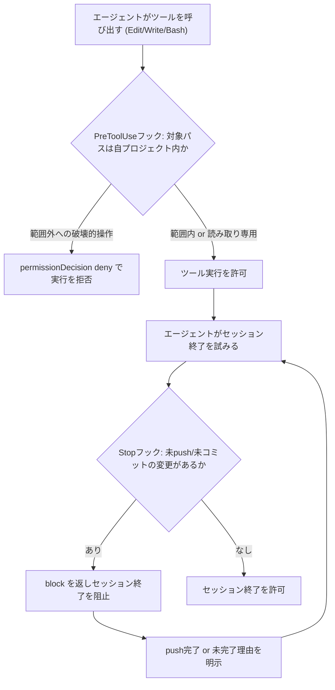
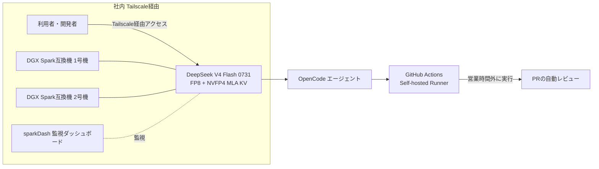
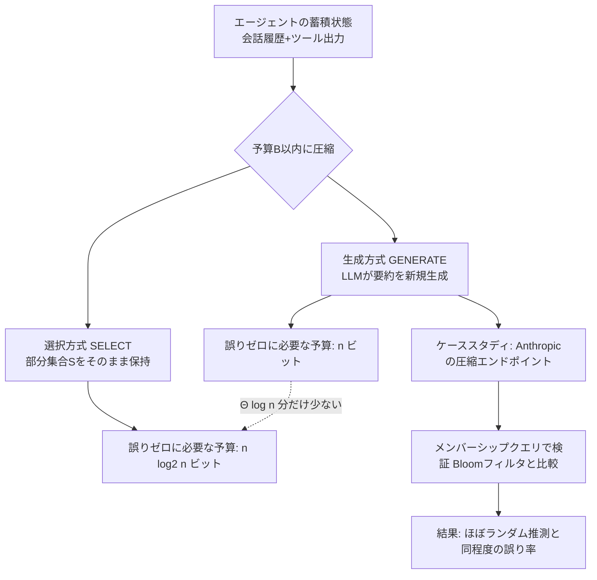

# Daily Briefing 2026-08-31

## 1. Claude Codeのフック・スキルによる実運用ガードレール構築（原題: Claude Code Hooks, Skills and Subagents: a Practical Setup）

- **URL**: https://dev.paczesny.pl/blog/en/how-to-setup-claude-code-hooks-skills
- **公開日**: 2026-07-03
- **著者・媒体**: Bartek Paczesny（dev.paczesny.pl）

### 本文翻訳
筆者はClaude Codeを日常的な開発に使う中で、2つの「事故」を経験したことをきっかけに、モデルの判断に頼らない仕組みを作った。

1件目は、エージェントがコードをコミットしたものの、リモートへのpushを忘れたまま「完了」と報告した事故である。デプロイはgit pushをトリガーに動くため、エージェントの認識上は「完了」でも、実際にはローカルに留まったままデプロイされていなかった。

2件目は、複数のエージェントセッションが同時に動いていたケースである。あるセッションはプロジェクトAで起動したはずが、隣接するプロジェクトBのファイルを編集し始めた。ちょうどそのプロジェクトBでは別のエージェントセッションが作業中で、衝突のリスクがあった。

この2つの事故を受けて、筆者はCLAUDE.md・スキル・フック・サブエージェントという4つの制御手段を整理した。特に強調されているのが「フックだけがモデルが無視できない仕組みである」という点だ。CLAUDE.mdやスキルはあくまでモデルへの指示であり、モデルが読み飛ばしたり誤解したりする余地が残る。一方フックはハーネス（Claude Code本体）側で強制実行されるコードであり、モデルの判断を経由しない。

具体的には、セッション終了時に発火するStopフックとして「unpushed-work-guard.sh」を実装した。このフックはローカルのHEADとリモートoriginを比較し、未pushのコミットや未コミットの変更が残っていればJSONで「block」の判定を返し、セッションの終了をブロックする。エージェントはこの理由を受け取り、pushを完了させるか、意図的に未完了である理由を明示しない限りタスクを終えられない。

もう一つは、ツール呼び出し前に発火するPreToolUseフック「sibling-project-guard.sh」である。EditやWrite、Bashコマンドの実行前に、対象パスがセッションのプロジェクトディレクトリ内かどうかを確認し、git commit・push・rm・npm installのような破壊的なBashコマンドが範囲外のプロジェクトに向いていないかもチェックする。範囲外への書き込みを検知すると「permissionDecision: deny」を返してツール実行自体を止める。読み取り専用の操作は許可される。

これらのフックは`~/.claude/settings.json`（またはプロジェクト単位の`.claude/settings.json`）にイベント種別（PreToolUse、Stopなど）とマッチャー（`Edit|Write|Bash`のようなパイプ区切りパターン）、実行コマンド、タイムアウトを登録する形で設定する。

さらに「ship」というスキルを用意し、デプロイ完了の定義を明文化した。テストとlintを実行して問題があれば止める、関連する変更だけをまとめてコミットする、CLAUDE.mdに書かれたデプロイ用ブランチへpushする（推測しない）、本番URLが新しいビルドを返すまで監視する、実際に本番へリクエストを送ってスモークテストする、最後にコミットSHA・デプロイ状況・スモークテスト結果を報告する、という手順を定めている。

この仕組みの導入により、「完了したはずのデプロイが実は反映されていない」といった幽霊デプロイや、隣接プロジェクトへの誤編集はなくなった。ただし筆者は、フックも通常のコードと同様に保守が必要であり、放置すると腐ることに注意を促している。

### 重要ポイント
- CLAUDE.md／スキルは「モデルへの指示」であり読み飛ばされ得るが、フックは「ハーネスが強制するコード」でありモデルは無視できない
- Stopフックでセッション終了そのものをブロックし、未push・未コミットのまま「完了」と報告させない
- PreToolUseフックでツール実行前に対象パスを検証し、プロジェクト境界を越えた破壊的操作を拒否できる
- settings.jsonでイベント種別・マッチャー・コマンド・タイムアウトを宣言的に登録する
- 「デプロイ完了」の定義をスキルとして明文化することで、テスト→コミット→push→稼働確認→スモークテストの手順を毎回徹底できる

### 図解


### 現場での適用方法

**フックスクリプト例（unpushed-work-guard.sh）**
```bash
#!/usr/bin/env bash
# Stop hook: セッション終了時に未push/未コミットの変更がないか確認する
set -euo pipefail

cd "<REPO_PATH>"

if ! git diff --quiet || ! git diff --cached --quiet; then
  echo '{"decision":"block","reason":"未コミットの変更が残っています。コミットするか変更を破棄してください。"}'
  exit 0
fi

git fetch origin --quiet
LOCAL=$(git rev-parse @)
REMOTE=$(git rev-parse @{u} 2>/dev/null || echo "")

if [ -n "$REMOTE" ] && [ "$LOCAL" != "$REMOTE" ]; then
  echo '{"decision":"block","reason":"未pushのコミットがあります。git push を実行するか、未完了である理由を明示してください。"}'
  exit 0
fi

echo '{"decision":"allow"}'
```

**フックスクリプト例（sibling-project-guard.sh）**
```bash
#!/usr/bin/env bash
# PreToolUse hook: プロジェクト境界を越えた書き込み/破壊的コマンドを拒否する
set -euo pipefail

PROJECT_DIR="<REPO_PATH>"
TARGET_PATH="${1:-}"

case "$TARGET_PATH" in
  "$PROJECT_DIR"*) echo '{"permissionDecision":"allow"}'; exit 0 ;;
esac

echo "{\"permissionDecision\":\"deny\",\"reason\":\"対象パス ${TARGET_PATH} はプロジェクト範囲外です\"}"
```

**settings.json 登録例**
```json
{
  "hooks": {
    "PreToolUse": [
      {
        "matcher": "Edit|Write|Bash",
        "hooks": [
          {
            "type": "command",
            "command": "<REPO_PATH>/.claude/hooks/sibling-project-guard.sh",
            "timeout": 10
          }
        ]
      }
    ],
    "Stop": [
      {
        "hooks": [
          {
            "type": "command",
            "command": "<REPO_PATH>/.claude/hooks/unpushed-work-guard.sh",
            "timeout": 15
          }
        ]
      }
    ]
  }
}
```

**CLAUDE.md への追記例**
```markdown
## デプロイの定義
- 「完了」とは: コミット済み・正しいブランチへpush済み・本番での動作確認済みの3条件を満たすこと
- デプロイ先ブランチは必ずこのファイルを参照する。推測で main にpushしない

## シークレット
- .env の中身をチャットにそのまま出力しない。キー名のみをマスクして表示する

## 作業範囲
- 明示的に指示されない限り、このリポジトリ以外のファイルを編集しない
```

**スキル化の例（SKILL.md: ship）**
```markdown
---
name: ship
description: 変更をデプロイし、実際に本番で動作確認するまでを一貫して行う際に使用する
---

## 手順
1. テストとlintを実行し、失敗したら停止する
2. 関連する変更のみをまとめてコミットする
3. CLAUDE.md記載のデプロイ用ブランチへpushする（推測しない）
4. 本番URLが新しいビルドを返すまで監視する
5. 実際に本番へリクエストを送りスモークテストする
6. コミットSHA・デプロイ状況・スモークテスト結果を報告する
```

### 期待効果
記事によれば、この仕組みの導入により「完了したはずのデプロイが実は未反映」という幽霊デプロイと、隣接プロジェクトへの誤編集の2つの事故が解消されたとされている。

### 注意点
- フックはシェルスクリプトなど通常のコードと同じく保守が必要で、放置すると陳腐化する
- git remoteやブランチ運用がチームによって異なるため、`<REPO_PATH>`やブランチ名判定ロジックは自環境に合わせて調整が必要
- Stopフックが過剰にブロックすると、意図的に未完了で終えたいケース（レビュー待ちなど）が煩雑になるため、明示的な「未完了理由」の許可ルートを用意しておく

## 2. ローカルLLM運用の雑感（2026年8月）（原題: ローカル LLM 雑感 (2026-08)）

- **URL**: https://voluntas.ghost.io/local-llm-2026-08/
- **公開日**: 2026-08-16
- **著者・媒体**: V（voluntas.ghost.io）

### 本文翻訳
筆者は、NVIDIA DGX Spark互換機を2台使い、DeepSeek V4 Flash 0731をローカルで運用してきた経験を月次でまとめている。

前提として、単純なコスト効率だけを見るならクラウドAPIの方が有利であると筆者自身も認める。それでもローカル運用を続ける理由として、速度・安定性・セキュリティ・安心感の面での価値を挙げている。

速度面では、最大114トークン/秒の生成速度を確認しており、「仕事で十分に使えるレベル」と評価している。設定としてはFP8重み＋NVFP4のMLA KVキャッシュ方式を採用し、コンテキストサイズは当初の1Mトークンから512Kトークンへ縮小した。理由は、実運用でのログを確認したところ512Kを超えるリクエストが一度もなかったためで、無駄に大きいコンテキストを確保するよりも512Kに絞ることで安定性を優先した。

安定性については、24時間の連続稼働でも問題は発生していない。運用面ではsparkDashという監視ダッシュボードを使い、モデルのレシピ（重みやKVキャッシュ方式の構成）更新への追従状況を管理している。

セキュリティ・安心感の面では、アクセスをTailscale経由に限定することで、外部に公開せずに社内から安全にアクセスできる構成にしている。従業員からのフィードバックとして「APIの料金や利用制限を気にせず、完全にクローズドな環境で使える安心感が大きい」という声が紹介されている。

エージェント用途については、OpenCodeとの組み合わせを推奨している。GitHub ActionsのSelf-hosted Runnerと組み合わせ、営業時間外にGitHubのプルリクエストレビューを自動実行する構想を持っており、これを「24時間365日、休みなく働き続けるLLM」と表現している。

コストについては、DGX Spark互換機2台の導入費用が約200万円、月間の電気代は3,000〜5,000円程度と見積もっている。年間8,760時間フル稼働できる計算になり、クラウドAPIの従量課金と比較した際の心理的な安心感が大きいとしている。

今後の計画としては、追加投資をする場合は同様の2台構成を拡張する方針で、DeepSeek V4 Flash 0731以外のモデルへの乗り換えは現時点で予定していないとしている。

### 重要ポイント
- FP8重み＋NVFP4 MLA KVキャッシュで最大114 tok/sを実現し、コンテキストは実運用ログに基づき1M→512Kに縮小して安定性を優先
- コスト効率だけならAPIが有利という前提を認めた上で、速度・安定性・セキュリティ・心理的安心感でローカル運用の価値を評価
- Tailscale経由のアクセス制限により、外部公開せず社内で完結するセキュアな運用を実現
- sparkDashによる監視と、GitHub Actions Self-hosted Runnerとの連携で、営業時間外の自動PRレビューなど24/365稼働を構想
- 導入費用約200万円・月額電気代3,000〜5,000円という具体的なコスト感覚が示されている

### 図解


### 現場での適用方法

**運用手順（ローカルLLMサーバの構築とチューニング）**
1. DGX Spark互換機を用意し、`<SERVING_CLI>`（vLLM/SGLang等の推論サーバ）でモデルを起動する
2. 数週間分の実運用ログを収集し、実際に使われている最大コンテキスト長を確認する
3. 確認した実測値に合わせてコンテキスト上限を絞り込み、安定性とVRAM効率を優先する
4. Tailscale経由のみアクセスを許可し、外部への公開を避ける
5. 監視ダッシュボードでモデルのレシピ更新への追従状況を可視化する

```bash
# 実運用ログを確認し、512Kを超えるリクエストがないことを確認してから縮小する
<SERVING_CLI> serve deepseek-v4-flash-0731 \
  --weights fp8 \
  --kv-cache-scheme nvfp4-mla \
  --max-context 524288 \
  --host 0.0.0.0 --port <LOCAL_LLM_PORT>
```

```bash
# Tailscale経由でのみアクセス可能にする（外部公開しない）
tailscale up --ssh
tailscale serve --bg "http://127.0.0.1:<LOCAL_LLM_PORT>"
```

**スクリプト化の例（営業時間外の自動PRレビュー: GitHub Actions）**
```yaml
name: off-hours-pr-review
on:
  schedule:
    - cron: "0 10-23 * * 1-5"  # UTC基準。自組織の営業時間外に合わせて調整する
  workflow_dispatch:

jobs:
  review:
    runs-on: self-hosted  # ローカルLLMサーバのあるホストのRunner
    steps:
      - uses: actions/checkout@v4
      - name: Run local LLM PR review
        env:
          LOCAL_LLM_ENDPOINT: "http://<LOCAL_LLM_HOST>:<LOCAL_LLM_PORT>/v1"
        run: |
          opencode review \
            --endpoint "$LOCAL_LLM_ENDPOINT" \
            --model deepseek-v4-flash-0731 \
            --pr "${{ github.event.pull_request.number }}"
```

### 期待効果
記事内の実績値として、最大114トークン/秒の生成速度、24時間連続稼働での安定動作、導入費用約200万円・月額電気代3,000〜5,000円という具体的なコスト感が示されている。API従量課金の上限を気にせず使える心理的な安心感も効果として挙げられている。

### 注意点
- 単純なコスト効率だけで比較するとクラウドAPIの方が有利であり、初期投資（約200万円）を回収する前提の運用が必要
- コンテキストサイズの縮小（1M→512K）は「実運用ログで512K超がなかった」という前提あってのものであり、自組織のログを確認せずに闇雲に縮小すべきではない
- モデルのレシピ（重み・KVキャッシュ方式）更新への追従が継続的な運用負荷になる

## 3. コンテキスト圧縮の理論的分析：選択方式と要約方式の間に本質的な性能差がある（原題: Context Compaction Theory）

- **URL**: https://arxiv.org/abs/2608.01326
- **公開日**: 2026-08-02
- **著者・媒体**: Hayder Tirmazi, Sam Markelon, Allison Bishop, Michael Mitzenmacher（arXiv preprint, arXiv:2608.01326）

### 本文翻訳
LLMエージェントは入力ウィンドウのサイズに上限があるため、会話履歴やツール出力が蓄積すると、それらを圧縮する「コンテキスト圧縮（context compaction）」が必要になる。Claude CodeやCodex、Gemini CLIなど多くの本番エージェントがこの仕組みを使っているにもかかわらず、これまで厳密な理論的分析はほとんど行われてこなかった。本論文は、この問題に対する初の形式的な枠組みを提示する。

論文が扱う本質的な課題は次のとおりだ。エージェントの蓄積された状態（ユーザーメッセージ・LLMの応答・ツール出力）がコンテキストウィンドウを超えると、情報を捨てるか要約するかしなければならない。捨てられた情報は、それ以降の推論ステップで永続的にアクセス不能になるという新しい失敗モードが生じる。

著者らは2つのゲーム理論的な枠組みを定義する。1つ目は「コンテキスト選択ゲーム」で、アイテム集合から予算B以内で部分集合Sを選び保持するモデルである。選択後、敵対的なクエリが発行され、保持した部分集合だけから答えられるかが問われる。2つ目は「コンテキスト生成ゲーム」で、これは選択モデルの制約を緩め、新しいトークンを生成すること、保持したアイテムの順序を並べ替えて情報を伝えること、保持アイテムの合計サイズより小さい出力に圧縮することを許す。これはLLMによる要約（Claude CodeやCodexなどが実際に行っている処理）をモデル化したものだ。

理論的な中心結果は2つある。定理1は、生成ゲームにおいて誤り率ε以下を達成する最小予算が、対応する問題の「一方向ランダム化通信計算量」と一致することを示す。これにより、通信計算量の分野で確立された下界を圧縮アルゴリズムの評価に転用できる。定理3はさらに重要で、n個のアイテムに対して誤りゼロで答えるには、選択方式のアルゴリズムは少なくとも n log₂n ビットの予算が必要なのに対し、生成方式のアルゴリズムはnビットで誤りゼロを達成できることを証明した。つまり要約ベースの生成方式は、単純な部分選択方式よりΘ(log n)分だけ本質的に少ない予算で済むという、厳密な性能差が存在する。

さらに著者らは、Anthropicの実際のコンテキスト圧縮エンドポイントを使ったケーススタディを行った。15,000件のアイテムを記録し、集合の要素判定（メンバーシップ）クエリに答えられるようにデータを圧縮させ、情報理論的にほぼ最適なアルゴリズムであるBloomフィルタと性能を比較した。結果、このエンドポイントはメンバーシップクエリに対してほぼランダムな推測と変わらない誤り率しか出せなかった。対照実験により、この誤りはコンテキスト圧縮の過程で失われた情報が原因であることが確認された。

実務上の含意として、著者らは依存関係の脆弱性チェック（集合の非交差性を問うクエリ）を例に挙げ、N個の要素からなる部分集合を表現するにはΩ(Nm)ビット（mはパッケージ識別子のサイズ）が必要であり、Bloomフィルタを含むどんな圧縮方式でもこの下界を大きく改善できないことを示した。つまり、大規模なリポジトリに対するこの種の正確な集合演算クエリは、圧縮済みコンテキストからは原理的に意味のある形で答えられないとしている。またコスト面では、80万トークンをClaude Fable 5で要約するのに約13ドル・26分を要すると報告しており、これが「多くのデプロイ済みエージェントが後続ステップで圧縮済み状態のみをLLMに渡す」理由を説明しているとする。

### 重要ポイント
- コンテキスト圧縮を「部分集合の選択」と「LLMによる要約生成」の2つのゲームとして定式化し、初めて厳密な理論的下界・上界を与えた
- 要約方式は選択方式よりΘ(log n)ビット少ない予算で誤りゼロを達成できることを証明（定理3）
- Anthropicの実コンテキスト圧縮エンドポイントは、集合のメンバーシップクエリに対してほぼランダムな推測と同程度の精度しか出せなかった
- 依存関係の脆弱性チェックのような「正確な集合演算」を要するクエリは、圧縮済みコンテキストからは原理的に答えられない可能性が高い
- 80万トークンの要約に約13ドル・26分かかるというコスト実測値も示されている

### 図解


### 現場での適用方法

**CLAUDE.md への追記例**
```markdown
## コンテキスト圧縮に関する注意
- 依存関係一覧・許可リスト・脆弱性チェックなど「正確な集合演算」を要する情報は、
  会話履歴の要約（コンテキスト圧縮）に頼らない。圧縮は原理的に完全性を保証できない
- こうした情報は毎回 <DEPENDENCY_MANIFEST_PATH> 等のファイルから読み直す運用にし、
  要約済みの会話履歴だけを根拠に判断しない
- 長時間セッションで /compact を使う場合、直前に重要な集合データ(ID一覧・許可済みリストなど)を
  スクラッチファイルへ書き出してから圧縮を実行する
```

**スキル化の例（SKILL.md: exact-recall-guard）**
```markdown
---
name: exact-recall-guard
description: 依存関係チェックや許可リスト照合など、正確な集合演算が必要な判断を行う前に使用する。要約されたコンテキストではなく、必ず元データを再読み込みする
---

## 手順
1. 判断対象のデータ(依存関係一覧・許可リストなど)を要約からではなく、
   元のファイルやAPIから再取得する
2. 取得したデータに対してのみ集合演算(含まれるか/含まれないか)を行う
3. 会話履歴の要約に基づく推測でメンバーシップを判定しない
```

### 期待効果
本論文の知見を適用すれば、コンテキスト圧縮に依存した誤判定（例: 実際には存在する脆弱な依存関係を「ない」と誤答する）を防げる可能性がある。特に依存関係チェックや許可リスト照合など、正確性が求められる場面での事故を未然に防ぐ設計指針として使える。

### 注意点
- 本論文はAnthropicの特定エンドポイント・特定タスク（メンバーシップクエリ）での実験であり、他ベンダーや他タスクに単純に一般化はできない
- 要約方式が理論上優れるとはいえ、実際のLLM要約器がその理論上限に近い性能を発揮できるとは限らない（論文自身も「現実的な要約器がどこまで理論限界に迫れるか」を今後の課題としている）
- 要約コストの実測値（80万トークンで約13ドル・26分）は使用モデルやトークン数に依存するため、自環境での実測が必要
