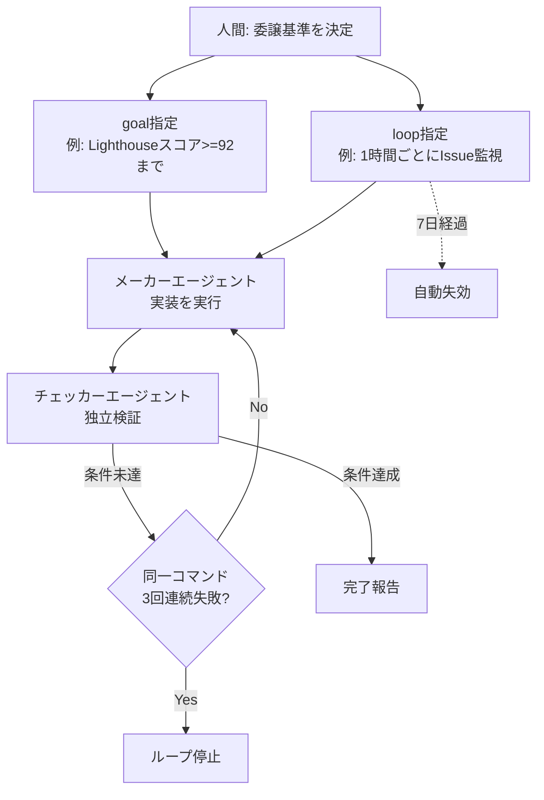
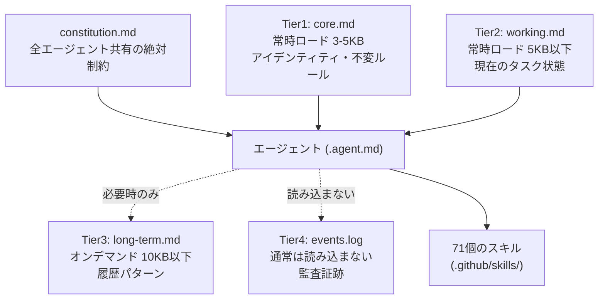
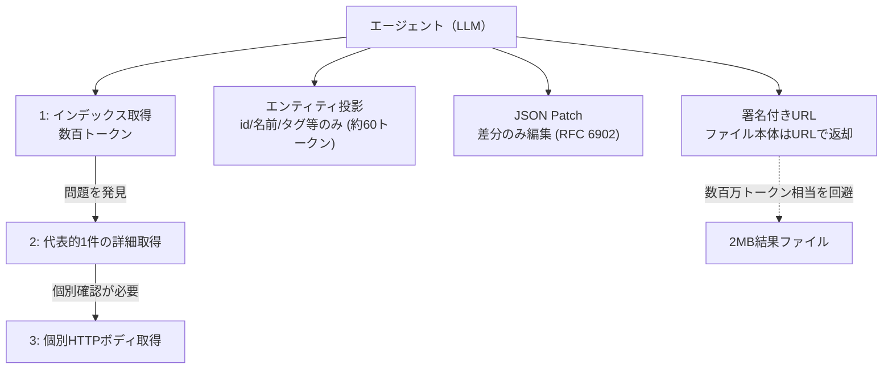

# Daily Briefing 2026-09-01

## 1. 実践ループエンジニアリング（原題: Practical Loop Engineering）

- **URL**: https://addyosmani.com/blog/practical-loop-engineering/
- **公開日**: 2026-08-14
- **著者・媒体**: Addy Osmani / addyosmani.com

### 本文翻訳

著者はまず「ループ」を、AIエージェントが行動・テスト・調整を自律的に繰り返すフィードバック循環と定義する。かつては人間が手作りした bash スクリプトでこの循環を実装していたが、現在は Claude Code に組み込まれた `goal` と `loop` という2つのプリミティブへ移行しつつあると述べる。

ループは性質によって4種類に分類される。ターンベース（一定の対話回数で区切る）、ゴールベース（達成条件を満たすまで続ける）、時間ベース（定期実行）、プロアクティブ（トリガー条件を監視し能動的に動く）である。著者はこれらを組み合わせて日常的に5〜10体のエージェントを並行稼働させており、タスクの性質に応じて監督の度合いを変えているという。

具体的な構文例として、ゴール指定は「Refactor the data-fetching layer in Dashboard.tsx until Lighthouse performance score is >= 92 and LCP is under 1.8s」のように、達成すべき観測可能な条件を明示する形で書く。ループ指定は「/loop every 1h Check the GitHub repository for any new open issues」のように周期と監視対象を書く。両者を組み合わせると「/loop every 24h Check GitHub for issues labeled 'bug'. If one exists, use /goal to implement a fix」のように、定期監視から自動修正までを一続きの指示にできる。

信頼性を担保する仕組みとして、著者は「メーカーエージェント」が実装を行い、独立した「チェッカーエージェント」がその結果を別視点で検証する二層構造を採用している。人間の役割は、タスクの実行そのものではなく、何を委譲してよいかという品質判断の基準を決めることに限定される。ドキュメント作成やテスト結果の確認は安全に委譲できる一方、認証まわりや金銭が絡む変更は厳密な人間監視下に置くべきとする。

失敗の兆候を検知する仕組みも重要視されており、同じコマンドが3回連続で成果なく実行された場合はループを停止するルールを設けている。また、定期実行するループには7日間という有効期限を設定し、放置されたループが際限なく走り続けることを防いでいる。実運用例として、著者が管理する Agent Skills リポジトリでは1日あたり80〜90件のPRをスケジュール設定によって自動的にトリアージしているという。

記事全体を通じて著者が強調するのは、ループエンジニアリングの本質が「人間がプロンプトを打つ役割を、その役割自体を設計するシステムに置き換えること」だという点であり、機械の効率性と人間の判断力を戦略的に切り分けることが核心だとしている。

### 重要ポイント
- ループはターンベース・ゴールベース・時間ベース・プロアクティブの4種類に分類できる
- `/goal` は観測可能な達成条件、`/loop every <period>` は周期実行を指定する組み込みプリミティブ
- 「メーカーエージェント」実装 → 「チェッカーエージェント」検証という二層構造で品質を担保する
- 同一コマンドが3回連続で無成果なら停止、定期ループは7日で自動失効させる
- タスク実行は委譲してよいが、何を委譲するかの品質判断は人間が保持し続ける

### 図解



### 現場での適用方法

**CLAUDE.md への追記例**（ループ運用の安全ルール）:

```markdown
## 自律ループ運用ルール
- `/goal` には必ず観測可能な達成条件を書く（例: テストpass数、
  Lighthouseスコアなど）。「良くする」等の曖昧な目標は禁止。
- 認証・決済・本番DB操作を含むタスクは自律ループの対象外とし、
  必ず人間が都度承認する。
- 同一コマンドが3回連続で成果なく実行された場合は自動停止する。
- 定期ループ（`/loop every ...`）には必ず有効期限（例: 7日）を設定し、
  放置されたループを残さない。
```

**運用手順**（既存の手動プロンプト運用からの移行）:

```bash
# 1. 反復作業の中から「観測可能な達成条件」を定義できるものを洗い出す
#    例: Lint 0件、テストカバレッジ80%以上、特定ラベルのIssueが0件

# 2. まずは低リスクなタスク（ドキュメント更新・テスト確認）から
#    goal/loop化する
/goal "README のインストール手順を実際に実行して動作確認し、
差異があれば修正する"

# 3. 定期監視が必要なものは loop 化し、有効期限を明示する
/loop every 24h "GitHub の bug ラベル付き Issue を確認し、
あれば /goal で修正を試みる（7日で自動終了）"

# 4. 認証・決済・本番データに触れるタスクは対象外リストに明記し、
#    常に人間承認を経由させる
```

### 期待効果
5〜10体のエージェントを並行稼働させても、ゴール条件とチェッカーによる独立検証があることで、目視確認なしに一定の品質を保ったまま作業を進められる。著者の実例では、80〜90件/日というPRトリアージ量をスケジュール化されたループだけで処理できているという。

### 注意点
ループ機能自体は強力だが、達成条件が曖昧なまま `/goal` を発行すると無駄な反復や暴走のリスクがある。認証・金銭・本番環境に関わるタスクを安易に自律ループへ含めないこと、失敗検知（同一コマンドの繰り返し）と有効期限の仕組みを必ず併用することが前提となる。

---

## 2. コンテキストエンジニアリング実践ガイド ― 50体のプロダクションAIエージェントから得た知見（原題: What Is Context Engineering? A Practical Guide from Building 50 Production AI Agents）

- **URL**: https://htek.dev/articles/what-is-context-engineering-practical-guide-50-agents
- **公開日**: 2026-05-14
- **著者・媒体**: htek.dev

### 本文翻訳

著者は、50体の自律型AIエージェントと71個の再利用可能なスキルを構築・運用してきた経験から、「ボトルネックはモデルの性能ではなくコンテキストである」と主張する。プロンプトエンジニアリングが「何をどう聞くか」を扱うのに対し、コンテキストエンジニアリングは「モデルが答える時点で何を知っているか」を設計する規律であり、大規模なエージェント群の運用ではこちらの方が支配的な課題になるという。

中核となる実装パターンの1つ目は、4層のメモリシステムである。Tier 1（`core.md`）はアイデンティティや不変のルールを収め、常時3〜5KB程度で全リクエストに読み込む。Tier 2（`working.md`）は現在のタスク状態を保持し5KB以下に抑える。Tier 3（`long-term.md`）は過去の履歴パターンを収めるが、必要な時のみオンデマンドで読み込む。Tier 4（`events.log`）は監査証跡であり、通常のリクエストでは読み込まれない。この階層化により、常時ロードされるコンテキストを最小限に保ちながら、必要な情報だけを後から引き出せる設計になっている。

2つ目のパターンはスキルの構造化である。71個のスキルを `.github/skills/` ディレクトリで管理し、`telegram-communication`（メッセージング形式のルール）、`copilot-brand-safety`（ブランド保護ルール）、`child-safety-protocol`（安全プロトコル）、`memory-management`（メモリ階層の管理手順そのもの）といった単位で切り出す。これにより同じルールが複数箇所に重複して記述される事態を防ぐ。

3つ目は各エージェントの指示書（`.agent.md`）の構造化で、名前・説明・憲法参照・メモリロード指示・アイデンティティ設定・ドメイン所有権の定義・意思決定フレームワークという一貫した項目立てを持たせる。さらに全エージェントが共有する `constitution.md` には、タスクの優先順位付けルール、実行→報告という順序の固定、推測より確認を優先する原則、子どもの位置情報に関する安全性のような絶対に譲れない制約が記述される。

著者は改善前後の具体例も示している。改善前は位置情報が不明なまま「5:15に出発し20分で到着する」と推測して応答していたが、改善後は「現在地を確認するタスクを新規作成する」という確認優先の振る舞いに変わった。またルールが複数箇所に分散していたブランド安全性の規定は、単一のスキルファイルに統一された。メモリが肥大化し全体の80%が古い履歴データで占められていた状態から、8KBへの集約によって精度が向上したという事例も紹介されている。

記事末尾では実装チェックリストが示される。アイデンティティと状態を分離すること、メモリをティア化すること、繰り返し現れるパターンをスキルとして抽出すること、最重要ルールを常にファイル冒頭に配置すること、コンテキストウィンドウの使用率を継続的に監視することが挙げられている。理論的裏付けとして Andrej Karpathy のコンテキストエンジニアリング概念、Anthropic・Google の公式ガイドライン、Jeremy Daly のスケーリング時信頼性・コスト論を参照している。

### 重要ポイント
- 4層メモリ（core / working / long-term / events）で「常時ロード」と「オンデマンド」を明確に分離する
- スキルはドメイン単位で切り出し、ルールの重複記述を避ける
- 全エージェント共有の `constitution.md` に絶対的な制約（安全プロトコル等）を集約する
- 推測より確認を優先する設計に変えることで誤った断定的応答を防止できる
- メモリの肥大化（履歴データが8割を占める状態）は定期的な集約で解消できる

### 図解



### 現場での適用方法

**運用手順**（既存エージェントへの4層メモリ導入）:

```bash
# 1. 現在エージェントに渡している情報を「不変ルール」「現在の状態」
#    「過去の履歴」「監査ログ」の4種類に仕分ける

# 2. ディレクトリ構成を作成する
mkdir -p <AGENT_DIR>/memory
touch <AGENT_DIR>/memory/core.md       # 3-5KB上限: アイデンティティ・不変ルール
touch <AGENT_DIR>/memory/working.md    # 5KB上限: 現在のタスク状態
touch <AGENT_DIR>/memory/long-term.md  # 10KB上限: オンデマンドのみロード
touch <AGENT_DIR>/memory/events.log    # 通常はロードしない監査証跡

# 3. 各ファイルのサイズを定期的に計測し、上限を超えたら要約・削減する
wc -c <AGENT_DIR>/memory/*.md
```

**CLAUDE.md への追記例**:

```markdown
## コンテキスト管理ルール
- 常時ロードするメモリは「アイデンティティ・不変ルール」(core) と
  「現在のタスク状態」(working) のみとし、合計10KBを超えないこと。
- 過去の履歴・監査ログはオンデマンドでのみ参照し、常時ロードしない。
- 位置情報・数値等が不明な場合は推測せず、確認タスクを起票すること。
- 同じルールを複数ファイルに重複して書かない。ルールは1箇所に集約し、
  他から参照する。
```

### 期待効果
記事の事例では、メモリを8KBに集約することで精度が向上したと報告されている。常時ロードするコンテキストを最小化しつつ必要な情報をオンデマンドで引き出す設計により、大規模なエージェント群（50体規模）でもコンテキストの肥大化を抑えたまま運用できる。

### 注意点
4層メモリやスキル分割は初期設計コストが高く、少数のエージェントを短期間運用するだけなら過剰な場合がある。子どもの安全情報のような絶対的制約は `constitution.md` のような単一の信頼できる情報源に集約し、個別のスキルファイルに分散させないよう注意が必要である。

---

## 3. トークン効率的なMCPサーバー設計 ― OctoPerfのアプローチ（原題: Designing a Token-Efficient MCP Server: the OctoPerf Approach）

- **URL**: https://blog.octoperf.com/designing-a-token-efficient-mcp-server-the-octoperf-approach/
- **公開日**: 2026-06-15
- **著者・媒体**: Gerald Pereira（CEO） / OctoPerf Blog

### 本文翻訳

著者はまず、LLMとの統合設計において「コンテキストウィンドウは希少資源である」という制約を第一原則に据えるべきだと主張する。既存のREST APIをそのままMCPサーバーへ写像すると、高コストで低速、かつ混乱したエージェントが生まれると警告し、この失敗パターンを避けるための5つの具体的手法を提示する。

1つ目は署名付きURLの活用である。ファイルの中身をツールの結果に直接含めるのではなく、一度限り使用できる短期トークン付きのURLを返す方式にする。著者は「2MBの結果ファイルは約50万トークンに相当する」という具体例を挙げ、ファイル転送そのものをLLMのコンテキストの外側へ逃がすことの重要性を説く。

2つ目はエンティティ投影の返却である。数千行に及ぶ完全なオブジェクト（例: VirtualUser）をそのまま返すのではなく、エージェントが推論に本当に必要とする項目（id・名前・説明・タグ・タイムスタンプなど）のみを投影して返す。著者はこれを「完全版は数万トークン、投影版は約60トークン」という数値で定量化している。

3つ目はJSON Patch操作の導入である。RFC 6902に基づくパッチ形式のツールを用意することで、「500個のアクションのうち1つだけを編集したい」場合に全体を読み込んでから丸ごと再生成して送信するという非効率を排除する。パッチのスキーマ自体もMCPリソースとして公開し、モデル側の試行錯誤（trial and error）を減らす工夫がなされている。

4つ目は段階的な検証結果の読み込みである。`get_virtual_user_validation_index`（インデックスのみを返す)→`get_validation_failure_detail`（代表的な1件の失敗の詳細)→`fetch_validation_http_body`（個別のHTTPボディ）という3層構造にすることで、24個のアクションを検証する場合でもインデックス取得だけなら数百トークンで済み、必要な部分だけを深掘りして詳細を読み込める。

5つ目はレポート読み込みを「一般から特定へ」段階化するパターンである。まず15個の事前計算済みヒューリスティクスをまとめた「Insights」、次にテスト全体を12個の数値に要約した「Summary」、最後に個別の詳細ウィジェットという順序で提供することで、著者は「ほとんどの診断は数百トークンで完結する」と述べている。

これら5つの手法は個別に機能するだけでなく、ワークフロー全体を通じて組み合わさることで効果を発揮する。記事は「プロトコル自体はシンプルだが、それを活かすには規律が必要だ」という結論で締めくくられ、コンテキストウィンドウの制約を設計の出発点として組み込むことで、高速・低コスト・高精度なエージェント連携が実現できると主張している。著者はこれらの原則が自社の負荷テストツール向けMCPサーバーに限らず、他のMCPサーバー開発者にも転用可能な設計思想であることを強調している。

### 重要ポイント
- コンテキストウィンドウを希少資源として扱い、REST APIのそのままの写像を避ける
- ファイル本体は署名付きURLで返し、LLMのコンテキストに載せない（2MBファイル≒約50万トークン）
- 完全なオブジェクトではなく必要項目のみの「投影」を返す（数万トークン→約60トークン）
- JSON Patch（RFC 6902）で差分編集を可能にし、全体の再読み込み・再生成を避ける
- 検証結果・レポートは「インデックス→詳細」の段階的読み込みにし、大半の診断を数百トークンで完結させる

### 図解



### 現場での適用方法

**スクリプト化の例**（署名付きURLとエンティティ投影のツール実装イメージ）:

```typescript
// mcp-tools/get-report-file.ts
export async function handleGetReportFile(reportId: string) {
  // ファイル本体をそのまま返さず、短期トークン付きURLのみ返す
  const presigned = await storage.createPresignedUrl(reportId, {
    method: "GET",
    expiresInSeconds: 300,
  });
  return {
    content: [{
      type: "text",
      text: JSON.stringify({
        url: presigned.url,
        method: "GET",
        expiresAt: presigned.expiresAt,
        instructions: "このURLをGETしてファイル本体を取得すること。ツール結果には本体を含めない。",
      }),
    }],
  };
}

// mcp-tools/list-virtual-users.ts
export async function handleListVirtualUsers() {
  const users = await db.listVirtualUsers(); // 各数千行のフルオブジェクト
  // 推論に必要な項目のみへ投影してから返す
  const projected = users.map(u => ({
    id: u.id,
    name: u.name,
    description: u.description,
    tags: u.tags,
    updatedAt: u.updatedAt,
  }));
  return { content: [{ type: "text", text: JSON.stringify(projected) }] };
}
```

**運用手順**（既存MCPサーバーの棚卸し）:

```bash
# 1. 各ツールが返しているレスポンスの平均トークン数を概算する
#    (文字数 / 4 で概算)

# 2. 数千トークンを超えて返しているツールを洗い出し、
#    - ファイルはURL化できないか
#    - フルオブジェクトを投影に置き換えられないか
#    - 全体書き換えの代わりにPatch形式にできないか
#    を検討する

# 3. 一覧系ツールは「インデックス→詳細」の2段階以上に分割し、
#    詳細を必要な時だけ取得できるようにする
```

### 期待効果
記事の実例では、2MBのファイルをそのまま返す場合の約50万トークンに対し署名付きURL化でほぼゼロに削減、完全オブジェクトの数万トークンに対しエンティティ投影で約60トークンまで削減できたと報告されている。検証・レポート系のツールも大半の診断が数百トークンで完結するようになるという。

### 注意点
署名付きURLは有効期限管理やアクセス制御の実装が別途必要になる。JSON Patchの導入にはクライアント側のパッチ適用ロジックとスキーマ管理の追加実装コストが伴う。記事は著者自身が開発する負荷テストツールのMCPサーバーを題材にしており、企業紹介的な文脈を含む点には留意しつつ、数値やパターン自体は他のMCPサーバー設計にも応用できる内容である。
