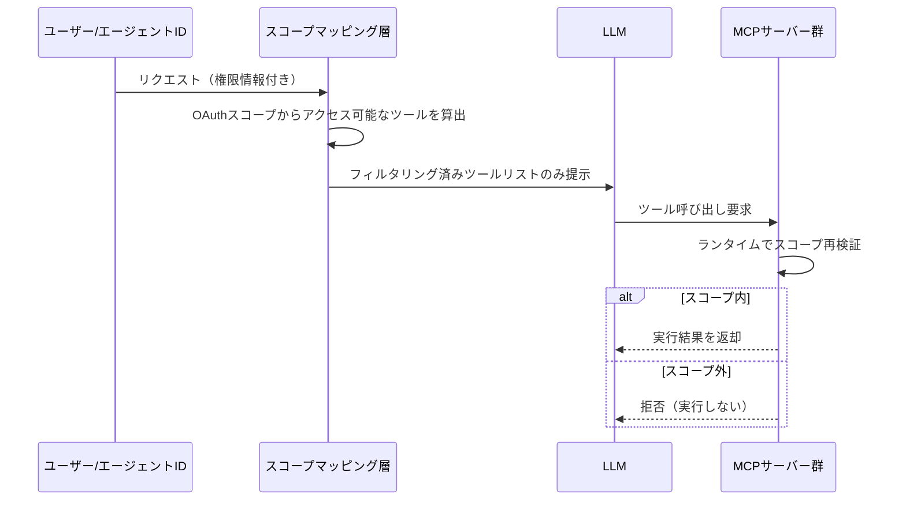
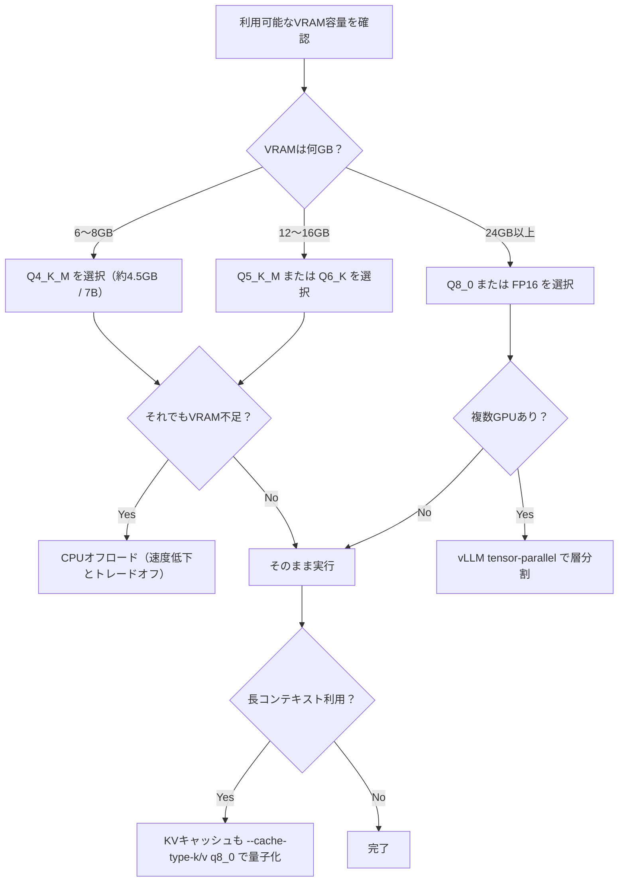
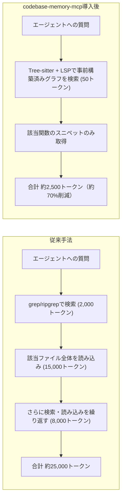

# Daily Briefing 2026-09-02

## 1. Okta、MCPスコーピングでAIエージェントのトークンコストに挑む（原題: Okta targets AI agent token costs with MCP scoping）

- **URL**: https://michaelbriancotter.wordpress.com/2026/08/13/okta-targets-ai-agent-token-costs-with-mcp-scoping/
- **公開日**: 2026-08-13
- **著者・媒体**: Michael Brian Cotter（AI News 経由の分析記事）

### 本文翻訳

AIエージェントは各モデル呼び出しのたびに、接続されているすべてのMCP（Model Context Protocol）サーバーのツールスキーマ——名前・説明・パラメータ定義——をコンテキストに読み込む。Oktaはこれを「ツールタックス（tool tax）」と呼ぶ。エージェントに数十のMCPサーバーを接続すると、実際に使うツールがそのうちごく一部であっても、全ツールのスキーマがトークンとして毎回課金される。

Oktaが提案するのは「identity-scoped」なMCPツールリストである。エージェントIDと、それに紐づくユーザーの実際の権限を使い、モデルにツールリストが届く前の段階でフィルタリングする。具体的には、MCPサーバーが公開する各ツールを、それを解放するOAuthスコープにマッピングする。例えば、ヘルプデスクの読み取り専用ユーザーには参照系ツールのみ、オペレーターには操作系ツールも含め、アプリ管理者・ブランド/メール管理者・スーパー管理者にはさらに広いスコープのツールを、といった具合にユーザーセグメントごとにツールカタログを絞り込む。

Oktaの内部検証では、パーミッションのシナリオによってはモデルに見えるツール数を90%以上削減できたと報告されている。ツール数が減れば、それに比例してツールスキーマ分のトークンコストも同様の割合で削減される。

この仕組みはセキュリティ上のチェックポイントを二段階持つ。第一段階はエージェントのプロンプト生成時——モデルに提示するツールリスト自体を、ユーザーの権限に基づいて事前にフィルタリングする。第二段階はツール実行時のランタイムチェックで、たとえモデルが（ハルシネーションなどにより）権限外のツールを呼び出そうとしても、実行層で拒否される。

Oktaはこれを単なるコスト最適化ではなく、セキュリティ強化策としても位置づけている。侵害されたアイデンティティが持つ「blast radius（被害範囲）」を、そもそもモデルに見せるツールの数を絞ることで小さくできるという主張である。トークン削減とセキュリティ強化が同じ実装で同時に達成される点が、この記事の核心的な主張になっている。

### 重要ポイント

- MCPのツールタックス＝接続中の全MCPサーバーのツールスキーマがモデル呼び出しごとにトークンとして課金される問題
- 解決策は「ツールを OAuth スコープにマッピングし、ユーザー権限に応じてモデルに見せるツールリスト自体を事前フィルタリングする」こと
- 一部の権限シナリオで可視ツール数を90%以上削減、トークンコストもほぼ同じ割合で削減
- フィルタリングは「プロンプト生成時」と「ツール実行時」の二段階で行い、コスト削減とセキュリティ強化を両立
- 具体的なドル単位のコスト削減額は非公開だが、削減率としては大きなインパクトを示す事例

### 図解



### 現場での適用方法

**スクリプト化の例（MCPツールリストをロール別に事前フィルタリングするプロキシ）**

```bash
#!/usr/bin/env bash
# mcp-scope-proxy.sh
# 役割ごとのツール許可リスト（role -> 許可するツール名のプレフィックス）を
# 定義したYAMLを読み、MCPサーバーへのtools/list応答をその場でフィルタする。
#
# 使い方: ROLE=readonly ./mcp-scope-proxy.sh <REPO_PATH>/mcp-scopes.yaml

set -euo pipefail

SCOPE_FILE="${1:?scope yaml path required}"
ROLE="${ROLE:?set ROLE env var, e.g. readonly / operator / admin}"

# 例: mcp-scopes.yaml
# readonly: ["search_*", "read_*", "list_*"]
# operator: ["search_*", "read_*", "list_*", "update_*"]
# admin:    ["*"]

python3 - "$SCOPE_FILE" "$ROLE" <<'PY'
import sys, yaml, json

scope_file, role = sys.argv[1], sys.argv[2]
scopes = yaml.safe_load(open(scope_file))
allowed_prefixes = scopes.get(role, [])

tools = json.load(sys.stdin)["tools"]

def is_allowed(name: str) -> bool:
    return any(
        p == "*" or name.startswith(p.rstrip("*"))
        for p in allowed_prefixes
    )

filtered = [t for t in tools if is_allowed(t["name"])]
print(json.dumps({"tools": filtered}, ensure_ascii=False))
PY
```

**CLAUDE.md への追記例**

```markdown
## MCPツール利用ポリシー
- MCPサーバーを新規追加する際は、必ず `mcp-scopes.yaml` にロール別許可プレフィックスを追記すること
- 読み取り専用タスクでは `ROLE=readonly` でエージェントを起動し、書き込み系ツールをそもそもモデルに見せない
- ツール数が増えたら「1ロールにつき見せるツールは20個以内」を目安に、用途別のスコープを分割する
```

### 期待効果

該当セグメントではツール可視数が90%以上削減され、ツールスキーマ由来のトークンコストもほぼ同じ割合で削減される。加えて、モデルが誤って（あるいはプロンプトインジェクションにより）権限外の操作を試みても、ランタイム側で機械的に拒否できるためセキュリティも向上する。

### 注意点

- OAuthスコープとツールの対応表をあらかじめ設計・保守するコストが発生する。ツールが増えるたびにマッピングの更新が必要
- スコープを絞りすぎると、エージェントが正当な理由でツールにアクセスできず失敗するケースが増える。監視してスコープを調整するループが必要
- 記事では絶対的なトークン削減量やコスト削減額（ドル）は非公開であり、効果の大きさは環境依存であることに留意

---

## 2. Q4_K_M vs Q4_0 vs Q8_0：LLM量子化徹底解説（原題: Q4_K_M vs Q4_0 vs Q8_0: LLM Quantization Explained）

- **URL**: https://www.promptquorum.com/local-llms/llm-quantization-explained
- **公開日**: 2026-08-27（最終更新）
- **著者・媒体**: Hans Kuepper（PromptQuorum創設者）

### 本文翻訳

ローカルLLMをどの量子化レベルで動かすべきかは、VRAM容量から機械的に決められる。記事の結論は明快で、6〜8GB VRAMならQ4_K_M（7Bモデルで約4.5GB、品質低下1〜3%）、16GBならQ5_K_M、24GB以上ならQ8_0が標準推奨とされる。

量子化レベルの比較表では、Q2_K（2bit、約2.7GB、品質低下大）からQ8_0（8bit、約7.7GB、品質低下は無視できるレベル）まで整理されている。モデルサイズ別では、7BモデルはFP16で約14GBがQ4_K_Mで約4.5GBに、70BモデルはFP16で約140GBがQ4_K_Mで約40GBに圧縮される。

重要なのはQ4_0とQ4_K_Mの違いだ。Q4_0は古い均一4bit形式で、現在は互換性のためだけに存在する。一方Q4_K_Mは2023年に導入されたK-Quant方式で、感度の高いレイヤーだけを部分的に高精度（6bit相当）に保持することで、同じRAM占有率のままQ4_0より品質が5〜8%向上する。「Q4_0をQ4_K_Mの代わりにダウンロードしてしまう」ことが、記事が挙げる典型的な失敗の一つである。

ベンチマークとしてはMMLUでの比較が示されており、FP16で73%のスコアのモデルはQ4_K_Mで71〜72%に低下する程度（1〜3%減）。Q3_K_Sまで落とすと5〜10%の低下となり、特に複雑な推論・数学タスクで劣化が目立つ。Q8_0はFP16との差が0.5%未満で、実質ロスレスとして扱える。

VRAMが足りない場合はCPUオフロードが可能だが、速度とのトレードオフが生じる。例としてRTX 4090（24GB）で70B・Q4モデルを動かす場合、35GBが必要となり、80%をシステムRAMにオフロードすると5〜10トークン/秒まで低下する。複数GPUに層を分割する方法（vLLMの`--tensor-parallel-size`）を使えば、RTX 4090を2枚使って70Bモデルを約100トークン/秒で動かせる。

長いコンテキスト（32Kトークン以上）を扱う場合はKVキャッシュの量子化も重要で、`llama.cpp`では`--cache-type-k q8_0 --cache-type-v q8_0`のようなオプションでメモリを約50%削減できる。記事末尾では地域別の規制文脈（EUのGDPR、日本のAI統治ガイドライン、中国の生成AI規制）にも触れ、量子化がクラウドAPI依存を減らしローカライゼーション要件を満たす手段になるとしている。

### 重要ポイント

- VRAM容量から量子化レベルを機械的に決める：6〜8GB→Q4_K_M、16GB→Q5_K_M、24GB以上→Q8_0
- Q4_0（古い均一量子化）とQ4_K_M（K-Quant）は別物。同じ4bitでもQ4_K_Mの方が5〜8%高品質
- Q4_K_M程度の量子化なら品質低下は1〜3%に収まり、実用上ほぼ問題にならない
- VRAM不足時はCPUオフロードで動くが速度が大きく落ちる（例: 5〜10トークン/秒）。複数GPUのテンソル並列で高速化可能
- 長コンテキスト利用時はモデル本体だけでなくKVキャッシュ側の量子化（`--cache-type-k/v q8_0`）も効く

### 図解



### 現場での適用方法

**スクリプト化の例（VRAM検出→推奨量子化を自動選択してollamaで起動）**

```bash
#!/usr/bin/env bash
# choose-quant.sh
# NVIDIA GPUのVRAM容量を検出し、推奨量子化レベルでモデルを起動する。
# 使い方: ./choose-quant.sh <MODEL_NAME_BASE>  例) ./choose-quant.sh llama3.3:70b

set -euo pipefail
MODEL_BASE="${1:?model base name required, e.g. llama3.3:70b}"

VRAM_MB=$(nvidia-smi --query-gpu=memory.total --format=csv,noheader,nounits | head -1)
VRAM_GB=$(( VRAM_MB / 1024 ))

if   (( VRAM_GB <= 8 ));  then QUANT="q4_K_M"
elif (( VRAM_GB <= 16 )); then QUANT="q5_K_M"
else                            QUANT="q8_0"
fi

echo "Detected VRAM: ${VRAM_GB}GB -> using quant: ${QUANT}"

# 長コンテキストを使う場合はKVキャッシュも量子化
ollama run "${MODEL_BASE}-${QUANT}" \
  --parameter num_ctx 32768
```

**CLAUDE.md への追記例**

```markdown
## ローカルLLM利用時のデフォルト方針
- ローカルLLM（llama.cpp / ollama）でコーディング補助を行う際は、`<REPO_PATH>/scripts/choose-quant.sh` を実行し、
  VRAM容量に応じたQ4_K_M/Q5_K_M/Q8_0のいずれかを自動選択すること
- Q4_0（旧形式）は選択しない。同じ4bitでもQ4_K_Mの方が品質が高い
- 32K以上のコンテキストを扱うタスクでは `--cache-type-k q8_0 --cache-type-v q8_0` を必ず付与する
```

### 期待効果

適切な量子化レベル（Q4_K_M〜Q8_0）を選ぶことで、7Bモデルなら約4.5〜7.7GBのVRAMで品質低下1%未満〜3%程度に抑えつつローカル実行が可能になる。70Bクラスでも複数GPUのテンソル並列で約100トークン/秒の実用速度を確保できる。KVキャッシュ量子化を併用すれば長コンテキスト時のメモリを約50%削減できる。

### 注意点

- Q4_0とQ4_K_Mを混同してダウンロードすると、同じファイルサイズでも品質が5〜8%低下する
- CPUオフロードは動作はするが速度が大きく落ちる（例のケースで5〜10トークン/秒）ため、常用には向かない
- 「量子化レベルが高い（bit数が多い）ほど常に品質が高い」という単純な思い込みは誤り。用途（コーディング/数学等）によって適切なレベルが変わる点に注意
- 記事内のMac Studio M5 Ultra関連の単体ベンチマークは2026年9月22日のチップ発売後に公開予定であり、本記事執筆時点では未検証の情報として扱うこと

---

## 3. AIコーディングエージェントのトークン浪費を70%削減した方法（原題: How I Reduced AI Coding Agent Token Waste by 70%）

- **URL**: https://journal.hexmos.com/token-reduction-tools/
- **公開日**: 2026-08-30
- **著者・媒体**: Ganesh Kumar / Hexmos Journal

### 本文翻訳

AIコーディングエージェントは、簡潔な質問に対しても不必要に大量のコードを読み込む傾向がある。例えば500ファイル・10万行規模のリポジトリで「`GetUser()`の呼び出しチェーンを追跡して」と指示すると、エージェントはgrep/ripgrepで検索し、該当ファイルを丸ごと読み込み、さらに次の呼び出し先を検索して読み込む……という手順を何ステップも繰り返す。この従来手法のトークン消費は概算で、検索2,000＋ファイル読み込み15,000＋検索結果5,000＋推論3,000＝合計25,000トークンにも達する。

この問題に対する筆者の解決策が「codebase-memory-mcp」である。これはローカルのコードパーサー、静的解析層、グラフデータベース、MCPサーバーを統合したツールで、Tree-sitterでコードを解析し「Function: GetUser」「Call: GetUser → repository.FindUser」といった構造情報を事前にグラフとして構築しておく。中核となる考え方は「決定論的な事実は一度だけ計算し、AIに毎回再発見させない」というものだ。計算コストを一度きりに抑え、以降は安価なグラフクエリで済ませる。

Tree-sitter単体では構文木（AST）しか得られないため、LSP（Language Server Protocol）と組み合わせるハイブリッド構成を取り、意味的なターゲット（実際にどの定義を指しているか）まで正確に解決する。構築したグラフはローカルに保存され、MCPツール経由で「検索」「呼び出しチェーンのトレース」「アーキテクチャ分析」「影響範囲分析」「グラフクエリ」「デッドコード検出」などの機能として公開される。

効果は顕著で、テキスト検索1ステップ（約1,500トークン）がグラフ検索（約50トークン）に置き換わり、その部分だけで97%の削減となる。タスク全体で比較すると、従来のテキスト検索＋ファイル全読み込みが約9,000トークンなのに対し、グラフ検索＋該当関数スニペットのみの読み込みでは約2,500トークンとなり、全体で約70%の削減を達成した。リポジトリが大きくなるほど、この削減効果は指数関数的に拡大するという。

導入は`curl`でインストールスクリプトを実行し、Claude Codeの`/mcp`コマンドでプロジェクトをインデックスさせるだけ。グラフを可視化するUIも`--ui=true --port=9749`オプションで起動できる。

補完的なツールとして「rtk」も紹介されている。これはMCPではなく、`git status`・`git diff`・`git log`・`rg`（ripgrep）・`go test`・`docker ps`といったシェルコマンドの出力そのものを圧縮するツールで、例えば`go test`では成功したパッケージを省略し失敗のみを表示する。grep検索の実例では、元の出力6,065バイトが2,972バイトまで圧縮され、51%の削減となった。ただしClaude Codeのネイティブツール（Read/Grep等）には未対応で、Bashコマンド経由の呼び出しにのみ効く点には注意が必要である。

### 重要ポイント

- AIエージェントは簡単な質問でも「検索→ファイル全読み込み→再検索」を繰り返し、1タスクで数万トークンを浪費しがち
- codebase-memory-mcp（Tree-sitter＋LSP＋グラフDB＋MCP）により、コード構造の「決定論的事実」を事前計算し再利用することでトークンを大幅削減
- 検索ステップ単体で約97%削減、タスク全体では約70%削減という実測値
- 呼び出しチェーンのトレースやアーキテクチャ分析、影響範囲分析、デッドコード検出などもMCPツールとして提供される
- 補完ツール「rtk」はシェルコマンド出力を最大51%程度圧縮できるが、Bashツール経由の呼び出しにのみ対応（ネイティブReadやGrepには効かない）

### 図解



### 現場での適用方法

**運用手順（codebase-memory-mcp の導入とインデックス作成）**

```bash
# 1. インストール
curl -fsSL https://raw.githubusercontent.com/DeusData/codebase-memory-mcp/main/install.sh | bash

# 2. Claude Code内でMCPサーバーとして登録
#    Claude Code のプロンプトで以下を実行
#    /mcp
#    → "Index this project" を選択してインデックス作成を待つ

# 3. （任意）グラフ可視化UIを起動して構造を確認
codebase-memory-mcp --ui=true --port=9749
# ブラウザで http://localhost:9749 を開く
```

**CLAUDE.md への追記例**

```markdown
## コードベース調査時のルール
- 呼び出しチェーンの追跡・影響範囲分析・デッドコード検出を行う際は、
  grep + Read の全文検索ではなく、codebase-memory-mcp のグラフクエリツールを優先すること
- 大規模ファイルを丸ごと読み込む前に、まず codebase-memory-mcp で対象関数のスニペットのみを取得できないか確認する
- シェルコマンド（git status / git diff / git log / rg / go test / docker ps 等）を実行する際は、
  可能であれば `rtk` 経由で実行し、出力を圧縮してからコンテキストに載せる
```

**スクリプト化の例（rtk 経由での圧縮実行ラッパー）**

```bash
#!/usr/bin/env bash
# rtk-wrap.sh: 対応コマンドはrtk経由、非対応コマンドは素通し
# 使い方: ./rtk-wrap.sh git status

CMD="$1"; shift
case "$CMD" in
  git|rg|go|docker)
    rtk "$CMD" "$@"
    ;;
  *)
    "$CMD" "$@"
    ;;
esac
```

### 期待効果

コード構造をグラフとして事前計算・再利用することで、検索ステップ単体では約97%、タスク全体では約70%のトークン削減を達成できる。大規模リポジトリほど削減効果が大きくなる（指数関数的に拡大）とされ、シェルコマンド出力の圧縮（rtk）と組み合わせればさらに追加の削減（例のケースで51%）が見込める。

### 注意点

- codebase-memory-mcpの初回インデックス作成にはコストがかかり、リポジトリ構造が大きく変わった場合は再インデックスが必要
- Tree-sitter＋LSPのハイブリッド構成のため、対応言語・LSPサーバーの整備状況に導入の可否が左右される
- rtkはClaude Codeのネイティブツール（Read/Grep等）には効かず、Bash経由のコマンド実行にのみ適用される点に注意
- 数値（97%・70%・51%削減）はいずれも著者の実測例であり、リポジトリ規模や言語構成によって効果は変動する
