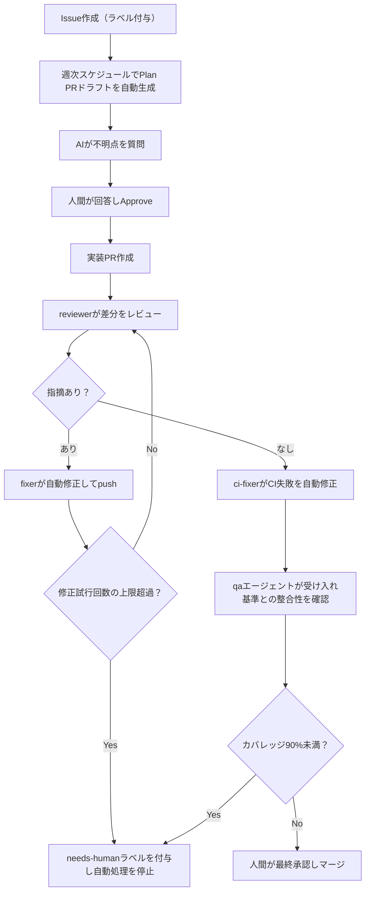
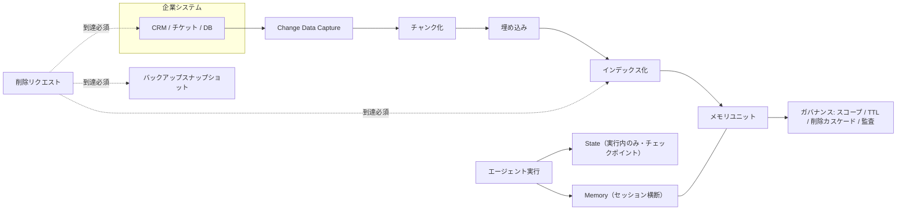
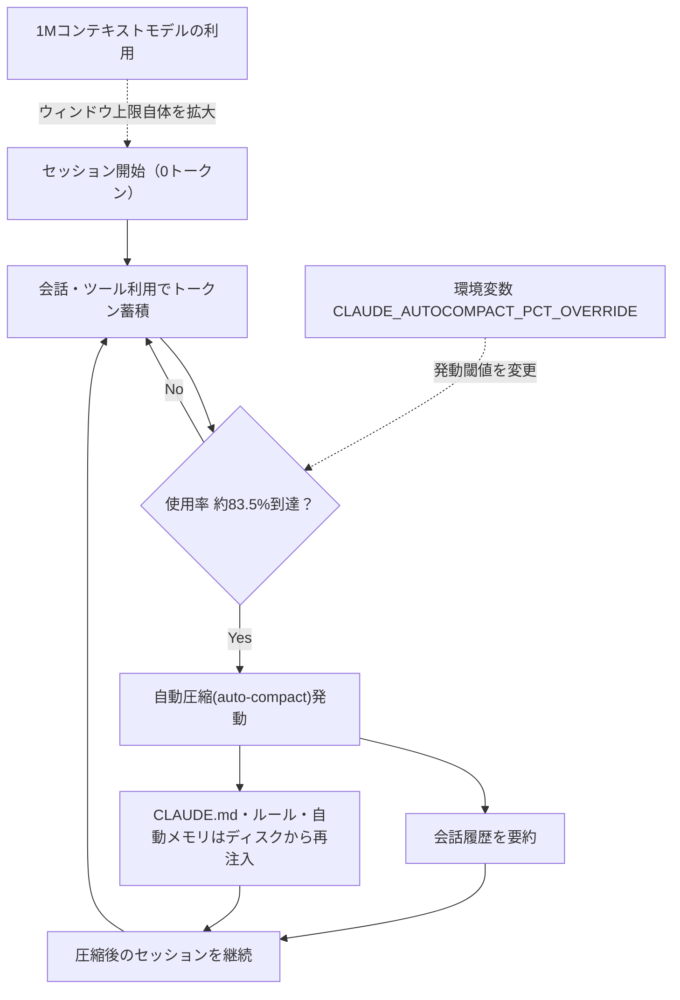

# Daily Briefing 2026-09-03

## 1. Claude Codeで個人開発を1ヶ月やって、たどり着いた開発プロセスの話

- **URL**: https://qiita.com/ebichan_88/items/eead0724e9b5eb0d0120
- **公開日**: 2026-08-14（最終更新: 2026-08-18）
- **著者・媒体**: Takashi Ebina（@ebichan_88）／Qiita

### 本文翻訳

著者は囲碁・将棋のスイス方式トーナメント運営Webアプリを個人開発するにあたり、AI駆動開発に関する情報が氾濫する中で「何から手を付ければよいか分からない」という状況に直面した。そこで、AIに開発を委譲しながら品質を保ち手戻りを減らす仕組みを、困るたびに継ぎ足す形で1ヶ月かけて構築した記録がこの記事である。

出発点は基礎設計ドキュメントの整備だった。ChatGPTに「ステップバイステップで質問してほしい」と依頼して要件を壁打ちし、プロジェクト・技術設計・デザイン・ライブラリに関するドキュメントを計28本、実装前に用意した。この結果、着手1週間でマッチングロジックからAPI・画面・E2Eテストまで一通り動く状態に到達でき、「困る前に仕組みを入れすぎない」という後の判断方針の基礎になった。

次に導入したのがPRの自動レビューだが、当初は「AIの指摘を人間が読み、コピペしてAIに修正を依頼する」往復が発生し、著者は自らを「転記係」と表現するに至った。対策として、指摘を出すreviewerと、指摘を修正してpushするfixerの2段階構成に分離。あわせて修正試行回数に上限を設け、超過時はneeds-humanラベルを付けて自動処理を止める安全弁を用意した。CI失敗を自動修正するci-fixerも追加している。

任せる範囲が広がるにつれ品質不安も強まったため、カバレッジレポートをPRに自動コメントし、マッチング・順位計算などコアロジックはLINE・BRANCHともに90%以上をCI必須要件にした。さらに「同値分割」「境界値分析」「2因子間網羅」「デシジョンテーブル」「状態遷移テスト」といったテスト技法名を文書化し、AIへの指示を「ちゃんとテストして」ではなく技法名で行えるようにした。受け入れ基準は「コンポーネント-AC-3桁連番」というIDで台帳化し、テストとの対応を機械的にチェックするqa・qa-fixerエージェントを設けた。

UIは何度も作り直しが発生したが、原因は著者自身が要求を言語化できていなかったことだった。対策として、計画テンプレートに「通常/空/ローディング/エラーの4状態」などのUI仕様を必須項目化し、実装前にStorybookでモックを合意、PlaywrightによるVisual Regression Testで意図しない見た目の変化を検知するようにした。

任せる範囲の拡大に伴い、「AIに帳尻合わせをさせない」ルールも必要になった。アサーション削除など自動修正コミットによるテスト弱体化を機械的にブロックし、マッチングロジックやAPI仕様（schema/openapi.yaml）は自動修正対象から除外、カバレッジ不足は自動修正させず人間に回付する運用とした。

コスト面では、修正系エージェントを軽量モデルに切り替え、ドキュメントのみの変更PRではAIレビューとE2Eをスキップして最適化した。

最後に、Claude CodeのPlanモードの会話が終了後に残らないという課題に対し、コードを1行も書かず計画・ドキュメントのみを扱う「Plan PR」を導入し、AIの質問に人間が答えてApproveした後にのみ実装を開始する運用に落ち着いた。特定ラベル付きIssueに対しては週次スケジュールで自動的にPlan PRのドラフトが作成される。最終的な開発フローは「要件を書く→質問に答える→PRをApproveする」という3ステップにまで簡潔化され、著者自身が直接コードを書くことはなくなった一方、品質保証の仕組みを設計する部分にはなお人間の関与が不可欠であると結論づけている。

### 重要ポイント

- reviewer/fixerの2段階構成＋修正試行回数の上限とneeds-humanラベルによる安全弁で「AIの指摘を人間が転記する」往復を解消
- コアロジックのカバレッジ90%必須化とテスト技法名の明文化により、AIへの指示語彙を統一
- 受け入れ基準の台帳化（コンポーネント-AC-3桁連番）とqa/qa-fixerエージェントによる機械的な整合性チェック
- UI仕様を計画テンプレートに必須項目化＋StorybookでのVisual Regression Testで見た目の手戻りを防止
- 「Plan PR」の導入により計画を会話ではなく成果物として残し、週次の自動ドラフト生成まで実現

### 図解



### 現場での適用方法

**CLAUDE.md への追記例**

```markdown
## 品質保証ルール（サブエージェント運用）
- PRレビューは reviewer → fixer の2段階で行う。reviewerが出した指摘をfixerが自動修正してpushする
- fixerの自動修正は最大3回までとし、3回を超えて指摘が解消しない場合は `needs-human` ラベルを付与して自動処理を停止する
- コアロジック（<CORE_LOGIC_DIR>）は LINE・BRANCH ともにカバレッジ90%以上をCI必須要件とする
- テストケースの洗い出しは「同値分割」「境界値分析」「2因子間網羅」「デシジョンテーブル」「状態遷移テスト」の技法名で指示すること（「ちゃんとテストして」という曖昧な指示は禁止）
- 受け入れ基準は `<コンポーネント>-AC-<3桁連番>` のIDで管理し、対応するテストが存在するかを機械チェックする
- 自動修正コミットでアサーションの削除・弱体化を検知した場合は即座にブロックする
- 以下のファイルは自動修正の対象外とする：<CORE_LOGIC_DIR>, <API_SCHEMA_PATH>
```

**スクリプト化の例（fixerの再試行上限とneeds-human付与）**

```bash
#!/usr/bin/env bash
# fixer-loop.sh
# reviewerの指摘をfixerエージェントに渡し、CIが通るまで最大MAX_RETRIESまで繰り返す。
# 超過時はneeds-humanラベルを付与して停止する。
# 使い方: ./fixer-loop.sh <PR_NUMBER>

set -euo pipefail

PR_NUMBER="${1:?PR number required}"
MAX_RETRIES=3
attempt=0

while (( attempt < MAX_RETRIES )); do
  attempt=$((attempt + 1))
  echo "Fix attempt ${attempt}/${MAX_RETRIES} for PR #${PR_NUMBER}"

  FINDINGS=$(gh pr view "$PR_NUMBER" --json comments -q '.comments[-1].body')
  claude -p "以下のreviewerの指摘を修正してpushしてください:\n${FINDINGS}" \
    --allowedTools "Edit,Bash(git push:*)"

  if gh pr checks "$PR_NUMBER" --json name,conclusion \
      -q 'all(.conclusion == "success")' 2>/dev/null; then
    echo "All checks passed."
    exit 0
  fi
done

echo "Retries exhausted. Flagging for human review."
gh pr edit "$PR_NUMBER" --add-label "needs-human"
exit 1
```

### 期待効果

著者は個人開発でコードを直接書く工程がほぼゼロになり、開発フローが「要件を書く→質問に答える→PRをApproveする」の3ステップに収束した。カバレッジ90%維持やVisual Regression Testによる手戻り検知など、品質基準を保ったままAIへの委譲範囲を段階的に広げられた点が最大の成果である。

### 注意点

- 記事は個人開発（1人称・小規模）の事例であり、チーム開発での合意形成コストは別途検討が必要
- 技術スタック（Java/Spring Boot/React想定）に依存した設計であり、他スタックには調整が必要
- 週次スケジュール実行の具体的な実装や、Claude Codeセッションのキャプチャ共有などの詳細は記事内で省略されている
- 「触らせない領域」の設定や修正試行回数の上限は、プロジェクトのリスク許容度に応じて調整すべき

---

## 2. ハーネス内のエージェントメモリ（原題: Agent Memory Inside the Harness）

- **URL**: https://www.mongodb.com/company/blog/technical/agent-memory-inside-harness
- **公開日**: 2026-08-18
- **著者・媒体**: Mikiko Bazeley, Ashish Kumar, Charlie Xu, Walter Tan, Mayuresh Kulkarni／MongoDB Company Blog（Designing an Agentic Platform シリーズ第5部）

### 本文翻訳

本記事は、エージェントメモリを本番環境で動作する「インフラストラクチャ」として扱う視点から出発する。これまでのシリーズがメモリ階層の理論を扱ってきたのに対し、本稿はメモリが本番運用に入った際に何になるか——コンテキストウィンドウが溢れた時にツールスキーマや推論トレースと一緒に圧縮され、他の本番アーティファクトと同様にバージョン管理・ガバナンスされ、誰も移行するつもりのないエンタープライズシステムから供給され、個々のユニット単位でアクセス制御される対象——を論じる。記事は「コンテキストウィンドウが十分に大きいのでメモリシステムは不要」「メモリは学習時にモデルの重みへ組み込まれる」という2つの主張を退ける。長いコンテキストはセッションごとにリセットされ、満杯になれば劣化し、トークンコストは線形に増加する。また学習時に習得した知識は今日の顧客レコードを取り込めず、明日のリクエストで削除することもできない。

第一の論点は「State（状態）」と「Memory（メモリ）」の区別である。Stateは単一実行に紐づき監査重視でチェックポイントからの再開に使われるのに対し、Memoryはセッションを横断する無期限の知識であり、キュレーション・学習・抽出によって作られ、PIIやRBACに関わるガバナンスを要し、新規実行に情報を与える役割を持つ。チェックポイントに永続化すること自体はメモリを作らない、というのが最もよくある設計上の誤りだと指摘する。

第二の論点はコンテキスト圧縮（compaction）が構造的に情報損失を伴うという点である。Chroma社の研究では、検証した18モデルすべてが入力サイズの増加とともに劣化し、しかも劣化はなだらかではなく、一定水準を保った後に崖のように急落する。圧縮は品質面（過度な要約による制約の欠落、異常フラグの集約による見落とし）とコスト面（繰り越されたトークンの再課金、出力トークンが入力より高コストであることによる追加ターンの誘発）の両方を左右する。実装としては、多くのチームが使用率約95%での自動トリガーを採用する一方、監視の厳しいチームは約60%で能動的に圧縮する。新しい代替案として、自動圧縮そのものをやめ、各サブエージェントに親から渡された分だけをシードした新しいウィンドウを与え、結果のみを呼び出し元に返すことでメインスレッドのトークンコストを抑える方式も紹介されている。

第三の論点は、システムプロンプトとスキルを「バージョン管理・ガバナンスされたインフラ」として扱うべきだという主張である。プロンプトの変更はコードの変更と同じくらい挙動を左右するため、バージョニング・変更前の評価（eval-gating）・秒単位のロールバックが必要になる。スキルは「手続き的メモリ」であり、SKILL.md標準を通じて主要コーディングエージェント全体で採用が進んでいる。エージェントがワークフローを完了した際にそれを再利用可能なスキルとして書き出す新しいパターンも登場しており、これは他のメモリと同じバージョニングとアクセス制御を要する。ただしスキルは実行可能コードであるため、信頼できないスキルは悪意あるコードと同じ挙動を取り得るというガバナンス上のリスクがあり、サンドボックス実行による防御が必要になる。

第四の論点はエンタープライズデータのメモリ化がワンタイムの移行ではなくパイプラインであるべきだという点だ。Change Data Captureによる継続的な変更検知、チャンク化、埋め込み、インデックス化を経て「メモリユニット」が生成され、各ユニットにはユーザー/テナントスコープ、保持期間・TTL、削除カスケード、監査・出典情報が紐づく。埋め込みモデルは「スキーマの一部」であり、モデルを置き換えることはコーパス全体の再埋め込みを意味する。削除リクエストはソース行・ベクトルインデックス・バックアップスナップショットのすべてに到達しなければならず、コンプライアンス上の削除は即時性が、通常のソース変更由来の削除は結果整合性が許容される、という区別も重要だとする。

最後に記事は、フィルタ済みリコール・一貫性・時間的モデリングという3つの上限が、初日に選んだデータベースによって設定されると結論づける。前フィルタリングはグラフ構造を破壊し精度を落とし、最終的な天井は「初日に選んだデータベース」で決まるという指摘は、本記事全体で最も強いメッセージとして提示されている。

### 重要ポイント

- StateとMemoryを明確に区別する。チェックポイントへの永続化はメモリを作らない
- コンテキスト圧縮は構造的に情報損失を伴う。Chroma社の研究では18モデル全てが入力増加で劣化し、なだらかではなく崖状に劣化する
- システムプロンプトとSKILL.mdはコードと同じくバージョニング・変更前評価・ロールバックの対象として運用すべき
- エンタープライズデータのメモリ化はCDC＋チャンク化＋埋め込み＋インデックス化のパイプラインとして継続的に行う。削除はソース行・ベクトルインデックス・バックアップの全てに到達させる
- フィルタ済みリコール・一貫性・時間的モデリングの上限は「初日に選んだデータベース」で決まる

### 図解



### 現場での適用方法

**CLAUDE.md への追記例（エージェントメモリ運用ルール）**

```markdown
## エージェントメモリ運用ルール
- 「State」（チェックポイント・実行中の一時データ）と「Memory」（セッションを跨いで参照する知識）を明確に分離し、別ストアで管理する
- システムプロンプト・SKILL.mdの変更はコード変更と同じ手続きを踏む：
  1. バージョン管理下に置く（Gitで差分管理する）
  2. 変更前に既存の評価セット（eval）を実行し、リグレッションがないか確認する
  3. 問題発生時は直前バージョンへ即座にロールバックできる状態を保つ
- 新しいエンタープライズデータソースをメモリに組み込む際は、ワンタイムの一括インポートではなく、CDC等による継続的なパイプラインとして設計する
- メモリユニットには必ず「ユーザー/テナントスコープ」「保持期間(TTL)」「削除カスケード」「出典(どのソース・どのバージョンか)」を付与する
- 埋め込みモデルを変更する際は、既存コーパスとの混在を避けるため、新モデルでの再埋め込み・検証・カットオーバーの3段階で移行する
```

**スクリプト化の例（削除パス監査スクリプト）**

```bash
#!/usr/bin/env bash
# deletion-audit.sh
# 指定したレコードIDの削除が、ソース・ベクトルインデックス・バックアップの
# すべてから消えているかを確認する監査スクリプト。
# 使い方: ./deletion-audit.sh <RECORD_ID>

set -euo pipefail
RECORD_ID="${1:?record id required}"

echo "== 1. ソーステーブルの確認 =="
psql "$DATABASE_URL" -c \
  "SELECT count(*) FROM <SOURCE_TABLE> WHERE id = '${RECORD_ID}';"

echo "== 2. ベクトルインデックスの確認 =="
curl -s "${VECTOR_DB_URL}/query" \
  -H "Content-Type: application/json" \
  -d "{\"filter\": {\"source_id\": \"${RECORD_ID}\"}}" | jq '.matches | length'

echo "== 3. バックアップスナップショットの確認（最新3世代）=="
for snap in $(ls -t <BACKUP_DIR> | head -3); do
  grep -l "${RECORD_ID}" "<BACKUP_DIR>/${snap}" || echo "  ${snap}: 検出されず(OK)"
done

echo "全ての箇所で件数が0であれば削除パスは健全です。"
```

### 期待効果

State/Memoryの分離とプロンプト・スキルのバージョン管理を導入することで、コンテキスト圧縮による品質劣化やトークンコスト増を可視化しつつ、プロンプト/スキル変更に起因する事故を事前に検知できる。削除監査を定例化すれば、GDPR等の「忘れられる権利」に対応する際の実装漏れ（バックアップやインデックスへの削除未反映）を防げる。

### 注意点

- 記事はMongoDB自身の製品（Atlas）を前提とした議論を含むため、他のベクトルDB/ストアでは同等機能の有無を個別に確認する必要がある
- Bi-temporalモデリングなど高度な時間的推論機能は、多くのベクトルストアでは標準対応していない
- 「初日に選んだデータベースが上限を決める」という主張の通り、後からのデータベース移行は埋め込み全体の再構築を伴う大規模作業になる
- 記事内の劣化率などの具体的な数値はChroma社の外部研究の引用であり、MongoDB独自の実測値ではない

---

## 3. Claude Codeのコンテキストバッファ：33Kトークン問題を読み解く（原題: Claude Code Context Buffer: The 33K-45K Token Problem）

- **URL**: https://claudefa.st/blog/guide/mechanics/context-buffer-management
- **公開日**: 不明（直近数週間以内。2026-09-02時点で「3時間前に更新」と確認）
- **著者・媒体**: claudefa.st（Claude Code運用ガイドサイト）

### 本文翻訳

Claude Codeは200Kトークンのコンテキストウィンドウのうち、使用不可能な「オートコンパクトバッファ」をあらかじめ確保している。2026年初頭までこのバッファは45,000トークン（全体の22.5%）だったが、現在は約33,000トークン（16.5%）に縮小されており、この変更は公式チェンジログでは明示的に告知されていない。手がかりとなるのはv2.1.21の「モデルの大きな出力トークン上限で自動圧縮が早すぎる問題を修正」という記述で、バッファの計算方法が再調整されたと推測される。この縮小により、ユーザーは実質的に約12,000トークン分の追加の作業スペースを得た形になる。

Claude Codeは会話のコンテキスト使用量を継続的に監視し、使用率が約83.5%に達すると自動圧縮（auto-compact）がトリガーされる。200Kトークンのウィンドウでは、実質使用可能なのは約167K、残りの約33Kが圧縮バッファとして予約される計算になる。圧縮が起きると会話履歴が要約され、詳細な情報の一部が失われる。ただしプロジェクトルートのCLAUDE.md、スコープなしのルール、自動メモリ（auto memory）などディスクから読み込まれた情報は、圧縮後も再注入される。

このバッファサイズ自体はハードコードされており変更できない。GitHub Issue #15435でこれを設定可能にするよう求める要望が出されたが、却下されている。一方で、圧縮が発動する「タイミング」は環境変数`CLAUDE_AUTOCOMPACT_PCT_OVERRIDE`（1〜100の値を受け付ける）で制御可能であり、例えば90に設定すればより多くの使用可能コンテキストを確保できる代わりに、要約処理用のバッファが薄くなる。逆に低い値に設定すれば圧縮が早期に発生し、作業スペースをより多く保存できる。

多くの開発者が誤解しがちなのは、`CLAUDE_CODE_MAX_OUTPUT_TOKENS`（デフォルト32K）が圧縮バッファを制御していると考えることだ。実際にはこの変数はAPIレスポンスの最大トークン数を制御するだけで、圧縮前に使える約167Kのコンテキストには影響しない。

もう一つの手段は拡張コンテキストモデルの利用である。1Mトークンのコンテキストウィンドウは料金プレミアムなしで一般提供されており、Sonnet 5はデフォルトでこれを使用する。Opus 4.6以降やSonnet 4.6では`[1m]`サフィックス（例:`sonnet-4-6[1m]`）を明示的に付ける必要がある。

`~/.claude/settings.json`で`"autoCompact": false`を設定して自動圧縮そのものを無効化することも可能だが、GitHub Issue #18264ではこの設定が無視される場合があると報告されており、不安定である。無効化する場合は、`/context`コマンドでコンテキスト使用量を手動監視し、100%に達する前に自らのタイミングで`/compact`を実行する必要がある。`/compact focus on [対象]`のように焦点を絞って要約させることもできる。

コンテキストのリアルタイムメトリクスを受け取れるのはStatusLineのみである。`remaining_percentage`フィールドの値からバッファ分（16.5%）を差し引くことで、実際に圧縮までの余裕を計算できる。またフックにはスラッシュコマンドを注入する機能がなく（`UserPromptSubmit`には`updatedPrompt`フィールドがない）、`/clear`をプログラムから発行するにはClaude Agent SDKやヘッドレスCLIラッパー経由の実装が必要になる。

記事は最終的に、バッファサイズ自体は固定であっても、セッションファイルによる状態の永続化、閾値ベースのプロアクティブなバックアップ、複雑なタスクの複数セッションへの分割といった対処法によって、このバッファと共存できると結論づけている。

### 重要ポイント

- 自動圧縮バッファは2026年初頭に45K→33Kトークン（22.5%→16.5%）へ縮小され、使用可能コンテキストは約155K→167Kに増加した
- 自動圧縮は使用率約83.5%でトリガーされる。バッファサイズ自体はハードコードで変更不可（設定可能化の要望は却下済み）
- `CLAUDE_AUTOCOMPACT_PCT_OVERRIDE`（1〜100）で圧縮の発動タイミングは調整できるが、バッファ量そのものは変わらない
- `CLAUDE_CODE_MAX_OUTPUT_TOKENS`は出力トークン上限を制御するだけで、圧縮バッファとは無関係という誤解が多い
- リアルタイムのコンテキスト監視ができるのはStatusLineのみ。フックは`/clear`のようなスラッシュコマンドを注入できない

### 図解



### 現場での適用方法

**環境変数設定の例**

```bash
# <REPO_PATH>/.envrc または起動シェルに追記
# 長時間の複雑なセッションでは早めに圧縮させ、要約用の余裕を厚く持たせる
export CLAUDE_AUTOCOMPACT_PCT_OVERRIDE=70

# 逆に「1ターンで完結させたい大きめの作業」では上限側に振る
# export CLAUDE_AUTOCOMPACT_PCT_OVERRIDE=90
```

**スクリプト化の例（StatusLineで実質残量を可視化）**

```javascript
// <REPO_PATH>/.claude/hooks/context-monitor.mjs
// StatusLineからのみ得られるremaining_percentageを使って、
// 実際に自動圧縮までどれだけ余裕があるかを可視化する。
const AUTOCOMPACT_BUFFER_PCT = 16.5;

let raw = "";
for await (const chunk of process.stdin) raw += chunk;
const input = JSON.parse(raw);

const remaining = input.context?.remaining_percentage ?? 0;
const freeUntilCompact = Math.max(0, remaining - AUTOCOMPACT_BUFFER_PCT);

console.log(`残り実質コンテキスト: ${freeUntilCompact.toFixed(1)}%（圧縮まで）`);
```

```json
// .claude/settings.json
{
  "statusLine": {
    "type": "command",
    "command": "node \"$CLAUDE_PROJECT_DIR/.claude/hooks/context-monitor.mjs\""
  }
}
```

**CLAUDE.md への追記例**

```markdown
## 長時間セッションでのコンテキスト運用ルール
- 主要機能の実装が完了した節目、または新しいコンポーネントに着手する直前に `/compact focus on <対象>` を実行し、圧縮によるロスを人間が制御する
- 自動圧縮に任せきりにしない。`/context` で使用率を確認し、80%を超えたら次の区切りで手動 `/compact` を検討する
- 複雑なタスクは1セッションで完結させようとせず、状態を `<REPO_PATH>/.claude/sessions/*.md` に書き出してから `/clear` し、次セッションで再読込する
- 1Mコンテキストが必要な大規模タスクでは `sonnet-5` を明示指定するか、`[1m]` サフィックス付きモデルを使う
```

### 期待効果

バッファの仕組みを理解し閾値を調整することで、圧縮タイミングを自らコントロールし、重要な文脈（認証まわりの決定事項など）が意図せず要約で失われるリスクを減らせる。StatusLineでの可視化により「あと何%で圧縮されるか」を常時把握しながら作業を区切れるようになる。

### 注意点

- `CLAUDE_AUTOCOMPACT_PCT_OVERRIDE`を100に近づけすぎると、要約処理自体のバッファが不足しセッションが不安定になるリスクがある
- `autoCompact: false`は既知の不具合（Issue #18264）があり、無効化中は100%到達時のクラッシュに自己責任で備える必要がある
- バッファサイズの変更（45K→33K）は非公式のClaude Codeアップデートに起因する観測であり、Anthropic公式のチェンジログには明記されていないため、将来的にさらに変更される可能性がある
- フックによる`/clear`の自動注入はサポートされておらず、完全自動化にはClaude Agent SDKやヘッドレスCLIラッパーの追加実装が必要
