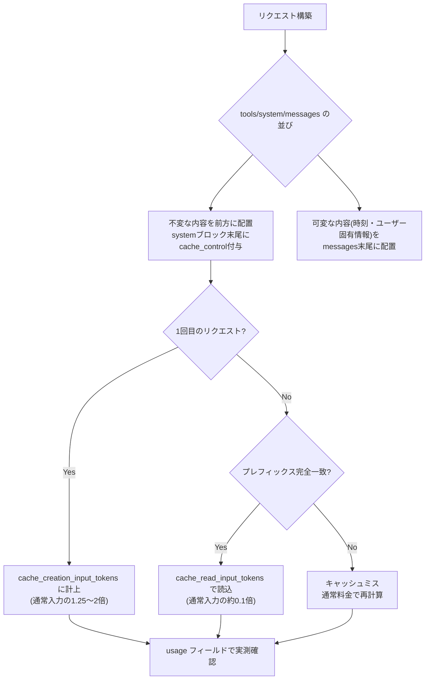
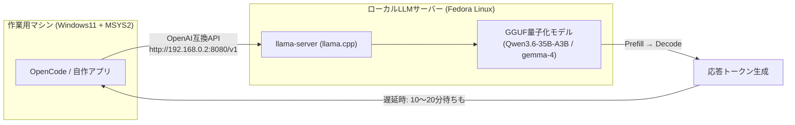
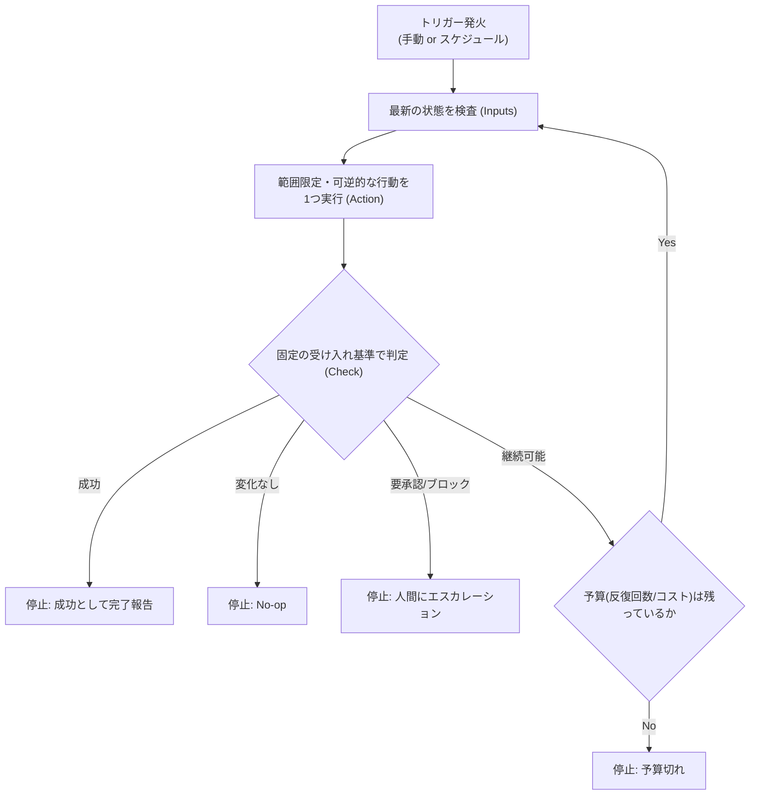

# Daily Briefing 2026-09-04

## 1. Claude APIのプロンプトキャッシュで入力コストを最大9割削減する実装手順（原題: Claude API のプロンプトキャッシュ(prompt caching)で入力コストを最大9割削減する実装手順 — 1024トークン未満は黙って無視される等3つのハマりどころ【2026】）

- **URL**: https://qiita.com/yureki_lab/items/597241551c27c843295f
- **公開日**: 2026-09-02
- **著者・媒体**: @yureki_lab（Qiita）

### 本文翻訳
筆者は、毎回ほぼ同じシステムプロンプトや長い参照ドキュメント（約8,000トークン）をリクエストごとに送信するPythonアプリケーションに、Claude APIのプロンプトキャッシュを導入したところ、入力コストが実測でほぼ9割削減されたと報告している。対象読者はPython 3.13・anthropic SDK 0.7系・claude-sonnet-5を使う開発者。

実装自体はシンプルで、システムプロンプトの最後のコンテンツブロックに `"cache_control": {"type": "ephemeral"}` を1行付けるだけでプレフィックスがキャッシュされる。1回目のリクエストではキャッシュ書き込み分が `usage.cache_creation_input_tokens` に計上され、2回目以降は `cache_read_input_tokens` として通常入力料金の約0.1倍で読み出される。筆者は「この2つのフィールドを見ずに『付けたからOK』と思い込むのが一番危ない」と、実測確認の重要性を強調する。

記事の核心は「3つのハマりどころ」だ。第一に、キャッシュには最小トークン数があり（Claude Opus 5は512、Sonnet 5/Opus 4.8は1,024、Opus 4.7は2,048、Opus 4.6/Haiku 4.5は4,096）、これを下回るとエラーなく静かにキャッシュが作られない。筆者自身、3,000トークン弱のプロンプトをHaiku 4.5でキャッシュしようとして「いくら待ってもreadが0のままで悩んだ」経験を明かしている。モデルを切り替えるとこの閾値も変わるため、切り替え時は必ずusageを再確認すべきという。

第二に、キャッシュは完全なプレフィックス一致で判定されるため、1バイトでも変化があると後続がすべてキャッシュミスになる。リクエストごとにタイムスタンプを埋め込んだり、`sort_keys` なしでJSONをシリアライズしたりすると、キー順序が不確定になり毎回キャッシュが壊れる。対策は「不変なものを前、変わるものを後ろ」という原則を徹底し、動的な情報（現在時刻など）はキャッシュ境界より後ろ、つまりmessagesの末尾側に配置すること。JSONには `sort_keys=True` を付けて決定的な出力にする。

第三に、Claudeの内部レンダリング順序は `tools` → `system` → `messages` であるため、ツールを1つ追加・削除・並び替えするだけで、system以降のキャッシュも道連れで全滅する。対策としてツールセットは固定し名前順にソートすること、「モード切り替え」をツールセットの差し替えで表現しないこと、モデル切り替え時もキャッシュはモデル単位で別物になる点に注意することを挙げている。

料金面では、キャッシュ書き込みは通常入力の1.25倍（5分TTL）または2倍（1時間TTL）、読み取りは約0.1倍。5分TTLは2リクエスト目で損益分岐（1.25+0.1=1.35倍 < 通常2回分の2倍）し、1時間TTLは書き込みコストが高いため3リクエスト以上で元が取れる。TTLはアクセスのたびに更新されるため、5分以内にリクエストが継続するワークロードなら5分TTLで十分。ブレークポイントは1リクエストにつき最大4個まで設定できる。

### 重要ポイント
- `cache_control: {"type": "ephemeral"}` を付けるだけで導入できるが、効果は必ず `usage.cache_creation_input_tokens` / `cache_read_input_tokens` で実測すること
- 最小キャッシュ長はモデルごとに異なり（512〜4,096トークン）、下回るとエラーなく無効化される
- キャッシュは完全プレフィックス一致。タイムスタンプや非決定的JSONの直書きは厳禁、動的情報はキャッシュ境界より後ろに置く
- ツールセットの変更はキャッシュ全体を道連れにする。ツールは固定・ソート済みで運用する
- 5分TTLは2回目、1時間TTLは3回目のリクエストから損益分岐する

### 図解


### 現場での適用方法

**CLAUDE.md への追記例:**
```markdown
## Claude APIコスト最適化ルール

- システムプロンプト・ツール定義は固定文字列として扱い、末尾のブロックに
  `cache_control: {"type": "ephemeral"}` を付与すること
- 動的な値（現在時刻、リクエストID、ユーザー固有データ）は
  systemブロックではなく messages の末尾に配置すること
- JSONをプロンプトに埋め込む際は `json.dumps(obj, sort_keys=True)` を必須とする
- ツールセットは名前順にソートして固定し、リクエストごとに変更しないこと
- デプロイ後は `usage.cache_read_input_tokens` が想定通り増えているかを
  最初の10リクエストで必ず確認すること
```

**スクリプト化の例（キャッシュ効果の可視化スクリプト）:**
```python
# cache_monitor.py
import anthropic

client = anthropic.Anthropic()

def call_with_cache(system_text: str, user_text: str, model="claude-sonnet-5"):
    resp = client.messages.create(
        model=model,
        max_tokens=1024,
        system=[{
            "type": "text",
            "text": system_text,
            "cache_control": {"type": "ephemeral"},
        }],
        messages=[{"role": "user", "content": user_text}],
    )
    u = resp.usage
    created = getattr(u, "cache_creation_input_tokens", 0)
    read = getattr(u, "cache_read_input_tokens", 0)
    if created and not read:
        print(f"[WARN] キャッシュ書き込みのみ発生。最小トークン数やプレフィックス一致を確認: created={created}")
    elif read:
        print(f"[OK] キャッシュヒット: read={read} (通常料金の約0.1倍で処理)")
    else:
        print("[WARN] キャッシュ未使用。プロンプト長が最小閾値未満の可能性あり")
    return resp
```

### 期待効果
記事では、8,000トークン規模の固定コンテキストを持つ実運用で入力コストが実測ほぼ9割削減されたと報告されている。5分TTLなら2リクエスト目から、1時間TTLなら3リクエスト目からコスト面で有利になる。

### 注意点
- 最小キャッシュ長はモデル依存（512〜4,096トークン）で、下回っても例外は出ず静かに無効化されるため、必ずusageで検証する
- タイムスタンプや非決定的なJSONシリアライズなど、わずかな差分でもキャッシュ全体が無効化される
- ツールセットの変更（追加・削除・並び替え）はsystem以降のキャッシュも巻き込んで無効化する

---

## 2. 自宅でローカルLLMを動かしてみた（原題: 自宅でローカルLLMを動かしてみた ローカルなら実現できる遊びとこだわり）

- **URL**: https://gihyo.jp/article/2026/09/home-local-llm-guide
- **公開日**: 2026-09-01（初出: Software Design 2026年9月号、2026-08-18発売）
- **著者・媒体**: KoRoN（gihyo.jp）

### 本文翻訳
筆者は自宅に構築したローカルLLM環境を紹介する。構成要素はグラフィックボード（GPU）、LLM推論エンジン、その上で動くオープンウェイトモデル、そしてコーディングエージェントなどのAIアプリケーションの4つに分けられるという。

環境は2台のマシンに分離している。作業用マシンはWindows 11 + MSYS2（UCRT64）、GPUはRTX 4070、CPUはCore i9-9900K、RAM 64GBで、OpenCodeなど自作アプリケーションを実行する。ローカルLLM専用サーバーはFedora Linux 44（Xfce）、GPUはRX 7600 XT（VRAM 16GB）、CPUはRyzen 9 5950X、RAM 128GBで、推論エンジンにはggml-org/llama.cppのllama-serverを使う。マシンを分離する理由は「長い時間がかかるタスクを実行している最中でも、実作業用のマシンに負荷がかからない」ためだ。

推論エンジンにllama.cppを選んだ理由は、Pythonのセットアップが不要でオープンモデルの推論が実行でき、各種GPUに対応し、日に数度のリリースが行われ、代表的なアーキテクチャに対してビルド済みバイナリが提供されている点にある。llama-serverはOpenAI互換のAPIとチャットWeb UIサーバーを提供する。

利用モデルはunsloth/Qwen3.6-35B-A3B-MTP-GGUF、unsloth/gemma-4-26B-A4B-it-qat-GGUF、unsloth/gemma-4-12B-it-qat-GGUFなど。Unsloth製の量子化・変換済みモデルを勧める理由は、高い圧縮率でモデルを小さくしながらも精度低下を抑える高度な最適化が施されているためという。量子化とは、1パラメータを16ビットから4ビットや2ビットにまで圧縮し、全体サイズを1/4〜1/8に削る技術で、これによりようやく16GBのVRAMで動かせるようになる。量子化なしの16ビット精度で30Bモデルを動かそうとすると約60GBのVRAMが必要になる、と具体例を挙げている。

実運用面では、Transformerの構造上の課題として、Prefill（入力の読み込み）が終わり1文字目が出力(≒Decode)されるまでの待ち時間が10分や20分にも及ぶことがあり、特にコーディングエージェント利用でファイルを読み込んで一気にコンテキストが大きくなった際に顕著だと指摘する。GPUベンダーについては、速度面でNVIDIA製GPUと比べるとAMD製はやはり弱く、CUDAというソフトウェア環境の充実がNVIDIAの大きな強みで、ROCmはCUDAほど充実しておらず自分でビルドが必要な場面があるなど一手間余分にかかると述べる。16GBのVRAMでは強めの量子化を使っても20B程度までの中型モデルが限界であり、より大きなモデルを試すためにNVIDIA RTX PRO 4500 Blackwellの購入を検討し始めているという。

コーディングエージェント側の設定では、OpenCodeをWSL内ではなくMSYS2ネイティブ環境で動かしている。理由について筆者は「自分が慣れ親しんだ環境でエージェントを動かし、その違いにより失敗するエージェントのケアをする。こういう倒錯した試行錯誤でこそ、エンジニアとしての本懐とも言える、奇妙な知的好奇心が満たされたりする」と述べ、電力効率（ワットパフォーマンス）重視でハイエンドではなくミドルハイ止まりの機材選択をしていると明かしている。

### 重要ポイント
- ローカルLLM環境は「GPU・推論エンジン・オープンウェイトモデル・AIアプリケーション」の4層構成で捉えると設計しやすい
- 作業用マシンとLLM推論マシンを分離すると、長時間タスク実行中も作業マシンに負荷がかからない
- llama.cpp(llama-server)はPython環境構築不要でOpenAI互換APIを提供し、頻繁なリリースとビルド済みバイナリが強み
- 量子化で16ビット→4〜2ビットに圧縮しサイズを1/4〜1/8に削減することで、VRAM 16GBでも20B級モデルが動作可能になる
- NVIDIA(CUDA)はAMD(ROCm)よりソフトウェア環境が充実しており、実利重視ならNVIDIA優位

### 図解


### 現場での適用方法

**運用手順（自宅ローカルLLM環境の最小構成導入）:**
```bash
# 1. LLM推論サーバー機に ggml-org/llama.cpp のリリースを取得
#    (GPUに応じたビルド済みバイナリを選択。例: ROCm/CUDA/CPU版)
curl -L -o llama-server.zip \
  https://github.com/ggml-org/llama.cpp/releases/latest/download/<PLATFORM_BUILD>.zip
unzip llama-server.zip -d ~/llama.cpp

# 2. Unslothの量子化済みGGUFモデルを取得(例: gemma-4-12B it-qat)
huggingface-cli download unsloth/gemma-4-12B-it-qat-GGUF \
  --local-dir ~/models/gemma-4-12b

# 3. OpenAI互換APIサーバーとして起動 (VRAM 16GB想定)
~/llama.cpp/llama-server \
  -m ~/models/gemma-4-12b/<MODEL_FILE>.gguf \
  --host 0.0.0.0 --port 8080 \
  --n-gpu-layers 999
```

**作業用マシン側の OpenCode 設定例 (`opencode.json`):**
```json
{
  "$schema": "https://opencode.ai/config.json",
  "provider": {
    "llama.cpp": {
      "npm": "@ai-sdk/openai-compatible",
      "name": "llama-server (LAN)",
      "options": {
        "baseURL": "http://<LLM_SERVER_IP>:8080/v1",
        "apiKey": "dummy"
      },
      "models": {
        "loaded-model": { "name": "Loaded model" }
      }
    }
  },
  "model": "llama.cpp/loaded-model"
}
```

### 期待効果
VRAM 16GB程度のミドルレンジGPUでも、量子化(1/4〜1/8サイズ圧縮)により20B級モデルをコーディングエージェント用途で運用できる。推論マシンと作業マシンを分離することで、長時間タスク実行中も日常作業に影響が出ない。

### 注意点
- Prefillからの初回トークン出力まで10〜20分かかることがあり、特にコンテキストが急増するコーディングエージェント用途で顕著
- AMD GPU(ROCm)はNVIDIA(CUDA)よりソフトウェアの成熟度が低く、自前ビルドなど追加の手間が発生しうる
- VRAM 16GBは強めの量子化でも20B程度が実用上の上限であり、より大きなモデルにはVRAM増強が必要

---

## 3. エージェントループ実践フィールドガイド（原題: The Agentic Loop: A Practical Field Guide）

- **URL**: https://dev.to/truongpx396/the-agentic-loop-a-practical-field-guide-mnc
- **公開日**: 2026-06-25
- **著者・媒体**: Truong Phung (Ethan)（DEV Community）

### 本文翻訳
筆者は、エージェントループを「状態を観察する→1つの範囲を限定した行動を取る→固定された基準で結果を確認する→続けるか止めるかを判断する」というサイクルとして定義する。核心的な主張は「チェックのあるタスクがループであり、チェックのないタスクは単なる希望にすぎない」というものだ。

ループを構成する5要素は、トリガー（いつ実行するか。手動の目標か、スケジュール/イベントか）、インプット（各パスごとに検査する最新の状態）、アクション（許容される単一の・可逆的な・範囲が限定された変更）、チェック（成功判定に使う固定されたテスト・ベンチマーク・評価基準）、ストップ（成功／変化なし／ブロック／予算切れをすべて明示的に定義する）である。

これを反映した汎用テンプレートも提示される。「[トリガー]が発生したら[最新のインプット]を検査する。[基準]を用いて範囲内の行動を1つ選び変更を加える。[受け入れ基準]を同じ条件下で実行する。変更内容・根拠・次のステップを[状態ファイル]に記録する。進捗が測定可能で[予算]が残っている間だけ繰り返す。[成功ゲート]を通過したら停止する。[変化なし条件]が真なら変更せず停止する。[エスカレーション条件]が発生したら承認を求めるかブロッカーを報告する。[禁止行動]は決して行わない。[PR・レポート・成果物・引き継ぎ]で完了とする」という形式だ。

起源として、Geoffrey Huntleyが2025年7月に提唱した「Ralphテクニック」が紹介される。同じプロンプトを、毎回新しいコンテキストで実行し、ディスクから現在の状態を読み込む手法だ。エージェントは毎回クリーンなウィンドウを受け取り、範囲が限定された変更を1つ加えてコミットし、終了する。これにより過去の推論によるコンテキスト汚染を避けられる。

最も重要な構造パターンとして「メーカー／ベリファイア分離」が挙げられる。コードを書くモデルと、それを採点するモデルを分離するという考え方だ。メーカーは自分の仕事に対して甘くなりがちであり、敵対的な指示を与えられた、場合によってはより強い推論能力を持つ第二のエージェントが、最初のエージェントが正当化してしまった問題点を捕捉する。これにより自己都合的な「完了しました」という主張を防げる。

暴走する支出や無限ループを防ぐための「3つのハードストップ」も紹介される。最大反復回数（例: 最大25ターン）、無進捗検知（N回連続でチェックに対し測定可能な変化がゼロなら停止。例: 3回連続で同じ結果なら停止）、トークン／ドル予算の上限（例: 最大5ドルまたは10万トークンで実行を終了）だ。これらは「外部」制約であり、モデル自身がそこから抜け出す理屈をひねり出すことはできない点が強調される。

本番システムを支える5つの構成要素として、自動化（スケジュールされた発見とトリアージ）、Worktree（並列エージェントの分離）、スキル（再利用可能なプロジェクト知識の明文化）、コネクタ（MCPやCLIなど外部ツールへの到達手段）、サブエージェント（メーカーとベリファイアなど役割の分離）が挙げられる。

安全な導入のための「成熟度のはしご」も提示される。レベル0は手動（毎ターン人間がプロンプトを書く）、レベル1はトリアージ（発見は自動化、対応は人間）、レベル2はドラフト（分離されたWorktreeでブランチを作成、人間がレビュー・マージ）、レベル3は検証済みPR（サブエージェントのゲートを通過してから人間に到達）、レベル4は自動マージ（低リスクな種類のものはグリーンなら自動マージ、人間はログを監査）。レベル1から始め、現在の段階で「どうせ手動でもやる作業」が生成されるようになってから次に進むべきとされる。

ストップ条件は「契約」として具体化すべきだとし、終了状態（測定可能な成果。例: `src/billing`のカバレッジが90%以上）、根拠（証明方法。例: `npm test`が0で終了しカバレッジレポートが確認できる）、制約（変更してはいけないもの。例: 既存テストを削除しない）、予算（ハード上限。例: 25ターンまたは5ドルで停止）を明記するよう勧める。

よくある失敗モードとその対処も表形式で整理されている。無限実行には予算・停止条件の追加、「完了したが壊れている」には機械的な固定テストへの置き換え、巨大な差分には1パスあたり1つの可逆的変更への限定、古い前提には毎パスでの最新状態の再検査、トークン／コスト爆発には反復回数・コストの上限設定と軽量CLIの優先、コンテキスト劣化には毎パスでのコンテキストリセットと状態のディスク保存、が対応する。

構造化ループと「ただ会話する」モードは対立ではなく使い分けだとまとめる。反復的・無人・スケジュール的・影響の大きい作業には構造化ループ（検証が機械的）を、探索的・対話的でストリームを見ながら進める作業には会話モード（自分の目がチェックになる）を使うべきという。

コスト面の現実として、高コストな資源は「機能あたりのトークン数」から「ループ管理」そのものへと移った。Uberは年間予算を数ヶ月で使い切った後、エンジニア1人あたり月1,500ドルの上限を設けたという。「無数の自走エージェント」というロマンティックな夢に対し、実際の生産現場での作業の多くは「ループを確実に停止させること」に費やされる、というのが現実だと結ぶ。

### 重要ポイント
- ループの定義は「トリガー・インプット・アクション・チェック・ストップ」の5要素。チェックのないタスクは単なる希望にすぎない
- Ralphテクニック（毎回新しいコンテキストでディスク状態を読む）と「メーカー／ベリファイア分離」（書く人と採点する人を分ける)が核となる構造パターン
- 最大反復回数・無進捗検知・予算上限の「3つのハードストップ」は必ずモデルの外側に置く外部制約とする
- 成熟度は手動→トリアージ→ドラフト→検証済みPR→自動マージの5段階で徐々に権限委譲する
- コスト管理の実態は「トークン単価」ではなく「ループを確実に止める仕組み」の設計に移っている

### 図解


### 現場での適用方法

**スキル化の例（`SKILL.md` frontmatterと本文骨子）:**
```yaml
---
name: bounded-fix-loop
description: >
  Use when the user asks to fix a specific, well-defined class of issue
  (failing tests, lint errors, dead code) across a codebase autonomously
  and unattended. Not for open-ended refactors or design decisions.
---
```
```markdown
# Bounded Fix Loop

## Trigger
Manually invoked, or scheduled via /loop.

## Inputs (re-inspect every pass)
- Current failing test list (`<TEST_COMMAND>`)
- Files changed since last commit

## Action (one per pass, reversible)
- Fix exactly one failing test or lint violation.
- Never touch files outside the reported failure's scope.

## Check (fixed, mechanical)
- Run `<TEST_COMMAND>`; must exit 0.
- Diff must not delete existing test assertions.

## Stop
- Success: all target tests pass -> open PR.
- No-op: no fixable issue found this pass -> stop silently.
- Blocked: same failure 3 passes in a row -> escalate to human.
- Budget: max 25 turns or <BUDGET_USD> USD.
```

**運用手順（安全装置の最小実装ステップ）:**
```
1. 反復回数の上限を明示のカウンタで実装する（例: MAX_ITER=25）
2. 直近N回のチェック結果をハッシュ化して比較し、同一なら停止する
   (無進捗検知。例: N=3)
3. トークン/コストの累積をリクエストごとに加算し、上限(例: $5)超過で
   強制終了する
4. 上記3つはエージェントのプロンプトではなく、呼び出し側のスクリプト/
   オーケストレータ側に実装し、モデルが自己判断で回避できないようにする
```

### 期待効果
記事は具体的な数値効果を示していないが、構造化ループと3つのハードストップの導入により、無人実行時の暴走・予算超過を防ぎつつ、成熟度レベルを段階的に上げることで「どうせ手動でもやる作業」を安全に自動化できるとしている。Uberの事例では、エンジニア1人あたり月1,500ドルという明確な予算上限運用が紹介されている。

### 注意点
- ループが無人で回っても検証は依然として人間の仕事であり、自動化は監視の放棄を意味しない
- ループが速くコードを出荷するほど、リポジトリの状態と自分の理解のギャップ（comprehension debt）が広がる
- 「考えないための」ループ設計は誤った方向に加速するリスクがあり、深い判断を伴う設計が必要
