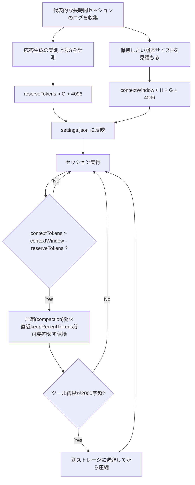
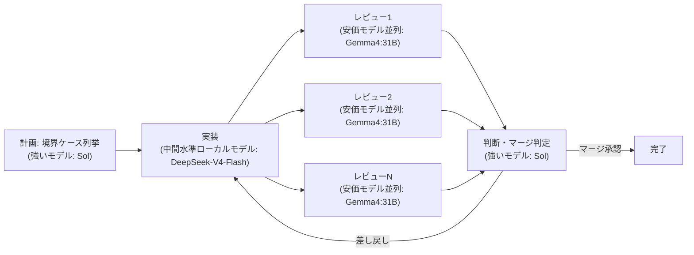
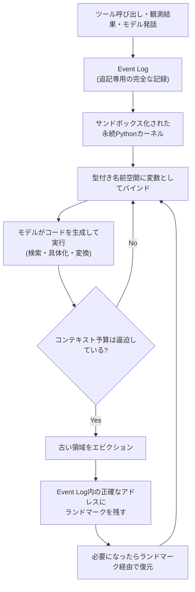

# Daily Briefing 2026-09-06

## 1. コーディングエージェントに100万トークンのコンテキストウィンドウを与えるのをやめよう（原題: Stop giving your coding agent a million-token context window）

- **URL**: https://workos.com/blog/coding-agent-context-window-compaction-settings
- **公開日**: 2026-08-14
- **著者・媒体**: Mitch Fultz（WorkOS Blog）

### 本文翻訳
筆者はコーディングエージェント「pi」を長時間使っていると、モデルが「2ターン前に編集したファイルを忘れ始める」という劣化に繰り返し遭遇していた。原因を追うと、コンテキストウィンドウの圧縮(compaction)まわりの設定を、ネイティブ最大値に丸投げしていたことに行き着いた。筆者は「pi のモデルは単一のグローバルなコンテキストウィンドウで動くようには設計されていない」と述べ、モデルが対応できる最大サイズをそのまま使うのは誤りだと指摘する。

圧縮を制御する設定は3つある。`contextWindow`(圧縮のしきい値と応答上限を決める基準サイズ)、`reserveTokens`(圧縮の発火条件と応答生成に確保する余白)、`keepRecentTokens`(圧縮後も要約せずそのまま残す直近のトークン量)だ。これらは `~/.pi/agent/settings.json`(または `<project-dir>/.pi/settings.json`)の `compaction` セクションと、`~/.pi/agent/models.json` の `modelOverrides` に分かれて存在する。圧縮の発動条件は「threshold compaction は比較1回だけで決まる」というシンプルな実装で、`contextTokens > contextWindow - reserveTokens` を満たした瞬間に圧縮が走る。

出荷時のデフォルトは `reserveTokens: 16384`、`keepRecentTokens: 20000` だが、筆者はこれを「長く推論の重いコーディングターンには窮屈すぎる」と評する。根拠として、Martin と Roger による2026年の "context rot" 研究を引用する。同研究では、無害な活動が800Kトークンを超えて蓄積した後、フロンティアモデルは重要なアクションを2倍から30倍の頻度で見落とすようになると報告されており、モデルが対応できるネイティブ最大サイズは「容量の上限であって、最適な作業セットサイズを保証するものではない」ことを示している。

そこで筆者が提案するのは、実際のワークロードから逆算して設定値を導出する方法だ。まず自分たちの代表的な長時間セッションから、応答生成の上限 G(記事の実測ではおよそ59,904トークン)と、圧縮せずに保持したい履歴サイズ H(推奨256,000トークン)を計測する。その上で `reserveTokens ≈ G + 4096`、`contextWindow ≈ H + G + 4096` という式で設定値を導く。圧縮そのものは履歴を要約するが、ツールの実行結果は2,000文字に切り詰められてしまうため、後で参照したい重要な情報はツール結果とは別の場所に保存すべきだとも注意している。また `/compact [instructions]` によって、意味的な区切り目(タスクの節目)で手動圧縮するのが望ましいとする。

まとめとして、複数の変数を同時に変更せず、まず1つずつ代表的なセッションで計測してから調整すべきだと強調し、「検証済みの320Kウィンドウ、64Kのreserve、40Kのkeepは、品質優先の出発点として十分に正当化できる」という具体的な推奨値を提示している。

### 重要ポイント
- モデルのネイティブ最大コンテキストをそのまま使うのは誤りで、圧縮の閾値は実測ワークロードから逆算すべき
- 制御パラメータは `contextWindow` / `reserveTokens` / `keepRecentTokens` の3つで、`contextTokens > contextWindow - reserveTokens` の単純比較で圧縮が発火する
- 800Kトークンを超える蓄積でフロンティアモデルの見落とし率が2〜30倍に悪化する「context rot」が実証されている
- 導出式は `reserveTokens ≈ G + 4096`、`contextWindow ≈ H + G + 4096`(G=生成上限、H=保持したい履歴サイズ)
- 圧縮後もツール結果は2,000文字に切り詰められるため、重要情報は別途保存し、変数変更は1つずつ検証する

### 図解


### 現場での適用方法

**運用手順（自前ハーネスでの閾値導出）:**
1. 直近1〜2週間の代表的な長時間セッションのログ(JSONL等)を収集する
2. 各セッションについて「1ターンあたりの最大応答トークン数」の実測値からGを求める(例: 95パーセンタイル値を採用)
3. 「圧縮せずに残したい直近履歴の量」を業務要件から見積もりHとする
4. 下記スクリプトで推奨値を計算し、エージェント設定ファイルに反映する
5. 反映後、同じ代表セッションを再実行し「2ターン前のファイル編集を忘れる」ような劣化が再発しないか確認する。一度に変更するのは1変数のみとする

**スクリプト化の例（G・Hの実測からしきい値を計算する）:**
```python
#!/usr/bin/env python3
# compute_compaction_settings.py
import json
import sys

def compute(history_tokens: int, generation_ceiling: int) -> dict:
    reserve_tokens = generation_ceiling + 4096
    context_window = history_tokens + generation_ceiling + 4096
    return {
        "contextWindow": context_window,
        "reserveTokens": reserve_tokens,
        "keepRecentTokens": history_tokens,
    }

if __name__ == "__main__":
    # 使用例: python compute_compaction_settings.py <H_history_tokens> <G_generation_ceiling>
    h = int(sys.argv[1])  # 例: 256000
    g = int(sys.argv[2])  # 例: 59904（実測の95パーセンタイル値）
    print(json.dumps(compute(h, g), indent=2, ensure_ascii=False))
```

**CLAUDE.md への追記例:**
```markdown
## コンテキストウィンドウ設定のポリシー

- エージェントハーネスのコンテキストウィンドウ・圧縮しきい値は、
  モデルのネイティブ最大値をそのまま使わず、必ず実測に基づいて
  `reserveTokens ≈ G + 4096` / `contextWindow ≈ H + G + 4096`
  の式から導出すること(G=応答生成上限の実測値, H=保持したい履歴サイズ)
- 設定変更は1変数ずつ行い、代表的な長時間セッションで再検証してから
  本番反映すること
- ツール実行結果が長大な場合、圧縮時に切り詰められる前提で、
  重要な情報は別ファイル・別ストレージに保存すること
```

### 期待効果
実測ベースで閾値を導出することで、「2ターン前の編集を忘れる」といった長時間セッションでの劣化を抑えつつ、不必要に巨大なコンテキストウィンドウによるcontext rot(800Kトークン超で見落とし率が2〜30倍に悪化)のリスクを回避できる。記事が示す「320Kウィンドウ・64K reserve・40K keep」は品質優先の妥当な出発点として提示されている。

### 注意点
- 記事の数値例はpiというエージェント固有の設定体系に基づくため、他ハーネスでは設定項目名や既定値が異なる
- G・Hの実測にはある程度の代表的なログ収集期間が必要で、導入初期は暫定値からのチューニングが前提になる
- 圧縮時にツール結果が2,000文字に切り詰められる仕様は実装依存であり、自前ハーネスでは切り詰め幅を別途確認する必要がある

---

## 2. ローカルLLM編成が単独のフロンティアAIを超えた日（原題: ローカルLLM編成が単独のフロンティアAIを超えた日）

- **URL**: https://zenn.dev/nrs/articles/b920540a64e1a1
- **公開日**: 2026-08-18（2026-08-19更新）
- **著者・媒体**: nrs（Zenn）

### 本文翻訳
筆者は商用フロンティアモデルへの依存に不安を抱いていた。レート制限、アカウントBANのリスク、企業方針による突然の利用停止など、「誰からも取り上げられない仕事道具」を持つことは心の平穏のために必要だと考え、ローカルLLMを組み合わせたマルチエージェントオーケストレーションが単独のフロンティアモデルに匹敵、あるいは凌駕できるかを実証実験した。

題材は、約9万行のTypeScript製マルチエージェントオーケストレーター「TAKT」本体への機能追加(PRコメント内の画像をダウンロードしてタスクの添付ファイルとして配置する)。評価は24項目の検査表(アンチパターン6・アーキテクチャ6・機能正確性10・テスト2)を3段階評価し、「正しさ:堅牢性:規律:設計 = 3:2:1:1」で重み付けして100点満点に換算、GPT-5.6-Solによる独立3回採点の平均を採用した。

比較したのは7つの編成である。商用モデル単独の「Sol単体」、全ロールを商用モデルで揃えた「Sol編成」、実装・レビュー・補佐を別モデル「Luna」に任せ判断のみSolに残した「Luna編成」、実装にDeepSeek-V4-Flash・レビューにGemma4:31B・判断役のみSolを使う「DeepSeek編成」、実装にnemotron-3-superを使う「nemotron編成」「nemotronチーム編成」、そして商用モデルを一切使わない「ローカルオンリー編成」だ。TAKTのruntime.yamlでロールごとに異なるモデルエンドポイントを割り当てられる仕組みを利用している。

結果は、1位Sol編成(74.3点)、2位DeepSeek編成(70.3点)、3位Luna編成(67.6点)、4位Sol単体・一発書き(62.6点)の順となった。注目すべきは、ローカルモデルを主軸としたDeepSeek編成が、商用モデル単独の一発書きを4点上回った点である。しかもDeepSeek編成は商用トークン消費量がSol編成の7分の1(修正1周あたり4.6ドル対62ドル)、所要時間も半分以下(約5時間対12時間超)で済んでいる。Sol単体の一発書き実装は、コードフェンス内の画像記法の例を実画像として誤検出する不具合や、既存の`[Image #1]`表記との採番衝突・整数境界破損という2つの「思い込みエラー」を落としており、編成型では計画段階で書式のバリエーションや入れ子パターンを列挙させることでこれを防いでいた。

役割ごとの知見として、実装役は中間水準のモデルで十分(DeepSeek-V4-Flashは70点だが、nemotron-3-superは18点まで崩落しモデル依存が大きい)、判断役(裁定・マージ判定)には強いモデルが必須、レビュー役は安価なモデルを4〜6並列で使っても(トークン課金外のローカル実行のため)コストを気にせず物量で精度を補えることが分かった。筆者はこの経済性を「トークンが流れる先を安価なモデルに寄せる」非対称構造と呼び、コーディングは「正解が定義でき検証できる」領域だからこそ編成型が単独モデルに優る余地があり、性能が頭打ちになった後の勝負はコストと自律性に移ると結論づけている。

### 重要ポイント
- ローカルLLM主軸の「DeepSeek編成」が商用モデル単独の一発書きを4点上回り、商用トークン消費は7分の1、所要時間は半分以下
- 役割分離が鍵: 実装は中間水準のモデルでも可、判断・マージ判定は強いモデルが必須、レビューは安価なモデルの並列実行でコストを気にせず精度を補える
- モデル依存度は役割によって大きく異なり、同じ実装役でもnemotron-3-superは18点まで崩落する例がある
- 編成型は計画段階での境界ケース列挙により、単独一発書きが陥る「思い込みエラー」を防止できる
- コーディングは正解を検証できる領域であるため、性能が頭打ちになった後はコストと自律性が競争軸になるという見通し

### 図解


### 現場での適用方法

**運用手順（役割別モデル割り当ての導入）:**
1. 自社のマルチエージェントオーケストレーションツール(または自前スクリプト)で、ロールごとにモデルエンドポイントを切り替えられるようにする
2. 「計画」「判断・マージ判定」は強いモデル(商用フロンティアモデル)に固定する
3. 「実装」はローカルLLM(中間水準・コード生成が得意なモデル)に割り当てる
4. 「レビュー」は安価なローカルモデルを複数並列で走らせ、多数決またはSol相当の判断役が最終集約する
5. 計画段階のプロンプトに「入力の書式バリエーション・入れ子・エッジケースを列挙してから実装方針を立てる」指示を明記する

**設定ファイルの例（runtime.yaml 風のロール別モデル割り当て）:**
```yaml
# runtime.yaml
roles:
  planner:
    model: sol-frontier      # 強いモデル: 計画・境界ケース列挙
    fallback: none
  implementer:
    model: deepseek-v4-flash # 中間水準のローカルモデル
    endpoint: http://localhost:11434
  reviewer:
    model: gemma4-31b        # 安価なローカルモデル
    endpoint: http://localhost:11434
    parallelism: 4           # トークン課金外のため並列数を増やしやすい
  judge:
    model: sol-frontier       # 強いモデル: 裁定・マージ判定のみ
    fallback: none
```

**CLAUDE.md への追記例:**
```markdown
## マルチモデル編成ルール

- 実装フェーズは指定のローカルモデル(deepseek-v4-flash等)を優先利用し、
  商用トークンは判断・マージ判定フェーズにのみ使用すること
- レビューは安価なローカルモデルを複数並列実行し、
  結果が割れた場合のみ判断役モデルにエスカレーションすること
- 実装開始前に、入力の書式バリエーション・入れ子・エッジケースを
  列挙するステップを必須とすること
```

### 期待効果
記事の実験では、ローカルモデル主軸の編成が商用モデル単独の一発書きを品質面で上回りつつ、商用トークン消費を7分の1、所要時間を半分以下に削減している。判断・マージ判定のみに商用モデルを絞ることで、レート制限やアカウントBANといった外部要因への依存度を下げながらコストを最適化できる。

### 注意点
- 効果は「コーディングのように正解が定義・検証できるタスク」を前提としており、正解が曖昧なタスクへの一般化は未検証
- 実装役のモデル依存度は非常に大きく(nemotron-3-superは崩落)、採用するローカルモデルの選定を誤ると効果が出ない
- ローカルモデルの実行にはGPU/VRAMなどのハードウェア投資が別途必要であり、トークン費用の削減分とのトータルコストで判断すべき

---

## 3. コンテキストを環境として扱う：長時間稼働エージェントのためのプログラム的コンテキスト管理（原題: Context as an Environment: Programmatic Context Management for Long-Horizon Agents）

- **URL**: https://arxiv.org/abs/2608.21690
- **公開日**: 2026-08-21
- **著者・媒体**: Yin Lin, Elaine Ang, Erkang Zhu, Bolin Ding, Jingren Zhou（arXiv）

### 本文翻訳
長時間稼働するLLMエージェントは、単一のモデルコンテキストウィンドウに収まらない量の履歴を扱う必要がある。既存手法は大きく2つに分かれる。過去のやり取りをテキストとして要約する「圧縮」型と、情報を固定的なメモリ表現(構造化ノートやベクトルストアなど)に抽出する型だ。しかしどちらも、要約による情報損失や、固定表現に押し込めることによる柔軟性の喪失という代償を伴う。

本論文が提案するシステム「Scroll」は、これらとは異なるアプローチを取る。エージェントの各セッションを、要約すべきテキストの集まりではなく「実行可能な環境」として扱うという発想だ。具体的には、すべてのイベント(ツール呼び出し、観測結果、モデルの発話など)を追記専用(append-only)のEvent Logに記録し、それとは別にサンドボックス化された永続的なPythonカーネルを維持する。このカーネルは型付きの名前空間(ネームスペース)を保持しており、ツールの出力や検索結果は、プロンプトに直列化されるのではなく、この名前空間内の変数としてバインドされる。

これにより、モデルはコンテキストとして渡された生テキストを読むのではなく、モデル自身が生成したコード(例えばフィルタリングや集計のためのPythonコード)を実行してセッション状態を検索・具体化(materialize)・変換するという、プログラム的な操作が可能になる。大量の検索結果やログをすべてプロンプトに詰め込む代わりに、「必要な部分だけをコードで取り出す」ことができるわけだ。

コンテキスト予算が逼迫した場合、Scrollは単純に古い内容を切り捨てたり要約したりするのではなく、「エビクション(退避)」という操作を行う。古い領域をアクティブなコンテキストから削除しつつ、その領域がEvent Log内のどの正確なアドレスに存在するかを示す「ランドマーク」を残しておく。モデルは後になってそのランドマークを手がかりに、必要であれば退避された情報を正確に取り戻すことができる。つまり情報は失われるのではなく、コンテキスト外に退避されているだけであり、アドレスさえ分かれば復元可能な状態を維持する。

著者らはこの手法を複数の評価ベンチマークで検証し、既存の圧縮ベースの手法や固定メモリ表現ベースの手法を上回る性能を示したと報告している。

### 重要ポイント
- 既存の「圧縮」型(要約による情報損失)と「固定メモリ表現」型(柔軟性の喪失)の両方の弱点を回避する第三のアプローチ
- セッションを実行可能な環境として扱い、追記専用のEvent Logとサンドボックス化された永続Pythonカーネルで状態を管理する
- ツール出力・検索結果はプロンプトへの直列化ではなく、型付き名前空間内の変数としてバインドされる
- モデルは生成したコードを実行してセッション状態を検索・具体化・変換するプログラム的操作が可能
- コンテキスト予算逼迫時は「エビクション+ランドマーク」により、退避した情報を正確なアドレスから後で復元できる

### 図解


### 現場での適用方法

**スキル化の例（SKILL.md: ツール出力を変数化して参照するパターン）:**
```markdown
---
name: context-as-environment
description: 大きなツール出力やログを直接プロンプトに詰め込まず、追記専用ログに保存してIDで参照するコンテキスト管理パターン。長時間セッションでの情報損失やコンテキスト肥大化を防ぎたい場合に使う。
---

# Context as an Environment パターン

1. すべてのツール呼び出し結果は、まず `logs/events.jsonl` に
   追記専用で書き込み、一意なイベントIDを発行する
2. モデルへの応答には全文ではなく「要約 + イベントID」のみを渡す
3. モデルが詳細を必要とする場合は、イベントIDを指定して
   `fetch_event(<EVENT_ID>)` のようなツールで再取得させる
4. コンテキストが逼迫したら、直近N件以外のイベントは
   本文をコンテキストから外し、イベントIDのみを「ランドマーク」として残す
```

**スクリプト化の例（追記専用イベントログとランドマーク退避の簡易実装）:**
```python
# event_environment.py
import json
import time
from pathlib import Path

LOG_PATH = Path("logs/events.jsonl")

def log_event(kind: str, payload: dict) -> str:
    event_id = f"evt_{int(time.time() * 1000)}"
    record = {"id": event_id, "kind": kind, "payload": payload, "ts": time.time()}
    with LOG_PATH.open("a", encoding="utf-8") as f:
        f.write(json.dumps(record, ensure_ascii=False) + "\n")
    return event_id  # モデルにはこのIDだけを「ランドマーク」として渡す

def fetch_event(event_id: str) -> dict:
    # ランドマーク経由で、退避済みイベントを正確なアドレスから復元する
    with LOG_PATH.open("r", encoding="utf-8") as f:
        for line in f:
            record = json.loads(line)
            if record["id"] == event_id:
                return record
    raise KeyError(f"event not found: {event_id}")
```

### 期待効果
論文はこの手法が既存の圧縮ベース・固定メモリ表現ベースの手法を複数のベンチマークで上回ったと報告しており、長時間セッションでも「重要な情報が要約で失われる」「固定フォーマットに収まらない情報を扱えない」という典型的な失敗モードを避けつつ、コンテキストサイズを制御できる可能性を示している。

### 注意点
- 本手法はサンドボックス化されたコード実行環境(永続Pythonカーネル)の運用が前提であり、コード実行を許可しないハーネスにはそのまま適用できない
- モデルが「必要な情報をランドマーク経由で取りに行く」判断を自律的に行える指示設計・ツール設計が必要で、単に仕組みを用意するだけでは効果が出ない
- 論文の性能改善はベンチマーク上の結果であり、実運用の多様なタスク・モデルでの再現性は別途検証が必要
