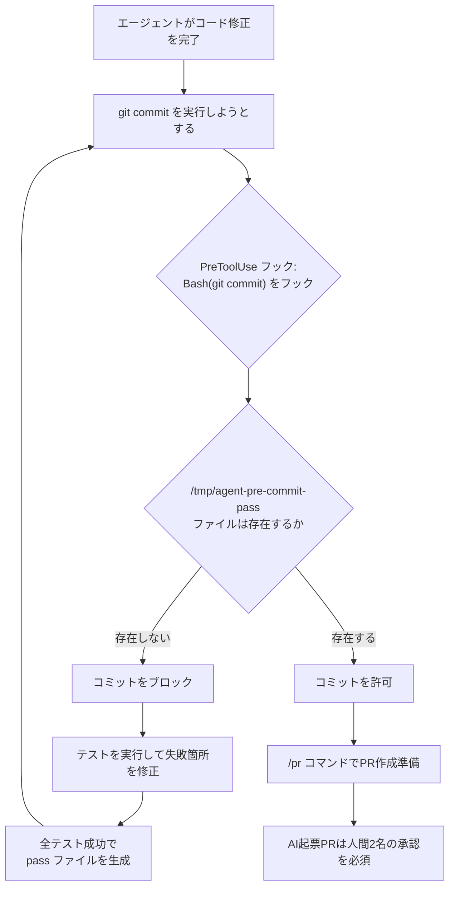
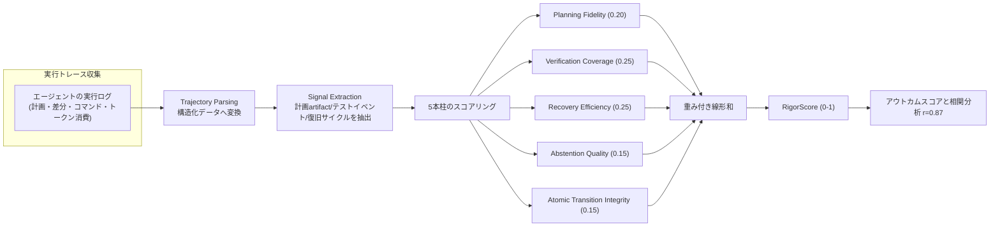
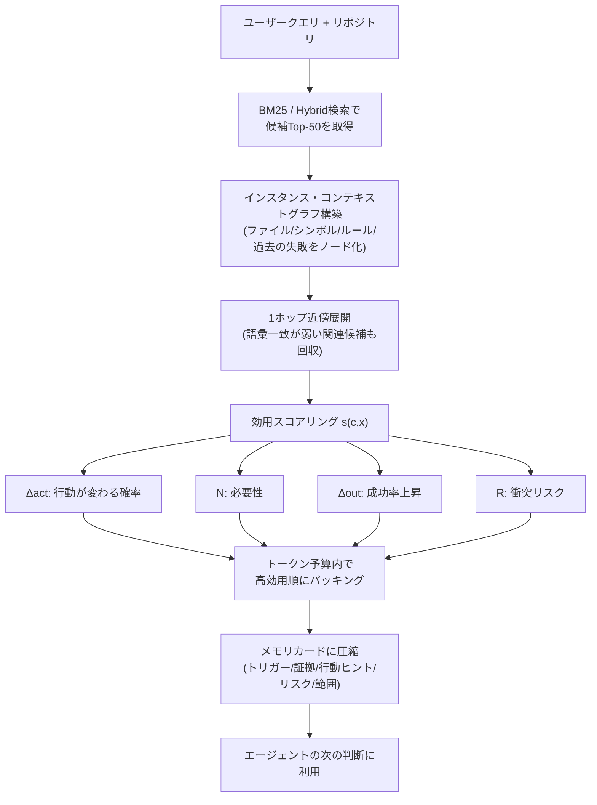

# Daily Briefing 2026-09-07

## 1. Claude Codeのあらゆる機能をどう使っているか（原題: How I Use Every Claude Code Feature）

- **URL**: https://blog.sshh.io/p/how-i-use-every-claude-code-feature
- **公開日**: 2026-03-20
- **著者・媒体**: Shrivu Shankar（個人ブログ／Substack, blog.sshh.io）

### 本文翻訳
著者はエンタープライズのモノレポと個人プロジェクトの両方でClaude Codeを使い倒してきた経験から、機能ごとの実践的な使い方を「通読するものではなくリファレンス」として整理している。

**CLAUDE.md**は「エージェントの憲法」であり、リポジトリ固有の振る舞いを規定する一次情報源だと位置づける。自社モノレポのCLAUDE.mdは13KBで、社内エンジニアの30%以上が使うツールのみを記載する。アンチパターンとして、(1) 最初から分厚いマニュアルを書くのではなく、Claudeが実際に間違えた箇所から逆算して「ガードレール」を追加していく、(2) 長大なファイルを`@`で丸ごと読み込ませるのではなく「なぜ・いつそのファイルを読むべきか」を伝える、(3) 「`--foo-bar`フラグは絶対使うな」のような否定形の制約だけを書くとエージェントは代替手段が分からず詰まるので、常に代替案とセットで書く、(4) CLAUDE.mdを「ツールを簡素化させる強制力」として使う、を挙げる。他IDEとの互換性のためAGENTS.mdも並行維持している。

**コンテキスト管理**では、モノレポでの新規セッションは起動だけで約2万トークン（10%）を消費し、残り18万トークンで作業することになる。`/compact`は「不透明でエラーを起こしやすく最適化されていない」として極力避け、代わりに`/clear`してから独自の`/catchup`コマンド（gitブランチの変更ファイルを読み直させる）を叩く運用をデフォルトにしている。複雑なタスクでは進行中の計画をMarkdownファイルに書き出してから`/clear`し、そのファイルを参照させて再開する「Document & Clear」も使う。

**カスタムスラッシュコマンド**は`/catchup`と`/pr`（コード整理とPR準備）の最小限に留める。「複雑なカスタムコマンドの長いリストを持っている時点でアンチパターン」と述べる。

**サブエージェント**については、専用サブエージェントは「コンテキストを堰き止め」「エージェントを人間が決めた硬直的なワークフローに押し込める」として否定的で、代わりに組み込みの`Task(...)`でメインエージェント自身のクローンを動的に呼び出させる「Master-Clone」方式を「Lead-Specialist」方式より好む。

**フック**は2種類。「Block-at-Submit」は`PreToolUse`フックを`Bash(git commit)`に仕込み、全テスト成功時のみ生成される`/tmp/agent-pre-commit-pass`ファイルの有無をチェックし、無ければコミットをブロックして「テスト→修正」ループに強制的に入らせる。もう一つは非ブロッキングの「Hint Hooks」。逆に「Block-at-Write」（書き込み時点でのブロック）は意図的に使わない。「計画途中のエージェントをブロックすると混乱し、フラストレーションすら起こす」ため。

**プランニングモード**は個人開発では組み込み機能をそのまま使うが、業務では自社の設計フォーマットやセキュリティ要件に沿ったカスタムプランニングツールをClaude Code SDK上に構築している。

**Skills**については「MCPより大きな話かもしれない」とし、エージェントの自律性を単発プロンプト→ツール呼び出し→スクリプティングの3段階で捉え、Skillsはこのスクリプティングをフォーマルにするものだとしている。CLIをMCPより優先してきた開発者は、実質的にすでにSkillsの恩恵を受けていたとも述べる。

**MCP**の役割は、APIをそのまま鏡写しにするのではなく、`download_raw_data()`や`execute_code_in_environment_with_state()`のような「シンプルで安全なゲートウェイ」であるべきとし、実際にはPlaywright MCPのみを使い、ステートレスなツールはCLIに移行済みという。

**Claude Code SDK**は、(1) `claude -p`をbashスクリプトで並列実行する大規模スクリプティング、(2) 非エンジニア向けの社内チャットツール構築、(3) 本格導入前のエージェント試作、の3用途で使う。

**GitHub Actions連携**は「もっとも気に入っていて、かつ見過ごされがちな機能」とし、Slack・Jira・CloudWatchアラートなど「どこからでもPRを起票」する仕組みを構築。過去のGHAログをClaudeに読ませて改善点を自動抽出する自己改善ループも回している。

**settings.json**では`HTTPS_PROXY`/`HTTP_PROXY`で生プロンプトを検査し、`MCP_TOOL_TIMEOUT`/`BASH_MAX_TIMEOUT_MS`を長時間コマンド用に引き上げ、エンタープライズAPIキーで従量課金に移行（エンジニア間で利用量に100倍の差があったため）、`permissions`で自動実行を許可するコマンドを自己監査している。

最後に、顧客リクエストから直接生成されたAI発PRのレビュー体制について「現時点ではAI起票PRには人間2名の承認を必須」としている運用ルールにも触れている。

### 重要ポイント
- CLAUDE.mdは「全部書く」のではなく、実際の失敗から逆算してガードレールを積み上げ、否定形ではなく代替案とセットで書く
- `/compact`は避け、`/clear`＋独自`/catchup`コマンドでコンテキストを毎回作り直す運用がトークン効率と正確性の両面で優れる
- 専用サブエージェントより、メインエージェントが`Task()`で自分自身のクローンを動的召喚する「Master-Clone」方式を推奨
- フックは「Block-at-Submit」（コミット直前でテスト結果を強制チェック）が有効。「Block-at-Write」は計画を乱すため避ける
- MCPはAPIの鏡写しではなく高レベルな「ゲートウェイ関数」として設計し、ステートレスな処理はCLI/Skillsに寄せる

### 図解


### 現場での適用方法

**CLAUDE.mdへの追記例**
```markdown
## <社内CLIツール名>
- 主要ユースケースの8割をカバーする10個程度の要点のみ記載する
- 使用例: `<tool> deploy --env staging`
- 常に `--dry-run` を先に実行してから本番反映する
- `--force` フラグは避け、代わりに `--safe-merge` を使う（理由: 差分が壊れるため）
- 複雑な使い方やエラー対応は docs/<tool>_reference.md を参照すること

## コンテキスト運用ルール
- セッションが長くなったら /compact ではなく /clear → /catchup を使うこと
- 複雑なタスクを中断する場合は現在の計画を docs/plans/<task>.md に書き出してから /clear すること
```

**スクリプト化の例（Block-at-Submitフック）**
```json
// .claude/settings.json
{
  "hooks": {
    "PreToolUse": [
      {
        "matcher": "Bash(git commit*)",
        "hooks": [
          {
            "type": "command",
            "command": "test -f /tmp/agent-pre-commit-pass || (echo 'テスト未実行または失敗。npm test を通してから再度コミットしてください' >&2 && exit 2)"
          }
        ]
      }
    ]
  }
}
```
```bash
#!/usr/bin/env bash
# scripts/run-tests-and-flag.sh
# CI/pre-commitで呼び出し、全テスト成功時のみフラグファイルを作成する
set -e
npm test
touch /tmp/agent-pre-commit-pass
```

### 期待効果
著者の運用では、コンテキストの初期消費が全体の10%（約2万トークン）に抑えられ、`/clear`＋`/catchup`運用によって長時間セッションでの文脈崩れを防止できたと報告している。Block-at-Submitフックにより、テスト未通過のコミットが構造的に排除され、「テスト→修正」ループが自動化される。GHAの自己改善ループでは、過去のエージェント実行ログから躓きパターンを継続的に抽出し、CLAUDE.mdやツール設計にフィードバックする仕組みが確立されている。

### 注意点
- Block-at-Writeフック（書き込み段階でのブロック）は計画途中のエージェントを混乱させるため避けるべきとされている
- カスタムスラッシュコマンドやカスタムサブエージェントを増やしすぎると、エージェントに「覚えるべき魔法のコマンド一覧」を強制することになり、かえって柔軟性を損なう
- CLAUDE.mdの肥大化（同社では13KB→将来25KB見込み）を前提に、記載基準（利用率30%以上のツールのみ等）を明確に決めておく必要がある
- AI発PRのレビュー体制（人間承認人数など）は組織のリスク許容度に応じて個別に設計すべきで、この記事の「2名承認」はあくまで一事例

## 2. RigorBench：自律型AIコーディングエージェントにおけるエンジニアリング・プロセス規律のベンチマーク（原題: RigorBench: Benchmarking Engineering Process Discipline in Autonomous AI Coding Agents）

- **URL**: https://arxiv.org/abs/2606.22678
- **公開日**: 2026-06-21（改訂: 2026-06-29）
- **著者・媒体**: Meher Bhaskar Madiraju, Meher Sai Preetam Madiraju（arXiv プレプリント）

### 本文翻訳
既存のコード生成ベンチマークはテストが通るかどうかという「結果」だけを評価し、そこに至る「エンジニアリング・プロセス」を評価しない。著者らは、無計画な試行錯誤の末に正解へたどり着くエージェントと、健全な設計・検証・復旧のプロセスを踏んで正解に至るエージェントとでは信頼性が本質的に異なるのに、現行ベンチマークは両者を同一視してしまうと指摘し、プロセス規律を定量測定するRigorBenchを提案する。

RigorBenchは5本の柱で構成される。(1) **Planning Fidelity（計画忠実度、重み0.20）**：計画artifact作成の有無、分解の質、計画と実行の順序相関（ケンドールのτ）を測る。(2) **Verification Coverage（検証網羅度、重み0.25）**：実装関数に対するテスト作成率、カバレッジの増分、要件とテストの対応関係を測る。(3) **Recovery Efficiency（復旧効率、重み0.25）**：エラー復旧の試行回数、戦略の多様性、失敗試行に浪費されたトークン比率を測る。(4) **Abstention Quality（撤退判断の質、重み0.15）**：実行不可能・曖昧なタスクに対して、もっともらしい誤答を出さず正しく「できない」と判断し説明できるかを測る。(5) **Atomic Transition Integrity（原子的遷移の健全性、重み0.15）**：作業途中の各状態でビルドが通り続けるか、テストが退行しないか、コミットが論理的で説明的かを測る。各柱を重み付き線形和で合成しRigorScore（0〜1）を算出する。

評価スイートは30タスク×5カテゴリ（Plan-Then-Build：複数ファイルにまたがる機能追加、Verify-Or-Die：一見正しいが微妙なバグを含む実装、Doom Loop Gauntlet：最初の試みが必ず失敗するよう設計されたデバッグ課題、Know When to Fold：実行不可能・曖昧な要求、Don't Break the Build：23ファイルにまたがるDjangoのORM移行のような多段階リファクタ）からなる。Agent-Rigor（6フェーズの規律を強制するMarkdownベースの運用OS）、Agent-Skills、Superpowers、素のReActループ（統制群）の4種のハーネスを、同一の基盤LLM、Dockerサンドボックス、60分・20万トークンの制約下で比較した。

結果、構造化された規律を持つハーネス（Agent-Rigor）はRigorScore 0.61・アウトカムスコア0.83を達成し、統制群（ReAct、RigorScore 0.48・アウトカム0.64）を大きく上回った。プロセス品質は平均41%、正解率は17%向上し、RigorScoreとアウトカムスコアには強い正の相関（r=0.87, p<0.001）が確認された。特にPlanning Fidelityの改善幅が最大（+0.20〜+0.47）だった一方、統制群は実行不可能タスクを一度も撤退せず（0/6）、規律ハーネスは約62%まで改善した。復旧効率面では、規律フレームワークによりトークン浪費が34%削減されたが、根本原因が即座に分からないエラーに対する「ドゥームループ」からの脱却は依然として難しいことも示された。Agent-Rigorは事前計画重視、Agent-Skillsはテスト駆動の反復重視と、異なるアプローチでもどちらもプロセス品質・アウトカムの両方を改善しており、規律を実現する経路は一つではないと結論づけている。

### 重要ポイント
- コード生成の「結果」だけでなく「プロセス」を測る5指標（計画・検証・復旧・撤退判断・原子的遷移）を提案し、重み付き合成でRigorScoreを算出
- 構造化された規律を持つハーネスはプロセス品質を平均41%、正解率を17%向上させ、両者には強い相関（r=0.87）がある
- ベースラインのエージェントは実行不可能タスクへの「撤退」をほぼ行わず、もっともらしい誤答を生成し続ける（本番運用上のリスク）
- 復旧ループ（ドゥームループ）は規律フレームワークでもトークン浪費こそ34%減るが、根本解決までは依然難しい
- 事前計画重視・テスト駆動反復重視という異なる規律アプローチのいずれもプロセス・結果の両方を改善しており、単一の「正解」設計はない

### 図解


### 現場での適用方法

**スキル化の例（SKILL.md）**
```markdown
---
name: rigor-checklist
description: 大きめのコード変更に着手する前後で、計画・検証・復旧・撤退判断・原子的コミットの5観点をチェックする。機能追加・リファクタ・バグ修正タスクで必ず使うこと。
---

# 実行前チェック（Planning Fidelity）
1. 着手前に `docs/plans/<task>.md` に計画（タスク分解・想定変更ファイル）を書き出す
2. 計画は実行可能な粒度（1コミットで完結する単位）に分解されているか確認する

# 実行中チェック（Verification Coverage / Atomic Transition Integrity）
3. 実装した関数には対応するテストを追加する
4. 各コミット前に `npm test` が通ることを確認する（Block-at-Submitフックと併用推奨）
5. コミットは1つの論理的変更にまとめ、説明的なメッセージを書く

# 復旧時チェック（Recovery Efficiency）
6. 同じエラーへの対処を3回失敗したら、同じ戦略を繰り返さず、原因調査アプローチを変える
7. 失敗した試行のdiffは破棄し、成功パスのみをコミットに残す

# 撤退判断チェック（Abstention Quality）
8. 要求が矛盾している・情報が不足している場合は、実装を強行せず理由を添えて質問する
```

**CLAUDE.mdへの追記例**
```markdown
## エージェント運用ルール（RigorBench準拠）
- 複数ファイルにまたがる変更を行う前に、必ず計画をMarkdownで提示すること
- 「動きそうだから」という理由で実装を進めず、テストで裏付けを取ってから次のステップに進むこと
- 要求が実行不可能・曖昧な場合は、もっともらしいが誤った実装を作るより先に確認質問をすること
```

### 期待効果
論文の実測値では、規律あるハーネス運用によりプロセス品質が平均41%、タスク正解率が17%向上し、実行不可能タスクへの誤った実装生成が大幅に減少した（撤退率0%→約62%）。復旧サイクルでのトークン浪費も34%削減されており、開発チームがCLAUDE.mdやSkillsにこれらの規律をルール化することで、同様の傾向（計画なしの思いつき実装や、無限リトライによるトークン浪費の抑制）が期待できる。

### 注意点
- 本研究は30タスク×4ハーネスという限定的な評価規模であり、数値はこの特定条件下のものである点に注意
- 撤退判断（Abstention Quality）の改善は依然限定的（0.57→0.58）であり、規律フレームワークを入れても「もっともらしい誤答」のリスクはゼロにはならない
- 検証網羅度（Verification Coverage）の改善幅も小さい（0.12→0.13）ため、テスト作成の強制だけでは不十分で、テスト内容の質を別途担保する仕組みが必要
- LLM-as-judge（3人パネルの多数決）でスコアリングしており、評価者間一致度はκ=0.74（中程度〜高い一致）だが完全な客観指標ではない

## 3. 決定関与型メモリカード：ツール使用LLMエージェントのための反実仮想発想コンテキスト選択と圧縮（原題: Decision-Aware Memory Cards: Counterfactual-Inspired Context Selection and Compression for Tool-Using LLM Agents）

- **URL**: https://arxiv.org/abs/2606.08151
- **公開日**: 2026-06-06（改訂: 2026-06-15）
- **著者・媒体**: Xinyu Guan, Qianyang Zhao, Yuming Deng（arXiv プレプリント）

### 本文翻訳
コーディングエージェントは、答えがリポジトリ内に存在していても失敗することがある。原因は「失敗しているテスト」「そのファイル特有の慣習」「無視すべき古いトレース」「無関係なスニペットの中に埋もれた短いルール」など、次の一手を左右する手がかりが見つからないことにある。従来の検索は意味的類似度でランキングするが、エージェント的なシステムが本当に必要としているのは「次の判断に影響を与える証拠」であり、単に似ている文章ではない。本論文は、コンテキスト選択を「マッチング問題」ではなく「意思決定への介入」として捉え直す。

提案手法CICL（Counterfactual-Inspired Context Layer：反実仮想発想コンテキスト層）は、候補となる証拠を4つの効用成分に分解して評価する。(1) Δact：その候補を追加することで最終的な行動選択（argmax）が変わる確率、(2) N（必要性）：その候補単体が失敗を成功に転換する確率、(3) Δout：その候補追加によるタスク成功スコアの期待上昇幅、(4) R：他の候補との衝突・負の転移リスク。これらを固定の重み付けで合成したスコア `s(c,x) = 0.34·Δact + 0.26·N + 0.28·Δout − 0.22·R − 0.08·cost` で候補の効用を算出する。重みはClaude Opus・Qwen・GPT-5.5など複数モデル間で固定され、テストラベルから学習させていない（アブレーションのドリフトを防ぐため）。この効用推定は、ホスト型LLM審判（Claude Opus 4.7、Qwen3.6-Plus）、ローカル代替モデル（1,256件で QLoRA ファインチューニングしたQwen3.5-9B）、軽量ランカー（25特徴量の線形モデル、ペアワイズ精度0.939）のいずれでも実行できる。

各リポジトリインスタンスに対しては「インスタンス・コンテキストグラフ」を構築する。ノードはファイル・シンボル・タスクメモリ・ルール・過去の失敗・戦略記録であり、エッジは包含・類似・衝突・前提条件・タスクメモリ関係を表す。語彙的な一致が弱くても、1ホップ近傍展開によって意思決定に関連する文脈を回収できる。選択された証拠は「トリガー」「証拠内容」「行動ヒント」「無視した場合のリスク」「適用範囲」「効用推定値」の5フィールドを持つ「メモリカード」に圧縮される。圧縮は「先に選択してから圧縮する」方式と「予算に応じて候補コストを変えてから選択する」方式の2通りで検証している。

SWE-bench Verifiedの50件のファイル検索インスタンス（2,500件のQwen判定）で評価したところ、Qwen3.6-Plusによる決定関与型リランキングはHit@1を0.58（BM25/HybridRAGベースライン）から0.78へ、MRR@10を0.634から0.790へ改善した（意味的ベースライン比 +0.20 / +0.156）。オラクル上限はHit@1=1.0であり、決定論的プロキシは0.26と大きく劣る。統制実験では、最も効用の高い候補を1件除去すると合成タスクv3のF1が0.245から0.000へ完全崩壊した（ランダム除去では0.205→安定）ことから、効用スコアが実際に行動決定的な情報を捉えていることが裏付けられた。RepoBench-R（100件の実コード圧縮タスク、予算60〜400トークン）では、メモリカード圧縮は生の候補選択と比べてクエリあたり約44.93トークンを節約（95%信頼区間[41.05, 48.74]、p<10⁻³）した一方、完了タスクにおいては汎用的な要約（Summary）の方が成功率で上回った（0.11 対 0.06）。予算感度分析では、両合成スイートともに予算120トークン付近で性能がピークとなり、それ以上ではノイズ候補が増えて精度が落ちる「逆U字」型の挙動を示した。

### 重要ポイント
- コンテキスト選択を「意味的類似度によるマッチング」ではなく「次の行動を左右する意思決定への介入」として再定義し、4つの効用成分（行動変化確率・必要性・成功率上昇・衝突リスク）で候補をスコアリングする
- SWE-bench Verifiedでの実測で、決定関与型リランキングによりHit@1が0.58→0.78、MRR@10が0.634→0.790に改善
- 最高効用候補を1件除去するとF1が0.245→0.000に崩壊する統制実験により、効用スコアが本当に行動決定的であることを検証済み
- メモリカードへの圧縮はクエリあたり約45トークンを節約できるが、タスク完了率では汎用要約の方が優れる場合があり、圧縮目的（トークン削減か完了率か）に応じた使い分けが必要
- 予算120トークン付近が性能のピークで、それ以上はノイズ候補の混入で精度が落ちる「逆U字」特性がある

### 図解


### 現場での適用方法

**スクリプト化の例（簡易版：効用スコアによるコンテキスト絞り込み）**
研究の完全な実装（ホスト型LLM審判やQLoRA代替モデル）は大掛かりだが、エージェントに渡す候補スニペットを絞り込む前段フィルタとして、同じ4成分の考え方を軽量ヒューリスティックで模倣できる。

```python
# scripts/context_utility_filter.py
# 候補スニペットを「行動変化への寄与」で粗くスコアリングし、
# 上位のみをエージェントのコンテキストに渡す簡易フィルタ。
# 本番導入時は Δact/N/Δout/R をLLM審判やヒューリスティックで推定する処理に差し替える。

WEIGHTS = {"delta_act": 0.34, "necessity": 0.26, "delta_out": 0.28, "risk": -0.22, "cost": -0.08}

def score_candidate(delta_act, necessity, delta_out, risk, token_cost):
    normalized_cost = token_cost / 500  # <MAX_EXPECTED_TOKENS> でスケール
    return (
        WEIGHTS["delta_act"] * delta_act
        + WEIGHTS["necessity"] * necessity
        + WEIGHTS["delta_out"] * delta_out
        + WEIGHTS["risk"] * risk
        + WEIGHTS["cost"] * normalized_cost
    )

def select_top_candidates(candidates, budget_tokens=120):
    scored = sorted(candidates, key=lambda c: score_candidate(**c["scores"], token_cost=c["tokens"]), reverse=True)
    selected, used = [], 0
    for c in scored:
        if used + c["tokens"] > budget_tokens:
            continue
        selected.append(c)
        used += c["tokens"]
    return selected
```

**CLAUDE.mdへの追記例**
```markdown
## コンテキスト選択の方針
- 検索でヒットしたスニペットを全部読み込ませず、「次の判断を変えうるか」を基準に上位のみ渡すこと
- 失敗しているテスト・そのファイル固有の規約・矛盾するルールは、意味的な近さより優先度を上げて含める
- 1件の重要な手がかり（失敗テストの原因など）を見落とすとタスク全体が破綻しうるため、要約で丸めず原文の該当箇所を残す
```

### 期待効果
論文の実測では、決定関与型のコンテキスト選択によりSWE-bench Verifiedでのファイル検索精度がHit@1で+0.20、MRR@10で+0.156向上しており、同様の考え方（意味的類似度だけでなく「次の一手への影響度」で候補を絞る）を自前のエージェントの検索・コンテキスト構築ステップに取り入れることで、的外れな文脈によるトークン浪費と見落としの両方を減らせる可能性がある。圧縮によるトークン節約効果は1クエリあたり約45トークンと実測されている。

### 注意点
- 反実仮想的な効用は厳密な因果推定（ランダム化実験）ではなく推定値であり、完全な因果保証はない
- 軽量な代替ランカー（25特徴量の線形モデル）はヒューリスティックスコアリングに性能面で劣るため、レイテンシ制約が厳しい場合のフォールバックとして位置づけるべき
- タスク完了率という観点では、汎用的な要約（Summary）の方がメモリカードより優れる場面がある（0.11 対 0.06）ため、目的がトークン削減なのか完了率なのかで使い分けが必要
- 主要な結果はホスト型モデル（Claude Opus・Qwen3.6-Plus）によるもので、ローカル代替モデルでの再現性は限定的（Spearman ρ=0.379、Claude Opusとの一致は部分的）
