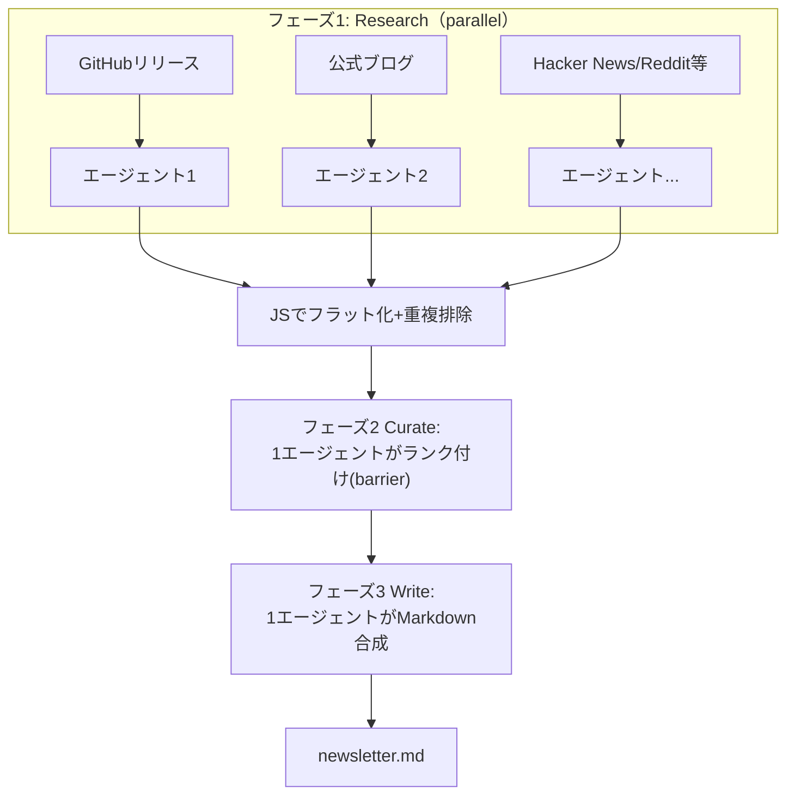
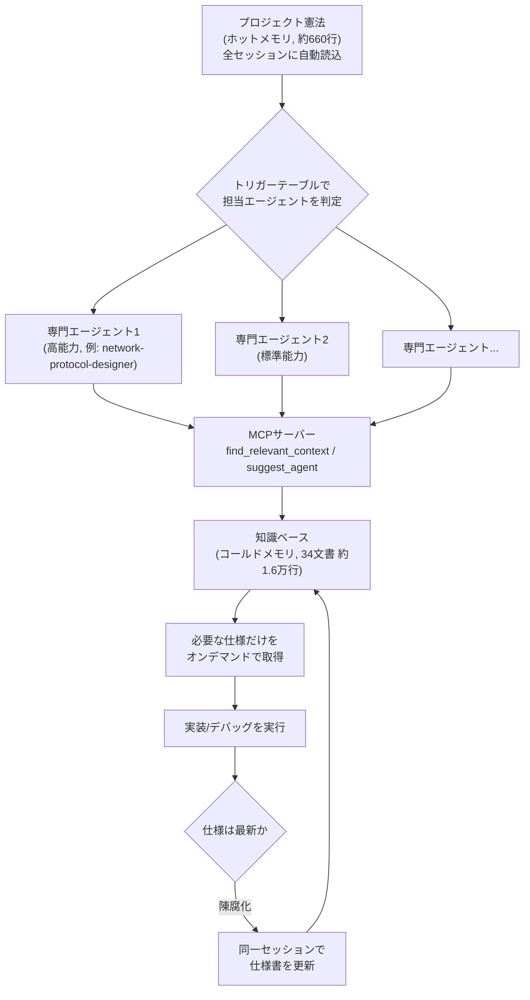
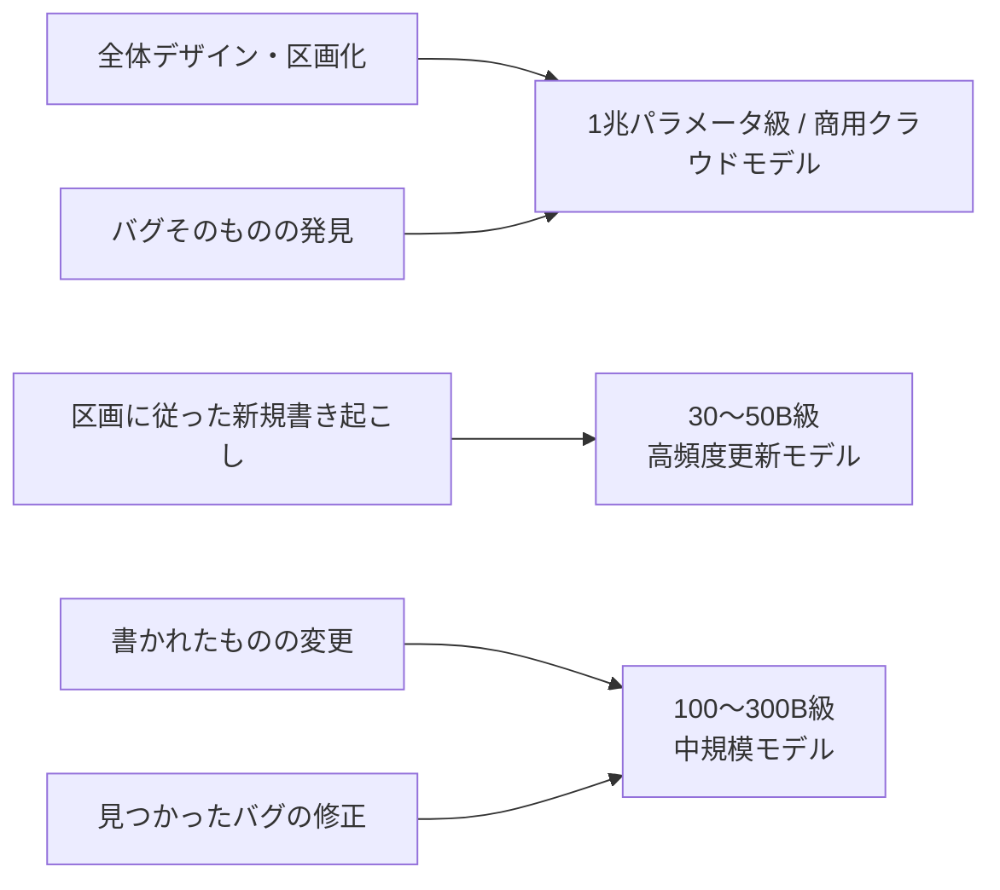

# Daily Briefing 2026-09-08

## 1. Claude Codeのワークフロー：決定論的なマルチエージェント・オーケストレーション（原題: Claude Code Workflows: Deterministic Multi-Agent Orchestration）

- **URL**: https://alexop.dev/posts/claude-code-workflows-deterministic-orchestration/
- **公開日**: 2026-05-28
- **著者・媒体**: Alex Opalic（個人ブログ, alexop.dev）

### 本文翻訳
Claude Codeに追加された「ワークフロー」は、並列実行・パイプライン処理・ジャーナリング・敵対的検証パターンを備えた「決定論的なオーケストレーション」だと著者は説明する。理解のため、「今週Vue/Nuxtエコシステムで何が起きたか」を調べる約130行のワークフローを自作した。9つの情報源に並列でエージェントを飛ばし、知見を収集・ランク付けし、ニュースレターとして書き上げる流れである。

通常のセッションは「読む→判断→ツール呼び出し→観察→再判断」のターン単位で進むが、(1) 差分の全ファイルレビューのような網羅性が必要な仕事、(2) 所見に懐疑者役で反証を試みさせるような確信度が重要な仕事、(3) 移行作業など1つのコンテキストウィンドウに収まらない規模の仕事では、この単位が通用しない。サブエージェント・エージェントチーム・ワークフローの違いは「誰が制御フローを握るか」にある。サブエージェントとチームはClaude自身がターンごとに次を決めるが、ワークフローは「スクリプト」が次を決め、結果はスクリプト変数に残る。制御フローをコードに落とすことで会話には最終結果だけが見え、数百体規模のエージェントまでスケールする。

核心は「制御フローを普通のコードとして書き、個々のステップだけを新規サブエージェントに委譲する」ことだ。反復パターンは「fan out（分散）→ reduce（統合）→ synthesize（合成出力）」で、市場調査・依存監査・コードレビュー・リサーチレポートなど情報源とプロンプトを差し替えるだけで使い回せる。

自作のvue-newsletterワークフローは3フェーズ。フェーズ1「Research」では9情報源（GitHubリリース、公式ブログ、Hacker News、Reddit、dev.to、キーパーソン、ニュースレター等）担当のエージェントを`parallel()`で並列起動し、それぞれJSON Schema検証済みの構造化データを返させる。フェーズ2「Curate」では素のJavaScriptで結果をフラット化・重複排除した後、1体のエージェントがインパクト順にランク付けする（全結果を待つ「バリア」が必要な数少ないケース）。フェーズ3「Write」で最後の1体がMarkdownニュースレターに統合する。9情報源から17件を約3分で収集できた。「`schema`オプションがツール呼び出し層で検証を行い、不一致があればモデルにリトライさせるため、構造化出力が信頼できる経路になる」と著者は述べる。

主要プリミティブは3つ。`agent(prompt, opts)`は1体を起動し`schema`/`label`/`phase`/`model`/`agentType`/`isolation:"worktree"`等を持つ。`parallel(thunks)`は全タスク完了を待つ「バリア」で、失敗したサンクは`null`を返すため常に`.filter(Boolean)`が必要。`pipeline(items, ...stages)`はステージ間にバリアを置かず各アイテムを独立して流す。著者は「`pipeline`をデフォルトにし、あるステージが全ての前段結果を一度に必要とする場合だけ`parallel`のバリアを使う」ことを強調し、「先にフラット化が必要」「コードがきれいに見える」は正当なバリア理由にならないと釘を刺す。

品質を高める再利用パターンとして、独立した懐疑者N体に反証を試みさせ過半数が生き残らねば棄却する「敵対的検証」、全員に異なる観点（正確性・セキュリティ・性能）を割り当てる「多視点検証」、N回の試行を並列審査員でスコアリングする「審査員パネル」、K回連続で新規発見がゼロになるまで探索を続ける「loop-until-dry」を紹介する。loop-until-dryでは、確定済みだけでなく既出全候補と重複排除しないと棄却済みの所見が毎ラウンド再浮上し収束しないと注意している。組み込みの`/deep-research`は、質問を5観点に分解→5並列検索→上位15件抽出→3票制の敵対的検証→引用付きレポート合成、という5フェーズでこの設計を体現する。

### 重要ポイント
- ワークフローは「制御フローをコードで書き、各ステップだけをサブエージェントに委譲する」ことで、数百体規模のエージェントまで決定論的にスケールできる
- 反復可能な設計パターンは「fan out → reduce → synthesize」。情報源とプロンプトの差し替えだけで監査・レビュー・調査業務に転用できる
- `pipeline()`をデフォルトにし、全結果が同時に必要な場合だけ`parallel()`のバリアを使うという判断基準が、無駄な待ち時間を減らす鍵
- `schema`オプションによる構造化出力の強制検証が、フリーテキストのパースより信頼性の高い経路になる
- 敵対的検証・多視点検証・審査員パネル・loop-until-dryは、単発の生成より確信度の高い結果を得るための再利用可能な「品質パターン」

### 図解


### 現場での適用方法

**スクリプト化の例（このリポジトリのような複数トピック調査タスク向けワークフロー）**
```javascript
// .claude/workflows/topic-research.js
export const meta = {
  name: 'topic-research',
  description: '複数トピックの新着記事を並列調査し、重複排除して選定レポートを合成する',
  phases: [{ title: 'Research' }, { title: 'Curate' }, { title: 'Write' }],
}

const TOPICS = [
  { key: 'harness', prompt: 'ハーネスエンジニアリングに関する直近2週間の実践的なブログ記事を探す' },
  { key: 'context', prompt: 'コンテキストエンジニアリングに関する直近2週間の実践的なブログ記事を探す' },
  { key: 'local-llm', prompt: 'ローカルLLM運用の実践知に関する直近2週間の記事を探す' },
]

const ITEM_SCHEMA = {
  type: 'object',
  properties: {
    topic: { type: 'string' },
    items: {
      type: 'array',
      items: {
        type: 'object',
        properties: { title: { type: 'string' }, url: { type: 'string' }, summary: { type: 'string' } },
        required: ['title', 'url', 'summary'],
      },
    },
  },
  required: ['topic', 'items'],
}

phase('Research')
const raw = await parallel(
  TOPICS.map((t) => () => agent(t.prompt, { label: `research:${t.key}`, phase: 'Research', schema: ITEM_SCHEMA }))
)
const flatItems = raw.filter(Boolean).flatMap((r) => r.items)

phase('Curate')
const curated = await agent(
  `以下の候補から <既存インデックスファイル>記載のURLと重複するものを除外し、実践知の濃さで上位3件を選べ:\n${JSON.stringify(flatItems)}`,
  { phase: 'Curate' }
)

phase('Write')
const report = await agent(`選定結果を日本語Markdownレポートに整形せよ:\n${JSON.stringify(curated)}`, { phase: 'Write' })
return { report }
```

### 期待効果
著者の検証では9情報源への並列調査から17件の候補収集までを約3分で完了しており、ターン単位の逐次調査より大幅な時間短縮が見込める。`schema`による構造化出力強制と`pipeline`優先の設計判断により、無駄なバリア待ちやパース失敗によるリトライを避けられる。敵対的検証・loop-until-dryのような品質パターンを組み込むことで、単発生成より確信度の高い所見だけを残せる。

### 注意点
- ワークフローは通常のターン単位の対話より多くのトークンを消費するため、網羅性・検証・規模のいずれかが要求される仕事に限定して使うべき
- ワークフロー実行中は各ステージの間に人間の判断を挟めない（許可プロンプト以外では一時停止できない）ため、途中介入が必要な仕事には向かない
- `Date.now()`や`Math.random()`など非決定的な呼び出しはワークフロー内で例外になる。ジャーナリングによる再開を壊すため、タイムスタンプは`args`経由で渡す必要がある
- 使いどころの誤り（「コードが綺麗に見えるから」という理由での`parallel`バリア濫用など）は、レイテンシの無駄な浪費に直結する

## 2. コード化されたコンテキスト基盤：複雑なコードベースにおけるAIエージェントのためのインフラ（原題: Codified Context: Infrastructure for AI Agents in a Complex Codebase）

- **URL**: https://arxiv.org/abs/2602.20478
- **公開日**: 2026-02-24
- **著者・媒体**: Aristidis Vasilopoulos（arXiv プレプリント, cs.SE）

### 本文翻訳
LLMベースのコーディングエージェントは永続的な記憶を持たず、セッションをまたぐと一貫性を失い、プロジェクトの規約を忘れ、既知のミスを繰り返す。著者は本来の専門が化学でありソフトウェア工学ではない立場から、Claude Codeのみをコード生成手段として10万8,256行のC#分散システムを構築した経験を基に対処法を報告する。核心的指摘は「単一のマニフェストファイル（.cursorrules、CLAUDE.md、AGENTS.md）は控えめな規模のコードベースを超えると破綻する」ことだ。1,000行のプロトタイプは1つのプロンプトで説明し尽くせるが、10万行のシステムはそうはいかない。

著者が構築したのは3層構成の「コード化されたコンテキスト基盤」である。第1層「プロジェクト憲法（ホットメモリ）」は、全セッションに自動で読み込まれる約660行の単一Markdownファイルで、コード品質基準・命名規則・ビルドコマンド・アーキテクチャパターンの要約を収める。「憲法はコンテキストウィンドウを過度に消費せず全セッションに収まらなければならない」という制約が設計を貫く。第2層「専門エージェント」は19本のMarkdown仕様ファイル（各115〜1,233行、総計約9,300行）からなり、より高能力な8体（平均約711行/体）と標準的な11体に分かれる。「各仕様の半分以上は振る舞いの指示ではなくプロジェクト固有のドメイン知識で占められている」という設計上の知見が示される。第3層「知識ベース（コールドメモリ）」は34本のMarkdownファイル（総計約1万6,250行）からなり、約1,600行のPython製MCPサーバー経由で提供される。`find_relevant_context(task)`や`suggest_agent(task)`といったツールを備え、タスクに応じて必要な文書だけをオンデマンドで取得する。さらに「変更前にネットワーク・同期に触れるならnetwork-protocol-designerエージェントを使う」といったトリガーテーブルにより、タスクを自動でエージェントへルーティングする「オーケストレーションプロトコル」も整備される。

4つの観察的ケーススタディが有効性を裏付ける。(1) セーブシステム仕様書（283行）はプロジェクト中で最も参照され74セッション・12件のエージェント対話に登場し、4週間・74セッションの並行作業でもセーブ関連バグはゼロだった。(2) ショップ同期の手動デバッグで得た教訓をui-sync-patterns.md（126行）に記録した結果、次のネットワーク型UI機能は初回実装で「二重配信パターン」を正しく適用できた。(3) 装備システムのリファクタ時、ドロップシステム文書の検索が0件だったため既存コード約10ファイルを読み込みdrop-system.mdを新規作成、リファクタで対処すべきレガシーコードが明らかになった。(4) 時刻同期リファクタのデバッグ（12ファイルにまたがる）では、network-protocol-designerエージェントがそれまでの5回の試行で見落とされていた3件の問題を発見した。

定量指標として、70日間（パートタイム）・283セッション・人間プロンプト2,801件・エージェント呼び出し1,197件・エージェントターン1万6,522件に対し、コンテキスト基盤全体は54ファイル・約2万6,200行（アプリケーションコードの24.2%）に達した。セッションの約87%はアドホックにエージェント1体を呼ぶだけで完結し、約13%は計画→実行→レビューのサイクルを踏む。人間プロンプト1件あたり平均約6回の自律的エージェントターンが発生し、分類可能なエージェント呼び出しの432件（57%）がプロジェクト固有の専門エージェントだった。仕様書の更新はコード変更と同一セッション内で1〜2回のプロンプトで行われ、週あたり合計1〜2時間の追加コストで済んだ一方、最大の失敗モードは「仕様の陳腐化」であり、実装が変わっても仕様書を更新しなければAIは古い情報に基づいたコードを生成してしまう。著者はこの手法が特に「本来の専門分野を超えてソフトウェアを構築するドメインエキスパート」に有効だとし、創薬プロジェクトへ応用し分野横断的な転用可能性を検証中だという。

### 重要ポイント
- 単一のCLAUDE.md/AGENTS.mdは大規模コードベースでは破綻するため、「ホットメモリ憲法」「専門エージェント」「コールドメモリ知識ベース」の3層に分離する
- 仕様書の半分以上を「振る舞い指示」ではなく「プロジェクト固有のドメイン知識」で埋めることが再現性を高める鍵
- MCPサーバー経由でタスクに応じた文書だけをオンデマンド取得し、トリガーテーブルで担当エージェントへ自動ルーティングする
- 週1〜2時間の仕様書メンテナンスコストで、4週間・74セッションにわたる並行作業でも関連バグゼロという結果を達成
- 最大の失敗モードは「仕様の陳腐化」。実装変更時に仕様書を更新しないと、AIは古い前提でコードを生成し続ける

### 図解


### 現場での適用方法

**CLAUDE.mdへの追記例**
```markdown
## コンテキスト階層運用ルール（Codified Context方式）
- プロジェクト規約は `docs/constitution.md` に1ファイルで集約し、全セッションで自動読込する。600行を超えたら詳細を下位ファイルへ逃がすこと
- サブシステム固有の詳細知識は `docs/specs/<subsystem>.md` に分離し、必要なときだけ参照する（丸ごと読み込ませない）
- コードを変更したら、同じセッション内で対応する `docs/specs/<subsystem>.md` を更新すること。仕様の陳腐化が最大の失敗要因である
- 該当ドキュメントが存在しない場合は、まず既存コードを読んで新規に作成してから実装に進むこと
```

**スクリプト化の例（仕様陳腐化の検知フック）**
```bash
#!/usr/bin/env bash
# .claude/hooks/check-spec-freshness.sh
# PostToolUse フックとして .claude/settings.json に登録し、
# 変更したファイルに対応する仕様書が古いままでないかを警告する
CHANGED_FILE="$1"
SUBSYSTEM=$(basename "$(dirname "$CHANGED_FILE")")
SPEC_FILE="<REPO_PATH>/docs/specs/${SUBSYSTEM}.md"

if [ -f "$SPEC_FILE" ] && [ "$CHANGED_FILE" -nt "$SPEC_FILE" ]; then
  echo "警告: ${CHANGED_FILE} は ${SPEC_FILE} より新しく更新されています。仕様書の更新を検討してください" >&2
fi
```

### 期待効果
論文の実測では、4週間・74セッションにわたる並行作業でもセーブシステム関連バグはゼロ、時刻同期の難問では過去5回の失敗を経て専門エージェントが3件の問題を特定するなど、コンテキストの構造化がバグ再発防止と一貫性維持に直結している。仕様書メンテナンスの追加コストは週1〜2時間程度と小さく、24.2%というコンテキスト基盤のコード比率に見合う効果が報告されている。

### 注意点
- 単一プロジェクト（10万8,256行のC#分散システム）・単一開発者による観察研究であり、他言語・他規模での再現性は未検証
- 最大の失敗モードは「仕様の陳腐化」。コード変更のたびに仕様書を更新する運用規律がなければ効果が失われる
- 19体の専門エージェント・34文書という規模は、小規模プロジェクトにはオーバーヘッドになりうるため、コードベースの規模に応じて層の数や粒度を調整する必要がある
- 効果検証は定量指標とケーススタディが中心で、対照群を伴う厳密な比較実験ではない

## 3. ローカルLLMコーディングエージェントは、重くて賢いモデルと軽くて新しいモデルを組み合わせるようになるのでは

- **URL**: https://nowokay.hatenablog.com/entry/2026/04/28/050922
- **公開日**: 2026-04-28
- **著者・媒体**: きしだなおき（個人ブログ, nowokay.hatenablog.com）

### 本文翻訳
著者は、ローカルLLMを使ったコーディングエージェント運用について、モデルサイズ別の使い分けを提案している。出発点は「約1兆パラメータ級の大規模モデルの頻繁な更新は今後も続くのか」という疑問と、「Qwen3.6やGemma4クラスの26B〜35Bモデルが、新規コードの書き起こしには十分な能力を持つようになってきた」という実感である。

著者はコーディング作業を次の5種類に分解する。(1) 全体のデザインと区画化（アーキテクチャ設計）、(2) 区画に従った新規の書き起こし、(3) 書かれたものの変更、(4) 見つかったバグの修正、(5) バグそのものの発見。それぞれ要求される能力の質が異なる、というのが著者の主張の軸である。

これに基づき、著者は段階的な使い分け戦略を提案する。新規実装のような「トレンドへの追従は必要だが高度な推論は不要」な作業には30〜50B級で高頻度に更新される軽量モデルを充てる。デバッグや既存コードの改修のような「そこそこの賢さと技法」が必要な作業には100〜300B級の中規模モデルを充てる。そして、破綻のない全体設計やトレードオフの把握、品質保証といった高度な能力が不可欠な作業にだけ、1兆パラメータ級またはクラウドの商用モデルを温存する。

著者自身の観察として、Qwen3.6-27BとOpenCodeの組み合わせでQwen3のJavaScript実装相当のコードを書かせたところ、約5万トークンを超えたあたりから性能低下が見られたという具体的な知見も紹介されている。新規のHTML画面作成のような初期開発工程は軽量モデルに委任できる一方、デバッグや設計判断はハイエンドモデルに残すべきだとも述べる。

著者は、今後モデルの効率が上がれば1兆パラメータ級が主流になる可能性も認めつつ、当面は「重くて賢いモデル」と「軽くて更新の速いモデル」を役割分担させる運用が現実解になるのではないか、という見立てで記事を締めくくっている。ハードウェア面では、AMD Ryzen AI Max+ 128GB構成（約48万円）やApple Silicon 96GB構成（約60万円）といった具体的な価格帯にも触れ、ローカル環境でこの種の役割分担を実現するための現実的なコスト感覚を示している。

### 重要ポイント
- コーディング作業を「全体設計」「新規書き起こし」「変更」「バグ修正」「バグ発見」の5種に分解し、必要な能力の質が異なることを使い分けの根拠とする
- 新規実装は30〜50B級の軽量・高頻度更新モデル、デバッグ・改修は100〜300B級、全体設計・品質保証は1兆パラメータ級/商用クラウドモデルに温存する3段階戦略
- Qwen3.6-27B + OpenCodeでの実測として、約5万トークン超で性能低下が見られたという具体的な閾値の知見がある
- AMD Ryzen AI Max+ 128GB（約48万円）、Apple Silicon 96GB（約60万円）という具体的な価格帯のローカル構成例を提示

### 図解


### 現場での適用方法

**運用手順（タスク種別ごとのモデル切り替え）**
1. タスク種別ごとにローカルモデルを用意する
```bash
ollama pull qwen3.6:35b   # 新規実装用の軽量・高頻度更新モデル
ollama pull qwen3:235b    # デバッグ・改修用の中規模モデル
# 全体設計・品質保証は既存のクラウドAPI(Claude等)を使う
```
2. タスク種別を引数で切り替える起動スクリプトを用意する
```bash
#!/usr/bin/env bash
# scripts/run-agent.sh
TASK_TYPE=$1  # new-impl | debug | design
case "$TASK_TYPE" in
  new-impl) MODEL="qwen3.6:35b" ;;
  debug)    MODEL="qwen3:235b" ;;
  design)   MODEL="<CLOUD_MODEL_ID>" ;;
esac
opencode --model "ollama/${MODEL}" "$2"
```
3. CLAUDE.md/AGENTS.mdに使い分けルールを明記する
```markdown
## モデル使い分けルール
- 新規コードの書き起こし: `./scripts/run-agent.sh new-impl "<タスク内容>"`
- 既存コードの改修・デバッグ: `./scripts/run-agent.sh debug "<タスク内容>"`
- アーキテクチャ設計・品質保証判断: 必ずクラウドの高性能モデルを使うこと（軽量モデルに任せない）
```

### 期待効果
新規実装・デバッグ・設計判断でモデルを使い分けることで、GPU/VRAM負荷の高い大規模モデルの呼び出しを設計判断など本当に必要な場面に絞り込め、日常的な新規コード生成は軽量モデルで高速かつ低コストにこなせる可能性がある。著者の実測に基づく「約5万トークン超で性能低下」という知見は、ローカルモデルを使う際のセッション長・タスク分割の目安になる。

### 注意点
- 「約5万トークン超で性能低下」等の知見は著者個人の実測に基づくものであり、モデルやタスクによって閾値は変わりうる
- 既存コードベースへの対応力は新規書き起こしより劣ると著者自身が指摘しており、大規模な既存システムの改修を軽量モデルだけに任せるのはリスクがある
- ハードウェア価格（Ryzen AI Max+ 128GBで約48万円等）は記事執筆時点・執筆者の為替/市場前提によるもので、現在の実勢価格とは異なる可能性がある
- 3段階の閾値（30〜50B/100〜300B/1兆級）は著者の経験則であり、モデル世代の進化によって最適な閾値は変動する
