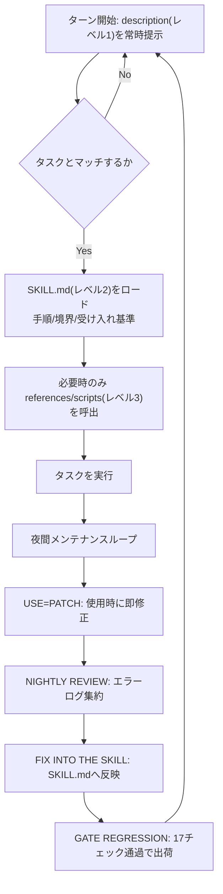
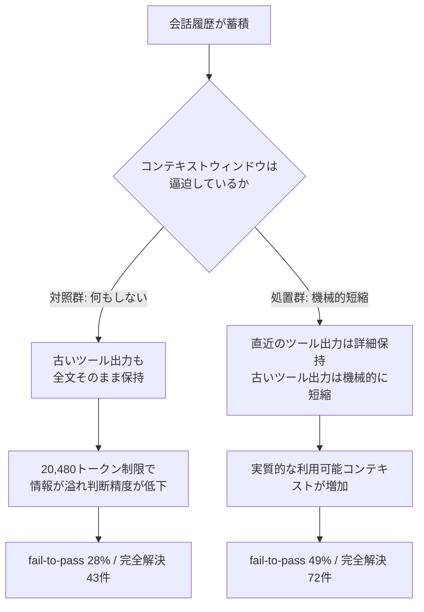
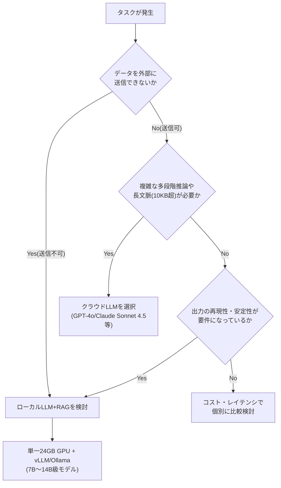

# Daily Briefing 2026-09-09

## 1. エージェントスキルはドキュメントではない――エージェントのためのオンボーディングである（原題: Agent Skills Are Not Documents — They Are Onboarding for Agents）

- **URL**: https://dev.to/weiwuji/agent-skills-are-not-documents-they-are-onboarding-for-agents-4k48
- **公開日**: 2026-09-08
- **著者・媒体**: weiwuji（dev.to）

### 本文翻訳
エージェントの出力は「完成品」ではなく「提案」にすぎない。だからこそ、エージェントに事前に渡す材料（スキルパッケージ）の質が同じくらい重要になる。著者の主張の核心は、「スキルパッケージは人間が読むためのドキュメントではなく、エージェントが順番に歩いて通過するオンボーディングフローである」という点だ。

まず3つを分けて考える必要がある。Anthropicの定義では、1つのスキルは1つのSKILL.mdと任意のバンドルファイルからなり、エージェント自身が発見し使用を判断する。多くのチュートリアルはスキルを「詳細な例を足した高度なプロンプト」として扱うが、これは誤りだと著者は指摘する。プロンプトはコンテキストに「push」されるが、スキルはエージェントが必要な時に「pull」する。プロンプトには境界がないが、スキルは`description`で「何を扱い、何を扱わないか」を宣言する。プロンプトを変えると全体が再実行されるが、スキルを変えてもそれに該当するタスクにしか影響しない。

次に、コンテキストの持ち方は「段階的開示」の3層で設計する。レベル1は毎ターン提示される1行の`description`で、「いつこのスキルを使うべきか」だけに答える。レベル2はマッチしたときだけ読み込まれるSKILL.mdで、手順・境界・受け入れ基準を1回読み切れる分量に収める。レベル3は`references/`や`scripts/`に置かれ、必要なときだけパスで呼び出される。著者は「コンテキストは全ライブラリではなくインデックスを保持する」と表現する。100個のスキルパッケージを全文まるごとコンテキストに載せることは不可能であり、エージェントが実際に判断時に必要とするのはせいぜい2〜3ページ分にすぎない。実践的な目安として「SKILL.mdが1画面を超えて伸びたら、それは長いプロンプトを書き直しているだけだ」と警告する。

このオンボーディング比喩は具体的に対応づけられる。新入社員の「登録フォーム」はスキルの`description`に、「業務マニュアル」はSKILL.mdに、「メンターと作業環境」はbundled scriptsとゲート(検証)に、「試用期間レビュー」は回帰チェックに対応する。ドキュメントは「誰かが読むのを待つ」が、オンボーディングは「誰かをその通りに歩ませる」。エージェントが本当に信頼して動けるのは後者だけであり、行動の順序と受け入れ基準がなければ、ドキュメントだけでは各ステップを信頼できない。

最大の弱点は初回作成の失敗ではなく「スキルの劣化(rot)」だと著者は強調する。モデルの更新で手順が陳腐化し、ツールのインターフェース変更でスクリプトが初回実行時に失敗し、繰り返されるミスがシステムにフィードバックされない。対策として、毎晩回る4段階の保守ループを提案する。(1) USE=PATCH: 使用中に読みにくい箇所を見つけたら即座に修正し、負債を溜めない。(2) NIGHTLY REVIEW: その日のエラーログをスキャンして共通原因を洗い出し、追記専用ログに記録する(著者は276日の運用で60件以上蓄積)。(3) FIX INTO THE SKILL: 得られた教訓をSKILL.mdの新セクションとして定着させる。記憶するだけでは不十分で、仕組みに書き込む必要がある。(4) GATE REGRESSION: スキルの変更は17個のチェックに通らなければ出荷されない。

境界線も明確にする。スキル化に向くのは高頻度で反復可能かつ受け入れ基準をコード化できるタスク(文章作成規約、図解パイプライン、レビュー手法など)であり、一度きりの探索的タスクには直接プロンプトを使うべきで、不必要なスキル化はむしろ新たな知識負債を生む。著者は「エージェントを人のようにメンターするのか、機械のようにパラメータ化するのか」と問いかけ、前者を選ぶ者こそがエージェントの本当のニーズを理解していると結ぶ。

### 重要ポイント
- スキルパッケージは「読まれるドキュメント」ではなく「歩いて通過させるオンボーディング」として設計すべき
- コンテキストには「段階的開示」の3層(description/SKILL.md/bundled files)でインデックスだけを持たせ、全文を常時ロードしない
- SKILL.mdが1画面を超えたら長いプロンプトに逆戻りしているサイン
- スキルの真の弱点は初回品質ではなく「劣化」であり、毎晩のエラーレビュー→SKILL.md反映→回帰ゲートという保守ループで対処する
- 高頻度・反復可能・受け入れ基準がコード化できるタスクだけをスキル化し、探索的な一度きりの作業は直接プロンプトに留める

### 図解


### 現場での適用方法

**スキル化の例（SKILL.md frontmatterと本文骨子）**
```markdown
---
name: diagram-verify
description: Mermaid/画像図解を生成した直後にレイアウト検証を行う。図解を含む記事やドキュメントを作成・更新するタスクでのみ使用する。単発の説明用スケッチには使わない。
---

# 図解生成後の物理検証

## いつ使うか（トリガー条件）
- 記事やレポートに図解（Mermaid/PNG）を追加・更新したとき

## 主要フロー
1. 図解を生成する
2. `scripts/verify_image_layout.py` でレイアウトを検証する
3. FAILなら該当ノードのラベル長・改行を修正し再生成する

## 検証コマンド
\`\`\`bash
python3 scripts/verify_image_layout.py <REPO_PATH>/figs/*.png
\`\`\`

## 参照
- 詳細な検証ロジックは references/verify-spec.md を参照（必要時のみ）
```

**スクリプト化の例（夜間メンテナンスループのcronジョブ）**
```bash
#!/usr/bin/env bash
# .claude/hooks/nightly-skill-review.sh
# cron: 0 21 * * * <REPO_PATH>/.claude/hooks/nightly-skill-review.sh
ERROR_LEDGER="<REPO_PATH>/.claude/error-ledger.jsonl"
SKILLS_DIR="<REPO_PATH>/.claude/skills"

# 1. 当日のエラーログを抽出
grep "$(date +%F)" "$ERROR_LEDGER" > /tmp/today-errors.jsonl

# 2. 共通原因の要約はエージェントに委譲し、SKILL.mdへの追記案を作成させる
#    (実際の呼び出しはClaude Code CLI等、環境に応じて置き換える)
echo "本日のエラーログを分析し、該当スキルのSKILL.mdに追記すべき教訓を提案してください: $(cat /tmp/today-errors.jsonl)"

# 3. 変更後は必ず回帰チェックを実行してから反映する
# ./scripts/run-skill-gates.sh "$SKILLS_DIR"
```

### 期待効果
段階的開示によりコンテキスト消費を「インデックスのみ」に抑えつつ、必要な手順は1回読み切れる分量でエージェントに提示できる。著者の運用実績では276日間で60件以上のエラーが記録・反映されており、継続的な保守ループがスキルの実効性を長期間維持する仕組みとして機能している。SKILL.mdの変更を17項目のゲートで検証することで、保守による劣化・退行を防ぎながら知見を蓄積できる。

### 注意点
- 段階的開示の恩恵を得るにはSKILL.mdを常に「1画面以内」に保つ規律が必要で、放置すると長いプロンプトに逆戻りする
- 保守ループ（毎晩のレビュー・反映・回帰ゲート）を運用する体制がなければ、スキルは短期間で陳腐化する
- 高頻度・反復可能でないタスクまでスキル化すると、かえって知識負債が増える
- 具体的な数値（276日・60件以上・17チェック）は著者個人の運用環境に基づくものであり、チーム規模やタスク特性によって適切な粒度は変わる

## 2. 同じモデル、異なるハーネス：コーディングエージェントの結果は変わる（原題: Same Model, Different Harness: Different Coding-Agent Results）

- **URL**: https://arxiv.org/abs/2608.26218
- **公開日**: 2026-08-26
- **著者・媒体**: Sydney Lewis（arXiv プレプリント）

### 本文翻訳
コーディングエージェントは「モデル」と「ハーネス」の組み合わせで成り立つ。ハーネスとは、モデルに何を見せるか、どのツールを使わせるか、作業をどう継続させるかを決める仕組みである。本論文は、モデルの重みを一切変えずにハーネス側だけを変更した場合に、コーディングエージェントの成績がどれほど変わるかを検証した。

実験は2種類のハーネス構成を比較する形で設計されている。対照群(control)は、会話履歴を単純に時系列順で保持し続ける。処置群(treatment)は、同じ記録を保持しながらも、コンテキストが埋まっていくにつれて古いツール実行結果を機械的に短縮していく。つまり、直近の情報は詳細に残しつつ、過去の冗長なツール出力（ファイル全体のcatやテストの大量ログなど）を圧縮することで、実質的に使えるコンテキスト容量を稼ぐという単純な方針である。

検証にはSWE-bench Verified、SWE-bench Pro、FeatureBenchという3つのコーディングベンチマークを用い、複数のモデルアーキテクチャに対してこの処置を適用した。重要なのは、この処置が「モデルごとの個別チューニングなし」でも機能した点である。特に厳しい条件を課した「tight-window Verified」コホート（169タスク、コンテキストウィンドウ20,480トークン、1試行あたり480秒の制限）での結果が最も顕著だった。

この厳格な条件下で、処置群は失敗から成功に転じたタスクの割合(fail-to-pass fraction)を28%から49%に引き上げ、完全解決タスク数を43件から72件へと改善した。モデルの重みは一切変更していないにもかかわらず、ハーネス側の「古いツール出力を機械的に短縮する」という一点の変更だけでこれだけの差が生まれたことになる。

著者はこの結果から、「コーディングエージェントの評価は、モデルとハーネスを一体の"被検体"として扱うべきである」と結論づける。同じモデルでも、コンテキストウィンドウが逼迫する条件下でハーネスが冗長な古い情報をどう扱うかによって、実際に達成できる性能は大きく変動する。モデル単体のベンチマークスコアを比較するだけでは、実運用でのエージェント性能を正しく予測できない可能性を示す実証結果だといえる。

### 重要ポイント
- コーディングエージェントの性能は「モデル」だけでなく「ハーネス」に大きく左右される。モデルの重みを変えずにハーネスだけを変えても結果は大きく変わる
- 処置は単純：コンテキストが埋まるにつれて「古いツール実行結果」だけを機械的に短縮し、直近の情報は詳細に保持する
- 厳しいコンテキスト制約(20,480トークン、480秒)下で、fail-to-passの転換率が28%→49%、完全解決数が43→72件に改善
- この改善はモデル固有のチューニングなしで複数モデルに再現された
- 評価方法論への示唆：モデル単体のベンチマークではなく「モデル+ハーネス」を一体の被検体として比較すべき

### 図解


### 現場での適用方法

**CLAUDE.mdへの追記例**
```markdown
## 長時間セッションでのコンテキスト管理ルール
- コンテキストウィンドウが逼迫してきたら、直近のツール実行結果（ファイル読み込み・テスト結果等）は詳細を保持すること
- 古いツール実行結果（数ターン以上前のcat/grep/テストログ全文など）は要約・省略してよい。会話の流れそのものは保持し、要約はしない
- 「会話履歴の要約による圧縮」より「個々のツール出力の機械的な短縮」を優先する。前者はプロンプトキャッシュを無効化しやすいが、後者は直近部分のプレフィックスを変えずに済む
```

**運用手順（既存の長時間タスクへの適用）**
1. 現状のセッションでコンテキスト使用率を確認する（Claude Codeであれば`/context`等）
2. 逼迫が見られたら、まず「何ターン前のツール出力から短縮対象にするか」の閾値を決める（例: 直近5ターンは保持、それより古いものは要約）
3. CLAUDE.mdまたはプロジェクトのフックに、上記の閾値ルールを明文化する
4. 同一タスクを閾値ルール適用前後で実行し、タスク完了率やリトライ回数の変化を記録して効果を検証する

### 期待効果
論文の実測値をそのまま適用できるわけではないが、コンテキストが厳しく制限される状況（長時間の大規模リファクタや多数ファイルにまたがるデバッグ）では、古いツール出力を機械的に短縮するだけで、タスク完了率が大幅に改善する可能性がある。実験では最も厳しい条件下でfail-to-pass転換率が21ポイント、完全解決数が29件（43→72）改善しており、コンテキスト管理の設計変更だけでモデルを変えずに得られる効果としては大きい。

### 注意点
- 実験は特定のベンチマーク（SWE-bench Verified/Pro、FeatureBench）と特定のコンテキストウィンドウ/時間制限下の結果であり、実運用のタスク特性によって効果の大きさは変わりうる
- 「古いツール出力の機械的短縮」と「会話全体の要約(compaction)」は異なる手法であり、後者はプロンプトキャッシュを無効化するリスクがあるため混同しないこと
- 論文は抄録・要旨レベルの情報が中心で、短縮アルゴリズムの詳細な実装（閾値の決め方、短縮率など）までは踏み込んでいない
- モデルとハーネスを一体で評価すべきという主張は、既存のモデル単体ベンチマーク比較を否定するものではなく、実運用評価での補完的視点として扱うべき

## 3. ローカルLLMとRAGの現状——何が変わり、何がまだ動かないか：2026年8月の中間報告（原題: LocalLLMの現状とRAGとの組み合わせで「何が変わり、何がまだ動かないか」— 2026年の中間報告）

- **URL**: https://zenn.dev/76hata/articles/localllm-rag-2026-assessment
- **公開日**: 2026-08-25
- **著者・媒体**: 76hata（Zenn）

### 本文翻訳
著者は2026年8月時点での「ローカルLLM＋RAG」構成の実力を棚卸しする。記事自体もQwen3.8-27BにRAGを接続して執筆されており、日本語生成能力の実例そのものにもなっている。

改善が進んだ点として、まずモデルサイズと品質の両立を挙げる。Llama 3 8BやMistral 7B、Qwen2.5 14Bといった7B〜14Bパラメータ帯のモデルが、以前は70B級でなければ出せなかった品質に、特定タスクにおいては迫れるようになった。推論エンジン側の成熟も大きい。vLLM、Ollama、LM Studioといった実行基盤が最適化され、単一GPU(24GB VRAM)でも実用的な推論速度を得られるようになっている。

一方で構造的な限界も明確に指摘する。RAGは「知識の欠如」を補うことはできるが、「推論能力の不足」までは補えない。検索ヒット率が高くても、取得した情報を正しく論理的に統合できるかどうかはモデル自身の推論能力に依存するため、RAGを足すだけでは解決しない問題が残る。複雑な多段階の論理推論や、10KBを超えるような長文脈処理では、GPT-4oやClaude Sonnet 4.5級のクラウドLLMとの間に明確な差が今も存在するという。著者は「複雑な推論タスクでローカルLLMが2回失敗してクラウドLLMに切り替えるコスト」がむしろ増加する場面があるとも述べており、ローカルとクラウドの切り替えコスト自体が新たな検討事項になっていることを示唆する。

ローカルLLM独自の競争優位として著者が強調するのは「安定性」である。モデルファイルを自社でバージョン固定して管理するため、同じプロンプトに対して常に同じ品質の出力が継続する。クラウドのフロンティアモデルにはプロバイダ都合の無断更新や旧モデルの提供終了リスクが伴うが、ローカルLLMはこの種のリスクを構造的に排除できる。長期運用が前提の業務システムや、出力の再現性そのものが要件になるような用途では、この安定性が性能そのものより重要な価値になりうると位置づけている。

こうした整理を踏まえ、著者は導入判断のためのチェックリストを提示する。想定される推論ステップ数、長文脈処理が必須かどうか、データを外部に送信できない制約があるか、長期運用を前提とするか、といった項目を軸に、ローカルLLM＋RAGを選ぶべきか、クラウドLLMを選ぶべきかを判断する枠組みである。著者の結論は、コスト優位性だけでローカルLLMを選ぶ判断は過大評価されがちであり、実際の競争優位はガバナンス・タスクの専門特化・レイテンシ・安定性といった観点にこそあるというものだ。

### 重要ポイント
- 7B〜14B級モデルと推論エンジン(vLLM/Ollama/LM Studio)の最適化により、単一24GB GPUでの実用運用が可能になった
- RAGは「知識の欠如」は補えるが「推論能力の不足」は補えない。複雑な多段階推論・長文脈(10KB超)ではクラウドLLMとの差が依然として明確
- ローカルLLMがローカルLLMで2回失敗してクラウドに切り替えるコストの増加という、切り替えコスト自体の考慮が新たな論点
- ローカルLLM独自の価値は速度やコストよりも「モデルファイルの自社管理による出力再現性・安定性」にある
- 推論ステップ数・長文脈要否・データ外部送信可否・長期運用前提の4軸でローカル/クラウドを判断するチェックリストを提示

### 図解


### 現場での適用方法

**運用手順（ローカル/クラウド振り分けチェックリストの導入）**
1. タスクごとに以下のチェックリストを`docs/model-routing-checklist.md`として整備する
```markdown
# モデル振り分けチェックリスト
- [ ] データを外部（クラウドAPI）に送信できない制約があるか
- [ ] 複雑な多段階推論が必要か（Yesならクラウド優先）
- [ ] 10KBを超える長文脈処理が必要か（Yesならクラウド優先）
- [ ] 出力の再現性・長期安定性が要件か（Yesならローカル優先）
- [ ] 同一タスクでローカルLLMが2回失敗した場合はクラウドLLMに切り替える
```
2. ローカル推論基盤を用意する
```bash
# vLLMでQwen2.5-14Bを単一24GB GPUで起動する例
pip install vllm
vllm serve Qwen/Qwen2.5-14B-Instruct --gpu-memory-utilization 0.9 --max-model-len 8192
```
3. CLAUDE.md/AGENTS.mdに切り替えルールを明文化する
```markdown
## ローカル/クラウドLLM振り分けルール
- 単純な知識検索・定型的な文書生成: ローカルLLM(vLLM経由 http://<LOCAL_HOST>:8000)を優先使用
- 複雑な推論・長文脈・外部送信可能なタスク: クラウドLLMを使用
- ローカルLLMで2回連続失敗したタスクは自動的にクラウドLLMへフォールバックする
```

### 期待効果
定型的な知識検索や単純な文書生成をローカルLLMに任せることで、クラウドAPIコストを抑えつつ、出力の再現性（同じプロンプトに対する安定した品質）を確保できる。長期運用が前提の業務システムでは、フロンティアモデルの無断更新・提供終了に左右されない安定運用が可能になる点が、単純なコスト削減以上の価値として期待できる。

### 注意点
- 複雑な多段階推論や長文脈処理が必要なタスクをローカルLLMだけで処理しようとすると、品質が明確に劣化する
- 「ローカルLLMが2回失敗したらクラウドに切り替える」といった運用は、切り替え判定のロジックとコストを別途設計する必要があり、単純な一括移行より運用が複雑になる
- 単一24GB GPUでの実用性は7B〜14B級モデルが前提であり、より大規模なモデルを求める場合は追加のハードウェア投資が必要
- 記事の評価はQwen3.8-27B等の特定モデル・特定時点(2026年8月)の実測に基づくものであり、モデルの世代交代により結論が変わりうる
