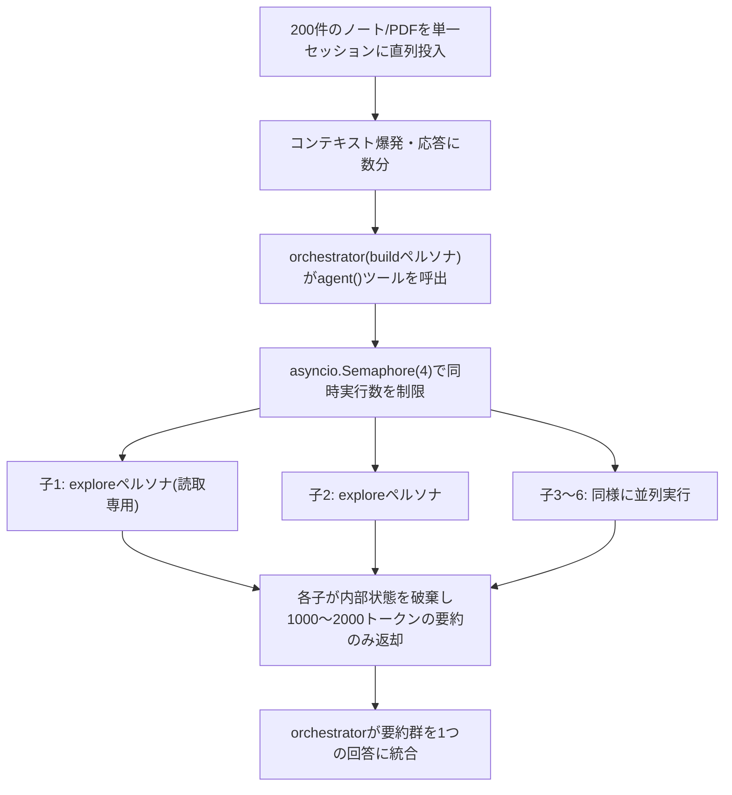
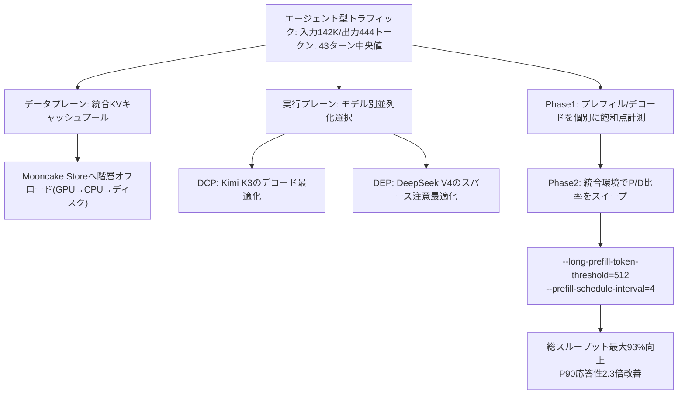
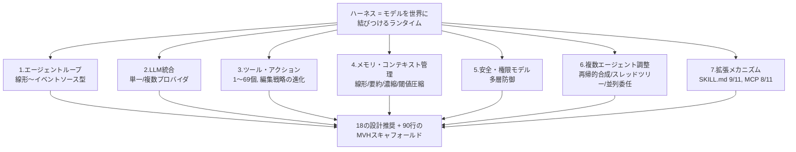

# Daily Briefing 2026-09-10

## 1. 1つの肥大化したコンテキストウィンドウから、6つのスコープ限定サブエージェントへ（原題: From 1 Bloated Context Window to 6 Scoped Subagents）

- **URL**: https://www.decodingai.com/p/subagents-are-context-engineering
- **公開日**: 2026-09-01
- **著者・媒体**: Paul Iusztin（Decoding AI, Substack）

### 本文翻訳
著者のPaul Iusztinは、パーソナルナレッジベース「Second Brain」構築のため、最大200件のノート・トランスクリプト・PDFを一つのClaude Codeセッションにまとめて読み込ませていた。すべてを直列に処理する結果、応答に数分かかり、かつ週間のAPI利用枠を大きく消費していた。原因は単純で、200フォルダ分の生データがそのままコンテキストウィンドウに流れ込み、ノイズと詳細な中間状態でウィンドウを埋め尽くしていたことにある。

著者が行き着いた解決策は、単一の巨大な調査エージェントを、6つのスコープの狭い調査サブエージェントの並列実行に置き換えることだった。要点は「サブエージェントはサブタスクの委譲ではなく、コンテキストエンジニアリングの実装手段である」という捉え方にある。各子エージェントは自分の内部状態(読んだファイル、途中の試行錯誤)を一切外部に漏らさず、最終的な調査結果だけを圧縮してオーケストレーターに返す。

具体的な実装として、エージェントの人格(persona)はYAMLフロントマター付きのMarkdownファイルとしてカタログ化される。フロントマターにはname、description、使用可能なtoolsのリスト、mode(default/edit/plan/bypassなど権限モード)、そのペルソナがサブエージェント専用かどうかを示すsubagentフラグを持つ。たとえばbuildペルソナは15個全てのツールを持つデフォルトモードの主エージェントだが、exploreペルソナはread/glob/grep/lspのみの読み取り専用で、しかもサブエージェントとしてしか呼び出せない。exploreからはbash、web_fetch、ask_userといった対話やデッドロックを招きうるツール、そして自分自身を再帰的に呼び出すagentツールも意図的に外されている。

親から子を呼び出す`agent()`ツール関数は、複数の調査プロンプトのリストを受け取り、`asyncio.gather`で並列にディスパッチする。同時実行数の上限は`subagent_max_parallel = 4`という`asyncio.Semaphore`で制御されており、LLMプロバイダのレート制限に引っかからないようにしている。各子エージェントの応答予算はコンテキストウィンドウを均等割りする形で動的に配分され(例: 16,000バイトをプロンプト数で割る)、失敗した子エージェントは1回だけリトライプロンプト付きで再実行し、それでも失敗すれば警告メッセージだけを返す設計になっている。子から返る結果は1つあたり1,000〜2,000トークン程度に圧縮され、オーケストレーターは最後にそれらを1つの回答へ統合するよう指示される。

著者はこの構成を、実装コストの低い「ハーネス内蔵ツール」方式と、tmuxで別プロセスを立ち上げる「プロセス分離」方式の2通りで比較している。前者はコールドスタートがなくキャッシュを再利用でき予算管理も一元化できるため、多くの場合はこちらを推奨している。後者は真の意味でのプロセス境界とライブな可観測性を得られる代わりに、セッション管理のオーバーヘッドが増える。著者はLangChainのTerminal-Bench 2.0での実績(ハーネス最適化だけで30位から5位に浮上した事例)を引き合いに出し、モデルを変えずともハーネス設計、とりわけサブエージェントによるコンテキスト分離だけで実用上の性能が大きく変わりうると結論づけている。

### 重要ポイント
- サブエージェントは「タスク分業」ではなく「コンテキストエンジニアリングの実装手段」として捉え直すべき
- エージェント人格はYAMLフロントマター付きMarkdown（name/description/tools/mode/subagentフラグ）でカタログ化し、権限を最小化する
- 親子間の並列実行は`asyncio.Semaphore`で上限を制御し、子の返却は1,000〜2,000トークンに圧縮する
- 読み取り専用のexploreペルソナからはbash/web_fetch/ask_user/agentを外し、デッドロックと無限再帰を防ぐ
- ハーネス内蔵ツール方式（低コスト・キャッシュ再利用）とtmuxプロセス分離方式（真の境界・可観測性）はトレードオフとして使い分ける

### 図解


### 現場での適用方法

**スキル化の例（Claude Codeサブエージェント定義 .claude/agents/explore-research.md）**
```markdown
---
name: explore-research
description: 大量のノート・PDF・トランスクリプトを調査する際に使う読み取り専用サブエージェント。ファイル調査や要約収集のみに使用し、編集や外部通信は行わない。
tools: Read, Glob, Grep
model: haiku
---

あなたは調査専任のサブエージェントです。与えられた1つのトピックについてのみ関連ファイルを読み、
最大2000トークンに圧縮した要約を1つだけ返してください。読んだファイルの全文や試行錯誤の過程は
返さず、結論と根拠となる引用箇所のみを構成してください。
```

**CLAUDE.mdへの追記例**
```markdown
## 大量ドキュメント調査時のルール
- 20件を超えるファイル/ノートをまとめて調査する場合は、単一セッションで直列に読み込まず、
  `explore-research` サブエージェントを複数トピックに分割して並列起動すること
- 同時起動数は4を上限とし、各子エージェントの返却は2000トークン以内に圧縮させる
- 子エージェントの内部ログ・中間ファイルはオーケストレーターのコンテキストに戻さない
```

### 期待効果
単一セッションへの直列投入から並列サブエージェント構成に切り替えることで、著者の環境では処理時間（数分規模の待ち時間）とAPI利用枠の消費が大きく改善したと報告されている。具体的な倍率は明記されていないが、引用されているLangChainのTerminal-Bench 2.0事例（モデルは変えずハーネス最適化のみで30位から5位に浮上）は、サブエージェントによるコンテキスト分離がモデル性能とは独立に実用上のスコアを押し上げうることを示す傍証になっている。

### 注意点
- exploreのようなサブエージェントにbash/web_fetch/ask_user/agentを与えないという権限設計を怠ると、デッドロックや無限再帰のリスクがある
- 同時実行数の上限（記事では4）を超えるとLLMプロバイダのレート制限に抵触しうる
- 子エージェントの返却は圧縮された要約のみであるため、要約の粒度が粗いと元情報の重要な文脈が失われる可能性がある
- 記事の効果測定は著者個人の環境に基づく定性的な報告であり、具体的な倍率・数値までは示されていない

## 2. vLLM×AgentX：実世界のエージェント型サービングを最適化する（原題: vLLM x AgentX: Optimizing for Real-World Agentic Serving）

- **URL**: https://vllm.ai/blog/2026-09-08-vllm-agentx
- **公開日**: 2026-09-08
- **著者・媒体**: vLLM Team and Inferact（vLLM Blog）

### 本文翻訳
vLLMチームとInferactは、エージェント型ワークロードに特化したLLM推論最適化に関する報告を公開した。背景にあるのは、OpenAIが2026年6月時点で報告した「Codexが企業顧客の出力トークンの64%を生成している」という事実であり、エージェント型トラフィックが急速にインフラの主要な負荷源になっているという現状認識である。

SemiAnalysisのAgentXベンチマークから抽出されたエージェント型ワークロードの実測的特徴は次の5点である。(1)セッション長は中央値43ターンに及ぶ長期の多ターン対話であること、(2)入力トークンは中央値142Kと長大な一方、出力トークンは中央値444と短いこと、(3)プレフィックスの再利用率が96%を超え、プロンプトキャッシュのヒット率が極めて高いこと、(4)セッションの44%が少なくとも1つのサブエージェントを含み、木構造のセッションが一般的であること、(5)ツール呼び出し結果をコンテキストに追加して再度モデルに渡すという複雑な推論サイクルを繰り返すこと。これは従来のチャット向け推論最適化（短い入力・長い出力を前提とした設計）とは正反対の特性であり、既存の手法をそのまま適用すると非効率になる。

データプレーンでは、KVキャッシュ管理の見直しが中心となる。「単一の共有ブロックプール」により、スライディングウィンドウ注意・線形注意・完全注意の間でメモリを動的に再配分する仕組みを導入し、DeepSeek V4では92個に断片化していたテンソルを1つの連続領域にまとめることでKVキャッシュメモリを約10%削減した。さらにMooncake Storeとの統合により、GPUメモリに収まらない分をCPUメモリやディスクへ階層的にオフロードし、セッション単位でプレフィックスキャッシュの保持期間を制御する「セッション認識型」の保持戦略を実現している。

実行プレーンでは、モデルのアテンション構造に応じて並列化方式を使い分けることが効果を生んでいる。Kimi K3では「デコード文脈並列化(DCP)」がテンソル並列(TP8)よりデコードのレイテンシで優位に立ち、対称メモリバッファによる直接GPU間通信でレイヤーあたり約13%の改善が得られた一方、DeepSeek V4のような圧縮スパース注意を持つモデルではTPの効率が落ちるため「データ・エキスパート並列(DEP)」が最適という、モデルごとに異なる結論が導かれている。

スケジューリング面では、二段階の最適化手法(P/Dスウィープ)が提示されている。フェーズ1では、プレフィル専用・デコード専用のデプロイをそれぞれ個別にベンチマークし、複数の並列化戦略とGPU構成でスループットが飽和する地点を特定する。フェーズ2では、そこから導いたプレフィル/デコード比率をもとに、実際に統合したデプロイ環境で並行度を変えながら再計測し、レイテンシとコストのトレードオフが最も良いポイントを探索する。加えて、`--long-prefill-token-threshold`（長いプレフィルをデコードの合間に細断してhead-of-lineブロッキングを防ぐ閾値、記事では512トークン）や`--prefill-schedule-interval`（データ・エキスパート並列ランク間でプレフィルのスケジュールを揃える間隔、記事では4）といった具体的なパラメータ調整により、総スループットが最大93%向上し、P90のインタラクティビティ（応答性）が2.3倍改善したと報告されている。

ベンチマーク結果として、DeepSeek V4 Pro（1.6兆パラメータ、GB300×12基）ではP90レイテンシ58.3トークン/秒を維持しつつ総処理量83Kトークン/GPU秒を達成し、同等品質のクラウドAPI（Opus5想定）と比べて106倍安価とされる。著者らは、パイプライン並列は短いウォームターンには不向きであること、セッション局所性（キャッシュ再利用）を優先したルーティングが単純な負荷分散より重要であることなど、失敗から得た教訓も共有している。

### 重要ポイント
- エージェント型ワークロードは「長い入力(中央値142K)・短い出力(444)・高いプレフィックス再利用率(96%超)・多ターン(中央値43)・サブエージェント多用(44%)」という従来のチャットとは逆の特性を持つ
- KVキャッシュを単一共有プールで管理し、Mooncake Storeへの階層オフロードでGPUメモリの制約を緩和する
- モデルのアテンション構造（MLA/圧縮スパース注意など）によって最適な並列化方式（DCP vs DEP）が変わる
- 二段階スケジューリング（Phase1: 飽和点計測 → Phase2: P/D比率スイープ）で総スループット最大93%向上、P90応答性2.3倍改善
- パイプライン並列は短いウォームターンに不向き、負荷分散よりセッション局所性（キャッシュ再利用）優先のルーティングが重要という失敗からの教訓

### 図解


### 現場での適用方法

**スクリプト化の例（エージェント型ワークロード向けvLLM起動設定）**
```bash
#!/usr/bin/env bash
# vLLMをエージェント型ワークロード向けにチューニングして起動する例
vllm serve <MODEL_NAME> \
  --enable-prefix-caching \
  --long-prefill-token-threshold 512 \
  --prefill-schedule-interval 4 \
  --gpu-memory-utilization 0.9 \
  --max-model-len 32768
```

**運用手順（P/Dスウィープ手法の自環境への適用）**
1. まずプレフィル専用・デコード専用相当の負荷を個別に流し、GPUごとのスループットが頭打ちになる同時実行数を計測する（フェーズ1）
2. そこから導いた比率を参考に、実運用に近い統合構成で同時実行数を変えながらP90レイテンシとスループットを再計測する（フェーズ2）
3. `--long-prefill-token-threshold`の値を変えながらhead-of-lineブロッキングの影響を確認し、応答性とスループットのバランスが取れる値を探す
4. サブエージェントを多用する構成では、キャッシュ再利用を優先するセッション固定ルーティング（sticky routing）を検討し、単純なラウンドロビン負荷分散を避ける

### 期待効果
記事の実測ではP90応答性2.3倍改善、総スループット最大93%向上、コスト面でクラウドAPI比106倍安価という数値が示されている。自社運用のGPU環境でも、同じチューニング指針（プレフィックスキャッシュ・プレフィル分割・セッション局所性）を適用することでレイテンシとコストのバランス改善が期待できる。

### 注意点
- ベンチマーク数値はGB300/B300クラスの大規模マルチGPUクラスタでの実測であり、小規模な個人環境や1〜2GPU構成でそのまま再現される保証はない
- パイプライン並列はキャッシュ済みの短いウォームターンには不向きという教訓があり、エージェント型ワークロードでは慎重に選定する必要がある
- DCPなど特定モデルのアテンション構造に依存した最適化は、モデルを変えると効果が変わりうる
- `--long-prefill-token-threshold`や`--prefill-schedule-interval`の最適値はハードウェア・モデル・ワークロードに依存するため、記事の値をそのまま鵜呑みにせず自環境で計測すべき

## 3. ハーネスエンジニアリング：11システムのソースコードから見るコーディングエージェントの解剖学・アーキテクチャ・進化（原題: Harness Engineering: Anatomy, Architecture, and Evolution of Coding Agents — A Source-Code Study of Eleven Systems）

- **URL**: https://arxiv.org/abs/2609.00006
- **公開日**: 2026-07-15
- **著者・媒体**: Paul Barbaste, Tristan Darrigol, Germain Vu, Tom Wiltberger（Wavestone AI Lab／arXivプレプリント）

### 本文翻訳
本論文は「エージェント=モデル+ハーネス」という定義のもと、Claude Code、Codex、Gemini CLI、OpenHands、Aider、Hermes、OpenCode、Piなど11個の本番運用コーディングエージェントハーネスのソースコードを実際に読み込み、約400万行規模の実装を横断的に分析した実証研究である。

分析の結果、全ハーネスに共通する7つの標準的サブシステムが特定された。(1)エージェントループ: 最小構成はMini-SWE-Agentの単純なwhile文だが、最大構成であるOpenHandsはイベントソース型の会話エンジンを備える。ループの複雑さそのものはベンチマーク性能と相関しないという指摘は重要である。(2)LLM統合: Anthropic/OpenAI/Googleのような単一プロバイダに密結合する設計から、複数プロバイダを抽象化する層を挟む設計まで幅がある。Claude Codeはキャッシュ境界を意識したプロンプトのモジュール組立を行い、Codexはサーバー配信型のモデルカタログを採用するなど、各社各様のプロンプトアーキテクチャが観察された。(3)ツール・アクションシステム: ツール数はMini-SWE-Agentの1個からHermesの69個まで大きな開きがあり、ファイル編集戦略は「複数の可視系統を持つファジーカスケード」から「構文を理解した上でのコマンド許可(OpenCode)」まで進化している。(4)メモリ・コンテキスト管理: 線形履歴保持、再帰的要約(Aider)、プラグイン可能な濃縮(OpenHands)、閾値型圧縮(7システムが採用)の4方式が確認され、特にCodexが導入した「エージェント自身が管理するメモリパイプライン」や「系統圧縮」は、他ハーネスにはまだ広がっていない新しいパターンとして記録されている。(5)安全・権限モデル: Claude Codeの3層システムや、Codexの「Starlark実行ポリシー+ライフサイクルフック+LLM承認者+OSサンドボックス」という4層スタックなど、多層防御が主流になりつつある。(6)複数エージェント調整: Claude Codeの再帰的合成(コンテキストフォークとコーディネーターモード)、Codexのスレッドツリーモデル、OpenHandsの会話ツリー上での並列委任という3つの基本パターンが確認された。(7)拡張メカニズム: SKILL.md形式は11システム中9つで採用されており、MCP(8/11)を上回る事実上の標準になりつつある。

著者らは合計29の反復設計パターンをカタログ化し、そのうち「ログ・アズ・キュー」ループ(OpenCode)や「系統圧縮」(Hermes)、「セッションツリーのバージョン管理」(Pi)などは本論文が初めて文書化したものだとしている。また、4月から7月にかけての90日間の縦断的分析では、CodexがClaude Codeのhooks用語を逐語的に取り入れるなど、ハーネス間の模倣による収束が急速に進んでいることも示された。特に注目すべき欠落として、LangChainやAutoGenのような汎用エージェントフレームワークがどのハーネスにも採用されておらず、ベクトル埋め込みによるコード検索も使われていない点が挙げられている。代わりに、手書きの非同期ループと、ripgrepやtree-sitterのような決定論的な検索ツールが一貫して選ばれていた。

論文は最終的に、実践者向けの18の設計推奨事項と、7つのサブシステムのうち10個を直接実装した90行の「最小実行可能ハーネス(Minimum Viable Harness)」のスキャフォールドを提示し、2026年前半にコーディングハーネスが単なる「ツール」から「プラットフォーム」へと転換したと結論づけている。その根拠として、ハーネスがインポート可能なSDKとして提供されるようになったこと、スキル・プラグインのマーケットプレイスが登場したこと、ベンダーをまたいだセッションインポーターが実装され始めたことなどを挙げている。

### 重要ポイント
- 「エージェント=モデル+ハーネス」の枠組みで11システム・約400万行を実際に読み込み、7つの共通サブシステム（ループ/LLM統合/ツール/メモリ/安全/複数エージェント調整/拡張）を特定
- ループの複雑さ自体はベンチマーク性能と相関しない一方、閾値型コンテキスト圧縮は7/11システムが採用する事実上の標準
- 安全モデルは単層の承認ではなく、実行ポリシー・ライフサイクルフック・LLM承認・OSサンドボックスの多層防御に収束しつつある
- SKILL.md形式(9/11)がMCP(8/11)を上回り、拡張メカニズムの事実上の標準になりつつある
- 汎用エージェントフレームワーク（LangChain/AutoGen）もベクトル埋め込み検索も、どのハーネスにも採用されておらず、手書きの非同期ループとripgrep/tree-sitterのような決定論的検索が一貫して選ばれている

### 図解


### 現場での適用方法

**運用手順（自社ハーネス設計レビューへの適用：docs/harness-design-review.md）**
```markdown
# ハーネス設計レビューチェックリスト（Harness Engineering論文ベース）

## 1. エージェントループ
- [ ] 線形whileループで十分か、並列・イベントソース型が必要かを要件に応じて明示的に選択したか

## 2. LLM統合
- [ ] 単一プロバイダに密結合するか、複数プロバイダ抽象化層を挟むかを早期に決定したか
- [ ] プロンプトはキャッシュ境界を意識してモジュール分割されているか

## 3. ツール・アクション
- [ ] ツール数を必要最小限に絞っているか（多いほど良いとは限らない）
- [ ] ファイル編集は複数系統を検証する「ファジーカスケード」のような安全策を持つか

## 4. メモリ・コンテキスト管理
- [ ] スケール時に備え、閾値型のコンテキスト圧縮を早期に組み込んでいるか

## 5. 安全・権限モデル
- [ ] 単一の承認ゲートに頼らず、実行ポリシー・ライフサイクルフック・LLM承認・OSサンドボックスなど多層防御になっているか

## 6. 拡張メカニズム
- [ ] SKILL.md相当の宣言的スキル形式とMCPの両方に対応しているか
```

### 期待効果
このチェックリストに基づき自社ハーネスをレビューすることで、業界標準的に収束しつつある7つのサブシステム全体を漏れなく点検でき、特に安全モデルの多層化やコンテキスト圧縮の早期導入など、後回しにされがちな項目を設計初期から意識できる。論文自体は400万行規模の実装分析に基づいており、単一ベンダーの視点に偏らない横断的知見である点が、社内での設計判断の説得材料としても使える。

### 注意点
- 論文はソースコードの静的分析が中心であり、各設計選択がどの程度ベンチマーク性能に寄与するかまでは定量的に踏み込んでいない箇所も多い（著者ら自身も「ループの複雑さと性能は相関しない」と留保している）
- 90日間の縦断分析はまだ短期間であり、模倣による収束が本当に良い設計への収束かどうかは今後も検証が必要
- 「最小実行可能ハーネス」の90行スキャフォールドは概念実証レベルであり、そのまま本番投入できる完成度ではない
- 論文の対象は11システムに限られており、社内独自の規制業界コンプライアンス要件などがある場合は、そのまま適用できない項目もある
