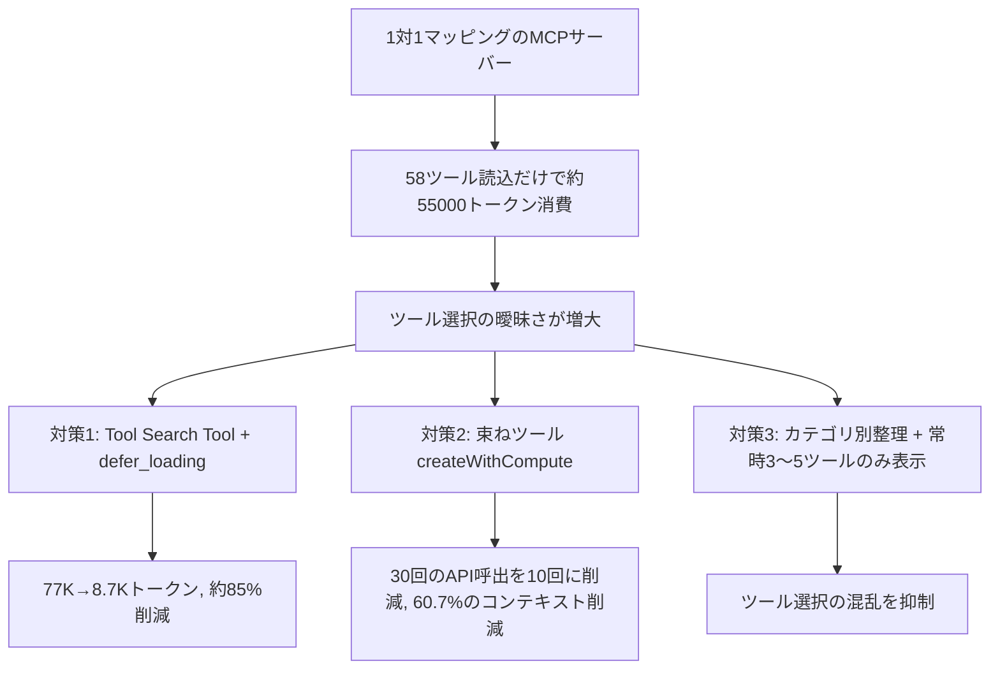
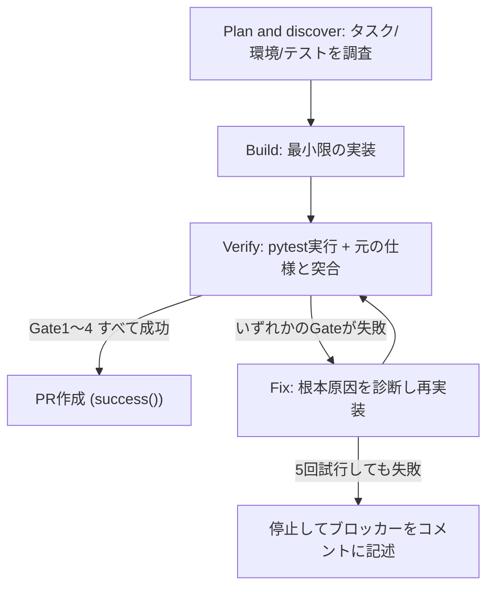
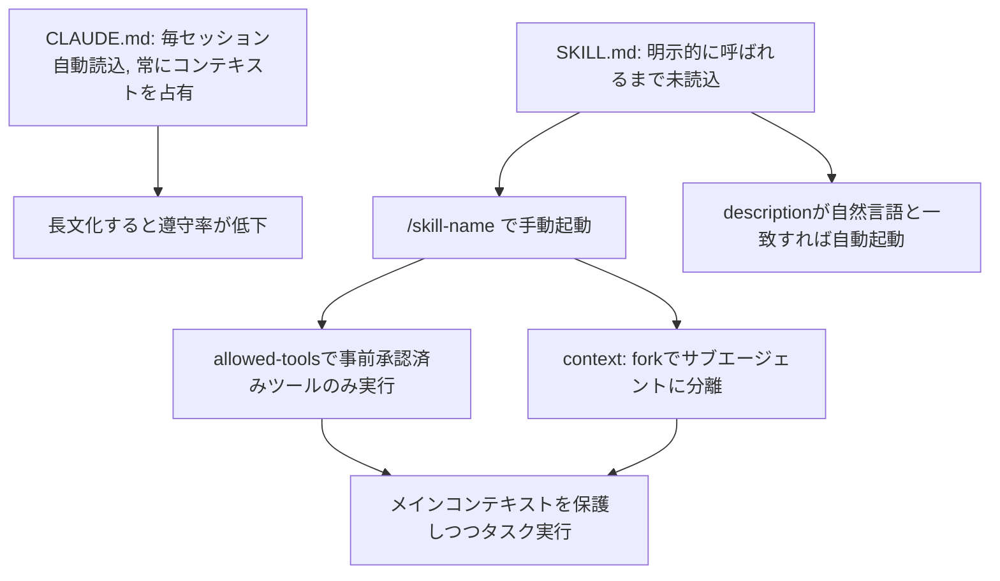

# Daily Briefing 2026-09-11

## 1. コードモード時代のMCPサーバー実践ガイド（原題: A Practical Guide to Building MCP Servers in the Code-Mode Era）

- **URL**: https://atalupadhyay.wordpress.com/2026/09/10/a-practical-guide-to-building-mcp-servers-in-the-code-mode-era/
- **公開日**: 2026-09-10
- **著者・媒体**: Atal Upadhyay（個人ブログ）

### 本文翻訳
著者はまず、MCP（Model Context Protocol）サーバー設計の前提が根本的に変わったと指摘する。初期のMCPサーバーはREST APIのエンドポイントを1対1でツールに変換する設計が一般的だったが、この方式はスケールした瞬間に破綻する。実例として、5つのサーバーにまたがる58個のツールを読み込むだけで、実際のリクエストが始まる前に約55,000トークンを消費してしまうケースが挙げられている。さらにツール数が増えるほど、似た名前・似た機能のツールが並び、モデルがどれを選ぶべきか混乱する「ツール選択の曖昧さ」も深刻化する。

転換点となったのは、クライアント側でツールの発見と実行を担う仕組みが強化されたことである。Anthropicの Tool Search Tool は `defer_loading` によってツール定義を必要になるまで読み込まないようにし、あるベンチマークでは77,000トークンから8,700トークンへと約85%のコンテキスト削減を実現しつつ、精度もむしろ改善したと報告されている。同様に「コードモード」（プログラム的なツール呼び出し）では、モデルが1回ずつツールを呼んでは結果を待つのではなく、複数のツール呼び出しをまとめたスクリプトを自分で書いてオーケストレーションできるようになる。

この変化に伴い、著者は「サーバーの仕事は、どんなツールが存在し、どう整理されているかを決めることであり、クライアントの仕事は、それらをどう発見し実行するかを決めることだ」という責任分担の原則を提示する。具体的な設計指針として、(1)単純なAPIは1対1のツールのままでよい、(2)複数ステップが絡む相互依存の強い操作には、Neonの `createWithCompute`（ブランチ作成・コンピュート割り当て・接続文字列取得の3ステップを1つにまとめる）のような「人間工学的な束ねツール」を追加する、(3)ツール数が多い場合はカテゴリ別に整理し、progressive loading（段階的読み込み）で常時利用可能なのは3〜5個の主要ツールに絞る、という3パターンを使い分けることを推奨している。

記事後半では、モックのCloudDBサーバーを題材にしたハンズオン実装が示される。生のツール（`create_branch`、`attach_compute`、`get_connection_string`）に加えて束ねツールを用意し、軽量なメタデータのみをスキャンするディスカバリークライアントで58%のトークン削減、コードモード方式のクライアントでは60.7%のコンテキスト削減を達成したと報告している。束ねツールにより30回のAPI呼び出しが10回に減り、中間結果をローカルでフィルタしてからモデルに渡すことで、無駄な情報がコンテキストを圧迫するのを防いでいる。なお、Neon自身のガイダンスでは、この種の束ねツールは「誤操作の影響範囲（blast radius）」を広げるため、本番運用ではなくローカル開発・IDE用途に限定すべきだと注意喚起している。

### 重要ポイント
- MCPツールを1対1でAPIにマッピングする設計は、ツール数が増えるとコンテキスト爆発とツール選択の曖昧さを招く
- Tool Search Toolの`defer_loading`でツール定義の遅延読み込みを行うと、約85%のトークン削減と精度向上を両立できた例がある
- 「サーバーはツールの存在と整理を決め、クライアントは発見と実行方法を決める」という責任分担が設計の軸になる
- 相互依存の強い操作は`createWithCompute`のような束ねツールにまとめ、API呼び出し回数と中間結果のコンテキスト消費を削減する
- 束ねツールは本番投入前に「誤操作の影響範囲が広がる」というリスクを踏まえ、まずはローカル開発・IDE用途から適用するのが安全

### 図解


### 現場での適用方法

**運用手順（自社MCPサーバーの棚卸しと再設計）**
1. 現行MCPサーバー群のツール定義を読み込んだ際の消費トークン数を計測し、ボトルネックとなっているサーバーを特定する
2. 単純なCRUD系エンドポイントは1対1ツールのまま残し、複数ステップを要する頻出ワークフローだけを洗い出す
3. 頻出ワークフローについて、`createWithCompute`のような束ねツールを追加実装し、内部で複数API呼び出しをまとめ、中間結果をサーバー側でフィルタしてから返す
4. ツール数が多い場合はカテゴリごとにグルーピングし、クライアント側の`defer_loading`相当の遅延読み込み設定を有効化する
5. 束ねツールは本番投入前にローカル開発・IDE用途で試験運用し、誤操作時の影響範囲を確認してから展開範囲を広げる

**スクリプト化の例（束ねツールのイメージ実装）**
```typescript
// createWithCompute: 3ステップの操作を1つのツール呼び出しに束ねる例
async function createWithCompute(params: { projectId: string; region: string }) {
  const branch = await createBranch(params.projectId);
  const compute = await attachCompute(branch.id, params.region);
  const connectionString = await getConnectionString(compute.id);
  // 中間結果はサーバー側でフィルタし、必要な情報のみ返す
  return { branchId: branch.id, connectionString };
}
```

### 期待効果
記事の実装例では、ディスカバリークライアントで58%、コードモード方式のクライアントで60.7%のコンテキスト削減が報告されている。また別事例として、Tool Search Toolの`defer_loading`導入により77Kトークンから8.7Kトークンへ約85%の削減と精度向上が両立したケースが紹介されており、同様の設計をMCPサーバーに適用することで、ツール定義の読み込みコストとツール選択の誤りを同時に減らせる可能性がある。

### 注意点
- 束ねツールは操作の柔軟性を犠牲にする面があり、個別ステップの制御が必要な場面では1対1ツールも残す必要がある
- 束ねツールは1回の呼び出しで複数の副作用を伴うため、誤操作時の影響範囲（blast radius）が広がる。Neon自身も本番運用ではなくローカル開発・IDE用途に限定するよう注意している
- `defer_loading`や進捗的読み込みの効果はクライアント側の実装（Claude Code等）の対応状況に依存するため、利用するハーネス側の対応状況を事前に確認する必要がある
- 記事のベンチマーク数値はモックのCloudDBサーバーでの実験結果であり、実際のAPI構成によって削減率は変動しうる

## 2. ビルド・検証ループ：AIエージェントにテストを通さず「完了」を宣言させないためのハーネスパターン（原題: The Build-Verify Loop: Stop Your AI Agent From Claiming Victory Before the Tests Pass）

- **URL**: https://regolo.ai/the-build-verify-loop-stop-your-ai-agent-from-claiming-victory-before-the-tests-pass/
- **公開日**: 2026-08-24
- **著者・媒体**: Alex Genovese（Regolo.ai ブログ）

### 本文翻訳
著者は、AIコーディングエージェントが抱える根本的な問題は「LLMはもっともらしい完了を生成するように訓練されている」という点にあると指摘する。コードが実際に動作するかどうかとは無関係に、自信満々な完了報告は自然に生成されてしまう。この問題は3つの典型的な失敗モードとして具体化される。(1)早すぎる終了: エージェントが最初にそれらしい実装ができた時点でテストを実行せずに停止してしまう、(2)自分に都合の良い解釈: 曖昧な出力を楽観的に解釈し、スタックトレースを「軽微な警告」だと読み替えてしまう、(3)仕様のドリフト: 元の要件ではなく、エージェント自身が書き換えた理解を最適化対象にしてしまう。

これらを防ぐために提示されるのが「ビルド・検証ループ」というパターンであり、核心は「検証は制御フロー上のゲートであるべきで、プロンプト中の一段落であってはならない」という一文に集約される。ループは4段階のステージで構成される。Plan & discover(タスク・環境・利用可能なテストを調査し、「間違った問題をもっともらしく解く」のを防ぐ)、Build(最小限の実装を行い、過剰設計や脆い出力を防ぐ)、Verify(テストを実行し元の仕様と突き合わせ、「流暢だが壊れている完了」を防ぐ)、Fix(根本原因を診断し修正して再検証し、偽の完了を繰り返す無限ループを防ぐ)。

著者は、この設計を実際に本番導入した欧州のB2B SaaSチーム(インボイス・FatturaPA関連)の事例を紹介している。導入前は34%のエージェント生成PRが失敗していたが、OpenCode(オープンソースのCLIエージェント)、GitHub Actions(EUのセルフホストランナー)、Regolo(OpenAI互換のEUエンドポイント)、そして必須の検証ゲートスクリプト(PR作成前にpytestの実行を強制)を組み合わせることで、失敗率をほぼゼロまで下げたという。設定層ではOpenCodeの設定ファイルでプロバイダを宣言し、モデルやエンドポイントをコード変更なしに切り替えられるようにしている。

プロンプト設計では、「エージェントは自分がどう評価されるかを知らされると行動が変わる」という開示の原則が使われている。具体的には「あなたはCIによって評価されます。パイプラインはpytestを実行し、正確なファイルパスをチェックします」と明示し、さらに「5回試行してもテストが通らない場合は、停止して何がブロッカーになっているかコメントに書いてください」という脱出弁も組み込む。出口のないタスクを与えられたエージェントは、最終的に解決策を捏造することを学習してしまうため、この脱出条件が重要だとされる。

検証ゲートのbashスクリプトは4つの独立したチェックを実装する: (1)pytestの終了コードが0であること、(2)少なくとも1つのテストファイルが変更されていること、(3)`deploy/`や`.github/`といった禁止パスが変更されていないこと、(4)diffにシークレットが含まれていないこと。各ゲートは決定論的かつ観測可能であり、ワークフロー上で`success()`が成立した場合のみPR作成に進む設計になっている。著者はこのパターンをコーディング以外にも一般化できるとし、ドキュメント処理でのJSONスキーマ検証、RAGアシスタントでの主張と出典のマッピング、API自動化での読み取り後書き込み確認などを例に挙げている。コスト面では、追加のテスト実行トークンによりタスクあたり20〜30%コストが増加するが、開発者が壊れたエージェント出力をデバッグする手間がなくなるため、全体の工学コストは大きく下がると結論づけている。

### 重要ポイント
- 「検証は制御フロー上のゲートであるべきで、プロンプトの一文であってはならない」が本パターンの核心原則
- Plan→Build→Verify→Fixの4段階を制御フローのゲートとして強制することで、早すぎる終了・自分に都合の良い解釈・仕様ドリフトの3つの失敗モードを防ぐ
- 実本番事例では、エージェント生成PRの失敗率が34%からほぼゼロまで低下したと報告されている
- プロンプトに評価方法（CIがpytestを実行し正確なファイルパスをチェックする）を明示すると、エージェントの挙動が「それらしさ」から「実際に動く」方向にシフトする
- 5回試行しても解決しない場合は捏造せず停止してコメントするという「脱出弁」を必ず組み込む必要がある

### 図解


### 現場での適用方法

**スキル化の例（Claude Codeスキル .claude/skills/build-verify-loop/SKILL.md）**
```markdown
---
name: build-verify-loop
description: コード変更タスクで、実装後に必ずテストを実行してから完了を報告させるためのスキル。「実装して」「修正して」系のタスクで使用する。
allowed-tools: Read, Write, Edit, Bash(pytest *), Bash(git diff *)
---

このスキルが呼ばれたら、以下の4段階を順番に実行すること。各段階を飛ばして「完了」を報告してはならない。

1. Plan: タスクの要件、既存のテストファイル、実行方法を確認する
2. Build: 最小限の変更を実装する（過剰な設計をしない）
3. Verify: `pytest` を実行し、終了コードが0であることを確認する。終了コードが0でない場合は完了と報告しない
4. Fix: 失敗した場合は根本原因を診断し、修正して手順3に戻る。5回試行しても解決しない場合は、実装を完了と報告せず、何がブロッカーかをコメントとして報告して停止する
```

**スクリプト化の例（検証ゲート verify_gate.sh）**
```bash
#!/usr/bin/env bash
set -euo pipefail

# Gate 1: テストが成功すること
pytest "$WORKSPACE/tests/" -v --tb=short

# Gate 2: 少なくとも1つのテストファイルが変更されていること
if ! git diff --name-only | grep -q "test_"; then
  echo "Gate 2 failed: no test file modified" >&2
  exit 1
fi

# Gate 3: 禁止パスが変更されていないこと
if git diff --name-only | grep -qE "^(deploy/|\.github/)"; then
  echo "Gate 3 failed: forbidden path modified" >&2
  exit 1
fi

# Gate 4: シークレットが含まれていないこと（簡易チェック）
if git diff | grep -qiE "(api[_-]?key|secret|password)\s*=\s*['\"]"; then
  echo "Gate 4 failed: possible secret in diff" >&2
  exit 1
fi

echo "All gates passed"
```

### 期待効果
記事で紹介された本番事例では、失敗するエージェント生成PRの割合が34%からほぼゼロまで低下したと報告されている。ターミナルベンチ2.0での精度向上も約42.5%と言及されている。タスクあたりのトークンコストは20〜30%増加するが、壊れた出力のデバッグにかかる人的コストが減るため、全体の工学コストは削減されるとされている。

### 注意点
- 検証ゲート追加によりタスクあたりのトークン消費が20〜30%増加するため、単純作業には過剰な場合がある
- 「5回試行しても失敗したら停止する」という脱出条件を省略すると、エージェントが偽の完了を捏造するリスクが残る
- 効果測定は特定の欧州B2B SaaSチーム1社の事例に基づくものであり、業種やコードベースの性質によって再現性は異なりうる
- 検証ゲートはあくまでdeterministicなチェック（テスト実行・パス制限・シークレット検出）に限定されており、ロジックの正しさそのものまでは保証しない

## 3. Claude Codeスキル：再利用可能なプロンプトと.NETワークフロー（原題: Claude Code Skills: Reusable Prompts and .NET Workflows）

- **URL**: https://codewithmukesh.com/blog/skills-claude-code/
- **公開日**: 2026-07-29
- **著者・媒体**: Mukesh Murugan（Solutions Architect, Microsoft MVP／個人ブログ codewithmukesh.com）

### 本文翻訳
著者はまず、Claude CodeのSkillsを「オンデマンドで読み込まれる再利用可能なプレイブック」と定義する。CLAUDE.mdがセッションのたびに自動的に読み込まれ常時コンテキストを占有するのに対し、Skillsは明示的に呼び出されるまでコンテキストを消費しない。著者は「長すぎるCLAUDE.mdは、短いものより守られる確率が下がる」と述べ、コンテキストウィンドウが雑多な情報で埋まるほど、規約の遵守率が下がることを理由に挙げている。Skillsはタスク固有のワークフローを切り出すことで、常時読み込まれるルール群をクリーンかつ焦点の絞られた状態に保てるとしている。

SKILL.mdの構造は、`.claude/skills/<skill-name>/SKILL.md`に配置するMarkdownファイルで、YAMLフロントマターと本文の指示から成る。フロントマターの標準フィールドは`name`と`description`（必須）で、Claude Code独自の拡張として`argument-hint`（オートコンプリート表示用のヒント）、`arguments`（`$0`、`$1`に置換される名前付き引数）、`disable-model-invocation`（`true`にすると自動起動を無効化し手動`/name`呼び出しのみに限定）、`user-invocable`（`false`でメニューから非表示）、`context: fork`（独立したサブエージェントで実行しメインの会話のコンテキストを保護）、`allowed-tools`（`Bash(dotnet build *)`のように特定ツールを事前承認）、`paths`（自動読み込みをゲートするglobパターン）が用意されている。

著者は、ASP.NET Core Minimal APIのエンドポイントを一括生成するスキル`gen-endpoint`を具体例として提示する。フロントマターで`argument-hint: [HTTP-method] [route] [entity-name]`を宣言し、本文ではプロジェクト構造の解析、DTOの生成、FluentValidationによるバリデータ作成、サービス層の実装、エンドポイント登録、DI登録、統合テストの作成、`dotnet build`によるビルド検証という8ステップを順に指示している。呼び出しは`/gen-endpoint POST /api/products Product`のようにスラッシュコマンドで行う。

高度な機能として、シェルコマンドの実行結果をClaudeが読む前に注入する「動的コンテキスト注入」(`` !`gh pr diff --name-only` ``のような記法)、`context: fork`によるサブエージェント委譲(大量のファイルを読む際にメインの会話のトークン予算を保護)、`model: haiku`によるモデルの上書き(読み取り専用の分析タスクをコスト最適化)、そして本文中に"ultrathink"という語を含めることで複雑な推論を要するタスク(アーキテクチャレビュー等)に拡張思考を促す機能が紹介されている。

スキルの保存・共有はスコープの優先順位が「Enterprise > Personal > Project」で決まり、プロジェクトレベル(`.claude/skills/`)はGit経由でチームに共有されバージョン管理される一方、パーソナルレベル(`~/.claude/skills/`)は全プロジェクト横断で利用できる。設計パターンとしては、(1)説明文は「包括的なツール」のような抽象語ではなく、ユーザーが実際に使う自然言語(「エンドポイントを追加して」「ルートを作成して」)に合わせて書く、(2)SKILL.mdは500行未満に抑え、詳細な参照資料は別ファイルに逃がす(コンテキスト予算を12%から約3%に圧縮できる)、(3)デプロイやマイグレーションのような破壊的操作を伴うスキルには`disable-model-invocation: true`でガードレールを設ける、(4)50行のコードブロックを埋め込むのではなくテンプレートを別ファイルとして参照する、(5)手動呼び出し・自動呼び出し・無関係タスクでの非発火という3パターンをテストする、という5点が挙げられている。著者は自身がメンテナンスする`dotnet-claude-kit`(47個の.NET向けスキル、16個のスラッシュコマンド、10個の専門サブエージェント、15個のRoslynベースMCPツールを含むオープンソースプラグイン)を、これらのパターンの実装例として紹介している。

### 重要ポイント
- SkillsはCLAUDE.mdと異なり明示的に呼び出すまでコンテキストを消費せず、「長いCLAUDE.mdほど遵守率が下がる」問題を回避できる
- SKILL.mdのフロントマターには`allowed-tools`（ツール事前承認）、`context: fork`（サブエージェント分離）、`disable-model-invocation`（自動起動の無効化）など、Claude Code独自の拡張フィールドが用意されている
- description文はユーザーが実際に使う自然言語表現に合わせて書くことで、自動発火の精度が上がる
- SKILL.mdは500行未満に抑え、詳細資料は別ファイルへ逃がすことでコンテキスト消費を12%から約3%へ圧縮できる
- 破壊的操作を伴うスキルは`disable-model-invocation: true`でガードレールを設け、自動発火させないようにする

### 図解


### 現場での適用方法

**スキル化の例（.claude/skills/gen-endpoint/SKILL.md の骨子）**
```markdown
---
name: gen-endpoint
description: Generate a complete ASP.NET Core Minimal API endpoint with DTOs, validation, service interface, and integration test. Use when asked to create a new endpoint or API route.
argument-hint: [HTTP-method] [route] [entity-name]
allowed-tools: Read Write Edit Grep Glob Bash(dotnet build *)
---

# Generate Minimal API Endpoint
**$2** を **$0 $1** で公開するエンドポイントを一式生成する。

## Step 1: プロジェクト構造の解析
- Glob/Grepで既存のエンドポイント登録・DTO・バリデーションパターンを確認する
- CLAUDE.mdの規約を確認する

## Step 2〜7: DTO/バリデータ/サービス層/エンドポイント登録/DI登録/統合テストを順に生成する

## Step 8: ビルド検証
`dotnet build` を実行し、コンパイルエラーがあれば修正する
```
呼び出し例: `/gen-endpoint POST /api/products Product`

**CLAUDE.mdへの追記例**
```markdown
## Skills運用ルール
- 繰り返し発生するワークフロー（CRUD生成、コードレビュー観点の適用等）はCLAUDE.mdに書かず、
  `.claude/skills/<name>/SKILL.md` として切り出すこと
- SKILL.mdは500行を超えないこと。超える場合はreferences/以下に詳細資料を分離する
- デプロイやDBマイグレーションなど破壊的操作を伴うスキルには `disable-model-invocation: true` を必ず設定する
```

### 期待効果
記事によれば、SKILL.mdを500行未満に抑えて詳細資料を別ファイルに分離することで、コンテキスト消費を12%から約3%程度まで圧縮できるとされている。また、繰り返しのワークフローをSkillsとして切り出すことで、CLAUDE.mdを短く保ち規約の遵守率を維持しながら、チーム全体で一貫したスキャフォールディングパターンを再利用できるようになる。

### 注意点
- `disable-model-invocation`を設定し忘れると、デプロイやマイグレーションのような破壊的操作が意図せず自動発火するリスクがある
- description文が曖昧だと自動発火しない、または無関係なタスクで誤発火するといった問題が起きやすく、自然言語表現への言い換えが必要になる
- 記事で紹介されている`dotnet-claude-kit`は著者自身が保守するOSSであり、.NET以外のスタックにはそのまま適用できない
- Claude Code独自のフロントマター拡張（`context: fork`、`argument-hint`等）はAgent Skillsのオープン標準を超える部分であり、他のAIコーディングツールでは動作しない可能性がある
