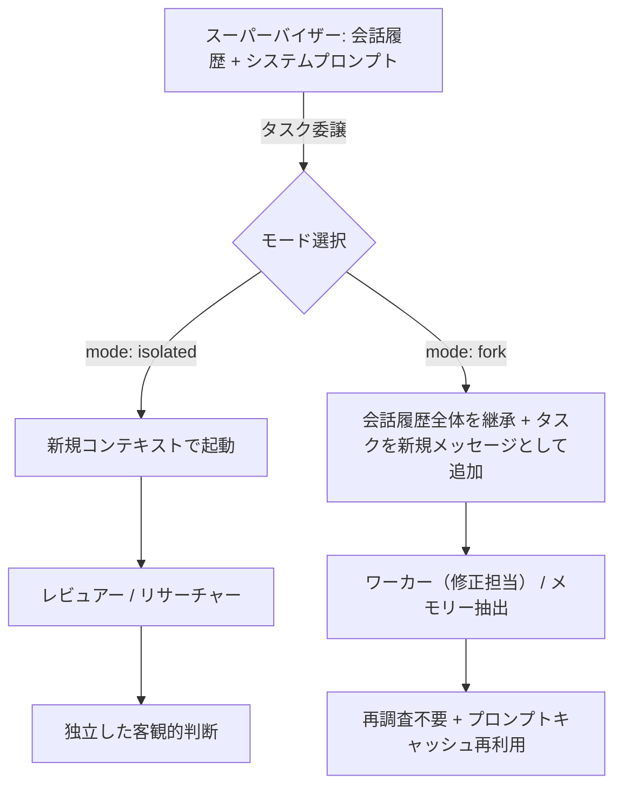
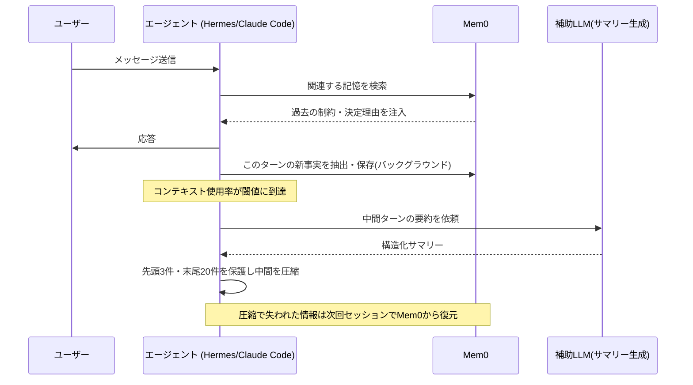
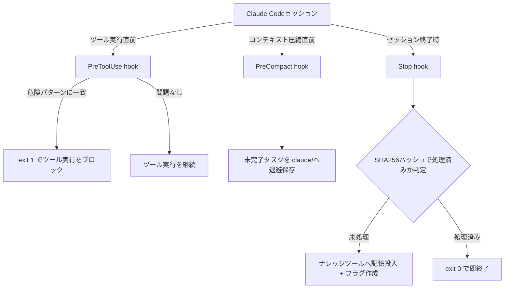

# Daily Briefing 2026-09-12

## 1. マルチエージェント・ハーネスにおけるコンテキストの整理術（原題: Organizing Context in a Multi-Agent Harness）

- **URL**: https://www.langchain.com/blog/organizing-context-in-a-multi-agent-harness
- **公開日**: 2026-09-08
- **著者・媒体**: Thushanth Bengre, Chester Curme（LangChain公式ブログ）

### 本文翻訳
著者らはまず、スーパーバイザー・エージェントがサブエージェントに作業を委譲する際の標準的な設計を振り返る。従来のサブエージェントは「isolated（分離）」モードで起動するのが基本であり、新規のコンテキストからスタートし、タスクの説明文だけを受け取って作業し、結果だけをスーパーバイザーに返す。この設計は、サブエージェントがスーパーバイザーの推論に引きずられずに独立した判断を下せるという利点がある一方で、明確な欠点も抱えている。スーパーバイザーがすでに読み込んだファイルやすでに把握している事実を、サブエージェントが自力でもう一度調べ直さなければならないという重複作業が発生し、レイテンシとトークンコストの両方を押し上げてしまう。

この問題に対して記事が提示するのが、もう一つのコンテキストモードである「fork（フォーク）」である。forkモードのサブエージェントは、スーパーバイザーの会話履歴全体・システムプロンプト・ツール定義をそのまま引き継いで起動する。委譲されたタスクの説明文は、継承した会話の末尾に新しいユーザーメッセージとして追加される形になる。この仕組みにより、サブエージェントは「今何が起きているか」をゼロから調べ直す必要がなく、スーパーバイザーがすでに収集した文脈の上に直接作業を積み上げられる。

著者らはこの2つのモードを使い分けるための実践的な指針を、エージェントの役割ごとに整理している。ワーカー・エージェント（すでに診断が終わった問題を修正し検証する役割）やメモリー・エージェント（会話全体から重要情報を抽出して保存する役割）は、fork モードが適している。すでに積み上がった文脈をそのまま利用できるため、再調査のコストがかからないからである。一方、レビュアー・エージェント（成果物を独立した視点で評価する役割）やリサーチャー・エージェント（自己完結した問いを調査する役割）は isolated モードが適している。スーパーバイザーの推論プロセスを見せてしまうと、レビュアーがその結論に無意識に同調してしまい、独立した判断ができなくなるおそれがあるためである。

パフォーマンス面での利点として、fork モードはプロンプトキャッシングの仕組みと相性が良い点が強調されている。フォークされたサブエージェントは、より多くのコンテキストを引き継いで起動するにもかかわらず、その継承した会話履歴の部分はスーパーバイザーがすでにAPIに送信済みのプレフィックスと一致するため、キャッシュがそのまま効く。結果として、重複したファイル読み込みや調査ステップを省略できるだけでなく、キャッシュヒットによるコスト削減と速度向上も同時に得られる。

実装面では、LangChainのDeep Agentsフレームワーク（Python: `uv add deepagents`、TypeScript: `pnpm i deepagents`）を通じてこの2つのモードが提供されており、サブエージェントの定義オブジェクトに `mode: "isolated"` または `mode: "fork"` を指定するだけで切り替えられる。記事では、レビュアーを isolated、ワーカー（修正担当）を fork として定義する具体的なコード例が示されており、単一のオーケストレーション設計の中で役割ごとに異なるコンテキスト戦略を混在させられることが示されている。著者らは最後に、このモード選択は単なる最適化ではなく「サブエージェントに何を知らせ、何を知らせないか」というハーネス設計そのものの意思決定であると結論づけている。

### 重要ポイント
- サブエージェントには「isolated（新規コンテキストで起動）」と「fork（スーパーバイザーの会話全体を継承）」の2つのコンテキストモードがある
- ワーカー・メモリー系のエージェントはfork、レビュアー・リサーチャー系のエージェントはisolatedが適しているという役割別の使い分け指針が示されている
- forkモードは継承した会話履歴部分がスーパーバイザー側のプロンプトキャッシュと一致するため、キャッシュヒットによるコスト削減と速度向上が得られる
- isolatedモードはスーパーバイザーの推論に引きずられない独立した判断を保証し、レビュアーの客観性を担保する
- LangChainのDeep Agentsフレームワークでは、サブエージェント定義の`mode`パラメータを切り替えるだけで両モードを実装できる

### 図解


### 現場での適用方法

**CLAUDE.md への追記例**
```markdown
## サブエージェント運用ルール（コンテキストモード）
- レビュー・監査・独立調査系のサブエージェントは、必ず新規コンテキストで起動すること
  （メインの会話の結論や仮説を事前に見せない）
- 診断済みの問題を修正・検証する系のサブエージェント、および会話全体から
  重要情報を抽出して記録する系のサブエージェントは、メインの会話履歴を
  引き継いだ状態で起動してよい（再調査を省略しコストを削減するため）
- どちらのモードを使うか判断に迷った場合は「このサブエージェントに
  スーパーバイザーの推論を見せてよいか」を基準にする。見せると
  独立性が損なわれる場合は分離、再調査コストの方が問題になる場合は継承。
```

**スクリプト化の例（Deep Agentsでのサブエージェント定義）**
```typescript
// レビュアー: 独立した客観的判断を優先し、分離モードで起動
const reviewerSubagent = {
  name: "reviewer",
  mode: "isolated",
  description: "実装済みの変更を独立した視点でレビューする",
};

// フィクサー: 診断済みの問題を修正するため、既存の文脈を継承して起動
const fixerSubagent = {
  name: "fixer",
  mode: "fork",
  description: "診断済みの問題を修正し、テストで検証する",
};
```

### 期待効果
forkモードにより、サブエージェントがスーパーバイザーの会話履歴をそのまま引き継げるため、ファイル読み込みや事前調査などの重複作業が不要になり、タスク完了までのレイテンシとトークンコストが下がる。加えて、継承部分はスーパーバイザー側のプロンプトキャッシュと一致するため、キャッシュヒットによるコスト削減効果も同時に得られる。一方isolatedモードを適切な役割に限定して使うことで、レビュアーやリサーチャーが持つべき独立した判断力を維持でき、複数エージェントが互いの推論に無意識に同調してしまう「意見の収束バイアス」を防げる。

### 注意点
- forkモードはより多くのコンテキストを継承するため、単純にトークン消費量そのものが増える場合がある。キャッシュヒットによるコスト相殺を前提とした設計であることを理解した上で採用する必要がある
- レビュアーやチェッカー役のサブエージェントを誤ってforkモードにすると、スーパーバイザーの結論に無意識に同調し、独立したチェック機能が形骸化するリスクがある
- 記事の例はLangChainのDeep Agentsフレームワーク固有の実装であり、他のオーケストレーションフレームワークでは同様の仕組みが提供されているとは限らない
- モードの使い分けはタスクの性質によって最適解が変わるため、役割ごとに固定的に決め打ちするのではなく、実際の再調査コストと独立性のトレードオフを踏まえて検証すべきである

## 2. HermesとClaude Codeのコンテキスト圧縮の実装比較、そこから何を学ぶべきか（原題: How Hermes and Claude Handle Context Compression in Real Production Agents (and What You Should Extract)）

- **URL**: https://mem0.ai/blog/how-hermes-and-claude-handle-context-compression-in-real-production-agents-(and-what-you-should-extract)
- **公開日**: 2026-05-14
- **著者・媒体**: Aashi Dutt（Mem0公式ブログ）

### 本文翻訳
著者は冒頭で、エンタープライズ向けAIエージェントが失敗する原因の多くはトークン数の上限そのものではなく「コンテキストの劣化」にあると指摘する。長いセッションが進むにつれて、重要な制約や決定理由が徐々に失われ、エージェントが同じ間違いを繰り返したり、既に合意した制約を無視したりするようになる。この課題に対する2つの実装例として、Hermes Agentの圧縮機構とClaude Codeの圧縮機構が詳細に比較される。

Hermesの圧縮は二層構造になっている。1つ目は「エージェント圧縮機」で、コンテキストウィンドウ使用率が50%に達した時点で発動する。2つ目は「ゲートウェイ安全網」で、意図的にオフセットされた85%で発動し、エージェント側の圧縮が何らかの理由で機能しなかった場合の最終防衛ラインとして働く。圧縮アルゴリズムは4段階で構成される。まず、200文字を超える冗長なツール実行結果を要約プレースホルダに置き換える。次に、会話の境界を決定する処理として、最初の3メッセージと直近20メッセージを保護対象とし、その間の中間部分だけを圧縮対象として特定する。3段階目では、補助LLMを使って中間ターンを構造化されたサマリーに変換する。重要なのは、2回目以降の圧縮では前回生成したサマリーをゼロから作り直すのではなく、既存のサマリーを更新する形で処理する点である。最後に、ツール呼び出しとその結果のペアの整合性を保つように会話全体を再構成する。200Kトークンのコンテキストウィンドウを想定した典型的な設定値としては、発動閾値10万トークン、末尾保護分2万トークン、サマリー最大サイズ1万トークンが例示されている。

本番運用で観測された失敗モードも具体的に記述されている。補助LLMの呼び出しが無効化されると、サマリー生成に失敗しても警告なしに中間ターンがそのまま削除されてしまうケース、圧縮後の末尾メッセージがたまたまツールロールから始まってしまいAPIがHTTP 400エラーを返すケース、そして10回連続で節約率が10%を下回ると圧縮処理自体が永続的にロックされてしまうケースなどが挙げられている。

対照的にClaude Codeの圧縮は、著者いわく「シンプルさと引き換えに制御を放棄する」設計である。開発者がコード上で行う設定はトークン閾値を指定するだけであり、あとはAnthropicが管理する圧縮ロジックとサマリー生成モデルに委ねられる。サマリーの中身は不透明なブロックとして扱われ、外部からカスタマイズやプラグインを差し込む余地はない。この対比から著者は、両者に共通する「圧縮後に必ず失われる情報」を5つのカテゴリに整理する。(1)正確な数値（「リトライ回数3」が「リトライは設定済み」のように抽象化される）、(2)ハードな制約（「テストファイルには触れない」といった禁止事項が消える）、(3)決定の理由（「コンプライアンス要件でPostgresを選んだ」という背景が失われる）、(4)ターンをまたいだ依存関係（ターン12の修正とターン47の関連が見失われる）、(5)暗黙的な嗜好（コーディングスタイルや応答のトーンが消える）。

この情報損失への対策として、著者はMem0とHermes・Claude Codeそれぞれの統合方法を提示する。Hermesでは、インストール後に `hermes memory setup` で永続記憶バックエンドとしてMem0を選択し、APIキーを入力するだけで統合が完了する。各ターンの前にキャッシュ済みのMem0検索結果がシステムプロンプトに注入され、各ターンの後にはバックグラウンドスレッドで新しい事実が自動的に抽出・インデックス化される。圧縮によって情報が失われても、次回セッション開始時にMem0から復元される。Claude Code側では、公式の圧縮機構そのものは変更できないため、開発者自身がメッセージ交換のたびにMem0クライアントで事実を抽出・保存し、システムプロンプト生成前に関連する記憶を検索して注入するコードを組み込む必要がある。著者は最後に、40ターンを超える実タスクを走らせた後に「ターン3で決めた制約を覚えているか」「ターン15の決定理由を知っているか」を確認し、どちらもNoであればすでに圧縮による情報損失が発生している、という簡便な診断基準を提示している。

### 重要ポイント
- Hermesは50%閾値のエージェント圧縮と85%閾値のゲートウェイ安全網という二層構造で、境界保護・構造化サマリー・ツール呼び出しペアの整合性保持という4段階アルゴリズムを持つ
- Claude Codeは単一のトークン閾値を指定するだけの「制御を手放したシンプルな設計」であり、サマリーは不透明で外部からカスタマイズできない
- 圧縮によって必ず失われる情報は「正確な数値」「ハードな制約」「決定理由」「ターン間の依存関係」「暗黙的嗜好」の5カテゴリに整理できる
- Mem0との統合により、圧縮で失われた情報を次回セッション開始時に復元し「セッションをまたいだ確実性」を担保できる
- 40ターン以上の実タスク後に「初期の制約・決定理由を覚えているか」を確認することで、圧縮による情報損失の有無を簡易診断できる

### 図解


### 現場での適用方法

**運用手順（コンテキスト圧縮によるセッションをまたいだ記憶喪失を防ぐ）**
1. 自社エージェントの圧縮発動閾値（トークン数または使用率）を確認し、末尾保護メッセージ数とサマリー最大サイズを明文化する
2. `pip install mem0ai` などでMem0クライアントを導入し、APIキーを設定する
3. 各メッセージ交換のたびに、決定理由・数値制約・禁止事項などの「圧縮で失われやすい情報」を明示的にMem0へ追加する処理を組み込む
4. システムプロンプトを生成する直前に、直近のユーザー発話をクエリとしてMem0を検索し、関連する記憶を上位数件注入する
5. 40ターン程度の実タスクを走らせ、初期に伝えた制約・決定理由をエージェントが覚えているか確認するテストを定期的に実施する

**スクリプト化の例（Claude Code向けMem0統合の骨子）**
```python
from mem0 import MemoryClient

mem0 = MemoryClient(api_key="<MEM0_API_KEY>")

def after_turn(messages, user_id):
    # 各交換後、圧縮で失われる前に事実を抽出・保存する
    mem0.add(messages, user_id=user_id)

def before_system_prompt(user_message, user_id):
    # システムプロンプト生成前に関連記憶を検索して注入する
    memories = mem0.search(query=user_message, user_id=user_id, limit=5)
    return "\n".join(m["memory"] for m in memories)
```

### 期待効果
記事によれば、圧縮単独では「そのセッション内での記憶」しか保証されず、セッションをまたいだ確実性はMem0のような外部記憶との併用で初めて実現される。Hermesの構造化サマリーとMem0の永続記憶を組み合わせることで、圧縮後も初期の制約・決定理由・数値情報が次回セッションで復元され、エージェントが同じ間違いを繰り返すリスクを抑えられる。40ターンを超える長時間タスクにおける「初期制約の記憶保持テスト」に合格する状態を維持できれば、圧縮による実務上の劣化を許容範囲に収められる。

### 注意点
- Hermesのゲートウェイ安全網は補助LLM呼び出しが無効化されると機能せず、警告なしに中間ターンが削除される失敗モードがある。補助LLMの可用性監視が必須
- 圧縮後の末尾メッセージがツールロールから始まるとAPIエラー（HTTP 400）になるケースが報告されており、境界決定ロジックの実装には注意が必要
- Claude Codeの圧縮は不透明なブロックとして扱われるため、外部からサマリー内容を検査・カスタマイズできず、Mem0統合はあくまで外付けの補完策にとどまる
- Mem0への事実抽出・保存はバックグラウンド処理としても追加のAPIコストと遅延を伴うため、全ターンで無条件に実行するとコストが積み上がる可能性がある

## 3. Claude Codeのhooks実践 — Stop/PreToolUse/PreCompactで自動化と安全弁を仕込む

- **URL**: https://qiita.com/leven-E/items/e601c14e86b7621685ef
- **公開日**: 2026-06-14
- **著者・媒体**: leven-E（Qiita個人ブログ）

### 本文翻訳
著者はまず、Claude Code の hooks を「エージェントのライフサイクル上の特定のタイミングに、シェルスクリプトを確実に割り込ませる仕組み」と定義する。AIの判断に依存せず、条件を満たせば100%発火するという決定論的な性質が、hooksの最大の価値だと強調される。記事では3種類のフックについて、実際に運用しているスクリプトとともに解説される。

1つ目はStopフックで、セッション完了時に自動実行される。著者の用途は、ふりかえり記録ファイル内の「## 記憶投入」セクションを、自作のナレッジ蓄積ツールに自動投入する処理である。実装上の要点は冪等性の確保にある。会話ログから該当セクションを抽出し、その内容のSHA256ハッシュをフラグファイル名として使うことで、同一内容に対して二重に外部API呼び出しが走ることを防いでいる。該当セクションが存在しない場合は即座に終了し、無駄な処理を避ける。著者は「Stop/PostToolUse系のフックは原則exit 0で終える」という運用ルールを明記しており、これらのフックで非ゼロの終了コードを返すとエラー扱いになり意図しない挙動を招くためだと説明している。

2つ目はPreToolUseフックで、ツールが実行される直前にゲートキーパーとして働く。著者の用途は、`rm -rf`、`git reset --hard`、`git clean -fd`、`docker system prune`、SQLの`DROP TABLE`や`TRUNCATE`といった不可逆的な破壊的コマンドの事前ブロックである。実装では、渡されるツール入力のJSONからコマンド文字列を取り出し、あらかじめリスト化した危険パターンのいずれかに一致した場合はexit 1を返してツールの実行そのものを止める。このとき標準エラー出力にブロック理由を書き出すことで、Claude側にも理由が伝わるようにしている。著者は「PreToolUseフックだけは非ゼロの終了コードでツール実行をブロックする、という特別な意味を持つ」と、他のフックとの挙動の違いを明確に区別している。

3つ目はPreCompactフックで、コンテキスト圧縮が実行される直前に発火する。著者の課題意識は、圧縮によって会話中に残っていた「`- [ ]`形式の未完了タスク」が失われてしまう点にあった。対策として、圧縮直前に会話ログ全体から未完了タスクの行を正規表現で抽出し、タイムスタンプ付きのファイル名で`.claude/`ディレクトリ配下に保存する処理を実装している。複数回の圧縮が発生してもファイル名が重複しないよう、実行時刻を秒単位でファイル名に含めている点がポイントである。

記事の後半では、これら3つのフックを登録する `settings.json` の基本形が示され、いずれも絶対パスでスクリプトを指定する必要があると注意喚起されている（`~/`のようなチルダ展開はhooksの実行コンテキストでは機能しないため）。さらに、実運用で踏んだ落とし穴が表形式で整理されている。冪等性の欠如によって同一処理が重複実行される問題への対策としてコンテンツハッシュによるフラグ管理を、hookスクリプト内からClaudeのAPIを直接呼び出してしまうことによる無限ループのリスクへの対策として外部サービスやシェルコマンドのみを使う方針を、それぞれ具体的に提示している。著者は最後に、人間が手作業で守っていた運用ルールをフックというコードに委譲することで、Claude Code運用が属人的な注意力に依存しない「機構として動く状態」に進化すると結論づけている。

### 重要ポイント
- hooksは条件を満たせば100%決定論的に発火する仕組みであり、AIの判断に依存せず安全弁やルール強制を実装できる
- StopフックはSHA256ハッシュによるフラグ管理で冪等性を確保し、同一内容への重複処理を防ぐ設計が要点
- PreToolUseフックのみが非ゼロの終了コードでツール実行そのものをブロックするという特別な意味を持ち、破壊的コマンドの事前阻止に使える
- PreCompactフックを使うと、圧縮によって失われがちな未完了タスクなどの情報を圧縮直前にファイルへ退避できる
- hookスクリプト内からClaude自身のAPIを呼び出すと無限ループのリスクがあるため、外部サービスやシェルコマンドの利用に限定すべき

### 図解


### 現場での適用方法

**スクリプト化の例（settings.json — 3フックの登録）**
```json
{
  "hooks": {
    "Stop": [{
      "matcher": "",
      "hooks": [{ "type": "command", "command": "<REPO_PATH>/.claude/hooks/remember.sh" }]
    }],
    "PreToolUse": [{
      "matcher": "Bash",
      "hooks": [{ "type": "command", "command": "<REPO_PATH>/.claude/hooks/pre-bash-guard.sh" }]
    }],
    "PreCompact": [{
      "matcher": "",
      "hooks": [{ "type": "command", "command": "<REPO_PATH>/.claude/hooks/pre-compact.sh" }]
    }]
  }
}
```

**スクリプト化の例（pre-bash-guard.sh — 破壊的コマンドのブロック）**
```bash
#!/usr/bin/env bash
TOOL_INPUT="${CLAUDE_HOOK_TOOL_INPUT:-{}}"
COMMAND=$(echo "$TOOL_INPUT" | python3 -c "import sys,json; print(json.load(sys.stdin).get('command',''))" 2>/dev/null)

DANGER_PATTERNS=("rm -rf" "git reset --hard" "git clean -fd" "docker system prune" "DROP TABLE" "TRUNCATE")
for PATTERN in "${DANGER_PATTERNS[@]}"; do
  if echo "$COMMAND" | grep -qF "$PATTERN"; then
    echo "Blocked by pre-bash-guard: matched '$PATTERN'" >&2
    exit 1
  fi
done
exit 0
```

**スクリプト化の例（pre-compact.sh — 未完了タスクの退避）**
```bash
#!/usr/bin/env bash
TODOS=$(grep -n "- \[ \]" "$CLAUDE_TRANSCRIPT_PATH" 2>/dev/null || true)
[[ -z "$TODOS" ]] && exit 0

SAVE_FILE="<REPO_PATH>/.claude/pre-compact-todos-$(date +%Y%m%d-%H%M%S).md"
cat > "$SAVE_FILE" << EOF
# 残課題保全 ($(date '+%Y-%m-%d %H:%M:%S'))
$TODOS
EOF
exit 0
```

### 期待効果
PreToolUseフックによって`rm -rf`や`git reset --hard`のような不可逆コマンドを事前ブロックできるため、AIエージェントの誤操作による破壊的事故を機構的に防止できる。PreCompactフックにより、コンテキスト圧縮で失われがちな未完了タスクの情報をファイルとして残せるため、圧縮後もタスクの継続性を保ちやすくなる。Stopフックでのナレッジ自動投入は、セッションごとの学びを手作業なしに蓄積する仕組みとして機能し、人間が「覚えていて後で書き写す」という属人的な作業を排除できる。

### 注意点
- hookスクリプト内でパスを`~/`のようなチルダ表記にすると展開されず失敗するため、必ず絶対パスで記述する必要がある
- Stop/PostToolUse系のフックで非ゼロの終了コードを返すとエラー扱いになるため、PreToolUse以外では原則`exit 0`で終えるという終了コードの意味の違いを正しく理解する必要がある
- hookスクリプトから直接Claudeのモデル呼び出しAPIを叩くと無限ループに陥るリスクがあるため、外部サービス連携やシェルコマンドの範囲に留めるべきである
- 冪等性を担保するフラグファイル（本記事ではSHA256ハッシュベース）の運用を怠ると、同一処理の重複実行や外部APIへの意図しない多重リクエストが発生しうる
