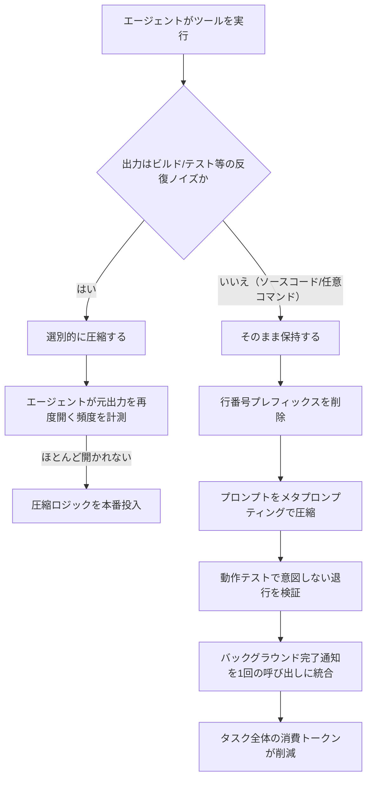
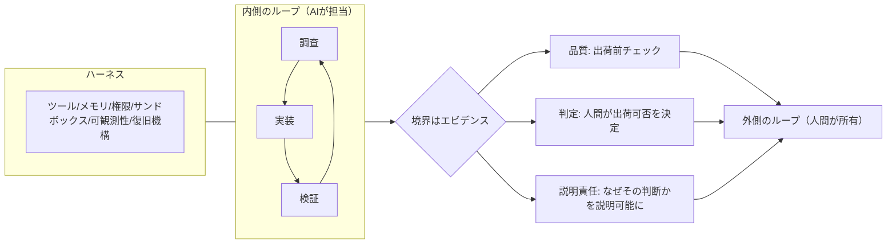
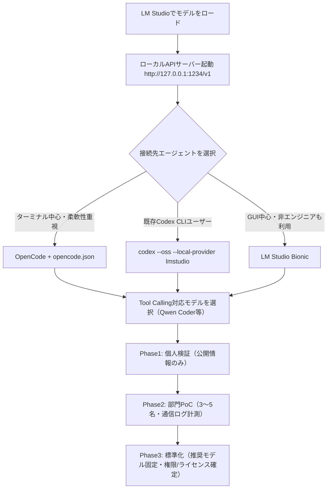

# Daily Briefing 2026-09-13

## 1. トークン数を減らすだけでは不十分——GitHub CopilotのAIコーディングにおけるコスト効率化（原題: How we make AI coding more cost efficient without sacrificing task quality）

- **URL**: https://github.blog/ai-and-ml/github-copilot/how-we-make-ai-coding-more-cost-efficient-without-sacrificing-task-quality/
- **公開日**: 2026-09-02
- **著者・媒体**: Erik Kristensen, Napalys Klicius / GitHub Blog（GitHub Copilotチーム）

### 本文翻訳
トークン数を単純に減らすことが、コスト削減につながるとは限らない——この記事はこの直感に反する事実から始まる。個々の応答を短縮しても、その結果としてエージェントが必要な情報を欠いてしまえば、情報を取り戻すための追加ターンが発生し、結果的に総コストは増加する。実際、シェル出力を圧縮する社内ツール「RTK」の検証では、個別の応答は短くなったものの、有用な詳細が失われたことで復旧ステップが増え、ターン数が増加し、かえって多くのコンテキストが後続の呼び出しへ運ばれるという悪循環が観測された。この経験から著者たちは、個別ツール呼び出しではなく「タスク全体で消費されるトークンの総量」を最適化対象に据える方針へ転換した。

記事は、この方針のもとで実際にプロダクションに投入した4つの施策と、それぞれのコスト削減率を紹介する。第一に「選別的な出力圧縮」（5.5%削減）。インストール・ビルド・テスト・リントの出力は同じパターンが繰り返されるノイズを多く含む一方、ソースコードや任意のコマンド結果には重要な情報が含まれる、という区別に基づき圧縮対象を絞り込んだ。当初はgitコマンドの出力まで圧縮する過度な設定だったが、エージェントが保存された元の出力を再度開く頻度を追跡し、ほとんど開かれないことを確認してから展開した。

第二に「行番号プレフィックスの削除」（3.1%削減）。かつてのファイル編集ツールは行番号を手がかりに編集位置を特定していたが、現在はコンテキストマッチングで位置を特定するため、行頭の「1 」「2 」といった番号表記は不要になっていた。オフラインベンチマークで推論コストが約5%下がり、編集失敗率が悪化しないことを確認してから本番投入し、オンラインでは約3%の削減を確認した。第三に「プロンプトの圧縮」（2.9%削減）。Copilot自身にメタプロンプティングのループで自らのツール説明・スキーマ・システム指示を反復的に書き直させ、約50%（1ターンあたり約1,300トークン）を削減した。ただし初期版では独立エージェント同士の並列実行が順序実行に退化するという意図しない退行が発生し、専用の「動作テスト」で検出・修正してから展開した。第四に「バックグラウンドタスクの通知統合」（2.3%削減）。従来はシェルコマンドとサブエージェントの完了をそれぞれ別ターンで取得する必要があり4回のモデル呼び出しを要していたが、完了イベントを既存のツール結果形式に合成して直接配信することで、1回の呼び出しで両方の結果を処理できるようにした。

記事は最後に5つの教訓を示す。個々のツール呼び出しではなくタスク全体を最適化すること、モデルに賢さを求めるのではなく不要なターンそのものを消す「オーケストレーション最適化」を狙うこと、圧縮は出力の性質ごとに判断し復旧パスの利用頻度で効果を検証すること、プロンプトの書き直しは意図しない退行を招くため動作テストが必須であること、そして効果はワークロード固有であり製品ごとに再検証が必要であること。

### 重要ポイント
- 「トークンが少ない＝効率的」ではなく、「復旧のための追加ターンを発生させない」ことが真の効率化指標
- 4施策（出力圧縮5.5%、行番号削除3.1%、プロンプト圧縮2.9%、通知統合2.3%）はいずれも実測データに基づく段階的検証を経て本番投入
- 圧縮対象はログの反復ノイズに限定し、ソースコードや任意コマンド結果は無圧縮のまま保持
- プロンプトの自動圧縮は並列実行の退化など意図しない副作用を生みうるため、専用の動作テストが必須
- 最適化効果はワークロード（CLI／コードレビュー／アプリ）ごとに異なり、横展開時は必ず再検証する

### 図解


### 現場での適用方法
Claude CodeのHookを使い、ツール出力のうちビルド/テストログのような反復ノイズだけを圧縮し、`git diff`や`cat`のような重要出力は無圧縮で通す仕組みを作る。

`<REPO_PATH>/.claude/hooks/compact_tool_output.sh`
```bash
#!/usr/bin/env bash
# PostToolUse hook: 反復性の高いビルド/テストログのみを圧縮する
set -euo pipefail

INPUT=$(cat)
TOOL_NAME=$(echo "$INPUT" | jq -r '.tool_name')
CMD=$(echo "$INPUT" | jq -r '.tool_input.command // ""')
OUTPUT=$(echo "$INPUT" | jq -r '.tool_output // ""')

# git diff / cat / read 系は無圧縮で通す（重要情報を保持）
if [ "$TOOL_NAME" = "Bash" ] && echo "$CMD" | grep -qE '^(git diff|git log|cat |git show)'; then
  exit 0
fi

# npm install / build / test の反復ログのみ圧縮
LINES=$(echo "$OUTPUT" | wc -l)
if [ "$LINES" -gt 50 ] && echo "$CMD" | grep -qE 'npm (install|run build|test)|make|pytest'; then
  COMPACTED=$(echo "$OUTPUT" | grep -E '(error|Error|FAIL|✗)' | head -n 20)
  if [ -z "$COMPACTED" ]; then
    COMPACTED="(${LINES} lines omitted: no errors detected. Original output saved at /tmp/last_build.log)"
  fi
  echo "$OUTPUT" > /tmp/last_build.log
  jq -n --arg out "$COMPACTED" '{tool_output: $out}'
fi
```

`<REPO_PATH>/.claude/settings.json` への追記例
```json
{
  "hooks": {
    "PostToolUse": [
      {
        "matcher": "Bash",
        "hooks": [
          { "type": "command", "command": "bash .claude/hooks/compact_tool_output.sh" }
        ]
      }
    ]
  }
}
```
展開前に必ず「エージェントが `/tmp/last_build.log` を再度開く頻度」をログで計測し、ほぼ再取得されないことを確認してから本採用する（記事の検証手法を踏襲）。

### 期待効果
記事の実測値では、4施策の合計で約14%（5.5%+3.1%+2.9%+2.3%、施策間の相互作用により単純合算値より若干低い可能性あり）のコスト削減を達成。自社のMCPサーバーやカスタムハーネスに同様の「反復ノイズのみ圧縮・重要出力は保持」という設計原則を適用すれば、同種の削減が期待できる。

### 注意点
- 圧縮対象を誤って重要な差分情報（git diff等）まで含めると、エージェントの復旧試行が増え逆にコストが増加する
- プロンプトの自動圧縮は並列実行や副作用の扱いを壊しやすいため、専用の回帰テスト（動作テスト）を用意すること
- 効果はプロダクト・ワークロードごとに異なるため、他チームの数値をそのまま流用せず自環境で再計測が必要

## 2. 外側のループを所有せよ——AIエージェント時代のエンジニアの責任（原題: Own the Outer Loop）

- **URL**: https://www.oreilly.com/radar/own-the-outer-loop/
- **公開日**: 2026-09-09
- **著者・媒体**: Addy Osmani / O'Reilly Radar

### 本文翻訳
AIエージェントが実装作業の大半を担うようになった今、エンジニアが持つべき責任はどこにあるのか。Addy Osmaniは、AI Engineer World's Fair 2026の基調講演をもとにしたこの記事で、「エンジニアは内側のループではなく、外側のループを所有すべきだ」と主張する。内側のループとは調査・実装・検証・反復というAIが担う反復サイクルであり、外側のループとは、その成果を出荷するかどうかを判断し説明責任を負う人間の領域を指す。

Osmaniはまず、エージェントを支える三層構造を提示する。「ハーネス」はモデル本体に、ファイル・ツール・メモリ・スキル・サンドボックス・権限・可観測性・復旧機構を組み合わせた土台であり、エンジンを安全に走らせる「車体」に相当する。「ループ」は調査→実装→検証→反復という繰り返し可能なサイクルで、モデル自身ではなく独立した検証機構が完了を判定する。そして複数のループを同時並行で走らせる体制が「ソフトウェアファクトリー」であり、内部ではエージェントが作業を処理し、境界では人間が意思決定を所有する。この境界を分ける基準は「エビデンス（証拠）」であるというのが記事の核心的な主張だ。

記事はさらに、この委譲が生む三つの隠れたコストを指摘する。第一に「認知的降伏」——Whartonの研究によれば、AIが誤った判断を下しても約73%の人がそれを受け入れ、むしろ確信を強めてしまう。第二に「認知的債務」——Anthropicの研究では、AI支援を受けた技術者の理解度テストの正答率が50%にとどまったのに対し、支援を受けなかった群は67%に達し、長期的な計画に関わるほどこの差は拡大する。第三に「オーケストレーション税」——複数エージェントの監督は自動化できず、方向付けや判断には継続的な人間の認知的労力が必要になる。

Sonarの2026年調査ではAIが関与したコミットの割合が42%に達したとされ、GitLabの報告はレビューと検証がボトルネックとなり、ガバナンスが事後対応に追われている実態を指摘する。こうした状況に対しOsmaniは、「品質（Quality）」「判定（Verdict）」「説明責任（Answerability）」という三つの概念を軸に据えることを提案する。品質はシステムを解放する前のチェック機構、判定はエビデンスに基づき人間が下す出荷可否の最終決定、説明責任はなぜその判断に至ったかを後から説明できることを指す。さらに、客観的指標がまだ存在しない領域で機能する定性的判断力である「テイスト（taste）」を、命名・具体例・明示的根拠によって暗黙知から運用可能な知へ言語化することの重要性も説く。既存システム（ブラウンフィールド）への適用は特に危険であり、暗黙知を明示的な制約に変換し、検証手順とエビデンスに結びつける作業が不可欠だとする。

### 重要ポイント
- 「内側のループ（調査・実装・検証）」はAIに委ね、「外側のループ（出荷判断・説明責任）」は人間が所有すべきという分業モデル
- ハーネス→ループ→ソフトウェアファクトリーの三層で、内部と外部の境界を分けるのは「エビデンス」
- 委譲がもたらす3つの隠れコスト：認知的降伏（誤りを73%が受容）、認知的債務（理解度50%対67%）、オーケストレーション税
- 品質・判定・説明責任の三つ組みで「出荷してよいか」を運用可能な形にする
- 既存システム（ブラウンフィールド）ほど暗黙知の明文化と検証エビデンスへの紐付けが重要

### 図解


### 現場での適用方法
プロジェクトのCLAUDE.mdに「説明責任契約（Accountability Contract）」の章を追加し、エージェントが出荷判断を人間に委ねる運用を明文化する。

`<REPO_PATH>/CLAUDE.md` への追記例
```markdown
## 説明責任契約（Accountability Contract）

このリポジトリでは、エージェントの生成物は「内側のループ」の成果物に過ぎない。
マージ・デプロイの判断（外側のループ）は必ず人間が行う。

### PRを出す前にエージェントが提示すべきエビデンス
- [ ] 変更内容の要約（何を・なぜ変えたか）
- [ ] 実行したテストコマンドと結果（ログを添付）
- [ ] 影響範囲（変更していないが関連するモジュール一覧）
- [ ] 既知のリスク・未検証のエッジケース

### 判定（Verdict）の記録
PRの説明欄に以下を必ず記載すること：
- 判定者: <レビュアー名>
- 判定: 承認 / 差し戻し / 条件付き承認
- 判定根拠: <どのエビデンスに基づき判断したか>

### 禁止事項
- エージェントは自身の変更を自己承認してマージしない
- 「テストが通った」のみを根拠にした無条件マージを禁止する（テスト範囲外のリスクを人間が再確認する）
```
併せて、PRテンプレート（`.github/pull_request_template.md`）に上記チェックリストを転記し、CIで「エビデンス欄が空のPRをブロックする」軽量チェック（例：説明欄に`実行したテストコマンド`という文字列が無ければCIをfailさせる）を追加すると運用が定着しやすい。

### 期待効果
説明責任契約を明文化したチームでは、記事が指摘する「認知的降伏」（誤ったAI出力を無批判に受け入れる割合、研究値では約73%）を構造的に抑制できる。判定者と根拠を必須記録にすることで、事後のインシデント調査や監査対応が容易になり、GitLabが指摘する「レビュー・検証のボトルネック化」への備えにもなる。

### 注意点
- 記事はあくまで概念モデルの提示であり、即座に導入できる具体的なツールやスクリプトは提供していない点に留意
- チェックリストを形骸化させると「認知的降伏」を防ぐ効果が失われるため、レビュアーが実際にエビデンスを検証する運用文化が前提となる
- 既存の大規模システム（ブラウンフィールド）に適用する場合は、暗黙知の明文化に相応の初期コストがかかる

## 3. ローカルLLMでコーディングエージェントを動かす——OpenCode・Codex CLI・LM Studio Bionicの選び方と設定手順

- **URL**: https://qiita.com/ProgrammingForEver/items/7999bf628aea7e1d6ce8
- **公開日**: 2026-08-20
- **著者・媒体**: @ProgrammingForEver（Qiita）

### 本文翻訳
記事は「ソースコードの機密保護」「API利用費用の削減」「ネットワーク制限環境への対応」といった企業現場で実際に生じる課題を導入として提示し、これらを解決する手段としてLM Studioを使ったローカルLLM実行を位置づける。その上で、ローカルLLMをコーディングエージェントと組み合わせる3つのアプローチを比較する。

1つ目は「OpenCode＋LM Studio」。ターミナル中心で柔軟に使いたい開発者向けで、`opencode.json`に`baseURL: "http://127.0.0.1:1234/v1"`のようなOpenAI互換エンドポイントを指定し、`limit.context`（例：32768）や`limit.output`（例：8192）でコンテキスト長・最大出力トークンを細かく設定できる。事前に`curl http://127.0.0.1:1234/v1/models`でLM Studioが認識しているモデルIDを確認し、その値を正確に設定へ反映することが強調されている。

2つ目は「Codex CLI＋LM Studio」。`codex --oss --local-provider lmstudio`という単一コマンドで起動でき、既存のCodex CLIユーザーがクラウドモデルからローカルモデルへ段階的に移行する経路として位置づけられる。3つ目は「LM Studio Bionic」。GUI中心で導入が容易で、非エンジニアも含めたWork Project（文書作成）とCode Project（コード編集）の両方に対応し、セッションごとにローカル実行かリモート/クラウド実行かを切り替えられる。

いずれのアプローチでも、エージェントとして使う以上「コード生成能力」だけでなく「Tool Calling（関数呼び出し）」への対応が重要だと指摘する。Tool Callingをうまく扱えないモデルは、応答文自体は生成できてもファイル編集やコマンド実行が不安定になる。候補としてQwen Coder系、DeepSeek Coder系、gpt-oss系、Gemma系が挙げられている。

企業導入にあたっては4つの必須確認事項が示される。(1)モデルの実行場所（端末内・自社GPU・外部クラウドのいずれか）を画面上で常に確認できるようにすること、(2)推論自体はローカルでもモデルのダウンロードやアップデート確認、Web検索、MCP・外部ツール連携、テレメトリーなどが外部通信しうること、(3)読み書き対象フォルダ・シェル実行可否・Git push制限・削除操作の承認といったエージェントの権限管理を細かく設計すること（初期導入は読み取り専用または小規模な検証リポジトリから始めるのが安全）、(4)オープンモデルであっても商用利用・再配布・生成物利用に条件が付く場合があるためライセンスを事前確認すること。

導入は3段階のフェーズで進めることを推奨する。Phase1「個人検証」では公開情報のみを使い小規模コードベースで読み取り・要約・軽微修正の精度をクラウドモデルと比較する。Phase2「部門PoC」では対象者を3〜5名に限定し、誤編集率・処理時間・修正時間・通信ログを計測する。Phase3「標準化」では推奨モデルを固定し、必須承認操作を定義し、機密区分ごとの実行先（ローカル/リモート/クラウド）を決定し、標準の`opencode.json`を配布してBionicの運用手順書を整備する。結論として、一般利用者にはBionic、開発者にはOpenCodeまたはCodex CLIという二層構成を提示している。

### 重要ポイント
- ソースコード保護・API費用削減・ネットワーク制限対応が、ローカルLLM導入の主な動機
- OpenCode（ターミナル・柔軟）、Codex CLI（既存ユーザーの移行経路）、LM Studio Bionic（GUI・非エンジニア対応）の3方式を使い分ける
- コード生成能力だけでなくTool Calling対応がエージェント運用の成否を分ける
- 企業導入では「実行場所の可視化」「通信経路の把握」「権限管理」「ライセンス確認」の4点が必須
- Phase1個人検証→Phase2部門PoC（3〜5名）→Phase3標準化という段階的ロールアウトが現実的

### 図解


### 現場での適用方法
OpenCode + LM Studioの最小構成をセットアップする運用手順。

ステップ1: LM Studioでモデルをロードし、ローカルサーバーを起動（LM StudioのGUIまたはCLIから）。

ステップ2: 認識されているモデルIDを確認する。
```bash
curl http://127.0.0.1:1234/v1/models | jq '.data[].id'
```

ステップ3: `<REPO_PATH>/opencode.json` を作成する（モデルIDはステップ2の出力に置き換える）。
```json
{
  "$schema": "https://opencode.ai/config.json",
  "provider": {
    "lmstudio": {
      "npm": "@ai-sdk/openai-compatible",
      "baseURL": "http://127.0.0.1:1234/v1",
      "models": {
        "<MODEL_ID_FROM_STEP2>": {
          "limit": {
            "context": 32768,
            "output": 8192
          }
        }
      }
    }
  }
}
```

ステップ4: Tool Calling対応を事前確認するため、簡単なファイル編集タスクを与えて動作検証する。
```bash
opencode run --provider lmstudio "READMEに一行コメントを追加して"
```

ステップ5: 企業導入を検討する場合は、読み取り専用の検証リポジトリを別途用意し、以下のチェックリストで権限を最小化する。
```markdown
## ローカルLLM導入前チェックリスト（<PROJECT_NAME>）
- [ ] 実行場所（Local/Remote/Cloud）を画面表示で常時確認できる
- [ ] モデルDL・アップデート確認・Web検索・MCP連携・テレメトリーの通信先を把握した
- [ ] 書き込み対象フォルダとGit push可否を制限した
- [ ] 利用モデルのライセンス（商用利用・再配布条件）を確認した
```

### 期待効果
記事によれば、ソースコードを外部送信せずに機密性の高いコードベースでエージェントを利用でき、API利用費用の削減とネットワーク制限環境（オフライン・社内ネットワークのみ）への対応が可能になる。段階的ロールアウト（Phase1〜3）により、誤編集率や処理時間を定量的に把握した上で全社標準化に進めるため、いきなり全社導入するより導入リスクを抑えられる。

### 注意点
- Tool Calling対応が弱いモデルを選ぶと、応答は生成できてもファイル編集・コマンド実行が不安定になる
- 推論自体はローカルでも、モデルのダウンロードやテレメトリー等で意図せず外部通信が発生しうるため、事前のネットワーク経路確認が必須
- オープンモデルでもライセンス条件（商用利用・再配布・生成物利用）を事前確認しないと、企業利用で問題化するリスクがある
- 初期導入は読み取り専用・小規模な検証リポジトリから始め、いきなり本番リポジトリに書き込み権限を与えないこと
