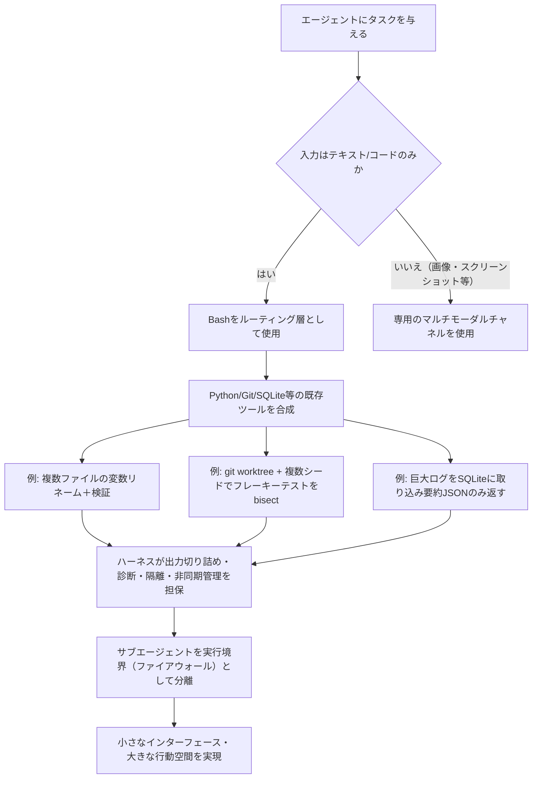
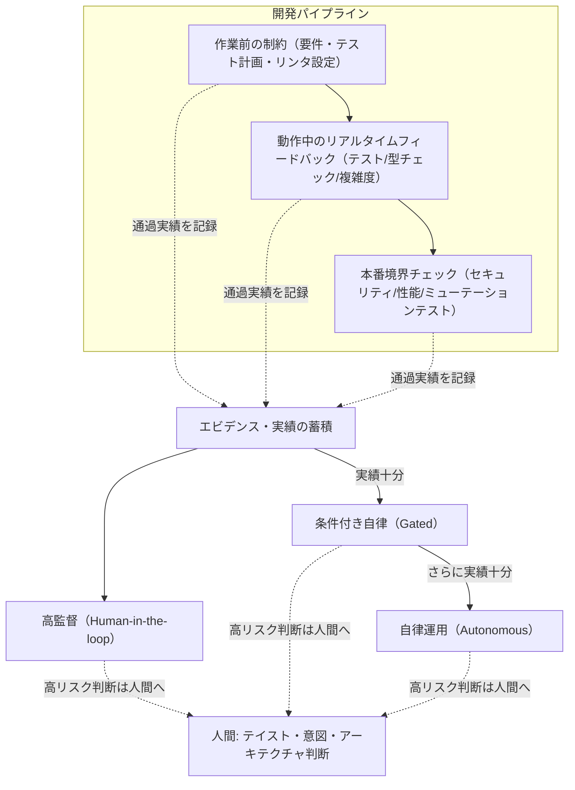
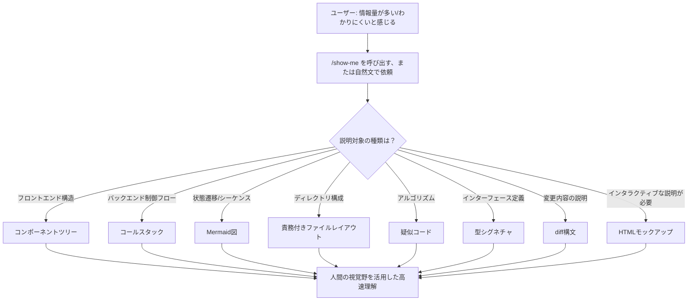

# Daily Briefing 2026-09-14

## 1. 基盤モデルはBashで超人的になった（原題: How Foundational Models Became Superhuman in Bash）

- **URL**: https://www.philschmid.de/superhuman-bash
- **公開日**: 2026-09-01
- **著者・媒体**: Philipp Schmid（個人ブログ）

### 本文翻訳
Philipp Schmidはこれまで、コーディングエージェント向けのツール設計として「原子的で目的特化した専用ツール」を推奨してきた——ファイル編集、検索、置換などをそれぞれ独立したツールに分離し、コンテキストの氾濫や汚染を防ぐという立場である。しかし本記事で彼は、この立場を明確に転換する。現在のフロンティアモデルは、Python・Git・SQLiteなど既存のユーティリティを組み合わせた複雑なBashワークフローを、数秒で合成できるレベルに達しており、これは人間の開発者が対話的な確認を挟みながら相応の時間をかけて行う作業に匹敵するという。専用ツール群を用意するよりも、Bashを「ルーティング層」としてこれら既存ツールを自在に組み合わせさせる方が、結果的に高い能力を引き出せると彼は主張する。

記事はこの主張を3つの実例で裏付ける。1つ目は複数ファイルにまたがる変数リネームで、Pythonスクリプトがまず置換対象の出現回数を検証してから実際の置換を行い、続けてフォーマッタ・リンタ・型チェッカー・テストを連鎖的に実行する。2つ目はフレーキーテスト（不安定に失敗するテスト）の原因特定で、Gitのworktreeを使ってローカルの作業状態を保持したまま、複数の乱数シードでbisect（二分探索）を実行し、偶発的な失敗による誤検知を避ける。3つ目は本番環境の巨大なログファイル解析で、圧縮ログをSQLiteに取り込み、結合とP95パーセンタイル計算を行った上で、生データではなく要約されたJSONのみをエージェントのコンテキストへ返す「コンテキストのオフロード」を実践している。

このアプローチが機能する背景には、頑健な基盤モデルが「出力の切り詰め・診断・隔離ポリシー・非同期プロセス管理」といった、かつてツール側が担っていた責務をハーネス自身の設計で吸収できるようになったことがある。したがって設計目標は「小さなインターフェースと大きな行動空間」に置き換わる。専用ツールを削ぎ落とし、サブエージェントを実行の防波堤（ファイアウォール）として使い、システム指示は最小限に留めてタスクの文脈を優先させることが推奨される。ただし例外もある。スクリーンショットのような視覚的な入出力を扱うマルチモーダルな場面では、Bashでは代替できない専用チャネルが依然として必要だと釘を刺している。

### 重要ポイント
- 著者は「専用ツールを増やす」から「Bashに既存ユーティリティを合成させる」へと自らの設計方針を転換
- 3つの実例（複数ファイルリネーム、Git worktreeによるフレーキーテスト特定、SQLiteによるログのコンテキストオフロード）は具体的な手法として再現可能
- 出力の切り詰め・診断・隔離・非同期管理は依然としてハーネス側の責務であり、モデル任せにはできない
- 設計目標は「小さなインターフェース・大きな行動空間」——専用ツールの削減とサブエージェントによる実行境界の設定
- マルチモーダル（スクリーンショット等）はBashでは代替できない唯一の例外

### 図解


### 現場での適用方法
CLAUDE.mdに「専用ツールよりBash合成を優先する」方針と、サブエージェントを実行境界として使う指示を追記する。

`<REPO_PATH>/CLAUDE.md` への追記例
```markdown
## ツール設計方針（Bashオーケストレーション優先）

- ファイル検索・一括置換・ログ解析などは、専用スクリプトを新規作成する前に
  まず `bash` + 既存CLI（git, jq, sqlite3, ripgrep等）の組み合わせで実現できないか検討する。
- 大きなログ・ビルド出力は生データをそのままコンテキストに載せず、
  SQLiteやjqで要約・集計してから結果のみを提示する。
- 不安定なテスト（flaky test）の原因調査は、作業ツリーを汚さないよう
  `git worktree add` で隔離したうえで、複数シードでの再実行により切り分ける。
- リスクの高い一括操作（大量ファイル置換・破壊的コマンド）は
  サブエージェントに実行させ、結果のみをレポートさせて本セッションを汚さない。
```

`<REPO_PATH>/scripts/bisect_flaky_test.sh`（フレーキーテスト特定スクリプトの雛形）
```bash
#!/usr/bin/env bash
# 指定コミット範囲でフレーキーテストの原因コミットをbisectする
# 使い方: ./bisect_flaky_test.sh <good_commit> <bad_commit> <test_command>
set -euo pipefail

GOOD_COMMIT="$1"
BAD_COMMIT="$2"
TEST_CMD="$3"
WORKTREE_DIR="$(mktemp -d)/flaky-bisect"
SEEDS=(1 2 3 4 5)

git worktree add "$WORKTREE_DIR" "$BAD_COMMIT"
cd "$WORKTREE_DIR"

git bisect start "$BAD_COMMIT" "$GOOD_COMMIT"
git bisect run bash -c '
  for seed in '"${SEEDS[*]}"'; do
    TEST_SEED=$seed '"$TEST_CMD"' || exit 1
  done
'
git bisect reset

cd - > /dev/null
git worktree remove "$WORKTREE_DIR" --force
```
`<test_command>`は環境依存のため、`pytest --randomly-seed=$TEST_SEED`のように実際のテストランナーへ差し替える。複数シードすべてが通ったコミットのみ「良好」と判定することで、偶発的な単発失敗を「悪化」と誤判定しない。

### 期待効果
記事によれば、専用ツールを都度実装する開発コストを削減しつつ、モデルが既存ユーティリティを自在に組み合わせる能力を最大限活用できる。Git worktreeによるbisect隔離やSQLiteへのログオフロードは、コンテキストウィンドウの消費を抑えながら本番規模のログ解析やテスト原因特定を可能にする、実務転用しやすい具体的手法である。

### 注意点
- 「専用ツールを減らす」方針はモデルの能力に強く依存するため、能力の低いモデルやセルフホスト小型モデルではむしろ失敗率が上がる可能性がある
- 出力の切り詰め・診断・隔離といったハーネス側のガードレールを用意せずにBash多用を許可すると、暴走的なコマンド実行や機密情報の意図しない出力につながるリスクがある
- マルチモーダル入力（画面キャプチャ等）が必要な場面では、この方針をそのまま適用できない

## 2. エージェント時代のコード品質（原題: Agentic Code Quality）

- **URL**: https://addyosmani.com/blog/agentic-code-quality/
- **公開日**: 2026-08-08
- **著者・媒体**: Addy Osmani（個人ブログ）

### 本文翻訳
エージェントが日々大量のコード変更を生成する時代において、「人間がすべての差分を読んでレビューする」という従来のコードレビュー方式はスケールしない。Addy Osmaniはこの記事で、「ソフトウェアの品質は、いまやエージェントの周囲に設定する制約（constraints）そのものに依存する」という中心テーゼを提示する。品質管理の主体を、事後の人間レビューから、パイプライン全体に分散配置された自動化された制約群へと移行させるべきだという主張である。

具体的な制約の種類として、記事はユニットテスト・プロパティテスト・受け入れテストといった従来型のテストに加え、見逃されたバグを検出するミューテーションテスト、循環的複雑度や行長といったコードメトリクス、セキュリティ・パフォーマンスチェック、そしてESLintのようなリンタによるアーキテクチャルール強制を挙げる。重要なのは、これらの制約をデプロイ前の最終関門だけに集中させるのではなく、「作業前の制約」「エージェント動作中のリアルタイムフィードバック」「本番環境の境界チェック」という具合にパイプライン全体に分散配置することだ。

もう一つの中心概念が「獲得された自律性（earned autonomy）」である。エージェントは無制限の自由を最初から与えられるのではなく、実績・リスク評価・エビデンスの蓄積に応じて、高い監督下での運用から、条件付き（gated）運用、そして自律運用へと段階的に権限を拡大していく。また記事は品質を単一の指標ではなく、正確性・保守性・パフォーマンス・セキュリティ・効率性・理解容易性という複数の次元で捉え、次元ごとに異なるシグナルと制約が必要だと説く。

Osmaniは「人間の判断は消えるのではなく、戦略的な位置に再配置される」と強調する。定量化しにくい「テイスト（taste、設計上の勘所）」や意図、アーキテクチャといった主観的な判断が必要な場面にこそ人間の関与を集中させ、速度と品質厳格性のトレードオフを踏まえて、重要な箇所ほど制約を締め、そうでない箇所は緩めるというメリハリが求められる。結論として、エージェント時代のソフトウェア品質は、反応的な人間レビューではなく、意図的に配置された制約群によって「工学的に作り込まれる特性」として扱うべきだとしている。

### 重要ポイント
- 品質の担保主体を「人間による全差分レビュー」から「パイプライン全体に分散した自動制約群」へ転換する
- 制約は作業前・動作中（リアルタイム）・本番境界の3タイミングに分散配置し、デプロイ時の一極集中を避ける
- エージェントの権限は「獲得された自律性」として、実績とエビデンスに応じ高監督→条件付き→自律の順に拡大する
- 品質は正確性・保守性・パフォーマンス・セキュリティ・効率性・理解容易性の多次元で捉え、次元ごとに異なる制約を設計する
- 人間の判断は消えず、テイスト・意図・アーキテクチャといった定量化困難な高リスク領域に再配置される

### 図解


### 現場での適用方法
リポジトリに「品質ゲート」と「獲得された自律性」の運用ルールをCLAUDE.mdへ明文化し、実際にゲートを強制するpre-commitフックの雛形を用意する。

`<REPO_PATH>/CLAUDE.md` への追記例
```markdown
## 品質ゲートと自律性レベル

エージェントの権限は固定ではなく、以下のゲート通過実績に応じて段階的に拡大する。

### レベル1: 高監督（デフォルト）
- すべての変更はPR経由。マージは人間が実行。
- マージ前に必須: ユニットテスト成功、リンタ成功、循環的複雑度が閾値以下。

### レベル2: 条件付き自律（直近10PRのゲート通過率100%で昇格）
- ドキュメント修正・依存関係の軽微な更新は自動マージ可。
- ロジック変更・スキーマ変更は引き続き人間レビュー必須。

### レベル3: 自律運用（レベル2を1ヶ月維持した領域のみ）
- 定義済みの低リスク領域（例: `scripts/`配下の内部ツール）に限り自動マージを許可。
- ただしセキュリティ・認証・課金に関わるパスは常にレベル1を維持する。

### 品質の6次元（レビュー時に明示的に確認する）
正確性 / 保守性 / パフォーマンス / セキュリティ / 効率性 / 理解容易性
```

`<REPO_PATH>/.claude/hooks/quality_gate.sh`（Stopフックとして、テスト未実行での完了報告を防ぐ例）
```bash
#!/usr/bin/env bash
# Stop hook: テスト・リンタ・複雑度チェックを通過していなければ完了扱いにしない
set -euo pipefail

COMPLEXITY_THRESHOLD=15

if ! npm test --silent; then
  echo '{"decision": "block", "reason": "テストが失敗しています。修正してから完了報告してください。"}'
  exit 0
fi

if ! npx eslint . --quiet; then
  echo '{"decision": "block", "reason": "リンタエラーがあります。修正してから完了報告してください。"}'
  exit 0
fi

# 循環的複雑度チェック（例: complexity-report等の任意のツールに置き換える）
MAX_COMPLEXITY=$(npx complexity-report --format json src/ | jq '[.reports[].complexity.cyclomatic] | max')
if [ "${MAX_COMPLEXITY:-0}" -gt "$COMPLEXITY_THRESHOLD" ]; then
  echo "{\"decision\": \"block\", \"reason\": \"循環的複雑度が${MAX_COMPLEXITY}で閾値${COMPLEXITY_THRESHOLD}を超えています。\"}"
  exit 0
fi

exit 0
```
`<REPO_PATH>/.claude/settings.json`にこのスクリプトを`Stop`フックとして登録すれば、ゲートを通過しない限りエージェントが「完了」を報告できなくなる。

### 期待効果
品質を単一の最終レビューではなくパイプライン全体に分散配置することで、エージェントが生成する変更量が増えても人間のレビュー負荷を線形に増やさずに済む。「獲得された自律性」の仕組みを導入すれば、実績が蓄積した低リスク領域から段階的に自動化を進められ、記事が指摘する「速度と品質のトレードオフ」を領域ごとに調整できるようになる。

### 注意点
- ミューテーションテストや複雑度計測などの制約整備には初期コストがかかり、既存の大規模コードベースほど導入の労力が大きい
- 「獲得された自律性」を安易に拡大すると、セキュリティ・認証・課金など高リスク領域でも自動マージが走ってしまう危険があるため、領域ごとの例外設定が必須
- 記事は概念モデルの提示が中心であり、具体的なミューテーションテストツールや複雑度計測ツールの選定は自チームで行う必要がある

## 3. show-me: コンパクトな視覚表現のためのコーディングエージェントスキル（原題: show-me: a coding agent skill for compact visual representations）

- **URL**: https://www.humanlayer.dev/blog/show-me-skill
- **公開日**: 2026-08-12
- **著者・媒体**: Dex Horthy / HumanLayer Blog

### 本文翻訳
コーディングエージェントは能力面では着実に賢くなっているが、その使用体験は「むしろ悪化した」とDex Horthyは指摘する。原因は、エージェントが専門用語を多用した冗長な「文章の壁」で説明を返すようになったことだ。業界の複数の識者がこの問題を指摘しており、記事はこれに対する具体的な解決策として`show-me`というスキルを提案する。

その根拠は、人間の視覚野が「何百万年もかけて豊かな視覚情報を効率的に処理するよう訓練されてきた」という認知的な特性にある。テキストで長々と説明するより、構造を視覚的な形式で提示する方が、人間にとって圧倒的に理解しやすいという発想だ。`show-me`スキルは、次のような多様な視覚表現を状況に応じて使い分けるようエージェントに指示する：フロントエンドの階層構造をフックやモジュール境界とともに示す「コンポーネントツリー」、バックエンドの制御フローを示す「コールスタック」、状態遷移やシーケンスを示すMermaid図、責務の説明を添えた浅い階層の「ファイルレイアウト」、アルゴリズムの説明に適した「疑似コード」、インターフェース定義を示す「型シグネチャ」、既存構造の中で変更箇所を示す「diff構文」、そしてHTMLモックアップやインタラクティブな図解である。

導入は`npx skills add humanlayer/skills --skill show-me`という1コマンドで完了する。利用時は`/show-me`コマンドを呼び出すか、「これは情報量が多すぎる、show me」のように直接依頼する形で、ルート・サービス・機能・プルリクエストなどを対象に視覚化を要求できる。「HTMLの説明資料として見せて」のように出力形式を指定することも可能だ。設計思想の背景には、インフラ設計における原則——「人間がツールに合わせるのではなく、人間の認知特性にツールを合わせる」——が引用されている。記事は、この視覚優先アプローチがフルスペックのHTMLアプリより軽量かつ高速であり、プログラム設計の議論・コードレビュー・実装前のアーキテクチャ理解といった場面で特に効果的だとしている。

### 重要ポイント
- 「エージェントの回答が冗長になり読みづらい」という体験上の課題に対し、視覚表現への切り替えという具体的な解決策を提示
- コンポーネントツリー・コールスタック・Mermaid図・ファイルレイアウト・疑似コード・型シグネチャ・diff構文・HTMLモックアップの8種の視覚形式を状況に応じ使い分ける
- `npx skills add humanlayer/skills --skill show-me`の1コマンドで導入可能というシンプルな配布形態
- `/show-me`コマンドや自然文での直接依頼という2通りの呼び出し方法を提供
- 「人間の認知特性にツールを合わせる」というインフラ設計原則をUXレベルのスキル設計に応用した点が特徴

### 図解


### 現場での適用方法
自社のClaude Codeプロジェクトに、同様の視覚優先スキルをSKILL.mdとして組み込む。

`<REPO_PATH>/.claude/skills/show-me/SKILL.md`
```markdown
---
name: show-me
description: >
  説明が長文・専門用語過多になりそうな場面（アーキテクチャ説明、コードレビュー、
  PRの変更点説明、設計議論）で、テキストの壁の代わりに視覚的な表現
  （コンポーネントツリー、コールスタック、Mermaid図、疑似コード、型シグネチャ、
  diff構文等）を使って回答する。ユーザーが「show me」「図で」「わかりやすく」
  と依頼した場合、またはこちらから提示する説明が長くなりそうな場合に使う。
---

# show-me スキル

## いつ使うか
- ユーザーが `/show-me` を呼び出した、または「図で」「わかりやすく」と依頼した
- 自分の説明がテキストで20行を超えそうだと判断した

## 使い分けルール
| 説明対象 | 形式 |
|---|---|
| フロントエンドの構造 | コンポーネントツリー |
| バックエンドの処理フロー | コールスタック（インデント表現） |
| 状態遷移・シーケンス | ```mermaid``` のstateDiagram/sequenceDiagram |
| ディレクトリ構成 | 責務コメント付きの浅い階層ツリー |
| アルゴリズム | 疑似コード（実装言語の構文を避ける） |
| 型・インターフェース | 型シグネチャのみ抜粋 |
| 変更内容 | 既存コードの文脈込みのdiff構文 |

## 出力ルール
- 冗長な前置き・後書きの文章は付けない
- 図や構造の後に、1〜2文だけ補足を添えてよい
- ユーザーが明示的にHTML形式を求めた場合のみHTMLモックアップを使う
```
このSKILL.mdを配置後、Claude Codeが自動的にトリガー条件（description）を判定して呼び出す。既存のCLAUDE.mdに `詳細な説明が必要な場面では show-me スキルを積極的に使うこと` という一文を追記しておくと、呼び出し頻度が安定する。

### 期待効果
記事の主張通り、視覚表現に切り替えることで同じ情報量をより短い出力で伝えられ、読み手側の理解に要する時間を削減できる。特にアーキテクチャ議論やPRレビューのような「構造の把握」が主目的の場面で、テキストのみの説明よりも情報の見落としが減ることが期待される。加えて、レスポンスが簡潔になることで生成トークン数自体の抑制にもつながりうる。

### 注意点
- 記事に定量的な効果測定（時間短縮率やレビュー精度の改善数値）は示されておらず、効果は定性的な主張にとどまる
- Mermaid図やコンポーネントツリーで表現しきれない複雑な文脈（暗黙の設計意図など）は、依然として文章での補足が必要
- SKILL.mdのdescriptionが曖昧だと意図しない場面で頻繁に発火し、かえって冗長になる可能性があるため、発火条件の記述を具体的にする必要がある
