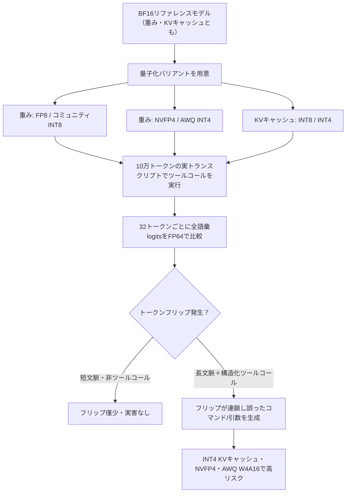
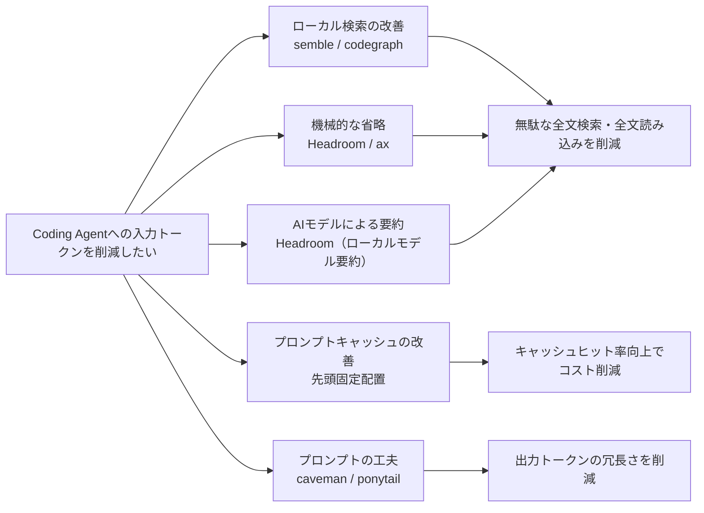
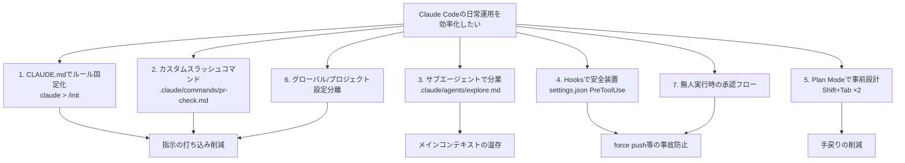

# Daily Briefing 2026-09-15

## 1. ローカルLLMの量子化ベンチマークが暴いた「静かなツールコール障害」（原題: Local LLM Quantization Benchmarks Reveal Silent Tool-Call Failures）

- **URL**: https://mer.vin/news/local-llm-quantization-benchmarks-reveal-silent-tool-call-failures/
- **公開日**: 2026-08-24
- **著者・媒体**: Mervin Praison（個人ブログ、元データはLevel1Techsフォーラムのホビイストエンジニア「thr3e」によるベンチマーク）

### 本文翻訳
本記事は、Level1Techsフォーラムで話題になった大規模ベンチマークを解説したものである。中心的な発見は「トークンフリップ」という現象だ。量子化されたモデルは、フル精度（BF16）のリファレンスモデルと会話の流暢さでは差が出ないのに、ある1トークンのデコード時に最尤トークンが入れ替わることがある。テキスト生成は自己回帰的であるため、この1トークンのズレがツールコール（関数呼び出し）の中では致命的な連鎖崩壊を引き起こしうる。

検証環境はRTX PRO 6000 Blackwell 1枚、モデルはQwen3.6-27B（64層のハイブリッドアーキテクチャ）、推論エンジンはvLLMのnightlyビルド。約10万トークンの実際のサポート対応トランスクリプト（実際のツールコールを含む）を負荷として用い、BF16の重みとBF16のKVキャッシュをリファレンスとした。32トークンごとに全語彙のlogitsを取得し、FP64で比較するという厳密な手法を採用している。特徴的なのは「forking realities」という手法で、最初のミスマッチで比較を打ち切らず、分岐したデコード経路をそのまま最後まで実行させることで、下流への連鎖的な影響まで観測できるようにした点である。

発見の第一は、精度が同一のBF16同士でも、アテンションカーネルの実装が異なるだけで発散が起きること。FlashAttention 2は正しいネットワークインタフェース`GigabitEthernet0/0/1.201`ではなく誤って`GigabitEthernet0/1/4`を選択し、それが後続コマンドの誤りへと連鎖した。第二はKVキャッシュの量子化で、BF16では障害なし、INT8では発散するが最終的に回復、INT4では長文脈下で再現性のあるツールコール障害が発生した。第三は重み量子化の比較で、公式FP8とキャリブレーションなしのコミュニティ製INT8（W8A16）は正しく動作した一方、NVIDIA公式のNVFP4は88kトークン時点で約50%ものフリップ率となり最悪の結果、AWQ W4A16も誤ったコマンド構文を生成して失敗した。注目すべきは、非公式のコミュニティ製INT8ビルドが、NVIDIA公式のNVFP4やQwen公式のFP8を上回ったという逆転現象である。加えて、検閲解除（abliterated）済みのファインチューン4種を比較したところ、heretic-org・huihui系は1.3〜1.4%のフリップ率に留まったのに対し、Blackfrost・AEON系は5〜5.8%と4倍、KLダイバージェンスは20倍に達し、ポート番号が`5432`から`543ql`に破損するといった実害も確認された。

著者は「量子化モデルのラベル（Q4、INT8等の表記）は、実運用でどう振る舞うかをほとんど教えてくれない。個々の成果物ごとに実際にテストする必要がある」と結論づける。短文脈でツールコールを伴わないチャットでは各構成の発散はごく小さく安全だが、長文脈（数万トークン）かつ構造化ツールコール・関数引数を伴う状況、特にINT4のKVキャッシュやNVFP4/AWQ W4A16の重みは高リスクだと整理している。なお本ベンチマークは単一GPU・単一モデルファミリ（Qwen3.6/3.8-27B）・単一の10万トークンワークロードに基づくものであり、第三者による独立再現はまだない点、テンソル並列度（TP1は正常、TP2は破綻、TP4は再び正常という異常）が未解明である点も限界として明記されている。

### 重要ポイント
- 「トークンフリップ」＝量子化モデルが1トークンだけ異なる最尤候補を選ぶ現象。会話の流暢さでは検出できず、ツールコールの中でのみ致命的に露呈する
- KVキャッシュはBF16で安全、INT8は発散するが回復、INT4は長文脈で再現性のある障害を起こす
- 重み量子化ではコミュニティ製INT8がNVIDIA公式NVFP4・Qwen公式FP8を上回り、AWQ W4A16とNVFP4が最も危険
- 検閲解除（abliterated）ファインチューンはベースモデルより発散しやすく、亜種間でも4倍の差がある
- 量子化フォーマットのラベルだけで安全性を判断できない。長文脈＋ツールコールを伴う本番投入前には、その成果物自体をベンチマークする必要がある

### 図解


### 現場での適用方法
ローカルLLMをコーディングエージェントやツール実行エージェントのバックエンドとして使う場合、量子化フォーマットのラベルだけを信じてデプロイせず、「実際に使うワークロードに近い形」でツールコール精度を事前検証する運用をルール化する。

`<REPO_PATH>/CLAUDE.md` への追記例
```markdown
## ローカルLLMをツール実行エージェントとして採用する際のルール

- 量子化モデル（GGUF/AWQ/GPTQ/NVFP4等）をツール呼び出し用途に採用する前に、
  本番相当の長文脈（数万トークン）を含む実ワークロードで
  ツールコール成功率を検証すること。短文脈チャットでの動作確認だけでは不十分。
- KVキャッシュをINT4量子化する構成、および重みをNVFP4/AWQ W4A16で量子化する構成は、
  長文脈下でツールコール障害が再現された報告があるため、
  本番導入前に `scripts/toolcall_quant_check.sh` の結果を確認してから採用する。
- 「abliterated」等の検閲解除ファインチューンをエージェント用途に使う場合は、
  ベースモデルより出力の発散率が数倍高くなりうるため、追加の検証を必須とする。
```

`<REPO_PATH>/scripts/toolcall_quant_check.sh`（量子化モデルのツールコール精度を簡易チェックする雛形）
```bash
#!/usr/bin/env bash
# 量子化バリアントとBF16基準モデルで同一の長文脈ツールコールタスクを実行し、
# 出力されたツールコールJSONが一致するかを比較する簡易スクリプト。
# 使い方: ./toolcall_quant_check.sh <baseline_endpoint> <quant_endpoint> <transcript_file>
set -euo pipefail

BASELINE_URL="$1"
QUANT_URL="$2"
TRANSCRIPT="$3"

run_and_extract_toolcalls() {
  local endpoint="$1"
  curl -s "$endpoint/v1/chat/completions" \
    -H "Content-Type: application/json" \
    -d @"$TRANSCRIPT" \
    | jq -c '.choices[0].message.tool_calls // []'
}

BASELINE_CALLS="$(run_and_extract_toolcalls "$BASELINE_URL")"
QUANT_CALLS="$(run_and_extract_toolcalls "$QUANT_URL")"

if [ "$BASELINE_CALLS" != "$QUANT_CALLS" ]; then
  echo "MISMATCH: 量子化モデルのツールコールがBF16基準と異なります"
  echo "baseline: $BASELINE_CALLS"
  echo "quant   : $QUANT_CALLS"
  exit 1
fi

echo "OK: ツールコールが基準モデルと一致しました"
```
`<baseline_endpoint>`と`<quant_endpoint>`はOpenAI互換APIを立てているvLLM/llama.cppサーバーのURLに置き換える。実運用では単発比較ではなく、複数の長文脈トランスクリプトで繰り返し実行し、不一致率を集計することを推奨する。

### 期待効果
本番投入前にこの種の検証を組み込むことで、会話としては自然に見えるのにツールコールだけが静かに壊れるという、通常のQA（受け答えの品質確認）では発見しづらい障害を事前に検出できる。記事の実測では、コミュニティ製INT8が公式NVFP4/FP8を上回るなど、ラベルだけでは判断できない優劣が実際に存在することが示されており、コスト最適化のために安易に低ビット量子化を選ぶ判断を防げる。

### 注意点
- 単一GPU（RTX PRO 6000 Blackwell）・単一モデルファミリ（Qwen3.6/3.8-27B）・単一ワークロードでの検証であり、他のモデルやハードウェアに一般化できるとは限らない
- 第三者による独立再現はまだ行われておらず、コミュニティ製量子化ビルドの品質は構成情報以上には監査されていない
- テンソル並列度（TP1正常・TP2破綻・TP4正常）という未解明の異常も報告されており、マルチGPU構成では追加の注意が必要

---

## 2. Coding Agentのトークンを節約する技術

- **URL**: https://techtekt.persol-career.co.jp/entry/tech/260826_01
- **公開日**: 2026-08-26
- **著者・媒体**: kazasiki（データ・AIインフラ統括部 シニアエンジニア）／techtekt（パーソルキャリア エンジニアブログ、#夏のAI技術発信祭）

### 本文翻訳
著者は「Agentic Codingをしているとトークンの使い過ぎが怖い」という実感を起点に、トークン節約に使えるツールや手法を5つのアプローチに分類して紹介する。記事全体を通じて、単なる理論紹介ではなく「個別のリポジトリを開いて実際に使ってみることを勧める」という実践志向が貫かれている。

1つ目は「ローカル検索の改善」。コードベースが大きくなるほど必要なコードを見つけにくくなり、無駄なトークン消費が増える。そこでTree-sitterでコードを解析し埋め込みモデルによる意味的検索とBM25の語彙的一致を組み合わせる`semble`、ローカルのグラフDBでメソッドコールや依存関係を構築し修正影響範囲を高速に特定できる`codegraph`が紹介される。

2つ目は「機械的な省略」。「1万行規模の大きなCSVをそのままCoding Agentに渡すのは多くの場合で非効率」と指摘し、JSONやソースコードを圧縮・省略する`Headroom`（配列の先頭N件抽出、異常値レコードの抽出、関数シグネチャのみの抽出など）、HTMLレスポンスの繰り返し部分の省略やセレクタ指定での情報抽出を行う`ax`を取り上げる。

3つ目は「AIモデルによる要約」。Headroomはローカルモデルを使い、入力プロンプトの文脈に応じてテキストを要約する機能も持つ。画像についても、「これは何の画像か」という質問には低解像度で十分だが「文字起こしをしたい」という要求には高解像度を維持するなど、タスク内容に応じて圧縮度を動的に変える工夫が紹介される。

4つ目は「プロンプトキャッシュの改善」。OpenAIやAnthropicなど主要プロバイダのプロンプトキャッシュは前方一致でヒットする仕組みであるため、システムプロンプトやツール定義など変化しない情報をコンテキストの先頭にまとめて配置し、頻繁な変更を避けることが重要だと説明する。Headroomはこのキャッシュ効率を計測するメトリクスも提供する。

5つ目は「プロンプトの工夫」。冗長な前置きやヘッジ表現を削るスタイルとして、原始人風の簡潔な応答を促す`caveman`（"Respond terse like smart caveman"）、熟練エンジニアのキャラクターを演じさせて無駄のない実装を促す`ponytail`が紹介される。ただし著者はOpenAIのベストプラクティス文書を引きつつ、こうした簡潔性の指示は今後のモデル進化により不要になっていく可能性があるとも付言している。

まとめとして著者自身の体験が語られる。大規模ファイルを扱う際、まずファイルを分割したりタイトルだけを抽出したりするスクリプトをAIに生成させ、その後必要な部分だけを抽出させるという2段階のアプローチを実践しているという。「人間が無意識にやっているような効率化を、AIにも教え込むことが重要」というのが記事全体を貫く結論である。なお著者は、各手法の節約量について定量的な比較は行っておらず、効果はユースケースによって異なると明示している。

### 重要ポイント
- トークン節約を「ローカル検索の改善」「機械的な省略」「AIモデルによる要約」「プロンプトキャッシュの改善」「プロンプトの工夫」の5分類で整理
- `semble`（Tree-sitter＋意味検索）と`codegraph`（ローカルグラフDB）はコードベース内の無駄な探索によるトークン浪費を防ぐ
- `Headroom`はJSON/ソースコードの圧縮・省略とローカルモデルによる要約の両方を担うツールとして中心的に紹介されている
- プロンプトキャッシュは「変化しない情報を先頭に固定配置する」という順序設計だけで効果が変わる
- 著者は定量比較をしていないと明言しており、導入効果は自分たちのワークロードで検証する必要がある

### 図解


### 現場での適用方法
記事で紹介された5分類のうち、既存のCLAUDE.mdやスキル設計にすぐ反映できる「機械的な省略」「プロンプトキャッシュの改善」「プロンプトの工夫」をルール化する。

`<REPO_PATH>/CLAUDE.md` への追記例
```markdown
## トークン節約の運用ルール

- 1000行を超えるCSV/JSON/ログファイルを扱う際は、全文をそのままコンテキストに
  読み込まず、まず `scripts/summarize_large_file.sh <file>` で要約・部分抽出してから
  必要な範囲のみを読み込むこと。
- システムプロンプトやツール定義など、セッション中に変化しない情報は
  会話の先頭にまとめて配置し、毎ターン変化する指示は末尾に置くことで
  プロンプトキャッシュのヒット率を落とさないようにする。
- 大量ファイルの調査タスクでは、いきなり全文を渡すのではなく
  「まず分割・タイトル抽出のスクリプトを書かせる → 必要な部分だけ抽出させる」
  という2段階アプローチを優先する。
```

`<REPO_PATH>/scripts/summarize_large_file.sh`（大規模ファイルの機械的な省略の雛形）
```bash
#!/usr/bin/env bash
# 大きなCSV/JSON/ログファイルをAgentに渡す前に、先頭N件・異常値・構造のみを抽出する
# 使い方: ./summarize_large_file.sh <file> [N]
set -euo pipefail

FILE="$1"
N="${2:-50}"

case "$FILE" in
  *.csv)
    echo "== ヘッダ + 先頭${N}行 =="
    head -n "$((N + 1))" "$FILE"
    echo "== 総行数 =="
    wc -l < "$FILE"
    ;;
  *.json)
    echo "== トップレベル構造（キーのみ） =="
    jq 'if type=="array" then .[0] elif type=="object" then keys else . end' "$FILE"
    echo "== 配列の場合は先頭${N}件 =="
    jq ".[0:${N}]" "$FILE" 2>/dev/null || true
    ;;
  *)
    echo "== 先頭${N}行 =="
    head -n "$N" "$FILE"
    ;;
esac
```
`<file>`には実際に調査対象とするログ/CSV/JSONのパスを指定する。要約結果だけをエージェントのコンテキストに渡し、詳細確認が必要な範囲だけ元ファイルを再度参照させることで、無駄な全文読み込みを避けられる。

### 期待効果
記事内では節約量の定量的な比較は行われていないが、ローカル検索改善による無駄な全文探索の削減、機械的な省略による大規模ファイルの読み込みトークン削減、プロンプトキャッシュの順序最適化によるキャッシュヒット率向上など、複数の独立した経路でトークン消費を下げられる設計になっている。既存の他記事（プロンプトキャッシュで入力コスト最大9割削減など）と組み合わせることで、相乗的な効果が期待できる。

### 注意点
- 著者自身が「節約量の定量比較はしていない」と明言しており、実際の削減率はユースケースやコードベースの性質に依存する
- `caveman`や`ponytail`のような簡潔性を強制するプロンプトスタイルは、将来のモデル進化により効果が薄れたり不要になったりする可能性がある
- 外部ツール（semble、codegraph、Headroom、ax等）の導入は、それぞれのメンテナンス状況やセキュリティ面を事前に確認してから採用すること

---

## 3. Claude Code毎日運用で分かった時短術7選【2026年9月版】

- **URL**: https://qiita.com/sescore/items/b3ebef2a1f727e3eca28
- **公開日**: 2026-09-11
- **著者・媒体**: @sescore（Qiita、SES Core）

### 本文翻訳
著者はSES/フリーランスとしてClaude Codeを日常的に運用する中で確立した、具体的な設定ファイルとワークフローに基づく7つの時短術を紹介する。単なる心構えではなく、実際のディレクトリ構成・コマンド・設定内容が明示されている点が特徴である。

1つ目は「CLAUDE.mdによるルール固定化」。プロジェクト直下に`claude > /init`で設定ファイルを生成し、起動時に自動読み込みさせる。著者は「シンプル優先」「根本原因対応」「テスト必須実行」というコア原則を記載しており、これにより毎回同じ指示を打ち込む手間がなくなる。

2つ目は「カスタムスラッシュコマンド化」。`.claude/commands/pr-check.md`のようなファイルを配置することで、「変更意図の確認→lint/テスト実行→認証情報混在チェック→コミットメッセージ確認」という一連のPR前チェックを`/pr-check`というスラッシュコマンド一発で呼び出せるようにする。

3つ目は「サブエージェントによる分業」。`.claude/agents/`にYAMLフロントマター付きのMarkdownファイル（例: `name: explore`、`tools: Read, Grep, Glob`）を配置し、調査専門のサブエージェントを定義する。調査タスクをこのサブエージェントに委譲することで、メインの会話コンテキストが調査ログで圧迫されるのを防ぐ。

4つ目は「Hooksによる安全装置」。`settings.json`の`PreToolUse`セクションに、Bashコマンドに対するマッチャーとブロックスクリプト（例: `scripts/block-force-push.sh`）を設定し、`git push --force`のような危険なコマンドを文字列マッチで機械的にブロックする。

5つ目は「Plan Modeによる事前設計」。Shift+Tabを2回押すことでPlan Modeに切り替わり、3ステップ以上のタスクやアーキテクチャ判断が必要な場面で、ファイル変更を一切発生させずに方針だけを事前承認できる。これにより手戻りを削減する。

6つ目は「グローバル設定とプロジェクト設定の分離」。`~/.claude/CLAUDE.md`に個人のスタイルを、`.claude/CLAUDE.md`にプロジェクト固有のルールを分けて記載することで、複数案件を掛け持ちする際の指示のブレを防ぐ。

7つ目は「無人実行時の承認フロー」。「生成は自動、実行は人間承認」という一線を明確に引き、特にSNS投稿やAPI課金操作など、取り消しの効かない外部作用を伴う操作については、自動実行させず必ず人間の承認を挟む運用にしている。

記事の後半では、これら7項目を「CLAUDE.md配置確認→グローバル/プロジェクト設定分離→カスタムコマンド化→サブエージェント導入→hook実装→Plan Mode運用→承認フロー設計」というチェックリスト形式の導入手順としてまとめている。さらに著者はSES/フリーランス市場の文脈で、「AIを使えること」自体よりも「型化・運用設計できる能力」がクライアントへの提案力や単価交渉力につながると指摘し、チーム展開フェーズからクライアント提案フェーズへと段階的にスキルを積み上げるモデルを提示している。

### 重要ポイント
- CLAUDE.md・カスタムスラッシュコマンド・サブエージェント・Hooks・Plan Mode・設定分離・承認フローという7つの具体的な仕組みを、実際のファイルパスと設定内容つきで提示
- サブエージェントへの調査委譲は、メインの会話コンテキストを圧迫させないための実践的な使い分け
- Hooksの`PreToolUse`による危険コマンドの文字列マッチブロックは、事故防止の機械的な安全装置として再現しやすい
- 「生成は自動、実行は人間承認」という原則は、無人実行を進める際の一線として明確
- 著者はこれらの型化・運用設計スキル自体がSES/フリーランス市場での評価軸になると位置づけている

### 図解


### 現場での適用方法
記事の7項目のうち、CLAUDE.md・カスタムコマンド・サブエージェント・Hooksの4点は、そのまま設定ファイルとして再現できる。

`<REPO_PATH>/.claude/commands/pr-check.md`（カスタムスラッシュコマンドの例）
```markdown
---
description: PR作成前に変更意図・lint・テスト・認証情報混在をまとめてチェックする
---

以下の手順でPR前チェックを行ってください。

1. `git diff main...HEAD` で変更差分を確認し、変更意図を1〜2文で要約する
2. プロジェクトのlintコマンドとテストコマンドを実行し、失敗があれば修正する
3. 差分に `.env` の値やAPIキーらしき文字列（`sk-`, `AKIA` 等）が混入していないか確認する
4. コミットメッセージが変更内容を正しく説明しているか確認し、必要なら書き直す
5. 上記すべてが完了したら「PRチェック完了」と報告する
```

`<REPO_PATH>/.claude/agents/explore.md`（調査専用サブエージェントの例）
```markdown
---
name: explore
description: コードベース調査専用。ファイル変更は行わず、調査結果のみをメイン会話に返す
tools: Read, Grep, Glob
---

あなたはコードベース調査専門のサブエージェントです。
Read/Grep/Globのみを使い、ファイルの変更や書き込みは絶対に行わないでください。
調査が終わったら、発見したファイルパスと要点を簡潔にまとめて報告してください。
```

`<REPO_PATH>/.claude/settings.json`（危険コマンドをブロックするHookの例）
```json
{
  "hooks": {
    "PreToolUse": [
      {
        "matcher": "Bash",
        "hooks": [
          {
            "type": "command",
            "command": "<REPO_PATH>/scripts/block-force-push.sh"
          }
        ]
      }
    ]
  }
}
```

`<REPO_PATH>/scripts/block-force-push.sh`
```bash
#!/usr/bin/env bash
# PreToolUseフックとして、危険なgitコマンドを文字列マッチでブロックする
set -euo pipefail

INPUT="$(cat)"
COMMAND="$(echo "$INPUT" | jq -r '.tool_input.command // empty')"

if echo "$COMMAND" | grep -qE 'git push .*--force|git reset --hard|rm -rf /'; then
  echo "ブロック: 破壊的なコマンドが検出されました: $COMMAND" >&2
  exit 2
fi

exit 0
```
`<REPO_PATH>`は実際のリポジトリの絶対パスに置き換える。Hookスクリプトは終了コード`2`でツール実行を拒否できる仕組みを利用している。

### 期待効果
記事によれば、CLAUDE.mdによるルール固定化とカスタムスラッシュコマンドにより「毎回の指示打ち込み」を削減でき、サブエージェントへの調査委譲によって「メインコンテキストの温存」ができる。Hooksによる文字列マッチブロックは`force push`等の事故防止に、Plan Modeの事前承認は手戻りの削減に、それぞれ直接的に寄与するとされている。これらを組み合わせることで、日常的なClaude Code運用における「型化」が進み、再現性のある効率化が期待できる。

### 注意点
- Hooksの文字列マッチによるブロックは万能ではなく、コマンドの書き方を変えられれば回避され得るため、あくまで事故防止の一助と位置づけるべき
- サブエージェントへの調査委譲は、ツール権限（`tools: Read, Grep, Glob`等）を明示的に絞らないと、意図せずファイル変更まで許してしまう可能性がある
- 「無人実行時の承認フロー」は、SNS投稿やAPI課金操作のような取り消し困難な外部作用を伴う操作にこそ徹底すべきであり、全自動化を目的化しないよう注意が必要
