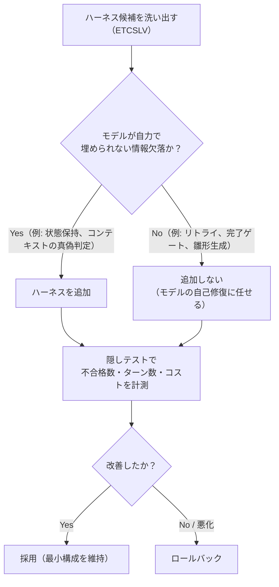
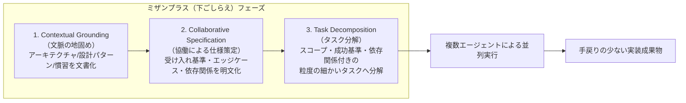
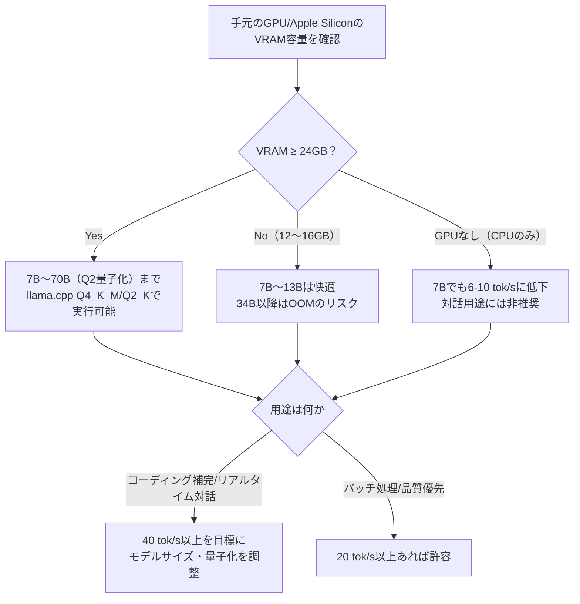

# Daily Briefing 2026-09-16

## 1. ハーネスエンジニアリングとは何か——「盛れば効く」のかを確かめる（原題: ハーネスエンジニアリングとは何か——"盛れば効く"のかを確かめる）

- **URL**: https://tech.dentsusoken.com/entry/2026/08/31/%E3%83%8F%E3%83%BC%E3%83%8D%E3%82%B9%E3%82%A8%E3%83%B3%E3%82%B8%E3%83%8B%E3%82%A2%E3%83%AA%E3%83%B3%E3%82%B0%E3%81%A8%E3%81%AF%E4%BD%95%E3%81%8B%E2%80%94%E2%80%94%22%E7%9B%9B%E3%82%8C%E3%81%B0%E5%8A%B9
- **公開日**: 2026-08-31
- **著者・媒体**: 渡邉真太郎（電通総研 金融ITユニット）／ 電通総研テックブログ

### 本文翻訳
2025年11月にAnthropicが「Effective harnesses for long-running agents」を公開して以降、「ハーネス（AIモデルを長時間安定して動かし続けるための足回り・型枠）」という言葉が業界に広まった。半年が経ち熱狂が落ち着いた今、著者は「ハーネスを盛れば本当に成果は上がるのか」という素朴な疑問を実験で検証する。

まず整理として、エンジニアリングの最適化対象は「プロンプトエンジニアリング（どう指示するか）」→「コンテキストエンジニアリング（何を見せるか）」→「ハーネスエンジニアリング（モデルの周りに計画・記憶・検証・復旧の仕組みをどう組むか）」へと移ってきたと位置づける。ハーネスの定義には広義（エージェント＝モデル＋ハーネス、LLM以外の全要素）と狭義（実行前のScaffoldと実行中に働くHarnessを区別）があるが、本稿では広義を採用する。

業界共通の分類が存在しないため、著者はMengらの枠組みに基づき6要素「ETCSLV」を提示する。E=実行ループ（次の一手を決め実行し観測するReActループ等）、T=ツール（ファイルI/O、シェル、MCP、Skillsなど行動選択肢の拡張）、C=コンテキスト管理（何を見せるか、Just-in-Time取得や要約）、S=状態（会話を超えて情報を保持する`state.json`やGit履歴）、L=フック（完了前のテスト・型チェック強制などのゲート）、V=評価（別エージェントによる要求充足の検証）。

検証では、各要素が効くように設計したタスク（TypeScript製の銀行コア業務マイクロサービスが中心）を用意し、ハーネス「あり」「なし」で強いモデル（Claude Opus 4.8）と弱いモデル（Claude Haiku 4.5）それぞれ3〜5回試行し、モデルに非公開の隠しテストで不合格数・ターン数・コストを比較した。

結果、明確に効果があったのはS（状態）とC（コンテキスト管理）のみ。SはHaikuで不合格3.0→0.0、Opusでも3.0→0.0。C はHaikuで12.3→4.7、Opusで21.0→0.7と大幅改善した。一方でE（リトライ指示）、L（完了前ゲート）、T（Skillによる雛形生成）は不合格数を改善せず、ターン数とコストだけを押し上げた。V（別エージェントによるレビュー）はHaikuには有効（5.6→2.4）だがOpusには無効（0.4→0.4）だった。さらに「意図的な欠陥のない」統制タスクで全ハーネスを一律適用しても、品質は変わらずコストとターンだけが増加した。

著者の解釈は明快である。効いたS・Cに共通するのは「モデルが自力では埋められない情報の欠落」を補っている点であり、これは強いモデルでも消えない。逆にE・L・Tのような「モデルの判断を代替する」仕組みは、最新モデルがすでに自己リトライ・自己検証・雛形処理を内在化しているため無効化しつつある。結論として「ハーネスは量ではなく的（まと）の問題」であり、ベストプラクティスを無条件に全部載せることはむしろ損になりうる。実務的な指針は「まず最小構成で始め、モデルが情報不足でつまずく箇所を観察し、そこにだけハーネスを足す」という欠陥駆動のアプローチである。

### 重要ポイント
- ハーネスをETCSLV（実行ループ／ツール／コンテキスト管理／状態／フック／評価）の6要素に分解し、要素ごとに効果をA/B的に実測した点が独自
- 実際に効果が確認できたのは「状態（State）」と「コンテキスト管理（Context）」の2要素のみで、いずれも「モデルが自力では埋められない情報欠落」を補うもの
- リトライ指示・完了前ゲート・Skillによる雛形生成は、最新モデルでは効果ゼロで、ターン数とコストだけを増やした
- 別エージェントによるレビュー（Evaluation）は弱いモデル（Haiku）には有効だが強いモデル（Opus）には無効という非対称性がある
- 統制実験でハーネスを一律適用すると、品質改善なしにコストとターン数だけが増加する「盛りすぎ」の弊害が確認された

### 図解


### 現場での適用方法
記事の「欠陥駆動でハーネスを足す」方針を、そのままチームの意思決定手順としてCLAUDE.mdに組み込む例。

```markdown
## ハーネス追加ポリシー（欠陥駆動アプローチ）

新しいハーネス要素（リトライ指示、完了ゲート、Skill、状態ファイル、
レビューエージェント等）を追加する前に、以下を必ず確認すること。

1. 直近のセッションで実際に発生した失敗パターンを1つ以上特定する
   （「なんとなく効きそうだから」で追加しない）
2. その失敗が「モデルの判断力不足」ではなく「モデルが持ちえない
   情報の欠落」由来かを判定する
   - 情報欠落の例: どのドキュメントが最新か分からない、前セッションの
     決定事項が失われている、認証情報の在り処が分からない
   - 判断力不足の例: 一時的なエラーで諦めた、完了報告が甘い
     → 多くの場合ハーネスより現行モデルの自己修復力で解決可能
3. 情報欠落と判定された場合のみ、最小限のハーネスを追加する
   - 状態保持が必要 → `.claude/state/<task>.json` に決定事項を記録し
     セッション冒頭で読み込む
   - コンテキストの真偽判定が必要 → 対象ファイル先頭に
     `<!-- SOURCE OF TRUTH: 2026-09-16 -->` 等のメタデータを付与
4. 追加後は次回タスクで「不合格数・ターン数・コスト」の変化を
   `/cost` と実測結果でふりかえり、効果がなければ2週間以内に外す
```

### 期待効果
記事の実測では、状態（State）ハーネスの導入でHaiku/Opusともに不合格数が3.0→0.0に改善、コンテキスト管理（Context）ハーネスの導入でOpusの不合格数が21.0→0.7（約97%減）まで改善した。逆に不要なハーネスを外すことで、ターン数増加とコスト増加（例: フック追加でHaikuのターン数が18→49と2.7倍化）を避けられる。「効くものだけを足す」運用により、開発生産性の向上とAPIコストの抑制を両立できる。

### 注意点
- 実験はTypeScriptの銀行コア業務という特定ドメイン・特定モデル（Opus 4.8/Haiku 4.5）での結果であり、他言語・他モデルではE/T/Lが効くケースもありうる
- モデルの世代が上がるほど「判断力を代替するハーネス」は陳腐化するため、一度有効と確認したハーネスも定期的に要否を見直す必要がある
- 「弱いモデルには効くが強いモデルには効かない」（V=評価）といった非対称性があるため、モデルを切り替えた際はハーネス構成も再検証すべき
- 統制実験が示す通り、ハーネスを増やすこと自体はコストとターン数を確実に増やすため、効果測定なしの追加は避ける

---

## 2. エージェント型コーディングのための「ミザンプラス」——入念な準備というコンテキストエンジニアリング手法（原題: Mise en Place for Agentic Coding: Deliberate Preparation as Context Engineering Methodology）

- **URL**: https://arxiv.org/abs/2605.05400
- **公開日**: 2026-05-06
- **著者・媒体**: Andrew Zigler（LinearB, Los Angeles）／ VibeX 2026（EASE 2026併設ワークショップ）査読論文

### 本文翻訳
本論文は、AIコーディングエージェントの普及とともに広がった「vibe coding（雰囲気で素早く実装を進める働き方）」が抱える構造的な問題を出発点とする。著者の主張は明快で、「十分なコンテキストを与えられなかったエージェントは、大量のデバッグと手戻りを要するコードを生成し、結果として開発時間を浪費する」というものだ。速度を優先して準備を省略するほど、後工程での修正コストが跳ね返ってくる。

この問題に対し、著者は料理における「ミザンプラス（下ごしらえ：調理を始める前に材料と道具をすべて準備しておく作法）」の概念を援用し、エージェント型コーディングのための3段階の意図的準備フレームワークを提案する。

第1段階「Contextual Grounding（文脈の地固め）」は、人間とエージェントの間に共通理解の土台を作る段階である。システムアーキテクチャ、設計パターン、プロジェクトの慣習といった暗黙知を構造化ドキュメントとして外部化し、以降のタスク実行を通じてエージェントが参照し続けるベースラインコンテキストを構築する。

第2段階「Collaborative Specification（協働による仕様策定）」は、構造化されたテンプレートを介した人間とエージェントの対話によって要件を精緻化する段階である。受け入れ基準・エッジケース・依存関係を明文化し、実装着手前に曖昧さを解消することで、後の手戻り回数を減らす。

第3段階「Task Decomposition（タスク分解）」は、仕様を依存関係を意識した粒度の細かいタスクレコード群へと変換する段階である。各サブタスクには明示的なスコープの境界、成功基準、依存関係のマッピングが与えられ、複数エージェントによる並列実行を可能にする。

著者はこの一連の準備能力を「context fluency（コンテキスト流暢性）」と名付け、個々のプロンプトの巧拙を競う従来のプロンプトエンジニアリングとは異なり、システムレベルでの包括的な準備能力として位置づける。

このフレームワークの有効性を示す事例として、著者はハッキングイベントでの実践を報告している。約2時間の準備（文脈の地固め・仕様策定・タスク分解の3段階）を行った結果、複数のAIエージェントによる並列実装によって、フルスタックの教育プラットフォームを短時間で構築できたという。この事例は、準備に投じた時間が、その後のエージェントの並列稼働効率と成果物の質に直結することを示す小規模ながら具体的な証拠として提示されている。

論文はVibeX 2026（EASE 2026併設のVibe Coding and Vibe Researchingに関する第1回国際ワークショップ、2026年6月9〜12日、グラスゴー）で発表され、研究成果物はZenodo（DOI: 10.5281/zenodo.19868258）で公開されている。著者は、この「ミザンプラス」原則がエージェント能力と実務上のソフトウェア開発ニーズとの間のギャップを埋め、コンテキストエンジニアリングを信頼できるAI支援開発の基盤として確立するための研究課題になると結論づけている。

### 重要ポイント
- 「vibe coding」による準備不足が、エージェントの手戻り・デバッグ時間の増大という形で後から跳ね返ってくる構造的問題を指摘
- 準備を「Contextual Grounding（文脈の地固め）」「Collaborative Specification（協働による仕様策定）」「Task Decomposition（タスク分解）」の3段階に体系化
- 各段階が具体的な成果物（構造化ドキュメント、受け入れ基準付き仕様、依存関係付きタスクレコード）を生み、次段階の入力になる設計
- 「context fluency（コンテキスト流暢性）」という新しい開発者スキルを提唱し、個別プロンプトの巧拙ではなくシステムレベルの準備能力として位置づけ
- 約2時間の事前準備でハッカソンにおける複数エージェントの並列実装を成功させた実例を報告

### 図解


### 現場での適用方法
3段階フレームワークをそのままClaude Codeのスキルとして実装する例。

```markdown
---
name: mise-en-place-prep
description: >
  新規タスク着手前に、文脈の地固め→協働仕様策定→タスク分解の3段階で
  準備ドキュメントを作成する。「実装を始める前に」「準備してから」
  「要件を整理してから着手」といった依頼で使用する。
---

# Mise en Place Prep Skill

## 手順

1. **Contextual Grounding（<REPO_PATH>/.claude/context/<topic>.md を作成）**
   - 対象領域のアーキテクチャ概要、関連する既存の設計パターン、
     プロジェクト固有の慣習（命名規則・ディレクトリ構成・禁止事項）を
     箇条書きで洗い出す
   - 既存コードから抽出した具体例を最低3件含める

2. **Collaborative Specification（<REPO_PATH>/.claude/specs/<topic>.md を作成）**
   - ユーザーと対話しながら以下を明文化する:
     - 受け入れ基準（Given/When/Then形式）
     - 既知のエッジケース一覧
     - 依存する外部システム・API・データ
   - 曖昧な点はすべて質問し、憶測で埋めない

3. **Task Decomposition（<REPO_PATH>/.claude/tasks/<topic>.json を作成）**
   - 各タスクに以下のフィールドを持たせる:
     `{"id", "scope", "success_criteria", "depends_on": []}`
   - 依存関係のないタスクは並列実行可能としてマークする

## 完了条件
3ファイルすべてが生成され、ユーザーが仕様書の内容をレビュー・
承認したことを確認してから実装フェーズに進む。
```

### 期待効果
論文が報告する事例では、約2時間の準備投資によって、複数のAIエージェントによる並列実装で教育プラットフォームのフルスタック実装を短時間で完了できたとされる。構造化された準備なしに実装へ直行する「vibe coding」と比べ、手戻り・デバッグに費やす時間を事前に削減できる点が最大の効果である。また、依存関係が明示されたタスクへの分解によって、複数エージェントの並列稼働という時間効率の向上も見込める。

### 注意点
- 論文で定量的な効果測定（削減時間・削減トークン量などの厳密な数値比較）が示されているのは限定的な事例（ハッカソン1件）であり、一般化には追加検証が必要
- 準備フェーズ自体に人間のレビュー・対話コストがかかるため、極めて小規模なタスクでは準備コストが実装コストを上回る可能性がある
- 3段階の成果物（文脈ドキュメント・仕様書・タスクレコード）を継続的にメンテナンスしないと、プロジェクトが進むにつれて内容が陳腐化し逆に誤誘導のリスクとなる

---

## 3. ローカルLLMのトークン毎秒（tok/s）ベンチマーク2026年版——GPU・Apple Silicon実測とllama.cppセットアップ（原題: LLM Tokens/Sec Benchmarks 2026: RTX 4090 vs 3090, 7B-70B Q4 (llama.cpp)）

- **URL**: https://mustafa.net/llm-tokens-per-second-benchmarks/
- **公開日**: 2026-04-22
- **著者・媒体**: Mustafa.net（ホームラボ／セルフホスティング系実践ブログ）

### 本文翻訳
本記事は、ローカルLLMの推論速度（トークン毎秒＝tok/s）を、複数のGPU・Apple Siliconハードウェアと複数のモデルサイズ（7B・13B・34B・70B）の組み合わせで実測したベンチマーク集である。マーケティング的な主張ではなく、バックエンドのバージョンや量子化フォーマットまで明記した再現可能な条件で計測している点が特徴である。

計測条件は、バックエンドに`llama.cpp b3520`（CUDA／Metal／Vulkanビルドをハードウェアに応じて使い分け）、量子化フォーマットは標準ベンチマークで`Q4_K_M`、24GB級カードで70Bモデルを動かす場合のみ`Q2_K`を使用。コンテキスト長は2048トークン、単一バッチ・ウォームモデル（コールドスタートのオーバーヘッドは除外）で統一されている。OSはUbuntu 24.04とmacOS 14。

実測結果（tok/s）は次の通り。RTX 4090（24GB）は7Bで135、13Bで78、34Bで42、70B（Q2量子化）で18。RTX 3090（24GB）は7Bで95、13Bで55、34Bで28、70B（Q2）で10。RTX 4070 Super（12GB）は7Bで75、13Bで40、34B以降はVRAM不足（OOM）。RTX 4060 Ti（16GB）は7Bで55、13Bで30、34Bで8、70BはOOM。RTX 3060（12GB）は7Bで45、13Bで22、34B以降はOOM。Apple M3 Max（64GB統合メモリ）は7Bで40、13Bで22、34Bで11、70B（Q2）で5。CPUのみ（DDR5）は7Bで6〜10、13Bで3〜5、34Bで1〜2、70Bは1未満と、GPUに対して大きく見劣りする。

ボトルネックの本質について記事は「LLM推論の主要な制約は生の計算性能（FLOPS）ではなく、メモリ帯域幅とVRAM容量である。1トークンを生成するたびにモデルの全状態を読み書きする必要があるため、メモリ帯域幅がスループットを決定づける主要因になる」と説明する。

実用性の目安として4段階のしきい値が提示されている。「40 tok/s以上（緑）: 人間が読む速度より速く、コーディング補完・即時チャット・ストリーミング応答に最適」「20〜40 tok/s（青）: 品質優先のタスクであれば快適」「10〜20 tok/s（黄）: 遅延は感じるが単発クエリなら許容範囲」「10 tok/s未満（赤）: 対話的なチャットには拷問的に遅い」。

記事は最後に、実際の速度はCPU・RAM速度・ドライババージョン・コンテキスト長によって変動するため、他人のベンチマーク結果を鵜呑みにせず自分の環境で実測すべきだと注意を促している。また2026年時点の新しいモデルアーキテクチャ（Qwen 3系、Llama 4 Scout、DeepSeek R1系）は、パラメータ数そのものよりも「実効的なサイズクラス」に応じた速度特性を示す傾向があるとも補足している。

### 重要ポイント
- `llama.cpp b3520`・`Q4_K_M`（70Bのみ`Q2_K`）・コンテキスト長2048・ウォームモデルという再現可能な条件でGPU/Apple Silicon/CPUを横断比較
- RTX 4090で7Bモデル135 tok/s、70B（Q2量子化）でも18 tok/sを達成する一方、12GB級カードは34B以降でVRAM不足（OOM）になる
- CPUのみの推論は7Bでも6〜10 tok/sに留まり、GPU比で一桁近く遅い
- ボトルネックはFLOPSではなくメモリ帯域幅とVRAM容量であるという原理を明示
- 「40 tok/s以上＝コーディング補完に最適」「10 tok/s未満＝対話には拷問的」という実用しきい値を提示し、用途に応じたハードウェア選定の判断基準を与えている

### 図解


### 現場での適用方法
記事の計測条件をそのまま再現できる、自環境でのベンチマーク用シェルスクリプト。

```bash
#!/usr/bin/env bash
# local-llm-bench.sh
# 記事と同条件（Q4_K_M量子化、コンテキスト長2048、ウォームアップ後計測）で
# llama.cpp の llama-bench を使い tok/s を計測する。
#
# 事前準備:
#   git clone https://github.com/ggml-org/llama.cpp <REPO_PATH>/llama.cpp
#   cd <REPO_PATH>/llama.cpp && cmake -B build -DGGML_CUDA=ON && cmake --build build -j
#
# GGUFモデルは <MODEL_PATH>/model-Q4_K_M.gguf に配置しておくこと

set -euo pipefail

MODEL_PATH="${1:?使い方: ./local-llm-bench.sh <GGUFファイルパス>}"
CTX_LEN=2048
BIN="<REPO_PATH>/llama.cpp/build/bin/llama-bench"

echo "=== ウォームアップ実行（結果は破棄） ==="
"$BIN" -m "$MODEL_PATH" -p 128 -n 32 -c "$CTX_LEN" > /dev/null

echo "=== 本計測（prompt eval / eval 両方のtok/sを記録） ==="
"$BIN" -m "$MODEL_PATH" \
  -p 512 -n 256 \
  -c "$CTX_LEN" \
  -b 1 \
  -o md | tee "bench-result-$(date +%Y%m%d-%H%M%S).md"

echo "=== しきい値の目安 ==="
echo "  40 tok/s以上 : コーディング補完/リアルタイム対話に最適"
echo "  20-40 tok/s  : 品質優先タスクなら快適"
echo "  10-20 tok/s  : 単発クエリなら許容"
echo "  10 tok/s未満 : 対話用途には非推奨"
```

### 期待効果
記事の実測値を参考にすることで、購入前に手持ち予算のGPUが目的の用途（コーディング補完なら40 tok/s以上、バッチ処理なら20 tok/s以上）を満たせるか事前に判断できる。例えばRTX 4090なら7Bモデルで135 tok/sと余裕を持ってコーディング補完用途に使えるが、RTX 3060（12GB）では34B以降のモデルがOOMになるため、モデルサイズの選定段階で無駄な試行錯誤を避けられる。自環境での再現ベンチマークにより「公称スペック」ではなく実効速度に基づいたハードウェア投資判断が可能になる。

### 注意点
- ベンチマーク値はドライババージョン・RAM速度・同時実行プロセスなどで変動するため、記事の数値はあくまで目安であり自環境での実測が必須
- 70Bモデルの計測はQ2_K量子化（高い圧縮率）で行われており、Q4以上の量子化では同じVRAM容量でも動作しない可能性がある
- コンテキスト長2048という短い条件での計測であり、実運用でコンテキストを長く使う場合はtok/sがさらに低下する点に注意
- CPUのみでの運用は7Bモデルでも6〜10 tok/sと実用に耐えにくく、対話的な用途にはGPUまたはApple Siliconが事実上必須
