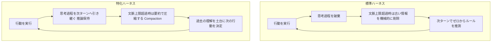
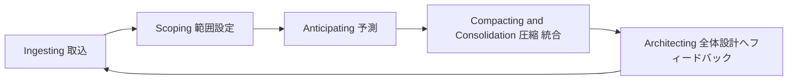
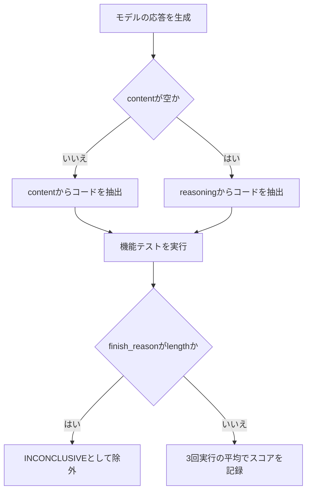

# Daily Briefing 2026-09-17

## 1. GPT-6 Astraのリリースと「特化ハーネス」の正体（原題: GPT-6 Astraがリリース、ARC-AGI-3が99.9パーセント。特化ハーネスとは何か調べた）

- **URL**: https://zenn.dev/acntechjp/articles/a302d301eb9cec
- **公開日**: 2026-09-04
- **著者・媒体**: ShintaroAmaike（アクセンチュア所属）／Zenn

### 本文翻訳
2026年9月、OpenAIは新モデル「GPT-6 Astra」を発表した。同モデルはFrançois Chollet氏が提唱するベンチマーク「ARC-AGI-3」において99.9%というスコアを記録し、話題となった。ARC-AGI-3は、ルール説明なしの2Dゲーム環境をエージェントに探索・攻略させるインタラクティブなタスクであり、探索・モデル化・目標設定・計画と実行という4つの能力を測定する。評価指標には人間の中央値との比較による効率性（RHAE）も含まれる。

しかし本記事が注目するのは、このスコア上昇の主因が「モデル自体の性能向上」ではなく「エージェントの実行環境（ハーネス）の設定変更」だったという点である。

7月時点でGPT-5.5は0.4%、後継のGPT-5.6 Solでも公式ハーネス下では7.8〜13.3%と苦戦していた。OpenAIの調査によれば、ARC Prizeが提供する公式（標準）ハーネスには二つの制約があった。第一に、モデルの内部思考過程（chain-of-thought相当）を毎アクション後に破棄しており、エージェントは行動ログしか参照できず、実質的に毎ターンゲームのルールをゼロから考え直す状態に置かれていた。第二に、会話記録が175,000文字を超えると、古いメッセージを機械的に削除するローリング切断方式を採用しており、これがパフォーマンス低下を招いていた。

OpenAIはこれに対し二つの改善を加えた特化ハーネス（Provider Adapter harness）を用意した。一つは「推論保持（Reasoning Retention）」で、直前のレスポンスIDを渡すことでモデルの内部推論をリクエスト間で保持する。もう一つは「圧縮（Compaction）」で、文脈上限に達した際に単純削除ではなく要約によって圧縮し、重要情報を残しながら会話を継続できるようにした。

この二つの変更だけで、GPT-5.6 Solのスコアは13.3%から38.3%へと約3倍に向上し、出力トークンは1/6に削減された。9月に登場したGPT-6 Astraでは、標準ハーネスで62.7%だったスコアが、特化ハーネス適用で99.9%まで跳ね上がった。

記事が導く結論は明快である。「100〜数百回繰り返されるループにおいて、過去の思考をどれだけ保持できるかが、そのままスコアの差に直結する」。モデルは前回失敗した理由を踏まえて行動でき、ゲーム理解のエッセンスを文脈内に保持し続けられるようになったことで、人間の中央値を上回る効率での攻略が可能になった。

興味深い副産物として、Astraは自発的に簡略記法（オンザフライな代数的記号表記）を開発し、オブジェクトの位置や操作の効果、未完了の計画をプログラムコードのような短い文字列で記録していたことも観察された。ARC Prizeはこれを「コンパクトな記号的世界モデルへの圧縮」と評している。

ただし著者は限定事項も強調する。この結果は決定論的ルール・グリッド状盤面の2Dパズルという狭い範囲に限られ、現実世界の非決定的・オープンエンドな問題には未対応である。ARC Prize自身も「ARC-AGI-3の飽和はAGI証明ではない」と明言しており、標準ハーネスの62.7%（モデル単体の能力）と特化ハーネスの99.9%（支援込み）を今後リーダーボードで区別して掲載する方針だという。

著者の結論は「エージェントの実行環境（ハーネス）の設計自体が、プロンプト設計と同じかそれ以上にスコアを左右する」というものであり、長時間稼働するエージェントを構築する際には、モデルの推論過程をターン間で保持できるか、コンテキスト上限時に要約ベースの圧縮を行っているか、という二点を検討すべきだと提言している。

### 重要ポイント
- エージェントのスコアを決めるのは推論能力そのものより「実行環境＝ハーネス」の設定であることが実証された
- 「推論保持」（前回の思考過程を次ターンに引き継ぐ）と「要約ベースの圧縮」の2点だけでスコアが約3倍に向上した
- 標準ハーネスと特化ハーネスの差が62.7%→99.9%という結果に直結
- 出力トークンは1/6に削減、実行速度は約3.66倍に向上という副次効果も確認
- 成果は決定論的な2Dパズル環境に限定されており、汎用的な結論として過信すべきではない

### 図解


### 現場での適用方法

**CLAUDE.md への追記例**:
```markdown
## 長時間タスクにおけるコンテキスト運用ルール
- コンテキストが逼迫したら、古いメッセージを機械的に切り捨てるのではなく、必ず要約ベースで圧縮すること（自動 compaction に任せきりにせず、圧縮直前に重要な意思決定・未解決事項を明示的に書き残す）
- 複数ターンにまたがるタスクでは、各ターンの終わりに「今回わかったこと・次にすべきこと」を短く明示し、次ターンへの引き継ぎ情報として残すこと
- 同じ失敗を繰り返す兆候が見えたら、直前の失敗理由を要約してから再試行すること
```

**スクリプト化の例**（Claude Agent SDK などで自前のエージェントループを組む場合、推論保持＋要約圧縮を模した疑似コード）:
```python
# 「推論保持 + 要約圧縮」ループの最小実装イメージ
previous_summary = ""
for turn in range(MAX_TURNS):
    messages = build_messages(previous_summary, current_observation)
    response = client.messages.create(model=MODEL, messages=messages)
    action = extract_action(response)
    result = execute(action)
    # 生の思考過程を捨てず、次ターンへ引き継ぐ要約を更新する
    previous_summary = summarize_reasoning(previous_summary, response, result)
    if context_tokens(messages) > COMPACTION_THRESHOLD:
        previous_summary = compact_via_summary(previous_summary)
```

### 期待効果
記事の実測値では、推論保持と要約圧縮の2施策のみでスコアが約3倍（13.3%→38.3%）に向上し、出力トークンは1/6、実行時間は約3.66倍高速化したと報告されている。同一モデルでもハーネス側の工夫だけで大幅な性能改善が見込める可能性を示す。

### 注意点
- 「推論保持」はOpenAI Responses APIのレスポンスID引き継ぎ機能に依存しており、Claude Code／Claude APIで同等の効果を得るには自前で要約・引き継ぎの仕組みを実装する必要がある
- 効果はARC-AGI-3のような決定論的・反復的なループタスクで顕著であり、非決定的・オープンエンドなタスクへの一般化は未検証
- 圧縮（要約）の質が低いと、逆に重要情報を失い性能が悪化するリスクがある

## 2. エージェントの文脈管理をライフサイクル問題として解く（原題: Agentic Context Management: Solving Agent Memory and Cost by Treating Them as Lifecycle and Architecture Problems）

- **URL**: https://arxiv.org/abs/2607.21503
- **公開日**: 2026-07-23
- **著者・媒体**: Gaurav Dadhich／arXiv

### 本文翻訳
本論文は、実運用のAIエージェントが失敗する主因は「推論能力の不足」ではなく「推論コンテキストの管理失敗」にあると主張する。会話履歴やツール出力の蓄積によってプロンプトが肥大化すると、トークンコストは会話長に対して二次関数的に増加してしまう。著者はこの問題を、単なる「ストレージと検索」の課題としてではなく、エージェントのライフサイクルとアーキテクチャの問題として捉え直すべきだと提案する。

論文が提示するのは、エージェントのコンテキスト管理を五つの基本プリミティブに分解するフレームワーク「ACM（Agentic Context Management）」である。

1. Architecting（設計）: コンテキストをどう扱うかのシステム全体設計
2. Ingesting（取込）: 新規情報の取り込みと初期処理
3. Scoping（範囲設定）: 情報の組織階層と関連性の決定
4. Anticipating（予測）: 将来必要になる情報をあらかじめ見積もる
5. Compacting & Consolidation（圧縮・統合）: 忠実性を保ちながらコンテキストを縮小する

著者はコスト構造を三つのアプローチで比較している。素朴な蓄積（履歴を単純に積み上げる方式）はコストが会話長に対して二次関数的に増加する。単純な要約化は線形コストに抑えられるものの、精度低下という代償を伴う。これに対し、著者らが提案する「検証済み圧縮（validated compaction）」は、線形コストを維持しながら忠実度（fidelity）を保持できるとしている。

論文ではこのフレームワークの参照実装として「Maximem Synap」というマルチテナント対応サービスを実装し、標準的なエージェント記憶ベンチマークで評価した結果、LongMemEvalで92%、LoCoMoで93.2%のスコアを達成したと報告している。

著者はまた、既存ベンチマークが十分に捉えていない評価軸として、レイテンシ、トークン効率、そして「コンテキスト・ロット（文脈の劣化）」への耐性という三つの次元を挙げ、これらを組織レベル・複数テナントの実運用スコープで評価する必要性を指摘している。

本論文の実務的な意義は、単一の要約アルゴリズムを探すのではなく、コンテキストの発生源（ingesting）から最終的な圧縮（compacting）までを一つのライフサイクルとして設計し、各段階に明確な責務を持たせる点にある。これは、既存の「長くなったら要約する」という場当たり的な運用から、設計段階でコンテキストの流れそのものをアーキテクチャとして定義する運用への転換を促すものであり、複数エージェント・複数セッションが並行するプロダクション環境において特に有効と位置づけられている。

### 重要ポイント
- エージェントの失敗要因は推論能力ではなく「コンテキスト管理の失敗」であるという問題提起
- コンテキスト管理をArchitecting/Ingesting/Scoping/Anticipating/Compactingの5プリミティブに分解するACMフレームワークを提案
- 素朴な蓄積は二次関数的コスト増、単純要約は線形コストだが精度低下、検証済み圧縮のみが線形コストと精度維持を両立
- 参照実装Maximem SynapはLongMemEval 92%、LoCoMo 93.2%を達成
- レイテンシ・トークン効率・コンテキスト劣化耐性という、既存ベンチマークが捉えきれない評価軸を指摘

### 図解


### 現場での適用方法

**スキル化の例**（Claude Code の Skill として、長時間・複数セッションのタスクでコンテキストを場当たり的に扱わないためのチェックリストにする）:
```markdown
---
name: context-lifecycle
description: 長時間・複数セッションにまたがるエージェントタスクで、コンテキストをライフサイクルとして管理する。会話が長くなり始めたら、または新しいツール出力を取り込む前に使用する。
---

# コンテキスト・ライフサイクル管理

Agentic Context Management (ACM) の5プリミティブに沿って、コンテキストを場当たり的に扱わないための手順。

1. Architecting: タスク開始時に「何を残し、何を捨てるか」の方針を1行で明示する
2. Ingesting: ツール出力やファイル内容を取り込む前に、必要な部分だけを抽出する（生ログを丸ごと貼らない）
3. Scoping: 現在のサブタスクに関係ない情報は要約または退避し、本文脈から外す
4. Anticipating: 次のターンで必要になりそうな情報を先に短くメモしておく
5. Compacting: コンテキストが閾値を超えたら、古い履歴を機械的に切るのではなく要約してから圧縮する
```

### 期待効果
単純要約に対して精度を落とさずコストを線形に抑制できるとされ、論文内の参照実装ではLongMemEval 92%、LoCoMo 93.2%というスコアが報告されている。

### 注意点
- Maximem Synapは論文内の参照実装であり、汎用OSSとして即座に利用できるかは未確認
- 「検証済み圧縮」の具体的な検証手法（何をもって忠実度を保証するか）は自前の実装に委ねられる部分が大きい
- 単一エージェント・単一セッションの小規模用途では、5プリミティブすべてを導入するのは過剰設計になりうる

## 3. コーディングエージェント・ベンチマークの「教訓」に見る計測バグの罠（原題: coding-agent-bench: Coding-task benchmark for local LLMs and agent harnesses）

- **URL**: https://github.com/sipratt-p/coding-agent-bench
- **公開日**: 不明（直近数週間以内、2026年4月から9月にかけて継続更新中のリポジトリ）
- **著者・媒体**: sipratt-p／GitHub

### 本文翻訳
「coding-agent-bench」は、個人開発者が2台のGPUワークステーションとMac Studioのペアで「日常的にどのモデルを使うべきか」という実務的な疑問に答えるために構築した、ローカルLLM・コーディングエージェント向けの自己完結型ベンチマークである。2026年4月から9月にかけて継続的に更新されており、vLLMやMLXなど複数の推論エンジン上で計82回のスコアリング実行を積み重ねてきた。

ベンチマークは9つのPython実装タスク（各100点満点）から構成される。v2スイート（LRUキャッシュ、asyncioトークンバケット、再帰下降式評価器、トライ木、型付きイベントエミッターの5タスク、500点満点）と、tiebreakerスイート（POSIX正規表現エンジン、RGAテキストCRDT、非同期DAGオーケストレータ、ストリーミングJSONパーサーの4タスク、400点満点）の二段構成になっている。実行モードは、プロンプト一つに回答一つを返す「直接API」と、コーディングエージェント（Prime Agent、Claude Codeなど）が自らテストを書いて実行できる「ハーネス支援」の二種類がある。

このリポジトリが特に価値を持つのは、README内の「教訓（Lessons Learned）」セクションで、ベンチマーク自体に潜んでいた計測バグとその修正過程を赤裸々に公開している点である。

教訓1は抽出器のバグ。推論モデルが「コードのみ出力せよ」という指示に対し、コードフェンスなしで返答した場合、固定化された抽出器が本文を見落とし、思考トレースから未完成のドラフトを実行してしまい、正答率が17/100と著しく低く記録されていた。contentフィールドのみから抽出し、フェンスなし回答も許容する修正により、同じ出力が97/100まで改善した。

教訓2は温度設定の不一致。直接APIランナーが温度0.0を固定していた一方、モデルカードの推奨は1.0だった。温度0では特定モデルが2つのタスクで完了に至らず（パーサータスクは13〜15万トークンの空回り、イベントエミッタはタイムアウト）、300点満点中290点に留まったが、サーバーのデフォルト設定では全4タスクを完了できた。以降、温度は明示指定せずサーバーデフォルトに委ね、使用値をJSON結果に記録する方式に変更された。

教訓3は再現性の低さ。同一モデル・同一プロンプト・同一温度でも、POSIX正規表現タスクで98/100と13/100という全く異なる結果が出ることがあった。この対策として、各行を3回実行の平均値として報告する方式（`--runs 3`）に変更された。

教訓4はタイムアウトと最大トークン制限の扱い。ちょうど上限まで生成して打ち切られたケースを「失敗」として0点に近い点数をつけてしまう問題があり、これを「評価不可（INCONCLUSIVE）」として総得点から除外する仕組みを導入した。DeepSeek V4-Flashでは、トークン上限を32kに設定した場合376点だったのに対し、上限を外すと459点まで伸びており、上限設定自体がスコアを大きく歪めることを実証している。

### 重要ポイント
- ベンチマークの「スコアの差」は多くの場合モデルの実力差ではなく、ハーネス側のバグ・設定不備によって生じていた
- 出力抽出ロジックの不備だけで同一出力の点数が17点から97点まで変動した
- 温度パラメータをランナー側で固定していたことが原因で、モデル本来の性能を過小評価するケースがあった
- 同一条件でも実行ごとに結果が大きく変動するため、単発実行でのランキングは危険。3回平均が推奨
- トークン上限に達して打ち切られたケースは「失敗」ではなく「評価不可」として除外すべき

### 図解


### 現場での適用方法

**運用手順**（このベンチマークを自分のローカルLLM評価に流用する場合）:
```bash
# 1. リポジトリを取得し、参照実装を検証する
git clone https://github.com/sipratt-p/coding-agent-bench && cd coding-agent-bench
python3 tasks/validate_refs.py

# 2. 自分のローカルLLM（OpenAI互換エンドポイント）でv2スイートを実行
python3 bench/run_direct.py --base-url <YOUR_ENDPOINT> --model <YOUR_MODEL> \
    --suite v2 --runs 3 --out results/local/<YOUR_MODEL>_v2.json

# 3. tiebreaker スイートも合わせて実行し、結果表を再生成
python3 bench/run_direct.py --base-url <YOUR_ENDPOINT> --model <YOUR_MODEL> \
    --suite tb --runs 3 --out results/local/<YOUR_MODEL>_tb.json
python3 bench/make_results_table.py

# 4. 評価不可（INCONCLUSIVE）ケースがないか確認する
bench/bench_alert.py
cat ALERTS_LATEST.json
```

**CLAUDE.md への追記例**（自作の評価・採点ハーネスを書く際の一般ルールとして）:
```markdown
## 自作の評価ハーネスを書くときのルール
- 出力抽出は content フィールドを優先し、reasoning からの抽出は content が空の場合のみのフォールバックとして明示的に分岐させる
- 温度・max_tokens は明示指定せず、サーバーデフォルトに委ねるか、使用した値を必ず結果に記録する
- 同一条件での評価は最低3回実行し、平均値と個別値の両方を残す
- finish_reason が length（打ち切り）のケースは失敗ではなく INCONCLUSIVE として集計から除外する
```

### 期待効果
この記事の教訓をそのまま適用すれば、自作のエージェント評価パイプラインで、抽出ロジックの不備によりスコアが17点から97点のように大きく歪むバグを事前に防げる。3回実行平均の導入により、単発実行によるランキングの誤り（同条件でも98点と13点に分かれる事例）を避けられる。

### 注意点
- リポジトリは個人開発者による自己完結型ベンチマークであり、公式に検証された標準ベンチマークではない
- タスクはPythonの9問に限定されており、他言語・他ドメインへの一般化は未検証
- MLXサーバーの一部は`generation_config.json`ではなく`config.json`を読むなど、環境依存の落とし穴がある点に注意が必要
