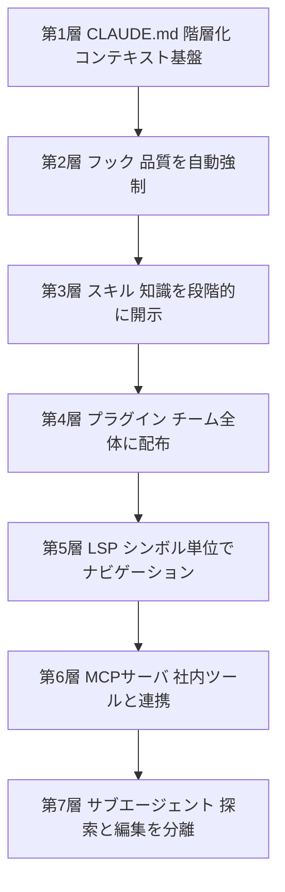
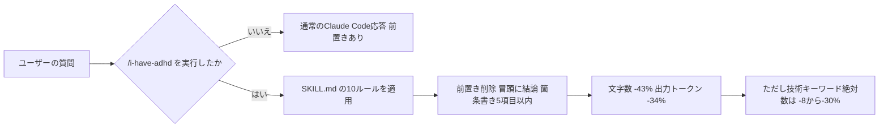
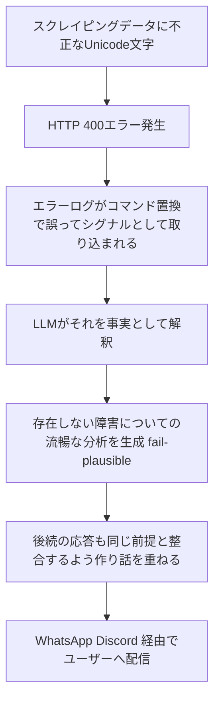

# Daily Briefing 2026-09-18

## 1. Claude Codeを大規模コードベースに導入する「ハーネス7層」（原題: 「Claude Code」を大規模なコードベースに導入するためのベストプラクティス ── ハーネス7層を構築順に理解する）

- **URL**: https://qiita.com/nogataka/items/24db436c1123ab3d4cb2
- **公開日**: 2026-09-05
- **著者・媒体**: @nogataka／Qiita

### 本文翻訳
本記事は、Anthropicが2026年5月に公開したブログ記事から、大規模コードベースへのClaude Code導入における共通パターンを抽出した解説である。中心的主張は「モデル単体ではなく、モデルを取り巻く仕組み（ハーネス）が性能を決める」というものであり、これを構築すべき順序に沿って7つの層に整理している。

第1層はCLAUDE.mdの階層化である。モノレポの場合、ルート直下に全体共通のCLAUDE.md（200行未満に制限）を置き、各パッケージ配下（例：packages/api/CLAUDE.md、packages/web/CLAUDE.md）にそのパッケージ固有のルールを分散配置する。作業ディレクトリから起動することで、必要な階層のファイルだけが読み込まれる点が重要とされる。

第2層はフックによる「譲れないもの」の強制と自己改善である。PostToolUseフックでEdit・Write実行直後にフォーマッタや型チェッカーを自動実行し、プロンプトでの指示ではなく実行環境側で品質を担保する。

第3層はスキルによる専門知識の段階的開示（progressive disclosure）である。常時読み込むのではなく、必要になった時点で詳細な手順を展開する設計により、コンテキストの圧迫を避ける。

第4層はプラグインによる配布で、CLAUDE.md・フック・スキルなどをパッケージ化しチーム全体・組織全体に配れるようにする。第5層はLSP（Language Server Protocol）導入によるシンボル単位のコードナビゲーションで、対応言語にはC/C++、Go、Java、Python、Rustなどが挙げられている。第6層はMCPサーバによる社内ツール連携、第7層はサブエージェントによる「探索」と「編集」の分離であり、大規模な調査タスクにおいてコンテキストを汚さずに情報収集を行わせる。

記事はさらに、導入を成功させる組織的パターンとして「コードベース最適化（除外設定やLSP導入による検索効率化）」「動的メンテナンス（3〜6ヶ月ごとの構成見直し）」「責任者配置（DRI＝直接責任者を最低1名置く）」の3点を挙げている。加えて、この7層の監査・構築作業を自動化するMITライセンスのプラグイン「cc-harness-kit」を著者自身が公開しており、`/plugin install cc-harness-kit@cc-harness-kit`および`/harness-init`コマンドで導入できるとしている。この構成により、数百万行規模のモノレポや数千人規模の組織でも実用的な導入が可能になると結論づけている。

### 重要ポイント
- 「エージェント性能はモデルではなくハーネス（周辺の仕組み）が決める」という前提に立ち、導入すべき順序を7層で提示
- CLAUDE.mdは階層化・200行未満に制限し、必要な範囲だけを読み込ませる設計が推奨される
- フックで「フォーマット・型チェック」など譲れない品質基準を自動強制する
- スキルは常時読み込みではなく段階的開示にすることでコンテキストを節約する
- 「コードベース最適化」「定期的な構成見直し」「責任者（DRI）配置」の3つが組織導入の成功パターン

### 図解


### 現場での適用方法

**CLAUDE.md への追記例**（モノレポでの階層化ルール）:
```markdown
## CLAUDE.md 階層化ルール
- ルート直下の CLAUDE.md は全体共通ルールのみとし、200行を超えない
- 各パッケージ配下（packages/<name>/CLAUDE.md）にはそのパッケージ固有のルールのみを書く
- Claude Code は作業ディレクトリから起動し、無関係な階層のルールを読み込ませない
```

**スクリプト化の例**（PostToolUseフックでフォーマット・型チェックを強制する `.claude/settings.json` 抜粋）:
```json
{
  "hooks": {
    "PostToolUse": [
      {
        "matcher": "Edit|Write",
        "hooks": [
          { "type": "command", "command": "${CLAUDE_PROJECT_DIR}/.claude/hooks/format-and-typecheck.sh" }
        ]
      }
    ]
  }
}
```

**運用手順**（LSP導入と7層監査ツールの導入）:
```bash
# LSPを導入してシンボル単位のナビゲーションを有効化
npm install -g typescript-language-server typescript
/plugin install typescript-lsp@claude-plugins-official

# 7層の構築状況を監査・自動構築する場合
/plugin install cc-harness-kit@cc-harness-kit
/harness-init
```

### 期待効果
記事によれば、この7層構成を順に整備することで数百万行規模のモノレポや数千人規模の組織でもClaude Codeの実用的な導入が可能になるとされる。フックによる自動強制で、プロンプト依存の「お願いベース」の品質担保から、実行環境レベルでの確実な担保に移行できる。

### 注意点
- 7層すべてを一度に導入する必要はなく、CLAUDE.md・フックなど基盤層から順に整備すべきとされる
- cc-harness-kitは著者個人が公開するツールであり、Anthropic公式のものではない点に留意する
- 3〜6ヶ月ごとの構成見直しやDRI配置など、継続的な運用体制がなければ効果が薄れる可能性がある

## 2. GitHub 3万スターのClaude Codeスキルで出力トークンを34%削減できるか実測した（原題: 3万スターの Claude Code スキルを入れたら、出力が43%短くなった）

- **URL**: https://qiita.com/suwa_nobu/items/cec37ce5a6141bb3eefc
- **公開日**: 2026-09-09
- **著者・媒体**: @suwa_nobu（株式会社JQIT）／Qiita

### 本文翻訳
本記事は、GitHubで30,233スターを獲得している公開スキル「ayghri/i-have-adhd」を実際にClaude Codeへ導入し、応答の簡潔さとトークン消費量への効果を実測した検証記事である。このスキルは、エージェントの回答から前置きの言葉を取り除き、行動そのものを冒頭に持ってくることを狙ったものであり、実装は10個のルールを含む単一のSKILL.mdファイル（140行）で完結している。

具体的なルールとしては、回答の最初の行を即座に実行可能なコマンドや結論にすること、「Great question」のような前置き・挨拶表現を禁止すること、箇条書きリストを5項目以下に制限することなどが含まれる。スキル自体は常時発動するのではなく、`disable-model-invocation: true`という設定によってモデル側の自動判断による起動を無効化し、`/i-have-adhd`というスラッシュコマンドを明示的に実行したときのみ有効化される設計になっている。

検証環境はWindows 10、Claude Code バージョン2.1.260、モデルはclaude-opus-5で、2026年9月9日時点の測定である。著者は3種類の質問について、スキル導入前後でそれぞれ3回ずつ、計9回の応答を比較した。結果として、文字数は平均1,884字から1,066字へと43%削減され、出力トークン数も1,603トークンから1,056トークンへと34%削減された。9回の測定すべてでスキル導入後の方が短くなっており、削減効果は安定して再現されたとしている。

一方で著者は、単純に「同じ内容がコンパクトになった」わけではない点を強調している。技術キーワードの密度（1,000字あたりの出現数）はスキル導入後に上昇した（例えばある設問では1,000字あたり3.2個から6.6個に上昇）ものの、これは分母となる文字数自体が減った結果であり、実際には技術キーワードの絶対数自体は8〜30%程度減少していたことも確認されている。つまり、出力は短く要点が凝縮されたように見える一方で、説明の一部が実際に失われている可能性があるという、トレードオフの存在を著者は率直に指摘している。

### 重要ポイント
- 30,233スターの公開スキル「ayghri/i-have-adhd」導入で文字数43%減、出力トークン34%減を実測
- スキルは10ルール・140行の単一SKILL.mdで完結する軽量実装
- `disable-model-invocation: true` により自動発動を防ぎ、スラッシュコマンドで明示的に起動する設計
- 9回の測定すべてで削減効果が再現され、単発の偶然ではないことを確認
- 短縮と引き換えに技術キーワードの絶対数が8〜30%減少しており、情報量とのトレードオフが存在する

### 図解


### 現場での適用方法

**スキル化の例**（同種の「簡潔化スキル」を自作する場合のSKILL.md骨子）:
```markdown
---
name: concise-output
description: 応答を簡潔にしたいときに明示的に呼び出す。前置きを排除し、結論・実行可能なアクションを冒頭に置く。自動発動はさせない。
disable-model-invocation: true
---

# 簡潔出力ルール

1. 回答の1行目は、即座に実行できるコマンドか結論そのものにする
2. 「Great question」「もちろんです」等の前置き・挨拶表現を書かない
3. 箇条書きは最大5項目までに絞る
4. 背景説明よりも先に「何をしたか／何をすべきか」を書く
5. 冗長な要約の繰り返しをしない
```

**運用手順**（導入と効果測定）:
```bash
# 1. スキルを自分のプロジェクトの .claude/skills/ 配下に配置
mkdir -p <REPO_PATH>/.claude/skills/concise-output
cp SKILL.md <REPO_PATH>/.claude/skills/concise-output/

# 2. 同一プロンプトをスキルON/OFFで複数回実行し、文字数・トークン数を比較
#    (Claude Code の /cost やログの usage フィールドから出力トークン数を確認)
```

### 期待効果
記事の実測値では、文字数43%減・出力トークン34%減という効果が9回の測定すべてで再現されており、応答生成コストの削減や、レビュー時に読むべき分量の削減に直結する可能性がある。

### 注意点
- 短縮によって技術キーワードの絶対数が8〜30%減少しており、正確性や網羅性が求められるタスクでは情報欠落のリスクがある
- 検証はWindows環境・claude-opus-5・3種類の質問という限定的な条件下のものであり、他モデル・他タスクでの再現性は未確認
- `disable-model-invocation: true` を使わずスキルを常時発動させると、必要な説明まで削られる可能性がある

## 3. サイレント障害はなぜ危険か——本番LLMエージェント運用22件のインシデント分類（原題: When Errors Become Narratives: A Longitudinal Taxonomy of Silent Failures in a Production LLM Agent Runtime）

- **URL**: https://arxiv.org/abs/2606.14589
- **公開日**: 2026-06-12
- **著者・媒体**: Wei Wu（独立研究者）／arXiv

### 本文翻訳
本論文は、本番稼働しているLLMエージェント基盤で発生した「サイレント障害」——ユーザーやシステムに明示的なエラーとして届かず、正常に見える形で失敗する障害——を、8週間にわたり収集した22件のインシデントをもとに分類した縦断研究である。

著者はサイレント障害をメカニズムに基づき5つのクラスに分類する。クラスA「環境・プラットフォーム固有の癖（Environment and platform quirks）」、クラスB「設計仮定の不一致（Design-assumption mismatches）」、クラスC「エラーの吸収と希釈（Error swallowing and dilution）」、クラスD「連鎖的ハルシネーションと捏造（Chained hallucination and fabrication、いわゆるfail-plausible）」、クラスE「運用上の見落としと監査の死角（Operational omission and forensic blind spots）」である。22件の内訳はクラスAが1件（付随する6つのサブイベントを含む）、クラスBが4件、クラスCが5件、クラスDが4件、クラスEが8件と報告されている。

著者が特に危険視するのはクラスDである。実例として、スクレイピングしたコンテンツに含まれるUnicodeサロゲート文字がHTTP 400エラーを引き起こし、そのエラーログがコマンド置換を通じてシグナルペイロードとして誤って取り込まれ、LLMがそれを事実として扱って「Hugging Faceのプラットフォーム障害が発生している」という、実際には存在しない危機についての流暢で説得力のある分析を生成し、WhatsAppやDiscordを経由してユーザーに配信されてしまったケースが挙げられている。著者はこの現象を「エージェントが最初の作り話を事実として受け入れ、それと整合する形で後続の作り話を重ねていくことで、内部的には首尾一貫しているが全くの虚構である"物語"を構築してしまう」ものと説明する。論文の結語は次のように述べている——「あなたのエージェントシステムが本当に恐れるべき障害は、クラッシュではない。それは、存在しない危機について、時間通りに、完璧な文法で書かれた、自信に満ちた一段落である」。

論文はさらに、防御の実態についても定量的に示している。22件のうち検出可能だった事例の約70%は、自動テストではなくユーザー視点での人間による観察によって発見された。また、事前に障害を防止できた割合（ex-ante prevention）は0/15＝0%だった一方、事後に同種の再発を防止できた割合（ex-post regression blocking）は13/15＝87%に達しており、著者は「防御機構は予測エンジンではなく回帰防止エンジンとして機能している」と結論づけている。加えて、最も検出まで時間を要した障害はコンポーネント単体の内部ではなく、コンポーネント間の「継ぎ目」に潜んでいたと指摘する。組織側は4,286件の単体テスト、827件のガバナンスチェック、14個の機械的スキャナーを備えていたにもかかわらず、これらを主要な検出経路にはできていなかった。

実務者に向けた提言として、論文は「失敗は大きく、追跡可能で、退屈であるべきだ（loud, attributable, and boring）」という設計原則を掲げ、具体策として、修正前の完全な因果関係チェーンのポストモーテムの義務化、メカニズム別命名規則の組織内統一、メカニズムレベルのスキャナーのCI・日次監査への組み込み、新しいガードが実際に機能するかを検証する意図的な破壊テスト（サボタージュ検証）、人間の記憶に依存しない宣言的状態の機械的同期、監視層が被監視システムを変更しない「オブザーバーの読み取り専用化」、そして新機能追加時に同等の既存メカニズムを廃止する「Sunset Law」などを挙げている。

### 重要ポイント
- 本番LLMエージェントの障害は「クラッシュ」ではなく「もっともらしい虚構の物語」として現れることが最も危険である
- 22件のインシデントを5クラス（環境要因・設計仮定不一致・エラー希釈・連鎖ハルシネーション・運用上の見落とし）に分類
- 約70%の障害はテストではなく人間によるユーザー視点の観察で発見された
- 事前防止率0%に対し事後の再発防止率は87%であり、防御は「予測」でなく「回帰防止」として機能している
- 「失敗は大きく・追跡可能・退屈であるべき」という設計原則と、ポストモーテム義務化・サボタージュ検証・Sunset Lawなど具体策を提言

### 図解


### 現場での適用方法

**CLAUDE.md への追記例**（エージェントの出力を鵜呑みにしないための運用ルール）:
```markdown
## エージェント出力の検証ルール（サイレント障害対策）
- エージェントが生成した「異常検知」「障害分析」等の重大な報告は、外部の一次情報（実際のログ・APIレスポンス）と突き合わせるまで真実として扱わない
- ツール実行結果やログの取り込み時に、コマンド置換や文字コードエラーが混入していないかをまず疑う
- 一つの推測を前提に後続の推測を積み重ねている兆候（自己整合的だが検証不能な説明）が見えたら、そこで一旦停止し人間に確認を求める
- 重大操作（通知配信・外部連携）の前には、宣言的な状態（正）とエージェントの認識（現在の理解）を機械的に突き合わせる
```

**運用手順**（サボタージュ検証とポストモーテムの導入）:
```bash
# 1. 新しいガード（バリデーション・アラート）を追加したら、意図的にそのガードが
#    検知すべき異常を再現し、実際に機能するかを検証する（サボタージュ検証）
#    例: 不正なUnicode文字を含むダミーデータを取り込ませ、後続処理が停止するか確認

# 2. インシデント発生時は、修正の前に完全な因果関係チェーンを文書化する
#    テンプレート例:
#      - 発端: 何が最初のエラー/異常データだったか
#      - 伝播経路: どのコンポーネントを経由してどう変質したか
#      - 検出: 誰が/何が、いつ気づいたか（人間観察か自動検知か）
#      - 再発防止: どのメカニズムレベルのスキャナー/チェックを追加したか
```

### 期待効果
論文の実測では、事後の再発防止率が87%に達しており、ポストモーテムに基づくメカニズムレベルの再発防止策の蓄積は有効に機能しうることが示唆される。一方で事前予測率は0%であり、「未知の障害を事前に全て防ぐ」ことは目指さず、検出を速く・原因を追跡可能にすることに投資する方が費用対効果が高いという示唆が得られる。

### 注意点
- 本論文は単一の独立研究者による22件という限定的なインシデント数の縦断観察であり、統計的な一般化には注意が必要
- 「サボタージュ検証」「Sunset Law」等の提言は概念レベルの設計原則であり、具体的な実装は自組織のシステムに合わせて設計する必要がある
- 自動テスト（4,286件）やガバナンスチェック（827件）を備えていても人間観察が主要な検出経路だったという結果は、既存の自動化投資を無駄にする意味ではなく、人間のレビュー動線を併設する必要性を示すものと解釈すべきである
