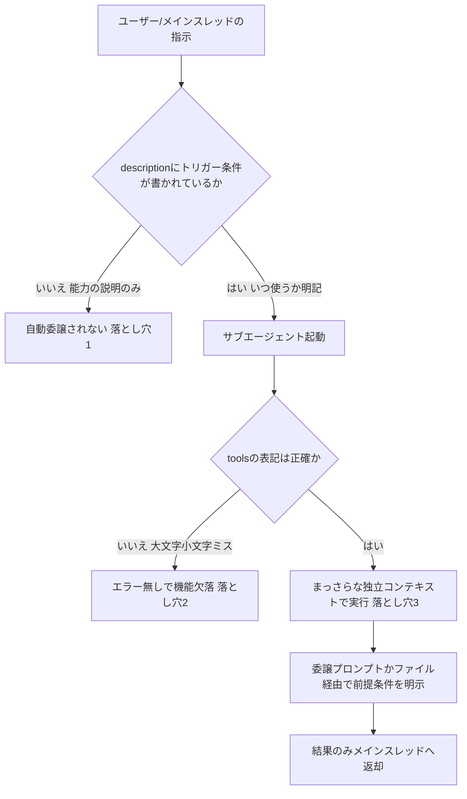
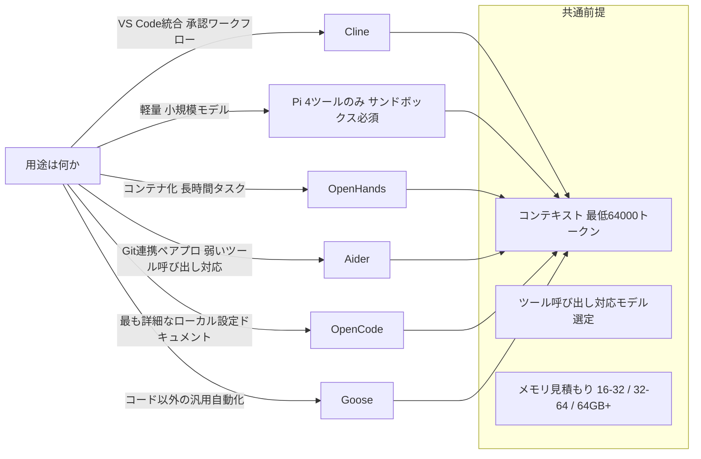
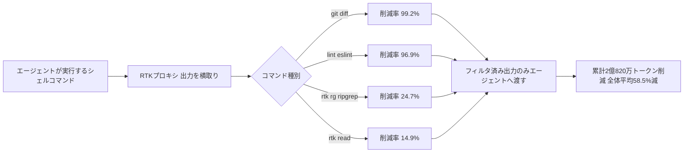

# Daily Briefing 2026-09-19

## 1. Claude Codeのカスタムサブエージェントを自作する際の3つのハマりどころ（原題: Claude Code のカスタムサブエージェント(.claude/agents)を自作する実装手順 — 自動委譲されない・tools 制限・コンテキスト分離の3つのハマりどころ【2026】）

- **URL**: https://qiita.com/yureki_lab/items/cd5cc1fbbe6bcce17d66
- **公開日**: 2026-09-16
- **著者・媒体**: @yureki_lab／Qiita

### 本文翻訳
本記事は、Claude Codeを日常的に使う開発者を対象に、`.claude/agents/`配下にMarkdownファイルを置くだけで作れる「カスタムサブエージェント」を実際に自作した際にハマりやすい3つの落とし穴と、その対処法を整理した実装ガイドである。

サブエージェントの最小構成は、frontmatter（`name`・`description`・`tools`）とシステムプロンプト本文の2要素だけで完結する。記事が示す例は、コード変更のレビューだけを専任で行うエージェントで、`tools: Read, Grep, Glob, Bash`のようにアクセス可能なツールを列挙し、本文には「渡されたdiffを読み、ロジックの誤りや秘密情報のハードコードなど欠陥のみを報告する」といったシステムプロンプトを書く。配置先は2種類あり、プロジェクト固有の`.claude/agents/`と、ユーザー全体で共有される`~/.claude/agents/`が存在し、同名定義がある場合はプロジェクト側が優先される。

第一の落とし穴は「定義したのに自動的に委譲されない」という問題である。原因はほぼ常に`description`の書き方にある。「コードレビューをする」のように能力だけを説明した記述はモデルの自動判断で発火しにくく、「コードを編集・追加した直後に必ず使う」のように、いつ使うべきかというトリガー条件を明示的に書き込むことで、Claudeがタスクの文脈から自動的にそのサブエージェントを選ぶ精度が上がるという。

第二の落とし穴は`tools`指定のタイプミスである。ツール名の大文字小文字を間違える（例えば`Grep`を`grep`と書く）とエラーは一切出力されず、該当機能が黙って使えなくなる。著者はツール名の正確な指定に加え、権限は必要最小限に絞るべきだと注意を促している。またサブエージェントはTaskツール自体を保有できないため、再帰的にサブエージェントを呼び出すような設計はできない点にも触れている。

第三の落とし穴は、サブエージェントが「毎回まっさらな独立したコンテキスト」で起動するという特性の理解不足である。メインスレッドでどれだけ会話や設計方針を積み上げていても、サブエージェント側にはそれが一切引き継がれない。対策として、委譲時のプロンプトに前提条件や制約を明示的に書き込む方法と、方針を`docs/plan.md`のようなファイルに書き出しておき、サブエージェントの定義側でそのファイルを読み込むよう指示する方法の2つが提示されている。

記事は最後に、常時読み込まれる「スキル」と、独立したコンテキストで動く「サブエージェント」は似て非なる機能であることを強調し、コンテキストを完全に分離した状態で作業を任せたい場合にはサブエージェントが適していると結論づけている。

### 重要ポイント
- サブエージェントは`.claude/agents/`配下のMarkdown（frontmatter + システムプロンプト）だけで自作でき、プロジェクト専用と全体共有の2階層があり同名時はプロジェクト側が優先される
- 自動委譲されない原因の大半は`description`にトリガー条件（いつ使うか）が書かれていないことにある
- `tools`のスペルミス（大文字小文字含む）はエラーなく黙って機能を失わせるため、正確な指定と最小権限が必須
- サブエージェントは毎回まっさらなコンテキストで起動し、メインの会話履歴を引き継がないため、前提条件はプロンプトかファイル経由で明示的に渡す必要がある
- スキル（段階的開示の知識）とサブエージェント（独立コンテキストでの実行委任）は目的が異なる機能である

### 図解


### 現場での適用方法

**スキル化の例**（レビュー専任サブエージェントを自作する場合の `.claude/agents/reviewer.md`）:
```markdown
---
name: reviewer
description: コードを編集・追加した直後に必ず使う。diffの正しさとセキュリティ上の欠陥のみを指摘する専任レビュアー。
tools: Read, Grep, Glob, Bash
---

あなたはシニアエンジニアのレビュアーである。
渡されたdiffを読み、以下の観点で欠陥のみを報告する。
- ロジックの誤り・境界条件の見落とし
- 秘密情報のハードコード
- 認証・認可の欠落

指摘のない箇所については言及しない。
```

**CLAUDE.md への追記例**（サブエージェント運用ルールの明文化）:
```markdown
## サブエージェント運用ルール
- description には必ず「いつ使うか」のトリガー条件を書く（能力の説明だけでは自動委譲されない）
- tools は大文字小文字を含め正確に指定し、必要最小限の権限のみを付与する
- サブエージェントに前提条件を渡す場合は、委譲プロンプトに明示するか docs/plan.md 等のファイル経由で渡す
```

**運用手順**（導入と動作確認）:
```bash
# 1. プロジェクト専用サブエージェントを配置
mkdir -p <REPO_PATH>/.claude/agents
cp reviewer.md <REPO_PATH>/.claude/agents/

# 2. 自動委譲が機能するか確認（description のトリガー条件を変えて比較）
# 3. tools の表記ミスがないか、意図した権限のみで動作するかを確認
```

### 期待効果
description にトリガー条件を明記することで自動委譲の精度が上がり、レビューやテスト修正といった定型タスクをメインスレッドのコンテキストを汚さずに委任できるようになる。結果として、メインの会話履歴を長時間の調査ログで圧迫せずに済む。

### 注意点
- サブエージェントはTaskツールを持てず、再帰的な委譲はできない
- tools のタイポはサイレントに機能を失わせるため、導入後の動作確認が欠かせない
- 前提条件を渡し忘れると、サブエージェントがメインの文脈を知らないまま誤った判断をする可能性がある

## 2. ローカルLLM向けオープンソース・エージェントハーネス11選 2026年版（原題: Best Open-Source Agent Harnesses for Local LLMs in 2026）

- **URL**: https://www.marktechpost.com/2026/09/18/best-open-source-agent-harnesses-for-local-llms-in-2026/
- **公開日**: 2026-09-18
- **著者・媒体**: Asif Razzaq／MarkTechPost

### 本文翻訳
本記事は「エージェント＝モデル＋ハーネス」という前提のもと、ハーネス（ツール実行・状態管理・権限管理・コンテキスト供給を担う仕組み）がローカルLLMの実用性を大きく左右するとして、ドキュメントの充実度・ライセンス・保守状況・安全管理を基準に11個のオープンソースハーネスを整理した比較ガイドである。

導入部では、ローカル環境でエージェントを動かす際の3つの基本ルールが提示される。第一に、コンテキストウィンドウを拡張すること。Ollamaのデフォルトコンテキストは搭載VRAMに応じて自動決定されるため不十分な場合が多く、`OLLAMA_CONTEXT_LENGTH=64000 ollama serve`のように明示的に最低64,000トークンを確保すべきだとしている。第二に、ツール呼び出し（function calling）に対応したモデルを選ぶこと。llama.cppを使う場合は`--jinja`フラグでテンプレート互換性を確保する必要がある。第三に、メモリを現実的に見積もること。16〜32GBは小規模量子化モデル向け、32〜64GBは中規模コーディングモデル向け、64GB以上で大規模モデルが視野に入るとしている。

比較対象の11個のうち、実践的に参考になる知見が多いものを挙げる。OpenCodeはOllama・LM Studio・llama.cppの3系統のローカル設定を最も詳細にドキュメント化しており、`ollama launch opencode`のワンコマンド設定が可能だが、ツール呼び出しが失敗する場合は`num_ctx`を16k〜32kまで引き上げる対処が推奨されている。Pi（Mario Zechner作、2026年4月にEarendilが買収）はread・write・edit・bashの4ツールのみに絞ったミニマリスト設計で、MCPやサブエージェント、権限ポップアップを持たない代わりに軽量で、権限システムがないためDockerやサンドボックス環境での実行が強く推奨される。Gooseは2025年12月設立のLinux Foundation傘下Agentic AI Foundationが管理するRust実装で、Ollama・LM Studio・Docker Model Runnerなど最多のローカルランタイムに対応し、70以上のMCP拡張を持つ。

OpenHandsはローカルLLMについて最も詳細なガイドを提供しており、2026年5月時点の推奨モデルはQwen3.6-35B-A3B、必要VRAMは量子化版で24GB、Apple Siliconなら統合メモリ64GBを目安とし、コンテキストは最小22,000・推奨32,768トークンとしている。また、LM StudioがデフォルトでAI管理のTruto的な「127.0.0.1のみバインド」設定になっている落とし穴があり、Docker経由で使う場合は「Serve on Local Network」を有効化する必要があると指摘する。Aiderはツール呼び出しへの対応が弱いモデルでも動くよう、ファイル全体を返す`whole`形式や検索置換ブロックの`diff`形式といったテキストベースの編集フォーマットを備え、リポジトリマップ機能で重要シンボルを毎リクエストに含める設計になっている。ただしOllama利用時はコンテキスト超過分がサイレントに破棄される注意点がある。Codex CLIはApache-2.0ライセンスでOllama（ポート11434）とLM Studio（ポート1234）を組み込みでサポートするが、Responses API専用でChat APIには対応しない制約がある。

記事はキーテイクアウェイとして、OpenCodeがコーディング系ハーネスの中で最もローカル設定のドキュメントが充実していること、コンテキスト64,000トークン設定がほぼ前提条件になっていること、Piは小規模モデルでの効率は良いがサンドボックスが必須であること、ライセンス面ではCrushがサーバーサイドライセンス（FSL）である点やClineのJetBrainsプラグインが非オープンソースである点への注意を挙げている。

### 重要ポイント
- 「エージェント＝モデル＋ハーネス」という前提のもと、ローカルLLM運用時はハーネス選定が性能を大きく左右する
- 共通の基本ルールとして「コンテキスト最低64,000トークン」「ツール呼び出し対応モデルの選定」「メモリ見積もり（16-32/32-64/64GB+）」の3点が提示されている
- OpenCodeはローカル設定ドキュメントが最も充実、Piは4ツールのみのミニマリスト設計でサンドボックス必須、Gooseは中立的なガバナンス下で最多のローカルランタイムに対応
- OpenHandsは推奨モデル・VRAM・コンテキスト量まで具体的な数値を提示しており、LM Studioのバインドアドレス設定という落とし穴にも言及
- ライセンス（Crushのサーバーサイドライセンス、Cline JetBrainsプラグインの非OSS等）を事前に確認する必要がある

### 図解


### 現場での適用方法

**運用手順**（OllamaでのローカルLLMコンテキスト拡張とOpenCode導入）:
```bash
# 1. Ollamaのコンテキスト長を明示的に拡張して起動（デフォルトのVRAM依存設定を上書き）
OLLAMA_CONTEXT_LENGTH=64000 ollama serve

# 2. OpenCodeをOllama向けにワンコマンドで設定
ollama launch opencode

# 3. ツール呼び出しが失敗する場合は num_ctx を引き上げる
#    (OpenCode の設定ファイルで num_ctx: 16384 〜 32768 に調整)
```

**CLAUDE.md への追記例**（ローカルLLMハーネスを併用するプロジェクトでの前提条件明記）:
```markdown
## ローカルLLM併用時の前提
- ローカルモデルで動かすサブタスクは、コンテキストを最低64,000トークン確保した設定（OLLAMA_CONTEXT_LENGTH=64000等）を前提とする
- ツール呼び出し非対応・低精度のローカルモデルには、テキストベース編集（whole/diff形式）にフォールバックできるハーネスを選ぶ
- Pi等の権限システムを持たないハーネスは、必ずDocker/サンドボックス内で実行する
```

### 期待効果
基本ルール（コンテキスト64,000トークン以上・ツール呼び出し対応モデル・現実的なメモリ見積もり）を守るだけで、ツール呼び出しの失敗やコンテキスト超過によるサイレントな情報欠落といった、ローカルLLMエージェント運用でありがちな不具合の多くを未然に防げる可能性がある。

### 注意点
- 記事にはベンチマーク数値（速度・精度の定量比較）は含まれておらず、機能・設定面の比較にとどまる
- Pi等、権限システムを持たないハーネスをサンドボックスなしで動かすことはセキュリティ上のリスクがある
- ライセンス条件（サーバーサイドライセンスや一部コンポーネントの非OSS化）はプロジェクトによって異なるため、商用利用前に個別確認が必要

## 3. 実測データで裏付けるClaude Code/Codexのトークン節約テクニック集（原題: savetokens: Token-saving techniques for Claude Code and Codex, published as a component datasheet）

- **URL**: https://savetokens.tips
- **公開日**: 不明（GitHubリポジトリのスナップショット日付は2026-09-17、日次更新）
- **著者・媒体**: ryanportfolio（GitHub）／ savetokens.tips

### 本文翻訳
本サイトは、Claude CodeやCodexなどのAIコーディングエージェントがやり取りするトークン量を減らすための実践的な習慣とツールを、電子部品のデータシートのような形式で整理し、実測値に基づいて公開しているプロジェクトである。ソースコードはGitHub上の`ryanportfolio/savetokens`で公開されており、スナップショット日付は2026年9月17日、150件超のコミット履歴を持つ継続更新型のリポジトリである。

サイトが最も重視しているのは「捏造された数字を載せない」という方針であり、掲載データを「実測値（緑色表示、実際の実行ログの前後比較に基づく）」と「推定値（グレー表示、波線付きでサンプル数を明記）」に厳密に区別している。トップレベルの実測サマリーとして、対象となった全172,668回のコマンド実行に対し、出力トークンの削減率は平均58.5%、削減された総量は2億820万トークンに達したと報告されている。

具体的なテクニックとしては、まず「RTK」と呼ばれる出力フィルタリングの仕組みが中心に据えられている。これはシェルコマンドの出力をプロキシ的に介在させ、エージェントに渡す前に不要な情報を圧縮・除去するというアプローチである。コマンド別の実測データも公開されており、例えば`rtk read`は削減率14.9%（実行9,418回で累計9,150万トークン削減）、`rtk rg`（ripgrepラッパー）は削減率24.7%（実行2,331回で3,780万トークン削減）、`lint eslint`のラッパーに至っては削減率96.9%（実行215回で3,410万トークン削減）を記録している。単一コマンドとして最大の削減効果を示したのは`git diff`のラッピングで、99.2%という削減率が報告されている。

RTK以外の習慣としては、エージェントへの指示自体を簡潔にして冗長な返答を防ぐ「Caveman mode」、タスクの切り替わり時に明確でコンパクトな新規セッションを開始する「セッション衛生管理」、サブエージェントへのモデルルーティングを規律立てて設定する手法、そしてAPI側のキャッシュが有効な約5分間のタイムフレームを意識して作業をまとめて行う「バースト作業」が紹介されている。

サイトはこれらのデータをGitHubへのリンクや実行ログとともに公開しており、検証可能性を重視した構成になっている。また測定値は日々のログの蓄積に応じて改訂される「生きたデータシート」として運用されており、静的な記事ではなく継続的に更新されるベンチマークとして機能している点が特徴である。

### 重要ポイント
- 全172,668回のコマンド実行に対し出力トークン削減率58.5%、総削減量2億820万トークンという大規模な実測データを公開
- コマンド出力をフィルタリングする「RTK」ラッパーが中心手法で、`git diff`のラッピングでは削減率99.2%を記録
- `lint eslint`ラッパーは削減率96.9%、`rtk rg`（ripgrepラッパー）は24.7%など、コマンドごとの実測値が個別に公開されている
- 実測値（緑・ログベース）と推定値（グレー・波線付き）を明確に区別し、捏造データを排除する方針を明示
- スナップショット日付を明記した「生きたデータシート」として日次更新される運用形態を取っている

### 図解


### 現場での適用方法

**運用手順**（RTK系コマンドラッパーの考え方を自前で再現する最小構成）:
```bash
# 1. 頻繁にエージェントへ渡す出力の大きいコマンドを洗い出す（git diff, lint, ripgrep等）
# 2. それぞれに「不要な行を削るフィルタ」をかますラッパー関数を用意する例（git diff用）
git_diff_compact() {
  # 差分のコンテキスト行数を絞り、バイナリ/生成ファイルの差分を除外する
  git diff --unified=1 -- . ':(exclude)*.lock' ':(exclude)dist/**'
}

# 3. lintは全量出力ではなく差分ファイルのみ・エラー行のみに絞る
eslint_compact() {
  eslint --format=compact "$@" | grep -E "error|warning"
}
```

**CLAUDE.md への追記例**（トークン節約習慣をルール化する）:
```markdown
## トークン節約ルール
- git diff は --unified=1 相当の圧縮形式で確認し、lockファイルや生成物ディレクトリの差分は除外する
- lint/テストの出力は全量を貼らず、エラー・警告行のみに絞って渡す
- 関連する複数の調査・編集は、セッションを切らずに5分以内のタイムフレームでまとめて実行し、プロンプトキャッシュを有効活用する
- タスクの種類が切り替わったら、前タスクの冗長なログを持ち越さないよう新規セッションを開始する
```

### 期待効果
サイトの実測では出力トークンを全体平均で58.5%削減できたと報告されており、特に`git diff`や`lint`のような繰り返し実行され出力が肥大化しやすいコマンドに絞ってフィルタリングを導入するだけでも、大きな削減効果が見込める。

### 注意点
- 数値はsavetokens.tipsというサイト単体の実測環境に基づくものであり、自分のプロジェクトの出力パターン（言語・ツールチェーン）が異なれば削減率も変わる
- 出力を過度にフィルタリングすると、エージェントが本来必要とする情報（エラーの文脈等）まで削ってしまうリスクがあるため、フィルタ内容は段階的に調整すべきである
- サイトは継続更新型のため、本記事執筆時点（スナップショット2026-09-17）の数値は将来変動する可能性がある
