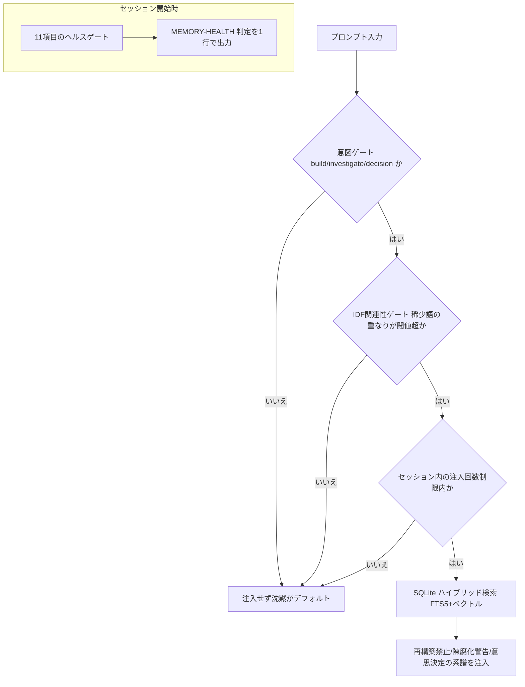
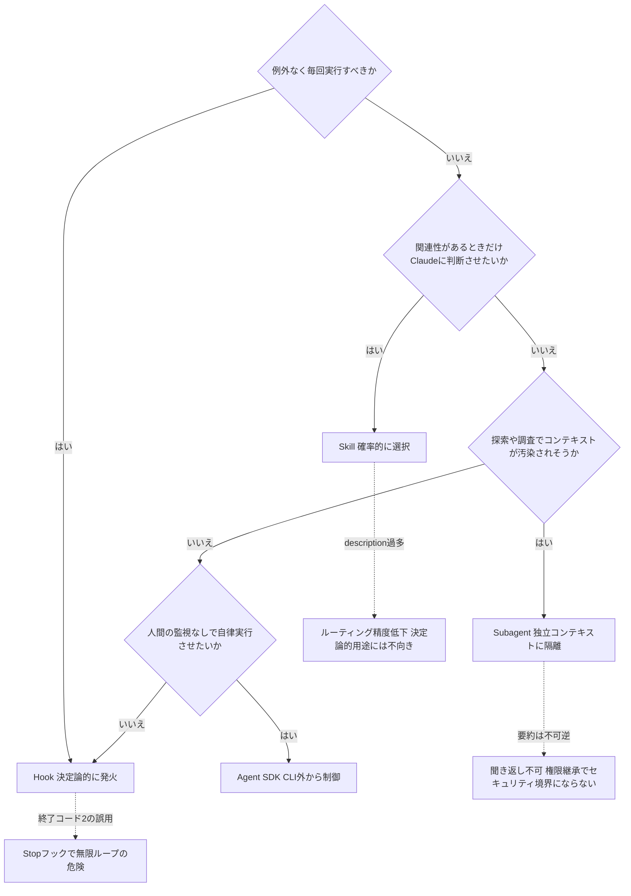
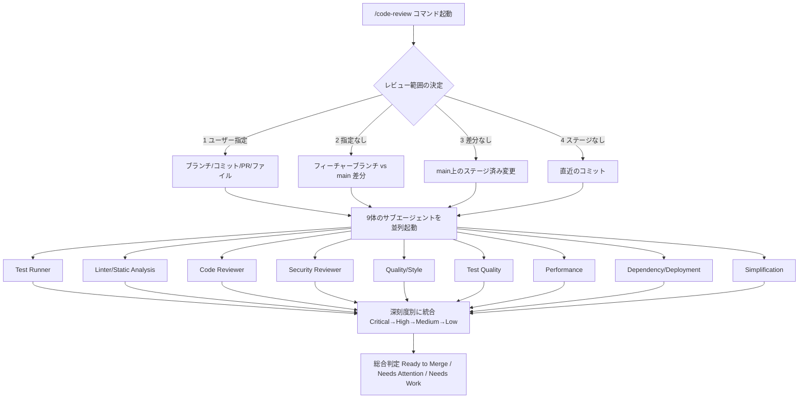

# Daily Briefing 2026-09-20

## 1. メモリをインフラとして扱う——数か月規模のLLM支援開発における永続エージェントメモリの信頼性エンジニアリング（原題: Memory as Infrastructure: Reliability Engineering for Persistent Agent Memory in Months-Long LLM-Assisted Development）

- **URL**: https://arxiv.org/abs/2609.05510
- **公開日**: 2026-08-31
- **著者・媒体**: Mike Helwig／arXiv (cs.SE)

### 本文翻訳
本論文は、著者が単一のClaude Codeセッションで63万3000行規模のコードベースを約8か月間運用し続けた実運用記録に基づき、長時間稼働するコーディングエージェントの「メモリ（記憶）」をアプリケーションの付属品ではなく、サービング基盤と同水準の信頼性工学の対象として扱うべきだと主張する。成果物として、MITライセンスのオープンソースツール「SIx Harness」を公開している。

著者はまず、メモリシステムに対して従来のSREの語彙（ヘルスチェック、ハートビート、鮮度目標、判定の明確化）をそのまま適用すべきだと述べ、そこから7つの設計原則を導く。代表的なものとして、「あらゆるフック呼び出しは実行前にテレメトリ行を書き込む（分母の計装）」「読み手の信頼は有限であり、不確実なら沈黙をデフォルトにする（再現率よりも精度）」「メモリは既存の知見が見落とされる方向と、記録が陳腐化する方向の両方向に失敗するため、対立する緩和策を両立させる」「コンテキスト圧縮を生き延びる必要がある情報は、ワークフローが強制的に読み直すファイルに落とし込む」などがある。

アーキテクチャの中核はプロジェクトごとに1つ持つローカルSQLiteデータベースで、全文検索（FTS5/BM25）とベクトル検索（sqlite-vec）を組み合わせたハイブリッド検索を行う。ベクトル埋め込みが取得できない場合はBM25のみへ自動的に「正直に劣化」し、次元不一致のベクトルは書き込み時点で拒否することで、サイレントな破損を検知可能な障害に変換する。コンテキスト注入は「意図ゲート→IDFに基づく関連性ゲート→セッションごとの回数制限→機械生成ターンの除外」という、計算コストの低い順に並んだ拒否のカスケードで構成される。セッション終了時には意思決定案と行き詰まり案を機械的に全件取り込むのではなく、人間とエージェントが確認・却下・改題のトリアージを行った上で正式記録に昇格させており、提案された154件の意思決定案のうち59件、186件の行き詰まり案のうち47件のみが生き残ったという。

信頼性の中核は「セッションヘルスゲート」で、セッション開始のたびに11項目のチェック（取り込みの鮮度、ベクトルの網羅性と次元整合、フックごとの成功率、キューの深さ、インデックス整合性など）を実行し、モデルの判断に頼らず閾値演算だけで「MEMORY-HEALTH: 11/11 GREEN」のような単一の判定を出力する。運用開始（2026年1月の手動運用開始、5月にメモリコア本番投入、7月に信頼性レイヤー計装開始）から8月末までの7万8933回のフック呼び出しのうち、失敗は85件でサイレント障害はゼロ。うち84件は7月2〜21日の最初の3週間に集中し、以降の失敗はわずか1件、直近20日間はゼロ失敗だった。8月19〜28日の精度測定期間（10日間・2121回のフック呼び出し・失敗ゼロ）では、意図を含む14件のプロンプトのうち実際に注入が発火したのは3件で、意図を含まない54件への誤発火はゼロだったと報告している。

論文は「N=1・対照群なし・自己申告」という限界を率直に認めつつ、独立検証のための事前登録済みアブレーションプロトコルを提供しており、単一事例ながら数か月規模で計装されたエージェントメモリの運用記録として初めてのものだと位置づけている。

### 重要ポイント
- エージェントの永続メモリをSRE的な信頼性工学（ヘルスチェック・ハートビート・鮮度目標）の対象として扱う「7つの設計原則」を提示
- ローカルSQLiteでのFTS5+ベクトルのハイブリッド検索と、意図・関連性・回数制限による多段階の注入ゲーティングで「不確実なら沈黙」を徹底
- 意思決定案・行き詰まり案は全件記録せず人間+エージェントのトリアージで厳選（154件→59件、186件→47件）してノイズ化を防止
- 7万8933回のフック呼び出しで失敗85件（うちサイレント障害ゼロ）、最初の3週間に84件集中し以降はほぼゼロ失敗という改善曲線を実測データで提示
- 10日間の精度測定では意図なしプロンプト54件への誤発火ゼロを達成し、関連性ゲーティングの効果を定量的に示した

### 図解


### 現場での適用方法

**CLAUDE.md への追記例**（永続メモリ運用の指針をエージェントに明示する）:
```markdown
## メモリ運用ルール
- 過去の意思決定や既知の落とし穴を記録したファイル（docs/decisions.md 等）は
  セッション開始時に必ず読み直し、既存の結論を再導出しない
- 自分の記録した内容は「事実」ではなく「ヒント」として扱い、
  重要な判断の前には現在のコード・テスト結果で裏取りする
- 新しい意思決定・行き詰まりを記録する際は、思いつきをすべて残さず、
  次のセッション開始時に人間が確認・却下・改題できる形で一時ファイルに溜める
```

**運用手順**（セッションヘルスチェックの最小実装イメージ）:
```bash
# 1. セッション開始フックとして、メモリ関連リソースの健全性を軽量チェック
#    (docs/health-check.sh のようなスクリプトを SessionStart フックに登録)
#!/usr/bin/env bash
set -euo pipefail
CHECKS_PASSED=0
CHECKS_TOTAL=3

test -f docs/decisions.md && CHECKS_PASSED=$((CHECKS_PASSED+1))
test -f docs/known-pitfalls.md && CHECKS_PASSED=$((CHECKS_PASSED+1))
[ "$(find docs -newer /tmp/.last_session_check 2>/dev/null | wc -l)" -ge 0 ] && CHECKS_PASSED=$((CHECKS_PASSED+1))

echo "MEMORY-HEALTH: ${CHECKS_PASSED}/${CHECKS_TOTAL}"
touch /tmp/.last_session_check
```

### 期待効果
論文の実測では、フック呼び出し失敗率が運用初期の高頻度状態から最終20日間でゼロにまで改善し、関連性ゲーティングにより意図を含まないプロンプトへの誤注入をゼロに抑えられたと報告されている。長期プロジェクトで同様の「セッション開始時の健全性チェック＋厳選されたメモリ注入」を取り入れれば、エージェントが同じ調査を繰り返す「再発見」の無駄や、古い情報を事実として扱ってしまう「陳腐化」のリスクを両方低減できる可能性がある。

### 注意点
- 論文自体がN=1・対照群なしの自己申告データであることを明言しており、一般化には独立検証が必要
- SIx Harnessはこの著者のワークフロー（単一の長時間Claude Codeセッション）に最適化されており、マルチエージェント構成やチーム開発への転用には調整が要る
- ヘルスチェックやゲーティングの閾値はプロジェクト規模やコミット頻度に依存するため、そのまま数値を流用せず自チームで計測し直す必要がある

## 2. Claude CodeのHooks・Skills・Subagentsの使い分け——3つの拡張手段とそれぞれが裏目に出るとき（原題: Claude Code Hooks vs Skills vs Subagents: Three Ways to Extend the Agent, and When Each Backfires）

- **URL**: https://dev.to/kenimo49/claude-code-hooks-vs-skills-vs-subagents-three-ways-to-extend-the-agent-and-when-each-backfires-1728
- **公開日**: 2026-09-13
- **著者・媒体**: Ken Imoto／DEV Community

### 本文翻訳
本記事は、Claude Codeを拡張する3つの主要な手段（Hooks・Skills・Subagents）と、その基盤であるAgent SDKについて、それぞれが「誰が実行を決めるか」という一点で本質的に異なることを軸に整理した実践ガイドである。著者はこれを「Hooksは決定論的で、Claudeの意思に関係なくイベントで発火する。Skillsは確率的で、Claudeが説明文を読んで取り込むかを判断する。Subagentsは隔離であり、独立したコンテキストウィンドウで動いて要約だけを返す」と要約する。

Hooksは`settings.json`に登録するシェルコマンドで、`PreToolUse`・`PostToolUse`・`UserPromptSubmit`・`SessionStart`・`Stop`などのライフサイクルイベントで発火し、モデルに裁量権はない。トークンコストはコンテキスト外で実行されるためごく小さい。フォーマット強制や秘密ファイルへのアクセス遮断、停止前のテスト実行など「例外なく必ず行うべき処理」に向く一方、重大な落とし穴として終了コード2はアクションをブロックする仕組みがあり、たとえば「未コミットの変更が残っていないか」を`Stop`フックでチェックする実装は、変更が解消されない限りエージェントを無限リトライループに陥れる危険がある。

Skillsはfrontmatter付きのMarkdownファイルで、Claudeがセッション開始時に各Skillの`description`だけを読み込み（1つあたり数十トークン程度）、ターンごとに取り込むかどうかを判断する「段階的開示」の仕組みを持つ。本文全体は呼び出し時にのみ読み込まれるため、数百個のSkillsを登録してもコンテキストを圧迫しない。ただし`description`自体は毎ターンのコンテキスト税として乗り続けるため、説明文が冗長だとルーティング精度が下がる。著者は「常にlintを実行する」という趣旨のSkillを作って失敗した経験を紹介し、「確率的なルーターに決定論的な振る舞いを期待した」自分の設計ミスだったと振り返っている——ルーター自体は設計通りに動作しており、単に時々別の判断を下しただけだったという。

Subagentsは専用のシステムプロンプトとツール許可リストを持つ独立したコンテキストで動作し、親の会話に返るのは最終メッセージのみである。親のコンテキストを一切消費しないため、コードベース全体のgrepやログの精査など「ノイズの多い探索作業」を隔離するのに向く。重大な制約として、Subagentsはタスク実行中にユーザーへ聞き返すことができず、要約自体が不可逆に情報を失う——著者は、誤ったディレクトリを検索したSubagentが自信満々に「該当箇所は見つかりませんでした」と報告してきた経験を挙げている。さらに2026年時点の注意点として、権限モードは親から継承されるため、Subagent側で絞ったツール許可リストが上書きされてしまうことがあり、セキュリティ境界としては信頼できない。

最後にAgent SDK（旧Claude Code SDK）は、同じエージェントループをCLIの外でTypeScript/Pythonから制御できる基盤で、CIボットやバックエンドサービス、スケジュールジョブを動かす際に使われる。リトライやサンドボックス化、セッション永続化、コスト管理はすべて利用者側の責任になり、認証もclaude.aiのサブスクリプションログインではなくAPIキー方式になる点が制約として挙げられている。

### 重要ポイント
- Hooksは「必ず実行する」処理、Skillsは「関連性があれば実行する」処理、Subagentsは「コンテキストを汚染させたくない」処理、という一問一答式の判断基準を提示
- Hooksの終了コード2によるブロックは、Stopフックの設計次第で無限リトライループを引き起こしうる重大な落とし穴
- Skillsは`description`のみを常時読み込む段階的開示でトークン効率が良い反面、確率的な選択機構を決定論的な用途に使うと機能しない
- Subagentsは要約が不可逆に情報を欠落させ、途中で人間に聞き返せない。さらに権限モードが親から継承されるためセキュリティ境界にはならない
- Agent SDKはCLI外での自動運転を可能にする一方、リトライ・サンドボックス・コスト管理を利用者が自前で担う必要がある

### 図解


### 現場での適用方法

**運用手順**（PostToolUseフックでのフォーマット強制）:
```json
{
  "hooks": {
    "PostToolUse": [
      {
        "matcher": "Write|Edit",
        "hooks": [
          { "type": "command", "command": "prettier --write \"$CLAUDE_FILE_PATHS\"" }
        ]
      }
    ]
  }
}
```

**スキル化の例**（探索専任のSubagent定義、frontmatterとtools制限）:
```markdown
---
name: codebase-explorer
description: シンボルの定義箇所・使用箇所をコードベース全体から検索する。
tools: Read, Glob, Grep
model: sonnet
---

あなたはコードの所在を特定する専任エージェントである。
ファイルパスと行番号のみを報告し、ファイル全体のダンプは行わない。
```

**CLAUDE.md への追記例**（4つの拡張手段の使い分けをルール化する）:
```markdown
## 拡張手段の選び方
- 「例外なく毎回」実行すべき処理（lint・秘密情報チェック等）は Hook にする
- 「状況次第で」使うべき手順（レビュー観点・定型ドキュメント作成等）は Skill にする
- 「調査・探索でコンテキストを汚したくない」処理は Subagent に隔離する
- Stop フックで終了コード2を返す条件は、無限ループを避けるため必ず収束条件を確認する
```

### 期待効果
実行タイミングと責任の所在（環境が決めるか、モデルが決めるか、隔離するか）を明確に切り分けることで、Skillに決定論的な振る舞いを期待して失敗する、あるいはHookの誤設計で無限ループに陥るといった、著者自身が経験した典型的な事故を未然に防げる。

### 注意点
- Stopフックで終了コード2を使う場合は、ブロック条件が必ず解消し得ることを事前に検証しないと無限リトライに陥る
- Subagentの権限リストは親セッションの権限モードに上書きされうるため、厳格な権限分離をセキュリティ対策として過信しない
- Agent SDKを使う場合はAPIキー認証になり、claude.aiのサブスクリプション枠とは別課金体系になる点に注意

## 3. Claude Codeで9体の並列サブエージェントにコードレビューをさせる仕組みを作った話（原題: 9 Parallel AI Agents That Review My Code (Claude Code Setup)）

- **URL**: https://hamy.xyz/blog/2026-02_code-reviews-claude-subagents
- **公開日**: 2026-02-20
- **著者・媒体**: Hamilton Greene（HAMY）

### 本文翻訳
著者はAIがコードを高速に生成する時代において、品質担保をどう機械の速度に追従させるかという課題に直面し、以前公開していた単純な1体構成のレビュースクリプトでは有用な指摘が半分未満（<50%）しか得られなかったと振り返る。そこで採用したのが、観点ごとに専任化した9体のサブエージェントを`Task`ツールで同時起動し、並列にレビューさせる構成であり、この変更によって有用な指摘の割合が約75%まで向上したと報告している。

9体の内訳は、テストを実行し失敗の詳細を報告する「Test Runner」、lintと静的解析で型エラーや未解決の参照を検出する「Linter & Static Analysis」、非自明な問題に絞って最大5件のランク付き改善案を出す「Code Reviewer」、インジェクションや認証不備・秘密情報の漏洩をチェックする「Security Reviewer」、複雑度・デッドコード・重複・規約逸脱を見る「Quality & Style Reviewer」、カバレッジの費用対効果や実装詳細ではなく振る舞いをテストしているかを評価する「Test Quality Reviewer」、N+1クエリやブロッキング処理・メモリリークを検出する「Performance Reviewer」、依存関係の追加や破壊的変更・ロールバック安全性を見る「Dependency & Deployment Safety Reviewer」、そして抽象化が本当に必要か・変更が原子的かを問う「Simplification & Maintainability Reviewer」である。各エージェントには担当範囲・着眼点・出力フォーマットを定義した詳細な指示が個別に与えられている。

全エージェントの実行完了後、システムは指摘を「issue」と「suggestion」に分類し、Critical→High→Medium→Lowの深刻度で全エージェント横断的にランク付けし、問題のなかったエージェントの結果は1行に圧縮して要約する。最終的に「対応必須の指摘」と任意の「提案」を分離した優先順位付きレポートを出力し、Ready to Merge／Needs Attention／Needs Workのいずれかの総合判定を下す。

レビュー対象の特定は`/code-review`スラッシュコマンドとして実装されており、範囲の決定には優先順位がある。ユーザーが明示的に指定した範囲（ブランチ名・コミットSHA・PR番号・ファイルパス）を最優先とし、指定がなければmain/masterに対するフィーチャーブランチの差分、それもなければmain/master上のステージ済み変更、最後に直近のコミットという順でフォールバックする。9体すべてがTaskツール呼び出しで同時に起動し、結果が1つのレポートへ統合される。

著者は運用上の教訓として、この仕組みを「Markdownでコーディングしているような感覚」と表現し、問題や改善余地に気づくたびに各エージェントの指示文を直接書き換えて継続的に改善していると述べる。また、タスクを「完了」と報告する前にこのレビューを必ず実行させることで提出前に問題を捕捉できる点、プロジェクトのスタイルガイド（CLAUDE.md等）を各エージェントが参照して既存の規約に沿った指摘を行う点、そして「AIに自己検証できる成功基準を与えると、その基準を満たす結果に到達する精度が大きく上がる」という気づきを挙げている。著者はこの手法を、AIを場当たり的にではなく体系的に使う「vibe engineering」の一部として位置づけている。

### 重要ポイント
- 単一エージェントによるレビューでは有用な指摘が50%未満だったのに対し、観点別に専任化した9体の並列サブエージェント構成で約75%まで向上
- 9体はテスト実行・lint/静的解析・一般レビュー・セキュリティ・品質/スタイル・テスト品質・パフォーマンス・依存関係/デプロイ安全性・簡素化の各観点に専任化されている
- 深刻度（Critical→High→Medium→Low）で全エージェント横断的にランク付けし、問題なしのエージェントは1行に圧縮して要約する統合ロジックを持つ
- `/code-review`コマンドはユーザー指定範囲→フィーチャーブランチ差分→ステージ済み変更→直近コミットの順でレビュー対象を自動決定する
- タスク完了の自己申告前に必ずこのレビューを実行させる運用と、AIに自己検証可能な成功基準を与えることの効果を強調している

### 図解


### 現場での適用方法

**スキル化の例**（`.claude/commands/code-review.md` として9体並列レビューの骨子を実装する）:
```markdown
---
name: code-review
description: 変更差分を9つの観点から並列レビューし、深刻度別に統合したレポートを出す。
---

以下の優先順位でレビュー対象の差分を決定する。
1. ユーザーが引数で指定した範囲（ブランチ/コミット/PR/ファイルパス）
2. フィーチャーブランチと main/master の差分
3. main/master 上のステージ済み変更
4. 直近のコミット

決定した差分に対し、以下9つの観点でサブエージェントを並列起動する。
各エージェントは自分の観点のみに集中し、問題がなければ1行で「問題なし」と報告する。

- test-runner: テストを実行し、失敗の詳細を報告する
- lint-static: lintと型チェックの結果のみを報告する
- code-reviewer: 非自明な改善点を最大5件、ランク付きで報告する
- security-reviewer: インジェクション・認証不備・秘密情報漏洩のみを報告する
- quality-style: 複雑度・デッドコード・重複・規約逸脱を報告する
- test-quality: カバレッジの費用対効果とテストの脆さを報告する
- performance: N+1・ブロッキング処理・メモリリークを報告する
- dependency-deploy: 依存追加・破壊的変更・ロールバック安全性を報告する
- simplification: 過剰な抽象化・変更の原子性を報告する

全エージェントの結果を Critical→High→Medium→Low で統合し、
Ready to Merge / Needs Attention / Needs Work のいずれかで総合判定する。
```

**CLAUDE.md への追記例**（タスク完了前にレビューを必須化する運用ルール）:
```markdown
## タスク完了前の必須手順
- コード変更を「完了」と報告する前に、必ず /code-review を実行する
- Needs Work 判定が出ている間は、Critical/High の指摘が解消するまで完了扱いにしない
- レビュー指示文（各観点の着眼点）は、見落としに気づいた時点で直接更新してよい
```

### 期待効果
著者の実測では、単一エージェント構成に比べて有用な指摘の割合が50%未満から約75%へ向上したと報告されている。タスク完了の自己申告前にレビューを必須化する運用と組み合わせることで、AI生成コードにありがちな見落とし（セキュリティ・パフォーマンス・テストの質など）を提出前に機械的に捕捉しやすくなる。

### 注意点
- 75%という数値は著者個人のプロジェクトにおける主観評価であり、厳密なベンチマークではない点に留意する
- 9体を並列起動するためTaskツールの同時実行数やAPIコストが単一エージェント構成より増加する
- 各エージェントの指示文はプロジェクト固有の規約に合わせて継続的なチューニングが前提であり、導入後の放置は精度低下につながりうる
