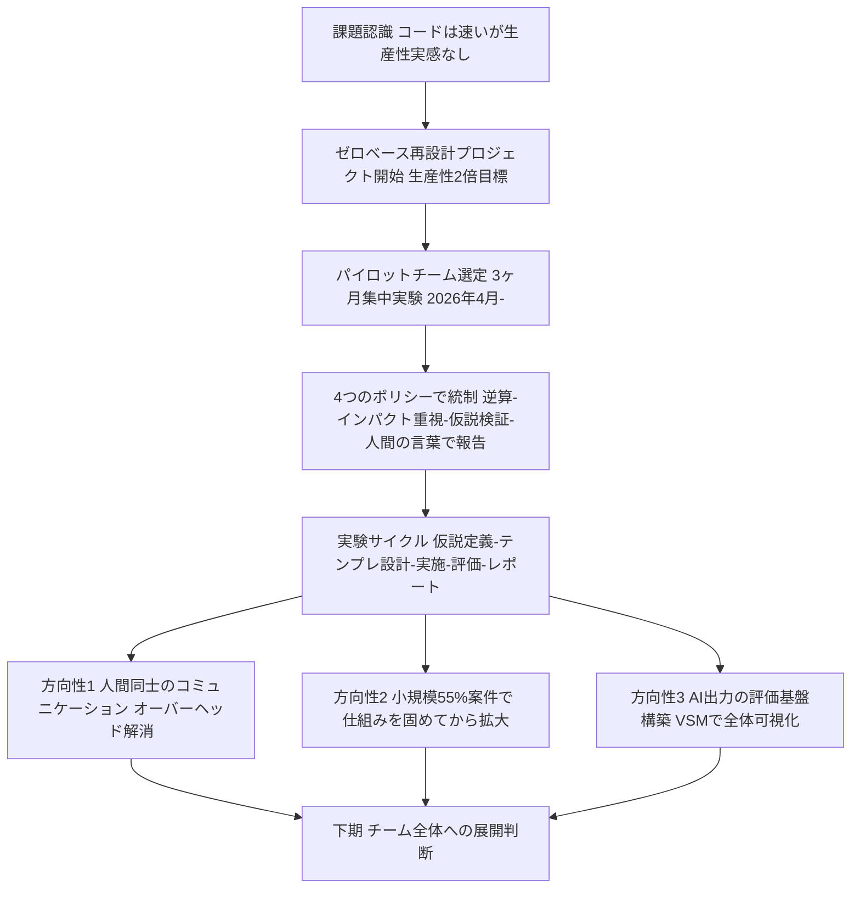
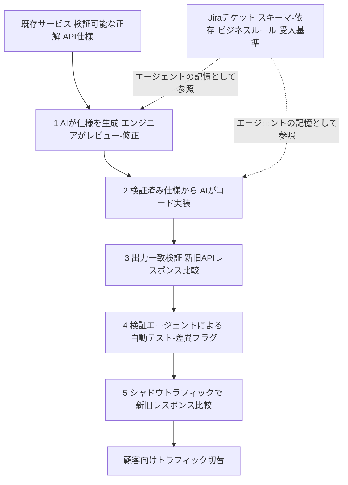
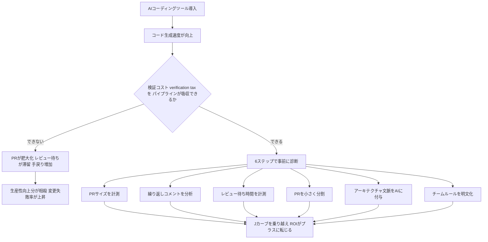

# Daily Briefing 2026-09-22

## 1. SmartHR勤怠管理チームが挑む「AIネイティブ開発プロセス」への移行——生産性2倍を掲げた3ヶ月のパイロット実験（原題: AIネイティブな開発プロセスへの移行、はじめました）

- **URL**: https://tech.smarthr.jp/entry/2026/06/04/094730
- **公開日**: 2026-06-04
- **著者・媒体**: tkkr（SmartHR勤怠管理開発チーム プレイングマネージャー）／SmartHR Tech Blog

### 本文翻訳
著者は、チームでAIツールの活用を推進してきたにもかかわらず「チーム全体の生産性が目に見えて上がった実感はありませんでした」と率直に述べる。原因は、コード作成自体は高速化した一方で、開発アイテムの分割・コードレビュー・動作確認といった前後の人間中心プロセスがボトルネックのまま残っていたことにある。そこで著者は、既存プロセスの部分改善ではなく、AIの存在を前提にゼロベースで開発プロセスを再設計する「AIネイティブ開発プロセスへの移行」プロジェクトを立ち上げた。

SmartHR勤怠管理は4チーム体制で運営されているが、まず1チームをパイロットチームとして選び、2026年4月から3ヶ月間の集中実験を開始した。成果が出れば下期にチーム全体へ展開する計画である。プロジェクトのミッションは「開発生産性を2倍にすること」だが、内部品質・外部品質は従来と同等以上に維持するという制約を置いている。特筆すべき意思決定として、経営層を含む関係者全員に対し「このクォーターではパイロットチームの機能開発が1つも完了しなくても構わないので実験を優先して良い」と明言し共有した。これにより、通常の開発サイクルでは躊躇されるような大胆な実験が可能になった。

実験を推進する仕組みとして、4つのポリシーが定められている。第一に「既存のプロセスにとらわれず逆算する」——「これまでこうだった」ではなく「本当に必要なものは何か」から発想する。第二に「インパクトとレバレッジにこだわる」——効果が高そうなものから着手し、手応えが薄いと感じれば実施中でも中断する。第三に「仮説を立て、検証し続ける」——やりっぱなしにせず、学びの質を重視する。第四に「わかりやすいレポートを出し続ける」——AIが書いたレポートをそのまま関係者に渡すのではなく、人間の言葉で説明責任を果たす。実験サイクルは「仮説定義→実験テンプレート設計→実験実施→評価→レポート作成」の順で回され、例として「現在の開発アイテムは実装都合で必要以上に小さく分割されており、より大きな単位で開発すればリードタイムを短縮できるかもしれない」という仮説が挙げられている。運用面では、ペアやモブでの実験実施、毎朝の長めの朝会での細かい振り返り、定性評価ベースでの推進が行われている。

3ヶ月の実験を通じて見えてきた方向性は3つある。1つ目は「人間同士のコミュニケーションオーバーヘッドの解消」。AIが実装や検証を担う割合が増えるほど、相対的に人間同士のコミュニケーション（開発アイテムの分割・整理、コードレビュー）がボトルネックとして際立ってくる。現在の実験テーマとして、実装都合でのIssue分割の廃止、クラウド上のAIエージェント活用による実装業務の脱個人化、暗黙知の形式知化に取り組んでおり、あわせて開発チームの自律性（細かなUI・仕様判断を自律的に行える範囲）の拡大も重要な論点としている。

2つ目は「小さい機能開発で仕組みを固める」戦略。SmartHR勤怠管理の開発アイテムのうち過半数（55%）は2週間程度で完了する小規模アイテムであり、2ヶ月以上かかる大規模アイテムは約6%にとどまる。そのため、まず小規模アイテムを安定して消化できる仕組みを固め、その後段階的に対象範囲を広げる方針をとる。複雑度や専門度によってAIに任せられる範囲は大きく異なり、深いドメイン知識が必要な案件では、AIの出力を評価するコスト自体が見合わないケースもあると指摘している。

3つ目は「改善を正しく評価する仕組みの構築」。AIエージェントやスキルの出力に対する品質フィードバックが複数のツールに分散してしまい、人手での評価ではスケールしないという課題を認識し、現在は出力を体系的に評価する基盤づくりに着手している段階である。段階的アプローチとして、まずはスキルの乱立をある程度許容し、評価の仕組みが整った段階でAI自身による自己改善ループを回す構想を描いている。また、VSM（バリューストリームマッピング）を用いて開発プロセス全体を可視化し、どこを改善対象とするかの選択・合意形成に活用している。

著者は最後に、プロジェクトはまだ道半ばであり「『開発生産性2倍』にはまだ到達できていません」と正直に述べつつ、AIモデルの進化に委ねられる領域と、人間のコミュニケーション再設計・開発規模別の対応・評価の仕組み化という3つの人間工学的な課題が焦点として定まった段階だと締めくくっている。

### 重要ポイント
- 「コードは速く書けるようになったが、前後のプロセス（分割・レビュー・確認）がボトルネックで生産性実感が出ない」という課題認識から、プロセス全体のゼロベース再設計に踏み切った
- 「このクォーターは機能開発ゼロでも良い、実験を優先してよい」と経営層含め明言し、大胆な実験を可能にする心理的安全性を組織的に確保した
- 4つの推進ポリシー（既存プロセスに囚われず逆算／インパクト重視／仮説検証を回す／AIレポートを鵜呑みにせず人間の言葉で説明する）で実験を統制
- 開発アイテムの55%が2週間以内の小規模案件という自社データに基づき、「小さい案件で仕組みを固めてから拡大する」段階的戦略を採用
- AI活用が進むほど人間同士のコミュニケーション（Issue分割・レビュー）が新たなボトルネックになるという逆説的な知見が得られた

### 図解


### 現場での適用方法

**運用手順**（パイロットチーム型の実験プロジェクトを自チームで立ち上げる）:
```bash
# 1. 実験専用チームと期間を決め、目標（例: 開発生産性◯倍）を明文化する
#    「この期間は機能開発が0件でも構わない」という許容ラインを
#    ビジネスサイド含む全関係者に共有し、合意を得ておく

# 2. 仮説管理用のドキュメントを用意する
mkdir -p <REPO_PATH>/docs/ai-native-experiments
cat > <REPO_PATH>/docs/ai-native-experiments/TEMPLATE.md <<'EOF'
## 仮説
（例: 開発アイテムを実装都合で分割しすぎており、まとめて開発すればリードタイムが縮む）

## 実験内容 / 期間
## 評価指標（定性 / 定量）
## 結果と学び
## 次のアクション
EOF

# 3. 毎朝の朝会など既存の場を使い、実験の進捗を短いサイクルで振り返る
```

**CLAUDE.md への追記例**（AIネイティブ化実験のチーム運用ルールをエージェントにも共有する）:
```markdown
## AIネイティブ開発プロセス実験ルール
- 新しい開発アイテムに着手する前に、「実装都合で不必要に分割していないか」
  を確認する。分割の理由が実装上の都合のみであれば、まとめて着手してよい
- AIエージェントが作成した実験レポート・評価結果は、そのまま関係者に
  展開せず、担当者が人間の言葉で要約し直してから共有する
- 2週間以内で完了見込みの小規模アイテムから優先してAI活用の型を検証し、
  大規模・高専門度のアイテムには無理に適用しない
```

### 期待効果
記事の時点ではミッションである「開発生産性2倍」には未到達だが、3ヶ月の実験を通じて「AIモデルの進化に委ねてよい領域」と「人間側で再設計すべき領域（コミュニケーション・規模別対応・評価の仕組み化）」の切り分けができた点が成果として示されている。特に、AI活用が進むほど相対的に人間同士のコミュニケーションがボトルネックとして顕在化するという知見は、AI導入を検討する他チームにも転用可能な学びといえる。

### 注意点
- 記事執筆時点でプロジェクトは進行中であり、定量的な生産性向上の数値は公開されていない
- 「機能開発ゼロを許容する」という大胆な意思決定は、経営層の強いコミットメントが前提であり、同様の合意形成ができない組織ではそのまま再現しにくい
- 開発アイテムの55%が小規模という数値は同社固有のデータであり、自チームの規模分布を先に把握した上で戦略の妥当性を検討する必要がある

## 2. AtlassianのJiraチームが「仕様駆動AI移行」で2四半期分の作業を1週間で完了——100以上のGraphQLフェッチャー移行の具体的手順（原題: Spec-driven AI Migration: How Nearly 2 Quarters of Work Was Completed in One Week）

- **URL**: https://www.atlassian.com/blog/development/spec-driven-ai-migration
- **公開日**: 2026-06-25
- **著者・媒体**: Raymond Su（Jiraエンジニアリングマネージャー）、Reshad Contractor（Jiraシニアソフトウェアエンジニア）／Atlassian Engineering Blog

### 本文翻訳
Jiraチームの5人のエンジニアが、レガシーなゲートウェイサービスから新しいプラットフォーム層へ「100以上のGraphQLフェッチャー」を移行する作業を、わずか1週間で完了させた。通常であれば約2四半期分かかると見積もられていた作業量である。著者らは、この劇的な高速化を実現した鍵は、作業を「仕様駆動（Spec-Driven）」の形に構造化し、AIエージェントが実行できる形にしたことだと説明する。

Spec-Driven開発の定義は、「コードが1行も生成される前に、すべての作業単位を構造化された振る舞い仕様（behavioral specification）として定義する」ことである。AIに曖昧なプロンプトを渡すのではなく、「システムが何をするか・何に依存するか・完了とは何を意味するか」を明記した、耐久性があり人間がレビュー済みの契約書をAIに渡す、というアプローチだ。

このプロジェクトがAI活用に適していた理由は、新しいシステムを発明するのではなく、既知の振る舞いを翻訳する作業だったからだと著者らは述べる。既存サービスがAPIレベルで「検証可能な正解」を提供していたため、忠実な翻訳作業に理想的な対象だった。

Jiraは単なるタスク管理ツールではなく、「作業が存在すること」だけでなく「作業が何を意味するか」を記録するシステム・オブ・レコードとして機能した。移行対象の各チケットには、提供中のGraphQLスキーマ、依存する上流API・データソース、変換処理やフィールド名の変更、ビジネスルールとエッジケース、明示的な受け入れ基準が記載された。この構造化されたフォーマットにより、セッション間でのコンテキスト劣化を防ぎ、知識を失うことなく並行バッチに作業を分散できた。

実装プロセスは5段階で構成される。第1段階は「仕様の生成とレビュー」。AIが既存のソースコードを解析して初期仕様を生成し、エンジニアがコード生成が始まる前にレビュー・修正を行う。これにより人間の判断が仕様に組み込まれ、下流の実行の確度を高め、人手介入を減らせる。第2段階は「検証済み仕様からのコード実装」。検証済みの仕様があることで、AIエージェントが生成する移行コードの精度は仕様の品質に直接比例する。第3段階は「出力の一致検証」。行単位のコードレビューではなく、新旧実装間のAPIレスポンスを比較し、AIを使って生成コードが受け入れ基準を満たしているかを検証する。第4段階は「レビュー前の自動検証」。検証エージェントがチケットからスキーマを抽出し、生成コードを実サービスに対してテストし、出力の差異をフラグ立てして実装修正を導く。第5段階は「シャドウトラフィックによる検証」。シャドウトラフィックの仕組みを使い、旧サービスへのリクエストを新プラットフォームにも転送してレスポンスを比較し、顧客向けトラフィックを切り替える前に一貫性を確認する。

著者らは「仕様こそが成果物である（the spec is the product）」ことを強調し、最も重要な作業は信頼できる仕様を作ることだったと述べる。また「Jiraのチケットはエージェントの記憶である（Jira tickets are agent memory）」とし、揮発性のプロンプトに代わる、永続的で構造化されレビュー可能な代替手段として機能したとする。検証プロセスにも生成と同等の注意が払われ、「出力の一致検証・自動化スクリプト・的を絞った人間のレビューの組み合わせが、大規模な運用でもこのワークフローを正当化できるものにした」としている。

組織的な影響として、このワークフローはエンジニアの役割を消滅させるのではなく「上方にシフト」させたと述べる。繰り返しの多い移行コードを書く作業から、振る舞いを定義し、コンテキストを形成し、パターンをレビューし、確信度を管理する作業へと重心が移った。著者らはこの手法を「既知の移行、合意済みの非推奨化、クリーンアッププロジェクト」など、通常はエンジニアリングのバックログに長期間滞留しがちな作業に転用可能だと位置づけ、振る舞い仕様を人間とAIエージェントの双方が確実に作業できる一次成果物として扱うことで、後回しにされがちな技術的負債の「労力対価値比」を変えられるとまとめている。

### 重要ポイント
- 5人のエンジニアが通常2四半期分の見積もりだった100以上のGraphQLフェッチャー移行を1週間で完了
- 仕様生成→レビュー→コード実装→出力一致検証→自動検証→シャドウトラフィック検証、という5段階プロセスで確度を段階的に積み上げる
- Jiraチケットを「エージェントの記憶」として使い、スキーマ・依存関係・ビジネスルール・受け入れ基準を構造化して記録することでセッション間のコンテキスト劣化を防いだ
- 「仕様こそが成果物」という原則のもと、レビューの重心をコード行単位から仕様・振る舞いの妥当性検証へ移した
- この手法は「新規開発」より「既知の振る舞いの翻訳」（レガシー移行・非推奨化・クリーンアップ）に特に適するという実務的知見

### 図解


### 現場での適用方法

**運用手順**（既知の移行・非推奨化タスクをSpec-Drivenで進める）:
```bash
# 1. 移行対象ごとにチケット（仕様の器）を作成し、以下を必須項目として明記する
#    - 提供中のスキーマ / API仕様
#    - 依存する上流API・データソース
#    - 必要な変換処理・フィールド名変更
#    - ビジネスルールとエッジケース
#    - 明示的な受け入れ基準（Done の定義）

# 2. AIエージェントに既存コードを解析させ、上記チケット項目を
#    埋める形で初期仕様を生成させる
#    → 人間がレビュー・修正してから実装フェーズに進める（ここを省略しない）

# 3. 検証済み仕様をもとにAIエージェントへ実装を指示する
#    実装後は行単位レビューではなく、新旧の出力（APIレスポンス等）の
#    一致を自動比較するスクリプトで検証する
```

**CLAUDE.md への追記例**（仕様駆動の移行タスクにおけるエージェントの振る舞いを規定）:
```markdown
## 移行・非推奨化タスクのSpec-Drivenルール
- レガシーコードの移行・置き換えタスクでは、コード生成を始める前に
  必ず仕様（対象スキーマ・依存関係・ビジネスルール・エッジケース・
  受け入れ基準）をチケット or docs/specs/ に書き出し、
  人間のレビュー承認を得てから実装に進む
- 実装後のレビューは、コード行単位ではなく「新旧の出力が一致するか」を
  自動比較するスクリプトの結果を主な判断材料とする
- 本番トラフィックへの切替前に、可能な場合はシャドウトラフィックで
  新旧レスポンスの差分を確認する
```

### 期待効果
記事内の実例では、5人体制・1週間で約2四半期分（通常換算で数ヶ月規模）の移行作業を完了できたと報告されている。仕様レビューと出力一致検証にレビューの重心を移すことで、大量の並行チケットに作業を分散しても知識の欠落を防ぎながらスケールできた点が特徴で、同様の「既知の振る舞いを翻訳するだけ」のレガシー移行・非推奨化案件では応用しやすいと考えられる。

### 注意点
- この手法が有効だったのは「新しい振る舞いを発明する」のではなく「既知の振る舞いを翻訳する」移行作業だったためであり、要件が未確定な新規機能開発にはそのまま適用しにくい
- 出力一致検証やシャドウトラフィックの仕組みなど、検証基盤への投資が前提になっており、これらが整っていない組織では同じ速度は再現しにくい
- 記事はAtlassian自身の成功事例であり、失敗したケースやうまくいかなかった移行対象の詳細は記載されていない

## 3. 「AIの生産性はコードレビューで失われる」——DORA 2026レポートが示す検証コストとROIの実態（原題: DORA 2026: The ROI of AI in Software Development Runs Through Code Review）

- **URL**: https://kodus.io/en/dora-accelerate-state-of-devops/
- **公開日**: 2026-07-24
- **著者・媒体**: Edvaldo Freitas／Kodus Blog

### 本文翻訳
著者は、DORAが発表した2026年版「AI-assisted Software Developmentの投資対効果（ROI）」レポートを読み解き、AIによるコーディング速度の向上分が、下流のコードレビュー・検証工程でしばしば失われてしまうという構造的な問題を論じる。AI導入の本当のROIは、コード生成が速くなったかどうかではなく、デリバリーパイプライン全体がその増加した速度を吸収できるかどうかにかかっているという。

DORAレポートが提示する「Jカーブ」モデルによれば、AI導入初期には一時的な生産性の落ち込みが生じるのが正常であり、その後に価値の獲得が始まる。この落ち込みは、学習コストやワークフロー調整の負荷に加え、AIが生成したコードの信頼性・セキュリティ・アーキテクチャ整合性を検証するための追加工数、いわゆる「検証コスト（verification tax）」に起因する。著者が示す例示的なシミュレーションでは、3ヶ月間にわたり生産性が15%落ち込んだ後に回復に転じる。

著者は、AI導入のROIを計算する際にはツールのライセンス費用だけでなく、「AI生成コードを理解し、検証し、修正するための時間」を必ず織り込む必要があると強調する。記事はコードレビューを、AIによる速度向上分が消え去る最大のボトルネックとして繰り返し指摘し、「変更がレビュー・テスト・承認の過程で滞留する、あるいは後になって本番環境で問題として表面化する」と述べる。Kodus自身が実施した「State of AI Code Review 2026」分析（約1万件のルールを対象）では、チーム固有のパターンに基づくレビュー指摘の採用率が、バグに関する指摘の採用率に近い水準に達しており、文脈を踏まえたレビューが成果に大きく影響することを示しているという。

著者は「ツールを先に選ぶのではなく、ワークフローの問題を先に診断すべき」だとして、システム側から着手する6つの具体的な診断ステップを提示する。①PRの特性を確認する——AI導入後にPRのサイズが大きくなり、レビュー負荷が増していないか。②コメントのパターンを分析する——規約・スタイル・単純な検証など、自動化できそうな繰り返しコメントを特定する。③レビュー待ち時間を計測する——PRがフィードバック待ちで滞留する時間こそ「AIが生み出した速度が消える場所」である。④PRを小さいバッチに分割する——小さなPRはレビューを容易にし、ユーザーに届く前に問題を発見しやすくする。⑤アーキテクチャの文脈を与える——AIはリポジトリのパターン・アーキテクチャ・依存関係・チームルール・技術的決定の経緯にアクセスできなければ性能を発揮できない。⑥明示的なチームルールを定義する——「PRが人の手に渡る前に検知したい問題は何か」「繰り返し出てくるコメントは何か」を discovery する。

組織が追跡すべき具体的な指標として、変更のリードタイム、デプロイ頻度、変更失敗率、障害復旧時間、平均レビュー時間、PRサイズ、レビュー後の手戻り率、繰り返しコメントの量が挙げられている。DORAモデルに基づく例示的なROI試算（500人規模のエンジニアリング組織の場合）では、開発者1人あたり純増12.5%の時間創出（1日あたり約1時間相当）、初期3ヶ月間の15%の生産性低下、年間デプロイ回数の50回から56回への増加、変更失敗率の5%から6%への上昇、障害復旧コストを時間あたり10万ドル・復旧に4時間と仮定した場合、年間1,160万ドルの価値、初年度の純便益330万ドル、ROI 39%、投資回収期間8ヶ月という数字が示される。

著者は最後に、「ROIは取り戻せた時間に依存するが、その利益がどれだけ不安定性・重いレビュー・手戻りに消費されるかにも依存する」と警鐘を鳴らし、AI導入の成果を測る際にはコード生成速度だけでなく、パイプライン全体の健全性を見る必要があると締めくくっている。

### 重要ポイント
- AI導入初期は「Jカーブ」的に一時的な生産性低下（例示では3ヶ月間15%減）が起こるのが正常で、その主因は「検証コスト（verification tax）」
- コード生成速度の向上分は、コードレビュー・検証工程で吸収しきれなければ帳消しになる、というのがレポートの核心的主張
- ツール導入より先に、PRサイズ・コメントパターン・レビュー待ち時間などを計測してボトルネックを診断すべきという6ステップの実務フレームワークを提示
- 追跡すべき指標として、DORA標準の4指標に加え、平均レビュー時間・PRサイズ・手戻り率・繰り返しコメント量を追加提示
- 500人規模組織の例示試算では、ROI 39%・投資回収期間8ヶ月だが、変更失敗率が5%→6%に上昇するなど副作用も同時に発生しうると明記

### 図解


### 現場での適用方法

**運用手順**（AI導入のROIを測る前に、自チームのレビュー工程を診断する）:
```bash
# 1. 直近3ヶ月分のPRメトリクスを取得する（GitHub例）
#    PRサイズ・レビュー待ち時間・マージまでのリードタイムを抽出
gh pr list --state merged --limit 200 --json number,additions,deletions,createdAt,mergedAt \
  > <REPO_PATH>/reports/pr_metrics_raw.json

# 2. AI導入前後でPRサイズ・レビュー待ち時間の分布を比較する
#    （簡易集計。実際は上記JSONをスクリプトで前後比較）
python3 - <<'EOF'
import json, statistics
data = json.load(open("<REPO_PATH>/reports/pr_metrics_raw.json"))
sizes = [d["additions"] + d["deletions"] for d in data]
print("PR平均サイズ:", statistics.mean(sizes))
EOF

# 3. レビューコメントを規約・スタイル・単純指摘 と バグ指摘 に分類し、
#    自動化（Lint/CIチェック）で肩代わりできる比率を洗い出す
```

**CLAUDE.md への追記例**（検証コストを意識したPR運用ルールをエージェントにも適用）:
```markdown
## AI活用時のPR/レビュー運用ルール
- 1PRの変更行数は原則 <MAX_DIFF_LINES>（例: 300行）以内に収め、
  超える場合は論理的に分割できないか検討する
- レビュー時に頻出する「規約・スタイルの指摘」はLint/フォーマッタの
  ルールに落とし込み、人間のレビューコメントとして繰り返し発生させない
- AIが生成したコードには、リポジトリのアーキテクチャ方針・既存の
  技術的決定の経緯（ADR等）へのリンクを必ずコンテキストとして与える
- 変更失敗率・レビュー待ち時間・手戻り率を月次で計測し、
  AI導入前の値と比較してパイプラインが速度を吸収できているか確認する
```

### 期待効果
DORAモデルに基づく例示試算では、500人規模の組織で年間1,160万ドルの価値創出・ROI 39%・投資回収期間8ヶ月という数字が示されており、AI導入自体が高いポテンシャルを持つことを裏付けている。一方で、レビュー・検証工程のボトルネックを事前に診断し対処することで、初期のJカーブの落ち込み（例示で3ヶ月間15%減）を短縮し、変更失敗率の悪化といった副作用を抑えられる可能性がある。

### 注意点
- 記事中のROI試算（1,160万ドル・ROI 39%等）はDORAモデルに基づく例示的なシミュレーションであり、自組織の実測値ではないため、そのまま流用せず自社のデプロイ頻度・障害コストで再計算する必要がある
- 記事の著者が所属するKodusはAIコードレビューツールのベンダーであり、コードレビューを課題の中心に据える論旨にはポジショントークが含まれる可能性がある点に留意する
- 変更失敗率が5%から6%へ上昇するといった副作用も報告されており、生産性向上とリスクのトレードオフを同時にモニタリングする必要がある

---
今回選定した3件は「組織のAIネイティブ化」「SDD/AI駆動移行」「AI-Readyの次に取り組むべき検証コスト対策」という3つの異なる切り口をカバーしました。Jev（TypeSafeのSystem Oneモデル）に関する新規記事も複数調査しましたが、直近の本ブリーフィングで既出のパターン（推測的ファンアウト・信頼度ゲートルーティング等）との内容重複が大きい、または本文が有料会員限定で全文を確認できなかったため、今回は選定を見送りました。
