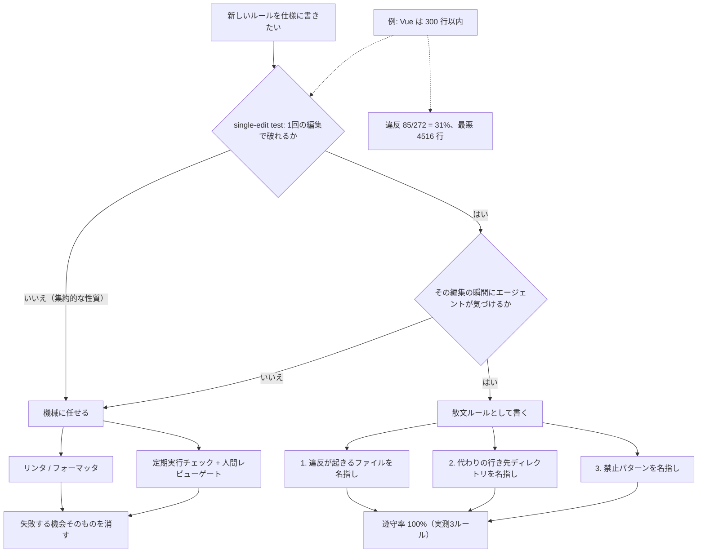
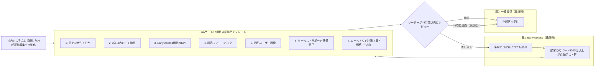
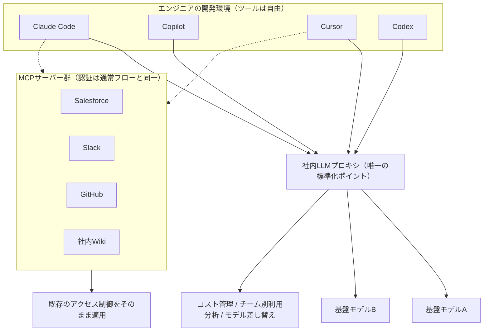
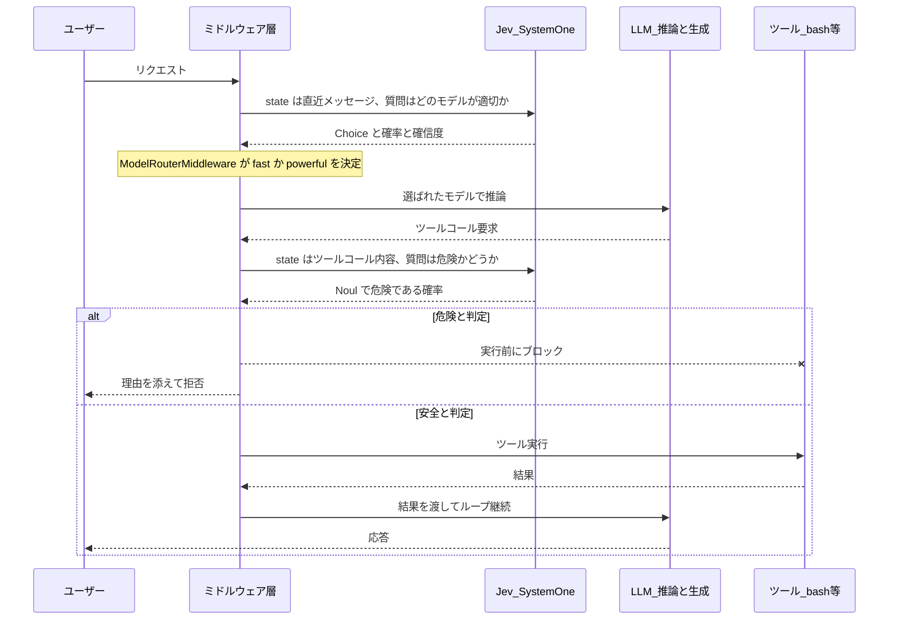
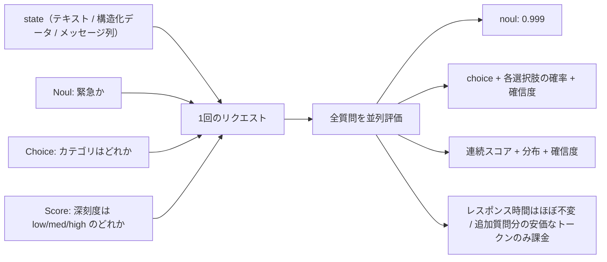

# Daily Briefing 2026-09-23

## 1. スペック駆動開発：エージェントが無視したルール（原題: Spec Driven Development: What Our Agents Ignored）

- **URL**: https://heym.run/blog/spec-driven-development
- **公開日**: 2026-08-21
- **著者・媒体**: Ceren Kaya Akgün / Heym Blog

### 本文翻訳

スペック駆動開発（SDD）は「書かれた仕様がコーディングエージェントの作るものを支配する」と約束する。筆者は自社プロダクト Heym の仕様ファイルを、それが実際に支配しているリポジトリに対して監査した。ファイルは 203 行。117 日間・1,133 コミットにわたり、Claude Code・Codex・OpenCode がセッション開始時のハード指示として読み込んできた。結果は明確に割れた。3 つのルールは完璧に守られ、1 つのルールは 272 ファイル中 85 ファイルで破られていた。違いはルールの長さでも、追加された時期でも、重要度でもなかった。**「1 回の編集でそのルールを破れるか」** だった。

Birgitta Böckeler は 2025 年 10 月に martinfowler.com で主要 SDD ツールを比較したあと、「実際のコードベースで一定期間使った人の利用報告を聞くまでは、これが現実にどう機能するのか疑問が多く残る」と率直に書いた。10 か月経ってもその要求は未回答のままだ。IBM は概念を説明し、Microsoft は意義を語り、GitHub はツールキットを出荷したが、「実際の仕様のうち実際のエージェントが実際の四半期で何割を守るのか」という数字は誰も公開していない。そこで筆者は読むのをやめて数えた。

**守られた 3 つのルール。** ①「`PropertiesPanel.vue` は薄いシェルのままにし、ノード設定 UI は `propertiesPanel/nodes/` 配下にノード種別ごとに 1 コンポーネントで置け。パネルに `selectedNode.type` の分岐を足すな」。2026-06-29 に追加され 53 日が経過。結果は `PropertiesPanel.vue` が **43 行**、`selectedNode.type` 分岐は **ゼロ**、指定ディレクトリには **59 コンポーネント**。②「アラート評価器は状態機械のみを持ち、各アラート種別は `services/alerts/types/` 配下の独立モジュール＋レジストリ登録にせよ」。追加からわずか 10 日。評価器は **351 行**で `alert_type ==` 分岐は **ゼロ**、型モジュールは 6 個。③「ワークフロー実行器はオーケストレーション・リトライ・トレース・キャンセルを保持し、ノード固有の実行ロジックはノード種別ごとのハンドラモジュールへ」。ハンドラは **62 モジュール**。実行器に残る 7 個のノード種別比較は全件確認したところ条件分岐のスキップ、エラーハンドラのルーティング、出力ノードのショートサーキットで、いずれも同じルールが実行器の仕事と定めるオーケストレーションだった。**この 3 つはリンタもテストも一切支えていない。プロンプトの文面だけで 100% を維持した。**

**死んだルール。** TypeScript 規約の箇条書きに埋もれた一文 ——「Vue: Composition API with `<script setup>`, file names: PascalCase, max 300 lines」。これは 2026-04-27 の最初のコミットから存在し、17 回の改訂すべてに含まれていた。にもかかわらず **272 ファイル中 85 ファイル（31%）が 300 行を超過**。最大は `DebugPanel.vue` の **4,516 行**（上限の 15 倍超）、次いで `CredentialDialog.vue` 3,820 行、`ExpressionInput.vue` 3,143 行。過去の遺物でもない。6/21 以降に新規作成された 131 ファイルのうち **26 ファイルはコミットしたその日すでに 300 行超**だった。ESLint の `max-lines` 設定は存在しない。

**決定的な対照実験。** 守られたルール①が作らせた `propertiesPanel/nodes/` の 59 コンポーネントのうち、**18 個が 300 行ルールに違反**している。最大の `GithubNodeProperties.vue` は **1,116 行**（中央値は 165 行なので、怪物だらけのフォルダではない）。同じリポジトリ、同じ仕様ファイル、同じエージェント、同じセッション、時には同じコミットの中で、片方の指示どおりの構造を作り、その中身をもう片方の指示に違反させている。つまり「ファイルを読んでいない」でも「文脈が足りない」でも説明できない。**変数はルールの側にある。**

**長さは変数ではない。** 「指示ファイルが 150 行を超えるとエージェントは大半を無視する」という説が広く流布している。しかし筆者のファイルは 203 行で、134 行から 51% 成長する間も精密なルールは守られ続けた。アラートのルールはファイルが既に 175 行の時点で追加され 100% を維持している。逆に失敗したルールはファイルが 134 行で競合がほとんどなかった頃から最上部付近にある。「仕様のドリフトを段落削除で直そうとするチームは、間違った変数を最適化している」。

**生き残るルールの形。** 守られたルールは例外なく、(a) 違反が起きる **ファイル**を名指しし、(b) 代わりにコードを置く **行き先**を名指しし、(c) 禁止された **パターン**を名指ししていた。いずれもエージェントがそのファイルを編集しているまさにその瞬間に、画面上の情報だけで判定できる。失敗したルールは「完成した成果物の性質」を述べている。290 行のコンポーネントに妥当な 15 行を足す——その編集のどの時点でも悪いことはしていない。ファイルは 305 行になった。誰もルールを破っていない。ルールは破れている。筆者はこれを **single-edit test（単一編集テスト）** と呼び、新しいルールを採用する唯一の審査質問にした：**「1 回の編集でこのルールを破れるか。そしてその編集の最中にエージェントはそれと分かるか」**。両方 Yes なら散文で書いてよい。それ以外は機械が要る。

「ドリフト」という語は意図がゆっくり摩耗する様を連想させるが、実態はもっと具体的だ。**ドリフトとは、失敗の瞬間を持たないルールが起こすことである。**エージェントが忘れたのではない。「間違ったことをしていて、それと分かり得た瞬間」が初めから存在しなかったのだ。

**Python 側は逆の証明になる。** 仕様は行長 100 桁と定めており、`ruff format --check .` は 623 ファイル全件フォーマット済みと報告し `ruff check .` もクリーンに通る。グローバルな性質に対する完全遵守だ。ただし達成のされ方を見よ。長い行を実際に警告する `E501` は ignore リストに入っている。誰も長い行を書いたと告げられない。フォーマッタが通りすがりに書き換えているだけだ。**これは遵守ではなく「失敗する機会の不在」であり、この種のルールにはそれが正解である。**ルールに瞬間を与えられないなら、機械を与えよ。そして文章が仕事をしているふりをやめよ。

**死んだルールの書き換え。** 300 行という目標自体は良いので維持するが、仕様ルールであることをやめる。新しい文面は「コンポーネントが 300 行を超えたら、追記する前に次のセクションを同フォルダの兄弟コンポーネントへ抽出せよ。PropertiesPanel のノードコンポーネントを 300 行超に育てるな。操作固有のフォームを別コンポーネントへ切り出して import せよ」。加えて ESLint の `max-lines` 警告を入れる。**文章が編集の瞬間を担当し、ツールがファイル全体を担当する。**

**監査から出た 6 つのベストプラクティス**（すべて実際に適用した変更）：①1 回の編集で破れるルールを書く、②ファイルを名指しする、③代わりにどこへ置くかを言う、④集約的なルールにはツールを与える、⑤書き換える前に測る（筆者は全体で 80% 程度だろうと推測していたが、実際は形状によって 100% と 69% に割れていた）、⑥強制しないルールは削除する（違反率 31% のルールは「この文書は助言にすぎない」と全読者に教えてしまい、その教訓は大事なルールにも伝染する）。加えて予想外の発見として、**直近に書いたルールほど精密だった**——8 月までに「ルールがどう見えるべきか」を学んだからだ。最も古いルールが最も曖昧である。指示ファイルを引き継いだなら**古い順に監査せよ**。これはエージェントスキル（別名の指示ファイル）にもそのまま当てはまる。

**SDD と vibe coding の対比についても、監査は双方に不都合な示唆を与える。**仕様を書くのは簡単な方の半分であり、しかも進捗している感触が得られる半分だ。ファイルは 4 か月で 51% 成長し、追加のたびにガバナンスをしている気がした。だがその間ずっと、あるルールの表面積の 31% は静かに失敗し続け、誰も気づかなかった。**守られていない文書は、守られている文書とまったく同じように読めるからだ。**vibe coding は少なくとも「何も強制していない」と正直に告げる。強制されない仕様は逆のことを告げながら同じだけの仕事しかしない。SDD の本当の弱点は手法の脆さではなく、**それが生む自信の脆さ**であり、測定なき自信こそ最もコストの高い失敗モードである。

**集約ルールに瞬間を人工的に作る方法**として、筆者はスケジュール実行のチェックワークフローを公開している。ファイル一覧を保持するステップ、ネットワークを遮断したサンドボックスで 1 ルールを適用する Python ステップ、条件分岐、そして人間レビューゲートを経てから報告を起票する。テンプレートの Python は公開前に実行済みで、実インベントリ 272 ファイルに対して 85 件・31.2% の違反、最悪は `DebugPanel.vue` の 4,516 行を返した——本記事のすべての数字はここから出ている。

### 重要ポイント

- 203 行の `AGENTS.md`・1,133 コミット・117 日という**実測**で、ルール遵守率が「ファイル＋行き先＋禁止パターンを名指しする形」で 100%、「集約的な性質を述べる形」で 69% に割れた
- 決定的なのは対照実験：守られたルールが作った 59 コンポーネントのうち 18 個が、同じ文書の別ルールに違反している。**読んでいない／文脈不足では説明できない**
- 「指示ファイルは 150 行を超えると無視される」という通説は、この実測（203 行・51% 成長しつつ精密ルールは 100% 維持）では成立しなかった
- 採用基準は single-edit test：**1 回の編集で破れ、その瞬間にエージェントが気づけるか**。No なら文章ではなくリンタ／フォーマッタ／定期チェックに移す
- 違反率 31% のルールを放置することは「この文書は助言にすぎない」と教えることであり、守られているルールにも伝染する。強制しないなら削除せよ

### 図解



### 現場での適用方法

**(1) まず自分のリポジトリを測る。** 記事と同じく 4 コマンドで足りる。`<REPO_PATH>` と対象拡張子を置き換えて実行する。

```bash
#!/usr/bin/env bash
# scripts/spec-audit.sh — 仕様ルールの実遵守率を測る
set -euo pipefail
REPO="${1:-<REPO_PATH>}"
SPEC="$REPO/AGENTS.md"
LIMIT="${2:-300}"

cd "$REPO"
echo "## 仕様ファイル"
wc -l "$SPEC"

echo "## 集約ルール（行数上限）の遵守率"
total=$(find src -name "*.vue" | wc -l)          # ← 対象は自分の言語に置換
over=$(find src -name "*.vue" -exec wc -l {} + \
       | awk -v l="$LIMIT" '$2!="total" && $1>l' | wc -l)
echo "checked=$total violations=$over percent=$(awk "BEGIN{printf \"%.1f\", 100*$over/$total}")%"

echo "## 違反ワースト5"
find src -name "*.vue" -exec wc -l {} + \
  | awk -v l="$LIMIT" '$2!="total" && $1>l' | sort -rn | head -5

echo "## 名指し型ルールの遵守率（禁止パターンの出現数が0なら遵守）"
grep -c "selectedNode.type" src/components/Panels/PropertiesPanel.vue || true

echo "## ルールが仕様に入った日（古い順に監査するため）"
git log --follow --format='%ad %h' --date=short -- "$SPEC" | tail -5
```

**(2) CLAUDE.md / AGENTS.md への追記例。** 「ファイル＋行き先＋禁止パターン」の三点セットで書き直す。

```markdown
## アーキテクチャ境界（単一編集テストを通過したルールのみ）

### ルールの書き方の約束
このセクションには「1回の編集で破れ、その瞬間に判定できる」ルールだけを置く。
「〜は N 行以内」「重複を減らす」のような集約的な制約はここに書かない。
それらは `.eslintrc` / CI / 定期チェックが担当する（下記「機械が見るルール」参照）。

### src/components/Panels/PropertiesPanel.vue
- **禁止**: `selectedNode.type` による分岐をこのファイルに追加すること
- **行き先**: ノード種別ごとの設定 UI は `src/components/Panels/propertiesPanel/nodes/<NodeName>Properties.vue` に 1 種別 1 コンポーネントで置く
- このファイルは薄いシェルのまま保つ（目安 50 行未満）

### src/services/alerts/evaluator.ts
- **禁止**: `alertType === ...` の比較をこのファイルに追加すること
- **行き先**: `src/services/alerts/types/<type>.ts` に新規モジュールを作り、
  `src/services/alerts/registry.ts` に 1 行登録する

### 300 行を超えそうなとき（編集の瞬間に効く言い換え）
- コンポーネントが 300 行を超えたら、**追記する前に**次のセクションを同フォルダの
  兄弟コンポーネントへ抽出し、import で組み立て直す。超えた状態に行を足さない。

## 機械が見るルール（ここに書くだけでは効かないので必ず設定も入れる）
- ファイル行数上限 → ESLint `max-lines`（警告）
- 行長・フォーマット → Prettier / ruff format（自動書き換え）
- 週次の集約チェック → `scripts/spec-audit.sh` を CI の cron ジョブで実行
```

**(3) 集約ルールを ESLint に落とす。**

```javascript
// eslint.config.js — 「文章では守れないルール」を機械に移す
export default [
  {
    files: ["src/**/*.vue", "src/**/*.ts"],
    rules: {
      // 警告に留めるのは、既存 85 件を一気に赤くしても誰も直さないため。
      // 新規ファイルの流入を止めるのが目的。
      "max-lines": ["warn", { max: 300, skipBlankLines: true, skipComments: true }],
    },
  },
];
```

**(4) 定期チェックを GitHub Actions で「瞬間」にする。** 結果を人間の Issue に流し、自動修正はしない。

```yaml
# .github/workflows/spec-audit.yml
name: spec-audit
on:
  schedule:
    - cron: "0 0 * * 1"   # 毎週月曜 09:00 JST
  workflow_dispatch:
jobs:
  audit:
    runs-on: ubuntu-latest
    permissions:
      contents: read
      issues: write
    steps:
      - uses: actions/checkout@v4
        with: { fetch-depth: 0 }
      - name: Run spec audit
        id: audit
        run: |
          bash scripts/spec-audit.sh "$GITHUB_WORKSPACE" 300 | tee audit.txt
          echo "violations=$(grep -oP 'violations=\K[0-9]+' audit.txt)" >> "$GITHUB_OUTPUT"
      - name: File a report for a human
        if: steps.audit.outputs.violations != '0'
        uses: actions/github-script@v7
        with:
          script: |
            const fs = require('fs');
            const body = '```\n' + fs.readFileSync('audit.txt', 'utf8') + '\n```';
            await github.rest.issues.create({
              owner: context.repo.owner,
              repo: context.repo.repo,
              title: `仕様ルール監査: 集約ルールに違反あり (${new Date().toISOString().slice(0,10)})`,
              body,
            });
```

**(5) 運用手順（既存の指示ファイルを引き継いだ場合）。**

```bash
# 1. ルールが入った時期を古い順に並べる（古いルールほど曖昧という経験則）
git log --follow --reverse --format='%ad %h %s' --date=short -- AGENTS.md

# 2. 各改訂で追加されたルール文を抽出し、single-edit test にかける
git log --follow -p --date=short -- AGENTS.md | grep -E '^\+' | grep -v '^\+\+\+'

# 3. テストに落ちたルールは「削除」か「機械へ移管」の二択。書き直しで延命しない
```

### 期待効果

- ルールの形を変えるだけで、リンタもテストも増やさずに遵守率 100% が維持できる（記事の実測：名指し型 3 ルールが 53 日／10 日／全期間にわたり違反ゼロ、ツールによる強制は一切なし）
- 逆に集約型ルールは形をいくら整えても 69% 止まり。ESLint / フォーマッタへ移管すれば `ruff format` の 623 ファイル全件遵守のように 100% に到達する
- 「なんとなく 80% くらい守られているはず」という推測が、実測では形状ごとに 100% と 69% に割れていた。**監査コスト 4 コマンドで、書き換えるべき対象を正しく特定できる**
- 新規ファイルの 5 分の 1（131 件中 26 件）が生まれた日から違反という流入を、`max-lines` の警告と週次チェックで止められる

### 注意点

- 記事のサンプルは 1 リポジトリ・4 ルール・3 エージェント（Claude Code / Codex / OpenCode）であり、統計的な一般化ではない。**自分のリポジトリで同じ 4 コマンドを回して確かめること**が記事自身の主張である
- 「150 行の崖」を否定しているのは 203 行のファイルにおいてであり、「どんな長さでも劣化しない」とは主張していない。長大な指示ファイルの安全性を保証するものではない
- 既存の違反 85 件をいきなり `error` にすると CI が常時赤くなり、誰も直さなくなる。まず `warn` で新規流入を止め、既存は別途計画的に返済する
- 定期チェックのエージェントステップには**人間レビューゲートを必ず挟む**（記事のテンプレートでも `hitlEnabled: true`、コード実行ステップはネットワーク遮断）。自動修正 PR を無人で投げると、今度は「違反を消すだけの変更」がレビュー負荷になる
- ルール削除の判断は慎重に。「強制しないなら削除」は正しいが、削除ではなく機械への移管が正解であるケースが大半

## 2. AI漬けのエンジニアリング組織の内側：本質を見失わずにスケールするための5つの教訓（原題: Inside AI-pilled engineering teams: Five lessons for scaling without losing the plot）

- **URL**: https://www.bvp.com/atlas/inside-ai-pilled-engineering-teams-five-lessons-for-scaling-without-losing-the-plot
- **公開日**: 2026-06-11
- **著者・媒体**: Atlas Editors / Bessemer Venture Partners（取材先: Ramp CPO Geoff Charles、Shopify VP & Head of Engineering Farhan Thawar、Bessemer Operating Advisor Jessica Popp）

### 本文翻訳

急成長していたエンジニアリング組織は今、まったく新しい力の下でスケールしている。コードの書かれ方を変える AI ツールと、エンジニアの仕事そのものを変えるエージェント型ワークフローだ。生産性の基準は変わり、チーム構造は変形し、エンジニアリングリーダーは 2 年前には存在しなかったソフトウェア開発モデルに対する運用プレイブックを求められている。

Bessemer の調査では、**技術・エンジニアリングチームの 90% が AI を業務の中核に展開**している。用途の上位はコード生成 92%、コードレビュー補強 79%、AI 機能の製品開発 75%、ドキュメント生成 69%、エージェント型開発 60%。一方で規模の拡大は新しい課題を生む。**コード品質の評価を最大の課題に挙げるリーダーが 52%**、生産性向上の測定 46%、トークンコスト管理 38%、セキュリティと IP の懸念 29%。

**教訓 1：リリースを 2 層にした瞬間、速度と品質はトレードオフでなくなる。** Ramp の Geoff Charles のチームは主要機能を毎日出荷している。リーダーが全容を把握し続けるのはほぼ不可能だが、速度を落とす代わりに彼は速度と品質管理を両立するリリースプロセスを設計した。仕組みはこうだ。チームは準備ができ次第いつでも **early access 層**へ出荷してよい。顧客の約 10% が early access を選択しており、**5,000 社以上のテストグループ**が自動的に出来上がっている。early access から一般提供（GA）へ進むには、テンプレート化されたチェックリストに沿って証拠を示さねばならない——①何を作り、なぜ作ったか、②3 分以内の Loom デモ、③early access 期間の KPI 概況、④顧客フィードバック、⑤初回ユーザー体験の導線、⑥セールスとサポートの準備完了、⑦ローンチ層・価格・コミュニケーション計画を含むロールアウト計画。このプロセスの多くは Ramp の社内システムに接続した AI で自動化されており、**リーダーは 48 時間以内にレビューする、さもなくば機能はそのまま出荷される**。決定を分割した瞬間にボトルネックは消える。

**教訓 2：標準化するのはツールではなくインフラ層。** Shopify は異例のアプローチを取った。単一の AI ツールに標準化するのではなく、**すべてのツールの下にあるインフラ層を標準化**したのだ。Farhan Thawar のチームは社内 LLM プロキシを構築した。Claude Code、Copilot、Cursor、Codex、その他どのツールからの AI リクエストも、基盤モデルに届く前に単一のゲートウェイを通る。このアーキテクチャにより、リーダーシップは中央集権的なコスト管理、チーム・プロジェクト単位の利用分析、そしてエンジニアを単一のワークフローに押し込めることなくモデルを切り替える能力を得た。「Shopify では常に 1 つの仕事に 1 つのツールだ。AI を除いては」と Farhan は言う。「どの企業、どのワークフロー、どのモデルが勝つのか、まだ分からないからだ」。これほど速く進化する領域では、**インフラの標準化こそがカオスなきツール実験を可能にする一手**である。

同じ原理が社内システムとの接続も支配した。MCP サーバー経由で、エンジニアは Salesforce、Slack、GitHub、社内 Wiki を AI アシスタント越しに照会できる。**アクセス制御は通常の認証フローと同一**だ。AI はエンジニアが既に使っているシステムと対話できるので有用になり、アクセスを統治するのは個々のエンジニアではなくインフラなので、リーダーの負担は管理可能なまま保たれる。

ツール以上に意図的だったのがチーム規範だ。Farhan は AI 利用を義務化しなかった。**自ら手本を示した**。AI で仕上げた仕事の実例を共有し、それを「頭の良さの証明」ではなく「レバレッジの実演」として提示した。「『これだけの仕事をした、自分は賢いだろう』とは言わなかった。『見てくれ、自分はこんなに怠けている』と言ったんだ」（半分冗談）。AI を技術力の証明ではなくレバレッジとして枠づけたこの姿勢が、非エンジニア部門にまで予想外の普及を生んだ。営業がカスタムダッシュボードを作り、財務がエンジニアリングを待たずに業務ツールを作り、人事が自分たちのプロセス用に「n=1 のソフトウェア」を生成するようになった。結果はエンジニアリング組織全体の生産性向上、プロトタイピングの高速化、非エンジニアからの成果物の高精細化、そして AI が特殊なものではなく既定のツールとして文化に埋め込まれたことだった。

**教訓 3：エージェント型開発はリーダーシップの計算式を変える。** コード生成で個々の作業が加速する一方、既に本番ではエージェント型ワークフローが新常態になりつつある。複数の AI システムがコードベースの異なる部分を同時並行で扱い、エンジニアは個人コントリビューターではなくオーケストレーターとして振る舞う。「2026 年の動きはエージェンティック・ハーネスだ」と Farhan は言う。Shopify のシニアエンジニア層では既にこのパターンが現れている——複数エージェントがコードベースの別々の部分で並行して走り、エンジニアは出力をレビューし、駄目なものを捨て、通るものをマージする。もう一つのパターンは**単一モデルが 45 分以上の深い推論サイクルを回し、自ら生成・評価・改良を繰り返す逐次的批評ループ**だ。どちらも同じ根本的シフトを表している：**エンジニアリングリーダーシップは「コードを書く人を管理する」から「コードを書く AI をオーケストレーションするシステムを管理する」へ移る**。必要なスキルもインフラも、そして失敗モードも異なる。「2026 年にエージェントをハーネスする方法を見つけられなければ、後れを取る」。Shopify は既に、AI エージェントが巨大コードベース内で安全に動きつつ最終判断はエンジニアが握るためのインフラに投資している。本番コードへの人間レビュー要件は（今のところ）残る。

**教訓 4：チームの変曲点がスケールを規定する。** Jessica Popp は段階別のフレームワークを示す。**シード〜10 人**：必要なのは「出荷する人」ただ一つ。「MVP を世に出し、PMF を探しながら適応・修正する。そのためにはコードに手を突っ込むリーダーが要る」。戦略的アーキテクチャ感覚はボーナスであって要件ではない。**10〜20 人**：最初の本当のマネジメント層が必要になり、最も重大かつ最も軽視されがちな決定が下される時期。データストア選定、DevOps モデル、テスト基盤、品質チーム構造といった**一方通行のドア**が現れ始める。「チームの日常業務に影響するものは何であれ、エンジニアリング組織文化の中核になり得る。そうなったら方向転換は極めて困難だ」。だから**これらの決定を下す人は、過去に下した経験がある人でなければならない**。**20〜50 人**：リーダーシップのミスマッチが誰の目にも明らかになる頃には、既に文化的損傷・アーキテクチャ負債・リテンション問題が生じている。鍵となる判断は「リーダーを替えるか」ではなく「組織が実際に必要としているのはどの種類のリーダーシップか」の診断だ。課題が人に関わるなら、スケールを経験した人を。課題がプロダクトやアーキテクチャなら、創業 CTO が依然として正解であることが多い。打ち手は構造の明確化——CTO と VP/SVP of Engineering の役割関係を**事前に、透明に**定義すること。

**教訓 5：comprehension debt（理解負債）という隠れた危険。** AI ネイティブなスタートアップが報告する速度での生産性向上は、標準的な指標に現れない新しいリーダー責務を生む。「脳は筋肉だ。ジムに行くのをやめれば、脳を使うのをやめれば、萎縮する」と Farhan は言う。AI がより速く大量のコードを生成するにつれ、エンジニアは自分が作り保守するシステムの理解を徐々に失いうる。**理解負債とは、素早く出荷できるが何が壊れたのか診断できない、あるいは AI 抜きでシステム挙動を推論できないエンジニアの蓄積**である。Farhan のガードレールは具体的だ：**エンジニアは自分が実際に作業している層の 2〜3 層下まで理解していなければならない**。AI 生成コードの品質が低いからではない——Shopify では AI 支援コードの巻き戻し率は AI 以前のベースラインと同等だった。**巻き戻し率では理解負債は表面化しない。週次デモが表面化させる**。デモは「速く作っているか」ではなく「何を作っているのか理解しているか」を露わにするからだ。「思考を明け渡してはならない。明け渡すべきは雑務だ」。

### 重要ポイント

- **2 層リリース**（early access → 証拠ベースの GA ゲート）で速度と品質のトレードオフを解消。Ramp は顧客の 10%・5,000 社以上を常設テスト群として持ち、GA ゲートは 7 項目のテンプレート、レビュー SLA は 48 時間（超過したら自動で出荷）
- **ツールではなくインフラを標準化**。Shopify は全 AI リクエストを社内 LLM プロキシに集約し、コスト管理・チーム別利用分析・モデル差し替えを得ながらツール選択の自由を残した。社内システム接続は MCP 経由で既存の認証・アクセス制御をそのまま使う
- AI 利用は**義務化せず手本で広げる**。「賢さの証明」ではなく「レバレッジ（＝怠けられること）の実演」として共有したことで、営業・財務・人事にまで波及した
- エージェント型開発でリーダーの仕事は「人の管理」から「AI をオーケストレーションするシステムの管理」へ移る。並行エージェント型と 45 分超の逐次批評ループ型の 2 パターンが現れている
- **理解負債**は巻き戻し率には出ない。ガードレールは「作業層の 2〜3 層下まで理解していること」、検知手段は**週次デモ**

### 図解





### 現場での適用方法

**(1) GA ゲートを PR テンプレート化する。** Ramp の 7 項目をそのまま `.github/PULL_REQUEST_TEMPLATE/ga_promotion.md` に落とす。

```markdown
<!-- .github/PULL_REQUEST_TEMPLATE/ga_promotion.md -->
# Early Access → 一般提供（GA）昇格リクエスト

**機能フラグ名**: `<FLAG_NAME>`
**Early Access 開始日**: <YYYY-MM-DD>
**レビュー SLA**: このPRは作成から **48時間** でレビューされない場合、自動で GA へ昇格します。

## 1. 何を作り、なぜ作ったか
<!-- 3文以内。解決した顧客課題を明記 -->

## 2. デモ（3分以内）
<!-- 動画URL。3分を超える場合は分割せず、スコープが大きすぎないか再検討 -->

## 3. Early Access 期間の KPI
| 指標 | Early Access | ベースライン | 差分 |
|------|-------------|------------|------|
| 有効化率 | | | |
| 主要アクション完了率 | | | |
| エラー率 | | | |
| p95 レイテンシ | | | |

## 4. 顧客フィードバック
<!-- 定性コメント3件以上。否定的なものを必ず1件含める -->

## 5. 初回ユーザーの導線
<!-- 未知のユーザーが最初の価値に到達するまでのステップ -->

## 6. セールス・サポート準備
- [ ] サポート向けFAQを更新した
- [ ] セールス向け説明資料を更新した
- [ ] 想定される問い合わせと一次回答を記載した

## 7. ロールアウト計画
- 対象プラン/層: 
- 価格への影響: 
- 告知計画（社内/社外）: 
- ロールバック手順: 
```

**(2) 証拠収集を AI に任せる部分をスキル化する。** Claude Code のスキルとして `SKILL.md` を置き、KPI とフィードバックの収集を自動化する。

```markdown
---
name: ga-evidence
description: Early Access 機能を一般提供へ昇格させるための証拠一式（KPI表・顧客フィードバック要約・初回ユーザー導線・サポート準備状況）を社内システムから収集し、GA昇格PRの本文を生成する。機能フラグ名を与えられたときに使う。
---

# GA 昇格の証拠収集

## 手順
1. 機能フラグ名 `<FLAG_NAME>` を確認する。与えられていなければ質問して止まる。
2. 分析基盤に問い合わせ、Early Access 群と全体ベースラインで以下を取得する:
   有効化率 / 主要アクション完了率 / エラー率 / p95 レイテンシ。
   期間は Early Access 開始日から本日まで。
3. サポートシステムから当該フラグに言及したチケットを取得し、
   肯定・否定・中立に分類する。**否定的なものを必ず1件以上引用する**。
4. `.github/PULL_REQUEST_TEMPLATE/ga_promotion.md` の 3・4・5 節を埋めた
   Markdown を出力する。

## 禁止事項
- 数値を推測で埋めない。取得できなかった指標は「取得失敗（理由）」と書く。
- 1・2・6・7 節は人間が書く。ここを勝手に埋めない。
- PR の作成・マージはしない。本文の生成までで止まる。
```

**(3) LLM プロキシを 1 ファイルから始める。** 全ツールの向き先を揃えるだけでコスト可視化が手に入る。

```bash
# 開発者が実行する1行（環境変数で全ツールの向き先を揃える）
# ~/.zshrc など
export ANTHROPIC_BASE_URL="https://llm-proxy.<YOUR_DOMAIN>/anthropic"
export OPENAI_BASE_URL="https://llm-proxy.<YOUR_DOMAIN>/openai"
export LLM_PROXY_TEAM="<YOUR_TEAM_NAME>"     # 利用分析のキー
export LLM_PROXY_PROJECT="<YOUR_PROJECT>"
```

```yaml
# llm-proxy/config.yaml — LiteLLM などのゲートウェイ設定例
model_list:
  - model_name: claude-opus-5
    litellm_params:
      model: anthropic/claude-opus-5
      api_key: os.environ/ANTHROPIC_API_KEY
  - model_name: fast-tier
    litellm_params:
      model: anthropic/claude-haiku-4-5-20251001
      api_key: os.environ/ANTHROPIC_API_KEY

general_settings:
  master_key: os.environ/PROXY_MASTER_KEY
  database_url: os.environ/PROXY_DB_URL

litellm_settings:
  # チーム・プロジェクト別に予算を切る（コスト管理の最小単位）
  callbacks: ["otel"]
  success_callback: ["langfuse"]
  max_budget: 5000            # USD / 月・全体
  budget_duration: 30d

router_settings:
  # モデルの差し替えはここだけを変えれば全ツールに反映される
  fallbacks:
    - claude-opus-5: ["fast-tier"]
```

**(4) 理解負債の検知を運用手順に組み込む。** 指標ではなく週次デモで見る。

```markdown
## 週次デモの運用（理解負債の検知が目的）

**時間**: 30分 / チーム。**発表**: 1人5分。**資料禁止**（動くものだけ）。

**司会が必ず聞く3問**（答えられないこと自体は責めない。負債の計測が目的）
1. この変更が壊れたとき、最初に見るログ/メトリクスはどれですか
2. この処理は1つ下の層で何を呼んでいますか。さらにその下は何ですか
3. この設計の代わりに検討して捨てた案は何で、なぜ捨てましたか

**記録**: 3問すべてに答えられた発表の割合を週次で記録する。
巻き戻し率・レビュー時間とは別指標として扱う（巻き戻し率には現れないため）。

**閾値の目安**: 割合が2週続けて下がったら、その週はエージェント並走本数を減らし、
既存コードの読み合わせ・設計レビューに時間を割り当てる。
```

### 期待効果

- リリース判断を「速度側（early access）」と「品質側（GA ゲート）」に分割することで、主要機能の**毎日出荷**とリーダーによる品質基準の維持が両立する（Ramp の実例）。48 時間 SLA により、レビュー待ちがボトルネックに戻ることも防げる
- LLM プロキシにより、コード生成 92%・レビュー補強 79% という高い利用率の下でも、リーダーの課題上位に挙がる**トークンコスト管理（38% が課題と回答）**と**生産性測定（46%）**にデータで答えられる
- ツール標準化を避けることで、「どのモデル・どのワークフローが勝つか分からない」状況下でも実験を続けられ、モデル差し替えのスイッチングコストがゲートウェイ設定 1 箇所に収まる
- AI を「レバレッジの実演」として広めたことで、エンジニアリング組織にとどまらず営業・財務・人事へ波及した（非エンジニアからの成果物の精細化、プロトタイピング高速化）
- 週次デモという既存の場を再利用するだけで、巻き戻し率には現れない理解負債を検知できる

### 注意点

- Ramp の 2 層リリースは**顧客の 10% が opt-in する early access の母集団（5,000 社以上）**があって初めて機能する。B2B で顧客数が少ない、あるいは opt-in 文化がない場合は、社内ドッグフーディングや地域限定ロールアウトで母集団を作るところから始める必要がある
- 「48 時間でレビューされなければ出荷」はレビュー負荷をリーダー側に強制する設計であり、リーダーが実際に時間を確保できなければ**無審査の自動出荷**に堕する。導入するならレビュー時間をカレンダーで先に確保すること
- LLM プロキシは単一障害点になる。フォールバック設定とプロキシ自体の可用性監視は必須。また全プロンプトが 1 箇所を通るため、ログ保持ポリシーと機微情報のマスキングを先に決める
- MCP 経由の社内システム接続は「通常の認証フローと同じアクセス制御」が前提。エージェント用に広い権限のサービスアカウントを作ると、この前提が崩れる
- 「作業層の 2〜3 層下まで理解する」は測定が難しく、週次デモも司会の質問力に依存する。指標化して評価に結びつけると、デモ向けの準備だけが最適化される恐れがある
- 記事の数値（90% が AI 展開、52% が品質評価を課題視など）は Bessemer の調査であり、対象は同社のポートフォリオ企業に偏っている可能性がある

## 3. Jev でハーネスを組む（原題: Building a Harness with Jev）

- **URL**: https://www.langchain.com/blog/building-a-harness-with-jev
- **公開日**: 2026-09-17
- **著者・媒体**: Sydney Runkle, Hunter Lovell / LangChain Blog

### 本文翻訳

エージェントはループで動く。LLM が何をするか決め、ツールが実行し、モデルが結果を評価し、タスクが完了するまでそれを繰り返す。エージェントと LLM は当初、構造化データと予測可能なインターフェースに依存するソフトウェアアプリケーションへ組み込むのが難しかった。それを大きく容易にしたのが 2 つのプリミティブだ——**ツールコール**（モデルが構造化されたリクエストを出し、構造化された結果を受け取る）と**構造化出力**（モデルが再構造化された結果を返す）。

しかしそれらを備えてなお、エージェントループは**遅く、そして高い**。あらゆる判断がもう 1 回のモデル呼び出しを要求するからだ。

そこに Jev が登場する。Jev は TypeSafe AI からリリースされた新しいモデルで、同社は分類タスクにおいて同等の LLM と比べ**最大 200 倍高速な推論と 400 倍低いコスト**を報告している。

**Jev とは何か。** Jev は伝統的な LLM ではない。テキストを生成しない。TypeSafe AI チームが **System One モデル**と呼ぶものだ。System One モデルとは、**ソフトウェアが直接使える高速で構造化された判断を下すために作られた AI モデルのクラス**であり、**state（状態）**を評価して型付きの答えと確率を返す。訓練には **RLCD（reinforcement learning for calibrated decisions／較正された判断のための強化学習）**が使われている。あなたのコードはその結果を使ってエージェントの次の行動を導く。判断のたびにフルのチャット LLM 呼び出しをする必要はない。

Jev を呼び出すには、**state（文脈）**とその state に関する **questions（質問）**を送る。公式ドキュメントのサポートチケット例を 1 問に絞るとこうなる。

```json
{
  "model": "jev-latest",
  "state": "Hi, I've been trying to connect my Stripe account for 3 days and it keeps failing. I'm losing sales. Please help ASAP.",
  "questions": {
    "is_urgent": {
      "type": "noul",
      "instructions": "The message conveys urgency or time-sensitivity"
    }
  }
}
```

返る答えは `{"is_urgent": {"type": "noul", "noul": 0.999}}`。**そのメッセージが緊急である確率 99.9%** であり、アプリケーションはこれを使ってチケットの優先度を決められる。

サポートされる question の型は 3 つある。**Choice**：選択肢の集合から 1 つ選ぶ。各選択肢の確率と全体の確信度スコアを返す。**Score**：low / medium / high のような順序付きレベルに対して入力を評価する。連続値のスコア、背後の分布、確信度を返す。**Noul**：yes/no の質問に答える。その言明が真である確率を返す。

ここで鍵となる特徴が、**同一の state に対して複数の質問を 1 リクエストで投げられる**ことだ。System One モデルは 1 リクエスト内のすべての質問を**並列に評価する**。質問を追加してもレスポンス時間はほとんど変わらず、追加分の（安価な）トークンしかコストがかからない。要するに Jev は、伝統的な LLM と違い、テキスト生成にも逐次的な意思決定にも縛られていない。

**LangChain での使い方。** LangChain のプロバイダ非依存なモデル抽象は、数千の統合と並べて Jev を扱うのに適している。統合パッケージ `langchain-typesafe` は `TypeSafeClassifier` として Jev を公開する。state と questions を `.invoke()` に渡すと、チャット応答ではなく分類結果が返る。`langchain-typesafe` をインストールし `TYPESAFE_API_KEY` を設定して呼ぶ。

```python
from langchain_typesafe import Noul, TypeSafeClassifier

classifier = TypeSafeClassifier()
response = classifier.invoke({
    "state": (
        "The deploy failed twice and customers are seeing 500s. "
        "Can someone look now?"
    ),
    "questions": {
        "urgent": Noul(instructions="Does this need attention right now?"),
    },
})
urgency = response.nouls["urgent"].noul
```

**state はテキストでも、構造化データでも、LangChain のメッセージ列でもよい。**そのため、エージェントが既に持っている文脈を使って、ノードやミドルウェアのフックから Jev を呼ぶのが容易になる。カスタムミドルウェアやツールとして組み込める。

**ユースケース。** Jev は LLM の代替ではない。テキストを生成しない。しかし**今日 LLM にやらせている分類タスクを、同じレイテンシとコストなしに処理できる**。つまりエージェントを駆動するモデルへの有望な補完だ——開放的な推論と生成には LLM を、その途中にある高速で構造化された判断には Jev を使う。

**モデルルーティング。** 単純な検索と難しいデバッグタスクに同じモデルは要らない。モデルルーティング・ミドルウェアは Jev にリクエストを評価させ、あなたが定義した基準でモデルを選ばせる。単純なタスクには高速で安価なモデル、複雑なものにはより高性能なモデルを。

```python
from langchain.agents import create_agent
from langchain_typesafe.experimental.middleware import (
    ModelChoice,
    ModelRouterMiddleware,
)

router = ModelRouterMiddleware(
    choices={
        "fast": ModelChoice(
            model="openai:luna",
            criteria="Direct lookups, extraction, and localized changes.",
        ),
        "powerful": ModelChoice(
            model="openai:sol",
            criteria="Architecture and high-stakes decisions.",
        ),
    },
    instructions="Choose the least costly model that can complete the task.",
)
agent = create_agent("openai:gpt-5.6-luna", middleware=[router])
```

ルーターは直近のユーザーメッセージからモデルを選び、その実行を通して使い続ける。**確率と確信度はエージェントの state に残るので、後から参照できる。**

**Auto Mode。** エージェントは本質的に信用ならない。悪い指示を（自然にであれ、十分な動機を持った攻撃者からであれ）受け取り、我々が望まない行動を取るよう説得されうる。claude、codex、cursor といったコーディングハーネスは、**危険な行動を実行される前に分類する**仕組みを何らかの形で出荷しており、それが少しずつエージェントへの信頼を築いてきた。**これまでこの分類ステップは、ハーネスのクローズドソース部分に閉じ込められていた。**安価で高性能な分類器モデルが登場した今、同じパターンをあらゆるエージェントに展開できる。

```python
from langchain.agents import create_agent
from langchain_typesafe.experimental.middleware import (
    AutoModeMiddleware,
)

guardrail = AutoModeMiddleware(tools=["bash"])
agent = create_agent("openai:gpt-5.6-luna", middleware=[guardrail])
```

`AutoModeMiddleware` は Jev を使ってツールコールが取りうる危険な判断をチェックし、**ツールが実行される前に呼び出しをブロックする**。

既に登場している事例として、Browserbase の Kyle Jeong が 1 セントの端数のコストでブラウザ操作エージェントを動かし、Jarrod Watts がライブ取引エージェントを構築し、Ryan Vogel が大規模なメールトリアージを行っている。

### 重要ポイント

- Jev は **System One モデル**——テキストを生成せず、state に対する型付きの答えと確率を返す。エージェントループの「判断」部分から LLM 呼び出しを剥がすのが役割
- 質問型は **Choice / Score / Noul** の 3 種。**1 リクエストに複数の質問を入れると並列評価され、レスポンス時間はほぼ変わらず追加トークン分しか課金されない**——これが設計上の最大の利点
- TypeSafe AI 公称で分類タスクにおいて **最大 200 倍高速・400 倍低コスト**。判断ごとの LLM 呼び出しがボトルネックだったループを作り替えられる
- **モデルルーティング**：直近のユーザーメッセージを Jev で評価し、基準に沿って fast / powerful を選ぶ。確率と確信度はエージェント state に残る
- **Auto Mode**：これまで Claude Code などのハーネスのクローズド部分にあった「危険なツールコールの事前分類」を、ミドルウェアとして自前のエージェントに移植できる

### 図解





### 現場での適用方法

**(1) 既存の「LLM に分類させていた箇所」を 1 リクエストにまとめる。** 質問を足してもレイテンシがほぼ変わらない性質を最大限使う。

```python
# triage.py — CI 失敗の一次トリアージを1リクエストで済ませる
import os
from langchain_typesafe import Choice, Noul, Score, TypeSafeClassifier

classifier = TypeSafeClassifier()  # TYPESAFE_API_KEY を環境変数で設定

def triage_ci_failure(job_name: str, log_tail: str) -> dict:
    """CI 失敗ログを1回の Jev 呼び出しで多面的に判定する。
    質問を増やしてもレスポンス時間はほぼ変わらない。"""
    response = classifier.invoke({
        "state": {"job": job_name, "log": log_tail[-8000:]},  # state は構造化データでよい
        "questions": {
            "is_real_failure": Noul(
                instructions="このログは実際のコード不具合を示している"
                             "（インフラ障害・タイムアウト・ネットワーク断ではない）"
            ),
            "category": Choice(
                instructions="失敗の主因はどれか",
                options={
                    "test_assertion": "テストのアサーション失敗",
                    "build_error": "コンパイル・ビルドエラー",
                    "lint": "Lint / フォーマット違反",
                    "dependency": "依存解決・インストール失敗",
                    "infra": "ランナー・ネットワーク・タイムアウト",
                },
            ),
            "severity": Score(
                instructions="このPRをマージから遠ざける深刻度",
                levels=["low", "medium", "high"],
            ),
        },
    })
    return {
        "real": response.nouls["is_real_failure"].noul,
        "category": response.choices["category"].choice,
        "category_confidence": response.choices["category"].confidence,
        "severity": response.scores["severity"].score,
    }

if __name__ == "__main__":
    import json, sys
    print(json.dumps(triage_ci_failure(sys.argv[1], sys.stdin.read()), ensure_ascii=False))
```

**(2) 確信度でしきい値を切り、人間に渡す境界を明示する。**

```python
# gate.py — 確信度に応じて「自動 / 確認 / 人間」へ振り分ける
AUTO_THRESHOLD = 0.90      # これ以上なら自動処理
HUMAN_THRESHOLD = 0.50     # これ未満は必ず人間へ

def route(result: dict) -> str:
    c = result["category_confidence"]
    if c >= AUTO_THRESHOLD:
        return "auto"      # 自動で再実行 / 自動ラベル付け
    if c >= HUMAN_THRESHOLD:
        return "confirm"   # Slack で1クリック確認を求める
    return "human"         # 担当者にアサインして止める
```

**(3) 危険なツールコールの事前ブロックをミドルウェアとして入れる。**

```python
# agent.py — Auto Mode 相当のガードレールを自前エージェントに載せる
from langchain.agents import create_agent
from langchain_typesafe.experimental.middleware import (
    AutoModeMiddleware,
    ModelChoice,
    ModelRouterMiddleware,
)

router = ModelRouterMiddleware(
    choices={
        "fast": ModelChoice(
            model="<FAST_MODEL_ID>",
            criteria="単純な検索、抽出、局所的な変更。",
        ),
        "powerful": ModelChoice(
            model="<POWERFUL_MODEL_ID>",
            criteria="アーキテクチャ判断、影響範囲の大きい変更。",
        ),
    },
    instructions="タスクを完了できる最も安価なモデルを選べ。",
)
guardrail = AutoModeMiddleware(tools=["bash"])

agent = create_agent(
    "<DEFAULT_MODEL_ID>",
    middleware=[router, guardrail],   # ルーティング → ガードレールの順
)
```

**(4) 運用手順：既存エージェントへの段階的な導入。**

```bash
# 手順1: 依存を追加し、キーを設定する
pip install langchain-typesafe
export TYPESAFE_API_KEY="<YOUR_TYPESAFE_API_KEY>"

# 手順2: まず「影の判定」として流す（挙動は変えない）
#   既存の LLM 判定と Jev 判定を両方走らせ、不一致だけをログに残す
#   1〜2週間ためてから、しきい値（AUTO_THRESHOLD）を実データで決める

# 手順3: 一致率が十分なカテゴリから順に Jev 単独へ切り替える
#   切り替えたカテゴリのレイテンシとコストを before/after で記録する

# 手順4: ガードレール（AutoModeMiddleware）は最初 dry-run で入れる
#   ブロックせずに「ブロックしたはず」のログだけ出し、誤検知率を測ってから有効化する
```

### 期待効果

- 判断ごとのフル LLM 呼び出しを分類専用モデルに置き換えることで、TypeSafe AI 公称で**分類タスク最大 200 倍高速・400 倍低コスト**。エージェントループの「遅くて高い」原因そのものに効く
- **複数質問の並列評価**により、これまでコスト上あきらめていた多面的な判定（実障害かどうか・カテゴリ・深刻度を同時に）が 1 リクエストで賄える。質問の追加コストは安価なトークン分のみ
- モデルルーティングにより、単純タスクが高価なモデルに流れるのを防げる。確率と確信度がエージェント state に残るため、ルーティング判断自体を後から監査・チューニングできる
- これまで Claude Code / Codex / Cursor のクローズドな部分にあった「危険行動の事前分類」を、自前のエージェントに同等のパターンで導入できる
- 事例として、Browserbase はブラウザ操作エージェントを 1 セント未満の単価で運用している

### 注意点

- **Jev は LLM の代替ではない**。テキスト生成もコード生成もしない。開放的な推論・生成は引き続き LLM が担当し、Jev はその間の構造化判断に限る
- 200 倍・400 倍という数値は **TypeSafe AI 自身が報告している分類タスクでの値**であり、独立検証ではない。自分のタスク分布で before/after を測ること
- ガードレールを入れてもエージェントが本質的に信用ならない点は変わらない。記事自身が「エージェントは依然として本質的に信用ならない」と明言している。プロンプトインジェクション対策の**唯一の層にしてはならない**
- `AutoModeMiddleware` / `ModelRouterMiddleware` は `langchain_typesafe.experimental.middleware` 配下、すなわち **experimental** 名前空間にある。API は変わりうるので、本番導入時はバージョンを固定する
- 確率が返るからといって、しきい値を勘で決めない。影の判定期間を設けて実データから決めること。**RLCD で較正されている**とはいえ、較正はあなたのドメイン分布で再確認する価値がある
- ルーターは「直近のユーザーメッセージ」からモデルを選び、その実行を通して使い続ける。会話の途中で難易度が跳ね上がるワークフローでは、明示的に再ルーティングする設計が必要
