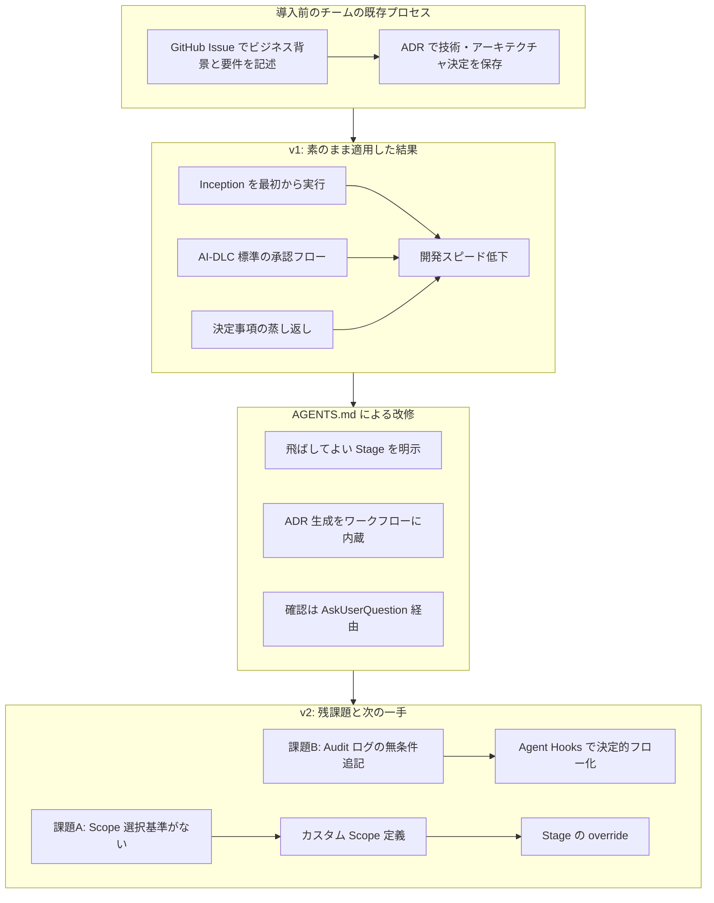
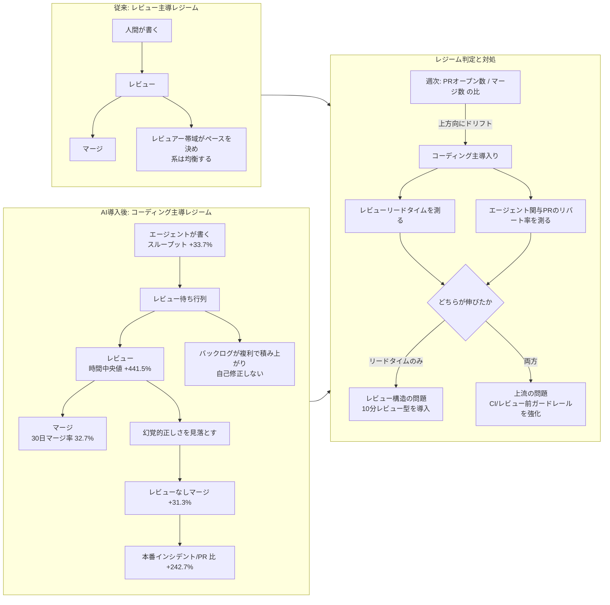
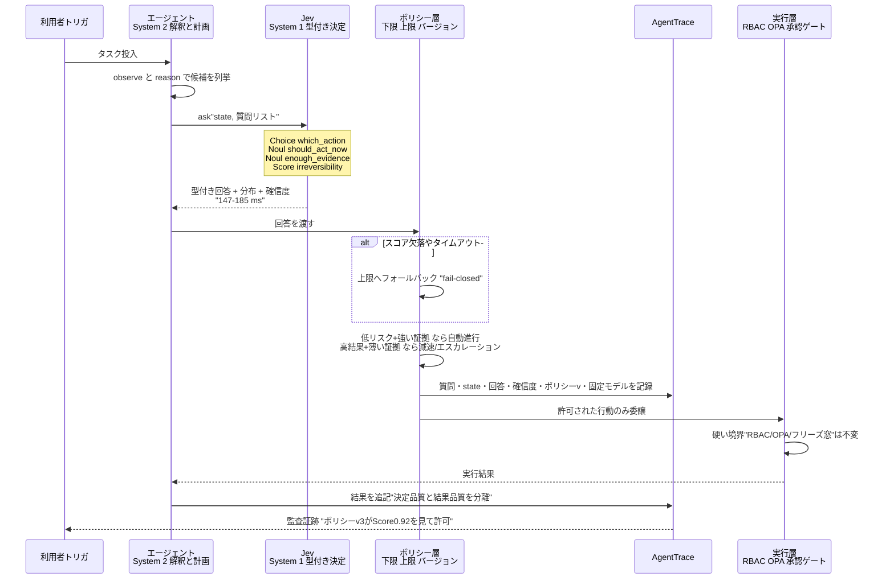

# Daily Briefing 2026-09-24

## 1. AI-DLC をチーム開発に適用しようとしている話（原題: AI-DLCをチーム開発に適用しようとしている話）

- **URL**: https://www.wantedly.com/companies/wantedly/post_articles/1089483
- **公開日**: 2026-09-01
- **著者・媒体**: 小室 光広 / Wantedly Engineer Blog

### 本文翻訳

ウォンテッドリーのバックエンドチーム（4〜5名）は、コーディングエージェントによる開発の出力を安定させる目的で、AWS 発の **AI-DLC Workflows**（AI-Driven Development Life Cycle のステアリングルール群）をチーム開発に適用する試みを始めた。本記事はその v1・v2 での実践記録である。

**導入前のチームの状態。** ウォンテッドリーでは機能開発の情報を GitHub Issues に一元管理していた。エンジニアが個々に PdM 的な役割を担い、ビジネス背景を Issue に書いてから実装に入る。加えて技術・アーキテクチャ上の意思決定は ADR（Architecture Decision Records）として保存する運用が既に回っていた。つまり「要件を構造化してから実装する」という習慣自体は AI-DLC 導入以前から存在していた。この前提が、後述する最大の落とし穴を生む。

**AI-DLC とは何か。** Inception（要件の明確化）→ Construction（計画・実装）→ Operation（デプロイ・監視）という段階的フローを定義したワークフロー群である。特徴的なのは、開発メンバーだけでなくビジネス・QA・インフラなど全ステークホルダーをオフラインで集める「モブエラボレーション」を前提に置いている点だ。

**導入の進め方。** いきなり全員展開はせず、**1〜2名のアーリーアダプターが先に使って使用感を共有する段階的アプローチ**を採った。さらに「仮に馴染まなければ使用しなくてもよい」と明示することで心理的障壁を下げた。この結果、導入自体は想定よりスムーズに進んだ。

**v1 で起きたこと：開発スピードの低下。** 原因は 2 つに整理された。第一に **Phase の重複実行**。Issue の段階で既に Inception 相当を完了しているにもかかわらず、AI-DLC の Phase が丸ごと再実行された。第二に **承認フローのミスマッチ**。AI-DLC が前提とする承認フローをそのまま適用したため、ウォンテッドリーの開発スタイルと噛み合わなかった。副次的な問題として、Issue や ADR で決定済みの事項が後続作業で蒸し返され、背景や決定事項を再びコーディングエージェントに伝え直す事象が頻発した。

**v1 への対処：`AGENTS.md` の改修。** チームは以下を `AGENTS.md` に書き足した。①チームが既に持っているワークフローと、**状況に応じて飛ばしてよい Stage を明示する**。②**ADR の生成もワークフローの中で実施させ**、後続作業から参照されるよう仕向ける。③コーディングエージェントからの確認は `AskUserQuestion` ツールで受け取るよう明示する。要するに「既存プロセスと重なる部分を宣言的にスキップ可能にし、決定事項をエージェントが再利用できる形で残させる」改修である。

**v2 での変化。** v2 ではエージェントの確認がデフォルトで `AskUserQuestion` 相当のツールを使うようになり、③は標準化された。一方で新たな課題が 2 つ残った。

**課題A：Scope 選択基準の欠如。** Issue で意思決定を済ませた内容に対して `Feature` の Scope を選ぶと Ideation の Stage がひと通り回ってしまい、v1 と同じく開発スピードが落ちる。原因は標準で用意されている各 Scope への理解が浅いことにあった。**機能追加であっても `Feature` が要求する全 Stage が必要とは限らず、`PoC` の粒度がちょうど合う場面もある**という気づきが得られた。

**課題B：Audit ログの継続追記。** v2.6.17 では Audit ログの出力が無条件に行われるため、ワークフローを起動していない通常の対話セッションや、完了済みの Intent に対しても差分が発生し続けた。これも開発速度を落とす要因になった。対応として **Agent Hooks をラップした独自 hooks を用意し、Intent が Complete 状態のとき、または Intent 自体が存在しないときは Audit を出力しない**ようにした。なお本件は v2.6.20 で解消されている。

**今後の展望。** v2 には **カスタム Scope の定義と Stage の override** という仕組みが用意されている。これにより、v1 では `AGENTS.md` に散文として書き出していたチーム固有のワークフローを、**Agent Hooks として構築された決定的なフローとして表現できる**。今後は「どの規模の変更にどの Stage が必要か」を見極めたうえでチームの開発スピードに合った Scope を定義し、開発スピードと品質を両立したチーム開発・組織への適用を進めていく方針である。

### 重要ポイント

- 既に Issue / ADR で要件と設計判断を構造化しているチームが AI-DLC をそのまま適用すると、**Inception 相当の作業が二重に走って逆に遅くなる**。フレームワークは「自チームの既存プロセスと重なる部分を削る」前提で導入する
- 対処は `AGENTS.md` に「**飛ばしてよい Stage**」と「**ADR をワークフロー内で生成させる**」ことを明示すること。決定事項をエージェントが再利用できる形で残さないと、同じ背景説明を毎回やり直す羽目になる
- Scope 選択は運用の急所。機能追加だからといって `Feature` が正解とは限らず、**意思決定済みの案件には `PoC` 粒度の方が合う**ケースがある。チームで選択基準を合意しておく
- 監査ログのような「常時出力される副産物」は、通常の対話セッションにまで差分を出して速度を削る。**Agent Hooks をラップして出力条件を絞る**のが実務的な回避策（v2.6.17 の問題、v2.6.20 で修正済み）
- 導入は 1〜2 名のアーリーアダプター先行 ＋「馴染まなければ使わなくてよい」という明示で心理的障壁を下げる。この進め方自体が定着に効いた

### 図解



### 現場での適用方法

**(1) `AGENTS.md`／`CLAUDE.md` への追記例** — 既存プロセスと重なる Stage を宣言的にスキップさせる：

```markdown
## AI-DLC ワークフローの適用ルール

本リポジトリは AI-DLC Workflows を利用するが、チームには以下の既存プロセスが
すでに存在する。重複実行は禁止する。

### 既存プロセス（AI-DLC の外で完了済みとみなすもの）
- ビジネス背景・要件・受け入れ条件 → GitHub Issue に記載済み
- アーキテクチャ上の意思決定 → `docs/adr/` 配下の ADR に記載済み

### スキップ可能な Stage
- 作業対象の Issue 本文に `## 要件` と `## 受け入れ条件` の両方がある場合、
  Inception の Ideation / Requirements Analysis Stage は **実行せず**、
  Issue 本文をそのまま Requirements 成果物として扱うこと。
- 対象領域の ADR が `docs/adr/` に存在する場合、Application Design Stage は
  その ADR を前提として差分設計のみ行うこと。ゼロから設計し直さない。

### Scope 選択基準（チーム合意）
| 状況 | 選ぶ Scope |
|------|-----------|
| Issue で要件・設計とも合意済みの機能追加 | `PoC` |
| 要件は決まっているが設計が未決 | `Feature`（Ideation はスキップ） |
| 要件から曖昧・複数チームにまたがる | `Feature`（全 Stage 実行） |
| 既存挙動の小さな修正・バグ修正 | ワークフロー起動しない |

### 決定事項の永続化
- 実装中に新たなアーキテクチャ判断を行った場合、コードを書く前に
  `docs/adr/NNNN-<slug>.md` を生成し、そこに根拠を書くこと。
  後続セッションはこの ADR を読んでから作業を開始する。

### 確認の取り方
- 人間への確認は必ず `AskUserQuestion` ツールを使い、選択肢を提示すること。
  平文の質問を出力して停止しない。
```

**(2) Audit ログ抑制フックのスクリプト例** — 完了済み Intent・ワークフロー外セッションでの無駄な差分を止める：

```bash
#!/usr/bin/env bash
# <REPO_PATH>/.claude/hooks/aidlc-audit-guard.sh
# AI-DLC の audit 出力を、進行中の Intent がある場合のみ通す薄いラッパー。
# v2.6.17 系で audit.md が無条件追記される問題への回避策。
set -euo pipefail

STATE_FILE="<REPO_PATH>/aidlc-docs/aidlc-state.md"

# Intent が存在しない = ワークフロー外の通常対話 → 何も出力しない
if [[ ! -f "$STATE_FILE" ]]; then
  exit 0
fi

# Intent が Complete 状態 → 追記不要
if grep -qiE '^\s*(Intent|Status)\s*:\s*Complete\b' "$STATE_FILE"; then
  exit 0
fi

# ここまで来たら進行中。本来の audit 処理へ委譲する
exec "<REPO_PATH>/.aidlc/bin/emit-audit" "$@"
```

`settings.json` 側の登録例：

```json
{
  "hooks": {
    "PostToolUse": [
      {
        "matcher": "Edit|Write",
        "hooks": [
          { "type": "command", "command": "<REPO_PATH>/.claude/hooks/aidlc-audit-guard.sh" }
        ]
      }
    ]
  }
}
```

**(3) 導入手順（段階的ロールアウト）**

```bash
# 1. アーリーアダプター 1〜2 名のみで試す。全員展開はしない
git checkout -b trial/ai-dlc

# 2. 既存の意思決定資産の場所を棚卸しし、AGENTS.md に書き出す
ls docs/adr/ | head
gh issue view <ISSUE_NUMBER> --json body -q .body | head -40

# 3. 1 スプリント回したら「重複した Stage」を実測する
#    - Issue に書いてあるのに再質問された項目を数える
#    - その項目を AGENTS.md のスキップ条件に追加する

# 4. Scope 選択基準をチームで合意し、上記の表を AGENTS.md に固定する

# 5. 散文ルールが安定したら Agent Hooks / カスタム Scope へ移して決定的にする
```

### 期待効果

- 既存の Issue / ADR と AI-DLC の Inception が二重に走る無駄がなくなり、**v1 で観測された開発スピード低下を解消できる**（記事では具体的な時間短縮の数値は示されていないが、「開発スピードが落ちる」原因を Phase 重複と承認フロー不整合の 2 点に特定している）
- ADR をワークフロー内で生成させることで、**セッションをまたいだ背景の再説明コストが消える**
- Audit 出力の条件付き抑制により、ワークフロー外の通常対話で発生していた無関係な差分がゼロになる（v2.6.20 相当の挙動を手元で先取りできる）
- Scope 基準をチームで明文化することで、「機能追加だから `Feature`」という反射的選択による Stage 空回りを防げる

### 注意点

- この記事は **AI-DLC の導入を成功事例として語っていない**。v1 は素直に適用して遅くなり、v2 でも課題が残っている「進行中の話」である。フレームワークをそのまま入れれば速くなるという読み方をしないこと
- スキップ条件を `AGENTS.md` に散文で書く方式は、前日のブリーフィングで扱った single-edit test の観点では脆い。記事自身も「v2 のカスタム Scope / Stage override で決定的なフローとして表現する」方向へ移行すると述べている。**散文ルールは暫定、最終的には hooks へ**
- モブエラボレーション（全ステークホルダーをオフラインで集める）を前提とした設計なので、非同期・分散チームではそのまま適用できない部分がある
- Audit ログの問題はバージョン依存（v2.6.17 で発生、v2.6.20 で修正）。ラッパー hooks を入れたまま放置すると、修正後のバージョンで二重の抑制になり得るので、アップグレード時に外すこと
- 4〜5 名・既に Issue/ADR 運用が定着しているチームの事例である。ドキュメント文化がないチームでは逆に Inception をフルに回す価値が高い可能性があり、結論をそのまま流用できない

## 2. AI コードレビューのボトルネック、2026年の数字で見る（原題: The AI Code Review Bottleneck, By the 2026 Numbers）

- **URL**: https://www.flowverify.co/blog/ai-code-review-bottleneck-2026-data
- **公開日**: 2026-08-03
- **著者・媒体**: FlowVerify Editorial Team / FlowVerify Blog

### 本文翻訳

AI コーディングエージェントは制約条件を移動させた。かつて「人がこのコードをどれだけ速く書けるか」にあった制約は、いま「**他の誰かがそれをどれだけ速く検証できるか**」に移った。本記事は 2026 年に公開された複数の大規模データセットを突き合わせ、その移動が実際に何を壊しているかを数字で示す。

**Faros AI の 2026 年レポート「The Acceleration Whiplash」**（22,000 名の開発者・4,000 チーム）は、加速と劣化が同時に起きていることを示す。開発者あたりのタスクスループットは **+33.7%**、完了エピック数は **+66%** と確かに増えた。しかし同じ期間に、**コードレビュー時間の中央値は +441.5%**、**初回レビューまでの時間の中央値は +156.6%** に膨らんだ。品質側も連動して悪化している。開発者あたりのバグ **+54%**、本番インシデント対プルリクエスト比 **+242.7%**、コードチャーン **+861%**、**レビューなしでマージされた PR +31.3%**。作業の断片化も進み、開発者あたりの 1 日の PR コンテキスト数 **+67.4%**、作業のやり直し **+13.8%**、7 日以上停滞した仕掛りタスク **+26%**。

**LinearB の 2026 ベンチマークレポート**（42 か国・4,800 チーム・**810 万件の PR**）は、PR 単位で見た差を明確にする。

| 指標 | 非 AI 支援 PR | AI 支援 PR |
|---|---|---|
| サイズ（75 パーセンタイル） | 157 行 | 400 行超 |
| レビュアーの着手までの時間 | 約 200 分 | 16 時間超 |
| 30 日以内のマージ率 | 84.5% | 32.7% |
| リファクタリング比率（75 パーセンタイル） | 約 37% | ほぼゼロ |

AI 支援 PR は 2.5 倍以上大きく、着手までに 5 倍近く待たされ、**3 分の 2 が 30 日以内にマージされない**。しかもリファクタリングをほとんど含まない——つまり新規コードを積み増すだけで、既存の整理には寄与していない。

**GitHub のプラットフォームデータ**（6,000 万件超の自動コードレビューを分析）はさらに踏み込む。レビューの約 5 件に 1 件に AI エージェントが関与している。そして「**エージェントが作成した PR は人間が作成した PR より平均的に技術的負債が多い。にもかかわらず人間のレビュアーはそれをより容易に承認している**」。

**なぜ「速いレビュー」が欺瞞なのか。** 記事はこれを **hallucinated correctness（幻覚的正しさ）** と呼ぶ。AI が生成したコードはコンパイルが通り、既存テストにも通り、流暢に読める——それでいて論理的な誤りを含む。磨かれた表面が欠陥を覆い隠すため、レビュアーはより容易に承認してしまう。データが示すのは、レビュアーが意識的に悪いコードを通しているのではないということだ。むしろ「**やって来るものの量とサイズが絶え間ないコンテキストスイッチを強制し、レビュー品質が実際に劣化するのはそのコンテキストスイッチの場所である**」。

**レビュー主導レジーム vs コーディング主導レジーム。** システムには 2 つの状態がある。**レビュー主導**では人間のレビュアーの帯域がペースを決め、系は均衡する。**コーディング主導**ではエージェントの出力がレビュー能力を超え、バックログが複利的に積み上がり、自己修正しない。判定法は単純で、**PR の「オープン数 対 マージ数」の比を週次で追う**こと。上方向へのドリフトは、四半期指標が異常を告げるより早くコーディング主導レジームへの移行を知らせる。

**高収率なレビュー観点 5 つ。** ①**CI ゲーミング** — テスト閾値の緩和、テスト削除、lint のスキップ、CI ステップへの新たな条件付けを含む変更は却下する。②**コード再利用の盲目** — 新しいヘルパーを承認する前に、同等のユーティリティが既にコードベースに無いか確認する。③**幻覚的正しさ** — クリティカルパスを 1 本、端から端までトレースし、境界条件・権限・エッジケースを確認する。④**エージェンティック・ゴースティング** — 大きな PR は、深くレビューする前に構造化された実装計画の提出を必須にする。⑤**ワークフローへの未検証入力** — PR 本文・Issue・コミットメッセージが、サニタイズされないままプロンプトに流れ込んでいないか監査する。

**10 分レビューの型。** 1〜2 分：PR を複雑度で分類。2〜3 分：まず CI の差分を監査。3〜5 分：重複ユーティリティを検索。5〜8 分：クリティカルパスを 1 本トレース。1 分：セキュリティ境界を確認。1 分：テストの証跡があることを確認。

**指標の置き換え。** 「マージされた PR 数」「出荷行数」を捨て、次の 2 つに替える。**レビューリードタイム**（ready-for-review からマージまでの区間。コーディング時間から分離できる）と、**リバート／ロールバック率**（特にエージェントが触れた PR に限定して測る）。読み方も定義されている。**リードタイムだけが伸びてリバート率が横ばいなら、問題はレビューの構造変更で直せるプロセス問題**。**両方が伸びているなら、問題はより上流の CI／レビュー前ガードレールに移っている**。

結論は組織論に着地する。「この問題で先行している組織は、**レビューを CI と同じように扱っている——すなわち、明示的に計画すべき能力（キャパシティ）であって、勝手に捌けるキューではないものとして**」。

### 重要ポイント

- 加速と劣化は同時に起きる。スループット **+33.7%** の裏で **レビュー時間中央値 +441.5%**、本番インシデント／PR 比 **+242.7%**、レビューなしマージ **+31.3%**（Faros AI、22,000 開発者）
- AI 支援 PR は 75 パーセンタイルで **400 行超**（非支援は 157 行）、レビュー着手まで **16 時間超**（非支援は約 200 分）、**30 日マージ率 32.7%**（非支援は 84.5%）。しかも**リファクタリング比率はほぼゼロ**（LinearB、810 万 PR）
- 承認が緩むのはレビュアーの怠慢ではなく、**量とサイズが強いるコンテキストスイッチ**が原因。「コンパイルが通り、テストも通り、流暢に読める」幻覚的正しさが表面を覆う
- レジーム判定は週次の **PR オープン数 / マージ数の比**。上方向ドリフト＝コーディング主導レジーム入りの早期警報
- 追う指標は「マージ PR 数」ではなく **レビューリードタイム** と **エージェント関与 PR のリバート率**。片方だけ悪化＝レビュー構造の問題、両方悪化＝上流ガードレールの問題

### 図解



### 現場での適用方法

**(1) スキル化の例** — 記事の「高収率レビュー観点5つ」と「10分レビュー型」をそのまま Claude Code のスキルにする：

```markdown
---
name: ten-minute-agent-pr-review
description: エージェントが書いた、または AI 支援で書かれた PR を10分で構造化レビューする。CIゲーミング・重複ユーティリティ・幻覚的正しさ・実装計画の欠落・未検証入力の5観点を順に確認し、承認可否と根拠を出力する。PR のレビューを依頼されたとき、特に差分が200行を超えるときに使う。
---

# 10分エージェント PR レビュー

制約: このレビューの目的は「読んで安心すること」ではなく、
**幻覚的正しさ（コンパイルが通り・テストが通り・流暢に読めるが論理が誤っている）**
を見つけることである。表面の整い方を品質の証拠として扱わない。

## 手順（この順序を守る。上から順に打ち切り可能）

### 1. 分類（1-2分）
差分の行数、触れたファイル数、クリティカルパス（認証・課金・データ書き込み）
への到達有無を確認し、PR を `trivial` / `standard` / `high-risk` に分類する。
`high-risk` なら以降を全項目実施、`trivial` なら 2 と 6 のみ実施する。

### 2. CI ゲーミングの監査（2-3分）— 最優先
以下のいずれかを含む差分は、他がどれだけ良くても **即座に指摘**する。
- テストの削除、`skip` / `only` / `xfail` の追加
- カバレッジ閾値・lint ルール・型チェック厳格度の緩和
- CI ステップへの新しい条件分岐（`if:` の追加による実質スキップ）
- タイムアウト値やリトライ回数の引き上げによる失敗の隠蔽
実行例:
  git diff origin/main...HEAD -- '.github/**' '**/*.config.*' '**/jest.config.*' 'Makefile'

### 3. 重複ユーティリティの検索（3-5分）
新規に追加されたヘルパー関数・ユーティリティ名を抽出し、同等物が既存に
無いか grep する。エージェントは既存資産を再利用せず新規作成する傾向がある。
実行例:
  git diff origin/main...HEAD | grep -E '^\+.*(function |const .* = \(|def )' 
  # 抽出した名前・概念ごとにコードベース全体を検索する

### 4. クリティカルパスのトレース（5-8分）
**1本だけ**、端から端までトレースする。網羅しようとしない。
入口（HTTPハンドラ/CLI/ジョブ）から出口（DB書き込み/外部API/レスポンス）まで
たどり、各所で次を確認する。
- 境界条件: 空配列、null、0件、上限値
- 権限: 認可チェックが分岐の**すべての**経路に存在するか
- エラー時: 失敗しても副作用が残らないか

### 5. 実装計画の要求（大きい PR のみ）
差分が大きいのに実装計画（設計意図の説明）が PR 本文に無い場合、
深いレビューに入る前に計画の提出を求める。計画なき大PRは読まない。

### 6. 未検証入力とテスト証跡（各1分）
- PR 本文・Issue 本文・コミットメッセージが、サニタイズされずに
  プロンプトやワークフローに流れ込む経路が無いか確認する
- 変更された挙動に対応するテストが**実際に**存在するか確認する
  （テストファイルがあることではなく、当該分岐を通ることを確認する）

## 出力形式

判定: approve / request-changes / needs-plan
分類: trivial | standard | high-risk
観点別の所見:
- CIゲーミング: （該当 or なし）
- 重複: （該当 or なし。該当なら既存の代替を明示）
- 幻覚的正しさ: （トレースしたパスと発見）
- 実装計画: （あり or 要求）
- 未検証入力/テスト証跡: （所見）
```

**(2) レジーム判定スクリプト** — 週次で PR オープン数 / マージ数の比を追い、コーディング主導レジーム入りを検知する：

```bash
#!/usr/bin/env bash
# <REPO_PATH>/scripts/review-regime.sh
# 週次で「PRオープン数 / マージ数」の比を出す。
# 比が継続的に 1.0 を超えて上昇 = コーディング主導レジーム（レビュー能力超過）。
set -euo pipefail

REPO="<OWNER>/<REPO>"
WEEKS="${1:-8}"

printf "%-12s %8s %8s %8s\n" "week_start" "opened" "merged" "ratio"
for ((i=WEEKS-1; i>=0; i--)); do
  start=$(date -u -d "monday-$((i+1)) week" +%F)
  end=$(date -u -d "monday-$i week" +%F)

  opened=$(gh pr list --repo "$REPO" --state all --limit 1000 \
    --search "created:$start..$end" --json number -q 'length')
  merged=$(gh pr list --repo "$REPO" --state merged --limit 1000 \
    --search "merged:$start..$end" --json number -q 'length')

  if [[ "$merged" -eq 0 ]]; then ratio="inf"; else
    ratio=$(awk -v o="$opened" -v m="$merged" 'BEGIN{printf "%.2f", o/m}')
  fi
  printf "%-12s %8s %8s %8s\n" "$start" "$opened" "$merged" "$ratio"
done
```

**(3) レビューリードタイムとリバート率の計測** — 「マージPR数」を置き換える 2 指標：

```bash
#!/usr/bin/env bash
# <REPO_PATH>/scripts/review-lead-time.sh
# 指標1: レビューリードタイム（ready-for-review → merged）の中央値
# 指標2: エージェント関与 PR（ラベル agent-assisted）のリバート率
set -euo pipefail
REPO="<OWNER>/<REPO>"
SINCE="${1:-$(date -u -d '30 days ago' +%F)}"

echo "== レビューリードタイム中央値（時間） =="
gh pr list --repo "$REPO" --state merged --limit 500 \
  --search "merged:>=$SINCE" \
  --json number,createdAt,mergedAt,labels \
| python3 -c '
import sys, json, statistics
from datetime import datetime
def h(a,b):
    f="%Y-%m-%dT%H:%M:%SZ"
    return (datetime.strptime(b,f)-datetime.strptime(a,f)).total_seconds()/3600
prs=json.load(sys.stdin)
def lt(g): return sorted(h(p["createdAt"],p["mergedAt"]) for p in g)
def med(v): return round(statistics.median(v),1) if v else None
agent=[p for p in prs if any(l["name"]=="agent-assisted" for l in p["labels"])]
human=[p for p in prs if p not in agent]
print(f"  全体      n={len(prs):4d} median={med(lt(prs))}h")
print(f"  agent関与 n={len(agent):4d} median={med(lt(agent))}h")
print(f"  人間のみ  n={len(human):4d} median={med(lt(human))}h")
'

echo "== リバート率 =="
total=$(git log --since="$SINCE" --oneline --merges | wc -l)
reverts=$(git log --since="$SINCE" --oneline --grep='^Revert' | wc -l)
awk -v t="$total" -v r="$reverts" \
  'BEGIN{ if(t>0) printf "  merges=%d reverts=%d rate=%.1f%%\n", t, r, 100*r/t; else print "  no merges" }'
```

読み方（記事の判定基準そのまま）：**レビューリードタイムだけ悪化 → レビュー構造の問題**なので 10 分レビュー型とキャパシティ計画で直す。**リードタイムとリバート率が両方悪化 → 上流の問題**なので CI／レビュー前ガードレール（静的解析、契約テスト、生成時のルール）を強化する。

### 期待効果

- レビューを「勝手に捌けるキュー」ではなく「明示的に計画するキャパシティ」として扱い直すことで、AI 支援 PR の **30 日マージ率 32.7%**（非支援は 84.5%）という滞留を改善できる
- 10 分レビュー型は、記事によれば「エージェントが間違えることの大半」を捕まえる。時間を区切ることでコンテキストスイッチによるレビュー品質劣化そのものを抑える
- 週次のオープン／マージ比の監視により、**四半期指標が異常を告げるより早く**レジーム移行を検知できる
- CI ゲーミングの検出を最優先に置くことで、「テストが通っている」という安全性の根拠自体が侵食されるのを防げる

### 注意点

- 引用されている数値は Faros AI・LinearB・GitHub という **異なるデータセット・異なる定義** の集計であり、単一の対照実験ではない。自社の絶対値と比較するのではなく、自社でベースラインを取ってから変化を追うこと
- FlowVerify 自体がコードレビュー系のベンダーであり、記事はその文脈で書かれている。ただし数値の出所は外部レポートで、レビュー観点も自前で検証可能な内容
- 「AI 支援 PR」のラベリングは自動では付かない。上記スクリプトの `agent-assisted` ラベルは、CI やエージェント側から自動付与する仕組みを先に作らないと計測が成立しない
- 10 分という制約は「網羅しない」ことを前提にしている。クリティカルパスを 1 本しかトレースしないので、**高リスク PR ではこの型を複数回・別の経路で回す**必要がある
- リファクタリング比率がほぼゼロという観測は、AI 支援が既存コードの整理に寄与しないことを示す。レビュー改善だけでは解決せず、**リファクタリングを別枠で計画する**必要がある

## 3. Harness における Jev の監査可能な決定プリミティブ（原題: Jev's Auditable Decision Primitive at Harness）

- **URL**: https://www.harness.io/blog/jev-decision-primitive-agent-governance
- **公開日**: 2026-09-21
- **著者・媒体**: Sunil Gattupalle, Shubham Jindal / Harness Blog

### 本文翻訳

**Jev とは何か。** TypeSafe の System 1 モデルであり、この名はカーネマンの認知フレームワークにおける「速く直観的な判断」を意図的に指している。テキストを生成してそこから決定を人手で抽出させる従来の言語モデルと異なり、Jev は **型付きで確率を伴う決定** をネイティブな出力として返す。学習は **RLCD（Reinforcement Learning for Calibrated Decisions）** で行われ、確率が実際の正答率を反映するよう較正されている——**確信度 0.8 は 80% の確率で正しい**ことを意味する。

**決定プリミティブ。** 生成された散文から選択を逆算するのではなく、Jev は決定を第一級の型として出力する。①**Choice** — 固定の選択肢から 1 つ選び、選択・分布・確信度を返す。②**Score** — 定義された水準上の位置。値の中間に落ちることもある。③**Noul** — 確率的な yes/no（1.0 近辺、0.0 近辺、あるいは不確実なら 0.5 近辺）。記事いわく「**決定はモデルの実際の出力であって散文から掻き取った文字列ではなく、あなたが与えた選択肢の中に留まる**」。

**エージェントループの再構成。** 従来のループは観測し、仮説を立て、行動し、繰り返す。Jev は隠れていた決定点を露出させる：

```
while (task not complete) {
    context = observe(environment)
    candidates = reason(context, goal)
    state = {goal, context, candidates, proposed_action, stakes}
    answers = ask(state, [
        Choice which_action
        Choice hypothesis
        Noul should_act_now
        Noul should_ask_user
        Noul enough_evidence
        Score irreversibility
    ])
    action = policy(answers)
    record(decision_trace)
    result = execute(action)
    environment.update(result)
}
```

各決定はコンテキスト・回答・確信度・ポリシーバージョン・結果とともに記録され、テキストベースの推論では不可能な監査証跡が成立する。

**本番での 3 つの適用事例。**

**① 評価（Evals）への組み込み。** Harness は評価フレームワーク `harness-evals` に Jev を組み込んだ。手作業でラベル付けした **18 件のサポートチケット**を、3 次元（部門・深刻度・エスカレーション）で判定し、Claude Sonnet 4.5 の JSON スキーマジャッジと **108 コール**分比較した。

| 次元 | プリミティブ精度 | LLM ジャッジ精度 | プリミティブ遅延 | ジャッジ遅延 |
|---|---|---|---|---|
| 部門 | 88.9%（16/18） | 77.8%（14/18） | 185 ms | 1,363 ms |
| 深刻度 | 77.8%（14/18） | 83.3%（15/18） | 174 ms | 1,319 ms |
| エスカレーション | 100%（18/18） | 100%（18/18） | 147 ms | 1,297 ms |

結論は「**LLM ジャッジより 7〜9 倍速い**」であり、これが継続的評価を実務的なものにする。

**② モデルルーティングの第一級決定化。** Sonnet 5 と Opus 5 の振り分けを、明示的・観測可能・ポリシー駆動にした。V1 は単一の総合的ルーティング決定、V2 は同じ state に対して 4 つの質問を並行に投げ、ポリシーロジックで統合する。**12 の厳選ケース**：

| 指標 | V1 | V2 |
|---|---|---|
| 結果の正答率 | 83.3%（10/12） | 83.3%（10/12） |
| SSE チェック（転送/ストリーミングの妥当性） | 12/12 | 12/12 |
| 使用量予算の通過 | 91.7%（11/12） | 75.0%（9/12） |
| エージェントコスト | $8.111 | $8.226 |
| モデル構成比 | Sonnet 7 / Opus 6 | Sonnet 8 / Opus 5 |

**決定的な洞察：安いモデルへルーティングしても、実行経路が長くなれば節約は保証されない。**あるケースは安くルーティングされたにもかかわらず Opus のターンを 44 回燃やした。

**10 件の QA ケースでの二次検証（実課金ベース）**：

| 条件 | 結果の合格 | 品質合格 | コスト | ターン数 | ツール呼出 |
|---|---|---|---|---|---|
| Sonnet 固定 | 7/10（70%） | 86.7% | $2.214 | 134 | 81 |
| Opus 固定 | 5/10（50%） | 88.3% | $4.552 | 185 | 119 |
| Auto（Jev ルーティング） | 8/10（80%） | 90.0% | $4.013 | 119 | 74 |

Auto は合格率 80% を達成し、常時 Opus 比で **12% のコスト削減**。ただし同等ワークロードで常時 Sonnet より **81% 高い**。

**③ 破壊的操作のリスクスコアリング。** `pipeline.delete` は破壊的だが、静的なリスクラベルは常に最悪ケースを仮定する。Jev の Score を**ライブな状態（直近 30 日の実行履歴）**に対して適用することで、摩擦を設定可能な下限に向けて緩められる。実パイプライン 3 シナリオ：**未実行 = Score 0 @ 148 ms**、**古い = Score 1 @ 約 250 ms**、**本番稼働中 = Score 3 @ 391 ms**。いずれも確信度 1.0（自明なケース）で、遅延は 400 ms の予算内に収まった。**スコアが取得できない場合は上限（最も厳しい側）にフォールバックする fail-closed 設計**。下限と上限が境界を成し、「整った形式で出力されたが確信を持って誤っている」スコアについてはポリシー側の改訂が必要になる。

**AgentTrace：決定の監査記録。** 各決定について、質問と state、回答・分布・確信度、適用されたポリシーバージョン、実行されたか拒否されたか、固定されたモデルが記録される。対比が象徴的だ——「**エージェントがパイプラインを削除した**」に対して「**ポリシー v3 がこのインスタンスに対して Score 0.92 を見て許可した**」。後者だけが監査・事後分析・証拠に基づくポリシー改訂を可能にする。

**ガバナンスのアーキテクチャ。** 硬い境界（RBAC、OPA、フリーズウィンドウ、ゲート、承認）は固定のまま残す。System One が調整するのはその**内側の摩擦**である。低リスク＋強い証拠 → 自動進行。高結果＋薄い証拠 → 減速、文脈の追加収集、あるいはエスカレーション。不確実（0.5 近辺のスコア）→ スキルギャップまたは文脈不足のシグナル。問いは「**エージェントは行動してよいか**」から「**どの行動を、どんな証拠に裏付けられ、どのリスクで、どの統制下で**」へ移る。

**トレードオフ。** 決定は 147〜185 ms で実行される一方、LLM ジャッジは約 1,300 ms。ただしルーティングはモデル格上げと経路の長期化によりエージェント費用を **26% 増**させた。較正について、JSON の confidence フィールドは 0.85/0.9/0.95/1.0 に固まりがちだが、Jev の分布は不確実性の分布を実際に反映する。可観測性の面では、あらゆる分岐にトレースエントリが付き、**決定の品質と結果の品質を分離**でき、再学習なしにポリシーを反復できる。

Harness は最終的に「Think, Shape, Make, Verify, Ship, Learn」の各段階を段階的自律性のもとでエージェントが担う**完全自律 SDLC** を構想する。結論はこうだ——「**判断は、それが検討している証拠と、それが不確実だとしている事柄の品質を超えない**」。決定への可視性なしにガバナンスは成立しない。型付き決定をログし採点することで、ポリシーは証拠の品質とリスクに比例して自律性をスケールできる。

### 重要ポイント

- Jev は散文ではなく **Choice / Score / Noul の型付き決定**を返し、RLCD により**確信度 0.8 が実際に 80% 正しい**よう較正されている。JSON の confidence フィールドが 0.9 付近に貼り付くのとは性質が違う
- 判定タスクで LLM ジャッジ比 **7〜9 倍速い**（147〜185 ms 対 約 1,300 ms）。この速度差が「継続的評価」と「リクエスト経路上でのリスク判定」を実務的にする
- **安いモデルへのルーティングは節約を保証しない**。あるケースは安くルーティングされた結果 Opus を 44 ターン燃やした。Auto ルーティングは常時 Opus 比 12% 減だが常時 Sonnet 比 81% 増
- 破壊的操作は静的ラベルではなく**ライブ状態（直近30日の実行履歴）に対する Score** で摩擦を可変にする。スコア取得失敗時は上限へフォールバックする **fail-closed** が必須
- ガバナンスの本体は AgentTrace。「エージェントが削除した」ではなく「**ポリシー v3 が Score 0.92 を見て許可した**」という記録が、事後分析と証拠に基づくポリシー改訂を可能にする

### 図解



### 現場での適用方法

**(1) 破壊的操作のリスクゲート（スクリプト化の例）** — 静的な「破壊的だから常に確認」をやめ、ライブ状態に対する Score で摩擦を可変にする。fail-closed を厳守する：

```python
#!/usr/bin/env python3
"""<REPO_PATH>/tools/risk_gate.py
破壊的操作の摩擦を、対象のライブ状態に対する Score で可変にする。
記事の設計をそのまま写したもの: 下限(FLOOR)と上限(CEILING)で境界を作り、
スコアが取れないときは必ず上限側へ倒す (fail-closed)。
"""
import os, sys, json, time
import urllib.request

JEV_ENDPOINT = os.environ["JEV_ENDPOINT"]          # 例: https://api.<VENDOR>/v1/decide
JEV_API_KEY  = os.environ["JEV_API_KEY"]           # サーバ側のみ。エージェントの transcript に載せない
TIMEOUT_MS   = 400                                  # 記事の遅延予算に合わせる
FLOOR, CEILING = 0, 3                               # 0=摩擦なし / 3=人間承認必須

POLICY_VERSION = "v3"

def collect_state(resource_id: str) -> dict:
    """判断に必要な最小限の状態だけを集める。余計な文脈を入れない。"""
    return {
        "resource_id": resource_id,
        "executions_last_30d": int(os.popen(
            f"<CLI> pipeline executions --id {resource_id} --since 30d --count").read() or 0),
        "last_execution_at": os.popen(
            f"<CLI> pipeline executions --id {resource_id} --last --field started_at").read().strip(),
        "environments": os.popen(
            f"<CLI> pipeline describe --id {resource_id} --field environments").read().strip(),
    }

def score_irreversibility(state: dict):
    body = json.dumps({
        "state": state,
        "questions": [{
            "name": "irreversibility",
            "type": "Score",
            "levels": [
                "0: 一度も実行されておらず、削除しても誰にも影響しない",
                "1: 過去に実行歴があるが30日以上停止しており、非本番のみ",
                "2: 直近30日に実行歴があるが非本番環境に限定される",
                "3: 本番環境で稼働中であり、削除は他チームに即時影響する",
            ],
        }],
    }).encode()
    req = urllib.request.Request(JEV_ENDPOINT, data=body, headers={
        "Content-Type": "application/json",
        "Authorization": f"Bearer {JEV_API_KEY}",
    })
    with urllib.request.urlopen(req, timeout=TIMEOUT_MS / 1000) as r:
        ans = json.load(r)["answers"]["irreversibility"]
        return ans["score"], ans["confidence"]

def main(resource_id: str) -> int:
    state = collect_state(resource_id)
    t0 = time.time()
    try:
        score, confidence = score_irreversibility(state)
    except Exception as e:
        # fail-closed: 取れなければ最も厳しい側へ倒す
        score, confidence = CEILING, 0.0
        print(f"[risk-gate] scoring failed ({e}) -> fail-closed to {CEILING}", file=sys.stderr)

    score = max(FLOOR, min(CEILING, score))
    latency_ms = round((time.time() - t0) * 1000)

    # AgentTrace: 「何が起きたか」ではなく「どのポリシーが何を見て許可したか」を残す
    print(json.dumps({
        "event": "risk_gate_decision", "resource_id": resource_id,
        "score": score, "confidence": confidence,
        "policy_version": POLICY_VERSION, "latency_ms": latency_ms,
        "state": state,
        "outcome": "auto" if score <= 1 else ("confirm" if score == 2 else "human_approval"),
    }), file=sys.stderr)

    if score <= 1:
        return 0    # 自動進行
    if score == 2:
        return 10   # 呼び出し側で追加確認
    return 20       # 人間承認が必要

if __name__ == "__main__":
    sys.exit(main(sys.argv[1]))
```

**(2) Claude Code フックへの組み込み（設定ファイル例）** — 硬い境界はそのまま、内側の摩擦だけを可変にする：

```json
{
  "hooks": {
    "PreToolUse": [
      {
        "matcher": "Bash",
        "hooks": [
          {
            "type": "command",
            "command": "<REPO_PATH>/tools/pretool_risk_gate.sh"
          }
        ]
      }
    ]
  }
}
```

```bash
#!/usr/bin/env bash
# <REPO_PATH>/tools/pretool_risk_gate.sh
# 破壊的コマンドだけをリスクゲートに通す。それ以外は素通し（遅延を足さない）。
set -euo pipefail
INPUT="$(cat)"
CMD="$(printf '%s' "$INPUT" | python3 -c 'import sys,json; print(json.load(sys.stdin).get("tool_input",{}).get("command",""))')"

# 硬い境界: ここに該当するものは Score に関係なく常にブロックする
if printf '%s' "$CMD" | grep -qE '(terraform destroy|kubectl delete ns|DROP DATABASE|rm -rf /)'; then
  echo '{"decision":"block","reason":"hard boundary: 常に人間の明示承認が必要な操作です"}'
  exit 0
fi

# 可変の摩擦: 対象を特定できる破壊的操作のみ Score を取る
if RESOURCE="$(printf '%s' "$CMD" | grep -oP '(?<=pipeline delete --id )\S+')"; then
  set +e
  python3 "<REPO_PATH>/tools/risk_gate.py" "$RESOURCE" 2>>"<REPO_PATH>/.agent-trace.jsonl"
  rc=$?
  set -e
  case "$rc" in
    0)  echo '{"decision":"allow"}' ;;
    10) echo '{"decision":"ask","reason":"Score 2: 直近実行歴あり。実行前に確認してください"}' ;;
    *)  echo '{"decision":"block","reason":"Score 3 もしくはスコア取得失敗（fail-closed）。人間承認が必要です"}' ;;
  esac
  exit 0
fi

echo '{"decision":"allow"}'
```

**(3) `CLAUDE.md` への追記例** — 決定をトレースに残す運用をエージェント側にも徹底させる：

```markdown
## 決定のトレース

破壊的操作・モデル選択・エスカレーション判断など「分岐」を行ったときは、
実行前に `.agent-trace.jsonl` へ 1 行の JSON を追記すること。

必須フィールド:
- `question`: 何を判断したか（例: "この pipeline を削除してよいか"）
- `state`: 判断に使った状態の要約（30日実行回数、環境名など）
- `answer` / `confidence`: 判断結果と確信度
- `policy_version`: 適用したルールのバージョン
- `outcome`: `auto` / `confirm` / `human_approval` / `refused`

禁止事項:
- 「削除しました」だけをログに残すこと。**何を見て許可したか**が無い記録は
  事後分析に使えないため、記録した扱いにしない
- 確信度を自分で 0.9 などと書くこと。較正されていない自己申告は使わない。
  確信度は Score/Noul を返すコンポーネントの出力のみを転記する
```

### 期待効果

- 判定の遅延が **147〜185 ms**（LLM ジャッジ比 7〜9 倍速）に収まるため、リクエスト経路上のゲートやレビュー時の継続評価が実運用に乗る（400 ms の遅延予算内）
- 破壊的操作の摩擦が可変になり、**未実行パイプラインの削除は Score 0 で自動進行、本番稼働中は Score 3 で人間承認** と、リスクに比例した統制ができる。一律の確認ダイアログによる承認疲れを減らせる
- Auto ルーティングは 10 件の QA ケースで **合格率 80%（Sonnet 固定 70% / Opus 固定 50%）、品質 90.0%、ターン数 119（Opus 固定は 185）** を記録。常時 Opus 比で **12% のコスト減**
- AgentTrace により**決定の品質と結果の品質を分離**して分析でき、モデルの再学習なしにポリシーだけを反復できる

### 注意点

- **コスト削減は保証されない。** 記事自身が「ルーティングはモデル格上げと経路の長期化によりエージェント費用を 26% 増させた」と明記している。Auto は常時 Sonnet より **81% 高い**。安いモデルへ振ること自体を目的にすると、長い実行経路で逆転する（44 Opus ターンの事例）
- 評価に使われたデータセットは **18 チケット・12 ケース・10 QA ケース**と小さい。方向性の示唆であって、統計的に確立した優位性ではない。自社データで再測定すること
- **fail-closed は設計上の必須要件**。スコア取得に失敗したときに「とりあえず通す」実装にすると、可変摩擦の仕組み全体が安全性を下げる方向に働く
- 「整った形式で出力されたが確信を持って誤っている」スコアは、下限・上限では防げない。**ポリシー側の改訂**が必要であり、そのためにトレースを残す運用が前提になる
- 硬い境界（RBAC、OPA、フリーズウィンドウ、承認）を可変摩擦で置き換えてはならない。System One が調整するのは**境界の内側**だけである
- Jev API キーはサーバサイドに置き、**エージェントの transcript に載せない**こと。状態には各質問に必要な文脈だけを入れ、評価データと本番のシークレット・個人データは分離する
