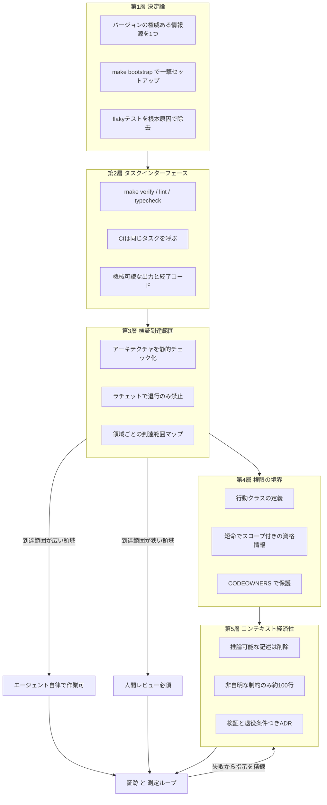
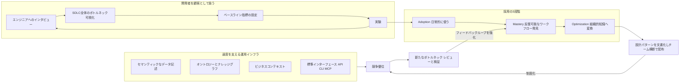
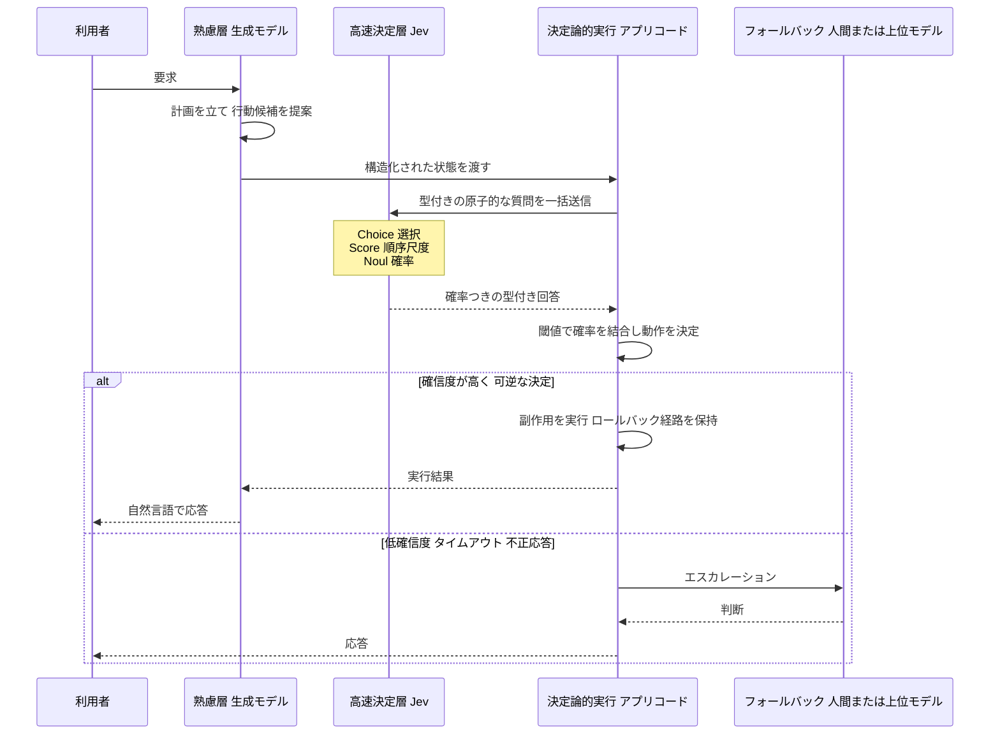

# Daily Briefing 2026-09-25

## 1. リポジトリを AI-Ready にする方法（原題: How to Make a Repository AI-Ready）

- **URL**: https://dev.to/aws-builders/how-to-make-a-repository-ai-ready-3j62
- **公開日**: 2026-08-27
- **著者・媒体**: Alexey Vidanov / DEV Community（AWS Community Builders）

### 本文翻訳

「リポジトリを AI-Ready にする」とは、より良いドキュメントを書くことだと一般に思われているが、それは誤りである。問題は文章ではなく構造にある。本稿の定義はこうだ——リポジトリが AI-Ready であるとは、権限を与えられたエージェントが、タスクを理解し、決定論的な環境を構築し、該当コードを特定し、範囲を限定した変更を行い、結果を検証し、証跡を残すまでを、文書化されていない人間の暗黙知に頼らずに完遂できる状態を指す。

中心概念は **検証到達範囲（verification reach）** である。リポジトリが自動的に検査できる範囲が、そのままエージェントの自律性の上限を定める。検証が強い領域ではエージェントは最小限の監督で安全に働けるが、検証が弱い領域はどんな指示ファイルでも補えない。

著者は準備を5層に分ける。

**第1層：決定論。** クリーンなチェックアウトから動作状態までの再現可能な経路を1本だけ用意する。バージョンの権威ある情報源を1つにし（`.python-version`、`uv.lock` 等の機械可読なピン留め）、ブートストラップコマンドを1つにする（`make bootstrap` がツール検証・依存導入・サービス起動・マイグレーション・コード生成・シード投入・ヘルスチェックまで行う）。サービスは名前・バージョン・ポート・起動コマンド・ヘルスチェックの表で明示する。不安定なテストは根本原因で潰す（時計の固定、乱数シード、ネットワーク遮断、テスト順序、ロケールとタイムゾーンの固定）。「新規クローンして bootstrap と verify を回す週次 CI ジョブだけが、セットアップ手順を正直に保つ唯一の手段である」。

**第2層：タスクインターフェースを API として扱う。** 暗黙のコマンド列を、名前付きで一貫した操作に置き換える（`make bootstrap / build / start / clean / verify / lint / typecheck / format / test-unit / test-integration / security / audit`）。CI はワークフロー YAML で検証を再実装せず、必ずリポジトリ側の同じタスクを呼ぶ。依存順序（マイグレーション→結合テスト、コード生成→型検査）も明文化する。所要時間の予算も重要で、変更ファイル対象で10秒未満の高速チェックは行動を形づくるが、25分以上かかるチェックは飛ばされる。出力は機械可読に——意味のある終了コード、`--json` 等の構造化形式、決定論的な順序、パイプ時に ANSI 色を出さないこと。

**第3層：検証到達範囲。** 誤った変更が自動的に落ちるようにする。散文の制約（「ドメインはインフラを import してはならない」）を実行可能な規則（ESLint、ArchUnit、import-linter）に置き換え、アーキテクチャを実行可能にする。さらにゲートを **ラチェット化** する——カバレッジ閾値は上がる一方、skip 数は上限付き、type-ignore コメントは制限、という単調性で退行だけを禁じ改善は許す。そして領域ごとに到達範囲を表にし、検証が強い領域（エージェント自律可）と弱い領域（レビュー必須）を分ける。

**第4層：権限の境界。** 能力と強制を資格情報とインフラで分離する。行動クラスを定義する——読み取りは許可、ワークスペース内の可逆な編集は許可、機微なリポジトリ変更はレビュー必須、外部・破壊的操作は拒否。リポジトリの内容は信頼できないものとして扱い、ネットワーク送信先は許可リスト化、資格情報は環境変数の秘密ではなく短命でスコープ付きのものにし、来歴を追跡する。`CODEOWNERS` で重要パスをレビューに回し、マイグレーションとフィーチャーフラグで巻き戻しを安価に保つ。

**第5層：コンテキストの経済性。** 2026年の ETH Zurich の研究が示した論争的な知見——開発者が書いた `AGENTS.md` は解決率を平均約4%改善したが、良し悪しを問わずコンテキストファイルは推論トークンを14〜22%増やした。LLM が生成したコンテキストファイルはむしろ性能を下げた。原因は指示の質ではなく **冗長性** で、生成ファイルはエージェントがコマンドを叩けば得られる情報（ディレクトリ概要など）を重複させていた。判断基準は一つ——「これはコードを読む、コマンドを実行する、ツール出力を読むことで得られるか？ 得られるなら消せ」。100行程度の最小指示ファイルに残るのは、打鍵どおりの正確なコマンド、どのツールも捕まえられない非自明な制約、保護されたパスと完了時に必要な証跡、そしてバグに見えるが意図的な挙動（例：「`OrderService.cancel()` は意図的に冪等である。再実行をエラーに変えてはならない。外部コンシューマはネットワークタイムアウト後に再試行し、冪等な応答は公開契約の一部である」）だけだ。

強制されるすべての制約には背後に決定が要る。ADR には **検証**（どのチェックが強制するか）と **退役条件**（何が観測されたらこの決定を終えるか）を必ず含める。

成熟度は5段階——Level 0 暗黙知（手順は人の頭の中、資格情報は広く共有）、Level 1 実行可能（ランタイム固定、新規クローン手順が文書化・テスト済み）、Level 2 検証可能（lint・型・テスト・ビルドが安定し検証コマンドが1つ）、Level 3 エージェント安全（機微パスに所有者、資格情報を分離、ブランチ保護、ゲートがラチェット）、Level 4 計測済み（代表タスクを定期評価し、失敗から指示を精錬し、領域ごとにコストと欠陥を追跡）。

エージェントは作業の最後に証跡を残す——何を変えたか、どのファイルか、どの検証が通ったか、そして決定的な項目として **何を検証しなかったか**、リスク、必要なレビュー。`Co-authored-by` 等のトレーラで作成者を機械的に記録すれば、git 履歴は領域別・作成者クラス別の欠陥率・リバート率を測るデータセットになる。

測定ループとしては代表タスクを5〜20個保持して定期実行し、タスク成功率、人間の修正時間、不要なファイル変更、無効化・弱体化されたテスト、セキュリティ検出、実行時間とトークン使用量、CI 失敗率、流出欠陥、決定を引用している強制制約の割合を追う。

導入は外部依存なしの6時間ロードマップで示される——監査2分、ツールチェーン固定15分、bootstrap 30分、verify 30分、フォーマッタ/リンタ/型45分、import 契約30分、ラチェット20分、`AGENTS.md` の削減20分、検証付き ADR 45分、CODEOWNERS とスキャン30分、評価タスク5件45分。各ステップは独立しており、どこで止めてもリポジトリは改善する。

結論はこうだ——「リポジトリが AI-Ready なのは、エージェントがパッチを作れるからではない。そのパッチが適切かどうかをリポジトリ自身が判定できるときである」。散らかったセットアップを大きな指示ファイルで説明しようとする反射は逆効果だ。知識を実行可能な構造へ移せ——ランタイム版はバージョンファイルへ、依存はロックファイルへ、セットアップは自動化へ、スキーマは契約へ、アーキテクチャは静的チェックへ、安全性は権限へ、品質はテストへ。指示ファイルには本当に推論不可能なものだけを、理由を添えて残す。

### 重要ポイント
- AI-Ready の本質はドキュメント量ではなく **検証到達範囲**。自動検査できる範囲がエージェントの自律性の上限を定める
- 「決定論 → タスク API → 検証 → 権限境界 → コンテキスト経済性」の5層で積み上げる。CI は独自実装せず必ずリポジトリ側の同一タスクを呼ぶ
- ETH Zurich の知見：開発者手書きのコンテキストは +約4% の改善、ただしどんなコンテキストファイルも推論トークンを 14〜22% 増やす。LLM 生成の指示ファイルは逆効果
- 散文の制約は import-linter / ArchUnit / ESLint で実行可能にし、ゲートは「悪化のみ禁止」のラチェットにする
- 証跡には「何を検証しなかったか」を必ず含める。`Co-authored-by` トレーラで作成者クラス別の欠陥率を計測できる

### 図解



### 現場での適用方法

**1) タスクインターフェースを Makefile で固定する（第2層）**

`<REPO_PATH>/Makefile` に置き、CI からも同じターゲットを呼ぶ。

```makefile
.PHONY: bootstrap verify lint typecheck test-unit test-integration

# クリーンチェックアウトから動作状態までの唯一の経路
bootstrap:
	@command -v uv >/dev/null || { echo "uv が必要です"; exit 1; }
	uv sync --frozen
	docker compose up -d postgres redis
	uv run alembic upgrade head
	uv run python scripts/seed.py
	@$(MAKE) --no-print-directory healthcheck

# ローカルと CI で完全に同一の検証
verify: lint typecheck test-unit test-integration

lint:
	uv run ruff check --output-format=json .
	uv run lint-imports   # アーキテクチャ制約の強制

typecheck:
	uv run mypy --no-color-output .

test-unit:
	uv run pytest tests/unit -p no:randomly --tb=short
```

CI 側はこれを再実装せず呼ぶだけにする。

```yaml
# .github/workflows/verify.yml
jobs:
  verify:
    runs-on: ubuntu-latest
    steps:
      - uses: actions/checkout@v4
      - run: make bootstrap
      - run: make verify
```

**2) アーキテクチャ制約を実行可能にする（第3層）**

`<REPO_PATH>/pyproject.toml`：

```toml
[[tool.importlinter.contracts]]
name = "Domain must not import infrastructure"
type = "forbidden"
source_modules = ["myapp.domain"]
forbidden_modules = ["myapp.infrastructure"]
```

**3) ラチェットで退行だけを禁じる（第3層）**

`<REPO_PATH>/scripts/ratchet.sh`：

```bash
#!/usr/bin/env bash
set -euo pipefail
BASELINE_FILE="${1:-.ratchet.json}"
CURRENT_COV=$(uv run coverage report --format=total)
BASELINE_COV=$(jq -r '.coverage' "$BASELINE_FILE")

if (( CURRENT_COV < BASELINE_COV )); then
  echo "カバレッジが退行しました: ${BASELINE_COV}% -> ${CURRENT_COV}%"
  exit 1
fi

# 改善したときだけベースラインを引き上げる
if (( CURRENT_COV > BASELINE_COV )); then
  jq ".coverage = ${CURRENT_COV}" "$BASELINE_FILE" > tmp && mv tmp "$BASELINE_FILE"
  echo "ベースラインを ${CURRENT_COV}% へ更新しました"
fi
```

**4) CLAUDE.md / AGENTS.md を「推論不可能なものだけ」に削る（第5層）**

```markdown
# CLAUDE.md

## コマンド（打鍵どおり）
- セットアップ: `make bootstrap`
- 検証（これが通ればマージ可）: `make verify`
- 単体テストのみ: `make test-unit`

## どのツールも捕まえられない制約
- `OrderService.cancel()` は意図的に冪等。再実行をエラーに変えないこと。
  外部コンシューマはネットワークタイムアウト後に再試行し、冪等な応答は公開契約の一部。
- `src/billing/**` は変更前に必ず ADR-BILL-002 を読むこと。

## 保護パス（編集したらレビュー必須）
- `src/auth/**`, `migrations/**`, `.github/workflows/**`

## 完了時に必ず報告する証跡
1. 変更したファイル一覧
2. 実行して通った検証コマンド
3. **検証しなかった範囲**（最重要）
4. 残存リスクとレビュー依頼事項

## 書いてはいけないこと
ディレクトリ構成の概要、`ls` や `rg` で分かること、依存一覧。
（トークンを 14〜22% 浪費し、解決率を下げる）
```

**5) 検証と退役条件つき ADR テンプレート**

`<REPO_PATH>/docs/adr/ADR-AUTH-003.md`：

```markdown
---
id: ADR-AUTH-003
scope: [src/auth/**, src/internal-api/**]
---

## 決定: 内部サービスはセッション裏付けトークンを使う

## 理由
即時失効が必須。過去の JWT 実装で失効漏れの認可が発生した。

## 検証
- 実行: `make test-auth-boundaries`
- 探索: `rg "jwt.sign|createJwt" src/auth src/internal-api`

## 退役条件
ゲートウェイが1秒未満の失効伝播に対応したら再検討する。
```

### 期待効果
- 開発者手書きのコンテキストファイルにより、エージェントのタスク解決率が平均 **約4%** 改善（ETH Zurich 研究）
- 逆に冗長なコンテキストを削ることで推論トークンの **14〜22%** の無駄を回避できる
- 6時間の導入ロードマップで Level 0（暗黙知）から Level 2〜3（検証可能／エージェント安全）まで到達可能。各ステップは独立しており途中で止めても効果が残る
- 検証到達範囲を領域別に可視化することで、「どこまでエージェントに任せてよいか」を感覚ではなくデータで決められる

### 注意点
- ラチェットは「改善したときだけベースラインを更新」する設計にしないと、一度上がった閾値が開発を止める。カバレッジ以外（skip 数、type-ignore 数）にも上限を設けること
- 25分以上かかる検証は事実上スキップされる。高速チェック（変更ファイル対象10秒未満）と網羅チェックを分離しないと第2層が機能しない
- ETH Zurich の +4% は平均値であり、コンテキストファイルの追加は常に得とは限らない。トークン増加14〜22%というコストが常に発生する点を踏まえ、削る方向のレビューを定期的に行う必要がある
- 第4層の権限分離はエージェント側の設定だけでは完結しない。資格情報の短命化やネットワーク許可リストはインフラ側の対応が前提になる

## 2. CTO Circle：AIネイティブなエンジニアリングチームを作る教訓（原題: CTO Circle: Lessons on Building AI-Native Engineering Teams）

- **URL**: https://www.snowflake.com/en/blog/cto-circle-ai-native-engineering/
- **公開日**: 2026-08-05
- **著者・媒体**: Shruti Bhat、Rashmi Singh / Snowflake Blog

### 本文翻訳

AIネイティブなエンジニアリング組織を作るための確立されたプレイブックはまだ存在せず、エンジニアリングリーダーが学びを率直に比較し合う機会も乏しい。Snowflake Summit 2026 で開催された第1回 CTO Circle には、業種を越えて350名を超える CTO が集まり、実践的な教訓を交換した。議論は3つのテーマに整理された。

**テーマ1：本番投入の AI——何が壊れ、何がスケールするか。**

Snowflake は発想を転換し、開発者生産性を文化の問題ではなく **プロダクトの課題** として再定義した。SVP of Engineering の Vivek Raghunathan が投げかけた問いはこうだ——「もし自社の開発者を顧客として扱ったらどうなるか？」。実装アプローチは単純である。エンジニアにインタビューしてワークフロー上の摩擦点を特定し、ソフトウェア開発ライフサイクル全体のボトルネックをマッピングし、ベースライン指標を定めて実験を回し、経営層のスポンサーシップと草の根の採用を組み合わせた。

結果は計測可能な形で表れた。社内開発者 NPS は18か月で **30ポイント以上** 上昇し、満足層と不満層の比率は **4:1** に達した。開発速度に対する顧客満足度は **FY24 Q4 の 17.8% から FY26 Q2 の 62.0%** へ跳ね上がった。

採用には3段階がある——**Adoption**（AI ツールを日常的に使えるようになる）、**Mastery**（一貫した改善をもたらす反復可能なワークフローを発見する）、**Optimization**（成功パターンを組織的知識へ変換する）。Snowflake は早期採用者からエンジニアリング設計パターンを文書化し、チーム横断で配布した。競争優位はツールを配ることではなく、**実証済みワークフローを制度化すること** から生まれる。

さらに変革的な影響として、AI が実装コストを下げるにつれ、プロダクトマネージャー・デザイナー・ドメイン専門家といった新しいペルソナが「作る人」になる。仮説検証の手段として、コードがスライドより速くなるのである。

**テーマ2：速度を最大化し、リスクを封じ込める。**

速度の向上はすべて、信頼性と運用規律の強化を要求する。Snowflake の Observability 部門 GM である Jeremy Burton は「より良いモデルにはより良いデータが必要だ」と述べつつ、同時により豊かなコンテキストへのアクセス可能性も必要だと指摘した。重要なインフラ要素は4つ——情報の意味を説明するセマンティックなデータ記述、システム間の関係を捉えるオントロジーとナレッジグラフ、分断されたシステムをつなぐビジネスコンテキスト、そして AI が確実にアクセスするための標準化されたインターフェース（API、CLI、Model Context Protocol）である。

実例として Netflix のエンジニアリングマネージャー Aditya Gaur が、自動根本原因分析の成功事例を共有した。これが成功したのは、Netflix が何年もかけて、分断されたテレメトリの接続、オントロジーによる運用上の関係のモデル化、共有コンテキスト層の構築、そして「バラバラなログ」ではなく「構造化された知識」の上で推論する AI エージェントの構築に投資してきたからである。

組織戦略としては Hex の CTO である Caitlin Colgrove が「船を焼く（burning the boats）」——AI 統合への完全なコミットを強調した。Hex は当初 AI 専任の中央チームを作ったが、最終的にそれを解散し、AI の責任をすべてのプロダクトチームへ分散させた。これにより提供速度が上がり、能力が組織全体に埋め込まれた。一方 Barclays のマネージングディレクター Chris Kozlowski は、規制産業では統制を速度と引き換えにできず、ガバナンスと信頼がイノベーションに伴わねばならないと強調した。

**テーマ3：AI のためにエンジニアリングチームを設計する。**

Cerebras Systems の EVP である Qi Jin は、旧来のソフトウェア開発に最適化されたチームは AI 採用の障壁になると論じ、顧客課題に焦点を当てて緊急の組織変革を駆動する「Code Yellow」フレームワークを紹介した。Capital One のマネージング VP である Parvez Naqvi は、AI が実装を加速するにつれ、エンジニアの価値は **機械が独力では下せない判断** へ移ると説明した。新たな制約はプランニング、アーキテクチャ設計、エンジニアリング判断である。

エンジニアの責務も変わる。シニアエンジニアは技術的方向性を定義し、アーキテクチャパターンとシステム設計を確立し、人間と AI エージェントの双方がより良い判断を下せるコンテキストを提供することでレバレッジを生む。手作業のコーディングを前提に設計されたコードレビュープロセスは陳腐化する。

内部ツールとデプロイシステムへの投資は、運用負荷を下げて回復力に集中できるようにする **競争資産** になる。エンジニアリング組織は「コードの唯一の生産者」から「品質・アーキテクチャ・運用卓越性の管理者」へ移行する。

そして Cursor の COO である Jordan Topoleski は、AI が開発速度を劇的に高める結果、**コードレビューと検証が新たなボトルネック** になると指摘した。うまくスケールしている組織は、AI 生成ソフトウェアが本番水準を満たすことを保証するフィードバックループを強化している。

全体として、業界はすでに実験段階を超えている。組織ごとに変革段階は異なるが課題は共通しており、AI ネイティブなエンジニアリングとは **組織の学習速度** と、より優れたソフトウェアの作り方を制度化することによって定義される。最速で動く企業は、新たな AI 能力を活かすためにエンジニアリング組織を継続的に再設計している。金融、通信、小売、テクノロジーと業種は異なっても、エンジニアリングリーダーが直面する意思決定は驚くほど並行している。

### 重要ポイント
- 開発者生産性を「文化の問題」ではなく「プロダクトの課題」として扱う。開発者を顧客として扱い、インタビュー → ボトルネックのマッピング → ベースライン指標 → 実験のループを回す
- 採用には Adoption → Mastery → Optimization の3段階があり、競争優位はツール配布ではなく **実証済みワークフローの制度化** から生まれる
- AI の速度向上には運用インフラが前提。セマンティックなデータ記述、オントロジー、ビジネスコンテキスト、標準インターフェース（API/CLI/MCP）が揃って初めて Netflix 型の自動 RCA が成立する
- Hex は AI 中央チームを **意図的に解散** し、責任を全プロダクトチームへ分散させて提供速度を上げた
- エンジニアの価値は実装から判断（プランニング、アーキテクチャ、エンジニアリング判断）へ移り、レビューと検証が新しいボトルネックになる

### 図解



### 現場での適用方法

**1) 「開発者を顧客として扱う」計測ループを回す運用手順**

```bash
# Step 1: ベースラインを取る（四半期ごと）
# 開発者NPS: 「このチームの開発環境を同僚に薦めますか（0-10）」を全エンジニアに配布
# 推奨者(9-10)% - 批判者(0-6)% = NPS

# Step 2: SDLC のボトルネックを実データで特定する
git log --since="90 days ago" --pretty='%H %ct %an' > /tmp/commits.txt
# PR作成からマージまでのリードタイム分布（p50 / p90）を出す
gh pr list --state merged --limit 300 \
  --json createdAt,mergedAt,additions \
  | jq -r '.[] | [((.mergedAt|fromdate)-(.createdAt|fromdate))/3600, .additions] | @tsv' \
  | sort -n > /tmp/leadtime.tsv

# Step 3: 段階別に人数を数える（Adoption / Mastery / Optimization）
#   Adoption  : 週1回以上エージェントを使う人の割合
#   Mastery   : 自分専用の再利用可能ワークフローを持つ人の割合
#   Optimization: そのワークフローを組織リポジトリに登録した人の割合
```

四半期ごとに「NPS」「リードタイム p50/p90」「3段階の人数分布」の3枚だけを経営報告に使う。

**2) 「実証済みワークフローの制度化」をスキル化する**

早期採用者が発見したワークフローを、個人の tips で終わらせず `.claude/skills/` へ登録して配布する。

```markdown
---
name: incident-rca
description: 本番障害の根本原因分析を行う。アラート・ダッシュボードURL・障害時刻が与えられたとき、またはインシデントチャンネルの調査を依頼されたときに使用する。テレメトリを横断して仮説を立て、証跡つきのRCAドラフトを生成する。
---

# インシデント根本原因分析

## 前提となるコンテキスト層
以下がすべて参照可能であることを確認してから開始する。欠けていれば明示的に報告する。
- メトリクス: `mcp__observability__query_metrics`
- 分散トレース: `mcp__observability__get_trace`
- サービス依存関係オントロジー: `<REPO_PATH>/docs/service-graph.yaml`
- 直近デプロイ一覧: `make recent-deploys SINCE=<ISO8601>`

## 手順
1. 障害時刻の前後30分のデプロイを列挙し、変更のあったサービスを候補に挙げる
2. `service-graph.yaml` から影響サービスの上流・下流を展開する
3. 候補ごとに「支持する証拠」「否定する証拠」を表で示す。ログの引用は必ず時刻付き
4. 仮説を確信度順に最大3件に絞る

## 出力形式
- 確定していること / 推測であること を必ず分けて書く
- **検証していない範囲** を明記する
- 再発防止策は「どの自動チェックで捕まえるか」まで書く（散文の再発防止策は禁止）
```

**3) AI 専任中央チームからの移行チェックリスト（Hex 型の分散化）**

```markdown
## 中央AIチームを解散してよいかの判定

- [ ] 各プロダクトチームに「AI ワークフローの所有者」が1名以上いる
- [ ] 中央チームが作った設計パターンが全チームのリポジトリで再現できる
- [ ] エージェント用の共通インターフェース（MCP / CLI）が中央集権的に維持されている
- [ ] 規制対象領域のガバナンス（監査ログ、承認フロー）だけは中央に残している

4項目すべてが満たされたら、中央チームの役割を「プラットフォーム提供」に限定して解散する。
満たされないうちに分散させると、各チームが独自に車輪を再発明する。
```

### 期待効果
- Snowflake の実績値：社内開発者 NPS が18か月で **30ポイント以上** 向上、満足層:不満層 = **4:1**
- 開発速度に対する顧客満足度が **17.8%（FY24 Q4）→ 62.0%（FY26 Q2）** へ改善
- AI 責任をプロダクトチームへ分散させた Hex では提供速度が向上し、能力が組織全体に埋め込まれた
- 設計パターンの文書化・横展開により、個人の成功が組織の再現可能な資産になる

### 注意点
- Netflix の自動 RCA は「AI を入れたから成功した」のではなく、**数年かけたテレメトリ統合とオントロジー構築が前提** である。コンテキスト層への投資を飛ばして同じ成果を期待してはならない
- 規制産業（Barclays の例）では統制を速度と引き換えにできない。ガバナンス要件を先に定義しないと、後から速度を落とすことになる
- 中央 AI チームの解散は「能力が全チームに行き渡った後」の手であり、順序を誤ると車輪の再発明が起きる
- 速度が上がるほどコードレビューと検証がボトルネック化する。レビュー体制の再設計を同時に進めないと、実装の高速化が滞留に変わるだけになる

## 3. TypeSafe Jev で AI エージェント向けの高速な意思決定層を作る方法（原題: How to Build a Fast Decision Layer for AI Agents with TypeSafe Jev）

- **URL**: https://dev.to/coderbuffer/how-to-build-a-fast-decision-layer-for-ai-agents-with-typesafe-jev-1ggj
- **公開日**: 2026-09-22
- **著者・媒体**: CoderBuffer / DEV Community（初出: jev-tutorial.org）

### 本文翻訳

本稿は「エージェントのあらゆるタスクを単一の大規模言語モデルで処理する」という通念に異議を唱える。代わりに提案するのは、開放的な生成ではなく **閉じた選択肢の決定** を担う専用の「意思決定層」を TypeSafe Jev で構築することである。

Jev が提供する型付き出力は3つのプリミティブに集約される——**Choice**（名前付きの選択肢から選ぶ）、**Score**（順序尺度上に配置する）、**Noul**（言明が真である確率を推定する）。

提案されるエージェントアーキテクチャは4層に関心を分離する。

1. **熟慮（Deliberation）** — 計画と文章生成を担う生成モデル
2. **高速決定（Fast decisions）** — Jev がルーティング、フィルタリング、スコアリングを担う
3. **決定論的実行（Deterministic execution）** — アプリケーションコードが副作用とロールバックを所有する
4. **フォールバック（Fallback）** — 高リスクのケースは人間またはより強力なモデルが処理する

高速決定層に載せてよいタスクの条件は明確である——出力が事前定義されていること、決定が頻繁に起きること、誤答が検出可能または可逆であること、そして長い説明よりも意味理解のほうが重要であること。該当例はツールルーティング、関連度スコアリング、モデレーションのトリアージ、権限ゲートなどだ。

コード例としてコンテキストの圧縮（compaction）が示される。ここで重要なのは、「履歴を削除してよいか」と漠然と尋ねるのではなく、**複合的な判断を原子的な質問へ分割する** ことだ。

```javascript
const questions = {
  call_t3: {
    type: "noul",
    instructions: "Is knowing this tool call still useful?"
  },
  result_t3: {
    type: "noul",
    instructions: "Must the full result remain available?"
  }
};
```

そして決定論的なアプリケーションコードが、返された確率を明示的な動作へ結合する。

```javascript
if (keepResult >= resultThreshold) {
  return "keep";
}

if (keepCall >= callThreshold) {
  return "drop_result";
}

return "drop_call";
```

この分離により、確率的なコンポーネントが破壊的操作を暗黙のうちに所有してしまう事態を防げる。

閾値のキャリブレーションについて、本稿は 0.5 や 0.8 といった値をハードコードすることを勧めない。推奨される手順はこうだ——まず Jev を **シャドーモード** で走らせる（決定を実行せず記録だけする）。質問のバージョン、モデルのバージョン、確率、そして実際の結果を保存する。代表的なサンプルにラベルを付ける。**確信度の帯域ごとに** 精度を測定する。誤りのコストと可逆性に基づいて閾値を選ぶ。そしてタイムアウトや不正な応答に備えたフォールバック経路を常に維持する。

他の選択肢との使い分けも明示されている。「LLM + JSON Schema」は、頻度が低く複雑で説明を要する判断に向く。従来型の分類器は、ラベルが安定していて訓練データがある場合に優れる。ツール呼び出し（tool calling）は依然としてモデル主導である。Jev が埋めるのは、**頻繁で、意味的に豊かで、回復可能な決定** を、散文生成のオーバーヘッドなしに処理する領域だ。

再利用可能な原則として本稿が提示する中心命題は——**「生成が表現し、判断がルーティングし、コードが実行する（Generation expresses → judgment routes → code executes）」**。実践の順序は、まずデータを構造化し、複合的な判断を原子的な質問に分割し、確率はアプリケーションコードで結合し、副作用は決定論的に保ち、完全なフォールバックを維持すること。この境界はコンテキスト圧縮に限らず、ツールルーティング、コンテンツモデレーション、検索ランキング、権限ゲート、エスカレーション判断にも同じように適用できる。

最後に本稿は釘を刺す——型安全性は出力の **形** を制約するが、**正しさ** を保証するものではない。本番システムには依然としてキャリブレーション、フォールバック、可観測性が必要である。

### 重要ポイント
- Jev の出力プリミティブは Choice（選択）/ Score（順序尺度）/ Noul（真である確率）の3つ。散文を返さない
- エージェントを「熟慮＝生成モデル」「高速決定＝Jev」「決定論的実行＝アプリコード」「フォールバック＝人間または強力なモデル」の4層に分離する
- 複合判断は原子的な質問へ分割し、確率の結合はアプリコード側で行う。確率的コンポーネントに破壊的操作を所有させない
- 閾値はハードコードせず、シャドーモードでログを貯め、確信度の帯域ごとに精度を測ってから決める
- 使い分け：LLM+JSON Schema は低頻度・要説明、従来型分類器は安定ラベル＋訓練データあり、Jev は高頻度・意味的・回復可能な決定

### 図解



### 現場での適用方法

**1) 原子的な質問へ分割し、確率の結合はコード側で行う**

`<REPO_PATH>/src/decision/compaction.ts`：

```typescript
import { experimental_evaluate as evaluate } from "ai";

// 環境依存の値はプレースホルダ
const JEV_MODEL = "typesafe-ai/jev";
const CALL_THRESHOLD = Number(process.env.JEV_CALL_THRESHOLD ?? "0.35");
const RESULT_THRESHOLD = Number(process.env.JEV_RESULT_THRESHOLD ?? "0.60");

type CompactionAction = "keep" | "drop_result" | "drop_call";

export async function decideCompaction(
  toolCall: unknown,
  toolResult: unknown,
): Promise<CompactionAction> {
  try {
    // 複合判断を原子的な質問へ分割し、独立した質問は1回でまとめて送る
    const { answers } = await evaluate({
      model: JEV_MODEL,
      state: { call: toolCall, result: toolResult },
      questions: {
        keep_call: {
          type: "noul",
          instructions: "このツール呼び出しを知っていることは今も有用か",
        },
        keep_result: {
          type: "noul",
          instructions: "この結果の全文が引き続き参照可能である必要があるか",
        },
      },
    });

    // 確率の結合は決定論的なコードが所有する
    if (answers.keep_result.probability >= RESULT_THRESHOLD) return "keep";
    if (answers.keep_call.probability >= CALL_THRESHOLD) return "drop_result";
    return "drop_call";
  } catch (err) {
    // タイムアウト・不正応答では常に安全側へ倒す
    console.warn("[jev] 決定に失敗したため保持側へフォールバック", err);
    return "keep";
  }
}
```

**2) 閾値を決める前にシャドーモードでログを貯める**

`<REPO_PATH>/src/decision/shadow.ts`：

```typescript
import { appendFileSync } from "node:fs";

const SHADOW_LOG = process.env.JEV_SHADOW_LOG ?? "/var/log/jev-shadow.jsonl";
const SHADOW_MODE = process.env.JEV_SHADOW_MODE === "1";

export function recordDecision(record: {
  questionVersion: string;   // 質問文を変えたら必ず上げる
  modelVersion: string;      // モデル更新で精度が動くため必須
  probability: number;
  proposedAction: string;
  executedAction: string;    // シャドー中は従来ロジックの結果
  traceId: string;
}) {
  appendFileSync(SHADOW_LOG, JSON.stringify({ ...record, ts: Date.now() }) + "\n");
}

export const isShadow = () => SHADOW_MODE;
```

**3) 確信度の帯域ごとに精度を集計して閾値を選ぶ**

`<REPO_PATH>/scripts/calibrate.sh`：

```bash
#!/usr/bin/env bash
# ラベル付けした結果(correct: true/false)を含むシャドーログから
# 確信度の帯域ごとの精度を出す。閾値はここから誤りコストを見て決める。
set -euo pipefail
LOG="${1:-/var/log/jev-shadow.jsonl}"

jq -s -r '
  map(select(.correct != null))
  | map(. + { band: (.probability * 10 | floor) })
  | group_by(.band)
  | map({
      band: (.[0].band / 10),
      n: length,
      accuracy: ((map(select(.correct)) | length) * 100 / length | floor)
    })
  | .[]
  | "確信度 \(.band) 以上\tn=\(.n)\t精度=\(.accuracy)%"
' "$LOG"
```

出力例をもとに「誤りが可逆な決定は精度80%の帯域から自動化、不可逆な決定は95%以上の帯域のみ」といった形で閾値を決める。

**4) CLAUDE.md への追記例（設計境界をエージェントに守らせる）**

```markdown
## 意思決定層の設計境界（必ず守ること）

原則: 生成が表現し、判断がルーティングし、コードが実行する。

- 閉じた選択肢の判断（ルーティング、関連度スコア、モデレーション、権限ゲート）は
  生成モデルに散文で答えさせず、Jev の型付き質問（Choice / Score / Noul）を使う
- 複合的な判断は **必ず原子的な質問へ分割** する。
  「この履歴を消してよいか」ではなく「呼び出しは有用か」「結果の全文が必要か」に分ける
- 確率の結合（閾値判定）は必ずアプリケーションコード側に置く。
  Jev の戻り値をそのまま破壊的操作の条件に使わないこと
- 閾値をコードにハードコードする PR は却下。`process.env.JEV_*_THRESHOLD` 経由とし、
  シャドーモードの集計結果（`scripts/calibrate.sh`）を PR 説明に添付する
- タイムアウト・不正応答時のフォールバックがない実装はマージ不可。
  フォールバックは常に「安全側（保持・エスカレーション）」へ倒す
```

### 期待効果
- 高頻度な内部判断（ルーティング、フィルタ、スコアリング）から散文生成のオーバーヘッドを除去でき、エージェントループの制御部分を軽量化できる
- 確率の結合と副作用をアプリコードに閉じ込めることで、確率的コンポーネントが破壊的操作を暗黙に所有する事故を構造的に防げる
- シャドーモード＋帯域別精度測定により、閾値を「勘」ではなく誤りコストと可逆性に基づいて決められる
- 独立した質問を1回の評価にまとめることで、判断ごとに往復する設計よりも呼び出し回数を削減できる

### 注意点
- **型安全性は出力の形を保証するが正しさは保証しない。** キャリブレーション、フォールバック、可観測性は本番では依然として必須
- 質問文やモデルのバージョンを変えると確率分布が動く。ログに `questionVersion` / `modelVersion` を残していないと、過去のキャリブレーション結果が再利用できなくなる
- すべての判断が高速決定層に向くわけではない。頻度が低く説明を要する判断は LLM + JSON Schema、ラベルが安定し訓練データがあるなら従来型分類器のほうが適切
- 証拠に依存関係がある判断（前の答えが次の質問の前提になる場合）は一括評価してはならず、評価を分ける必要がある
- 本稿は TypeSafe Jev という特定サービスへの依存を前提とする。外部 API への同期依存が増えるため、レイテンシ予算とフォールバック経路の設計を先に決めておくこと
