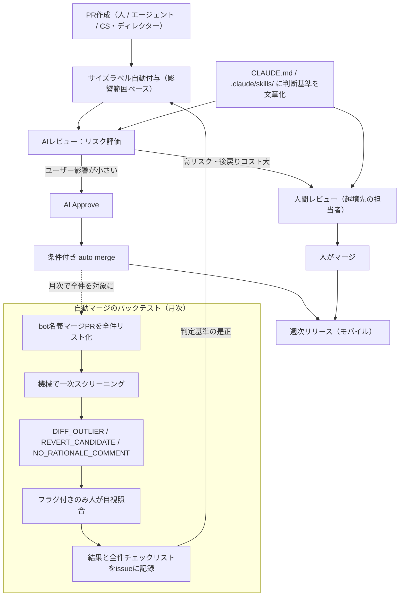
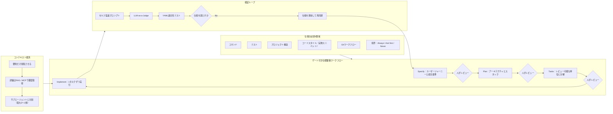
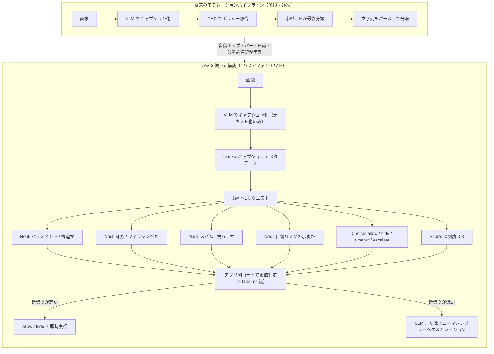
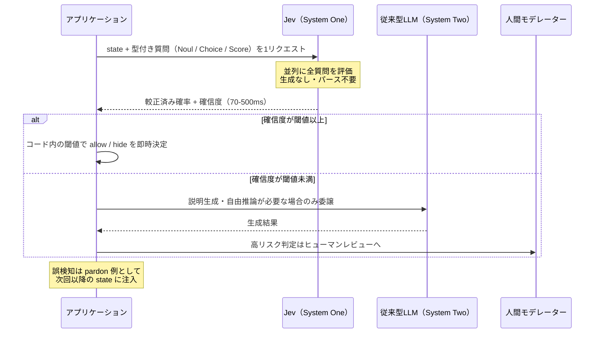

# Daily Briefing 2026-09-26

## 1. AI前提のプロダクト開発組織を目指して、minneの2026年の現在地（原題: AI前提のプロダクト開発組織を目指して、minneの2026年の現在地）

- **URL**: https://tech.pepabo.com/2026/09/02/minne-ai-native-org-2026/
- **公開日**: 2026-09-02
- **著者・媒体**: kazu（SUZURI・minne事業部 minneグループ エンジニアリングリード）/ GMOペパボ Pepabo Tech Portal

### 本文翻訳

minne では AI 前提のプロダクト開発組織づくりを進めている。これまで整備してきた仕組みは2つある。ひとつは **「PR サイズラベルの自動付与 → AI レビューによる Approve → 条件付き auto merge」の3段構え**。もうひとつは **Claude Code Action がリポジトリを横断してソースコード・issue・PR を参照できるようにしたこと** である。前者を入れたのは人のレビューが追いつかなくなったためだ。エンジニアはエージェントを並列に動かすようになり、CS やディレクターまで Claude Code Action 経由で PR を出すようになった。後者が必要になったのは、minne のコードが Rails・Next.js・iOS・Android に分かれており、片側だけでは調査を完結できないからである。本稿はその仕組みを前提に、**組織とプロセスの側がどう変わったか**を2026年9月時点の現在地としてまとめたものだ。

**AI 自律マージ率。** AI のレビューでリスクを評価し、ユーザー影響が小さいものはエージェントが自律的にマージできるようにしている。人間の手を介さず AI の Approve からマージまで完了した PR の割合は直近30日で、Android 94%、iOS 65%、サーバーサイド 74%、**全体 83%** だった。重要なのは分母の取り方で、これは「その期間にマージされた PR の全件」である。auto merge の対象条件を満たした PR だけに絞っておらず、そもそも自動マージ対象外だった PR も含んだ数字になっている。

**Web とモバイルで越境する。** 現在のチームは Web エンジニア2人、モバイルエンジニア5人。以前は「Web は Rails、モバイルは iOS/Android」と職能で分かれていた。いまは設計を Web とモバイルのエンジニアが一緒に行い、そこで決まったサーバーサイド（Rails / GraphQL）の実装はモバイルエンジニアが進める。最近はモバイルエンジニアが作ったサーバーサイドの設計を、最終的に Web エンジニアがレビューする形になってきた。AI が既存コードの規約に沿った実装をかなり担えるようになった結果、**「そのフレームワークを書いた経験があるか」が越境の障壁になりにくくなった**。ただし丸投げを避けるため3点に気をつけている——(1) テーブル設計・API の切り方・データ移行のような後戻りコストの高い意思決定は Web 側と一緒に決めてから実装に入る、(2) レビューは越境先の人が見る、(3) 判断基準を `CLAUDE.md` や `.claude/skills/` に文章として置く（人とエージェントの双方に同じものが効く）。

**リリースを2週間に1回から1週間に1回へ。** PR のスループットが上がっても、ユーザーに届くのが2週間後ならリードタイムは縮まらない。そこでモバイルのリリースサイクルを週1回に変えた。狙いは3つ——1リリースに載る変更が減るので問題時の切り分けが速い、「次に間に合わせないと2週間後」という駆け込みマージの圧力がなくなる、頻度を上げるにはリリース作業の省力化が前提になるのでその整備を進める強制力になる。一方でリリースごとの検証作業も倍になった。週1サイクルのうちリリースと検証に日数を取られ、**実装に充てられるのは実質2日ほど**である。それでも AI 前提の開発により、かつての1週間1スプリントで出せていたアウトプットと同程度かそれ以上をデリバリーできている。今後の課題はモバイルの検証作業をどこまで自動化できるかだ。

**自動マージのバックテスト。** AI が Approve して auto merge する以上、その判定が妥当だったかを後から説明できる必要がある。内部統制の観点でも、サイズ判定の根拠が PR に残っているか、導入時点からの期間を抜けなくカバーできているか、サンプリングでなく全件を対象にできているかが論点になった。そこで月次モニタリングとは別に、サイズ判定の妥当性を再検証するバックテストを整備した。手順は4ステップ——(1) 対象期間中に bot 名義でマージされた PR を全件リスト化する（人が対象を選ばない）、(2) 全件を機械で一次スクリーニングし疑うべきものにフラグを立てる（`DIFF_OUTLIER`＝付与サイズラベルに対し差分行数が外れ値、`REVERT_CANDIDATE`＝revert や打ち消しに見える変更、`NO_RATIONALE_COMMENT`＝判定根拠のコメントが PR に残っていない）、(3) フラグの立った PR だけを人がサイズ定義と目視で照合する、(4) 照合結果を issue にコメントで記録し、全件のチェックリストも issue に残して全件から候補に絞った経路を辿れるようにする。

設計上のポイントは2つ。**行数で判定はしないが、行数は検知に使う**——サイズラベルは差分行数ではなく影響範囲で決めている（1行の決済ロジック変更は XS ではない）。一方で「XS なのに600行消えている」という乖離は見直す価値のあるサインだ。判定に使っていない指標を検知に使うことで、AI の判定を同じ物差しで確かめる構造を避けられる。もうひとつは **人が目視する量をゼロにはせず、絞る**——全件を人が見る運用は続かないし、検証まで自動化すると同じ仕組みを同じ仕組みで確かめることになる。全件は機械が見て、怪しいものだけ人が見る二段構えにしている。このバックテストはサーバーサイドとモバイルそれぞれで月1回実施している。

この半年で変えたのは3点——実装言語の壁が下がったので職能を越境して設計と実装を進められるようにした、作る速度が上がったぶん届ける速度（リリース間隔）も上げた、自動でマージするなら後から妥当性を検証できる形をセットで用意した。**ツールの使い方よりも、チームの分け方・リリースの刻み方・自動化した判断をどう検証し続けるかといったプロセス側の設計のほうが効いている**、というのが現時点の実感である。

### 重要ポイント
- 人手を介さない AI 自律マージ率は全体 83%（Android 94% / iOS 65% / サーバーサイド 74%）。分母は「期間内にマージされた PR 全件」で、自動マージ対象外も含む厳しめの取り方
- AI が規約準拠の実装を担うことで「そのフレームワークの経験」が職能越境の障壁でなくなった。ただし後戻りコストの高い設計判断は越境前に合議、レビューは越境先の人が実施
- スループット向上をリードタイム短縮に変換するには**リリース間隔そのもの**を縮める必要がある（隔週→週次）。副作用として検証コストが倍増し、実装可能日は週2日程度に
- 自動マージには**バックテスト**をセットで用意する。全件機械スクリーニング→フラグ付きのみ人が目視、の二段構え
- 判定軸（影響範囲）と検知軸（差分行数）を**意図的にずらす**ことで、同じ物差しでの自己検証を避ける

### 図解



### 現場での適用方法

**(1) `CLAUDE.md` への追記例** — サイズ判定と自律マージの境界をエージェントと人の共通言語にする。

```markdown
## PRサイズラベルの判定基準

サイズは **差分行数ではなく影響範囲** で決める。行数は参考情報に過ぎない。

| ラベル | 基準 | 自律マージ |
|--------|------|-----------|
| XS | 文言・コメント・ログ文字列のみ。ふるまい不変 | 可 |
| S  | 単一画面・単一エンドポイント内に閉じる。既存テストで検証可能 | 可 |
| M  | 複数モジュールにまたがるが、外部契約（API/スキーマ）は不変 | レビュー必須 |
| L  | 外部契約の変更、データ移行、決済・認証・個人情報に触れる | レビュー必須 |

判定の落とし穴:
- 1行でも決済ロジックの変更は XS ではない（最低 L）
- 自動生成ファイルの大量差分は行数が多くても影響範囲で判定する

## レビュー時にPRへ必ず残すもの
- 付与したサイズラベルとその**根拠コメント**（どの影響範囲に該当するか）
- 検証したこと / **検証していないこと**
- 根拠コメントが無い自動マージは後段のバックテストで NO_RATIONALE_COMMENT として必ず拾われる

## 越境実装のルール
- テーブル設計 / API の切り方 / データ移行 は実装前に越境先の担当者と合議する
- レビューは必ず「越境先」のドメイン担当者が行う
```

**(2) バックテストのスクリプト化の例** — 一次スクリーニングを GitHub Actions の月次ジョブにする。

```bash
#!/usr/bin/env bash
# scripts/automerge-backtest.sh
# 使い方: ./scripts/automerge-backtest.sh <REPO> <SINCE:YYYY-MM-DD> <UNTIL:YYYY-MM-DD>
set -euo pipefail

REPO="${1:?owner/repo}"; SINCE="${2:?YYYY-MM-DD}"; UNTIL="${3:?YYYY-MM-DD}"
BOT_LOGIN="${BOT_LOGIN:-github-actions[bot]}"
XS_MAX_LINES="${XS_MAX_LINES:-30}"     # XS/S で許容する差分行数の目安（検知用のみ）
S_MAX_LINES="${S_MAX_LINES:-150}"

# 1) 対象期間に bot 名義でマージされた PR を「全件」取得（人が対象を選ばない）
gh pr list --repo "$REPO" --state merged --limit 1000 \
  --search "merged:${SINCE}..${UNTIL}" \
  --json number,title,labels,additions,deletions,mergedBy,comments \
  > /tmp/prs.json

# 2) 機械で一次スクリーニングしてフラグを立てる
jq --arg bot "$BOT_LOGIN" --argjson xs "$XS_MAX_LINES" --argjson s "$S_MAX_LINES" '
  map(select(.mergedBy.login == $bot))
  | map(. + {
      size:  ((.labels | map(.name) | map(select(startswith("size/"))) | first) // "size/none"),
      lines: (.additions + .deletions),
      body:  ((.comments // []) | map(.body) | join("\n"))
    })
  | map(. + { flags: (
      []
      + (if   (.size == "size/XS" and .lines > $xs) then ["DIFF_OUTLIER"]
         elif (.size == "size/S"  and .lines > $s)  then ["DIFF_OUTLIER"]
         else [] end)
      + (if (.title | test("(?i)revert|rollback|取り消し")) then ["REVERT_CANDIDATE"] else [] end)
      + (if (.body  | test("(?i)rationale|判定根拠|影響範囲")) then [] else ["NO_RATIONALE_COMMENT"] end)
    )})
' /tmp/prs.json > /tmp/screened.json

TOTAL=$(jq 'length' /tmp/screened.json)
FLAGGED=$(jq '[.[] | select(.flags | length > 0)] | length' /tmp/screened.json)

# 3) issue に「全件チェックリスト」と「人が見るべき候補」を記録する
{
  echo "## 自動マージ バックテスト ${SINCE} 〜 ${UNTIL}"
  echo ""
  echo "- 対象（bot名義マージPR 全件）: ${TOTAL} 件"
  echo "- 要目視候補: ${FLAGGED} 件"
  echo ""
  echo "### 要目視候補（人がサイズ定義と照合する）"
  jq -r '.[] | select(.flags|length>0)
    | "- [ ] #\(.number) `\(.size)` \(.lines)行 **\(.flags|join(","))** \(.title)"' /tmp/screened.json
  echo ""
  echo "<details><summary>全件チェックリスト（絞り込み経路の証跡）</summary>"
  echo ""
  jq -r '.[] | "- #\(.number) `\(.size)` \(.lines)行 flags=\(.flags|join(",")|if .=="" then "none" else . end)"' /tmp/screened.json
  echo ""
  echo "</details>"
} > /tmp/report.md

gh issue create --repo "$REPO" \
  --title "automerge backtest ${SINCE}..${UNTIL}" \
  --body-file /tmp/report.md
```

```yaml
# .github/workflows/automerge-backtest.yml
name: automerge-backtest
on:
  schedule:
    - cron: "0 1 1 * *"   # 毎月1日 10:00 JST
  workflow_dispatch:
jobs:
  backtest:
    runs-on: ubuntu-latest
    permissions:
      contents: read
      pull-requests: read
      issues: write
    steps:
      - uses: actions/checkout@v4
      - name: Run backtest
        env:
          GH_TOKEN: ${{ secrets.GITHUB_TOKEN }}
        run: |
          SINCE=$(date -u -d "last month" +%Y-%m-01)
          UNTIL=$(date -u -d "$(date -u +%Y-%m-01) -1 day" +%Y-%m-%d)
          ./scripts/automerge-backtest.sh "${{ github.repository }}" "$SINCE" "$UNTIL"
```

**(3) 運用手順（導入ステップ）**

```bash
# Step 1: まず「計測」だけ始める。自律マージはまだ有効化しない
#   - サイズラベル自動付与のみ導入し、根拠コメントを PR に残す運用を2〜4週間回す
# Step 2: 分母を全件で取り、AI自律マージ率のベースラインを記録
gh pr list --repo <REPO> --state merged --search "merged:2026-09-01..2026-09-30" \
  --json number,mergedBy --limit 1000 \
  | jq '{total: length, by_bot: [.[]|select(.mergedBy.login|test("bot"))]|length}'
# Step 3: 最も影響範囲の小さいラベル（XS）だけ auto merge を有効化
# Step 4: バックテストを1サイクル回し、DIFF_OUTLIER がゼロに近いことを確認
# Step 5: 確認できたら対象サイズを S まで広げる。以後 Step 4-5 を繰り返す
# Step 6: スループットが上がったら「リリース間隔」を1段短くする
```

### 期待効果

- 人手を介さない自律マージ率で **全体 83%**（Android 94% / iOS 65% / サーバーサイド 74%）。レビューのボトルネックが実測で解消される
- リリース間隔を隔週→週次にすることで、PR スループット向上が**実際のリードタイム短縮**に変換される。1リリースあたりの変更が減り、障害時の切り分けも速くなる
- 職能越境により、Web エンジニア2人 / モバイル5人という小規模構成でもサーバーサイド実装がボトルネックにならない
- 全件スクリーニング＋フラグ絞り込みにより、内部統制上の説明責任（全件カバー・根拠の証跡）を人的コストを抑えたまま満たせる

### 注意点

- **リリース頻度を上げると検証工数が比例して増える**。週1サイクルのうちリリースと検証に日数を取られ、実装に充てられるのは実質2日程度まで落ちる。検証自動化の目処が立たないまま頻度だけ上げるとチームが持たない
- 自律マージ率の数字は分母の定義で大きく変わる。「auto merge 対象条件を満たした PR のみ」を分母にすると実態より高く出る。全件を分母にすること
- 判定軸と検知軸を同じにしない。サイズ判定を差分行数で行い、検知も差分行数で行うと、同じ仕組みを同じ仕組みで検証することになり無意味になる
- 検証まで完全自動化しない。人の目視をゼロにすると、AI の系統的な誤判定を検出する経路が失われる
- 判断基準を `CLAUDE.md` / `.claude/skills/` に置くこと自体が前提条件。文章化されていない暗黙の基準は、エージェントにも新しく越境してきた人にも効かない
- iOS の自律マージ率が 65% と他より低いように、プラットフォームごとに到達点は異なる。一律の目標値を置かないこと

---

## 2. AIエージェント向けの良い仕様書の書き方（原題: How to Write a Good Spec for AI Agents）

- **URL**: https://addyosmani.com/blog/good-spec/
- **公開日**: 2026-01-13
- **著者・媒体**: Addy Osmani（Anthropic, Member of Technical Staff / 元 Google Chrome DevRel、"Beyond Vibe Coding" 著者）

### 本文翻訳

AI エージェントに仕様を渡すとき、開発者は「大きすぎる仕様はコンテキストを溢れさせ性能を落とす」という壁にぶつかる。解は **スマートな仕様** ——コンテキスト制限を尊重しつつエージェントを確実に導く、焦点の絞られた文書である。本稿はその原則を5つに整理する。

**原則1：高レベルのビジョンを書き、詳細化は AI に任せる。** 簡潔なゴールから始め、エージェントに展開させる。手順は、プロダクトブリーフ（目的・中核要件）を書く → エージェントに `spec.md` を生成させる（目的・機能・制約・段階的な実装計画を網羅） → 人がレビューして精緻化する → そこで初めて実装に入る、である。ここで **Plan Mode（読み取り専用の操作から始めるモード）** を使い、コード生成の前に計画の規律を強制する。プロンプト例：「あなたは AI ソフトウェアエンジニアです。[プロジェクト X] について、目的・機能・制約・段階的計画をカバーする詳細な仕様書を起草してください。」

**原則2：PRD/SRS のようにプロフェッショナルに構造化する。** GitHub による **2,500超のエージェント設定ファイル** の分析から、効果的な仕様が必ずカバーしている **6領域** が判明した——(1) **コマンド**（フラグ込みの実行可能な指示。`npm test`、`pytest -v`）、(2) **テスト**（フレームワーク・配置・カバレッジ）、(3) **プロジェクト構造**（`src/`、`tests/`、`docs/`）、(4) **コードスタイル**（**実物のスニペット1つが段落いくつ分にも勝る**）、(5) **Git ワークフロー**（ブランチ命名・コミット・PR 要件）、(6) **境界**（3層の制約体系）。

3層の境界とは、✅ **Always do**（承認不要の安全な操作）、⚠️ **Ask first**（人の監督が要る影響の大きい変更）、🚫 **Never do**（ハードストップ）である。GitHub の調査では **「Never commit secrets」が高性能な仕様のほぼすべてに登場した**。

仕様駆動のゲート付きワークフローは **Specify（ユーザージャーニーと成功基準）→ Plan（技術アーキテクチャとスタック）→ Tasks（レビュー可能な単位に分解）→ Implement（エージェントが1タスクずつ実行）** の4段で、各段階で検証してから次へ進む。これが「精査に耐えず崩れる砂上の楼閣コード」を防ぐ。

**原則3：モノリシックなコンテキストよりモジュール化されたプロンプト。** 研究は **「指示の呪い（curse of instructions）」** を裏づけている——指示の数が増えるほど、各指示への遵守率が有意に下がる。分割と集中がこの劣化を防ぐ。具体策は、(a) **拡張目次／要約**（500語の節を丸ごと渡さず「セキュリティ：HTTPS 使用、API キー保護、入力検証（詳細は §4.2）」のような凝縮版を置き、全体像だけ常駐させて詳細はオンデマンドで引く）、(b) **専門領域ごとのサブエージェント**（データモデル専門の Database Designer、エンドポイント専門の API Coder、UI 要件専門の Frontend——各々が独立したコンテキストウィンドウを持つ）、(c) **並列エージェント協調**（一方が機能を実装し、もう一方が同時にテストを書く。ただし認知負荷が高いので **最初は2〜3体まで**）。

タスク志向の進め方としては、巨大プロンプト1発ではなく「ステップ1：DB スキーマを実装（Database 節のみ提供）」「ステップ2：認証を実装（Auth 節のみ提供）」と逐次化し、各タスクに関連する仕様部分だけを渡す。

**原則4：セルフチェック・制約・ドメイン知識を仕込む。** 検証手法は3つ——**セルフ監査**（コード生成後に仕様と照合させる。「関数を書いた後、要件を見直して各項目が満たされているか確認し、欠けているものには印を付けてください」）、**LLM-as-a-Judge**（主観的な基準は second agent にレビューさせる。「このコードをスタイルガイド遵守の観点でレビューし、違反を指摘してください」）、**適合性テスト**（YAML ベースの言語非依存テストスイートを作り、どの実装もそれを通す。仕様と実装の契約として機能する）。

ドメイン知識の注入も重要だ。「ライブラリ X を使うならバージョン Y のメモリリークに注意し、回避策 Z を適用せよ」のような技術的警告、望ましいパターンを示すコードスニペット、ドメイン専門家しか知らないエッジケースを仕様に含める。**ミニマリズムの原則**——仕様の詳細度はタスクの複雑さに合わせる。div のセンタリングには簡潔な指示で足り、トークンリフレッシュ付き OAuth には詳細な仕様が要る。

**原則5：テストし、反復し、進化させる。** エージェントが出力 → 自動テスト実行 → 失敗があれば仕様／プロンプトを精緻化 → エージェントが修正、というループを仕様が完全に満たされるまで回す。齟齬が見つかったら仕様を更新してエージェントに再同期する：「仕様を次のように更新しました。更新後の仕様に基づいて計画を調整してください。」

コンテキスト管理には **RAG**（仕様全体を常駐させず、ベクタ DB から該当節だけ都度取得）や **MCP**（現在のタスクに応じた適切なコンテキスト供給を自動化）を使う。バージョン管理の規律として、仕様ファイルをコードと同様に Git にコミットし、履歴で仕様の変遷を追い、エージェントが `git diff` / `git blame` で変更理由を問い合わせられるようにし、**コードのマージを仕様の検証でゲートする**。コストとモデル選択では、計画や重要ステップには高性能モデルを、反復や単純タスクには安価で速いモデルを使い、部分で足りるときに全文脈を渡さない（トークンを増やしても収穫は逓減する）。ログとモニタリングでは、エージェントの行動と出力を記録し、トレースログで逸脱や誤解を見直し、仕様や指示の曖昧さをログ分析からデバッグする。

**よくある落とし穴。** GitHub の調査の結論は「**ほとんどのエージェントファイルは曖昧すぎるせいで失敗する**」だった。落とし穴と対策は——曖昧なプロンプト（「かっこいいものを作って」には錨がない → 入力・出力・制約を具体化）、長すぎるコンテキスト（要約なしの50ページはモデルを圧倒 → 階層的要約と RAG）、レビューの省略（テストが通る＝正しい、という思い込み → 重要パスは必ずレビュー）、モードの混同（探索的な vibe coding と本番エンジニアリングを混ぜる → どちらのモードにいるか自覚する）、**「致命的な三題噺（lethal trifecta）」の無視**（速度・非決定性・コストが手抜きを誘う → 検証を自動化のペースに追随させる）、6領域の欠落（チェックリストで埋める）。

### 重要ポイント
- GitHub による**2,500超のエージェント設定ファイル分析**が示す必須6領域＝コマンド / テスト / プロジェクト構造 / コードスタイル / Git ワークフロー / 境界。失敗の最大要因は「曖昧さ」
- 境界は **Always / Ask first / Never** の3層で書く。「Never commit secrets」は高性能な仕様のほぼ全てに存在
- 「指示の呪い」——指示数が増えるほど各指示の遵守率が下がる。モノリシックな巨大仕様より、要約＋オンデマンド参照＋サブエージェント分割
- 検証は3手——セルフ監査プロンプト / LLM-as-a-Judge / YAML ベースの言語非依存な適合性テスト
- 仕様は Git にコミットして進化させ、**コードのマージを仕様の検証でゲート**する。計画には高性能モデル、反復には安価なモデル

### 図解



### 現場での適用方法

**(1) `CLAUDE.md` への追記例** — 必須6領域と3層境界をそのまま骨格にする。

````markdown
# <PROJECT_NAME>

## コマンド（打鍵どおりに書く）
- セットアップ: `make bootstrap`
- ビルド: `npm run build`（出力は `dist/`）
- テスト: `npm test`（Jest。全件パス必須）
- 単体のみ: `npm test -- --testPathPattern=<PATTERN>`
- Lint: `npm run lint -- --fix`
- 型検査: `npm run typecheck`

## テスト
- フレームワーク: Jest + Testing Library
- 配置: 実装と同階層の `__tests__/`
- 新規ロジックにはテストを必ず追加。既存テストの削除・skip は禁止

## プロジェクト構造
- `src/` アプリ本体 / `tests/` 結合テスト / `docs/` ドキュメント / `scripts/` 運用スクリプト

## コードスタイル（説明より実物を1つ）
```ts
// 関数コンポーネント + 明示的な Props 型。class コンポーネントは使わない
type Props = { userId: string; onSelect: (id: string) => void };
export function UserCard({ userId, onSelect }: Props) { /* ... */ }
```

## Git ワークフロー
- ブランチ: `feat/<slug>` / `fix/<slug>`
- コミット: Conventional Commits（`feat:`, `fix:`, `docs:` …）
- PR: 変更の要約・検証したこと・**検証していないこと** を本文に含める

## 境界
✅ Always（承認不要）
- コミット前に `npm test` と `npm run typecheck` を実行する
- 既存の命名規約に従う
- エラーは監視基盤にログ出力する

⚠️ Ask first（人の承認が必要）
- DB スキーマ / マイグレーションの変更
- 依存パッケージの追加・メジャーアップデート
- CI/CD 設定の変更
- 公開 API の契約変更

🚫 Never（ハードストップ）
- シークレット・API キーのコミット
- `node_modules/` `vendor/` の直接編集
- 承認なしに失敗テストを削除・skip・weaken する
- `git push --force` を共有ブランチへ実行する

## ドメイン固有の落とし穴（推論では得られないものだけ書く）
- `OrderService.cancel()` は**意図的に冪等**。再実行をエラーにしてはならない
- `<LIB_NAME>` は v<VERSION> にメモリリークがある。`<WORKAROUND>` を適用すること
````

**(2) スキル化の例** — 仕様起草そのものを Claude Code のスキルにする。

````markdown
---
name: draft-spec
description: 実装前に仕様書を起草する。ユーザーが新機能・リファクタ・移行を依頼し、まだ spec が無いときに使う。読み取り専用で調査し、specs/<slug>.md を出力する。コードは書かない。
---

# 仕様起草スキル

## 手順
1. **読み取り専用で調査する。** コードは一切変更しない。
   - `rg` と `ls` で関連ディレクトリを特定する
   - 既存の類似機能を最低1つ読み、そこで使われている規約を抽出する
   - `CLAUDE.md` の「境界」節を読み、Ask first / Never に該当する操作を洗い出す
2. **曖昧さを先に潰す。** 判断できない点を最大5個まで箇条書きにしてユーザーに質問する。
   推測で埋めない。質問が無い場合のみ次へ進む。
3. **`specs/<slug>.md` を次の骨格で出力する。**

   ```markdown
   # 仕様: <TITLE>

   ## 目的 / 成功基準
   - 何が達成されたら完了か（観測可能な形で書く）

   ## スコープ外
   - 今回やらないことを明示する

   ## 影響範囲
   | 領域 | 変更内容 | リスク | 境界（Always/Ask/Never） |
   |------|---------|--------|------------------------|

   ## 実装タスク（レビュー可能な単位に分解）
   - [ ] T1: ...（依存: なし）
   - [ ] T2: ...（依存: T1）

   ## 受け入れ基準（適合性テストとして書く）
   - Given ... / When ... / Then ...

   ## 検証方法
   - 実行するコマンドを打鍵どおりに列挙する
   ```

4. **仕様を提示して承認を求める。** 承認前に実装へ進まない。

## 禁止事項
- 調査段階でのファイル編集
- 曖昧な要件を推測で確定させること
- 1タスクが1回のレビューで読めない粒度になること
````

**(3) 適合性テストの例** — 仕様と実装の契約を YAML で言語非依存に固定する。

```yaml
# specs/conformance/order-cancel.yaml
# 実装言語に依存しない受け入れ契約。仕様が変わったらまずここを変える。
suite: order-cancel
cases:
  - name: 未発送の注文はキャンセルできる
    given: { order_status: "pending", shipped: false }
    when:  { call: "OrderService.cancel", args: { order_id: "<ORDER_ID>" } }
    then:  { status: 200, order_status: "cancelled" }

  - name: キャンセルは冪等である（意図的な挙動。エラーにしてはならない）
    given: { order_status: "cancelled" }
    when:  { call: "OrderService.cancel", args: { order_id: "<ORDER_ID>" } }
    then:  { status: 200, order_status: "cancelled", side_effects: [] }

  - name: 発送済みの注文はキャンセルできない
    given: { order_status: "shipped", shipped: true }
    when:  { call: "OrderService.cancel", args: { order_id: "<ORDER_ID>" } }
    then:  { status: 409, error_code: "ALREADY_SHIPPED" }
```

**(4) 仕様レビューをマージのゲートにする（フック / CI）**

```bash
#!/usr/bin/env bash
# .claude/hooks/pre-commit-spec-gate.sh
# specs/ 配下が変わっていないのに src/ の公開APIが変わっていたら警告する
set -euo pipefail
CHANGED=$(git diff --cached --name-only)
if echo "$CHANGED" | grep -qE '^src/api/' && ! echo "$CHANGED" | grep -qE '^specs/'; then
  echo "公開APIの変更に対応する仕様の更新がありません。" >&2
  echo "specs/ を更新するか、意図的な例外なら --no-verify を使ってください。" >&2
  exit 1
fi
```

### 期待効果

- 必須6領域を埋めた仕様に切り替えることで、GitHub の分析が指摘する最大の失敗要因（曖昧さ）を構造的に排除できる
- 「要約を常駐、詳細は都度取得」に切り替えると、指示の呪いによる遵守率低下とコンテキスト溢れを同時に緩和できる
- Specify → Plan → Tasks → Implement のゲート化により、実装後に大規模な作り直しが発生する回数を減らせる
- 計画に高性能モデル・反復に安価なモデルという使い分けで、品質を落とさずトークンコストを下げられる

### 注意点

- 本稿は2026年1月公開で、Plan Mode / サブエージェント / MCP といった機能は前提。手元のツールの現行仕様を確認してから適用すること
- 並列エージェントは**認知負荷が高い**。著者自身が最初は2〜3体までと明示している。いきなり多数並列にすると調整コストが利得を上回る
- 「テストが通ったから正しい」は成立しない。重要パスは必ず人がレビューする
- 仕様を厚くしすぎると本末転倒。**タスクの複雑さに詳細度を合わせる**（ミニマリズム原則）。div のセンタリングに OAuth と同じ厚さの仕様は要らない
- 探索的な vibe coding と本番エンジニアリングのモードを混ぜないこと。どちらにいるか自覚し、本番は厳密さを維持する
- 適合性テストは「仕様が変わったらまずテストを変える」運用でないと形骸化する

---

## 3. Jev の主要ユースケース: コンテンツモデレーション・ルーティング・スコアリング・エージェントガードレールのための高速AI判断（原題: Top Use Cases of Jev: Fast AI Decisions for Content Moderation, Routing, Scoring & Agent Guardrails）

- **URL**: https://www.cloudraft.io/blog/top-use-cases-of-jev-typesafe-ai-model
- **公開日**: 2026-09-19
- **著者・媒体**: CloudRaft Blog

### 本文翻訳

TypeSafe AI は2026年9月15日に **Jev** を発表した。同社のフラッグシップ **「System One」モデル**で、会話ではなく **ソフトウェア統合に特化した判断専用モデル**である。開発したのは元 OpenAI 研究者の Diogo Almeida（InstructGPT と ChatGPT への貢献で知られる）で、名称は経済学者 William Stanley Jevons に由来する。Jev は非構造の **state（状態）** と **typed question（型付き質問）** を受け取り、**1回の並列パス**で型安全な確率的出力を返す。

Jev は自由文を生成しない。既知の選択肢からの選択、定義済みスケール上のスコア、yes/no 確率といった **境界の定まった判断**のみを評価し、**較正された確信度**とともに返す。したがってアプリケーションコードは結果に対して直接分岐できる。

**典型的な LLM との違い。** GPT 系・Claude・Gemini のような一般的な LLM は自由文生成に最適化され、自己回帰ループでトークンを1つずつ生成する。構造化出力を強制してもなお逐次サンプリングであり、パースと検証が必要で、型エラーやハルシネーションが起こりうる。

| 観点 | 典型的なフロンティア LLM | Jev（System One モデル） |
|------|-------------------------|-------------------------|
| 出力 | 自由文（パースが必要） | 型付き値（スキーマ保証） |
| サンプリング | 逐次（1トークンずつ） | 並列（単一クエリ/パス） |
| レイテンシ | 秒〜分（しばしば 3〜329 秒） | **70〜500 ms** |
| コスト | 入力が高く、出力は約5倍の価格 | **入力100万トークンあたり約 $0.042、出力は無料** |
| ハルシネーション / 型エラー | 起こりうる | 構造上不可能 |
| 確信度 | 過信・不整合になりがち | 出力ごとに較正済み |
| 主用途 | チャット、執筆、コード生成、推論 | ソフトウェアのループ内での機械向け判断 |
| 訓練の焦点 | RLHF / 人間らしいテキストへの選好 | RLCD（較正された判断のための強化学習） |

**3つのプリミティブ**（1リクエストで同時に評価可能）——**Choice**：最大255個のラベル付き選択肢から1つを選ぶ。勝者に加えて確率分布全体と確信度を返す。**Score**：入力を順序尺度（例：0〜2の深刻度）上に配置する。小数値も可。**Noul**：yes/no 確率（他の質問から独立）。

何も生成されないため、パースするものがなく、スキーマ外の答えを捏造する可能性もない。**ループ・権限・閾値・リトライ・副作用はアプリケーションコード側が所有し**、Jev は高速で較正された判断だけを供給する。ベンダー報告では同等の構造化判断ワークロードで **40〜200倍の速度**と **40〜400倍のコスト削減**（一部のワークフローベンチではそれ以上を主張）。独立した早期アクセス計測でも、数百ミリ秒台のレイテンシと大量判断でのサブセント級コストが確認されている。現時点では **テキスト専用**で、マルチモーダル入力には別途ビジョン／音声のフロントエンドが必要である。

**主要ユースケース。** Jev が輝くのは、生成された散文ではなく **大量・低レイテンシで信頼できる意味的判断**をソフトウェアが必要とする場面だ。

1. **コンテンツモデレーションと安全ゲーティング** — メッセージ・コメント・投稿に対するスパム、ハラスメント、詐欺、毒性、自傷、ポリシー違反のリアルタイム検査。複数の Noul / Score / Choice を1回の約100ms の呼び出しで走らせられるため、LLM では遅すぎた**公開前フィルタリング**が可能になる。
2. **ルーティングと分類** — サポートチケット、メール、イベント、文書の適切なチーム／キューへの振り分け。意図検出。エージェントループ内でのモデル選択やツール選択。
3. **スコアリングと優先順位付け** — リードスコアリング、リスク評価、緊急度、不満度、関連性、品質ランキング。
4. **エージェントのガードレールとツール呼び出し保護** — 提案されたツール呼び出しが安全か、確認が必要か、ブロックすべきかを**実行前に**判断する。過去のツール結果の関連性を判定してコンテキストを圧縮する用途にも使える。
5. **検証とファクトチェック** — 証拠は主張を支持しているか、引用は関連しているか、下書きは以前の記述と矛盾していないか。
6. **リアルタイム制御ループ** — ゲーム AI（テトリス、Minecraft、Doom 系ボット）、単純なロボティクスやドローンの戦術、ブラウザ操作の選択など、数十〜数百ミリ秒で判断が要るループ。
7. **データラベリング・スクリーニング・抽出** — 履歴書スクリーニング、PII 検出、コードレビューのリスクフラグ、請求書／不正シグナル、大規模コーパスの一括分類を低コストで。

これらのタスクは従来、脆いルール、パース負荷を伴う遅く高価な LLM 呼び出し、専用のファインチューン分類器のいずれかを選ぶしかなかった。Jev はその中間に位置する **汎用の「賢い if 文」** である。

**コンテンツモデレーション：VLM + LLM パイプラインから Jev へ。** CloudRaft が2024年初頭に大手端末メーカー向けに実施した画像モデレーションの PoC は、今も一般的な多段構成を示している——(1) VLM（Moondream2 など）が画像をキャプション化してテキストに変換、(2) その記述を RAG（LlamaIndex 等）でモデレーション規則のナレッジベースと照合、(3) 小型 LLM（Phi-3 等）が最終分類を行い、アプリがそれに基づいて動く。これは機能するが、**多段ホップで逐次レイテンシが積み上がり**、プロンプトエンジニアリングと出力パースの手間がかかり、全メッセージ・全画像を公開前に保留する規模ではスケールしない。

Jev を使うと同じ目的をより直接的に達成できる——メッセージ（または VLM 生成キャプション＋メタデータ）を **state** として渡し、独立した型付き質問を1リクエストで並べる。Noul:「これはハラスメント／個人や集団への脅迫か？」、Noul:「詐欺・フィッシング・ギフトカード勧誘を含むか？」、Noul:「スパムや反復的な投稿荒らしか？」、Noul:「送信者の自傷リスクを示唆するか？」、Choice:「推奨アクション — allow / hide / timeout / escalate？」、Score:「全体の深刻度を0〜3で？」。**70〜500ms** で較正済みの確率と確信度が返るので、あとは通常のコードで閾値を適用する（例：harassment ≥ 0.5 または spam ≥ 0.7 なら hide）。

コミュニティのデモでは既にこのパターンが本番相当の環境で動いている——段階的な懲戒を行う Discord ボット、表示前に全メッセージを判定する Twitch 規模のチャット消火栓、複数の危険カテゴリを並列評価するモデレーションガードなど。判断が互いに独立しているため、**1回の API 呼び出しの中でファンアウト**し、レイテンシは公開前保留でも体感できないほど低く保たれる。誤検知の学習は、許された（pardon された）例を以降の呼び出しの state に注入することで実装できる。

純粋な画像モデレーションでは VLM によるキャプション化ステップは依然必要だ（Jev は現状テキストのみ）。ただし視覚情報がテキストになりさえすれば、判断層は LLM のプロンプト＆パースより劇的に安く・速く・信頼できるものになる。同じパターンは、テキストと画像が混在するフィード、コメントスレッド、表示や次段処理の前に安全スクリーニングが必要なエージェント出力にも拡張できる。

**実務上の考慮と制約。** Jev は汎用チャットボットでも創作の書き手でもない。返信の下書き、コード生成、説明文の生成はできない。**スキーマ内で誤った判断を下すことは依然あり得る**——較正は助けになるが、正解データに対する評価は不可欠である。コンテキストウィンドウは有限（約32kトークン）、極端に高カーディナリティな選択には多段スコアリングが必要になりうる。提供形態は現時点で早期アクセスのホスト API のみ。

出力が文章成果物や自由な推論である必要があるときは、従来型 LLM と組み合わせる——**高速な分類／ルーティング／ガードレールは Jev、生成が本当に必要なときだけ LLM**。この組み合わせが速度と能力の両方をもたらす。要するに Jev は、広いクラスの AI 問題を **「生成してからパースする」から「較正された確率で判断する」へと再定義する**。

### 重要ポイント
- Jev は自由文を生成しない判断専用モデル。Choice（最大255選択肢）/ Score（順序尺度）/ Noul（独立 yes/no 確率）を**1リクエスト1並列パス**で返す
- レイテンシ 70〜500ms、入力100万トークン約 $0.042・出力無料。同等の構造化判断で速度 40〜200倍、コスト 40〜400倍の改善がベンダー報告
- ループ・権限・**閾値**・リトライ・副作用はすべてアプリ側が所有する。Jev は判断だけを供給する
- モデレーションでは「VLM → RAG → 小型 LLM 分類」の多段を、「VLM → Jev の並列質問」に畳める。公開前保留が実用的なレイテンシに収まる
- 制約：テキスト専用、コンテキスト約32k、スキーマ内の誤判断はありうる、早期アクセスのホスト API のみ。**正解データでの評価は必須**

### 図解





### 現場での適用方法

**(1) スクリプト化の例** — 確信度ゲート付きのモデレーション関数（閾値・副作用はすべてアプリ側に置く）。

```python
# moderation.py
# 前提: TypeSafe の判断APIを呼ぶHTTPクライアント。エンドポイント/認証は環境に合わせる。
import os
import httpx

TYPESAFE_API_KEY = os.environ["TYPESAFE_API_KEY"]
TYPESAFE_ENDPOINT = os.environ.get("TYPESAFE_ENDPOINT", "<TYPESAFE_DECISIONS_ENDPOINT>")
# 本番では必ずバージョンを固定する。結果が勝手に変わらないようにするため。
MODEL_VERSION = os.environ.get("JEV_MODEL_VERSION", "<JEV_VERSION e.g. jev-1.13.0>")

# --- 閾値はコード側で所有する。モデルに決めさせない ---
THRESHOLDS = {
    "harassment": 0.50,
    "scam":       0.70,
    "spam":       0.70,
    "self_harm":  0.30,   # 見逃しコストが高いので低め
}
CONFIDENCE_FLOOR = 0.75   # これ未満は自動判定せずエスカレーション

QUESTIONS = [
    {"id": "harassment", "type": "noul",
     "text": "Is this harassment or a threat against a person or group?"},
    {"id": "scam", "type": "noul",
     "text": "Does this contain a scam, phishing, or gift-card solicitation?"},
    {"id": "spam", "type": "noul",
     "text": "Is this spam or repetitive flooding?"},
    {"id": "self_harm", "type": "noul",
     "text": "Does this indicate self-harm risk for the sender?"},
    {"id": "action", "type": "choice",
     "options": ["allow", "hide", "timeout", "escalate"],
     "text": "Recommended moderation action?"},
    {"id": "severity", "type": "score", "scale": [0, 3],
     "text": "Overall severity of the content."},
]


def moderate(text: str, metadata: dict, pardoned_examples: list[str] | None = None) -> dict:
    """1リクエストで全質問をファンアウトさせ、判断だけを受け取る。"""
    state_parts = [f"CONTENT:\n{text}", f"METADATA:\n{metadata}"]
    if pardoned_examples:
        # 誤検知の学習: 過去に許可された例を state に注入する
        state_parts.append("PREVIOUSLY_PARDONED_EXAMPLES:\n" + "\n---\n".join(pardoned_examples[:20]))

    resp = httpx.post(
        TYPESAFE_ENDPOINT,
        headers={"Authorization": f"Bearer {TYPESAFE_API_KEY}"},
        json={"model": MODEL_VERSION, "state": "\n\n".join(state_parts), "questions": QUESTIONS},
        timeout=2.0,   # 70-500ms 想定。タイムアウトは短くしてフォールバックさせる
    )
    resp.raise_for_status()
    data = resp.json()

    # 返ってきたモデルIDは必ずログに残す（再現性のため）
    answers = {a["id"]: a for a in data["answers"]}
    return {"answers": answers, "model": data.get("model", MODEL_VERSION)}


def decide(result: dict) -> str:
    """判断→アクションの変換はすべてここ（＝アプリ側コード）で行う。"""
    a = result["answers"]

    # 1) 確信度が低いものは自動判定しない
    if min(x.get("confidence", 0.0) for x in a.values()) < CONFIDENCE_FLOOR:
        return "escalate"

    # 2) 見逃しコストが最大のカテゴリから順に評価する
    if a["self_harm"]["probability"] >= THRESHOLDS["self_harm"]:
        return "escalate"
    for key in ("harassment", "scam", "spam"):
        if a[key]["probability"] >= THRESHOLDS[key]:
            return "hide"

    # 3) Choice はあくまで推奨。最終決定権はコードが持つ
    if a["action"]["value"] == "timeout" and a["severity"]["value"] >= 2.0:
        return "timeout"
    return "allow"
```

**(2) エージェントのツール呼び出しガードレール（フック化の例）** — 実行前に安全性を判定する。

```python
# tool_guard.py — エージェントがツールを実行する直前に挟む
GUARD_QUESTIONS = [
    {"id": "destructive", "type": "noul",
     "text": "Would executing this tool call destroy or irreversibly modify data?"},
    {"id": "exfiltration", "type": "noul",
     "text": "Would this tool call send internal data to an external destination?"},
    {"id": "in_scope", "type": "noul",
     "text": "Is this tool call within the scope of the user's stated task?"},
    {"id": "verdict", "type": "choice",
     "options": ["allow", "confirm", "block"],
     "text": "Should this tool call be allowed, confirmed with the user, or blocked?"},
]

def guard(tool_name: str, args: dict, user_task: str) -> str:
    state = f"USER_TASK:\n{user_task}\n\nTOOL:\n{tool_name}\n\nARGS:\n{args}"
    r = call_jev(state, GUARD_QUESTIONS)          # 上記 moderate と同じ要領
    a = r["answers"]
    # fail-closed: 迷ったら止める側に倒す
    if a["destructive"]["probability"] >= 0.3 or a["exfiltration"]["probability"] >= 0.2:
        return "block"
    if a["in_scope"]["probability"] < 0.6:
        return "confirm"
    if a["verdict"]["confidence"] < 0.8:
        return "confirm"
    return a["verdict"]["value"]
```

**(3) 運用手順（段階導入）**

```bash
# Step 1: シャドーモードで並走させる（アクションは起こさない）
#   既存の分類器 / LLM の判定と Jev の判定を両方ログに出す
export JEV_MODEL_VERSION="<JEV_VERSION>"   # バージョン固定は本番の必須条件
python -m moderation --mode=shadow --input=<SAMPLE_JSONL> --out=/tmp/shadow.jsonl

# Step 2: 正解データに対して精度と較正を評価する（ベンダー数値を信用しない）
python -m eval --pred=/tmp/shadow.jsonl --gold=<LABELED_JSONL> \
  --report-confusion --report-calibration --by-category

# Step 3: カテゴリごとに閾値を決める。見逃しコストの高いものほど低く設定する
#   例: self_harm=0.30 / harassment=0.50 / spam=0.70

# Step 4: 最も可逆なアクション（hide）だけを自動化する。timeout/ban は人が承認
# Step 5: 確信度フロア未満は必ずエスカレーションに回す
# Step 6: pardon（誤検知取消）ログを蓄積し、state に注入して週次で再評価
# Step 7: レスポンスの model フィールドを必ず記録し、バージョン差分を追跡できるようにする
```

### 期待効果

- 判断レイテンシが **70〜500ms** に収まるため、従来は非現実的だった **公開前モデレーション**（表示する前に全件判定）が成立する
- 同等の構造化判断ワークロードで速度 **40〜200倍**、コスト **40〜400倍** の改善（ベンダー報告。入力100万トークン約 $0.042、出力無料）
- 出力がスキーマ保証されるため、**パース失敗・型エラー・スキーマ外の回答が構造上発生しない**。プロンプトエンジニアリングと出力パースの保守コストが消える
- 多段パイプライン（VLM → RAG → 小型LLM）を1ホップに畳めるため、逐次レイテンシの積み上がりと障害点が減る
- 確信度が較正されているため、「確信が高ければ自動、低ければエスカレーション」という **confidence-gated action** パターンを閾値ひとつで実装できる

### 注意点

- **テキスト専用**。画像・音声は別途 VLM / ASR でテキスト化するフロントエンドが必要（画像モデレーションではキャプション化の品質がそのまま上限になる）
- **生成は一切できない**。返信文、コード、説明文、理由の文章化は従来型 LLM との併用が必須
- **スキーマ内の誤判断は起こりうる**。較正は助けになるが正解データでの評価は省略できない。ベンダー公称値ではなく自分のデータで測ること
- コンテキストウィンドウは **約32kトークン**。長いスレッドや大量の pardon 例を state に詰め込むと入らない
- 選択肢が極端に多い（高カーディナリティ）分類は Choice 一発では扱えず、多段スコアリングの設計が必要
- 提供形態は **早期アクセスのホスト API のみ**。SLA・可用性・データ所在の要件が厳しい環境では採用判断に影響する
- 本番では**モデルバージョンを明示的に固定**し、レスポンスの model フィールドをログに残すこと。固定しないと結果が静かに変わる
- 閾値・権限・リトライ・副作用はアプリ側の責務。ここをモデルに委ねると、判断層を差し替えたときに挙動が説明できなくなる
