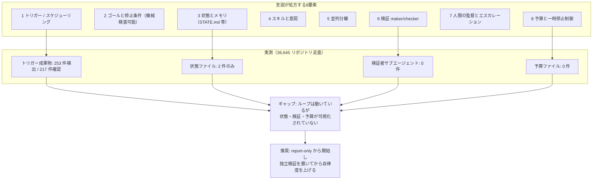
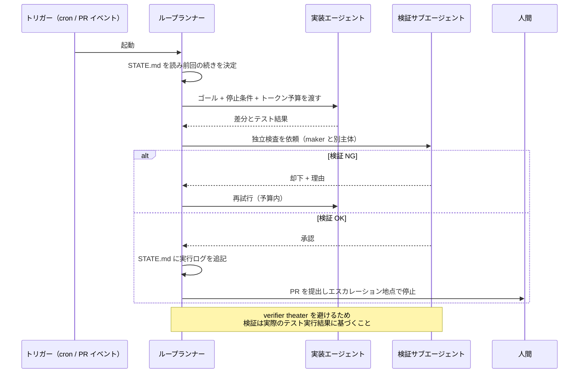
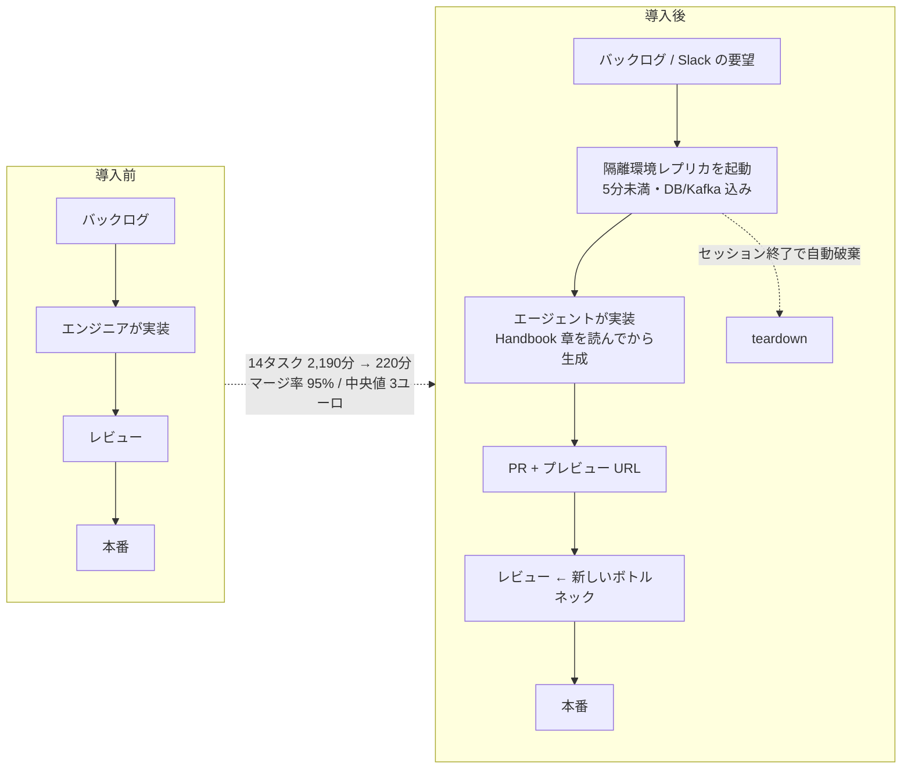
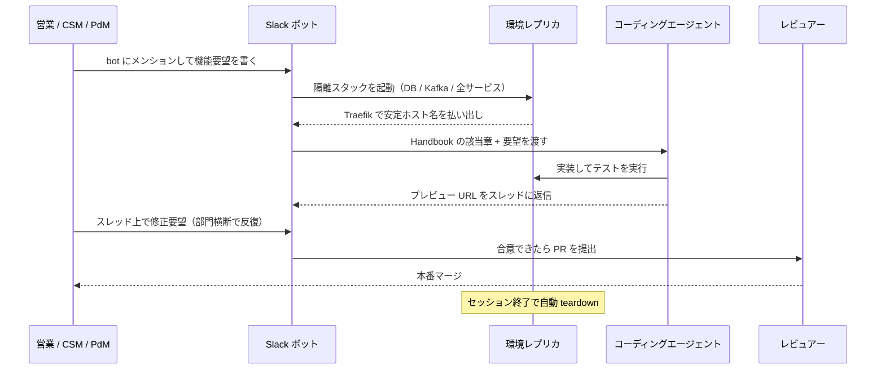
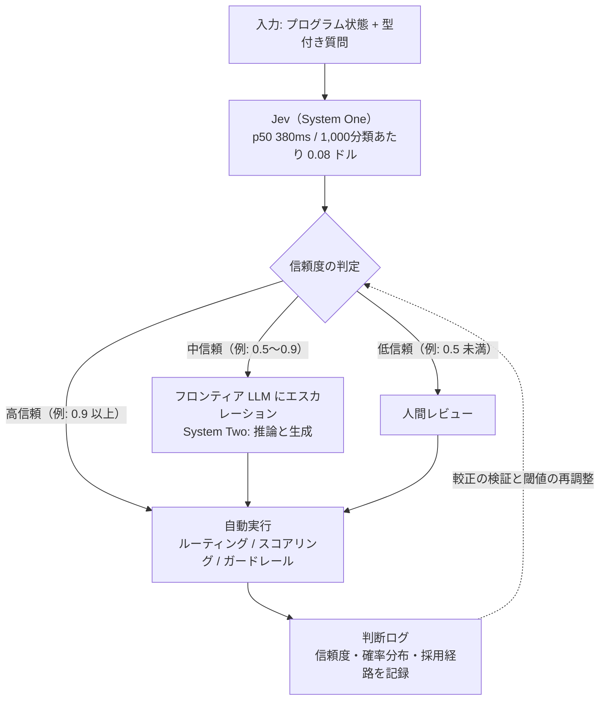
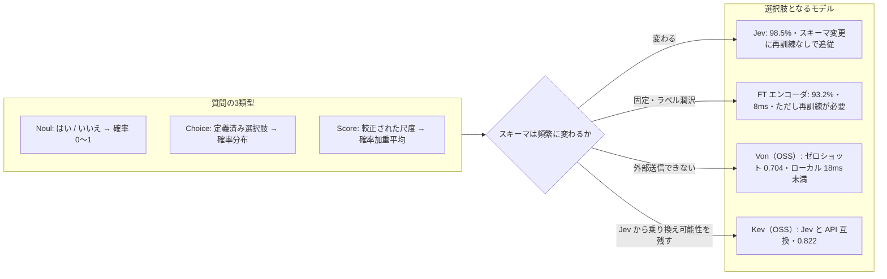

# Daily Briefing 2026-09-29

## 1. ループエンジニアリング：構成要素、普及状況、そして影響（原題: Loop Engineering: Building Blocks, Adoption, and Impact）

- **URL**: https://arxiv.org/abs/2608.21884
- **公開日**: 2026-08-22（v2: 2026-08-26）
- **著者・媒体**: Jai Lal Lulla, Vahram Nersesyan, Seyedmoein Mohsenimofidi, Christoph Treude, Sebastian Baltes / arXiv

### 本文翻訳

本論文は、2026年半ばに実務家コミュニティで急速に広まった「**ループエンジニアリング**」という実践を、初めて定義・整理し、その普及実態を大規模に測定したものである。著者らはこれを「**スケジュールまたはイベントによって起動され、各実行が機械検査可能な停止条件で区切られた、コーディングエージェントを反復的に呼び出す自動制御構造を設計すること**」と定義する。従来の「エージェントにプロンプトを打つ」行為との違いは、人間がプロンプターの座を降りることにある。Addy Osmani は2026年6月7日のブログで、これを「**エージェントにプロンプトを打つ人としての自分自身を置き換えること**」と表現し、同日 Peter Steinberger は「**もうコーディングエージェントにプロンプトを打つべきではない。ループを設計すべきだ**」と投稿した。技術的な原型は2025年7月、Geoffrey Huntley の "Ralph Wiggum" テクニック——`while :; do cat PROMPT.md | claude-code ; done` という素朴な bash ループ——にある。著者らはこのほか、Gergely Orosz のニュースレター調査（2026年7月14日、実務家の返信約210件を集計）、Cobus Greyling のコミュニティリポジトリ（7つのループパターン、L0〜L3の4段階の成熟度、失敗カタログ）、André Lindenberg の「これはエージェントの**使い方**が違うのではなく、**ソリューションアーキテクチャ**が違うのだ」という整理を、灰色文献としてレビューしている。

実務家の言説から抽出された**8つの構成要素**は以下の通りである。①**トリガーとスケジューリング**（周期またはリポジトリイベントで実行を開始する）②**ゴールと停止条件**（機械検査可能な完了基準）③**状態とメモリ**（実行をまたいで発見を永続化する）④**スキルと意図**（プロジェクト固有の持続的知識を符号化する）⑤**並列分離**（衝突なしに並行作業させる）⑥**検証（maker/checker）**（実装者とは別の主体が独立に検査し、却下できる）⑦**人間の監督とエスカレーション**（リスクの高い操作をゲートし、エスカレーションを受ける）⑧**予算と一時停止制御**（1実行あたりの支出に上限を置き、無人での変更を制限する）。良く設計されたループは「実行をまたいで状態を保持し、結果を独立に検証し、推論コストを制限し、承認なき無人変更を抑え、人間へのエスカレーション地点を定義する」ものだとされる。

続くマイニング研究が本論文の白眉である。著者らは「エンジニアリングされたソフトウェアプロジェクト」に分類される **36,710 リポジトリ**を走査した。その結果、スケジュールまたはイベントトリガーが資格を満たすエージェントを起動しているのは **36,645 中 253 リポジトリ**にとどまった。手作業で検証した **256 リポジトリのうち 217** で自律エージェントループの存在が確認され、これは**採用率 0.59%** に相当する（検出ヒューリスティックの精度 0.868、95% Clopper–Pearson 信頼区間 [0.820, 0.907]）。使われているツールの内訳は Claude Code が 217 件中 **189 件**と圧倒的で、以下 OpenAI Codex 11、OpenCode 6、Gemini CLI 5、Cursor 4、GitHub Copilot 2。起動契機で見ると、**スケジュールのみが 21、リポジトリイベントのみが 180（大半はプルリクエストレビュー）、両方が 15** である。実例として dimagi/commcare-android の日次ワークフロー（アーカイブ履歴上で 276 回のスケジュール実行）が挙げられている。

そして最も重要な発見は、**言説が処方する構成要素のうち、コミットされる形で存在するものがほぼ皆無だった**という点である。STATE.md / LOOP.md / 計画・進捗ファイル / 実行ログといった状態ファイルについて、著者らは「内容がループ構造（実行ログのエントリや最終実行スタンプ）を持つこと」を判定基準とし、さらに挙動シグナル——**ケイデンス**（コミット間隔が10分〜7日で規則的）、**作者**（コミットの過半が資格ツール由来）、**追記のみ**（日付付き実行ログ行の追加）——を課した。結果、**36,645 リポジトリ全体で基準を満たす状態ファイルはわずか2件**。「追記のみ」シグナルを示すファイルは1件もなく、ケイデンスと作者のシグナルが同居するファイルも1件だけだった。さらに、**予算ファイル（loop-budget.md / loop-constraints.md の類）は0件、ループ成果物から検証者として参照されるサブエージェントも0件**である。文書化された失敗モードには、実質的な検査をせずに承認する「**verifier theater（検証者の演技）**」が挙げられている。

考察で著者らは、「新しいのはループの機構そのものではなく、それが開発者の実践として採用されたことだ。開発者は**非決定的なワーカーを、自然言語のゴール条件と検証に統治された終了条件の背後に置いている**」と述べる。実務家の助言のうち最も一貫していたのは「**自律性を与える前に、エージェントの作業に対する独立した検証ステップを設計せよ**」と「**report-only から無人運用へ段階的に導入せよ**」の2点だったが、著者らは「直感的にはもっともらしいが、我々の知る限り**未検証である**」と釘を刺す。RQ3 に向けた統制実験が計画されており、**C1（対話的：開発者が各ステップにプロンプトを打つ）／C2（ゴール駆動：開発者が停止条件を渡して手放す）／C3（スケジュールループ：実行ごとの起動なしに反復）**の3条件を、タスクスループット、正しさ（テスト通過・リグレッション）、コスト（トークン・実時間）、人間の労力（対話タイムスタンプ、エスカレーション、レビュー往復、修正割合）で比較する。SWE-bench タスクによるエージェント単体ベンチマーク、既存データセットから種を得た対話条件のシミュレーション、実務開発者のバックログ作業のトレース収集が組み合わされる。

### 重要ポイント
- ループエンジニアリング＝「プロンプトを打つ人間」を置き換える設計行為。**トリガー＋機械検査可能な停止条件**が最小定義
- 実際の採用率は **0.59%**（36,710 リポジトリ中、確認済み 217 件）。言説の盛り上がりに対し実装は極めて薄い
- ツールは **Claude Code が 217 件中 189 件**と寡占。起動契機は **PR イベント主体（180 件）**でスケジュールのみは 21 件
- 言説が推奨する状態ファイルは全体でわずか**2件**、**予算ファイル0件、検証者サブエージェント0件**。「書かれている運用」と「実在する運用」の乖離が最大の知見
- 「自律化の前に独立検証を置け」という助言は**まだ実証されていない**。導入は report-only → 段階的自律が推奨されるが、効果測定は今後の統制実験待ち

### 図解





### 現場での適用方法

論文の最大の指摘は「**状態・検証・予算がリポジトリにコミットされていない**」ことなので、この3つを成果物として置くところから始める。

**スクリプト化の例①**: `.github/workflows/agent-loop.yml`（トリガー＋停止条件＋予算）

```yaml
name: agent-loop
on:
  schedule:
    - cron: "17 2 * * 1-5"   # 平日 02:17 UTC（分は 0 を避けて分散させる）
  workflow_dispatch:
permissions:
  contents: write
  pull-requests: write
concurrency:
  group: agent-loop          # 並列分離: 同時実行を1本に固定
  cancel-in-progress: false
jobs:
  loop:
    runs-on: ubuntu-latest
    timeout-minutes: 30       # 停止条件その1: 実時間の上限
    env:
      LOOP_MAX_ITERATIONS: "3"      # 停止条件その2: 反復回数
      LOOP_TOKEN_BUDGET: "300000"   # 予算: 1 実行あたりのトークン上限
      ANTHROPIC_API_KEY: ${{ secrets.ANTHROPIC_API_KEY }}
    steps:
      - uses: actions/checkout@v4
      - name: Run bounded loop
        run: ./scripts/agent-loop.sh
      - name: Commit run log
        run: |
          git config user.name  "agent-loop"
          git config user.email "agent-loop@<YOUR_DOMAIN>"
          git add STATE.md
          git diff --cached --quiet || git commit -m "chore(loop): append run log"
          git push
```

**スクリプト化の例②**: `scripts/agent-loop.sh`（機械検査可能な停止条件＋追記のみの状態ファイル）

```bash
#!/usr/bin/env bash
# 機械検査可能な停止条件で区切られたループ。report-only から始め、
# 十分に信頼できたら PROMOTE=apply に切り替える。
set -euo pipefail
MODE="${PROMOTE:-report}"          # report | apply
MAX="${LOOP_MAX_ITERATIONS:-3}"
STATE="STATE.md"

# 停止条件は「機械が判定できる」ものだけを書く
stop_condition_met() {
  npm run -s typecheck && npm run -s lint && npm test -- --silent
}

[ -f "$STATE" ] || printf '# Loop State\n\n| run_at | iteration | result | note |\n|---|---|---|---|\n' > "$STATE"

for i in $(seq 1 "$MAX"); do
  if stop_condition_met; then
    printf '| %s | %d | stop-condition-met | no action needed |\n' "$(date -u +%FT%TZ)" "$i" >> "$STATE"
    exit 0
  fi

  # 実装エージェント: ゴールと予算を明示して起動
  claude -p "$(cat .agent/GOAL.md)" \
    --allowedTools "Read,Edit,Bash(npm test:*),Bash(npm run lint:*)" \
    --max-tokens "${LOOP_TOKEN_BUDGET:-300000}" \
    > .agent/last-run.log 2>&1 || true

  # 検証サブエージェント: 実装とは別プロセスで、実際の検査結果に基づいて判定させる
  #（verifier theater 対策: 検証側には「テストを実行した出力」を必ず渡す）
  VERDICT=$(claude -p "$(cat .agent/VERIFY.md)" \
    --allowedTools "Read,Bash(npm test:*),Bash(git diff:*)" \
    --output-format text | tail -1)

  printf '| %s | %d | %s | %s |\n' "$(date -u +%FT%TZ)" "$i" "$VERDICT" "$MODE" >> "$STATE"

  if [ "$VERDICT" != "APPROVE" ]; then
    git checkout -- .            # 却下されたら差分を捨てて次の反復へ
    continue
  fi

  if [ "$MODE" = "report" ]; then
    git checkout -- .            # report-only 段階では適用しない
    exit 0
  fi
  exit 0
done
# 予算・反復を使い切ったら人間へエスカレーション
echo "ESCALATE: loop exhausted after ${MAX} iterations" >&2
exit 1
```

**スキル化の例**: 検証サブエージェントを `.claude/agents/loop-verifier.md` として実装者と分離する

```markdown
---
name: loop-verifier
description: ループが生成した差分を、実装者とは独立に検査して APPROVE / REJECT を返す。実装は絶対に行わない。
tools: Read, Bash(npm test:*), Bash(git diff:*)
---

あなたは検証者であり、実装者ではない。以下を必ずこの順で実施する。

1. `git diff` で変更差分を全て読む。
2. `npm test` を**実際に実行**し、その出力を根拠として引用する。
3. 次のいずれかに該当したら REJECT：
   - テストが1つでも失敗している
   - 差分が `.agent/GOAL.md` に書かれたスコープ外のファイルに及んでいる
   - テストが追加・変更されているが、対応する振る舞いの変更がない（テストの書き換えによる緑化）
4. 最終行に `APPROVE` または `REJECT` のみを出力する。理由はその前の行に書く。

テストを実行せずに APPROVE を返してはならない。
```

**CLAUDE.md への追記例**:

```markdown
## 自律ループの運用ルール
- ループの成果物（`STATE.md` / `.agent/GOAL.md` / `.agent/VERIFY.md` / `loop-budget.md`）は必ず Git にコミットする。ループの挙動をリポジトリから追跡できない状態にしない。
- `STATE.md` は**追記のみ**。過去の実行ログ行を書き換えたり削除したりしない。
- 停止条件は必ず機械検査可能な形（テスト・型チェック・lint の終了コード）で書く。「良さそうなら止める」は停止条件ではない。
- 実装エージェントと検証エージェントは必ず別セッションで動かす。実装した本人に検証させない。
- 新しいループは `PROMOTE=report` で最低2週間運用し、`STATE.md` の APPROVE/REJECT 履歴を見てから `apply` に昇格させる。
```

### 期待効果
- 論文の実測では自律ループの採用率は **0.59%** にすぎず、状態ファイル2件・予算ファイル0件・検証者0件。上記の4ファイルを置くだけで、**ループの挙動が Git で監査可能**になり、事後の原因追跡と改善が成立する
- 起動契機の内訳（**PR イベント 180 / スケジュールのみ 21**）が示す通り、最も実績のある入り口は**PR レビューのループ化**。既存の CI に載せやすく、投資回収が早い
- 停止条件・反復上限・トークン予算の明示により、暴走時の損失が1実行分に限定される（論文が挙げる「予算と一時停止制御」の実装）
- 「report-only → 段階的自律」の運用は実務家の合意事項。ただし論文は効果が**未検証**と明言しており、`STATE.md` の APPROVE/REJECT 履歴が自チーム内での実証データになる

### 注意点
- **verifier theater** が最大の落とし穴。検証エージェントに「テストを実際に実行した出力」を根拠として要求しないと、承認するだけの飾りになる。上記の `loop-verifier` で `npm test` を必須にしているのはこのため
- 論文が示した「独立検証を置けば安全に自律化できる」という助言は**まだ実証されていない**。無条件に信じて自律度を上げない
- 状態ファイルを追記のみにしないと、エージェント自身が過去の失敗記録を消してしまう。`STATE.md` を編集対象ツールから外すか、CI で追記のみを検査する
- スケジュール起動はリポジトリが静かな時間帯でも回り続けてコストを積み上げる。`concurrency` とトークン予算の両方を設定すること
- Claude Code への依存度が高い（189/217）。ツール固有のフラグ（`--allowedTools` 等）は移植性がないので、ループの骨格はシェル側に置きツール呼び出しだけを差し替え可能にしておく

---

## 2. AIネイティブへ：私たちはバックログをエージェントに手渡した（原題: Going AI-Native: How We Handed Our Backlog to Agents）

- **URL**: https://engineering.merciyanis.com/blog/going-ai-native-how-we-handed-our-backlog-to-agents
- **公開日**: 2026-04-20
- **著者・媒体**: Matthieu Jabbour（CTO）/ MerciYanis Engineering Blog

### 本文翻訳

MerciYanis は従業員25名の企業である。2025年11月にリリースされた Anthropic の Opus 4.5 と OpenAI の GPT-5.2 が、タスクを自律的に完遂できる水準に達したことを確認し、同社はエンジニアリング組織の運営そのものを組み替えた。

**まず計測から始めた。** 「エージェントは速い」という感触ではなく、比較可能な数字を作るために、実際のバックログ項目をエージェントと人間の双方に投げた。比較の公正性は厳格に管理された——①**入力は生のまま**とし、曖昧さも含めてエージェント向けに書き直さない ②**マージ基準は本番と同じ**で、CI と品質ゲートを全て通す ③**往復回数をコストとして計上する** ④トークン消費と金額を記録する ⑤ジュニアとシニアの双方から見積もりを別々に取る。

結果は以下の通りである。代表的な **14タスク**をエージェントは**合計220分**で完了した。同じタスクに対するシニアエンジニアの見積もり合計は **2,190分**である。すなわちシニア比で約 **10倍**、ジュニア比で約 **32倍**の速度。エージェントが出した PR の **95%** が通常のレビュー基準のまま本番へマージされた。大半のチケットはフィードバックの往復が**0回または1回**でマージに至っている。コストは**マージ済み PR 1件あたり中央値3ユーロ**、最も高かった外れ値は複数バグの一括クリーンアップで **28.80ユーロ**だった。

**次に組織を変えた。** ワークショップでの結論は「**コードを書くことはエンジニアのミッションだったことは一度もない**——それは道具だった」というものである。役割は「**プロダクトエンジニア**」へと移る。顧客リサーチ、UX 設計、実装、計測、反復までをエンドツーエンドで所有する役割だ。同時に**プラットフォームエンジニアリング**の重要性が跳ね上がった。日々数百件の PR をレビューし、UX の一貫性を保ち、技術的負債の爆発を防ぎ、インフラ負荷を捌く——これらの新しい要求に対し、プラットフォームエンジニアはパイプラインを回す係ではなく、**ベストプラクティスを体系化し社内ツールを作る**役割になった。

**MerciYanis Handbook。** 3ヶ月分のオンボーディング知識を Markdown のリポジトリに集約した。章立ては、エンジニアリング原則とアーキテクチャ、コードベースの構成、インフラ要件、ベストプラクティスとコーディング規約、テストガイドライン、PR 衛生の規約。Claude Code のカスタムスラッシュコマンドを作り、コード生成の前に**該当する Handbook の章を必ず読ませる**オーケストレーションにした。これにより品質は「だいたいいつも本番相当」から「**ほぼ100%の一貫性**」へ変わった。

**環境レプリケーション。** 並列エージェントセッションが同じ DB とインフラを共有していたため、競合状態と状態破壊が起きた。あるエージェントのスキーマ移行が、他のエージェントの独立した作業を壊す。解決策は**セッションごとに完全隔離された環境レプリカ**である。独立した DB、Kafka、メッセージブローカー、サービスインスタンスを持ち、クリーン状態から**5分未満で起動**する。Traefik が環境ごとの安定したホスト名にルーティングするのでポート衝突がない。セッション終了後は自動的に破棄される。これを可能にしたのは、①全サービスが既に Docker 化されていたこと ②モジュラーで軽量なスタック設計 ③クラウドネイティブでベンダー非依存なアーキテクチャ、の3点である。

**フルスタック起動プレイブック。** 決定的な要件は「**エージェントであれ人間であれ、まっさらなマシンから5分未満でプラットフォーム全体を起動できること**」だった。DB、メッセージキュー、全サービス、現実的なシードデータを含み、隠れた前提条件はゼロ。

**Slack ボット。** プロダクトチームの外へ広げるため、Slack ボットを用意した。ボットにメンションして機能要望を書く → ボットが隔離環境を立ち上げる → エージェントが隔離スタックに対して実行する → プレビュー URL をスレッドに返す。結果、**営業・CSM・オペレーションといった非技術職がローカル環境を構築せずに機能を出荷した**。公開スレッドで進むため、本番の PR レビューに入る前に部門横断で反復できる。副次的な用途として、コードに根拠を持った Q&A（ドキュメントやセキュリティの質問への回答）が生まれた。

**学び。** ①**ボトルネックは消えたのではなく移動した**——コーディングからコードレビューとプロダクト上の裁定へ。数十の同時進行ワークストリームの中で機能の整合性をどう保つかという、本来はもっと大きな規模で初めて出会う問題に直面している ②**スケールするコードレビューは未解決**——CI の強化、エージェント支援レビュー、レビュー前のエージェント同士のチェックを試したが、銀の弾丸はなかった ③**スタックのアーキテクチャが決定的**——設定より規約を重んじる意見の強いフレームワーク、水平スケール内蔵、「魔法」ではなく明示的な概念、これらがエージェントの有効性と一貫性を大きく左右した ④**初 PR までの時間は二度効く**——新人のオンボーディング摩擦を減らす投資（**10分未満**を達成）が、そのままエージェントの生産性に転化した。同じプレイブックが二度使える ⑤**エージェントは既存パターンに固着する**——手書きの参照実装が、以後のエージェント生成コード全てを形づくった。エンジニアは複雑・ドメイン固有・セキュリティ上重要なコードを書き続け、エージェントは確立されたパターンをスケールさせる。

**文化的移行。** 既存の役割にとってこの変化は「暴力的」だった。経営は、正直な対話、進化したポジションへの透明なキャリアパス、専用の学習時間を重視し、既存メンバーを轢き潰さないようにしたと述べている。移行は現在も進行中で、複数四半期にわたる見込みである。

### 重要ポイント
- **数字が先、組織変更が後**。14タスク220分 vs シニア見積もり2,190分（約10倍）、PR マージ率95%、PR 1件あたり中央値3ユーロという実測が意思決定の根拠になった
- 比較の公正性ルール（入力を書き直さない／本番と同じマージ基準／往復をコスト計上）が、この種の社内実験で最も真似すべき部分
- **並列エージェントには環境の完全隔離が必須**。DB・Kafka まで含めて5分未満で起動する使い捨てレプリカが前提条件
- **「初 PR までの時間」への投資は二度効く**——人間のオンボーディング10分未満化が、そのままエージェントの生産性になる
- ボトルネックはコーディングから**レビューとプロダクト裁定**へ移動した。ここは同社でも未解決で、AI導入の次の律速段階になる

### 図解





### 現場での適用方法

最初に取り組むべきは「**5分未満のフルスタック起動**」と「**Handbook を読ませてから生成させるスラッシュコマンド**」の2つ。この2つが揃うまで並列エージェントは増やさない。

**スクリプト化の例①**: `scripts/replica-up.sh`（セッションごとの隔離環境）

```bash
#!/usr/bin/env bash
# 1 エージェントセッション = 1 隔離スタック。5分未満で起動し、終了時に自動破棄する。
set -euo pipefail
SESSION="${1:?usage: replica-up.sh <session-id>}"
PROJECT="rep-${SESSION}"
export COMPOSE_PROJECT_NAME="$PROJECT"   # ネットワーク・ボリューム・コンテナ名を全て分離

# ポート衝突を避けるため公開ポートは持たせず、Traefik のホスト名でルーティングする
export APP_HOST="${SESSION}.dev.<YOUR_DOMAIN>"

docker compose -f docker-compose.yml -f docker-compose.replica.yml up -d --wait
./scripts/seed.sh                         # 現実的なシードデータ（隠れた前提条件をゼロに）

cat <<EOF
READY  https://${APP_HOST}
teardown: docker compose -p ${PROJECT} down -v
EOF
```

```yaml
# docker-compose.replica.yml — 隔離レプリカ用のオーバーレイ
services:
  app:
    labels:
      - "traefik.enable=true"
      - "traefik.http.routers.${COMPOSE_PROJECT_NAME}.rule=Host(`${APP_HOST}`)"
    ports: []                # 公開ポートを持たない = ポート衝突が起きない
  postgres:
    tmpfs: [ "/var/lib/postgresql/data" ]   # 使い捨て前提で高速化
  kafka:
    tmpfs: [ "/var/lib/kafka/data" ]
```

**スキル化の例**: `.claude/commands/feature.md`（Handbook の該当章を必ず読ませる）

```markdown
---
description: Handbook の規約に従って機能を実装する
---

以下の順序を厳守すること。順序を飛ばして実装を始めてはならない。

1. `handbook/01-principles.md` と `handbook/03-codebase-layout.md` を読む。
2. 実装対象に応じて該当章を追加で読む：
   - API を触る → `handbook/04-api-conventions.md`
   - DB スキーマを触る → `handbook/05-data-and-migrations.md`
   - UI を触る → `handbook/06-ui-and-design-system.md`
3. 既存の**参照実装**を1つ特定し、そのパターンに合わせる。新しいパターンを発明しない。
   新パターンが必要だと判断した場合は実装を止め、理由を書いて人間に確認する。
4. `handbook/07-testing.md` に従ってテストを書く。
5. `handbook/08-pr-hygiene.md` に従って PR を作る。

対象機能: $ARGUMENTS
```

**運用手順**: 社内で「エージェント vs 人間」の比較実験を公正に回す

```bash
# 1. 代表的なバックログ項目を 10〜15 件選ぶ（書き直さず、曖昧さもそのまま使う）
#    → 曖昧さへの対処能力込みで測るのが目的
# 2. 見積もりをジュニア / シニアの双方から別々に取り、実験前に記録する
cat > experiment/estimates.csv <<'EOF'
ticket_id,junior_minutes,senior_minutes
PROJ-101,240,90
PROJ-102,480,150
EOF

# 3. エージェント実行は 1 チケット 1 隔離環境で。往復回数とトークンを必ず記録する
for t in $(cut -d, -f1 experiment/estimates.csv | tail -n +2); do
  ./scripts/replica-up.sh "$t"
  claude -p "$(cat backlog/$t.md)" --output-format json > "experiment/runs/$t.json"
done

# 4. 集計は「本番と同じマージ基準を通ったか」で判定する。CI を緩めない
jq -rs '["ticket","rounds","usd","merged"], (.[] | [.ticket, .num_turns, .total_cost_usd, .merged])
        | @csv' experiment/runs/*.json > experiment/results.csv
```

**CLAUDE.md への追記例**:

```markdown
## エージェント実行の前提
- 1 セッション = 1 隔離環境。`./scripts/replica-up.sh <session-id>` で起動し、終了時に必ず teardown する。
  他セッションと DB / Kafka を共有しない（スキーマ移行が他セッションを壊すため）。
- 実装の前に必ず `handbook/` の該当章を読む。既存の参照実装のパターンに合わせ、新パターンを発明しない。
- 複雑なドメインロジック、セキュリティに関わるコード、新しいアーキテクチャパターンは人間が書く。
  該当すると判断したら実装を止めて確認を求めること。
- PR は 1 つの関心事に限定する。レビューが律速なので、差分を小さく保つことが最優先の品質指標。
```

### 期待効果
- 記事の実測値：**14タスクで 2,190分 → 220分（シニア比約10倍、ジュニア比約32倍）**、**PR マージ率 95%**、**往復0〜1回**、**マージ済み PR 1件あたり中央値3ユーロ**（最大外れ値 28.80ユーロ）
- Handbook を読ませるスラッシュコマンドの導入で、成果物の品質が「だいたい本番相当」から「**ほぼ100%の一貫性**」へ
- 隔離環境レプリカにより並列セッションの競合状態・状態破壊が解消し、並列度を上げられる
- 人間のオンボーディングを**10分未満**に短縮した投資が、そのままエージェントの生産性として二度回収される
- Slack ボット経由で**非技術職が自力で機能を出荷**でき、本番 PR 前に部門横断で仕様を収束させられる

### 注意点
- **これは25名の企業の事例**であり、数値をそのまま大企業や巨大モノリスに外挿できない。特に「5分未満でフルスタック起動」は既に全サービスが Docker 化・モジュラー化されていたから成立した前提条件
- **ボトルネックは消えず移動する**。同社もスケールするコードレビューは未解決だと明言している。エージェントを増やす前にレビュー体制の設計をすること
- **エージェントは既存パターンに固着する**ため、参照実装が悪いとその悪さが全生成物に増幅して伝播する。手書きの参照実装の品質が事実上のレバレッジ点
- 「設定より規約」の意見の強いフレームワークほどエージェントに向く。逆に暗黙の「魔法」が多いスタックでは同じ効果が出にくい
- **文化的移行は「暴力的」**と著者自身が書いている。数値だけ先行させると既存メンバーの信頼を失う。キャリアパスの提示と学習時間の確保を同時に設計すること

---

## 3. Jev と System One 決定モデルの登場：アーキテクチャ、評価、エコシステム統合（原題: Jev and the Emergence of System One Decision Models: Architecture, Evaluation, and Ecosystem Integration）

- **URL**: https://arxiviq.substack.com/p/jev-and-the-emergence-of-system-one
- **公開日**: 2026-09-26
- **著者・媒体**: Grigory Sapunov / ArXivIQ

### 本文翻訳

本稿は、TypeSafe AI の Jev を「**System One 決定モデル**」という新しいカテゴリの代表例として位置づけ、アーキテクチャ・評価手法・エコシステムを横断的に整理したものである。カーネマンの二重過程理論を借りた命名で、自己回帰的にテキストを生成するのではなく、**構造化された確率的分類**を実行する。著者はこれを「**知性の大いなるアンバンドリング**」——理解（comprehension）とテキスト出力（textual output）の分離——と呼ぶ。

**アーキテクチャ。** 中核は因果デコーダのバックボーンにスパースな Mixture-of-Experts（MoE）ルーティングを組み合わせたものである。共有 Key-Value キャッシュが最大 **32,768 トークン**のコンテキストを支える。複数の質問を並列に評価する際、分岐間でクロスアテンションが働かないようにする **Question Independence 機構**を持つ。出力側は listwise なオプション間相互作用と softmax 正規化を用いた専用の予測ヘッドである。この設計により、**フォーマット実行の失敗率は設計上 0%** になる——スキーマのハルシネーションが数学的に起こり得ない。

**性能。** フロンティア LLM との比較では、精度 **98.5%（Jev）対 99.0%（Gemini）**とほぼ互角でありながら、速度は約 **5倍**。コストは **1,000分類あたり 0.08ドル**で、GPT-5-mini の 0.38ドル、Claude Sonnet 5 の 6.43ドルと比べて大きく安い。レイテンシは **p50=380ms、p95=670ms** で、**ラベル数が増えても一定**である（自己回帰生成と異なり、選択肢を1トークンずつ吐き出さないため）。

**RLCD（Reinforcement Learning for Calibrated Decisions）。** 訓練上の革新は、**認識論的に正直な確率**を最適化する点にある。log loss や Brier スコアといった proper scoring rule を用い、「モデルが信頼度80%を割り当てたなら、実際に80%の頻度で正解する」状態を目指す。これが成り立って初めて、**閾値による自動化が安全に設計できる**。

**限界も明示されている。** 静的で定義の明確な問題にラベル付きデータが潤沢にある場合、ファインチューニング済みモデルに劣る。Banking77 ベンチマークでは **Jev が 80.1%** に対し、ファインチューニング済みエンコーダは **93.2%** を、しかも**ローカルで 8ms** のレイテンシで達成する。Jev の優位は、**再訓練なしにスキーマ変更へ動的に適応できる**点にある。また、閾値ロジックが安全に機能するには信頼度が適切に較正されていることが前提となる。

**オープンソースの対抗馬。** **Laya**（GitHub 19,000スター超、ModernBERT-large バックボーン、レイテンシ 32.8〜39.5ms）は速いが、ファインチューニングなしの箱出し精度は 0.362 と低い。**Von**（3.95億パラメータ）はゼロショット精度で優れ（**0.704** 対 Laya の 0.583）、ローカルで **18ms 未満**で走る。**Kev**（Qwen3.5 ベース）は Jev と **API 互換**で、ベンチマーク精度 **0.822**。

**デプロイパターン。** 最も実用的なのが「**JEV-as-a-Judge カスケード**」である。高信頼度の判断は Jev（高速・安価）にルーティングし、不確実なケースだけをフロンティア LLM にエスカレーションする。結果は **コスト40%削減**しつつ精度 **92.5%**（GPT-6 単独の 93.1% に対して）。もう一つが **NumericJev** で、階層的な決定木により多分割区間分割を使って連続値を抽出し、**平均絶対誤差 1.84%** を達成する。

**含意。** 著者はこれを「**デュアルプロセス型 AI スタック**」への転換と位置づける。推論と創造は生成モデルが担い、ルーティング・安全性・効率は System One モデルが担う。この分離は、人間が開放的な自然言語でコミュニケーションするのに対しソフトウェアは離散的な判断で動く、という根本的なミスマッチに対応するものだ、というのが結論である。

### 重要ポイント
- Jev はテキストを生成せず**型付きの判断を確率付きで返す**。スキーマ違反が設計上起こり得ない（フォーマット失敗率0%）
- 経済性が決定的：**1,000分類あたり 0.08ドル**（GPT-5-mini 0.38ドル、Claude Sonnet 5 6.43ドル）、**p50 380ms / p95 670ms でラベル数に依存しない**
- **RLCD による較正**が閾値自動化の前提。信頼度80%が実際に80%当たるからこそ、閾値ルーティングが安全に設計できる
- **カスケード（Jev で振り分け → 不確実なものだけ LLM）でコスト40%削減、精度は 92.5% と単独 LLM の 93.1% にほぼ匹敵**。既存システムに最も入れやすい形
- **静的な分類問題ではファインチューニング済みエンコーダに負ける**（Banking77: 80.1% 対 93.2%、しかも 8ms）。スキーマが頻繁に変わる領域でこそ優位

### 図解





### 現場での適用方法

いきなり自動化しない。**シャドーモードで較正を確認 → 閾値を決める → カスケードに載せる**の3段階で入れる。

**スクリプト化の例①**: シャドーモードで既存ロジックと突き合わせる（Python）

```python
# shadow_eval.py — 本番の判断は既存ロジックのまま。Jev の答えを並走させて較正を検証する。
import json, os
from collections import defaultdict
from typesafe import TypeSafe, Choice  # pip install typesafe-sdk

client = TypeSafe(api_key=os.environ["TYPESAFE_API_KEY"])
BUCKETS = [(0.0, 0.5), (0.5, 0.7), (0.7, 0.9), (0.9, 0.95), (0.95, 1.01)]

def classify(ticket: dict) -> tuple[str, float]:
    res = client.system_one(
        state={"ticket": ticket},
        questions={
            "category": Choice(
                "この問い合わせの種別は何か",
                {
                    "bug": "製品が期待通りに動作していない",
                    "billing": "請求・支払いに関する問い合わせ",
                    "howto": "使い方が分からないという問い合わせ",
                },
            )
        },
    )
    a = res.answers["category"]
    return a.value, a.confidence

# 較正の検証: 「信頼度 0.9 台の予測は、実際に 90% 当たっているか」を見る
stats = defaultdict(lambda: {"n": 0, "correct": 0})
for row in map(json.loads, open("labeled_tickets.jsonl")):
    pred, conf = classify(row["ticket"])
    lo_hi = next(b for b in BUCKETS if b[0] <= conf < b[1])
    stats[lo_hi]["n"] += 1
    stats[lo_hi]["correct"] += int(pred == row["label"])

print(f"{'bucket':<14}{'n':>6}{'actual_acc':>12}")
for (lo, hi), s in sorted(stats.items()):
    acc = s["correct"] / s["n"] if s["n"] else 0.0
    # 較正が取れていれば actual_acc はバケットの範囲内に収まる
    print(f"[{lo:.2f},{hi:.2f})  {s['n']:>6}{acc:>12.3f}")
```

**スクリプト化の例②**: カスケードルータ（Jev → LLM → 人間）

```python
# cascade.py — 高信頼は Jev で即決、中信頼は LLM、低信頼は人間。記事の報告値はコスト 40% 削減。
import os
from typesafe import TypeSafe, Choice
from anthropic import Anthropic

ts = TypeSafe(api_key=os.environ["TYPESAFE_API_KEY"])
llm = Anthropic()

AUTO_THRESHOLD = 0.90    # ここより上は自動実行（破壊的操作なら 0.95 以上を推奨）
HUMAN_THRESHOLD = 0.50   # ここより下は人間へ

def route(ticket: dict) -> dict:
    ans = ts.system_one(
        state={"ticket": ticket},
        questions={"category": Choice("種別は", {
            "bug": "製品が期待通りに動作していない",
            "billing": "請求・支払いに関する問い合わせ",
            "howto": "使い方が分からないという問い合わせ",
        })},
    ).answers["category"]

    if ans.confidence >= AUTO_THRESHOLD:
        return {"label": ans.value, "path": "jev", "confidence": ans.confidence}

    if ans.confidence < HUMAN_THRESHOLD:
        return {"label": None, "path": "human", "confidence": ans.confidence}

    # 中信頼帯のみフロンティア LLM にエスカレーション（ここがコストの大半を占める）
    msg = llm.messages.create(
        model="claude-sonnet-5-5",
        max_tokens=64,
        messages=[{"role": "user",
                   "content": f"次の問い合わせを bug / billing / howto のいずれかに分類し、"
                              f"単語ひとつだけ出力せよ。\n\n{ticket}"}],
    )
    return {"label": msg.content[0].text.strip(), "path": "llm",
            "confidence": ans.confidence}
```

**CLAUDE.md への追記例**（エージェントの判断点に System One を差し込む場合）:

```markdown
## 判断点に System One モデルを使うときのルール
- 「分類する」「振り分ける」「リスクを採点する」「ガードレールで弾く」だけの用途に
  生成 LLM を呼ばない。`lib/decisions.py` の `route()`（Jev ベース）を使う。
- 閾値は必ず定数として1箇所に定義し、マジックナンバーを散らさない。
  破壊的操作（削除・返金・本番デプロイ）のゲートは信頼度 0.95 以上を必須とする。
- 新しい判断点を追加するときは、先に `shadow_eval.py` を 1,000 件以上のラベル付きデータで走らせ、
  較正表（信頼度バケット vs 実測精度）を PR に貼ること。較正表なしに閾値を決めない。
- Jev は算術・計数・日付計算ができない。数値の比較や集計はコード側で行い、
  モデルには「状況の判定」だけを渡す。
- スキーマ（選択肢の定義）が半年以上固定で、ラベル付きデータが潤沢な分類は、
  ファインチューニング済みエンコーダの方が安く速い（Banking77: 93.2% / 8ms）。Jev に固執しない。
```

### 期待効果
- **コスト**: 1,000分類あたり 0.08ドル（GPT-5-mini 0.38ドル比で約1/5、Claude Sonnet 5 の 6.43ドル比で約1/80）
- **レイテンシ**: p50 380ms / p95 670ms、かつ**選択肢の数が増えても一定**。同期処理のパスに置ける
- **カスケード導入時**: 記事の報告で**コスト40%削減、精度 92.5%**（フロンティア LLM 単独の 93.1% に対し 0.6ポイント差）
- **フォーマット失敗率 0%**。JSON パース失敗やスキーマ違反のリトライ処理そのものが不要になる
- 数値抽出は NumericJev の階層的決定木で**平均絶対誤差 1.84%**

### 注意点
- **較正が取れていることが閾値自動化の大前提**。自ドメインのラベル付きデータで較正表を作らずに閾値を設定すると、「信頼度0.95」が実際には0.7しか当たっていない状態で自動実行してしまう
- **静的な分類問題では負ける**。Banking77 で Jev 80.1% に対しファインチューニング済みエンコーダ 93.2%、レイテンシも 8ms 対 380ms。スキーマが安定している領域では既存手法の方が優れる
- **算術・計数・日付・計測値が苦手**。「金額が閾値を超えているか」はコードで判定し、モデルには渡さない
- **入力はテキストのみ**（文字列・JSON）。画像や音声は扱えない
- 単一ベンダーの API に判断ロジックを依存させるリスクがある。API 互換の **Kev**（OSS、精度 0.822）やローカル実行可能な **Von**（18ms 未満）を退避先として評価しておくと、価格改定や可用性障害への耐性が上がる
- 本稿は一次情報（ベンダー公表値やベンチマーク）を整理した二次資料である。数値は自社ワークロードでの再現を前提に扱うこと
