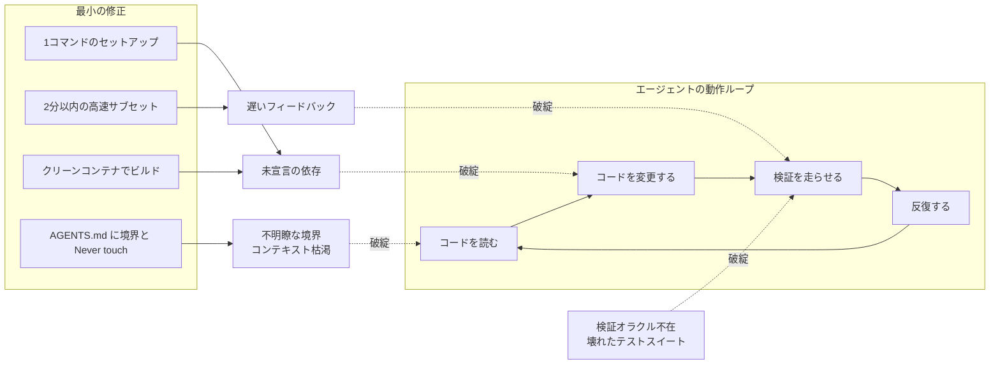
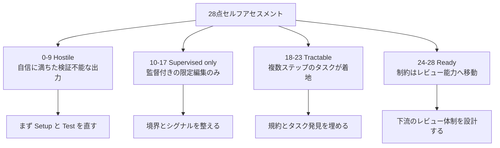
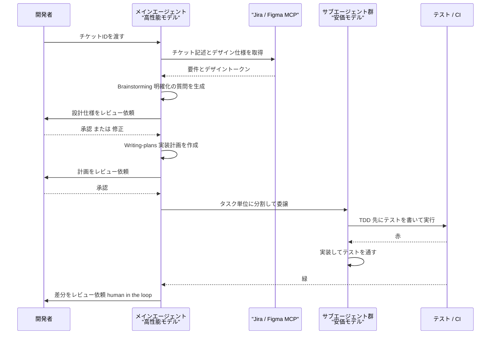
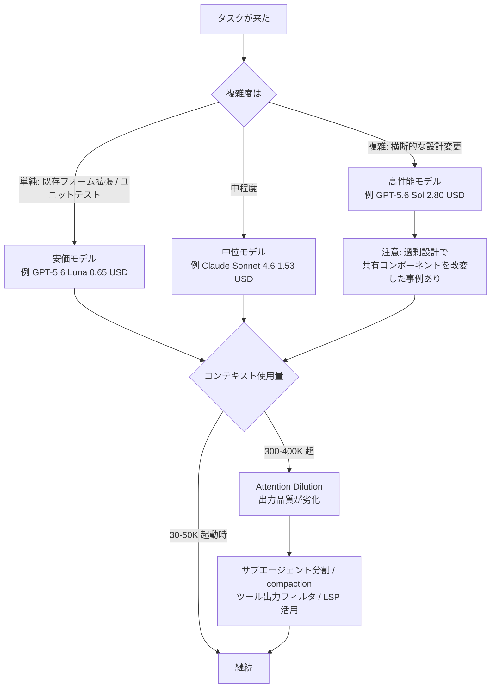
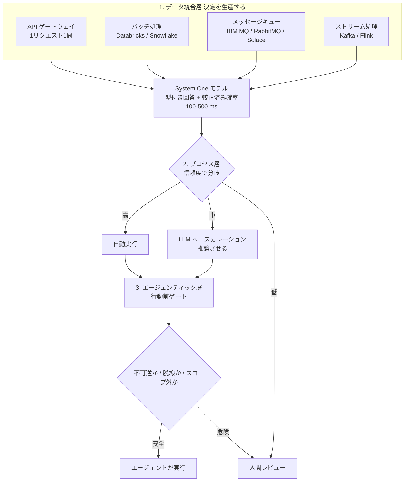
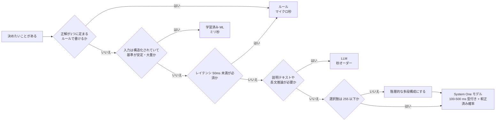

# Daily Briefing 2026-09-30

## 1. エージェント・レディネス — リポジトリをAIエージェント向けに整える（原題: Agent Readiness - Preparing a Repository for AI Agents）

- **URL**: https://infragap.com/agent-readiness/
- **公開日**: 不明（直近数週間以内。本文中で2026年7月時点のデータを参照）
- **著者・媒体**: InfraGap（インフラ実務ナレッジベース）

### 本文翻訳

本稿の主張は、評価の向きを反転させるところから始まる。「**AIコーディングエージェントは、それ自体の実力で成功したり失敗したりするのではない。初日の朝に新人エンジニアへ与えているものを、そのまま受け継ぐだけである**」。つまりエージェントの性能はツールの問題ではなく、**基盤（substrate）の問題**だという再定義である。DORAの調査を引いて「AIの主たる役割は増幅器であり、組織の既存の強みと弱みを拡大する」と述べ、クリーンなリポジトリを持つチームは加速し、脆いビルドを抱えるチームは既存の問題を複利で悪化させる、とする。

エージェントの動作ループは狭い。**コードを読む → コードを変更する → 検証を走らせる → 反復する**。レディネス要件はすべて、このループに情報を供給するか、ループの破綻を防ぐかのどちらかである。著者が挙げる致命的な失敗モードは4つ。**①検証オラクルの不在**（テストスイートが壊れている）、**②フィードバックループが遅い**（遅いとエージェントは変更のたびに検証するのをやめる）、**③宣言されていない依存**（環境の考古学に反復回数を食い潰す）、**④境界が不明瞭**（タスク途中でコンテキストウィンドウが枯渇する）。

続いて**11の評価軸**が、問い・失敗モード・最小の修正という形式で提示される。要点を挙げると——**Setup**: クリーンなチェックアウトから1コマンドで動作状態に到達できるか。できなければエージェントは実行時間の全部を環境調査に費やす。修正はREADMEの手順を1本のスクリプトに畳むこと。**Test**: 1コマンドでフルスイートが走り、失敗時に非ゼロで終了するか。さもなくばエージェントは検証の代わりに自信を代入する。**Speed**: 最速のフィードバックループは何秒か。遅ければエージェントは編集の合間にテストを走らせなくなる。**Hermeticity**: ビルドが宣言されていない要件に依存していないか。**Boundaries**: 典型的な変更が1モジュールを読むだけで済むか。**Conventions**: ハウススタイルが文章化されているか、暗黙知のままか（後者だと「CIは緑なのにコードは間違い」「説明できない却下」が起きる）。修正は「次に却下する理由をその場で書き留める」こと。**Signal**: 赤いビルドが毎回本当に壊れた変更を意味するか。さもなくばエージェントはフレーキーテストを「修理」してアサーションを弱める。フレークは許容せず別ジョブに隔離せよ。**Safety**: 絶対に編集・実行してはならないものの一覧が文書化されているか。修正は `AGENTS.md` に「Never touch」節を置き、CIで強制すること。

白眉は**28点満点の自己評価ルーブリック**である。6カテゴリ（セットアップとビルド／テストのフィードバック／環境とデータ／構造と境界／規約とスタイル／ドキュメントとタスク発見／シグナルと安全）に各4点が割り振られ、「高速サブセットが2分以内に終わる」「ツールバージョンが散文ではなくファイルで固定されている」「単一ファイルが約2,000行を超えていない」「直近3件の『うちのやり方ではない』という却下理由が書き留められている」「デフォルトブランチが直近10連続で緑」といった、**客観的に採点可能な**項目が並ぶ。合計点は4つの帯に対応する。**0〜9: Hostile（敵対的）**——エージェントは自信に満ちた検証不能な出力を出す。まずセットアップとテストを直せ。**10〜17: Supervised only（監督下のみ）**——スコープを絞った編集には有用だが自律実行はドリフトする。**18〜23: Tractable（扱える）**——ループが閉じ、複数ステップのタスクが着地する。残る穴は概ね規約とタスク発見。**24〜28: Ready**——制約は下流のレビュー能力へ移動する。

さらに、ギャップを炙り出す最小の再現実験として**スモークテスト**が提示される。クリーンなコンテナで clone → 文書化されたセットアップコマンド → 文書化されたテストコマンドを各ステップ計測しながら実行し、最後に**本番コードを1行わざと壊してテストが赤くなるか**を確認する。ステップ2の失敗が最も多く、これは宣言されていないセットアップ要件を意味する。ステップ4で緑のままなら、そのテストは誤答を認証していることになる。

公開されているフレームワークとして、Factory の Agent Readiness（9本の柱に100以上の自動シグナル、L1〜L5。ただし重み付けと手法が非公開でスコアが再現不能）と、kodustech/agent-readiness（MITライセンスのTypeScript CLI、7本の柱に39チェック、10以上の言語対応、ローカル実行でコードを外部送信しない。ただし2026年2月作成・同年7月時点79スターの若いプロジェクト）が比較される。

最後にコスト・ベネフィットの線引きが示される。**エージェントの有無にかかわらずやる価値があるもの**——高速で密閉されたテスト、決定的なフォーマット、1コマンドのセットアップ、シードされたローカルデータ、隔離されたフレーク、明確なモジュール境界。これらは人間のオンボーディングとインシデント対応で元が取れる。一方**雑務になりうるもの**——誰もメンテしない入れ子の `AGENTS.md` 階層、トレンドライン付きのレディネス・ダッシュボード、レベル定義に合わせるための動いているアーキテクチャの書き直し、数千語に膨らんだルールファイル。著者はスコアを最適化目標にすることを明確に戒め、正直な判定基準はあくまで行動的なものだとする。「**エージェントが実際のチケットを与えられ、人間の助けなしに、緑のスイートに到達しレビュアーが受け入れる差分を出せるか。そしてそれを月曜と同じ信頼性で火曜にもできるか**」。DORA調査では回答者の90%がAIを使う一方、30%が生成コードをほとんど信頼していないと報告しており、「内部プラットフォームの品質と、組織がAIの価値を引き出す能力には直接的な相関がある」と結ばれる。

### 重要ポイント
- エージェントの成否は**リポジトリという基盤の性質**。AIは増幅器であり、脆いビルドは問題を複利で悪化させる
- 致命的失敗モードは**検証オラクルの不在／遅いフィードバック／未宣言の依存／不明瞭な境界**の4つに集約される
- **28点ルーブリック**と4つの帯（Hostile / Supervised only / Tractable / Ready）で現状を客観採点できる。18点未満なら自律実行はドリフトする
- **スモークテスト**（clean container → setup → test → 1行壊して赤を確認）が最小の診断。ステップ2の失敗が最頻、ステップ4で緑ならテストが誤答を認証している
- レディネス施策の多くは**人間のオンボーディングでも元が取れる**。一方で入れ子AGENTS.mdや数千語のルールファイル、スコア・ダッシュボードは雑務になりやすい

### 図解





### 現場での適用方法

**(1) スモークテストをスクリプト化して定期実行する**

`scripts/agent-readiness-smoke.sh` として置き、CIの週次ジョブから回す。

```bash
#!/usr/bin/env bash
# scripts/agent-readiness-smoke.sh
# クリーンな環境でエージェントの動作ループが閉じるかを検証する
set -uo pipefail

REPO_URL="${REPO_URL:-<REPO_URL>}"          # 例: https://github.com/<ORG>/<REPO>.git
WORKDIR="$(mktemp -d)"
SETUP_CMD="${SETUP_CMD:-make setup}"
TEST_CMD="${TEST_CMD:-make test}"
BREAK_FILE="${BREAK_FILE:-<PATH/TO/PRODUCTION_FILE>}"

t() { local label="$1"; shift; local s=$SECONDS; "$@"; local rc=$?; \
      echo "[smoke] ${label}: exit=${rc} elapsed=$((SECONDS-s))s"; return $rc; }

echo "== Step 1: clone =="
t clone git clone --depth 1 "$REPO_URL" "$WORKDIR/repo" || { echo "FAIL: 外部依存でアクセスが阻まれている"; exit 1; }
cd "$WORKDIR/repo" || exit 1

echo "== Step 2: setup =="
t setup bash -c "$SETUP_CMD" || { echo "FAIL: 未宣言のセットアップ要件がある（最頻の失敗）"; exit 1; }

echo "== Step 3: test (green expected) =="
t test bash -c "$TEST_CMD" || { echo "FAIL: 「動いている」の共有定義が無い"; exit 1; }

echo "== Step 4: break one line (red expected) =="
printf '\nthis_line_is_intentionally_broken\n' >> "$BREAK_FILE"
if bash -c "$TEST_CMD"; then
  echo "FAIL: 1行壊してもテストが緑。テストが誤答を認証している"
  exit 1
fi
git checkout -- "$BREAK_FILE"
echo "[smoke] OK: 動作ループは閉じている"
```

**(2) CLAUDE.md / AGENTS.md への追記例**

レディネスの11軸のうち、エージェントが毎回必要とする「コマンド」「境界」「禁止事項」だけを書く。数千語に膨らませないこと。

```markdown
## コマンド（この3つだけが正）
- セットアップ: `make setup`（クリーンなチェックアウトから1コマンドで完了）
- 高速チェック（編集のたびに実行）: `make check` — 目標 120 秒以内
- フルスイート: `make test` — 失敗時は非ゼロで終了する

## 境界
- 典型的な変更は `<PACKAGE_DIR>/` 配下で完結する。他パッケージへ波及する場合は実装前に相談すること
- 生成コードは `gen/` 配下。**手で編集しない**。再生成は `make generate`

## Never touch（CI でも強制）
- `db/migrations/` の既存ファイル（新規追加のみ可）
- `.env*`、`secrets/`、本番向けの `deploy/prod/`
- フレーキーとして隔離済みの `tests/quarantine/`（緑に見せるための改変を禁止）

## 却下理由の記録（直近3件）
1. `any` 型での握りつぶし → 判別可能なエラー型を返すこと
2. 共有コンポーネントの直接改変 → 呼び出し側でラップすること
3. テストを後追いで書く → 先にテストを書いてから実装すること
```

**(3) 28点ルーブリックをIssueテンプレート化して四半期ごとに採点する**

```markdown
---
name: Agent Readiness Assessment
about: 四半期ごとのリポジトリ・レディネス採点（28点満点）
labels: ["agent-readiness"]
---
### セットアップとビルド（4点）
- [ ] クリーンなチェックアウトから **1つ** の文書化コマンドで動作状態に到達する
- [ ] そのコマンドが README / AGENTS.md に記載され、コピペで動く
- [ ] ランタイムと git だけのコンテナでセットアップが成功する
- [ ] ツールのバージョンが散文ではなくファイルで固定されている

### テストのフィードバック（4点）
- [ ] **1つ** のコマンドでフルスイートが走り、失敗時に非ゼロで終了する
- [ ] 反復用の高速サブセットが文書化されている
- [ ] 高速サブセットが 2 分以内に終わる
- [ ] 本番コードを1行壊すとスイートが赤くなる

### 環境とデータ（4点）
- [ ] VPN・共有シークレット・社内限定ホストを必要としない
- [ ] テストが必要とする全サービスがリポジトリ内のファイルから起動する
- [ ] 1コマンドで現実的な行を含むローカルDBをシードできる
- [ ] セットアップがリポジトリと自身のキャッシュ以外に書き込まない

### 構造と境界（4点）
- [ ] 典型的な変更が1ディレクトリ／パッケージ内で完結する
- [ ] モジュールの所有者と目的が推測ではなく文書化されている
- [ ] 頻繁に触る単一ファイルで約2,000行を超えるものが無い
- [ ] 生成コードが明示パスにあり、手編集されていない

### 規約とスタイル（4点）
- [ ] フォーマッタが自動でファイルを書き換える
- [ ] リンタが CI で動きマージをブロックする
- [ ] 直近3件の「うちのやり方ではない」却下理由が書き留められている
- [ ] エラー処理・ログ・命名の型が実例付きで示されている

### ドキュメントとタスク発見（4点）
- [ ] AGENTS.md がリポジトリルートにあり、実在のコマンドを書いている
- [ ] 記載コマンドを今月すべて実行し、動作した
- [ ] Open Issue にタイトルだけでなく受け入れ基準が書かれている
- [ ] TODO に担当者かチケットがある、または削除されている

### シグナルと安全（4点）
- [ ] デフォルトブランチが直近10連続で緑
- [ ] 既知のフレークが黙認ではなく隔離されている
- [ ] テスト失敗が expected と received を出力する
- [ ] エージェントが編集・実行してはならないものの一覧がある

**合計: __ / 28** → 0-9 Hostile / 10-17 Supervised only / 18-23 Tractable / 24-28 Ready
```

### 期待効果
- 採点により「どこから直すか」が一意に決まる。**18点未満では自律実行がドリフトする**ため、投資判断（監督付き運用に留めるか、自律化に進むか）を感覚ではなく点数で下せる
- 高速サブセットを**2分以内**に収めると、エージェントが編集のたびに検証を回すようになり、誤った変更が下流へ流れる量が減る
- スモークテストのステップ2失敗を潰すことで、エージェントの1実行あたりの「環境考古学」に費やされる反復が削減される
- DORAの知見どおり、**内部プラットフォーム品質とAI価値創出能力には直接的な相関**がある。レディネス施策は人間のオンボーディングとインシデント対応でも回収できる

### 注意点
- **スコアを最適化目標にしない**。著者が置く正直な判定基準は「実チケットを人間の助けなしに緑まで運び、レビュアーが受け入れる差分を出せるか、それを日をまたいで同じ信頼性で再現できるか」という行動的なもの
- 入れ子の `AGENTS.md` 階層、レディネス・ダッシュボード、レベル定義に合わせるための動作中アーキテクチャの書き直し、数千語のルールファイルは**雑務になりやすい**
- Factory の Agent Readiness は重み付けと手法が非公開でスコアが再現できない。kodustech/agent-readiness は MIT で手元実行できるが2026年2月作成・同年7月時点79スターと若く、出発点として適応させる前提で使うこと
- フレーキーテストは「エージェントに直させる」のではなく隔離する。放置するとエージェントがアサーションを弱める方向に「修理」してしまう

## 2. フロントエンド開発におけるAIエージェント：50件超の本番チケットから学んだこと（原題: AI Agents for Frontend Development: 50+ Production Tickets）

- **URL**: https://adjoe.io/company/engineer-blog/ai-agents-frontend-development-workflows-lessons-learned/
- **公開日**: 2026-08-14
- **著者・媒体**: Mohamed Foda / adjoe Engineers' Blog

### 本文翻訳

adjoe のフロントエンド開発者である著者は、**50件を超える本番チケット**をAIエージェントで処理した経験を報告する。対象は小さなバグ修正から**10,000行以上**にまたがる機能まで幅広い。本稿の中心は、「枠組みのある運用」と「枠組みのない運用」を同一タスクで走らせた比較実験である。

題材は、3択のトグルボタンと2つのカスタム入力を含むフォームセクションの実装。著者は同じタスクをエージェントに2回やらせた。一方は `AGENTS.md`（エージェントがコーディング前にコンテキストへ読み込む設定ファイル）と **Superpowers** フレームワークを整えた状態、もう一方はそれらが無い状態である。「**定義されたルール無しにAIエージェントと作業すると、しばしば一貫しない結果に至る**」というのが出発点の問題意識である。

Superpowers は開発を具体的な「スキル」に分解する。**Brainstorming**——エージェントが要件を収集し、明確化の質問を投げ、ユーザーレビュー用の設計仕様を作る。**Writing-plans**——設計仕様をもとに詳細な実装計画を作り、承認に出す。**Test-driven-development**——先にテストを生成し、それを満たすように実装する。**Subagent-driven-development**——計画をタスク単位に分け、専門サブエージェントで実行することで、エージェント1体あたりのコンテキストサイズを最小化する。

比較結果は示唆的である。**最初の動作版に到達するまでの時間は、枠組みの有無にかかわらず約2時間で同等だった**。差が出たのは中身である。枠組みありでは、エージェントはまず情報を収集し、明確化の質問をしてから実装に入った。枠組みなしでは、エージェントは明確化を挟まずいきなり実装に飛び込み、意図とずれた判断を下した。テストについては、枠組みありはTDDに従って先にテストを書いたのに対し、枠組みなしは明示的に指示しない限りテストを書かなかった。構造化されたガイダンスは、**TDDへの一貫した追従**、**重複ではなく既存コンポーネントの再利用**、**反復回数の減少**をもたらした。著者は「**適切に定義された枠組みの中でAIエージェントを使うことが、より一貫した結果につながる**」と総括する。

次にモデル選択の経済性が検証される。軽微なUIバグの修正に対し、同一プロンプトで3モデルを試したところ、いずれも5回の反復を要したが費用が大きく異なった。**GPT-5.6 Luna が 0.65ドル**、**Claude Sonnet 4.6 が 1.53ドル**、**GPT-5.6 Sol が 2.80ドル**である。Sonnet 4.6 は Luna の1.35倍、Sol は3.3倍の費用だった。しかも Sol は過剰設計に走り、**共有コンポーネントを改変してしまった**。ここから導かれる教訓は「**強力なモデルは複雑なタスクのために取っておくべきで、日常の単純なタスクには安価なモデルで十分**」というもの。著者は「既存フォームの拡張」や「ユニットテストの記述」を安価なモデル向きの例として挙げる。

コンテキストウィンドウの管理も重要な論点である。著者は「**コンテキストが大きくなると Attention Dilution（注意の希釈）が起き、モデルは重要な情報を見失う**」と指摘する。新規セッションを開始しただけで自動的に **30〜50Kトークン**が埋まり、指示ファイルを追加するとさらに膨らむ。そして **300〜400Kトークンを超えるとモデルの出力品質が劣化し始める**。対策として挙げられるのは、スコープを封じ込めるサブエージェント駆動のアプローチ、チェックポイントでのセッション圧縮（compaction）、rtk のようなフレームワークによるツール呼び出し出力のフィルタリング、そしてコードベースへの狙い撃ちクエリのための Language Server Protocol の活用である。

ツール構成としては、エージェントプラットフォームに **Opencode**、主モデルに **Claude Sonnet 4.6** を用い、チケット記述の取得に **Jira MCP**、デザイン仕様の取得に **Figma MCP** を接続している。設定例では、主たるビルドには強力なモデル、探索用サブエージェントには安価なモデルというように、エージェントごとに異なるモデルを割り当てられることが示される。

最後に著者が強調するのは、速度と品質の緊張関係である。自律実行に振り切って監督を最小化すると「**大きな技術的負債**」を生む。かといって全面的な人手レビューでは速度の利得が消える。著者が説くのは、自律実行と「human in the loop」のコードレビューのバランスであり、**AIエージェントを単なるコードジェネレータではなく協働者として扱うとき最も価値が出る**という立場である。「**結果の品質は、開発者がどれだけ効果的にゴールを定義し、コンテキストを提供し、判断を検証するかに依存する**」。

### 重要ポイント
- 枠組みの有無で**初回動作版までの時間は同じ約2時間**。差は「明確化の質問をするか」「TDDに従うか」「既存コンポーネントを再利用するか」という**プロセスの質**に出る
- 同一の軽微なUIバグ修正（いずれも5反復）で費用は **Luna $0.65 / Sonnet 4.6 $1.53 / Sol $2.80**。最も高価な Sol は過剰設計して共有コンポーネントを壊した
- **新規セッションだけで30〜50Kトークン**が消費される。**300〜400Kトークン超で出力品質が劣化**するため、サブエージェント分割・compaction・ツール出力フィルタ・LSP で抑える
- Superpowers の4スキル（Brainstorming → Writing-plans → TDD → Subagent-driven）が、そのまま再現可能なワークフローの型になる
- 監督を最小化した自律実行は「大きな技術的負債」を生む。**協働者として扱い、ゴール定義・コンテキスト提供・判断の検証**を人間が担う

### 図解





### 現場での適用方法

**(1) スキル化の例: `.claude/skills/frontend-ticket/SKILL.md`**

Superpowers の4段階をそのままスキルに落とし込む。

```markdown
---
name: frontend-ticket
description: フロントエンドのチケットを Brainstorming → Plan → TDD → Subagent 実行 の順で処理する。Jira チケットID または機能要望を受け取ったときに使う。いきなり実装に入らせないための枠組み。
---

# フロントエンドチケット実行手順

## 前提
- チケット記述は Jira MCP、デザイン仕様は Figma MCP から取得する
- 各段階の**あいだに必ず人間のレビューゲートを置く**。承認なしに次段階へ進まない

## 1. Brainstorming（実装しない）
チケットとデザインを読み、以下を埋めた設計仕様を出力して停止する。
- 目的 / 利用者にとっての完了条件
- 変更対象ファイルの一覧（`<PACKAGE_DIR>/` を越える場合は理由を明記）
- **再利用する既存コンポーネント**（新規作成する場合は、なぜ再利用できないかを書く）
- 曖昧な点を「明確化の質問」として最大5件

## 2. Writing-plans（実装しない）
承認された設計仕様から、実装計画を作って停止する。
- タスクを1タスク=1サブエージェントの粒度に分割する
- 各タスクに「満たすべき受け入れ基準」を紐づける

## 3. Test-driven-development
タスクごとに **先にテストを書き**、赤を確認してから実装する。
- 実装を先に書いてはならない
- `make check`（高速サブセット）で反復し、完了時のみフルスイートを回す

## 4. Subagent-driven-development
タスクを個別のサブエージェントへ委譲し、各サブエージェントのコンテキストを最小化する。
- 探索・調査系のサブエージェントには安価なモデルを割り当てる
- サブエージェントには「そのタスクに必要なファイルパスだけ」を渡す

## コンテキスト予算
- 起動時の 30-50K に加え、**合計 300K トークンに近づいたら compaction するか、タスクを分割し直す**
```

**(2) モデル割り当て設定の例（Opencode 等のエージェント設定）**

```jsonc
// <REPO_PATH>/opencode.jsonc
{
  "agents": {
    "main": {
      // 設計・横断的変更を担う。高価だが判断品質を優先
      "model": "claude-sonnet-5-5",
      "skills": ["frontend-ticket"]
    },
    "explorer": {
      // コードベース探索・ファイル特定のみ。安価モデルで十分
      "model": "claude-haiku-4-5-20251001",
      "tools": ["read", "grep", "glob"]
    },
    "test-writer": {
      // ユニットテスト記述。定型作業なので安価モデル
      "model": "claude-haiku-4-5-20251001"
    }
  },
  "mcp": {
    "jira":  { "command": "<JIRA_MCP_COMMAND>",  "env": { "JIRA_URL": "<JIRA_URL>" } },
    "figma": { "command": "<FIGMA_MCP_COMMAND>", "env": { "FIGMA_FILE_KEY": "<FIGMA_FILE_KEY>" } }
  }
}
```

**(3) CLAUDE.md への追記例（既存コンポーネント再利用の強制）**

枠組みなしの実行で起きた「重複実装」「共有コンポーネントの無断改変」を直接封じる。

```markdown
## UI 実装の鉄則
1. **新規コンポーネントを作る前に `<PACKAGE_DIR>/components/` を検索する。**
   再利用できない場合は、その理由を計画に明記してからでなければ新規作成しない
2. **共有コンポーネント（`<PACKAGE_DIR>/components/shared/`）を改変しない。**
   振る舞いを変えたい場合は呼び出し側でラップするか、事前に相談する
3. テストを先に書く。実装が先行した差分はレビューで差し戻す
4. 1タスクの差分が 400 行を超えそうなら、実装に入らず計画の再分割を提案する
```

### 期待効果
- 枠組みの導入で**反復回数が減り**、TDDへの追従と既存コンポーネント再利用が一貫する。初回到達時間は変わらなくても、後続のレビュー・手戻りコストが下がる
- タスク複雑度に応じたモデル割り当てで、単純タスクのコストを**最大 3.3分の1**（$2.80 → $0.65）に抑えられる
- コンテキストを **300Kトークン未満**に保つ運用で Attention Dilution による品質劣化を回避できる
- サブエージェント分割により、1体あたりのコンテキストが小さくなり、並行実行と再実行が安価になる

### 注意点
- **枠組みは「速くなる」施策ではない**。著者の実験では初回動作版までの時間は約2時間で同等だった。効果が出るのは一貫性と手戻りの側
- 高性能モデルほど良いとは限らない。最も高価だった Sol は**過剰設計して共有コンポーネントを改変**した。モデル選択は複雑度と「暴走リスク」の両面で決める
- 監督を最小化した自律実行は「大きな技術的負債」を生む。**human in the loop のコードレビューを外さない**
- コスト比較は5反復・単一タスクの観測であり、統計的に検証されたベンチマークではない。自チームのタスク分布で再計測すること
- モデル名・価格は2026年8月時点のもの。自組織で使えるモデルに読み替えて再評価が必要

## 3. Jevのような System One モデルはエンタープライズAIアーキテクチャをどう変えるか（原題: How System One Models Like Jev Change Enterprise AI Architecture）

- **URL**: https://www.kai-waehner.de/blog/2026/09/28/how-system-one-models-like-jev-change-enterprise-ai-architecture/
- **公開日**: 2026-09-28
- **著者・媒体**: Kai Waehner（データストリーミング／エンタープライズアーキテクチャ）

### 本文翻訳

著者の出発点は単純な観察である。「**エンタープライズソフトウェアの中にあるAIのほとんどは、何かを書いてはいない。決定している**」。それにもかかわらず日常的な分類タスクにテキスト生成モデルを使うのは非効率だ、というのが本稿の基礎命題である。ここから著者は、**System One モデル**を、従来のルール・学習済み機械学習・大規模言語モデルに次ぐ**第4の意思決定カテゴリ**として位置づける。

その最初の商用実装が **Jev**（TypeSafe AI、2026年9月15日ローンチ）である。特徴は、生成テキストではなく**較正済み確率を伴う型付きの回答**を返すこと、応答が**およそ100〜500ミリ秒**であること、価格が**入力100万トークンあたり0.042ドルで出力課金がゼロ**であること。学習手法は RLCD（Reinforcement Learning for Calibrated Decisions）とされるが未公開である。このモデルは従来的な意味で「ハルシネーションを起こす」ことができない——定義したスキーマの外側の値を返せないからである。ただし**スキーマ内で誤った選択肢を選ぶことはある**。v1.13 の既知の限界として、質問の字義どおりの解釈、算術・計数の弱さ、日付処理の問題、無関係なコンテキストが混ざると精度が落ちること、が挙げられる。

続く4方式の比較表が本稿の骨格をなす。**ルール**はレイテンシがマイクロ秒、入力は構造化データ、コストドライバは開発者の時間、決定論的ロジック向き。**学習済みML**はミリ秒、構造化入力、インフラと人のコスト、安定してラベル付けされたタスク向き。**決定モデル（System One）**は100〜500ミリ秒、自由テキスト入力、入力トークンがコストドライバ、**基準が変化するタスク**向き。**LLM**は秒オーダー、自由テキスト、出力トークンがコストドライバ、推論と生成向き。なお独立系のベンチマークでは、77カテゴリの意図分類で **Jev が 79.0%**、フロンティアLLMが **83.9〜86.2%** という統計的に有意な差が報告されている点も明記される。

エンタープライズアーキテクチャへの組み込みは**3層**で整理される。**①データ統合層**では4つの配置パターンが示される。**APIゲートウェイ**（リクエストごとに1問、応答へ直結。不正チェック等）、**バッチ処理**（Databricks / Snowflake 等でテーブル全体をスコアリング）、**メッセージキューイング**（IBM MQ / RabbitMQ / Solace 上のメッセージをスコアリング）、**ストリーム処理**（Kafka / Flink 上で、凝縮した状態を添えてイベントをリアルタイムにスコアリング）。**②プロセスインテリジェンス層**では、信頼度しきい値が自動ゲートとして機能する。**高信頼度→自動実行、中信頼度→推論のためLLMへエスカレーション、低信頼度→人間のレビュー**。統計的な出力の周囲に決定論的ルールを強制するため、Camunda のようなワークフローオーケストレータが必要になる。**③信頼できるエージェンティックAI層**では、行動前の安全チェックとして「これは不可逆か／脱線していないか／スコープ外ではないか」に答えさせる。Vercel の初期本番事例として、モデル置き換え後に**安全分類が18倍高速化**したと報告されている。

マルチモデル戦略の原則として著者が掲げるのは「**Decide high, route low（決定は上位で、ルーティングは下位で）**」である。統治された決定ゲートが許可モデルを定義し、技術的なルータはその制約の中で実行する。実装例としては、非規制領域のトリアージにホスト型モデル、保護対象データにオープンソース版、高信頼度からのエスカレーションにLLM、という組み合わせが挙がる。

データ主権については重大な制約が指摘される。**Jev はホスト型のみであり、推論時にデータが自社境界の外へ出る**。これに対しローンチから数日でオープンな代替が3つ登場した。**Laya**（ModernBERT ベース、3.22億〜4.21億パラメータ、100以上の言語）、**Kev**（Qwen3.5 上の LoRA アダプタ）、**SemIf-OpenJev**（Databricks のリファレンス実装）。ただし著者は釘を刺す。「**較正済みの信頼度こそ、公開領域で誰も並べていない部分である**」。オープンモデルを決定ゲートに使うなら、確率の妥当性を独立に検証する必要がある。

適合・非適合の線引きも明快である。**向いている**のは、非構造化ないし半構造化の入力（チケット、ログ、エージェントの行動）、基準が頻繁に変わる領域、単一アイテムに対する複数問のスコアリング、100〜500ミリ秒のレイテンシが許容される場面、信頼度ベースのエスカレーションに価値がある場面。**避けるべき**なのは、50ミリ秒未満の超低レイテンシ（決済オーソリ、トレーディング、OT制御）、正解が1つに定まるルール記述可能なロジック、安定した大量のラベル付きタスク（学習済みMLの方が効率的）、説明テキストの出力が必要なタスク、数値・日付の判断が決定の中核を占めるタスク、データを自社インフラから出せないケース（内部でオープンモデルを動かす場合を除く）、選択肢が非常に多いケース（1つの choice あたり255を超える場合は階層的な多段構成が必要）。

2026年9月時点の本番適用度について、著者の評価は「**有望な早期アクセスサービス**」である。公開レート制限は毎秒25万トークン・毎分1,200リクエストだが**予告なく変更されうる**。**SLAは公開されていない**。モデルバージョンは単一で、**較正しきい値はバージョン間で移植できない**。Vercel、Cloudflare、OpenRouter、Databricks が10日以内に採用したという急速な普及は、検証の成熟度を意味しない。推奨は、**バージョン固定したモデルIDをピンし、既存ロジックと並行してシャドーモードで走らせ、フォールバック経路を維持すること**。「このカテゴリが証明されるのは、複数のベンダーが競合する決定モデルを出荷し、企業が本番の数値を公開したときである。そのどちらもまだ起きていない」。

結びの洞察はアーキテクチャ上の位置づけである。System One モデルは各層をつなぐプリミティブであり、**統合層が決定を生産し、プロセス層が信頼度で分岐し、エージェンティック層が確率でゲートされる**。これにより、検証不能な安全性の主張ではなく、**監査可能な較正値という形で計測可能な信頼**が生まれる。

### 重要ポイント
- エンタープライズAIの大半は「書く」のではなく「**決める**」。System One モデルは、ルール／学習済みML／LLM に次ぐ**第4の意思決定カテゴリ**
- Jev は **100〜500ms**、**入力100万トークンあたり$0.042・出力課金ゼロ**、スキーマ外の値は返せない。ただし**スキーマ内での誤選択はある**（77カテゴリ意図分類で 79.0% 対 フロンティアLLM 83.9〜86.2%）
- 組み込みは3層。統合層の**4パターン**（APIゲートウェイ／バッチ／メッセージキュー／ストリーム）、プロセス層の**信頼度3分岐**（自動／LLMへエスカレーション／人間レビュー）、エージェント層の**行動前ゲート**
- Vercel の初期本番事例で**安全分類が18倍高速化**。一方 Jev は**ホスト型のみ**でデータが境界外へ出る。Laya / Kev / SemIf-OpenJev といったオープン代替は登場したが**較正済み信頼度だけは誰も並べていない**
- 2026年9月時点で **SLA非公開・しきい値はバージョン間で移植不可**。バージョンIDをピンし、**シャドーモード**で並走させ、フォールバックを残すこと

### 図解





### 現場での適用方法

**(1) シャドーモードの導入スクリプト（既存ロジックと並走させ、切り替えない）**

```python
# <REPO_PATH>/decisions/shadow.py
# 既存ロジックを唯一の正とし、System One モデルの答えは記録だけする
import os, time, json, logging

MODEL_ID = os.environ["DECISION_MODEL_ID"]  # 例: "jev-1.13" ←必ずバージョンをピンする
log = logging.getLogger("decision.shadow")

def decide(state: dict) -> str:
    """本番の決定は既存ロジックが行う。モデルは影で走らせて比較するだけ。"""
    truth = legacy_rule_engine(state)          # 既存の正
    try:
        t0 = time.perf_counter()
        r = decision_model_client.ask(
            model=MODEL_ID,                    # バージョン固定
            state=state,
            questions=[{
                "name": "category",
                "type": "choice",
                "options": ALLOWED_CATEGORIES, # 255 以下に収める
            }],
            timeout=0.8,                       # 100-500ms 想定 + 余裕
        )
        latency_ms = (time.perf_counter() - t0) * 1000
        log.info(json.dumps({
            "model_id": MODEL_ID,
            "shadow_answer": r["category"]["value"],
            "confidence": r["category"]["confidence"],
            "legacy_answer": truth,
            "agree": r["category"]["value"] == truth,
            "latency_ms": round(latency_ms, 1),
        }))
    except Exception as e:                     # フォールバック経路は常に残す
        log.warning("shadow decision failed: %s", e)
    return truth                               # ← 本番の振る舞いは一切変えない
```

**(2) 信頼度しきい値を「プロセスの設定」として外出しする**

しきい値はモデルではなくプロセスに属し、バージョン間で移植できない。コードに直書きせず設定ファイルにする。

```yaml
# <REPO_PATH>/config/decision-policy.yaml
# 注意: しきい値はモデルバージョンごとに再較正が必要。model_id を必ず併記する
model_id: "jev-1.13"
recalibrated_at: "2026-09-30"

policies:
  support_ticket_routing:      # 低リスク: 誤っても差し戻せる
    auto_execute_above: 0.85
    escalate_to_llm_above: 0.55
    else: human_review

  account_restriction:         # 高リスク: 不可逆に近い
    auto_execute_above: null   # 自動実行は禁止。確信度が高くても人間が決める
    escalate_to_llm_above: 0.90
    else: human_review

  agent_pre_action_gate:       # エージェントの行動前ゲート
    questions:
      - name: is_irreversible
        type: choice
        options: ["yes", "no"]
      - name: is_off_task
        type: choice
        options: ["yes", "no"]
      - name: is_out_of_scope
        type: choice
        options: ["yes", "no"]
    block_if_any_yes_above: 0.60   # どれかが yes 側で 0.60 を超えたら止める
```

**(3) 運用手順: シャドー → カナリア → 本番**

```bash
# Step 1. 評価セットを作る（通常ケース・境界ケース・稀ケース・敵対的言い回し・needs_review 相当を混ぜる）
#         しきい値は本番トラフィックではなくこのラベル付きセットから決める

# Step 2. シャドーモードで最低2週間並走させ、一致率・信頼度分布・レイテンシを記録
grep '"agree"' <LOG_PATH>/decision-shadow.log | jq -s '
  { n: length,
    agree_rate: (map(select(.agree)) | length) / length,
    p95_latency_ms: (map(.latency_ms) | sort | .[(length*0.95|floor)]) }'

# Step 3. 低リスクのユースケースだけカナリア投入（トラフィックの 5% など）
#         高リスク（決済・アカウント制限・削除・本番デプロイ）は信頼度が高くても
#         決定論的ゲートを必ず残す

# Step 4. モデルバージョンを上げるときは Step 1 からやり直す
#         （しきい値はバージョン間で移植できない）
```

### 期待効果
- 分類・ルーティング・ゲーティングをLLMから置き換えると、レイテンシが**秒オーダーから100〜500ms**へ、コストドライバが**出力トークンから入力トークン**（$0.042/百万入力・出力課金ゼロ）へ移る
- Vercel の初期本番事例では**安全分類が18倍高速化**した
- 信頼度による3分岐（自動／LLMエスカレーション／人間）で、**LLM呼び出しを高信頼度ケースに限定**でき、全体の推論コストと待ち時間を圧縮できる
- 「検証不能な安全性の主張」ではなく**監査可能な較正値**が残るため、ガバナンス上の説明責任が果たしやすくなる

### 注意点
- **精度はフロンティアLLMに劣る**（77カテゴリ意図分類で 79.0% 対 83.9〜86.2%、統計的に有意）。「速くて安い」は「正確」ではない
- ハルシネーションはしないが、**スキーマ内で誤った選択肢を選ぶ**。型で守られるのは値域だけである
- **Jev はホスト型のみでデータが自社境界を出る**。データ主権要件がある場合は Laya / Kev / SemIf-OpenJev 等を検討するが、**較正済み信頼度は公開領域で誰も並べていない**ため、確率の妥当性を独立に検証してからでないとゲートに使えない
- **SLA非公開、レート制限（25万トークン/秒・1,200リクエスト/分）は予告なく変更されうる**。モデルIDをピンし、フォールバック経路を必ず残す
- **較正しきい値はバージョン間・質問タイプ間で移植できない**。バージョンを上げたら評価セットから再較正する
- 避けるべき領域が明確にある——50ms未満の超低レイテンシ、ルールで書ける単一正解、安定した大量ラベル付きタスク、数値・日付判断が中核のタスク、1 choice あたり255超の選択肢
- v1.13 の既知の限界として、質問の字義どおりの解釈、算術・計数の弱さ、日付処理、無関係なコンテキスト混入による精度低下がある
- 2026年9月時点の位置づけは「有望な早期アクセスサービス」。Vercel / Cloudflare / OpenRouter / Databricks の10日以内の採用は検証成熟度を意味しない
