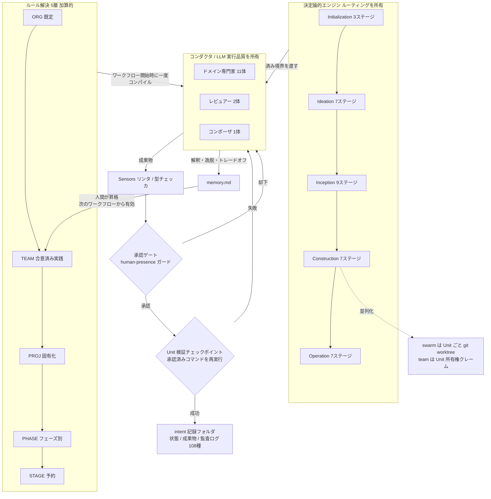
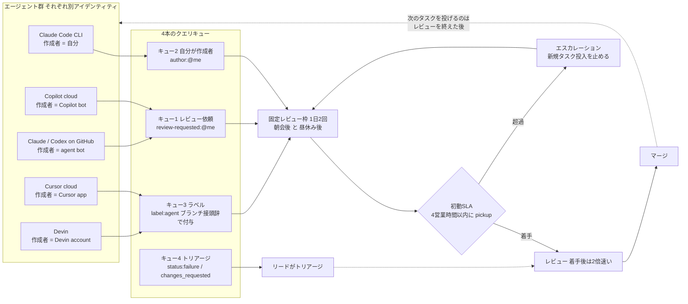
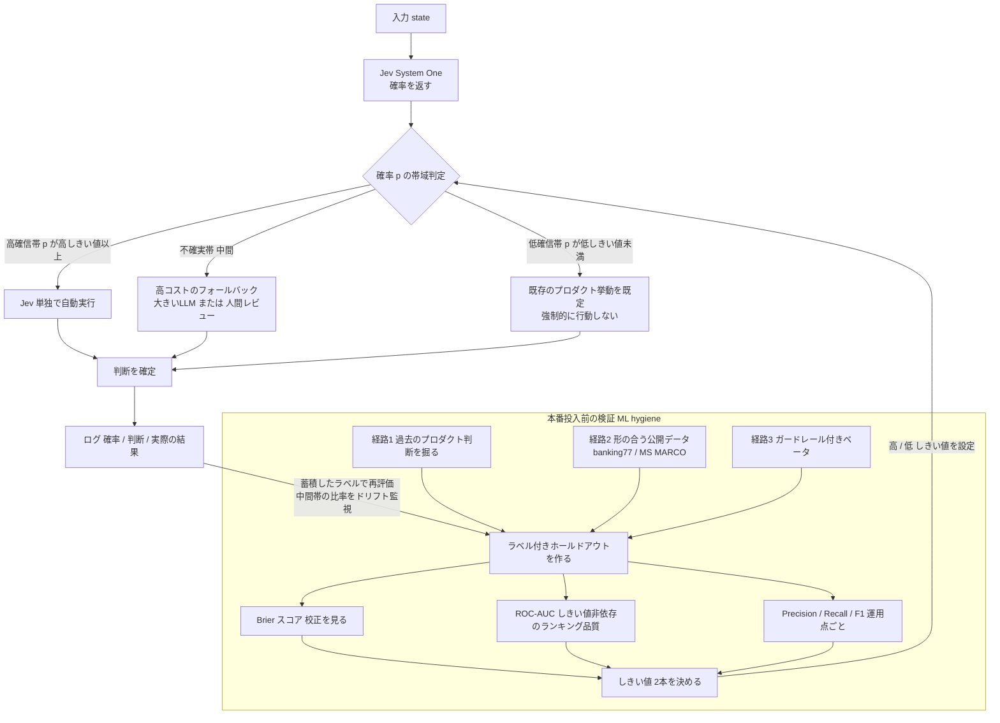

# Daily Briefing 2026-10-02

## 1. AI-DLC v2: AWSのAI-DLC Workflows 2.0で何が変わったか（原題: AI-DLC v2: What Changed in AWS's AI-DLC Workflows 2.0）

- **URL**: https://felipefontoura.com/articles/ai-dlc-v2/
- **公開日**: 2026-09-02（2026-10-01 更新）
- **著者・媒体**: Felipe Fontoura（個人ブログ）

### 本文翻訳

AI-DLC 2.7.0（2026年9月1日リリース）は、増分アップデートではなく完全な書き直しである。v1 は「ルールファイル群」としてエージェントに手順を教える方式だったが、v2 はネイティブな `aidlc` コマンドとして、複数のコーディングプラットフォームに対して**ひとつの決定論的ワークフローをインストールする**形に変わった。

アーキテクチャ上の最大の転換は責務分離である。著者の言葉では「エンジンがルーティングを所有し、コンダクタが実行品質を所有する」。v1 ではモデル自身がステージを選び、自分の出力を自己採点し、ワークフローの状態ファイルまで編集できた。v2では、ステージの順序とゲートは決定論的なエンジンが扱い、言語モデルは承認された境界の内側で作業を実行するだけになる。

ライフサイクルは **5フェーズ・33ステージ**に整理された。Initialization（3ステージ、ワークスペースの自動セットアップ）、Ideation（7ステージ、実現可能性とスコープの検証）、Inception（9ステージ、要件・設計・Unit分解）、Construction（7ステージ、Unitごとのコードとテスト）、Operation（7ステージ、デプロイ・可観測性・フィードバック）である。

エージェントは **14体**が名前付きで定義される。11体のドメイン専門家（プロダクト、デザイン、デリバリ、アーキテクト、AWSプラットフォーム、コンプライアンス、DevSecOps、開発者、品質、パイプライン/デプロイ、運用）、2体のレビュアー（product-lead、architecture）、そしてカスタムワークフロー用のコンポーザ1体である。

**11のワークフロープロファイル**が用意された。主要なものは Classic（18ステージ、v1 相当の儀式量）、Express（10ステージ、要件からコードへの近道）、Feature（33ステージ全部、本番標準）、Bugfix（9ステージ）。加えて Enterprise、MVP、Proof of Concept、Refactor、Infrastructure、Security Patch、Workshop の7種があり、独自経路は `/aidlc compose` で作る。

**学習ループ**が組み込まれた。各ステージは `memory.md` に Interpretations（解釈）、Deviations（逸脱）、Tradeoffs（トレードオフ）、Open Questions（未解決の問い）という見出しで記録を残す。承認ゲートでエージェントは自分の解釈を提示し、人間はそのどれをプロジェクトルール／チームルールに昇格させるかを選ぶ。重要な制約として「ルールは次のワークフローの最初のステージから適用される。現在のワークフローの途中では決して適用されない」——ルールのコンパイルはワークフローごとに一度だけである。

**検証付きConstructionチェックポイント**は、ステージ単位の承認を Unit 単位の検証に置き換える。人間は検証コマンド（例: `bun test`、`pytest`）を一度承認し、エンジンは以後すべてのチェックポイントでそれを再利用する。「手書きの証明ファイルは Unit を検証できない」。並列Constructionには、Unitごとに git worktree を切って同時にビルドする **swarm 実行**と、Unit の所有権をクレームして各自のチェックアウトで進める **team モード**がある。

ルールは**5層で加算的に解決**される: ORG（フレームワーク既定）、TEAM（チームが合意した実践）、PROJ（プロジェクト固有化）、PHASE（フェーズ別ルール）、STAGE（将来用に予約）。ルールは `aidlc/spaces/<space>/memory/` 配下の素のMarkdownであり、Sensors は出力に対して発火する決定論的チェック（リンタ、型チェッカ）である。

記録は intent ごとのフォルダ `aidlc/spaces/<space>/intents/<intent_id>/` に集約され、ステージごと6状態のチェックボックスを持つ状態ファイル、全成果物、質問ファイル、108種のイベント型を持つ追記専用の監査ログが入る。`/aidlc-session-cost`、`/aidlc-replay`、`aidlc attest` といったコマンドが使える。

Guard Policy（strict/relaxed/off）は5つのフェンスを制御する。特に「あなたに出されたゲートは、あなたからの本物のメッセージを必要とする。human-presence ガードはワークフロー単位では下げられない」——マシン全体の環境変数でしか変更できない。

v2 が吸収して**不要にした自家製レイヤ**: 共有状態からの再開（→6状態チェックボックスと `/aidlc --resume`）、ルールのパッチ当て（→加算のみのプラグイン機構）、ビルド後レトロスペクティブ（→学習ループ）、worktree 並列化（→swarm モード）、単一リポジトリ前提の回避策（→マルチリポ intent）、セッションのアーカイブ（→intent 単位の記録フォルダ）。

逆に v2 でも置き換えられない「判断」が残る: アンチパターンの回避（生成コードを手編集しない、大きな変更の前に影響分析を要求する）、事前儀式（エントリ文書、情報源の選別、複雑度トリアージ）、Mob の構成（意思決定権限を持つ人だけを入れる）、ペース（1時間セッション、マネージャの同席、ゲートでの休止——「疲れた人間は何でも承認してしまう」）、組織知（社内ライブラリ、意思決定記録、信頼できる文書の置き場所）、そして「使わない判断」——「1行の変更には、どのバージョンの AI-DLC も要らない」。

移行の指針: 進行中の v1 ワークフローは現行バージョンで完了させ、新しい intent から v2 を使う。最初の v2 ワークフローは Classic プロファイルを選べばチームを再教育せずに v1 の儀式を再現できる。慣れたら Feature に昇格する。自家製オーバーレイは仕分けし、配管に相当するものはネイティブ機能があるので削除、組織的判断はルールまたはチームメモリに移植する。

対応ハーネスは7種（Claude Code、Kiro CLI、Kiro IDE、Codex CLI、Cursor、opencode、GitHub Copilot）、推奨モデルは Claude Opus 4.8。結論は「判断を作り、配管は借りろ。組織がどう決めるかをコード化する部分にエンジニアリング時間を使い、汎用の機械部分は薄く保て。ベンダーがすぐ出荷してくるからだ」。

### 重要ポイント

- v1 の「モデルが自己ルーティング・自己採点」をやめ、**決定論的エンジンがステージ遷移とゲートを所有**、LLM は承認済み境界内の実行に限定する設計に変わった
- 承認単位が「ステージごと」から「Unit ごとの検証コマンド実行」に移り、人間が検証コマンドを一度承認すればエンジンが再利用する（手書きの証明ファイルは無効）
- 学習ループは `memory.md` の4見出し（解釈・逸脱・トレードオフ・未解決の問い）で蓄積し、**昇格したルールは次のワークフローからのみ効く**（走行中の変更を禁止）
- 自家製の「配管」（worktree 並列化、状態再開、レトロスペクティブ、セッションアーカイブ）はフレームワークが吸収した。残すべき自社資産は組織の判断基準だけ
- プロファイルで儀式量を選べる（Bugfix 9 / Express 10 / Classic 18 / Feature 33ステージ）。1行修正にフレームワークを適用しないことも明示された判断

### 図解



### 現場での適用方法

v2 の思想は「配管はフレームワークに任せ、組織の判断だけを資産化する」である。AI-DLC を導入していないチームでも、**判断の層を Markdown ルールとして切り出す**部分はそのまま真似できる。

**1) TEAM 層ルールの実例（`aidlc/spaces/<SPACE_NAME>/memory/team.md`）**

v2 のルールは素の Markdown である。承認ゲートで昇格させる前提で、以下の粒度で書く。

```markdown
# TEAM ルール

## 承認ゲートの運用

- セッションは60分で切る。ゲート前に残り時間が10分未満なら、承認せず次セッションに回す。
- ゲート応答は「OK」「LGTM」だけでは通さない。何を確認したかを1行以上書く。
  （human-presence ガードは strict 固定。ワークフロー単位で下げてはならない）
- Mob に入るのは意思決定権限を持つ人だけ。観戦者は録画を見る。

## Unit 検証コマンド

このプロジェクトで承認済みの検証コマンドは以下のみ。
手書きの proof ファイルは検証として認めない。

| 対象 | コマンド |
|------|---------|
| バックエンド | `pytest -q tests/unit` |
| フロントエンド | `bun test` |
| 型 | `mypy src/` + `bunx tsc --noEmit` |

## 生成コードの扱い（アンチパターン）

- 生成されたコードを手で編集しない。直したい場合はルールか spec を直して再生成する。
- 3ファイル以上に跨る変更の前に、必ず影響分析を要求する。

## AI-DLC を使わない判断

次に該当する変更はワークフローを起動しない（1行変更にフレームワークは要らない）:

- 文言・定数・バージョン番号のみの変更
- 自動生成物の再生成のみ
- revert
```

**2) PROJ 層ルールの実例（`aidlc/spaces/<SPACE_NAME>/memory/project.md`）**

組織知（社内ライブラリ・信頼できる文書の置き場所）は v2 でも自前で書くしかない部分なので、ここに集約する。

```markdown
# PROJ ルール

## 信頼できる情報源（これ以外を根拠にしない）

1. `docs/adr/` — 意思決定記録。アーキテクチャ判断の唯一の正典
2. `docs/api/openapi.yaml` — 外部 API 契約
3. 社内ライブラリ `<ORG>/platform-sdk` の README（バージョン固定: v4.2.x）

Web 検索結果や一般的なベストプラクティスは、上記と矛盾する場合は採用しない。

## プロファイル選択

| 変更の種類 | プロファイル |
|-----------|-------------|
| 本番機能 | Feature（33ステージ） |
| 障害対応・バグ修正 | Bugfix（9ステージ） |
| 社内ツール・検証 | Express（10ステージ） |
| 移行初期の全案件 | Classic（18ステージ） |
```

**3) 学習ループを AI-DLC なしで回すスクリプト（`scripts/promote-memory.sh`）**

`memory.md` の「解釈」を人間がルールに昇格させる動作は、どのハーネスでも手で再現できる。

```bash
#!/usr/bin/env bash
# 使い方: scripts/promote-memory.sh <intent_id>
# memory.md の Interpretations を抽出し、昇格候補としてレビュー用に出力する。
# 昇格したルールは「次のワークフローから」適用する（走行中は反映しない）。
set -euo pipefail

SPACE="${AIDLC_SPACE:-<SPACE_NAME>}"
INTENT="${1:?intent_id を指定してください}"
MEM="aidlc/spaces/${SPACE}/intents/${INTENT}/memory.md"
OUT="aidlc/spaces/${SPACE}/memory/_promotion-candidates.md"

[[ -f "$MEM" ]] || { echo "not found: $MEM" >&2; exit 1; }

{
  echo "# 昇格候補（intent: ${INTENT} / 生成: $(date -u +%FT%TZ)）"
  echo
  for H in Interpretations Deviations Tradeoffs "Open Questions"; do
    echo "## ${H}"
    # 当該見出しから次の見出しまでを切り出す
    awk -v h="## ${H}" '
      $0 == h {flag=1; next}
      /^## / {flag=0}
      flag {print}
    ' "$MEM"
    echo
  done
  echo "---"
  echo "判定: [ ] TEAM へ昇格  [ ] PROJ へ昇格  [ ] 却下"
  echo "※ 昇格分は次ワークフローの開始時にのみ有効化する"
} > "$OUT"

echo "書き出しました: $OUT"
```

**4) swarm 相当の並列 Construction（`scripts/swarm.sh`）**

v2 の swarm 実行は「Unit ごとに git worktree」である。自前ハーネスでも同じ形にできる。

```bash
#!/usr/bin/env bash
# 使い方: scripts/swarm.sh unit-auth unit-billing unit-notify
# Unit ごとに worktree を切り、承認済み検証コマンドが通るまでを並列で回す。
set -euo pipefail

REPO="${REPO_PATH:-$(git rev-parse --show-toplevel)}"
BASE="${BASE_BRANCH:-main}"
VERIFY="${VERIFY_CMD:-pytest -q tests/unit}"   # 一度承認した検証コマンドを再利用する
WT_ROOT="${WT_ROOT:-${REPO}/../.worktrees}"

mkdir -p "$WT_ROOT"
git -C "$REPO" fetch origin "$BASE"

for UNIT in "$@"; do
  WT="${WT_ROOT}/${UNIT}"
  git -C "$REPO" worktree add -B "unit/${UNIT}" "$WT" "origin/${BASE}" 2>/dev/null \
    || echo "既存 worktree を再利用: $WT"
  (
    cd "$WT"
    echo "[${UNIT}] 開始"
    # エージェントに Unit 単位の作業を投げる（ハーネスに合わせて置換）
    claude -p "aidlc/units/${UNIT}.md の Unit を実装し、${VERIFY} が通る状態にせよ。生成物の手編集は禁止。" \
      --permission-mode acceptEdits || echo "[${UNIT}] エージェント異常終了"
    if eval "$VERIFY"; then
      echo "[${UNIT}] 検証 PASS"
    else
      echo "[${UNIT}] 検証 FAIL（マージ対象外）"
    fi
  ) > "${WT_ROOT}/${UNIT}.log" 2>&1 &
done

wait
grep -h "検証 " "${WT_ROOT}"/*.log
echo "ログ: ${WT_ROOT}/<unit>.log"
```

### 期待効果

- プロファイル選択により儀式量を 9〜33ステージで調整でき、バグ修正に本番機能と同じ手順を強いる無駄がなくなる（Bugfix 9ステージ / Express 10ステージ / Classic 18ステージ / Feature 33ステージ）
- Unit 単位の検証チェックポイントにより、承認回数がステージ数（33回）から Unit 数に減り、かつ「テストが通っている」という事実に基づく承認になる
- 自家製オーバーレイ（worktree 並列化・状態再開・レトロ・アーカイブ）を削除できる分だけ保守対象が減る。著者はこれを「判断を作り、配管は借りる」と表現している
- 108種のイベント型を持つ追記専用監査ログと `/aidlc-session-cost` により、ワークフロー単位のコストと経緯が後から再現できる（`/aidlc-replay`）

### 注意点

- **完全な書き直しであり、v1 のルールファイル資産はそのまま動かない**。進行中のワークフローは v1 で完走させ、新規 intent から v2 に切り替えるのが著者の推奨
- ルールは「次のワークフローの最初のステージ」からしか効かない。走行中に気づいた改善をその場で反映できないため、長いワークフローでは同じ逸脱を最後まで抱える
- human-presence ガードはワークフロー単位で緩められず、マシン全体の環境変数でしか変更できない。CI など無人環境での実行設計を先に決める必要がある
- プラグインは加算のみ（既定ルールの打ち消し不可）。フレームワーク既定と社内方針が矛盾する場合、上書きでは解決できない
- 推奨モデルが Claude Opus 4.8、対応ハーネスが7種に限定される。それ以外の環境では自前ハーネス側で同等の仕組みを用意する必要がある
- 「1行の変更に AI-DLC は要らない」と著者自身が書いている。全変更を通す運用にすると儀式コストが効果を上回る

---

## 2. AIエージェントは我々がレビューするより速くPRを開く — キューを動かし続けるセットアップ（原題: AI agents open pull requests faster than we review them. A setup that keeps the queue moving）

- **URL**: https://dev.to/prokopsimek/ai-agents-open-pull-requests-faster-than-we-review-them-a-setup-that-keeps-the-queue-moving-3427
- **公開日**: 2026-09-11
- **著者・媒体**: Prokop Simek（DX Heroes CEO）／ DEV Community

### 本文翻訳

AIエージェントはコーディングタスクを数分で終える。しかしそのPRは、人間が書いたPRよりはるかに長くレビューキューに滞留する。著者は複数の計測データを並べる。

LinearB の2026年ベンチマーク（810万PR、4,800以上の組織）によれば、「AIのPRはレビュー着手までの待ち時間が4.6倍長い」。一方で「いったん着手されれば2倍速くレビューされる」。エージェンティックAIに限ると「未支援のPRに比べて PR Pickup Time が5.3倍長い」。Faros AI のテレメトリ（10,000人以上の開発者）では、AI活用度の高いチームは「21%多くのタスクを完了し、98%多くのPRをマージするが、PRのレビュー時間は91%増加する」。GitHub は2025年10月時点で月間約120万件のエージェントPRを報告している。

著者の診断は明快である。**ボトルネックはエージェントの速度でもレビューの速度でもなく、「見えていない」こと**だ。中核的な問題は、エージェントがそれぞれ異なるアカウント／アイデンティティでPRを出すため、PRが単一の発見可能な場所に集まらず、複数のキューに散らばることである。

エージェントごとの PR 作成者と発見方法は揃っていない。

| エージェント | PRの作成者 | 発見方法 |
|---|---|---|
| Claude Code CLI | 自分自身 | `author:@me` |
| GitHub Copilot cloud | Copilot bot（ドラフト） | レビュー依頼 |
| GitHub上の Claude / Codex | エージェントbot（ドラフト） | ドラフト一覧 |
| Cursor cloud agents | Cursor アプリ（ドラフト） | 個人ビューに出ない |
| Devin | Devin アカウント | 個人ビューに出ない |

単一の GitHub 検索でこれら全てのパターンを捕まえることはできない。したがって著者は**4本のクエリキュー**を維持することを提案する。

**キュー1 — レビュー依頼**: `is:pr is:open review-requested:@me`。クラウド型エージェントがドラフトのままレビューを依頼してくるケースを捕まえる。

**キュー2 — 自分が作成者**: `is:pr is:open author:@me`。自分の GitHub アカウントで動くエージェントの分をカバーする。これらは自分の責任として扱う——CI の失敗もコンフリクトも自分の問題になる。

**キュー3 — エージェントラベル付きPR**: GitHub Actions の labeler でブランチ接頭辞から判定する。

```yaml
agent:
  - head-branch: ['^copilot/', '^claude/', '^codex/', '^cursor/', '^devin/']
```

クエリは `is:pr is:open label:agent`。

**キュー4 — リード／トリアージ用ビュー**:

```
is:pr is:open org:your-org -label:dependencies status:failure
is:pr is:open org:your-org -label:dependencies review:changes_requested
```

組織横断で CI 失敗と変更要求を洗い出す。

さらに著者は**5つのチーム習慣**を挙げる。(1) エージェントに次のタスクを投げる前にレビューする——キューの積み上がりを防ぐ。(2) 1日2回の固定レビュー枠（例: 朝会の直後と昼休みの直後）。(3) チームで合意した初動SLA——例「4営業時間以内に初動」。これはマージ時間ではなく pickup time に対する約束である。(4) 通知の選別——review-requested、changes-requested、CI失敗のみ通知する。(5) エージェントのタスクを小さく保つ——Faros は AI活用度の高さが「平均PRサイズの154%増加」と相関することを見つけている。小さいPRはレビュー枠に収まる。

著者は自身で Gitwall（MITライセンス、macOS専用）というツールを作り、この4キューをメニューバーとデスクトップウィジェットに表示している。GitHub.com / GitHub Enterprise / GitLab.com / セルフマネージドGitLab 16+ に対応、複数アカウント対応、サーバなし・アナリティクスなし、トークンは macOS Keychain に保存。2026年9月12日に Product Hunt でローンチした。

結論は「ボトルネックはエージェントの速度でも、着手後のレビュー速度でもなく、**可視性と pickup time** である。単一の GitHub 検索で全てのエージェントPRのパターンを捕まえることはできないので、チームは『自分のPR』という統合ビューに頼るのではなく、提出規約ごとに別々のキューを維持しなければならない」。

### 重要ポイント

- AIのPRは着手までの待ち時間が4.6倍長いが、着手後は2倍速くレビューされる（LinearB、810万PR / 4,800組織）。つまり問題はレビュー作業そのものではなく**着手の遅れ**
- AI活用度の高いチームはマージPR数98%増だが、PRレビュー時間は91%増（Faros AI、10,000人以上）。スループットの増分がキューに溜まる
- 根本原因はエージェントごとに PR 作成者アイデンティティが異なり、1本の検索では全量が見えないこと。エージェント5種で発見方法が全部違う
- 対策は統合ビューを探すのではなく、4本のクエリキュー（レビュー依頼 / 自分が作成者 / ブランチ接頭辞ラベル / CI失敗・変更要求）を並立させること
- SLA は「マージ時間」ではなく「pickup time」に対して結ぶ。PRサイズは AI活用で154%増える傾向があるため、タスクを小さく割ることがレビュー枠に収めるための前提条件

### 図解



### 現場での適用方法

この記事の価値は「4キューの定義」をそのまま設定ファイルに落とせる点にある。ツール（Gitwall）は macOS 専用なので、ここでは**CLI とリポジトリ設定だけで完結する形**にする。

**1) エージェントPRへの自動ラベル付与（`.github/labeler.yml` と `.github/workflows/label-agent-prs.yml`）**

```yaml
# .github/labeler.yml
agent:
  - head-branch:
      - '^copilot/'
      - '^claude/'
      - '^codex/'
      - '^cursor/'
      - '^devin/'
      - '^agent/'
```

```yaml
# .github/workflows/label-agent-prs.yml
name: Label agent PRs

on:
  pull_request_target:
    types: [opened, reopened, synchronize, ready_for_review]

permissions:
  contents: read
  pull-requests: write

jobs:
  label:
    runs-on: ubuntu-latest
    steps:
      - uses: actions/labeler@v5
        with:
          repo-token: ${{ secrets.GITHUB_TOKEN }}
          sync-labels: false
```

**2) 4キューを1コマンドで見るスクリプト（`scripts/pr-queues.sh`）**

```bash
#!/usr/bin/env bash
# 4本のキューをまとめて表示する。固定レビュー枠（朝会後・昼休み後）に実行する。
# 事前条件: gh auth login 済み / ORG を自組織名に置換
set -euo pipefail

ORG="${GH_ORG:-<YOUR_ORG>}"
LIMIT="${LIMIT:-30}"
FMT='%-6s %-28s %-18s %s\n'

q() {
  local title="$1" query="$2"
  echo
  echo "=== ${title} ==="
  gh search prs --state=open "$query" \
    --limit "$LIMIT" \
    --json number,title,author,repository,createdAt \
    --jq '.[] | "#\(.number)\t\(.repository.name)\t\(.author.login)\t\(.createdAt)\t\(.title)"' \
    | awk -F'\t' '{printf "%-7s %-20s %-16s %-22s %s\n", $1, $2, $3, $4, $5}' \
    || echo "(該当なし)"
}

# キュー1: レビュー依頼（クラウド型エージェントはドラフトのままここに来る）
q "1. レビュー依頼（review-requested:@me）" "--review-requested=@me --owner=${ORG}"

# キュー2: 自分が作成者（Claude Code CLI など。CI失敗もコンフリクトも自分の責任）
q "2. 自分が作成者（author:@me）" "--author=@me --owner=${ORG}"

# キュー3: ブランチ接頭辞でラベル付けしたエージェントPR
q "3. agent ラベル付き" "--label=agent --owner=${ORG}"

# キュー4: トリアージ（CI失敗 / 変更要求）— リード向け
q "4a. CI失敗（dependencies除く）" "--owner=${ORG} --checks=failure -- -label:dependencies"
q "4b. 変更要求あり" "--owner=${ORG} --review=changes_requested -- -label:dependencies"

echo
echo "初動SLA: 4営業時間以内に pickup。超過分は新規タスク投入を止めて先に捌く。"
```

**3) pickup time を計測する（`scripts/pickup-time.sh`）**

SLA は pickup time に対して結ぶので、マージ時間ではなく「作成→最初のレビュー」を測る。

```bash
#!/usr/bin/env bash
# 直近 N 件のマージ済みPRについて、作成から最初のレビューまでの時間（pickup time）を出す。
set -euo pipefail

REPO="${REPO:-<OWNER>/<REPO>}"
N="${N:-50}"

gh pr list --repo "$REPO" --state merged --limit "$N" \
  --json number,createdAt,reviews,headRefName \
  --jq '
    .[]
    | select((.reviews | length) > 0)
    | {
        n: .number,
        branch: .headRefName,
        agent: (.headRefName | test("^(copilot|claude|codex|cursor|devin|agent)/")),
        hours: (((.reviews[0].submittedAt | fromdateiso8601) - (.createdAt | fromdateiso8601)) / 3600 * 10 | round / 10)
      }
    | "\(.n)\t\(if .agent then "agent" else "human" end)\t\(.hours)h\t\(.branch)"
  ' | sort -t$'\t' -k2,2 -k3,3n

echo "---"
echo "agent / human それぞれの中央値を比べる。4.6倍の差が出ていれば記事と同じ状態。"
```

**4) CLAUDE.md への追記例（エージェント側でPRを小さく保つ取り決め）**

````markdown
## PRの出し方（レビューキューを詰まらせないための規約）

AI活用度が高いチームでは平均PRサイズが154%増え、レビュー待ちが
スループット増分を吸収してしまう。したがってPRサイズは意図的に制御する。

### ブランチ名

必ず `claude/<topic>` 形式にする。この接頭辞が `.github/labeler.yml` で
`agent` ラベルに変換され、レビューキュー3に載る。接頭辞を外すとキューから消える。

### 1PRの上限

- 変更ファイル: 10ファイル以内
- 差分行数: 400行以内（生成物・ロックファイルは除く）
- 目的: 1つ（リファクタと機能追加を混ぜない）

上限を超えそうな場合は、PRを出す前に Unit を分割して提案し、
人間の確認を得てから複数PRに分ける。

### PRを出す前に必ず通すもの

CI失敗のPRはキュー4（トリアージ）に落ち、リードの時間を使う。
以下がすべて緑になるまでPRを作らない。

```bash
make lint
make typecheck
make test-unit
```

### 連続タスクの禁止

直前に出したPRが未レビューの状態で、同じ領域の次のタスクを始めない。
レビュー結果を取り込んでから次に進む（指摘が同じ原因で増殖するのを防ぐ）。

### ドラフトの扱い

レビューを依頼できる状態になったら draft を解除し、
明示的に reviewer を指定する。draft のまま放置すると
`label:agent`（キュー3）にしか載らず、
担当者が決まらないまま滞留する。
````

### 期待効果

- pickup time が可視化され、SLA（例: 4営業時間）を設定できる。記事のデータでは着手後のレビューは2倍速いため、着手の遅れを削るだけでマージ時間の大半が改善する
- 4キューの併用により、単一の `author:@me` ビューでは見えない Cursor / Devin 等のPRが取りこぼされなくなる
- PRサイズ上限（10ファイル / 400行）により、PRが固定レビュー枠（1日2回）に収まるようになる。記事が指摘する154%のサイズ増を打ち消す狙い
- 通知を review-requested / changes-requested / CI失敗の3種に絞ることで、エージェントPR増加（GitHub報告で月120万件規模）に伴う通知疲れを抑える

### 注意点

- 記事の後半は著者自作ツール Gitwall の紹介であり、macOS 専用。上記のスクリプト版に置き換えれば OS 非依存で同じ4キューが得られる
- `author:@me` キューに入るPR（Claude Code CLI など自分のアカウントで動くもの）は、CI失敗もコンフリクトも自分の責任になる。委任したつもりで放置すると最も詰まりやすい
- ブランチ接頭辞によるラベル付けは、エージェントが規約通りの接頭辞を使う前提に依存する。接頭辞を変えられるとキュー3から静かに消えるため、CLAUDE.md 等で接頭辞を固定するのが前提条件
- `pull_request_target` を使うワークフローはフォークからのPRでも書き込み権限で動くため、チェックアウトして任意コードを実行しないこと（上記例は labeler のみで、リポジトリのコードを実行していない）
- 引用された数値（4.6倍、91%、154%）はベンダー（LinearB / Faros AI）のテレメトリであり、自組織の比率は `pickup-time.sh` で自前計測して確認する必要がある
- 1日2回の固定レビュー枠は、障害対応や外部期限のあるPRと衝突する。緊急経路（即時 pickup）を別途定義しておく必要がある

---

## 3. Jevを本番で使う（原題: Using Jev in Production）

- **URL**: https://hackernoon.com/using-jev-in-production
- **公開日**: 2026-09-29
- **著者・媒体**: Vincent（@snokpok、Paraform エンジニアリング）／ HackerNoon

### 本文翻訳

TypeSafe AI の高速分類モデル Jev は、リアルタイムの意思決定を可能にする。しかし本番投入の前には厳格な ML 的検証が必要である、というのが本記事の主張である。著者は率直に書く——「コミュニティがやってしまう間違いは、スコアを神託（oracle）のように扱うことだ。直し方は別のフレームワークではない。しきい値を本番に出す前に、自分のデータに対して基本的な ML の衛生管理（ML hygiene）をやることだ」。

Jev が従来の LLM と違うのは、生成テキストではなく**選択肢上の確率**を返す点であり、これが自動ルーティングの判断に向く理由である。また、特定のラベル集合に固定される旧来の BERT 系モデルと違い、Jev は判断の種類をまたいで一般化する。

**ラベル付き評価データの入手経路**として著者は3つを挙げる。

1. **既存のプロダクト判断を掘る** — 過去に人間または LLM が行ったルーティング結果を正解ラベルとして使う。
2. **公開データセットの形合わせ** — 形が一致するデータセットでテストする（サポートのトリアージなら banking77、検索・取得なら MS MARCO）。
3. **保守的なロールアウト** — ガードレールを締め、ログを網羅した上でのベータ運用。

**キャリブレーションの指標**として、まず **Brier スコア**。確率の校正度合いを平均二乗誤差で測る: `Brier = (1/N) * sum_i (p_i - y_i)^2`。著者が示すのは、自信を持って外した予測（例: p=0.80 で y=0）が誤差に 0.64 という不釣り合いに大きい寄与をするという点で、この指標は「不確実であること」よりも「誤った確信」を強く罰する。

次に **Precision / Recall / F1** は、運用点（operating point）としてのしきい値を選んだ後に適用する。スパムフィルタは precision を、検索・取得は recall を優先する。

**ROC-AUC** はしきい値を固定せずにランキング品質を測る。「正解のケースをより上位に並べられているか」に答える指標である。

**シャドー実行のプロトコル**として、著者は3つの確信度帯を推奨する。

- **高確率帯**（しきい値以上）: Jev 単独で自動実行する
- **不確実帯**（中間）: 高コストのフォールバック（LLM、人間レビュー）へ回す
- **低確率帯**（しきい値未満）: 既存のプロダクト挙動を既定とし、決して強制的に行動しない

決定的に重要な注意として——「理想的には、Jev 単独で使ったのと同じホールドアウトセット上で、Jev + フォールバックの全体を測るべきである。そうしなければ、フォールバックが**重要な失敗**を直しているのかどうかが分からない」。

**数値例**。二値のエスカレーション判断、4サンプル:

```
ex1: p=0.90, y=1 → 0.01    （確信あり・正解）
ex2: p=0.80, y=0 → 0.64    （過信による誤り）
ex3: p=0.55, y=1 → 0.2025  （不確実・正解）
ex4: p=0.20, y=0 → 0.04

Brier = 0.223
```

より保守的に（確率を低めに）出すモデルは Brier = 0.118 を達成する。校正の重要性がこれで示される。

**失敗モード**: 確率スコアをしきい値検証なしに神託扱いすること。高確信で誤った予測を出荷すること。不確実帯を持たずに運用すること。本番投入前に校正チェックを飛ばすこと。

**モニタリングの推奨**: ラベルとの一致率、Brier スコア、ROC-AUC、選んだ運用点における precision / recall を、一貫した指標セットとして評価し続ける。十分な過去データがない場合は、precision を高く取る保守的なしきい値から始め、低確信のケースは高コストのフォールバックに委ね、本番データが蓄積するのを待つ。

### 重要ポイント

- Jev の出力は「確率」であって「正解」ではない。本番投入の前提条件は別のフレームワークではなく、自分のデータでのしきい値検証（ML hygiene）である
- Brier スコアは過信した誤り（p=0.80, y=0 → 0.64）を不確実な正解（p=0.55, y=1 → 0.2025）より強く罰する。確率を低めに出す保守的なモデルの方が Brier が良くなる（0.223 → 0.118）
- 運用は3帯構成にする：高確信は自動実行、中間帯は高コストのフォールバック（LLM/人間）、低確信帯は**既存の挙動を既定**として強制行動しない
- 評価は「Jev 単独」と「Jev + フォールバック全体」を**同じホールドアウトセット**で測る。別々に測るとフォールバックが重要な失敗を救えているか判定できない
- ラベルの入手は、過去のプロダクト判断を掘る／形の合う公開データセット（banking77、MS MARCO）／ガードレール付きベータの3経路

### 図解



### 現場での適用方法

この記事の中身は「評価スクリプト」としてそのまま書ける。以下は依存を numpy / scikit-learn に限った最小構成である。

**1) 校正としきい値決定のスクリプト（`eval/jev_calibration.py`）**

```python
#!/usr/bin/env python3
"""Jev のホールドアウト評価: Brier / ROC-AUC / 運用点ごとの precision-recall。

使い方:
    python eval/jev_calibration.py holdout.jsonl

holdout.jsonl の1行の形式（二値判断の場合）:
    {"state": "...", "p": 0.83, "y": 1}

p は Jev が返した確率、y は正解ラベル（0/1）。
まず scripts/collect_holdout.py 等で p を埋めてから流す。
"""
import json
import sys

import numpy as np
from sklearn.metrics import precision_recall_fscore_support, roc_auc_score


def load(path: str):
    ps, ys = [], []
    with open(path, encoding="utf-8") as f:
        for line in f:
            line = line.strip()
            if not line:
                continue
            rec = json.loads(line)
            ps.append(float(rec["p"]))
            ys.append(int(rec["y"]))
    return np.asarray(ps), np.asarray(ys)


def brier(p: np.ndarray, y: np.ndarray) -> float:
    """Brier = (1/N) * sum (p_i - y_i)^2。過信した誤りを強く罰する。"""
    return float(np.mean((p - y) ** 2))


def main(path: str) -> None:
    p, y = load(path)
    n = len(p)
    print(f"サンプル数: {n}  陽性率: {y.mean():.3f}")
    print(f"Brier       : {brier(p, y):.4f}  (低いほど校正が良い)")
    print(f"ROC-AUC     : {roc_auc_score(y, p):.4f}  (しきい値非依存のランキング品質)")

    # 過信した誤りの寄与を可視化する（記事の ex2: p=0.80, y=0 → 0.64 に相当）
    contrib = (p - y) ** 2
    worst = np.argsort(-contrib)[:5]
    print("\n-- Brier 誤差への寄与が大きい上位5件（過信した誤り） --")
    for i in worst:
        print(f"  p={p[i]:.2f} y={y[i]} 寄与={contrib[i]:.4f}")

    # 運用点ごとの precision / recall。precision 優先でしきい値を選ぶ。
    print("\n-- 運用点ごとの指標 --")
    print(f"{'thr':>5} {'prec':>7} {'recall':>7} {'F1':>7} {'自動化率':>9}")
    for thr in [0.5, 0.6, 0.7, 0.8, 0.85, 0.9, 0.95]:
        pred = (p >= thr).astype(int)
        if pred.sum() == 0:
            print(f"{thr:>5.2f} {'-':>7} {'-':>7} {'-':>7} {0.0:>8.1%}")
            continue
        prec, rec, f1, _ = precision_recall_fscore_support(
            y, pred, average="binary", zero_division=0
        )
        print(f"{thr:>5.2f} {prec:>7.3f} {rec:>7.3f} {f1:>7.3f} {pred.mean():>8.1%}")

    # 3帯構成の候補: 高しきい値 = precision >= 目標 を満たす最小値
    target = float(TARGET_PRECISION)
    hi = None
    for thr in np.arange(0.50, 1.00, 0.01):
        pred = (p >= thr).astype(int)
        if pred.sum() == 0:
            continue
        prec, *_ = precision_recall_fscore_support(
            y, pred, average="binary", zero_division=0
        )
        if prec >= target:
            hi = float(thr)
            break

    print(f"\n目標 precision {target:.2f} を満たす最小しきい値: "
          f"{hi if hi is not None else '該当なし（データ追加 or 目標引き下げ）'}")
    if hi is not None:
        lo = LOW_THRESHOLD
        mid = float(((p >= lo) & (p < hi)).mean())
        print(f"推奨3帯: 自動={hi:.2f}以上 / フォールバック={lo:.2f}〜{hi:.2f} / 既定={lo:.2f}未満")
        print(f"フォールバックに回る割合（コスト見積の基準）: {mid:.1%}")


# 自分のドメインに合わせて調整するパラメータ
TARGET_PRECISION = 0.95   # スパム等は高く、検索・取得は recall 優先で下げる
LOW_THRESHOLD = 0.35      # これ未満は既存挙動を既定とし、強制行動しない

if __name__ == "__main__":
    if len(sys.argv) != 2:
        sys.exit(__doc__)
    main(sys.argv[1])
```

**2) 3帯ルータの実装（`app/jev_router.py`）**

```python
"""確信度3帯のルータ。しきい値は jev_calibration.py の出力から決めた値を使う。"""
import hashlib
import logging
import os
from typing import Any, Callable

import httpx

log = logging.getLogger(__name__)

JEV_URL = "https://api.typesafe.ai/v1/systemone"
MODEL = os.environ.get("JEV_MODEL", "jev-1.13.0")   # 本番ではバージョン固定
API_KEY = os.environ["TYPESAFE_API_KEY"]

HI = float(os.environ.get("JEV_HI", "0.90"))   # これ以上: 自動実行
LO = float(os.environ.get("JEV_LO", "0.35"))   # これ未満: 既存挙動


def _ask(state: str, questions: dict[str, Any]) -> dict[str, Any]:
    resp = httpx.post(
        JEV_URL,
        headers={"Authorization": f"Bearer {API_KEY}"},
        json={"model": MODEL, "state": state, "questions": questions},
        timeout=5.0,
    )
    resp.raise_for_status()   # 401/400/422 は再試行しない。429/5xx のみ指数バックオフ
    return resp.json()


def decide(
    state: str,
    questions: dict[str, Any],
    key: str,
    *,
    fallback: Callable[[str], Any],
    default: Callable[[str], Any],
) -> Any:
    """3帯構成で判断する。

    - p >= HI : Jev 単独で自動実行
    - LO <= p < HI : 高コストのフォールバック（大きいLLM / 人間レビュー）
    - p < LO : 既存のプロダクト挙動（強制的に行動しない）
    """
    result = _ask(state, questions)
    answer = result[key]
    p = float(answer.get("probability", answer.get("confidence", 0.0)))

    if p >= HI:
        band, value = "auto", answer
    elif p >= LO:
        band, value = "fallback", fallback(state)
    else:
        band, value = "default", default(state)

    # 記事の推奨ログ項目: モデル / リクエストID / state のハッシュ / 全確率 / 判断
    log.info(
        "jev_decision",
        extra={
            "model": MODEL,
            "request_id": result.get("id"),
            "state_hash": hashlib.sha256(state.encode()).hexdigest()[:16],
            "probabilities": answer.get("probabilities", {"p": p}),
            "p": p,
            "band": band,
            "decision": value if band != "fallback" else "<fallback>",
        },
    )
    return value
```

**3) Claude Code スキル化の例（`.claude/skills/jev-threshold-review/SKILL.md`）**

しきい値を変える作業は定型なので、スキルにして毎回同じ手順を踏ませる。

````markdown
---
name: jev-threshold-review
description: Jev の確信度しきい値を変更・新規設定する前に、ホールドアウトでの校正検証（Brier / ROC-AUC / 運用点ごとの precision-recall）を実施し、3帯構成の妥当性を確認する。しきい値・JEV_HI・JEV_LO・確信度バンド・Jev の自動化率に関する変更依頼で使う。
---

# Jev しきい値レビュー

スコアを神託として扱わない。しきい値は必ずホールドアウト上の数値で正当化する。

## 手順

1. **ホールドアウトの確認**
   - `eval/holdout.jsonl` が存在し、100件以上あることを確認する。
   - 無い場合は作る経路を提案する（過去のプロダクト判断を掘る / 形の合う公開データセット /
     ガードレール付きベータのログ）。ホールドアウト無しでしきい値を変更してはならない。

2. **校正の評価**
   ```bash
   python eval/jev_calibration.py eval/holdout.jsonl
   ```
   - Brier が既存設定より悪化していないか。
   - 「寄与が大きい上位5件」を読み、過信した誤り（p が高く y が外れ）の内容を要約する。
   - ROC-AUC が 0.5 付近なら、しきい値調整では解決しない（質問の切り方を見直す）。

3. **3帯の決定**
   - 高しきい値は目標 precision を満たす最小値にする。
   - 低しきい値未満は既存挙動を既定とし、**強制的に行動させない**。
   - フォールバックに回る割合からコスト増を見積もり、PR の説明に書く。

4. **Jev + フォールバック全体の再評価**
   - Jev 単独で使ったのと同じホールドアウト上で、フォールバック込みの精度を測る。
   - これを飛ばすと、フォールバックが重要な失敗を救えているか判定できない。

5. **変更のコミット**
   - `JEV_HI` / `JEV_LO` の変更と、評価出力（Brier・ROC-AUC・precision・自動化率）を
     同じPRに含める。数値の添付がないしきい値変更は出さない。

## やらないこと

- 本番の体感だけでしきい値を上下させる
- `jev-latest` を本番で使う（バージョンは固定し、上げる前に回帰セットで再評価する）
- 破壊的な操作（削除・解約・送金）を低・中確信帯から自動実行させる
- Jev を敵対的入力への唯一の防御にする
````

**4) 中間帯比率のドリフト監視（`scripts/band_drift.sh`）**

```bash
#!/usr/bin/env bash
# 中間（フォールバック）帯の比率を日次で出す。入力分布のドリフト検知に使う。
# 前提: jev_router.py のログが JSON Lines で <LOG_PATH> に出ている。
set -euo pipefail

LOG_PATH="${LOG_PATH:-/var/log/app/jev.jsonl}"
DAYS="${DAYS:-14}"

jq -r 'select(.message == "jev_decision" or .event == "jev_decision")
       | [(.timestamp // .time)[0:10], .band] | @tsv' "$LOG_PATH" \
  | sort \
  | awk -F'\t' '
      { total[$1]++; band[$1"\t"$2]++ }
      END {
        printf "%-12s %8s %9s %9s %9s\n", "date", "total", "auto", "fallback", "default"
        for (d in total) {
          printf "%-12s %8d %8.1f%% %8.1f%% %8.1f%%\n", d, total[d],
            band[d"\tauto"]     / total[d] * 100,
            band[d"\tfallback"] / total[d] * 100,
            band[d"\tdefault"]  / total[d] * 100
        }
      }' \
  | (read -r h; echo "$h"; sort) \
  | tail -n "$((DAYS + 1))"

echo
echo "fallback 帯の比率が上昇していれば入力分布のドリフト。ホールドアウトを更新して再校正する。"
```

### 期待効果

- 「過信した誤り」を定量化できる。記事の例では p=0.80 で外した1件が Brier 誤差に 0.64 寄与し、全体を 0.223 に押し上げる。確率を保守的に出すだけで 0.118 まで改善した
- 高しきい値を目標 precision から逆算して決めるため、自動実行の誤り率を事前に上限設定できる（勘でしきい値を置く運用との最大の差）
- 低確信帯を「既存挙動を既定とする」設計にすることで、Jev 導入前より悪化する経路を原理的に作らない
- 中間帯の比率をモニタすることで、入力分布のドリフトをモデル精度の劣化より先に検知できる

### 注意点

- 本記事は手法の記事であり、ホールドアウトを自分で作る工数が前提になる。ラベル100件未満でしきい値を決めると、しきい値の差が偶然の範囲に埋もれる
- ROC-AUC が 0.5 付近の場合、しきい値調整では解決しない。質問の切り方（Choice の選択肢設計、Noul の主張文）自体を見直す必要がある
- 評価は「Jev 単独」と「Jev + フォールバック」を同じホールドアウトで測らなければならない。別のセットで測ると、フォールバックが重要な失敗を救えているかが分からない
- Brier スコアは校正を測る指標であって精度ではない。常に確率 0.5 を返すモデルも悪くない Brier を出すため、必ず ROC-AUC と precision/recall を併記して判断する
- 本番では `jev-latest` ではなくバージョン固定（例: `jev-1.13.0`）にし、上げる前に回帰セットで再評価する。モデル更新は確率分布を動かすため、しきい値がそのまま使える保証はない
- 破壊的な操作（削除・解約・送金）を確率ベースの判断から自動実行させないこと。記事の3帯構成は「低確信帯では強制的に行動しない」ことを明示している
