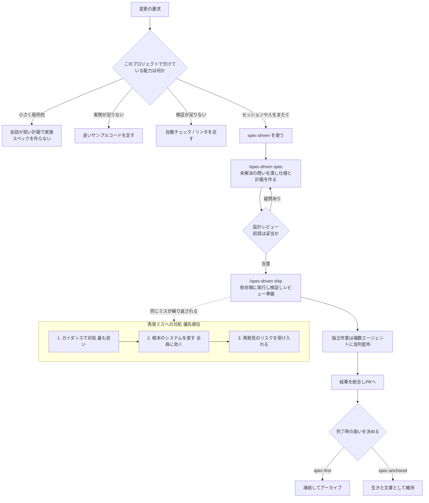
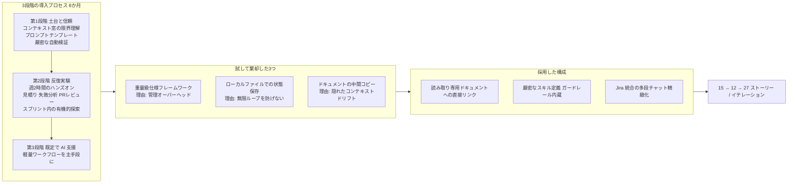
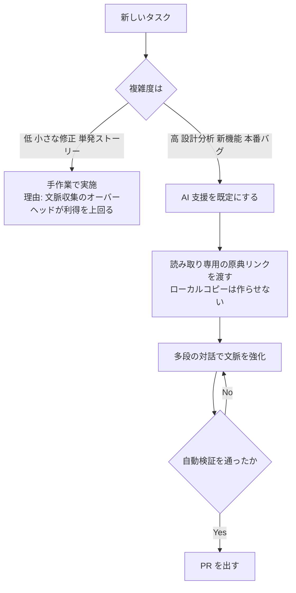
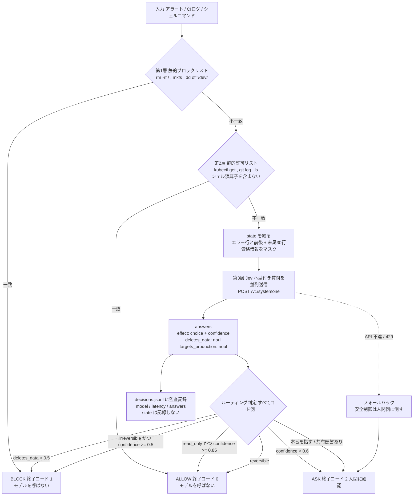
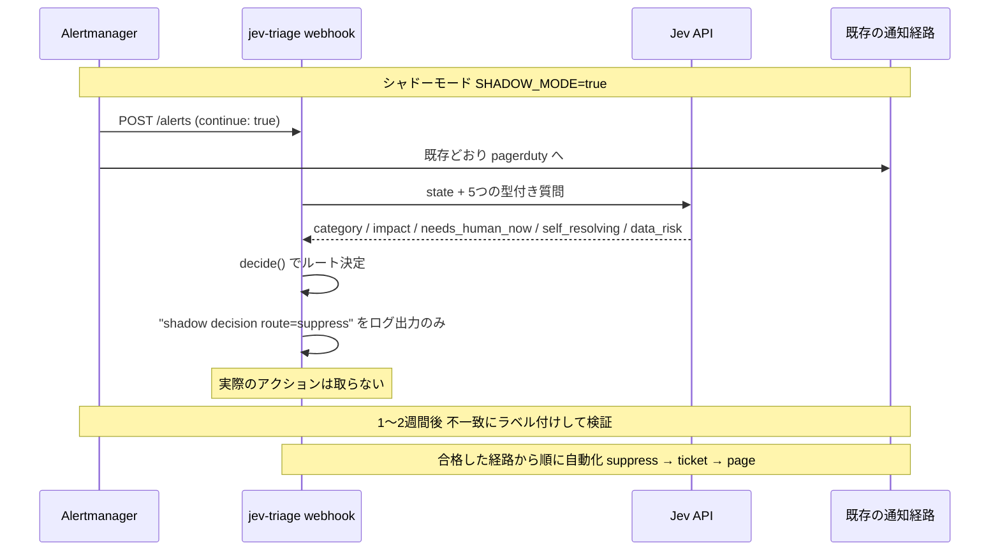

# Daily Briefing 2026-10-04

## 1. スペック駆動開発の良い部分 ― 3か月で学んだこと（原題: Spec-driven development: The Good Parts - and what we learned after three months）

- **URL**: https://asana.com/inside-asana/spec-driven-development
- **公開日**: 2026-09-16
- **著者・媒体**: Walter Li（Rohan Batra 協力）／ Asana Engineering（Inside Asana）

### 本文翻訳

Asana のエンジニアリングチームは、構造化されたスペックがエージェント型 AI のワークフローを本当に改善するのかを確かめるため、社内コマンド `/spec-driven` を3か月間運用した。得られた中心的な緊張関係はこうである——**詳細なスペックはプロジェクトを「続けやすく」する。たとえその方向性が間違っていても、続けやすくしてしまう**。SDD の価値は、エージェントに実際に何が欠けているかによって決まる。

`/spec-driven` の仕組みはこうだ。プロジェクトの状態はリポジトリ内に保存され、次のセッションでも継続できる。決定論的な記録管理と検証チェックはスクリプトが担い、前提を疑う・トレードオフを比較するといった判断的な作業はモデルが担う。コマンドは2つ。`/spec-driven spec` は未解決の問いを潰しながら仕様と実装計画を作り、`/spec-driven ship` は計画を実行し、結果を検証し、レビューに出せる状態まで持っていく。内部ではステートマシンが進行を追跡し、タスクを依存順に並べ、ファイル変更を別々の実行ラウンドに分け、独立した作業は複数エージェントに並列に配って最後に統合する。使い方は「spec-first」（最初の方向づけにだけ使い、以後は凍結）と「spec-anchored」（作業の進行に合わせて維持）の2派に分かれた。

**効いた場面。** 第一に複数セッションにまたがる仕事。2つのプロダクト施策では2〜3か月にわたって生きたスペックが維持され、計画がどう変化したかを後から追えた。第二に引き継ぎ。新しく入ったメンバーが、コミット履歴と会話からコンテキストを再構築することなく「何を試み、なぜその方法を選び、何が残っているか」を把握できた。第三に大量バッチの調整。Admin Console の66個の設定を新フレームワークへ移す作業は約150件の移行に分割され、クラウドエージェントに配られた。結果は「**移行の91%がレビュー後に修正不要**」、そして「**当初計画より1か月以上早く**」の出荷だった。第四に高速プロトタイピング。プロダクト上の問いに最低限答えておけば、エンドツーエンドで動くプロトタイプを作り、本番品質に固める前に PM やデザイナーのフィードバックを得られた。

**効かなかった場面。** 最大の失敗モードは「スペックによるロックイン」である。あるエンジニアが用意したデータ移行のスペックは一見妥当だったが、カスタムフィールドが重複しうる潜在的な競合状態を含んでいた。詳細なスペックがあることで、立ち止まって前提を疑うより先に進むほうが楽になってしまった。より良い設計は、実装を止めて設計レビューに戻してはじめて見つかった。次にレビューのボトルネック。スペック作成には複雑さ次第で30分から数日かかり、あるインフラチームでは「スペックレビューが実装前の詰まり」になった。エージェントの作業メモである `research.md` を何時間もかけてレビューしたエンジニアもおり、その内容が曖昧だったり微妙に不正確だったりしたため、「これは一時的なメモなのか、正式な記録なのか」で意見が割れた。三つめは文書の劣化。実装中に新しい事実が分かってもスペックの更新には手間がかかり、完了時点では実装を見れば分かることの繰り返しになっていた。完了したスペックをどう扱うかを決めるのに時間がかかりすぎた。

**計測。** 7人のエンジニア・4か月・524件のマージ済み PR を対象に、各エンジニアの導入前後を比較した（スペックやワークフロー生成物はカウントから除外）。結果は、週あたり PR 数が **+38%**、実装コードの追加行数が **+2.66倍**（異常に量の多い1期間を除くと +66%）、明示的な revert 率は `/spec-driven` 作業で **1.2%**、それ以外の PR で **1.66%**。チーム自身は「統制された比較ではなく、プロジェクトの構成比や他のエージェント基盤の改善から `/spec-driven` の効果を切り分けられていない」と断っている。利用状況は、エンジニアの約半数が試用し、最終月の週次利用は30〜50人、直接呼び出されるスキルの中で3位だった。

**ハーネス側の修正。** Markdown パーサのバグが見つかった。コード例の中の見出しやチェックボックスが、実際のワークフローのマイルストーンや未完了タスクとして誤認識されていたのである。チームは「エージェントへの注意書きを足す」のではなく、**その場しのぎのパーサ群を共有パーサ1つに置き換え、回帰テストとアーキテクチャチェックを追加して環境側を直した**。また繰り返し起きるミスを文脈つきのガイダンスに蒸留し、過去の PR 8件＋合成ケースで検証したところ、9件中8件で有用な計画上の問いや境界が提示された。特に価値が高かったのは、挙動変更・影響を受ける利用側・API/スキーマの契約・パーサの相互作用に関するガイダンスだった。ただしガイダンスの維持にもコストがかかるため、「ガイダンスで対処する（最も安い）／根本のシステムを直す（手間はかかるが全員に効く）／再発見のリスクを受け入れる」という優先順位を決めた。

**最終的な指針。** 小さく局所的な変更は会話か短い計画で十分。方向性を合意するには spec-first を使い、意思決定がセッションや引き継ぎをまたいで生き残る必要があるときだけスペックを錨（anchor）として維持する。欠けている情報をすべてスペックに詰め込まない——コンテキストの供給とチェックの実行はシステムの仕事であり、アーキテクチャ上の判断は人間のレビューが引き受ける。スペックを維持するなら「次の読み手のために書く」——決定とリスクを見つけやすくし、証拠はコピーせずリンクし、プロジェクト完了時にそのスペックをどうするかを決めておく。3か月後の結論は「SDD を広く使うべきか」ではなく「**このプロジェクトでは具体的にどの能力が欠けているのか**」を問うべきだ、というものだった。欠けているのがスペックで埋まることもあれば、より良い実例・自動チェック・人間の専門性のほうが効率的なこともある。

### 重要ポイント

- 詳細なスペックは「続けやすさ」を生むが、それは**間違った方向にも続けやすくする**。競合状態を含んだ移行スペックがそのまま実装まで通った事例が報告されている
- 効果が出たのは「セッション/人をまたいでコンテキストを保存する必要がある仕事」。150件の一括移行では**91%がレビュー修正不要・計画より1か月以上前倒し**
- 7人・524PR・4か月の比較で **PR数 +38%、実装追加行数 +2.66倍、revert率 1.2% vs 1.66%**。ただし統制比較ではないと自ら明記
- 失敗の典型は「スペックレビューが実装前のボトルネック化」と「`research.md` の位置づけ（作業メモか正式記録か）の曖昧さ」
- 再発ミスへの対処は**ドキュメント追加ではなく環境修正を優先**（共有パーサ化＋回帰テスト）。これが harness engineering の実践例

### 図解



### 現場での適用方法

**（1）CLAUDE.md への追記例 — 「スペックを作る前の分岐」をルール化する**

```markdown
## スペックを作るかどうかの判断

実装に入る前に、まず「このタスクでエージェントに欠けている能力は何か」を1行で書く。
欠けているものに応じて手段を選ぶこと。スペックは常に正解ではない。

| 欠けているもの | 取るべき手段 |
|---|---|
| 似た実装の手本 | `<REPO_PATH>/examples/` の近い実装へのリンクを渡す。スペック不要 |
| 正しさの検証手段 | テスト/リンタ/型チェックを先に足す。スペック不要 |
| 方向性の合意 | spec-first。仕様を書いて合意したら凍結し、以後は更新しない |
| セッション・人をまたぐ文脈 | spec-anchored。仕様を生きた文書として維持する |
| 小さく局所的な変更 | スペックを作らない。会話か箇条書きの計画で進める |

### スペックを書くときの制約
- 欠けている情報を全部スペックに詰め込まない。コンテキスト供給と自動チェックは
  ハーネスの責務であり、スペックの責務ではない
- 証拠はコピーせずリンクする（設計ドキュメント、過去PR、計測結果のURL）
- 「決定」と「リスク」は見出しを分けて、次の読み手が5分で拾えるようにする
- 作業メモ（research.md 等）は `specs/<id>/scratch/` に置き、
  **レビュー対象外**であることをファイル先頭に明記する

### 実装中に前提が崩れたとき
スペックどおりに進めるのではなく、必ず一度停止して設計レビューに戻す。
「スペックがあるから続けられる」は、方向が間違っているときには害になる。
```

**（2）スキル化の例 — 設計レビューゲートを強制する SKILL.md**

```markdown
---
name: spec-gate
description: 実装に入る前に仕様の前提を敵対的に点検する。spec-first / spec-anchored のどちらでも、/spec-driven spec 相当の成果物ができた直後に必ず起動する。競合状態・冪等性・契約変更の見落としを検出する。
---

# spec-gate

仕様 `<SPEC_PATH>` を読み、実装には入らず以下だけを出力する。

## 1. 前提の洗い出し
仕様が暗黙に仮定していることを最大7個、箇条書きで列挙する。
各項目に「この仮定が崩れたときに起きること」を1行で添える。

## 2. 必須チェック（Asana の失敗事例に対応）
- [ ] 並行実行: 同じ処理が同時に2回走ったとき、重複レコードが作られないか
- [ ] 再実行: 途中で落ちて再実行したとき、冪等か
- [ ] 契約変更: API / スキーマ / イベント形式を変えるか。変えるなら利用側を全列挙
- [ ] 挙動変更: 既存の呼び出し元から見て観測可能な振る舞いが変わるか
- [ ] パーサ・シリアライザ: 入出力形式を解釈するコードに触れるか

## 3. 判定
- `BLOCK`: 上記のいずれかに未解決の問いがある → 問いを列挙して停止
- `PROCEED`: 問題なし → 「実装に進んでよい」と1行で述べる

**実装コードを書いてはならない。** 判定だけを返すこと。
```

**（3）運用手順 — 効果測定を再現する**

```bash
# 導入前後を同一エンジニアで比較する（Asana は 7人 / 524PR / 4か月）
# 1. 期間を決める（導入前3か月 / 導入後3か月）
BEFORE_FROM=2026-04-01; BEFORE_TO=2026-06-30
AFTER_FROM=2026-07-01;  AFTER_TO=2026-09-30
REPO=<OWNER>/<REPO>

# 2. 週あたりPR数（スペック等の生成物を除外するため .md のみのPRを落とす）
gh pr list --repo "$REPO" --state merged --limit 1000 \
  --search "merged:$AFTER_FROM..$AFTER_TO author:<GITHUB_USER>" \
  --json number,mergedAt,files \
  | jq '[.[] | select([.files[].path] | any(endswith(".md") | not))] | length'

# 3. revert率（明示的な revert コミットの比率）
git log --since="$AFTER_FROM" --until="$AFTER_TO" --oneline \
  | awk '{c++} /^[0-9a-f]+ Revert/ {r++} END {printf "revert rate: %.2f%%\n", r/c*100}'

# 4. 判断基準：PR数が増えても revert 率が悪化していないことを確認する。
#    片方だけ見ると「速いが壊れている」状態を見逃す。
```

### 期待効果

- 大量バッチ型の移行作業で、**レビュー後修正不要率 91%、計画比1か月以上の前倒し**（Admin Console 設定66個・約150移行の実績）
- 週あたり PR 数 **+38%**、実装コード追加 **+2.66倍**（異常値期間を除くと +66%）
- revert 率が **1.66% → 1.2%** と悪化しない。「速度だけ上がって品質が落ちる」状態を回避できている
- 引き継ぎコストの削減：新メンバーがコミット履歴から文脈を再構築する作業が不要になる
- ガイダンス改善の検証で、過去 PR 9ケース中8ケースで有用な計画上の問いが提示された

### 注意点

- **統制された比較ではない**とAsana自身が明記している。プロジェクト構成比や他のエージェント基盤改善の寄与を切り分けられていないため、+38% をそのまま自社の期待値にしない
- スペック作成は30分〜数日かかる。インフラチームでは**スペックレビュー自体が実装前のボトルネック**になった。レビューのSLA（例: 1営業日以内）を先に決めること
- エージェントの作業メモ（`research.md` 等）をレビュー対象にすると時間を浪費する。「レビュー対象か否か」をファイル配置で物理的に分けること
- 詳細なスペックは誤った前提も一緒に固定する。**実装中に前提が崩れたら止まる**という運用ルールがないと、競合状態のような欠陥がそのまま本番に到達する
- 完了後のスペックの扱い（破棄・アーカイブ・維持）を着手時に決めておかないと、所有者不明のファイルが溜まる
- 導入は半数が試用・週次30〜50人という緩やかな普及で、強制はしていない。マンデート型の展開は想定されていない

---

## 2. AI導入を定量化する ― 最初の壁から速度2倍まで（原題: Quantifying AI adoption: From initial challenges to doubling speed）

- **URL**: https://www.thoughtworks.com/en-us/insights/blog/machine-learning-and-ai/quantifying-ai-adoption-from-initial-challenges-to-doubling-speed
- **公開日**: 2026-09-16
- **著者・媒体**: Nik Malykhin ／ Thoughtworks Blog

### 本文翻訳

著者は6人の開発チームで「AI チャンピオン」を務め、8か月にわたって AI 導入の効果を追跡した。前提として置いたのは「**感触ではなく、測定可能なタスク完了指標まで降りる**」という方針である。結果として現れたのは、直線ではない導入曲線だった。AI 導入前のベースラインは1イテレーションあたり **15ユーザーストーリー**。初期の試行錯誤期には **12ストーリー**まで落ち込み、ワークフローを整理したあとに **27ストーリー**まで伸びた。

**第1段階：土台と「コードへの信頼」。** 最初のフェーズでやったのはツールの選定ではなく、心理的・技術的な地ならしである。エンジニアは「AI の出力を信じる」から「コンパイルが通ったコードを信じる」へ移行する必要があった。そのために必要だったのは、コンテキストウィンドウの限界を技術的に理解すること、プロンプトテンプレートを組み立てること、そして厳密な自動検証を用意することだった。

**第2段階：スクラムのスプリント内での反復実験。** 構造化された定例を入れた。「**エンジニアリングリーダーシップの支援のもとで、週2時間のハンズオンワークショップ**」である。この統制された場で、タスクの見積り、失敗モードの分析、生成された PR のレビューを行った。この公式な時間の外では、開発者が通常の2週間スプリントの中で有機的に AI ツールを試し、常時の監督なしに「本当に使えるユースケース」を見つけていった。

**第3段階：既定で AI 支援開発に移行。** パイロット期間を通じて段階的に統合を進め、終了時には「軽量なワークフローをタスク完了の主たる手段とする」ことでチームの合意が形成された。

**試して捨てたアプローチ。** チームは複数のやり方を体系的に試し、棄却している。

第一に**重量級の仕様フレームワーク**。当初は設計の境界を明確にするために spec-kit を評価したが、必須ステップが多すぎ、使われないドキュメントが生まれ、管理上のオーバーヘッドがボトルネックになった。

第二に**ローカルのファイルによる状態保存**。実行状態をリポジトリ内のファイルに持たせれば監査できる、と期待したが実効性がなかった。スキル定義に明示的なガードレールを書かない限り、無限ループを防げなかった。またコンテキストウィンドウが広がっても、誤った出力がなくなるわけではなかった。

第三に**ドキュメントの中間ローカルコピー**。モデルが静的ドキュメントのローカルコピーを作る方式は、見えないコンテキストドリフトを生んだ。モデルが内容を上書きしてしまい、ポリシーの原本性が損なわれうる。

**最終的に落ち着いた構成。** 3つの要素の組み合わせである——「**読み取り専用ドキュメントへの直接リンク、厳密なスキル定義、そして Jira と統合された多段のチャット精緻化**」。中間ファイルを単一の情報源への参照で置き換えたことで、コンテキストの汚染を防いだ。多段の対話的精緻化によって、反復のたびにコンテキストバッファが強化され、技術的な出力品質が上がった。

**タスク選択の実際。** AI 利用を一律に義務づけるのではなく、開発者が複雑さに応じて動的に選んだ。低複雑度のタスク（小さな修正、単発のユーザーストーリー）は、コンテキスト収集やヒント生成のオーバーヘッドを避けるため手作業で進めることが多かった。高複雑度の作業（設計分析、新機能、本番バグ）では AI 支援を既定とし、ツールが本当に加速をもたらす領域に効果を集中させた。

**結論。** 「AI 統合による性能向上は非線形であり、**持続的な加速に必要な技術的土台ができる前に、まず性能の落ち込みが来る**」。効果的な導入には、自動化された隔離と対話的な精緻化のバランスが要る。ファイルベースの状態管理よりも、「都度その文脈に合わせた手順指示」と「読み取り専用ツール」のほうがコンテキストの劣化を防げた。そして、突然の義務化ではなく、チームの合意を伴う段階的な実装が必要である。

### 重要ポイント

- 効果は非線形。**15 → 12（落ち込み） → 27 ストーリー/イテレーション**。導入直後の生産性低下を「失敗」と誤判定して撤退しないことが最大の分岐点
- 重量級の仕様フレームワーク（spec-kit）は管理オーバーヘッドで棄却された。*※Asana 記事とは逆の結論であり、チーム規模・作業の性質で適否が分かれることを示す*
- **ドキュメントのローカルコピーは有害**。モデルが上書きしてポリシーの原本性が壊れる。読み取り専用の原典リンクに統一するのが解
- コンテキストウィンドウの拡大は誤出力を解消しない。無限ループはスキル定義の明示的ガードレールでしか止まらなかった
- AI 利用を一律義務化せず、低複雑度は手作業・高複雑度は AI という**動的な使い分け**を開発者の裁量に残した

### 図解





### 現場での適用方法

**（1）CLAUDE.md への追記例 — ドリフトを生む「ローカルコピー」を禁止する**

```markdown
## ドキュメント参照のルール

### 禁止
- 社内ドキュメント・設計書・ポリシーの**ローカルコピーを作らない**。
  `docs/_cache/`、`notes/copied-*.md` のような中間ファイルを生成してはならない。
  理由: モデルが内容を上書きし、原本との差分が見えないまま参照され続けるため。

### 必須
- 参照は常に原典の URL で行う。読むときだけ取得し、保存しない。
  - 設計ポリシー: <DOCS_URL>/engineering/policies
  - API 契約: <DOCS_URL>/api/contracts
  - リリース手順: <DOCS_URL>/runbooks/release
- 取得に使うツールは**読み取り専用のものに限る**。

## AI を使うかどうかの基準

| 複雑度 | 例 | 既定の進め方 |
|---|---|---|
| 低 | typo 修正、1ファイル内の小修正、定型のストーリー | 手作業。文脈収集のコストが利得を上回る |
| 高 | 設計分析、新機能、本番バグ、横断リファクタ | AI 支援を既定にする |

一律の義務化はしない。判断は実装者に委ねる。
```

**（2）スキル化の例 — 無限ループを止めるガードレールを内蔵した SKILL.md**

```markdown
---
name: scoped-task
description: 高複雑度タスク（設計分析・新機能・本番バグ）を AI 支援で進めるときの既定手順。読み取り専用の原典参照と反復回数の上限を強制し、コンテキストドリフトと無限ループを防ぐ。
---

# scoped-task

## ハードガードレール（必ず守る）
- 検証コマンドの実行は **最大5回**。5回で通らなければ停止し、
  「何が通らないか」「次に人間が判断すべきこと」を出力して終了する。
- 同じファイルを **3回以上** 書き換えたら停止する。アプローチが誤っている合図とみなす。
- ドキュメントのローカルコピーを作らない（CLAUDE.md のルールに従う）。

## 手順
1. **文脈の確定**: 関連する原典 URL を列挙し、読む。保存しない。
2. **段階的な精緻化**: いきなり実装しない。まず
   (a) 変更対象のファイル一覧 (b) 想定される副作用 (c) 検証方法
   の3点を出し、人間の確認を取る。
3. **実装**: 確認が取れた範囲だけを変更する。
4. **検証**: `<TEST_CMD>` と `<LINT_CMD>` を実行する。上限5回。
5. **報告**: 変更ファイル、検証出力、残課題を出す。

## 出力してはならないもの
- 使われる当てのない設計ドキュメント。仕様の生成が目的ではない。
```

**（3）運用手順 — 「落ち込み期」を乗り切るための計測と定例**

```bash
# 週2時間のハンズオン枠を確保し、以下を毎回回す（Thoughtworks の第2段階）
# 1. 見積り精度の記録
# 2. 失敗モードの分析（どのプロンプト・どの文脈で壊れたか）
# 3. 生成 PR のレビュー（人間が書いた PR と同じ基準で）

# ベースラインを必ず導入前に取る。取っていなければ導入を1イテレーション遅らせてでも取る。
cat > <REPO_PATH>/metrics/ai-adoption.csv <<'CSV'
iteration,phase,stories_completed,prs_merged,reverts,notes
1,baseline,15,22,0,AI導入前
2,baseline,15,21,1,
3,early,12,19,2,落ち込み期。撤退判断をしないこと
4,early,13,20,1,
5,refined,21,30,1,読み取り専用リンクに統一
6,refined,27,38,1,
CSV

# 判断基準:
#   - 3イテレーション連続で落ち込んだままなら、ツールではなく「ワークフロー」を疑う
#   - 落ち込み期に撤退すると、加速フェーズに到達できない（この記事の中心的な知見）
```

### 期待効果

- 1イテレーションあたりの完了ユーザーストーリー数が **15 → 27（ベースライン比 +80%）**
- 導入初期の落ち込み（15 → 12）を「想定内」として扱えるため、早期撤退による投資の無駄を避けられる
- ローカルコピー廃止により、ポリシー文書の原本性が保たれ、古い前提に基づく実装が減る
- 低複雑度タスクを手作業に戻すことで、文脈収集のオーバーヘッド分の時間を回収できる

### 注意点

- サンプルは**開発者6人の1チーム・8か月**。組織全体や大規模チームへの外挿は根拠が薄い
- 「ユーザーストーリー数」はストーリーの粒度に依存する指標である。粒度が変わると比較が壊れるため、計測期間中は分割方針を固定すること
- spec-kit の棄却はこのチームの文脈での判断。同日公開の Asana の記事では構造化スペックが大規模バッチで効いており、**規模と作業の性質で結論が逆転する**
- 週2時間のワークショップは「エンジニアリングリーダーシップの支援のもと」実施されている。管理職の時間確保がない状態では第2段階が成立しない
- 落ち込み期に撤退しないという判断は、事前に合意を取っておかないと現場の信頼を失う。ベースラインと許容する落ち込み幅を先に明文化すること

---

## 3. Jevとは何か ― DevOpsチームのためのTypeSafe AI意思決定モデル実践ガイド（原題: What Is Jev? A DevOps Guide to TypeSafe's AI Decision Models）

- **URL**: https://kodekloud.com/blog/what-is-jev-and-how-devops-teams-can-use-typesafes-ai-model/
- **公開日**: 2026-09-29
- **著者・媒体**: Pramodh Kumar M ／ KodeKloud Blog

### 本文翻訳

Jev は TypeSafe AI が 2026年9月15日に公開したモデルで、運用上の判断（judgment call）に特化している。チャットボットとは違い、「**賢い `if` 文**」として動く。非構造の状態（state）と型付きの質問（questions）を送ると、テキストもコードも生成せず、制約された確率的な答えだけを返す。TypeSafe はこれを **System One モデル**と呼ぶ。カーネマンの「速い直感的思考」に由来する命名で、主張は「ソフトウェアの判断の大半は System 1 の判断なのに、我々はそこに遅い推論モデルの料金を払っている」というものだ。

**リクエストの構造。** `state` は判断対象の中身（アラートのペイロード、ビルドログの抜粋、シェルコマンド）。`questions` は名前付き・型付きの質問のマップ。JSON のフィールドはバッククォートのパス（例: `` `alert.annotations.summary` ``）で参照して、何について聞いているかを明示する。

質問の型は3つ。**Noul**（はい/いいえ）は 0〜1 の確率を1つ返す（例: `noul: 0.98`）。**Choice**（N択）は選択肢・確率分布・信頼度を返し、最大255択。**Score**（2〜10段階）は確率加重平均を返す（例: `score: 1.84` はレベル1と2の間で1寄り）。

エンドポイントは `POST https://api.typesafe.ai/v1/systemone`。レスポンスの `model` フィールドは、エイリアスで要求してもバージョン固定のID（例 `jev-1.13.0`）を返す。再現性のためにこれが重要になる。

**キャリブレーション。** TypeSafe は **RLCD（Reinforcement Learning for Calibrated Decisions）** で訓練しており、人間の好みではなく「確率が実際の結果と一致すること」を最適化している。キャリブレーションされたモデルは、信頼度90%と答えたもののうち約90%が実際に正しい。これにより、信頼度を閾値にしたルーティングが成立する——0.5未満は人間にエスカレーション、0.5〜0.85は低リスク操作の前に確認、0.85超は自動実行。

**性能と価格。** レイテンシ 70〜500ms（エンドツーエンド）。入力 **100万トークンあたり $0.042**、出力は無料。コンテキストは state + questions で 64k トークン。レート制限 1,200リクエスト/分、250kトークン/秒。

**アラートトリアージ。** 記事は1アラートあたり5つの質問を並列に投げるエンジンを組み立てる。`category`（Choice: infrastructure / application / database / network / security / noise / other）、`impact`（Score: ユーザー影響の3段階）、`needs_human_now`（Noul: 1時間以内に人が動かないと悪化するか）、`self_resolving`（Noul: 放っておいても収まる一過性か）、`data_risk`（Noul: データ損失・破損のリスクを示すか）。

重要なのは**ルーティングのポリシーが純粋なコード側にあること**である。`severity == "critical"` のような決定論的ルールが常に最優先で勝ち、モデルの答えはそれを上書きしない。`data_risk > 0.6` ならページング、`category.confidence < 0.5` なら人間レビュー、`impact >= 1.5 かつ needs_human_now > 0.7` ならページング、`self_resolving > 0.8 かつ needs_human_now < 0.3` なら抑制、それ以外はチケット化、という順序である。

**CI 失敗の分類。** ログはまず決定論的に絞る。`excerpt()` はエラー語を含む行とその前後、末尾30行だけを残し、`token=***` のような資格情報をマスクして最大120行に収める。質問は `failure_type`（Choice: flaky_test / test_assertion / compile_error / dependency / infrastructure / lint / other）、`rerun_may_pass`（Noul）、`needs_code_change`（Noul）。再実行の判定は「failure_type が flaky_test / infrastructure / dependency のいずれかで信頼度 0.6 以上、かつ rerun_may_pass >= 0.75、かつ needs_code_change < 0.4」のときだけ `rerun`。そして **attempt カウンタをコード側に持ち、2回以上なら無条件で `notify`** にする。モデルが誤分類を繰り返しても無限ループに入らない設計である。

**コマンドのガードレール。** 3層構造になっている。第1層は静的なブロックリスト（`rm -rf /`、`mkfs`、`dd of=/dev/` の正規表現）でモデルを呼ばずに拒否。第2層は静的な許可リスト（`kubectl get`、`kubectl describe`、`git log`、`ls` などの接頭辞）で、シェル演算子（`;` `&` `|` バッククォート）を含まなければ即許可。第3層ではじめてモデルに判断させる。質問は `effect`（Choice: read_only / reversible / irreversible）、`targets_production`、`deletes_data`、`shared_blast_radius`。判定は `deletes_data > 0.5` で BLOCK、`irreversible` かつ信頼度 0.5 以上で BLOCK、信頼度 0.6 未満は ASK、`read_only` かつ信頼度 0.85 以上で ALLOW、本番を指すなら ASK、共有リソースに影響するなら ASK、`reversible` なら ALLOW。終了コードは 0（許可）/ 1（拒否）/ 2（人に聞く）。

**シャドーモードでの導入。** Alertmanager の webhook レシーバを立て、`SHADOW_MODE=true` の間は「Jev ならこう判断した」をログに書くだけで実際には動かさない。Alertmanager 側は `continue: true` を使って既存のレシーバにもそのまま流す。共有クライアントは `JEV_MODEL` でバージョンを固定し、`decisions.jsonl` に監査ログを書く。設計上重要なのは、**state そのものはログに残さない**（顧客データを監査証跡に入れない）ことで、元システム側のタイムスタンプで突き合わせる。

**本番チェックリスト（8項目）。** ①モデルバージョンを固定する（`jev-latest` は動く。`response.model` を毎回記録し、ラベル付きケースの再生で検証してから自分の都合でアップグレードする）。②まずシャドーモードで動かす（現行システムの判断と並べて記録し、不一致にラベルを付け、最もリスクの低い経路から自動化する——suppress → ticket → page の順）。③ラベル付きテストケースを集める（最低でも数百件の実例を再生し、信頼度バケットごとに一致率を測る。外した場合は**信頼度の閾値を下げるのではなく、質問か閾値を書き直す**）。④計算と安全規則はコードに置く（Jev は数を正しく数えられず、日付を文字列として扱い、指示を字義どおりに読む）。⑤stateを容赦なく絞る（無関係なフィールドが増えると精度が落ちる）。⑥stateは敵対的でありうると想定する（PR 本文・チケット・ログには分類を誘導する内容が書かれうる。1つの答えが起動できる範囲を制限し、ハードルールはコードに置き、敵対的入力でテストする）。⑦利用不能時のフォールバックを定義する（アラートと安全制御は人間側に倒し、それ以外は既存挙動に倒す）。⑧質問と閾値をコードと同様にレビューする（criteria や閾値の変更は挙動の変更である）。

**経済性。** アラートトリアージを1日5万件・1件600入力トークンで回すと 1日3,000万トークン、**$1.26/日（約$38/月）**。同等の処理をフロンティア LLM でやると出力トークン抜きで $6〜30/日。CI 分類は月2,000失敗ビルド×3,000トークンで **$0.25/月**。レイテンシも Jev が 70〜500ms に対しフロンティア LLM は3〜329秒で、「200ms 増えるガードレールは気づかれないが、8秒増えるガードレールは無効化される」。

**注意すべき点。** ベンチマークはすべて TypeSafe 自身のもので、独立した再現はまだない。「自分のラベル付きトラフィックだけが意味のあるベンチマーク」である。早期アクセス期の価格で、TypeSafe 自身「価格が補助されていないことを証明できない」と述べている。訓練は英語中心。数を数えられず、日付を順序量として扱えない。否定や含意を字義どおりに受け取る。2026年9月22日時点で新規登録は停止しており、サービスは米国西海岸で稼働している。

結論として、記事は Jev の本質的な価値は「推論の優秀さ」ではなく「**経済性と速度**」だとする。判断1回が1セント未満・数百ミリ秒で返るようになったとき、これまでコスト的に不可能だった場所すべてに分類器を置けるようになる。この構造的変化こそが残るもので、Jev 自身が勝者であり続けるかどうかとは別の話である。

### 重要ポイント

- Jev は「賢い `if` 文」。テキストを生成せず、Noul（確率）/ Choice（最大255択）/ Score（2〜10段階）の型付き答えだけを返す。**分岐はコードが持つ**
- RLCD によるキャリブレーションにより、信頼度を閾値にしたルーティング（<0.5 人間 / 0.5〜0.85 確認 / >0.85 自動）が成立する
- **安全性は3層で担保**する。静的ブロックリスト → 静的許可リスト → モデル判断。ハードルールがモデルの答えより常に優先
- 無限ループ対策は**モデルではなくコードの attempt カウンタ**で行う。誤分類が続いても2回で `notify` に落ちる
- 導入は必ずシャドーモード（`continue: true` で既存経路を温存）から。自動化は suppress → ticket → page の順にリスクの低い経路から開放する
- 1日5万アラートで **$1.26/日**、レイテンシ 70〜500ms。「200ms のガードレールは気づかれないが、8秒のものは無効化される」

### 図解





### 現場での適用方法

**（1）スクリプト化の例 — CI 失敗の自動再実行ゲート（シャドーモード付き）**

```python
#!/usr/bin/env python3
"""ci_triage.py - CI 失敗を分類し、flaky のみ再実行する。
使い方: python ci_triage.py --log <LOG_PATH> --attempt <N>
終了コード: 0=rerun, 1=notify
環境変数: TYPESAFE_API_KEY, JEV_MODEL, SHADOW_MODE
"""
import os, re, sys, json, time, argparse
from datetime import datetime, timezone
from typesafe import TypeSafe, Choice, Noul, TypeSafeError

JEV_MODEL = os.environ.get("JEV_MODEL", "jev-1.13.0")   # エイリアスを使わず固定
SHADOW    = os.environ.get("SHADOW_MODE", "true").lower() == "true"
LOG_PATH  = os.environ.get("JEV_DECISION_LOG", "decisions.jsonl")

SIGNAL = re.compile(r"\b(error|fail(ed|ure)?|exception|timeout|panic)\b", re.I)
SECRET = re.compile(r"(token|password|secret|api[_-]?key)(\s*[=:]\s*)\S+", re.I)

def excerpt(text, context=2, max_lines=120, tail=30):
    """エラー行とその前後、末尾だけを残し、資格情報をマスクする。"""
    lines = text.splitlines()
    keep = set(range(max(0, len(lines) - tail), len(lines)))
    for i, line in enumerate(lines):
        if SIGNAL.search(line):
            keep.update(range(max(0, i - context), min(len(lines), i + context + 1)))
    picked = [SECRET.sub(r"\1\2***", lines[i]) for i in sorted(keep)]
    return "\n".join(picked[-max_lines:])

QUESTIONS = {
    "failure_type": Choice(
        instructions="`log` が示すビルド失敗の原因はどれか。",
        criteria={
            "flaky_test":     "競合状態、タイムアウト、実行順依存",
            "test_assertion": "コードが誤った結果を返した",
            "compile_error":  "構文・型・ビルドのエラー",
            "dependency":     "パッケージ取得や依存解決の失敗",
            "infrastructure": "ディスク不足、ランナー消失、DNS 障害",
            "lint":           "フォーマッタや静的解析の指摘",
            "other":          "上記のいずれでもない",
        },
    ),
    "rerun_may_pass":    Noul(instructions="コードを変えずに再実行して成功しうるか。"),
    "needs_code_change": Noul(instructions="修正にソースコードの変更が必要か。"),
}

def decide(ans, attempt):
    if attempt >= 2:                      # ← コード側の上限。モデルに委ねない
        return "notify"
    ft = ans["failure_type"]
    if (ft.choice in {"flaky_test", "infrastructure", "dependency"}
            and ft.confidence >= 0.6
            and ans["rerun_may_pass"].noul >= 0.75
            and ans["needs_code_change"].noul < 0.4):
        return "rerun"
    return "notify"

def main():
    p = argparse.ArgumentParser()
    p.add_argument("--log", required=True)
    p.add_argument("--attempt", type=int, default=0)
    a = p.parse_args()

    state = excerpt(open(a.log, encoding="utf-8", errors="replace").read())
    started = time.perf_counter()
    try:
        client = TypeSafe(api_key=os.environ["TYPESAFE_API_KEY"])
        res = client.system_one(model=JEV_MODEL, state=state, questions=QUESTIONS)
        route = decide(res.answers, a.attempt)
        answers = {k: v.model_dump() for k, v in res.answers.items()}
        model, latency = res.model, round((time.perf_counter() - started) * 1000, 1)
    except (TypeSafeError, KeyError) as e:          # ← 不達時は人間側に倒す
        route, answers, model, latency = "notify", {"error": str(e)}, JEV_MODEL, None

    with open(LOG_PATH, "a", encoding="utf-8") as f:  # state は書かない
        f.write(json.dumps({
            "ts": datetime.now(timezone.utc).isoformat(),
            "workflow": "ci_triage", "model": model, "latency_ms": latency,
            "attempt": a.attempt, "route": route, "answers": answers,
            "shadow": SHADOW,
        }, ensure_ascii=False) + "\n")

    if SHADOW:
        print(f"[shadow] would route={route}", file=sys.stderr)
        sys.exit(1)                                  # シャドー中は常に notify
    sys.exit(0 if route == "rerun" else 1)

if __name__ == "__main__":
    main()
```

GitHub Actions への組み込み（シャドー期間は `SHADOW_MODE: "true"` のまま置く）:

```yaml
# .github/workflows/ci.yml の末尾に追加
  triage:
    if: failure()
    needs: [build]
    runs-on: ubuntu-latest
    steps:
      - uses: actions/checkout@v4
      - uses: actions/download-artifact@v4
        with: { name: build-log, path: ./logs }
      - run: pip install typesafe-sdk
      - id: triage
        continue-on-error: true
        env:
          TYPESAFE_API_KEY: ${{ secrets.TYPESAFE_API_KEY }}
          JEV_MODEL: "jev-1.13.0"
          SHADOW_MODE: "true"        # ← 1〜2週間はここを true のまま運用する
        run: python ci_triage.py --log ./logs/build.log --attempt ${{ github.run_attempt }}
      - uses: actions/upload-artifact@v4
        with: { name: jev-decisions, path: decisions.jsonl }
```

**（2）CLAUDE.md への追記例 — エージェントに Jev 的な分割を守らせる**

```markdown
## 判断を外部モデルに委ねるときの設計規則

判断ロジックを実装するときは、以下の役割分担を必ず守ること。

| 担当 | 責務 |
|---|---|
| コード | ループ、リトライ上限、しきい値、ハードブロック、フォールバック、四則演算、日付比較 |
| モデル | 「このログは flaky か」「このコマンドは破壊的か」といった曖昧な判定のみ |

### 禁止事項
- モデルの出力でハードルールを上書きしない。`severity == "critical"` のような
  決定論的ルールは常に先に評価し、常に勝たせる
- 数を数えさせない／日付の前後を判定させない。字句として扱われるため誤る。コードで計算する
- 再試行の打ち切り判断をモデルに委ねない。必ず呼び出し側に attempt カウンタを持つ
- 判定に使った `state`（生ログ、顧客データを含みうる本文）を監査ログに書かない。
  記録するのは model / latency / answers / route と、元システムのタイムスタンプのみ

### 必須事項
- モデルのバージョンは固定する（`jev-latest` のようなエイリアスを使わない）。
  レスポンスの `model` フィールドを毎回ログに残す
- 新しい判定を自動化するときは、必ず `SHADOW_MODE` フラグ付きで実装する。
  シャドーで記録→不一致をラベル付け→低リスク経路から開放、の順を飛ばさない
- `state` は敵対的入力でありうる（PR 本文、チケット、ログに誘導文が書かれうる）。
  1つの答えが起動できるアクションの範囲を限定し、敵対的入力のテストを書く
```

**（3）運用手順 — しきい値を実データで決める**

```bash
# 1. シャドーモードで1〜2週間走らせ、判断ログを貯める
#    （既存の通知経路は Alertmanager の continue: true でそのまま維持する）

# 2. 現行システムの実際の対応と突き合わせ、不一致にラベルを付ける
jq -s '[.[] | {ts, route, conf: .answers.failure_type.confidence}]' decisions.jsonl \
  > shadow.json

# 3. 信頼度バケットごとの一致率を出す（labeled.json は人手で付けた正解）
jq -s --slurpfile l labeled.json '
  [.[0][] as $d | $l[0][] | select(.ts == $d.ts) | {b: ($d.conf*10|floor/10), ok: (.truth == $d.route)}]
  | group_by(.b) | map({bucket: .[0].b, n: length, acc: ((map(select(.ok))|length)/length)})
' shadow.json

# 4. 判断基準:
#    - 一致率が目標に届かないバケットがあるとき、**信頼度の下限を下げて辻褄を合わせない**。
#      質問文（criteria）を書き直すか、state の絞り方を変える
#    - 最低でも数百件を再生してから自動化に移る
#    - 開放順は suppress → ticket → page。page（人を起こす）を最後にする
```

### 期待効果

- アラートトリアージを1日5万件回して **$1.26/日（約$38/月）**。同等処理をフロンティア LLM で行うと出力トークン抜きで $6〜30/日
- CI 失敗分類は月2,000ビルド×3,000トークンで **$0.25/月**。加えて「とりあえず再実行して」のやり取りに費やす人の時間を削減できる
- レイテンシ 70〜500ms。ガードレールとしてコマンド実行パスに挟んでも体感を損なわない（記事いわく「8秒増えるガードレールは無効化される」）
- キャリブレーション済みの確率により、自動化する範囲を「信頼度 0.85 以上」のように**定量的に区切れる**
- flaky と実障害の切り分けが自動化されることで、本物の失敗が作者に届くまでの時間が短くなる

### 注意点

- **ベンチマークはすべてベンダー自身のもの**で、独立した再現検証は公開されていない。「自分のラベル付きトラフィックだけが意味のあるベンチマーク」という記事の但し書きをそのまま運用方針にすべき
- 早期アクセス期の価格であり、TypeSafe 自身が「価格が補助されていないことを証明できない」と述べている。コスト試算を長期前提に置かない
- **数を数えられず、日付を順序量として扱えない。**「3件以上か」「7日前より古いか」はコードで計算すること
- 否定や含意を字義どおりに読む。質問文には「意図」ではなく「満たすべき条件そのもの」を書く
- 訓練は英語中心。日本語のアラート本文やチケットでは精度が落ちる可能性がある
- 2026年9月22日時点で**新規登録が停止**しており、稼働リージョンは米国西海岸のみ。日本からの利用ではネットワークレイテンシが上乗せされ、データ所在地の要件にも抵触しうる
- `state` は攻撃面になる。PR 本文やログに分類を誘導する文字列を埋め込まれる前提で、1つの判定が起動できるアクションを限定すること
