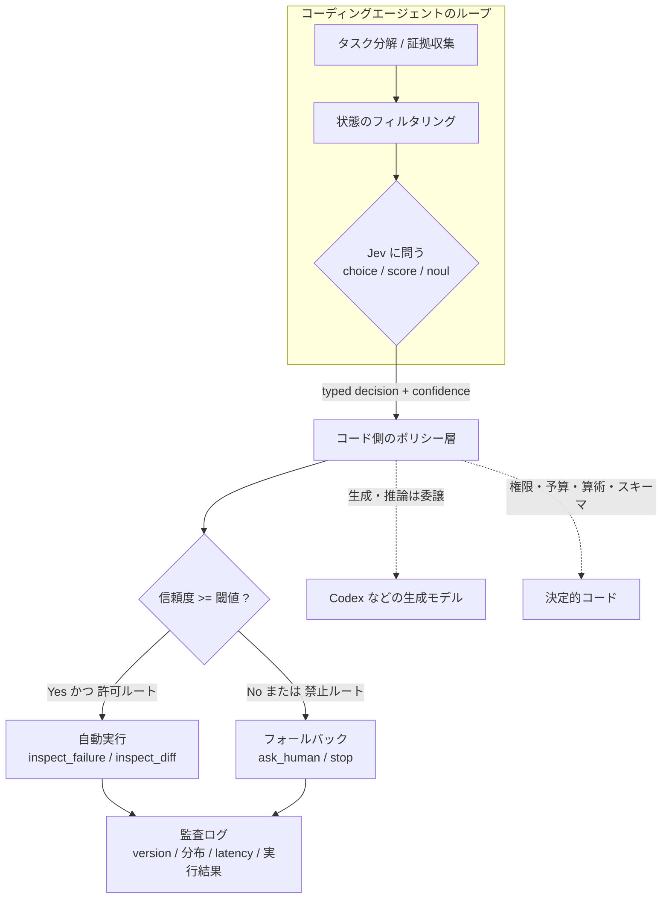
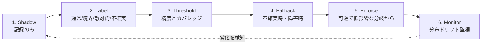
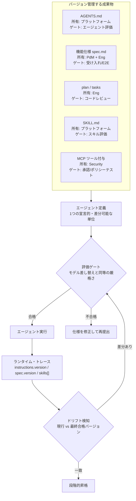
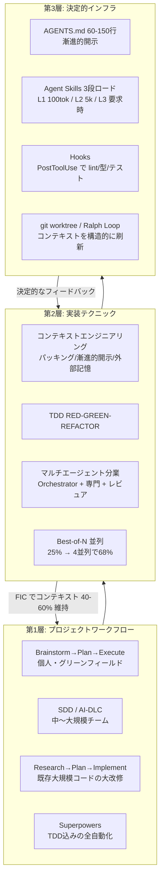
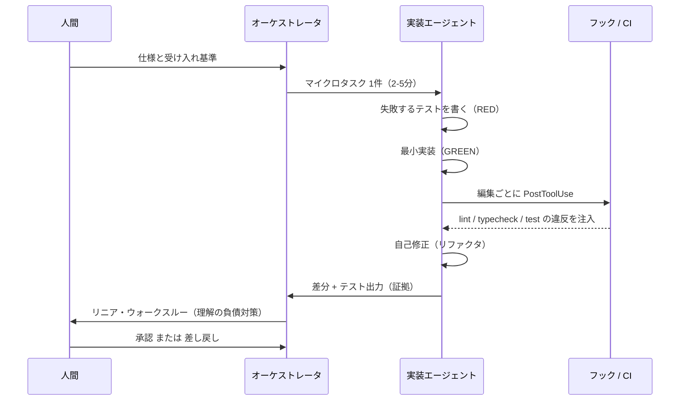

# Daily Briefing 2026-10-05

## 1. コーディングエージェントのための Jev：System One 型の意思決定とは（原題: Jev for Coding Agents: System One Decisions Explained）

- **URL**: https://supercode.sh/en/blog/guides/jev-for-coding-agents
- **公開日**: 2026-09-21
- **著者・媒体**: Tony Martins / SuperCode Blog（Guides）

### 本文翻訳

Jev はコード生成ツールではなく「意思決定モデル」である。Codex のような生成系エージェントの隣に置き、「答えの集合が有限で、明示的なフォールバックを持つ、繰り返し発生する意味判断」だけを担わせる。

Jev が提供するプリミティブは3つ。**choice**（名前付き選択肢から1つ選び、確率分布と信頼度を返す）、**score**（順序付きレベルで評価し、選ばれたレベル・分布・信頼度を返す）、**noul**（yes/no の二値評価を確率で返す。TypeSafe 独自の用語で誤記ではない）。

責務分割が設計の核になる。**Jev が決めるのは**「あらかじめ設計された答え空間の中で、ルーティング・ランク付け・フラグ付け・スコアリング・リトライ・エスカレーション・停止を選ぶこと」。**Codex が推論するのは**リポジトリ調査・仮説形成・コード編集・ツール実行。**コードが強制するのは**権限・予算・スキーマ・テスト検証・監査ログである。決定的な注意として「モデルの答えはポリシーへの入力であって、ポリシー自体ではない」。

実務ユースケースは5つ挙げられている。(1) **Route**：タスク分解後にフロントエンド／バックエンド／セキュリティ／人間のどのワーカーへ渡すか選ぶ。(2) **Next Action**：集めた証拠から inspect・rerun・ask・stop をランク付けする。(3) **Context Triage**：コンテキスト組み立て前に、その情報の診断価値とノイズをスコア化する。(4) **Review Escalation**：認証・課金・マイグレーションに意味的に接触する変更にフラグを立てる。(5) **Readiness Check**：コストの高い引き継ぎの前に証拠が十分かを評価する。

コストとレイテンシ：jev-1.13.0 は入力100万トークンあたり $0.042、出力は無料。エンドツーエンド 70〜500ms、ローンチ週の独立計測では 253〜378ms。生成系ワークフロー比で速度 20〜200倍、コスト 40〜400倍の優位を主張するが、著者は「ベンダーのベンチマークであり、Codex のタスク全体が200倍速くなる約束ではない。見出しの数字を掛け算するな」と注意する。

既知の弱点（1.13 の「ジャギーさ」）は、字義通りの読解漏れ、算術・カウントの弱さ、日付順序、多段の間接参照、ノイズの多い状態や矛盾する基準。対策は、算術は決定的コード側に置く／単一で字義通りの問いにする／送る状態を事前にフィルタする／生成は Codex に任せる。

本番投入は6段の「ロールアウト・ラダー」で進める。**Shadow**（判断をログするだけで行動しない）→ **Label**（通常・境界・敵対的・不確実のテストセットを作る）→ **Threshold**（精度とカバレッジを計測）→ **Fallback**（不確実時と障害時の挙動を定義）→ **Enforce**（可逆で影響の小さい分岐から有効化）→ **Monitor**（バージョン・分布・レイテンシ・実際に取られた行動を記録）。

ハルシネーションの区別も重要だ。型安全性が防ぐのは不正な JSON・未知のアクション・値の代わりの散文。防げないのは判断の誤り（許可ルートの選択ミス、条件の読み違い、自信を持った意味的誤り）。「曖昧な問いに付いた 0.94 はセキュリティ境界にはならない」「大きなコンテキスト容量は、トレース全体を送っていい許可ではない」。

サプライチェーン境界についても、Jev は直接コード／ゲートウェイ／MCP サーバー／スキル／ラッパー経由で使えるが、ラッパーはモデル自身より広いアクセスを持ちうる。統合物は、出自（メンテナ・ライセンス・履歴）、シークレットの保管と秘匿、データ経路、権限（プロンプト書き換えやツール強制の有無）、障害時の挙動、クリーンに削除できるかを点検する。

設計原則は「問い・許可する答え・フォールバック・受け入れ閾値を凍結し、通常・境界・敵対的・不確実のケースでテストする。レビュアー同士が期待ラベルで合意できないなら、その判断はまだ自動化できるほど境界づけられていない」。

### 重要ポイント
- Jev は「有限の答え集合 + 明示的フォールバック」を持つ繰り返しの意味判断だけに使う。生成・推論は Codex 等に、権限・予算・算術はコードに残す。
- 判断は choice / score / noul の3プリミティブに還元する。モデルの答えはポリシーへの入力であり、ポリシーそのものではない。
- 本番化は Shadow → Label → Threshold → Fallback → Enforce → Monitor の6段で、可逆・低影響の分岐から始める。
- 型安全は不正出力を防ぐが判断ミスは防がない。信頼度0.94は曖昧な問いを安全な境界に変えない。
- コストは入力100万トークンあたり $0.042、レイテンシ 70〜500ms。ただしベンダー値であり、タスク全体の高速化率とは別物。

### 図解





### 現場での適用方法

まず「問いの凍結」を仕組みにする。判断ごとに YAML の決定カードを1枚置き、問い・許可する答え・フォールバック・閾値をコードレビュー対象にする。

```yaml
# <REPO_PATH>/decisions/next_action_after_test_failure.yaml
id: next_action_after_test_failure
primitive: choice
instructions: >
  フォーカステストが1件失敗した直後に取るべき、最小の証拠収集ステップを選べ。
options:
  inspect_failure:  "失敗の原因がまだ説明できていない"
  inspect_diff:     "変更行が失敗を説明しうる"
  rerun_focused_test: "一時的な失敗に見え、1回の再実行で仮説を検証できる"
  ask_human:        "証拠が曖昧、または明示された境界を越える"
threshold: 0.80           # これ未満は fallback
fallback: ask_human
auto_execute:  [inspect_failure, inspect_diff]
needs_approval: [rerun_focused_test]
forbidden:     [deploy, delete_data, disable_checks]
owner: platform-team
```

ポリシー層は必ずコードで書く。モデルの答えをそのまま実行させない。

```typescript
// <REPO_PATH>/src/agent/decide.ts
import { choice } from "@typesafe/jev";
import card from "../../decisions/next_action_after_test_failure.yaml";

export async function nextAction(state: AgentState) {
  // 1) 送る状態を必ずフィルタする（トレース全体を送らない）
  const filtered = {
    failing_test: state.failingTest.name,
    assertion: state.failingTest.message.slice(0, 500),
    changed_files: state.diff.files.slice(0, 20),
    rerun_count: state.rerunCount,
  };

  const d = await choice({
    instructions: card.instructions,
    options: card.options,
    state: filtered,
  });

  // 2) 閾値・許可ルートはコードが判定する（モデルは入力に過ぎない）
  const allowed = card.auto_execute.includes(d.decision);
  const action = d.confidence >= card.threshold && allowed ? d.decision : card.fallback;

  // 3) 監査ログ：バージョン・分布・レイテンシ・実際の行動を必ず残す
  logger.info("jev.decision", {
    card: card.id,
    model_version: d.model_version,
    asked: d.decision,
    confidence: d.confidence,
    distribution: d.distribution,
    latency_ms: d.latency_ms,
    executed: action,
    shadow: process.env.JEV_MODE === "shadow",   // Shadow 段では executed を実行しない
  });

  return process.env.JEV_MODE === "shadow" ? card.fallback : action;
}
```

CLAUDE.md / AGENTS.md には責務分割を明文化しておく。

```markdown
## 判断モデル（Jev）の使い方
- Jev に投げてよいのは「選択肢が有限・事前定義済み」の判断のみ（ルーティング/優先度/フラグ/停止）。
- 算術・日付計算・件数カウント・権限判定・予算管理は Jev に聞かず、必ずコードで実装する。
- 新しい判断を追加するときは `decisions/<id>.yaml` に問い・選択肢・閾値・フォールバックを先に書き、PR レビューを通す。
- 本番で enforce にするのは、可逆かつ低影響な分岐のみ。deploy / delete_data / disable_checks は常に人間承認。
- 信頼度を安全性の根拠として扱わない。閾値はラベル付きテストセットの実測から決める。
```

Shadow→Enforce の切り替えは環境変数で段階化する。

```bash
# 1) まず記録のみ（本番トラフィックで分布を集める）
JEV_MODE=shadow npm run agent

# 2) ラベル付きテストセットで精度とカバレッジを計測
npm run jev:eval -- --card next_action_after_test_failure \
  --dataset fixtures/next_action/{normal,boundary,adversarial,uncertain}.jsonl

# 3) 閾値を決めてから、低影響な分岐のみ enforce
JEV_MODE=enforce JEV_CARDS=next_action_after_test_failure npm run agent
```

### 期待効果
- 繰り返しの分類・ルーティング判断を生成モデルから切り離すことで、該当箇所のレイテンシは 70〜500ms（実測 253〜378ms）に収まり、入力100万トークン $0.042 まで原価が下がる（記事はベンダー値として速度20〜200倍・コスト40〜400倍を提示）。
- 「問い・選択肢・閾値・フォールバック」を凍結してレビュー対象にすることで、エージェントの分岐がレビュー可能・再現可能になり、監査ログから「なぜこの行動を取ったか」を後から追える。
- Shadow 段で分布を集めてから閾値を決めるため、本番で初めて挙動を知るという事故を避けられる。

### 注意点
- 型安全は「不正 JSON・未知アクション・散文の混入」を防ぐだけで、判断ミス（条件の読み違い、許可ルートの選択ミス）は防げない。テストセットでの実測が必須。
- 1.13 系は算術・カウント・日付順序・多段の間接参照・矛盾する基準に弱い。これらは必ずコード側に残す。
- ベンダーのベンチマークを掛け算してタスク全体の高速化を見積もらないこと。
- ラッパーや MCP サーバー経由で使う場合、ラッパーがモデル本体より広い権限を持つことがある。出自・シークレットの扱い・データ経路・障害時の挙動・削除可否を点検する。
- レビュアー同士が期待ラベルで合意できない判断は、まだ自動化の境界に達していない。

## 2. AIエージェントのための仕様駆動開発：Spec をガバナンスする（原題: Spec-Driven Development for AI Agents: Governing Specs）

- **URL**: https://www.truefoundry.com/blog/spec-driven-development-ai-agents
- **公開日**: 2026-06-15
- **著者・媒体**: Boyu Wang / TrueFoundry Blog

### 本文翻訳

仕様駆動開発（SDD）の源流は、Sean Grove が2025年の AI Engineer World's Fair で行った講演「The New Code」にある。彼の主張は、プロンプトではなく**仕様**がバージョン管理された真実の源であるべきだ、というもの。開発者が「生成されたコードを残してプロンプトを捨てる」のは「ソースを細断してバイナリをバージョン管理するようなもの」だと喩えた。その後 GitHub Spec Kit（2025年9月）、AWS Kiro、Tessl の spec-as-source が続き、Birgitta Böckeler が2025年10月に Thoughtworks で示した分類が、**spec-first**（仕様を書いて一度実行する）、**spec-anchored**（コードと並行して仕様を維持する）、**spec-as-source**（仕様が一次成果物）という3段階を定着させた。

未解決の問題は**ガバナンス**である。エージェントを多数運用する規模になると、エージェントの振る舞いを左右しているはずの仕様がバージョン管理も追跡もされていない。記事中の（架空の）監査例では、9リポジトリに41個の spec ファイルが散在し、デプロイとの紐付けが一切なかった――つまり「41個のバージョン管理されていない振る舞いの入力と、9個の競合する常設ポリシー」である。核心は、仕様は単なるドキュメントではなく**振る舞いを決める足場（scaffold）**であり、**仕様の変更はポリシーの変更**だということ。

具体的なガバナンス実務として、成果物を分類し、それぞれに所有者・バージョン方式・ゲート・トレースフィールドを割り当てる表が示される。AGENTS.md はリポジトリ／プラットフォーム所有者が持ち、コミット SHA でバージョンし、エージェント評価スイートでゲートし、`agent.instructions.version` でトレースする。機能仕様はプロダクト＋エンジニアリングが所有し、受け入れ／E2E テストでゲートし `agent.spec.version` を記録する。plan/tasks はエンジニア所有でコードレビューがゲート、再利用可能なランブックは Skills Registry のバージョンとスキル評価、MCP ツールの付与はプラットフォーム／セキュリティ所有で承認・ポリシーテストがゲートになる。

常設指示（AGENTS.md）の規律としては、**指示予算**が重要だ。フロンティアモデルが確実に従えるのは常設指示 150〜200 件程度で、それを超えると遵守率が落ちる。ファイルは約300行以内に抑え、WHAT / WHY / HOW で構成する。ルートは薄く保ち、深い内容は文脈に応じて読み込む**漸進的開示**にする。避けるべきは、ファイルパスの埋め込み（すぐ腐る）、リンタ代わりの使用、タスク固有の指示の混入。

再利用可能な手順（ランブック、複数ステップの受け入れレシピ）は、バージョン付き SKILL.md として **Skills Registry** に昇格させる。エージェントは `skill@version` でピン留めし、必要時にジャストインタイムでマウントし、RBAC で統制し、ロールバック可能にする。これにより仕様のフォークが消え、「1つの仕様、40のエージェント、フォーク0」になる。

すべての実行には、消費した成果物の不変バージョンを記録する**ランタイム・トレース**を残す（run_id、エージェント定義のバージョン、`AGENTS.md@7c91f`、`specs/payments-refunds.md@3e02a`、`migration-runbook@v4` などのスキル、評価ゲートとその結果）。これにより「どの仕様バージョンがこの実行を形作ったか」が考古学ではなくクエリになる。

仕様変更のプロトコルは、仕様編集 → バージョン更新 → **モデル差し替えと同等の厳格さの評価ゲート** → 段階的昇格。共有スキルはレジストリ全体への無言更新ではなくエージェント単位でロールアウトする。ドリフト検知は、現行仕様と最後に合格したバージョンを定期クエリで比較する。

さらに、エージェント定義そのものを1つの宣言的・差分可能な単位（モデル、instructions、skills、context、mcp_servers）として扱い、まとめてバージョン・レビュー・ゲート・ロールバックすることを推奨する。

誠実な限界も列挙されている。(1) 仕様を最初に網羅的に書くと SDD はウォーターフォールに退化する。(2) 生成コードが誤っているときは散文ではなくコードを直す――spec-anchored が守りやすい中間点。(3) バグ修正に全儀式は不要で、ガバナンス路線には相応の高速レーンが必要。(4) ガバナンスは悪い仕様を直さない。バージョン管理された悪い仕様は「正確に追跡可能な悪い振る舞い」を生む。(5) エンジニア2人・エージェント1体のチームにガバナンス機構は不要で、「どの仕様が本物か？」という会話が出たときが導入時期である。

### 重要ポイント
- 仕様は「振る舞いを決める入力」であり、仕様の変更はポリシーの変更。ドキュメント扱いをやめ、所有者・バージョン・ゲート・トレースを割り当てる。
- 常設指示の予算は 150〜200 件／約300行以内。超えると遵守率が落ちるので漸進的開示に切り替える。
- 再利用手順は SKILL.md として Skills Registry にバージョン付きで昇格し、`skill@version` でピン留め。仕様のフォークを防ぐ。
- 実行ログに消費した全成果物のバージョンを記録すれば「どの仕様がこの挙動を作ったか」がクエリで追える。
- 導入は段階的に。2人・1エージェント規模には不要で、「どの仕様が本物か」が議論になった時点が開始点。

### 図解



### 現場での適用方法

まず「どの仕様が本物か」を消すために、エージェント定義を1ファイルに宣言する。

```yaml
# <REPO_PATH>/agents/payments-feature-agent.yaml
agent:
  name: payments-feature-agent
  model: claude-sonnet-4-6
  instructions: ./AGENTS.md@7c91f          # コミット SHA でピン留め
  skills:
    - migration-runbook@v4
    - acceptance-review@v2
  context:
    feature_spec: specs/payments-refunds.md@3e02a
  mcp_servers: [github, ci]
  eval_gate: payments-agent-regression@2026-06-12
```

実行ごとにトレースを吐く。ここが後の監査とドリフト検知の土台になる。

```json
{
  "agent.run_id": "run_123",
  "agent.definition.version": "agentdef_2026_06_13_04",
  "agent.instructions.version": "AGENTS.md@7c91f",
  "agent.spec.version": "specs/payments-refunds.md@3e02a",
  "agent.skills": ["migration-runbook@v4", "acceptance-review@v2"],
  "agent.eval_gate": "payments-agent-regression@2026-06-12",
  "agent.eval_result": "passed"
}
```

再利用手順は SKILL.md に切り出してバージョン管理する（スキル化の骨子）。

```markdown
---
name: migration-runbook
description: DB マイグレーションを安全に作成・適用する手順。スキーマ変更を含む PR で使う。
version: v4
owner: platform-team
---

## WHAT
後方互換なマイグレーションを2段階（expand → contract）で作成する。

## WHY
単一 PR で列削除まで行うとロールバック時にデータを失う。

## HOW
1. `<REPO_PATH>/db/migrations` に expand 用ファイルを追加（列追加のみ、NOT NULL は付けない）
2. `npm run migrate:check` でダウングレード可能性を検証
3. アプリ側の二重書き込みを同じ PR に含める
4. contract（列削除）は別 PR。`expand` のデプロイ完了を PR 本文で明示する

## 禁止
- 既存列の rename（追加 + バックフィル + 削除に分解する）
- `DROP COLUMN` を expand PR に含めること
```

AGENTS.md は300行以内に抑え、漸進的開示で深い内容を外に出す。

````markdown
# AGENTS.md（このファイルは 300 行以内・150〜200 指示以内に保つ）

## WHAT
決済ドメインのバックエンド。Node 22 / TypeScript 5.6 / PostgreSQL 16。

## HOW（コマンドはそのまま実行できる形で、50行目より前に置く）
```bash
pnpm install
pnpm build
pnpm test
pnpm lint
```

## 境界
- 常に行う: 変更ファイルに対して `pnpm lint --fix` を実行してから PR を作る
- 事前に聞く: 新規依存の追加、公開 API のシグネチャ変更
- 絶対にしない: `.env` / vendor ディレクトリ / インフラのシークレットの編集

## 詳しい手順（必要時のみ読み込む）
- マイグレーション: skills/migration-runbook@v4
- 受け入れレビュー: skills/acceptance-review@v2
- 決済ドメインの不変条件: docs/adr/0012-payment-invariants.md
````

仕様変更をモデル差し替えと同等に扱うため、CI にゲートとドリフト検知を入れる。

```yaml
# <REPO_PATH>/.github/workflows/spec-gate.yml
name: spec-gate
on:
  pull_request:
    paths: ["specs/**", "AGENTS.md", "agents/**", "skills/**"]
jobs:
  gate:
    runs-on: ubuntu-latest
    steps:
      - uses: actions/checkout@v4
      - name: 仕様バージョンの更新を強制
        run: ./scripts/assert-version-bumped.sh   # SHA ピン留めの更新漏れを落とす
      - name: エージェント回帰評価（モデル差し替えと同じ厳格さ）
        run: npm run eval -- --suite payments-agent-regression --fail-under 0.95
      - name: ドリフト検知
        run: npm run spec:drift -- --against last-passed
```

### 期待効果
- 記事の監査例では、41個の管理外 spec ファイルが「レビュー済みの常設指示セット3つ + レジストリのスキル7つ」に収束した。
- Skills Registry で「1つの仕様、40のエージェント、フォーク0」を実現し、手順の重複メンテを排除できる。
- 実践者報告（EPAM のフィールドデータ、統制された研究ではない）では、SDD 導入前に安全に委譲できたのは10〜20分のタスクだったが、導入後は数時間規模の機能デリバリを一定品質で委譲できるようになった。
- トレースにバージョンを残すことで「どの仕様バージョンがこの実行を形作ったか」が調査作業ではなくクエリ1本になる。

### 注意点
- 仕様を最初に網羅的に書くとウォーターフォールに退化する。仕様は薄く・反復的に書く。
- 生成コードが誤っているときは散文ではなくコードを直す。spec-as-source より spec-anchored が守りやすい中間点。
- バグ修正に全ガバナンス儀式を課さない。小さな変更用の高速レーンを必ず用意する。
- バージョン管理は悪い仕様を直さない。WHAT/WHY/HOW 構造と検証可能な受け入れ基準を書く作業は人間の仕事として残る。
- エンジニア2人・エージェント1体の規模では過剰。導入の合図は「どの仕様が本物か？」という会話が発生したとき。

## 3. コーディングエージェント時代の開発ワークフロー総覧（原題: A Survey of Development Workflows in the Coding Agent Era）

- **URL**: https://nyosegawa.com/en/posts/coding-agent-workflow-2026/
- **公開日**: 2026-03-14
- **著者・媒体**: 逆瀬川ちゃん（@gyakuse）/ Sakasegawa's Blog

### 本文翻訳

コーディングエージェント時代の開発は3層で設計する。**プロジェクトワークフロー**（開発全体を回すマクロなオーケストレーション）、**実装テクニック**（セッション中にコード品質を保つミクロな実践）、**インフラ／システム**（テクニックを持続可能にする決定的な自動化）である。

ワークフローパターンは4つに整理される。(1) **Brainstorm → Plan → Execute**（Harper Reed 方式）：「一問ずつ聞いてくれ」と対話を反復して `spec.md` を作り、推論モデルに `prompt_plan.md` と `todo.md` を作らせ、順に Claude Code へ流す。個人のグリーンフィールド向けで、チーム開発には向かない。(2) **SDD / AI-DLC**：仕様を単一の真実の源に置く。spec-first / spec-anchored / spec-as-source の3段階があり、AWS の AI-DLC は Mob Elaboration（4時間の同期セッション）と9段階のアダプティブ・ワークフローを加える。中〜大規模チームの機能開発向けで、リスクは仕様とコードの乖離と、重厚な事前計画への退行。(3) **Research → Plan → Implement**：まず既存コードを深く読んで `research.md` を作り、インラインの注記付きで詳細な `plan.md` を1〜6サイクル練り、型チェックを継続しながら一括実装する。鍵は各フェーズ境界での **FIC（Frequent Intentional Compaction）** で、コンテキスト利用率を40〜60%に保つ。30万行の Rust コードベースで1週間分の作業が1日に圧縮された。(4) **Superpowers**：方法論自体をガードレールとして強制する7段パイプライン（ブレインストーミング → git worktree → 2〜5分のマイクロタスクへの計画分解 → サブエージェントと二段レビューによる実行 → RED-GREEN-REFACTOR の TDD → コードレビュー → ブランチ完了）。

実装テクニックの中心は**コンテキストエンジニアリング**である。要件をコンテキストに詰める「パッキング」、CLAUDE.md / AGENTS.md には軽い要約だけ置き Skills を動的に読む「漸進的開示」、調査結果をファイルに保存して軽いパスで参照する「外部記憶」、`todo.md` を繰り返し更新してゴールを再注入する「注意管理」、失敗の痕跡をあえて残して再発を防ぐ「失敗の保存」。**コンテキストロット**（入力が増えるほど出力品質が計測可能に劣化する現象）への対策は、1セッション1タスクで短く保つ → 分離コンテキストのサブエージェントを使う（最大90.2%の性能改善）→ 自動コンパクション → 不要なファイル一括読み込みを避ける、の順。

**TDD × エージェント**では、テストが期待挙動を指定するプロンプトになる。TDD 計画を Markdown のチェックリストで生成 → 失敗するテストを書く → エージェントが最小実装 → テストを緑に保ったままリファクタ。`tdd-guard` を Claude Code のフックとして動かすとテストのスキップを機械的にブロックできる。

**マルチエージェント分業**はオーケストレータ（指示役、コードは書かない）＋専門エージェント＋レビュアーの構成。独立したコンテキストで汚染を防げるが、同一ファイルを複数が編集すると衝突する。前提として API 境界と型定義の事前合意が必要。**Best-of-N 並列**は同一仕様で N 体を別々の git worktree で走らせる。各体の成功率が25%なら4並列で68%（1 − 0.75⁴）、8並列で90%。コストは線形に増えるが絶対額の差は小さい。独立したテストがある場合に有効で、全エージェントが同じバグを直すようなモノリシックなタスクでは崩れる。**AI-on-AI レビュー**は別モデルに生成コードをレビューさせる（詰まったらモデルを入れ替える、Claude で実装して GPT でレビューする、層を分ける）。

失敗モードと対策は表で整理される。ハルシネーション（存在しない API 呼び出し）→ 最新ドキュメントを注入しテストで捕まえる。無限ループ → ralph-orchestrator のガッター検知、トークン上限での強制終了。過剰生成 → スコープを明示的に限定し AGENTS.md で禁止する。偽の完了報告（テストが落ちているのに完了と言う）→ PostToolUse フックでテストを自動実行。エージェントのドリフト → リンタ・型チェッカによる機械的矯正。確率的カスケード（各ステップ95%でも5段で77%）→ 細かく分割し各段をテストで検証。さらに**理解の負債**として、AI 支援下では開発者のスキル習得が17%低下し、生成速度と理解速度の間に5〜7倍のギャップがある。対策はエージェントによるコードのリニア・ウォークスルーを義務化し、人間が読む時間を確保すること。

**エージェント・ネイティブなコード設計**は、grep しやすい命名（named export、一貫したエラー型）、`__tests__/` にソースと同居させるテスト（`ComponentName.test.tsx`）、水平スライスではなく機能単位のモジュール化、報酬信号としてのテスト（テストのないパスは保証されない）、並列実行の前提としての明示的な API 境界。

インフラ層では、AGENTS.md（OpenAI が2025年8月に公開、2025年12月に Linux Foundation の AAIF へ移管、6万以上の OSS が採用）を 60〜150行に抑える（HumanLayer は60行以下を推奨）。Vercel の事例では 40KB を 8KB に圧縮して合格率100%を維持した。**Agent Skills** は3段ロード（L1 メタデータ約100トークン常駐 → L2 本文 5,000トークン未満、起動時 → L3 リソース、要求時）で、未使用スキルのトークンを98%削減する。**Claude Code フック**は PreToolUse（ブロック可能）/ PostToolUse / Stop / SessionEnd / WorktreeCreate / PreCompact などで、PostToolUse に lint → format → typecheck を仕込み、違反を注入して自己修正を促すのが定番。エラーメッセージは「何が悪いか・なぜそのルールがあるか・具体的な修正手順」を含める設計にする。

長時間セッションでは **Ralph Loop**（`while :; do cat PROMPT.md | claude ; done`）が、毎回新しいコンテキストで始めることでコンテキストロットを構造的に回避する。ralph-orchestrator はテスト・lint・typecheck を前提条件とするバックプレッシャー・ゲートを加え、7万トークンで警告・8万で強制ローテーションする。Anthropic 公式の二段エージェント方式では、初期化エージェントが200機能とテストケースを含む `feature_list.json` を生成し、コーディングエージェントが `"pending"` を1つ取って実装・テスト・`"passing"` に更新・コミットし、3秒後に次セッションを自動開始する。セッション間の状態受け渡しには `feature_list.json`、`progress.md` / `research.md` / `plan.md`、`ROTATION-HANDOVER.md`、`.omc/notepad.md`、そして git のコミットメッセージ（意図と次の行動）を使う。

MCP と CLI + Skills の比較では、2026年3月時点のコンセンサスは「多くの用途では CLI + Skills が最適」。`gh` や `git` のパターンが LLM の重みに焼き込まれているためで、推奨構成は常時オンの MCP 2個 + Skills 12個程度（Sentry CEO David Cramer）。

結論として、2026年の Agentic Engineering は「70%をエージェントのオーケストレーションと監督に、30%だけを実行に使う（従来の逆）」。成功には3層設計（ワークフローパターン＋コーディングテクニック＋決定的インフラ）が必要で、フィードバックループは決定的に閉じること、人間の介入は構造化された地点に限ること、セッションは短く保つこと。コンテキストエンジニアリングの核心は「どのモデルを選ぶかより、エージェントに何を見せ何を隠すかが結果を決める」。作る人から監督する人へ移るほど、読む力がより重要になる。

### 重要ポイント
- ワークフローは4パターンから状況で選ぶ：個人グリーンフィールドは Brainstorm→Plan→Execute、チーム機能開発は SDD/AI-DLC、既存大規模コードへの大改修は Research→Plan→Implement、全自動化は Superpowers。
- コンテキストロット対策が最優先。1セッション1タスク、サブエージェントによるコンテキスト分離（最大90.2%改善）、フェーズ境界での FIC で利用率40〜60%を維持。
- 決定的インフラが品質を担保する。PostToolUse フックで lint/format/typecheck を強制し、tdd-guard でテストスキップをブロック、AGENTS.md は60〜150行。
- Best-of-N 並列は数学的に効く：成功率25%のエージェントを4並列で68%、8並列で90%。ただし独立テストがある前提。
- 確率的カスケード（95%×5段=77%）と理解の負債（スキル習得17%低下、生成と理解の速度差5〜7倍）が主要リスク。細分化とウォークスルー義務化で抑える。

### 図解





### 現場での適用方法

まず決定的フィードバックを握る。PostToolUse フックで編集直後に lint/型/テストを回し、違反文を「何が／なぜ／どう直す」で返す。

```json
// <REPO_PATH>/.claude/settings.json
{
  "hooks": {
    "PostToolUse": [
      {
        "matcher": "Edit|Write",
        "hooks": [
          { "type": "command", "command": "bash <REPO_PATH>/.claude/hooks/verify-changed.sh" }
        ]
      }
    ]
  }
}
```

```bash
#!/usr/bin/env bash
# <REPO_PATH>/.claude/hooks/verify-changed.sh
# ファイル単位で検証する（プロジェクト全体を回さない＝フィードバックを秒単位に保つ）
set -uo pipefail
changed=$(git diff --name-only --diff-filter=ACM | grep -E '\.(ts|tsx)$' || true)
[ -z "$changed" ] && exit 0

fail=0
if ! out=$(pnpm eslint $changed 2>&1); then
  echo "【何が悪いか】ESLint 違反があります:"; echo "$out"
  echo "【なぜ】リンタ違反は CI を落とし、レビュー往復を増やします。"
  echo "【どう直す】pnpm eslint --fix $changed を実行し、残った違反は手で直してください。"
  fail=1
fi
if ! out=$(pnpm tsc --noEmit 2>&1); then
  echo "【何が悪いか】型エラーがあります:"; echo "$out"
  echo "【どう直す】型定義を修正してください。as any による抑制は禁止です。"
  fail=1
fi
# 偽の完了報告を防ぐ：関連テストを必ず実行する
if ! out=$(pnpm test --silent --findRelatedTests $changed 2>&1); then
  echo "【何が悪いか】関連テストが失敗しています:"; echo "$out"
  fail=1
fi
exit $fail   # 非0で違反内容がエージェントに注入され、自己修正が走る
```

AGENTS.md / CLAUDE.md には、コンテキスト規律と禁止事項を書く（60〜150行に収める）。

```markdown
## コンテキスト運用（必ず守る）
- 1セッション1タスク。タスクが終わったらセッションを終了する。
- 調査結果は `research/<topic>.md` に保存し、以降はパスで参照する（本文を再読み込みしない）。
- フェーズ境界（調査→計画、計画→実装）で必ず FIC を行い、コンテキスト利用率を 40-60% に保つ。
- 大きなファイルの一括読み込みは禁止。grep と範囲指定で読む。
- 失敗したコマンドとエラーは消さずに残す（同じ失敗の再発防止のため）。

## 計画と実装
- 実装前に `plan.md` を書き、2-5分で終わるマイクロタスクに分解する。
- テストを先に書く（RED）→ 最小実装（GREEN）→ リファクタ。テストのスキップ・削除は禁止。
- 完了報告には必ず「実行したコマンドとその出力」を添える。テストが緑であることの証拠がない報告は未完了扱い。

## 禁止事項
- 依頼されていない機能の追加（スコープ外の実装は提案に留める）。
- `.env` / vendor / インフラ定義の編集。
- 型エラーの as any / @ts-ignore による抑制。
```

Best-of-N 並列は worktree で分離して回す。

```bash
#!/usr/bin/env bash
# <REPO_PATH>/scripts/best-of-n.sh <spec-file> <N>
set -euo pipefail
SPEC="$1"; N="${2:-4}"
for i in $(seq 1 "$N"); do
  git worktree add "../wt-$i" -b "attempt-$i" >/dev/null
  ( cd "../wt-$i" \
    && claude -p "$(cat "$SPEC")" --permission-mode acceptEdits \
    && pnpm install --silent && pnpm test --silent \
    && echo "attempt-$i: PASS" || echo "attempt-$i: FAIL" ) &
done
wait
# 合格した試行のみを比較してマージ対象を選ぶ（成功率25%なら4並列で約68%）
```

長時間の自動化は、状態をファイルに持たせてセッションを使い捨てる。

```bash
# feature_list.json に pending のタスクを並べ、1セッション1件で消化する
while :; do
  pending=$(jq -r '[.features[] | select(.status=="pending")] | length' feature_list.json)
  [ "$pending" -eq 0 ] && break
  cat PROMPT.md | claude --permission-mode acceptEdits   # 毎回新しいコンテキストで開始
  # バックプレッシャー・ゲート：検証が通らなければ次に進ませない
  pnpm lint && pnpm tsc --noEmit && pnpm test || { echo "ゲート失敗。停止します"; break; }
  sleep 3
done
```

```json
// <REPO_PATH>/feature_list.json（セッション間の状態受け渡し）
{
  "features": [
    { "id": "f-001", "title": "返金 API の冪等キー対応",
      "tests": ["refund.idempotency.test.ts"], "status": "passing" },
    { "id": "f-002", "title": "部分返金のバリデーション",
      "tests": ["refund.partial.test.ts"], "status": "pending" }
  ]
}
```

### 期待効果
- Research→Plan→Implement の事例では、30万行の Rust コードベースで1週間分の作業が1日に圧縮された。
- サブエージェントによるコンテキスト分離で最大90.2%の性能改善、未使用 Agent Skills のトークンは98%削減。
- AGENTS.md の圧縮事例（Vercel）では 40KB → 8KB で合格率100%を維持。
- Best-of-N 並列は、単体成功率25%のタスクを4並列で68%、8並列で90%まで引き上げる（コストは線形増だが絶対額の差は小さい）。
- 著者は PostToolUse でのガードレールと使い捨てセッションの組み合わせで、8時間の自動開発ランを成功させている。

### 注意点
- 確率的カスケード：各ステップ95%成功でも5段で77%に落ちる。タスクを細分化し各段をテストで検証すること。
- 理解の負債：AI 支援下で開発者のスキル習得が17%低下し、生成と理解の速度差は5〜7倍。リニア・ウォークスルーの義務化と人間の読む時間の確保が必要。
- マルチエージェントは同一ファイルの同時編集で衝突する。API 境界と型定義の事前合意、ローカル DB 共有時の競合回避が前提。
- Best-of-N は独立したテストがある場合に有効。全エージェントが同じバグを直すようなモノリシックなタスクでは効果が崩れる。
- LLM が生成した AGENTS.md は人手で書いたものより性能を落とす報告がある。短く・手書きで・漸進的開示に保つこと。
- コンテキストウィンドウが1Mトークンあっても、入力を増やすほど品質は劣化する（Opus 4.6 の MRCR v2 は78.3%）。容量は「全部送っていい許可」ではない。
