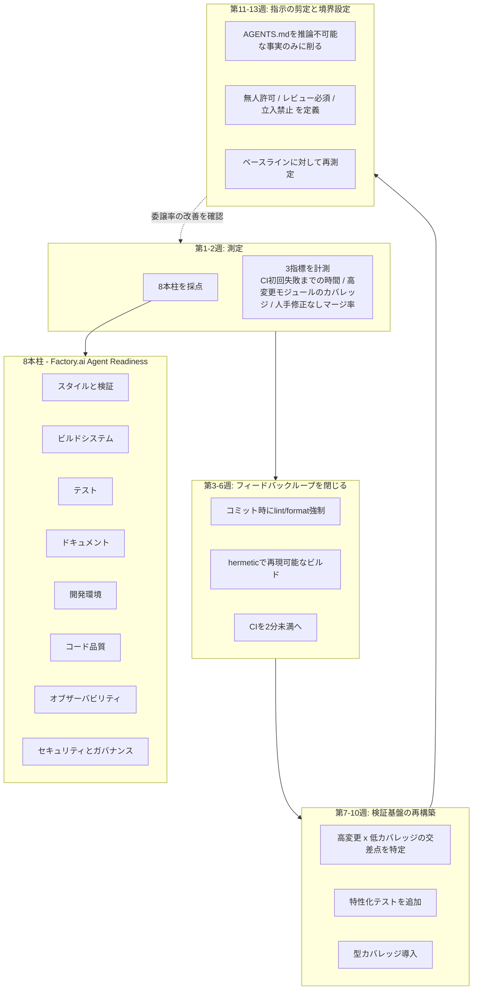
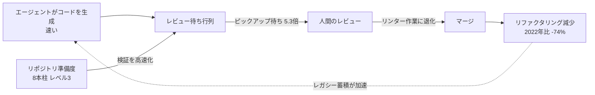
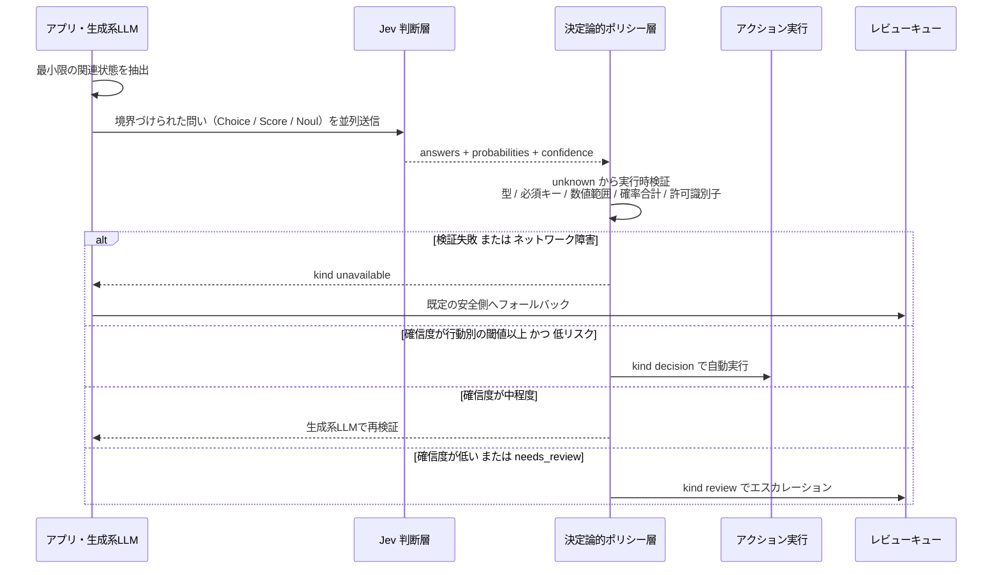
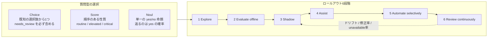
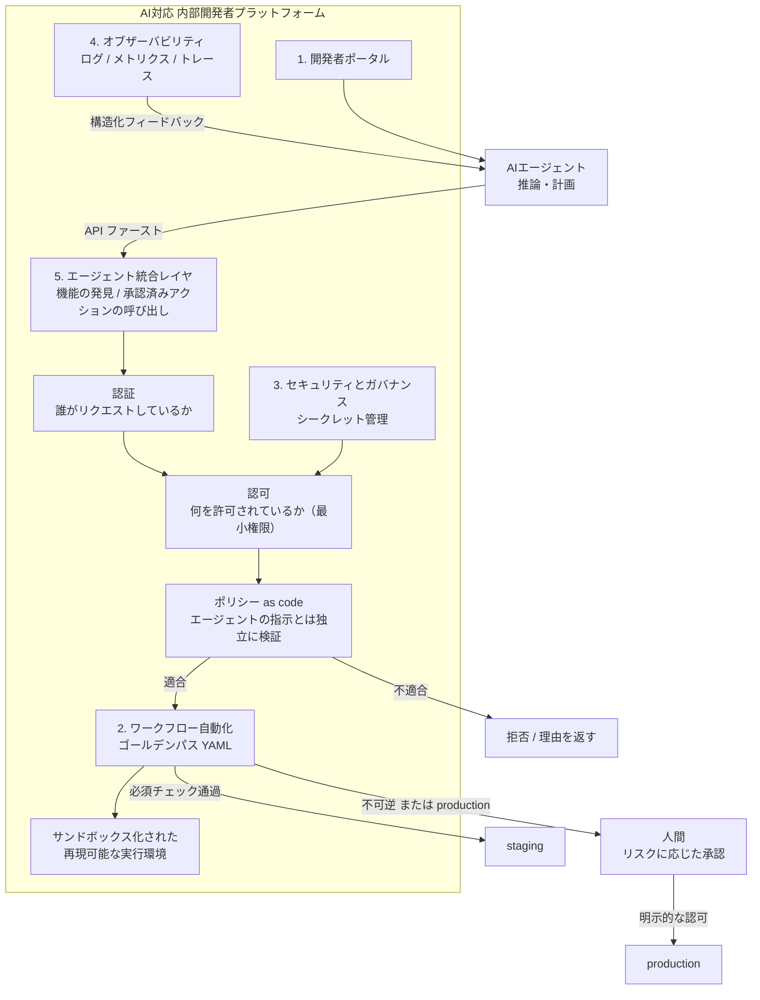
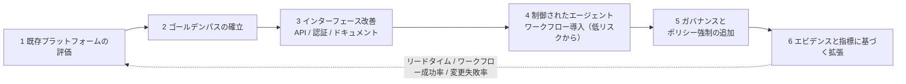

# Daily Briefing 2026-10-07

## 1. ボトルネックはAIエージェントではない。あなたのリポジトリだ（原題: Your AI Agents Aren't the Bottleneck. Your Repository Is.）

- **URL**: https://stepto.net/blog/agent-ready-codebase-repository-readiness-2026
- **公開日**: 2026-08-01（2026-09-24 更新）
- **著者・媒体**: Igor Gazivoda（StepTo 創業者・CEO）/ StepTo Blog

### 本文翻訳

エージェントの性能を決めているのはモデルの能力ではなく、リポジトリ側のインフラである。開発者は業務の約60%でAIを使っているのに、完全に委譲できているのは0〜20%にすぎない。この「委譲ギャップ（delegation gap）」の原因はAIの限界ではなく、検証（verification）の不足にある。

まず、広く信じられている前提を疑う必要がある。ETH Zurich の研究（2026年2月）は、コンテキストファイルが「タスク成功率を一般的には改善せず、推論コストを20%以上増やす」ことを示した。LLMが生成したコンテキストファイルは、複数の検証シナリオで成功率をむしろ下げた。ディレクトリ一覧やコードベース概要が提供する価値はごくわずかだった。そのメカニズムは「コーディングエージェントは従順すぎる」ことにある。エージェントはコンテキストファイルの指示を忠実に守るため、その指示が不要・古い・微妙に誤っているとき、エージェントは律儀に自分の仕事を難しくしてしまう。

AGENTS.md 自体は2025年8月に OpenAI・Google・Cursor・Factory の参加で仕様化され、2025年12月に Linux Foundation の Agentic AI Foundation へ寄贈され、60,000以上のOSSプロジェクトが採用し、Claude Code・Copilot・Cursor・Gemini CLI・Devin・Amazon Q を含む30以上のツールがネイティブに読む。だが書くべき内容は限られる。「コンテキストファイルが元を取れるのは、本当に推論不可能な事実――誰も推測しない社内デプロイ規約、ライセンス上触れてはならない唯一のモジュール、フレームワーク既定と異なるテストコマンド――に限られる」。逆に「見ればわかることはすべて負債であり、実行のたびに金を払うことになる」。典型的な AGENTS.md の最大の構成要素であるコードベース概要とディレクトリ一覧は「ほぼ無価値」だ――エージェントは構造の発見をすでに得意としているからである。

本当に効くコンテキストは「検証可能性」だ。LangChain の構造化スキル研究では、適切なスキャフォールディングがロードされた場合タスク成功率は82%、ない場合は9%だった。Diffblue のテスト生成エージェントは平均行カバレッジ81%を達成し、汎用コーディングエージェントで反復したシニア開発者の32%を大きく上回った。

未成熟なリポジトリの失敗は、わかりやすい指標ではなくレビュー待ち行列に現れる。LinearB の2026年ベンチマーク（42カ国4,800チーム・810万PR）では、エージェントAIのPRはピックアップ待ちが未支援PRの5.3倍、AI PR全体はレビュー着手まで4.6倍待っていた。METR の無作為化比較試験（熟練OSS開発者16名）では、本人は約20%速いと感じていたが実測は約19%遅く、認識と実態に39ポイントの乖離があった。CircleCI の2026年調査では日次ワークフロー実行数が前年比59%増えた一方、フィーチャーブランチのスループットは15%増にとどまり、main ブランチのスループットは7%低下した。CodeRabbit が470件のOSS PRを分析した結果、AIが書いたコードはPRあたりの指摘が約1.7倍、ロジック・正しさの問題は75%多く、セキュリティ問題は最大2.74倍、過剰なI/O操作は約8倍の頻度だった。GitClear の6.23億件の変更分析では、レガシーのリファクタリングが2022年比74%減少している。人間のレビューは「アーキテクチャ判断」ではなく「リンター作業」に退化し、リファクタリングが減ることでレガシーの蓄積が加速する。

評価の枠組みとして、著者は Factory.ai の Agent Readiness に基づく「エージェント準備度の8本柱」を使う。スタイルと検証、ビルドシステム、テスト、ドキュメント、開発環境、コード品質、オブザーバビリティ、セキュリティとガバナンス。各レベルで基準の80%を満たし、かつ下位レベルすべてを満たすことが条件となる。レベル3「標準化済み（standardised）」が、バグ修正・テスト・ドキュメント・依存更新といった定型保守をエージェントに安心して任せられる分岐点である。

実行は90日プログラムとして設計する。第1〜2週は「測定」。8本柱を正直に採点し、重要な3つの数値を計測する――CIが最初の失敗を返すまでの実時間、最も頻繁に変更されるモジュールのテストカバレッジ、人間の追加コミットなしにマージされたエージェントPRの割合。これが委譲率のベースラインになる。第3〜6週は「フィードバックループを閉じる」。フォーマットとリントをコミット時に強制し、ビルドをhermeticかつ再現可能にし、CIレイテンシに正面から取り組む。「2分を切るパイプラインはエージェントの振る舞いを質的に変える。推測せず反復できるようになるからだ」。第7〜10週は「検証基盤の再構築」。変更頻度が高くカバレッジが低い交差点を狙い、高リスクモジュールの周囲に特性化テスト（characterisation tests）を書き、言語が許す範囲で型カバレッジを導入する。第11〜13週は「指示の剪定と境界設定」。AGENTS.md を推論不可能な事実だけに削り、ディレクトリ一覧や発見可能な内容を削除し、エージェントが無人でアクセスできる範囲・レビュー必須のパス・立ち入り禁止領域というガバナンス境界を定義し、第2週のベースラインに対して再測定する。

この作業が社内で進まない理由も明快だ。シニアエンジニアを要し、顧客に見える機能を生まず、恒久的な人員ではなく期間限定（6ヶ月のプロジェクト）であり、既存のデリバリ約束と競合する。著者は、社内エンジニアがデリバリを維持したまま並行チームで進める形を推奨する。

経済性の枠組みはこうだ。「年2,000万円規模のAIツール支出が、メインのコードベースでは10%、クリーンなコードベースでは40%のリターンを返すなら、準備度の作業はスライドに載せられるROIを持つ」。調達の問いも変わる。「どのAIツールを使っていますか？」はもはや差がつかない。問うべきは「あなたたちはリポジトリをどんな状態で残しますか？ hermeticなビルド、高変更モジュールの意味あるカバレッジ、2分未満のCIを残すのか、それとも検証できる速度を超えてコードを生成するだけなのか」。契約に書ける指標は、高変更モジュールのカバレッジ、CI所要時間、人間の修正なしでマージされたエージェントPR率、ビルドのhermeticityである。

結論。ボトルネックはエージェントではなく、それをどこに向けているかだ。

### 重要ポイント

- コンテキストファイル（AGENTS.md / CLAUDE.md）の肥大化は逆効果。ETH Zurich の研究では成功率は一般に改善せず推論コストは20%以上増。ディレクトリ一覧・コードベース概要は「ほぼ無価値」で、推論不可能な事実のみ書くべき。
- 効くのは「検証可能性」。LangChain 研究では適切なスキャフォールディング有りで成功率82%・無しで9%。CIを2分未満にすると「エージェントの振る舞いが質的に変わる」。
- 委譲できない原因はレビュー待ち行列に現れる。LinearB の810万PR分析でエージェントPRのピックアップ待ちは5.3倍、CircleCI では実行回数+59%に対し main のスループットは-7%。
- 計測すべき3指標は「CI初回失敗までの実時間」「高変更モジュールのカバレッジ」「人間の追加コミットなしでマージされたエージェントPRの割合（＝委譲率）」。
- 8本柱（Factory.ai Agent Readiness）でレベル3「標準化済み」に到達すると、バグ修正・テスト・ドキュメント・依存更新を安定して委譲できる。

### 図解





### 現場での適用方法

**(1) AGENTS.md / CLAUDE.md を「推論不可能な事実」だけに剪定する**

既存の肥大化したコンテキストファイルを、以下のルールに置き換える。

```markdown
<!-- <REPO_PATH>/AGENTS.md -->
# AGENTS.md

<!-- 原則: エージェントが「見ればわかる」ことは書かない。
     ディレクトリ一覧・アーキテクチャ概要・ファイル構成の説明は削除する。
     ここに残すのは「推論不可能な事実」だけ。 -->

## コマンド（フレームワーク既定と異なるものだけ）
- テスト: `make test-unit`   # 既定の `npm test` は使わない（DBコンテナを起動しないため）
- 型チェック: `npm run typecheck -- --project tsconfig.strict.json`
- Lint/Format: `npm run fix`  # コミット時に pre-commit で強制される

## 推論不可能な社内規約
- デプロイは `deploy/<ENV>.yaml` の `release_channel` を経由する。直接 `kubectl apply` は禁止。
- 時刻は必ず `lib/clock.ts` の `now()` を使う。`Date.now()` の直接呼び出しはテストを壊す。

## 触ってはいけない領域
- `vendor/<LICENSED_MODULE>/` : ライセンス上、改変禁止（再配布条件に抵触する）
- `db/migrations/` : 既存ファイルの編集は禁止。新規ファイルの追加のみ。

## 境界（ガバナンス）
- 無人で変更可: `src/**`, `test/**`, `docs/**`
- レビュー必須: `deploy/**`, `db/migrations/**`, `.github/workflows/**`
- 立入禁止: `infra/prod/**`, `secrets/**`
```

**(2) 委譲率と3指標を毎週計測するスクリプト**

```bash
#!/usr/bin/env bash
# <REPO_PATH>/scripts/agent-readiness-metrics.sh
# 第1-2週のベースライン計測と、以降の週次再測定に使う。
set -euo pipefail

REPO="${1:-<OWNER>/<REPO>}"
SINCE="${2:-$(date -u -d '14 days ago' +%Y-%m-%d)}"
AGENT_LOGIN="${AGENT_LOGIN:-app/claude}"   # エージェントPRの作者
echo "== 計測期間: ${SINCE} 以降 / repo=${REPO} =="

# 指標1: CIが最初の失敗を返すまでの実時間（中央値, 秒）
gh run list --repo "$REPO" --status failure --created ">=${SINCE}" \
  --json startedAt,updatedAt --limit 100 \
| jq '[.[] | (( .updatedAt | fromdateiso8601) - (.startedAt | fromdateiso8601))]
      | sort | if length==0 then "n/a" else .[length/2|floor] end' \
| xargs -I{} echo "指標1 CI初回失敗までの実時間(中央値,秒): {}"

# 指標2: 直近で最も変更されたモジュール上位10件（ここにカバレッジを当てる）
echo "指標2 高変更モジュール上位10件（この行の対象にカバレッジを計測する）:"
git log --since="$SINCE" --name-only --pretty=format: \
  | grep -E '^(src|lib)/' | sed -E 's#/[^/]+$##' \
  | sort | uniq -c | sort -rn | head -10

# 指標3: 委譲率 = 人間の追加コミットなしでマージされたエージェントPRの割合
gh pr list --repo "$REPO" --state merged --author "$AGENT_LOGIN" \
  --search "merged:>=${SINCE}" --json number --limit 100 \
| jq -r '.[].number' \
| while read -r n; do
    others=$(gh pr view "$n" --repo "$REPO" --json commits \
      | jq --arg a "$AGENT_LOGIN" \
           '[.commits[].authors[].login] | map(select(. != $a and . != null)) | length')
    [ "$others" -eq 0 ] && echo clean || echo dirty
  done \
| sort | uniq -c \
| awk '{print "指標3 " $2 ": " $1}'
```

**(3) CI を 2 分未満に向かわせる計測フック**

```yaml
# <REPO_PATH>/.github/workflows/fast-feedback.yml
# 「最初の失敗を2分以内にエージェントへ返す」ことを目的にした分離パイプライン。
name: fast-feedback
on: [pull_request]
jobs:
  quick:
    runs-on: ubuntu-latest
    timeout-minutes: 3   # 超えたら失敗させ、遅さを可視化する
    steps:
      - uses: actions/checkout@v4
      - uses: actions/setup-node@v4
        with: { node-version: '22', cache: 'npm' }
      - run: npm ci --prefer-offline
      - name: lint + typecheck + 変更分の単体テスト
        run: |
          npm run lint
          npm run typecheck
          npx jest --changedSince=origin/${{ github.base_ref }} --passWithNoTests
```

### 期待効果

- 記事の研究引用に基づく期待値: 適切なスキャフォールディング（検証基盤）が揃うとエージェントのタスク成功率は 9% → 82%（LangChain 研究）。テスト生成では行カバレッジ 32% → 81%（Diffblue）。
- CI が 2 分未満になると「エージェントの振る舞いが質的に変わる」（推測ではなく反復するようになる）。
- AGENTS.md の剪定により推論コストを 20% 以上削減できる余地（ETH Zurich）。
- 8本柱レベル3到達で、バグ修正・テスト・ドキュメント・依存更新の定型保守を安定委譲できる。
- 経済性の提示例: 同額のAIツール支出が、未整備コードベースで10%、整備済みで40%のリターン。

### 注意点

- ETH Zurich の結果は「コンテキストファイルが常に無駄」ではなく「見ればわかる内容は無駄」。推論不可能な事実（社内規約・ライセンス制約・既定と異なるコマンド）は依然として価値がある。剪定しすぎて必要な事実を落とすと逆効果。
- 引用された数値の多くはベンダー調査（LinearB、CodeRabbit、CircleCI、Factory.ai）であり、母集団や定義が自組織と異なる。自前のベースライン計測（第1〜2週）を省略すると改善を主張できない。
- METR の19%遅延は熟練OSS開発者16名という小規模試験。一般化には注意が必要だが「体感と実測の乖離」という示唆は計測の動機として有効。
- 8本柱のレベル判定は「各レベルで基準の80%＋下位レベル全充足」という累積条件。上位柱だけ先に埋めてもレベルは上がらない。
- 準備度作業は顧客に見える機能を生まないため、社内では常にデリバリ案件に負ける。期間限定プロジェクトとして明示的に枠を確保する必要がある。
- 記事の後半は著者企業（StepTo）のニアショア開発の売り込みを含む。実践知として採るのは8本柱と90日プログラム、調達指標の部分に限定するのが妥当。

---

## 2. Jev AI / TypeSafe AI: 本番環境における型付き判断の実践ガイド（原題: Jev AI TypeSafe AI: A Practical Guide to Typed Decisions in Production）

- **URL**: https://huggingface.co/blog/sora-2/jev-ai-typesafe-ai-a-practical-guide-to-typed-deci
- **公開日**: 2026-09-25
- **著者・媒体**: sora-2（寄稿: MAbedallah）/ Hugging Face Blog

### 本文翻訳

「型付き判断（typed decision）」は、JSON でラップしたチャット応答とは本質的に異なる。「型付き判断とは、単にJSONに包まれたチャット回答ではない。それは答えの空間、レスポンスの形、そしてアプリケーションの制御フロー上の明確な位置を持つ、境界づけられた判断である」。

設計の出発点は「判断契約（decision contract）」であり、4つの要件を満たす必要がある。第一に、**最小限の関連状態**。データベースのレコード全体を渡すのではなく、その問いに必要なフィールドだけを含める。第二に、**1つの question ID につき1つの判断**。安定したキーを使い、「振り分け＋緊急度＋返金可否」のような複合質問は避ける。第三に、**明示的な答えの空間**。各選択肢の基準を定義し、どれにも当てはまらない場合のキャッチオール区分を必ず用意する。第四に、**ポリシーはモデルの外**。認可、レート制限、不可逆な操作はアプリケーションコード側に残す。

質問型は3種類ある。**Choice** は既知の選択肢から1つ選ぶ（サポート振り分け、リードのセグメント化、モデル選択）。ルーブリックには、どのカテゴリにも明確に当てはまらないときの `needs_review` フォールバックを含めるべきである。**Score** は緊急度や深刻度のような順序のある性質を、確率で重み付けした値として評価する。基準の例は `routine`、`elevated`、`critical`。**Noul** は単一の yes/no 命題を判定する（例:「このリクエストは明示的に返金を求めているか？」）。返るのは信頼度スコアではなく「yes の確率」である点に注意が必要だ。

実行時の検証は省略できない。TypeScript の型アサーションはネットワーク応答を検証しない。記事はガード関数の実装例を示す。

```typescript
function parseDecision(value: unknown): Decision {
  const root = asRecord(value);
  const answers = asRecord(root?.answers);
  const answer = asRecord(answers?.department);
  const team = answer?.choice;
  const confidence = answer?.confidence;
  const probabilities = asRecord(answer?.probabilities);
  const allowed = ["billing", "technical", "sales", "needs_review"];

  if (
    typeof team !== "string" ||
    !allowed.includes(team) ||
    typeof confidence !== "number" ||
    !Number.isFinite(confidence) ||
    confidence < 0 ||
    confidence > 1 ||
    !probabilities
  ) {
    throw new Error("Unexpected Jev response shape");
  }
  return { team, confidence, probabilities };
}
```

検証では、レスポンスの型、必須キーの存在、数値の範囲、確率の合計、許可された識別子をすべて確認する。

本番アーキテクチャは4段構成になる。(1) 生成系LLMまたはアプリケーションサービスが文脈を集め、境界づけられた問いを作る。(2) Jev が型付き質問を並列に評価する。(3) 決定論的なポリシー層がレスポンスを検証し、権限を確認し、閾値を適用する。(4) アプリケーションが行動するか、確認を求めるか、レビューキューへ送る。

内部表現は結果の種類を区別する判別共用体にする。

```typescript
type WorkflowResult<T> =
  | { kind: "decision"; value: T; confidence?: number }
  | { kind: "review"; reason: string }
  | { kind: "unavailable"; reason: string };
```

これにより「振り分け判断」と「タイムアウト／検証失敗」を混同しなくなる。

価値が高いユースケースは、サポート・運用の振り分け（部門分類、緊急度スコア、レビュー要フラグ）、モデルルーティング（タスク難易度に応じて fast / balanced / reasoning を選択）、ツール呼び出しの安全性（エージェントの不可逆操作の前に Noul 質問を挟む）、コンテンツ・リードのワークフロー（編集キューへの振り分け）、コンテキスト圧縮（ウィンドウ圧縮後に残すべき事実の判定）である。

閾値戦略の原則はこうだ。「誤ったエスカレーションはレビュー担当者の時間を浪費する。見逃した障害は全顧客に影響する」。したがって行動ごとに異なる確信度のバーを設ける。低リスクのコンテンツタグ付けは控えめな閾値で自動適用してよいが、支払い、削除、デプロイ変更は、確信度に関わらずより強い根拠と決定論的なゲートを要求する。監視すべきは確信度だけではない。選ばれた答え、確率のマージン、入力セグメント、人間による修正、エスカレーション率、下流の結果、レイテンシ、unavailable 率を追う。

ロールアウトは6段階のチェックリストに従う。(1) **Explore**: サニタイズしたサンプルで Playground 上で試す。(2) **Evaluate offline**: 通常・曖昧・稀少・高コストのケースを含むラベル付きテストセットを作る。(3) **Shadow**: 既存ワークフローを権威としたまま Jev を並走させ、判断を比較する。(4) **Assist**: オペレーターに提案を表示し、修正を収集する。(5) **Automate selectively**: 閾値を満たす低リスク分岐だけ自動化する。(6) **Review continuously**: ドリフト、修正率、unavailable 応答を監視する。

リリース前の確認項目は9点。状態にシークレットや不要な個人データが含まれていないこと。各質問が1つの安定した ID と明確な目的を持つこと。答えの空間に安全なフォールバックがあること。リモートJSONを `unknown` から実行時チェックでパースしていること。ポリシー層が認可と副作用を所有していること。閾値が実測された誤りコストに紐づいていること。ネットワーク障害と検証失敗が別の結果として扱われていること。APIキーがサーバ側だけにあること。質問と基準のバージョンが観測可能であること。

使うべきでない場合もある。出力が長い説明・下書き・翻訳・自由対話であるとき、条件が完全に決定論的であるとき、データ所在やオフライン運用が最優先要件であるとき、無理に型付けすべきではない。

なお記事は注意書きとして、「サイトは独立運営であり、TypeSafe と提携・運営・推奨の関係にない」と明記していると述べている。最新の製品詳細は公式ページで確認し、すべての TypeScript／TypeSafe 関連プロジェクトが Jev に関係すると仮定しないこと。

### 重要ポイント

- 型付き判断は「答えの空間・レスポンスの形・制御フロー上の位置」を持つ境界づけられた判断。JSONモードのLLM出力とは設計思想が別物。
- 判断契約の4要件: 最小限の関連状態 / 1 question ID に1判断 / 明示的な答えの空間＋キャッチオール / ポリシーはモデルの外。
- 実行時検証は必須。TypeScript の型は通信応答を保証しないため、`unknown` からガード関数で型・必須キー・数値範囲・確率合計・許可識別子を検査する。
- 「判断」「レビュー」「利用不可」を判別共用体で分離し、ネットワーク障害と低確信度を混同しない。
- 閾値は行動ごとに設定する。タグ付けと支払い承認が同じリスクポリシーを共有してはならない。確信度以外に確率マージン・修正率・エスカレーション率・unavailable 率を監視する。
- ロールアウトは Explore → Evaluate offline → Shadow → Assist → Automate selectively → Review continuously の6段階。

### 図解





### 現場での適用方法

**(1) ポリシー層をアプリ側に実装する（TypeScript）**

記事の原則「ポリシーはモデルの外」「行動ごとの閾値」「障害と低確信度の分離」をそのまま実装に落とす。

```typescript
// <REPO_PATH>/src/decisions/policy.ts
export type WorkflowResult<T> =
  | { kind: "decision"; value: T; confidence?: number }
  | { kind: "review"; reason: string }
  | { kind: "unavailable"; reason: string };

// 行動ごとに閾値を分ける。タグ付けと返金承認を同じバーで扱わない。
const THRESHOLDS = {
  "ticket.label":        { auto: 0.70, assist: 0.45 },  // 低リスク・可逆
  "ticket.route":        { auto: 0.85, assist: 0.60 },
  "refund.approve":      { auto: 1.01, assist: 0.80 },  // auto>1 = 自動化を封じる
  "deploy.config.write": { auto: 1.01, assist: 0.90 },
} as const;

type Action = keyof typeof THRESHOLDS;

export async function decide<T>(
  action: Action,
  questionId: string,
  state: Record<string, unknown>,          // 最小限の関連状態のみ
  call: (qid: string, s: unknown) => Promise<unknown>,
  parse: (v: unknown) => { value: T; confidence: number; probabilities: Record<string, number> },
): Promise<WorkflowResult<T>> {
  let raw: unknown;
  try {
    raw = await call(questionId, state);
  } catch (e) {
    // ネットワーク障害は「低確信度」ではない。別の結果として扱う。
    return { kind: "unavailable", reason: `transport: ${(e as Error).message}` };
  }

  let parsed;
  try {
    parsed = parse(raw);                   // unknown から実行時検証
  } catch (e) {
    return { kind: "unavailable", reason: `validation: ${(e as Error).message}` };
  }

  const { auto, assist } = THRESHOLDS[action];
  const margin = topTwoMargin(parsed.probabilities);

  if (String(parsed.value) === "needs_review") {
    return { kind: "review", reason: "catch-all category selected" };
  }
  if (parsed.confidence >= auto && margin >= 0.20) {
    return { kind: "decision", value: parsed.value, confidence: parsed.confidence };
  }
  if (parsed.confidence >= assist) {
    return { kind: "review", reason: `assist band (conf=${parsed.confidence.toFixed(2)})` };
  }
  return { kind: "review", reason: `below assist threshold (conf=${parsed.confidence.toFixed(2)})` };
}

function topTwoMargin(p: Record<string, number>): number {
  const v = Object.values(p).sort((a, b) => b - a);
  return v.length < 2 ? 1 : v[0] - v[1];
}
```

**(2) 不可逆なツール呼び出しの前に Noul ゲートを挟むフック**

```bash
#!/usr/bin/env bash
# <REPO_PATH>/.claude/hooks/pretooluse-irreversible-gate.sh
# Claude Code の PreToolUse フックとして登録し、不可逆操作の前に
# 「この操作は本当に不可逆か / ユーザーが明示的に要求したか」を型付き判断で確認する。
set -euo pipefail
PAYLOAD="$(cat)"                                  # フックからの JSON を stdin で受ける
CMD="$(printf '%s' "$PAYLOAD" | jq -r '.tool_input.command // ""')"

# 決定論的に判定できるものはモデルに聞かない（記事: 完全に決定論的ならJevを使わない）
case "$CMD" in
  *"rm -rf /"*|*"DROP TABLE"*|*"kubectl delete ns"*)
    echo '{"decision":"block","reason":"deterministically forbidden pattern"}'; exit 0;;
esac

RESP="$(curl -sS --max-time 3 -X POST "$JEV_ENDPOINT/decide" \
  -H "Authorization: Bearer $JEV_API_KEY" -H 'Content-Type: application/json' \
  -d "$(jq -n --arg c "$CMD" '{
        question_id:"tool.irreversible.v1",
        type:"noul",
        proposition:"The command performs an irreversible change to production data or infrastructure.",
        state:{command:$c}
      }')" )" || { echo '{"decision":"ask","reason":"jev unavailable: fail safe"}'; exit 0; }

YES="$(printf '%s' "$RESP" | jq -r '.answers.irreversible.probability // empty')"
[ -z "$YES" ] && { echo '{"decision":"ask","reason":"invalid jev response: fail safe"}'; exit 0; }

# 閾値は行動別。不可逆操作は自動許可しない＝ask か block の二択。
awk -v y="$YES" 'BEGIN{ exit !(y >= 0.60) }' \
  && echo "{\"decision\":\"ask\",\"reason\":\"likely irreversible (p=$YES)\"}" \
  || echo '{"decision":"allow"}'
```

**(3) オフライン評価セットの最小構成**

```jsonl
// <REPO_PATH>/evals/ticket-route.v1.jsonl
// 記事の Evaluate offline 段階: 通常 / 曖昧 / 稀少 / 高コスト を必ず混ぜる
{"segment":"normal",   "state":{"subject":"請求書の金額が違う","body":"先月分が二重請求です"}, "expected":"billing"}
{"segment":"normal",   "state":{"subject":"ログインできない","body":"2FAコードが届きません"},   "expected":"technical"}
{"segment":"ambiguous","state":{"subject":"解約したい","body":"料金が高いので技術的に軽いプランは？"}, "expected":"needs_review"}
{"segment":"rare",     "state":{"subject":"","body":"(添付画像のみ)"},                        "expected":"needs_review"}
{"segment":"high_cost","state":{"subject":"全社で障害","body":"APIが全リージョンで500を返す"},  "expected":"technical"}
```

```bash
# 閾値を「実測された誤りコスト」に紐づけて選ぶ
jq -c . <REPO_PATH>/evals/ticket-route.v1.jsonl | while read -r row; do
  st=$(jq -c '.state' <<<"$row"); exp=$(jq -r '.expected' <<<"$row")
  got=$(curl -sS -X POST "$JEV_ENDPOINT/decide" -H "Authorization: Bearer $JEV_API_KEY" \
        -H 'Content-Type: application/json' \
        -d "$(jq -n --argjson s "$st" '{question_id:"ticket.route.v1",type:"choice",
              options:["billing","technical","sales","needs_review"],state:$s}')")
  jq -r --arg e "$exp" '[.answers.department.choice, $e,
       (.answers.department.confidence|tostring)] | @tsv' <<<"$got"
done | awk -F'\t' '{n++; if($1==$2) ok++; print} END{printf "accuracy: %d/%d\n", ok, n}'
```

### 期待効果

- 判断ロジックが「境界づけられた問い＋決定論的ポリシー」に分離されるため、プロンプト変更の影響範囲が制御フローから切り離される。
- 低リスク分岐のみ選択的に自動化することで、エスカレーション量を閾値で直接制御できる（記事はエスカレーション率とレビュー量を主要な監視対象に挙げている）。
- Shadow 段階で既存ワークフローと判断を比較できるため、本番トラフィックに影響を与えずに精度・キャリブレーションを評価できる。
- `unavailable` を独立した結果として扱うことで、ネットワーク障害時に「低確信度扱いで誤って人間に流す／誤って自動実行する」事故を防げる。
- 記事は具体的な改善率の数値を提示していないため、効果は自組織のオフライン評価セットで実測する必要がある。

### 注意点

- 記事自体が「サイトは独立運営であり TypeSafe と提携関係にない」と明記している。API 仕様・レスポンス形状・エンドポイントは公式ドキュメントで必ず検証すること。本稿のコード例のフィールド名（`answers.<qid>.choice` / `.confidence` / `.probability`）は記事の記述に基づく想定であり、実APIと異なる可能性がある。
- Noul が返すのは「yes の確率」であって信頼度ではない。これを confidence と同一視すると閾値設計が崩れる。
- 複合質問（振り分け＋緊急度＋返金可否を1リクエスト）は避ける。question ID が安定しないと、バージョン間の比較と監視ができなくなる。
- 閾値を1つにまとめると、タグ付けと支払い承認が同じリスクポリシーを共有してしまう。行動ごとに分けること。
- 状態の渡し方を誤るとシークレットや不要な個人データが外部に出る。DBレコード全体を投げず、必要フィールドのみに絞る設計レビューが必須。
- 出力が長文説明・翻訳・自由対話の場合、条件が完全に決定論的な場合、データ所在やオフライン運用が最優先の場合は、そもそも型付き判断層を使うべきではない。

---

## 3. 2026年のプラットフォームエンジニアリング: AIエージェントが本当に必要とする社内開発者プラットフォームを作る（原題: Platform Engineering in 2026: Building the Internal Developer Platform Your AI Agents Actually Need）

- **URL**: https://dev.to/eva_clari_289d85ecc68da48/platform-engineering-in-2026-building-the-internal-developer-platform-your-ai-agents-actually-need-57cm
- **公開日**: 2026-09-22
- **著者・媒体**: Eva Clari / DEV Community

### 本文翻訳

「AIエージェントは、それを支えるプラットフォーム、ツール、ガードレールの出来に比例した効果しか出せない」。したがって社内開発者プラットフォーム（IDP）は、人間の開発者とAIエージェントの双方に仕えるものへ進化しなければならない。問いは「どうすれば開発者の生産性を上げられるか」から「どうすればAIエージェントが効果的・安全・確実に働けるIDPを作れるか」へ移る。

AI対応IDPの中核は5つの構成要素からなる。(1) **開発者ポータル** — サービスと機能を発見するための中央インターフェース。(2) **ワークフロー自動化** — ビルドとデプロイの標準化されたプロセス。(3) **セキュリティとガバナンス** — アイデンティティ、認可、シークレット管理。(4) **オブザーバビリティ** — ログ、メトリクス、トレース、そして構造化されたフィードバック。(5) **エージェント統合レイヤ** — 「AIエージェントが機能を発見できるようにする、制御されたインターフェース」。

5番目が従来のIDPに欠けている部分である。重要な設計原則は「エージェントの推論（reasoning）を、プラットフォーム側の信頼された強制・実行機構から分離する」こと。プラットフォームは、要求された操作がポリシーに適合するかを、エージェントの指示とは独立に検証しなければならない。

**ゴールデンパス**は、機械可読なワークフロー定義として公開する。標準化された反復可能な手順をYAMLで表現し、ばらつきを減らしつつ正当な例外は許す。

```yaml
name: python-api-service
version: "1.0"

steps:
  - name: create_repository
    action: repository.create
  - name: configure_ci
    action: pipeline.configure
  - name: run_tests
    action: test.execute
  - name: build_artifact
    action: artifact.build
  - name: security_scan
    action: security.scan
  - name: deploy_staging
    action: deployment.staging
  - name: verify_health
    action: service.health_check
```

認可モデルについて記事は明言する。「タスクを完遂するよう指示されたからという理由だけで、エージェントが認可レイヤを迂回できてはならない」。そのために、認証（誰がリクエストしているか）と認可（何を許可されているか）を分離する。エージェントには**文脈へのアクセスを与え、無制限のアクセスは与えない**。最小権限を原則とする。

実行環境はサンドボックス化され再現可能であること。オブザーバビリティのデータはエージェントの意思決定に使えるよう公開する。検証には policy-as-code を統合する。プラットフォームのインターフェースは API ファースト設計で標準化する。

ヒューマン・イン・ザ・ループは、リスクに応じた自律レベルの表で設計する。

| タスク | 承認の扱い |
|---|---|
| リポジトリのドキュメントを読む | 自動 |
| ビルド失敗を要約する | 自動 |
| プルリクエストを生成する | 自動（レビューワークフロー付き） |
| 隔離環境でテストを実行する | 自動 |
| development へデプロイ | ポリシー制御された自動化 |
| staging へデプロイ | 必須チェックが通れば自動 |
| production の設定を変更 | 明示的な認可 |
| 不可逆なデータ操作を実行 | 厳格な統制と人間の監督 |

リソース消費とコストの管理も必要である。

成功の測定については、「エージェントが生成した変更の量」ではなく、開発者のリードタイム、ワークフロー成功率、変更失敗率、プラットフォーム採用率、セキュリティコンプライアンスの強制状況、エージェントのタスク成果を測るべきだとする。

よくある失敗は6つ。AIエージェントを予測不能性を考慮しない普通のスクリプトとして扱うこと。過剰な権限を与えること。運用上の文脈を無視すること。ロールバック戦略なしに自動化すること。開発者のフィードバックなしに作ること。自律性を高めれば常に結果が良くなると仮定すること。

実践的なロードマップは6フェーズである。(1) 既存プラットフォームの評価。(2) よくあるパターンに対するゴールデンパスの確立。(3) プラットフォームインターフェースの改善（API、認証、ドキュメント）。(4) 制御されたエージェントワークフローの導入（まず低リスクのユースケースから）。(5) より強いガバナンスとポリシー強制の追加。(6) エビデンスと指標に基づく拡張。

記事は技術カテゴリ（開発者ポータル、コンテナオーケストレーション、IaC、CI/CD、GitOps、オブザーバビリティ、ポリシー強制、エージェントツール統合、シークレット管理、アーティファクト管理）を列挙するが、特定製品を推奨はしない。結論として、プラットフォームエンジニアリングの未来は「文脈を理解するもの（context-aware）」になる、と述べる。

### 重要ポイント

- AI対応IDPに足りていないのは5番目の構成要素「エージェント統合レイヤ」＝エージェントが機能を発見し、承認された操作だけを呼び出せる制御されたインターフェース。
- 最重要の設計原則は「エージェントの推論を、プラットフォーム側の信頼された強制・実行機構から分離する」こと。指示されたからといって認可レイヤを迂回できてはならない。
- ゴールデンパスを機械可読なYAMLワークフローとして公開することで、人間とエージェントが同じ標準経路を通れる。
- 自律レベルはリスクで段階化する（読み取り＝自動 → PR生成＝自動＋レビュー → staging＝チェック通過で自動 → production設定＝明示認可 → 不可逆データ操作＝厳格統制）。
- 測るべきはエージェントの変更量ではなく、リードタイム・ワークフロー成功率・変更失敗率・採用率・コンプライアンス強制・タスク成果。

### 図解





### 現場での適用方法

**(1) ゴールデンパスを機械可読なYAMLとして定義し、エージェントに発見させる**

```yaml
# <REPO_PATH>/platform/golden-paths/python-api-service.yaml
name: python-api-service
version: "1.0"
description: "Python API サービスの標準経路。人間とエージェントが同じ経路を通る。"

# エージェント統合レイヤが公開するメタデータ。
# エージェントはこの autonomy を読んで、承認が必要な段を事前に判断する。
steps:
  - name: create_repository
    action: repository.create
    autonomy: automated
  - name: configure_ci
    action: pipeline.configure
    autonomy: automated
  - name: run_tests
    action: test.execute
    autonomy: automated          # サンドボックス内のみ
  - name: build_artifact
    action: artifact.build
    autonomy: automated
  - name: security_scan
    action: security.scan
    autonomy: automated
    blocking: true               # 失敗したら後続を止める
  - name: deploy_staging
    action: deployment.staging
    autonomy: automated_if_checks_pass
    required_checks: [run_tests, security_scan]
  - name: verify_health
    action: service.health_check
    autonomy: automated
  - name: deploy_production
    action: deployment.production
    autonomy: explicit_authorization   # 人間の明示的な認可が必須
```

**(2) 自律レベルを policy-as-code で強制する（OPA / Rego）**

記事の「エージェントの推論をプラットフォームの強制機構から分離する」をそのまま実装する。エージェントの主張ではなく、呼び出されたアクションと認可済みスコープで判定する。

```rego
# <REPO_PATH>/platform/policy/agent_autonomy.rego
package platform.agent

# 既定は拒否。エージェントが「許可されている」と主張しても通さない。
default decision := {"allow": false, "require_human": false, "reason": "no matching rule"}

# 自動実行してよいアクション（読み取り・可逆・サンドボックス内）
automated := {
  "repository.read", "build.summarize_failure",
  "pullrequest.create",            # レビューワークフロー付きで自動
  "test.execute_sandboxed",
  "artifact.build", "security.scan",
}

# ポリシー制御された自動化（development）
policy_controlled := {"deployment.development"}

# 必須チェック通過で自動（staging）
checks_gated := {"deployment.staging"}

# 明示的な認可が必要
explicit_auth := {"config.production.write", "deployment.production"}

# 厳格統制＋人間の監督（不可逆なデータ操作）
strict := {"data.delete", "data.migrate_destructive", "secrets.rotate"}

decision := {"allow": true, "require_human": false, "reason": "automated tier"} {
  automated[input.action]
  input.environment != "production"
}

decision := {"allow": true, "require_human": false, "reason": "policy-controlled dev"} {
  policy_controlled[input.action]
  input.identity.type == "agent"
  input.identity.scopes[_] == "deploy:development"   # 認可は認証と分離
}

decision := {"allow": true, "require_human": false, "reason": "required checks passed"} {
  checks_gated[input.action]
  required := {"run_tests", "security_scan"}
  passed := {c | c := input.checks[_]; input.check_status[c] == "success"}
  required - passed == set()
}

decision := {"allow": false, "require_human": true, "reason": "explicit authorization required"} {
  explicit_auth[input.action]
}

decision := {"allow": false, "require_human": true, "reason": "irreversible: strict controls"} {
  strict[input.action]
}

# ロールバック計画のない自動化は拒否（よくある失敗の4番目）
decision := {"allow": false, "require_human": true, "reason": "no rollback plan"} {
  input.action == "deployment.staging"
  not input.rollback_plan
}
```

```bash
# ゲートの使い方: エージェント統合レイヤからアクション実行前に必ず問い合わせる
opa eval -f pretty -d <REPO_PATH>/platform/policy/agent_autonomy.rego \
  -I 'data.platform.agent.decision' <<'JSON'
{"action":"deployment.staging","identity":{"type":"agent","scopes":["deploy:staging"]},
 "checks":["run_tests","security_scan"],
 "check_status":{"run_tests":"success","security_scan":"success"},
 "rollback_plan":"helm rollback <RELEASE> 0","environment":"staging"}
JSON
```

**(3) CLAUDE.md への追記例（エージェント側に境界を明示する）**

```markdown
<!-- <REPO_PATH>/CLAUDE.md に追記 -->
## プラットフォーム操作の境界

プラットフォーム操作は必ず `platform/golden-paths/*.yaml` の
ゴールデンパス経由で行う。個別のコマンド（`kubectl`, `terraform apply`,
`helm upgrade`）を直接実行しない。

実行前に必ず自律レベルを確認する:
`opa eval -d platform/policy/agent_autonomy.rego -I 'data.platform.agent.decision'`

- `allow: true`                  → 実行してよい
- `require_human: true`          → 実行せず、変更内容とロールバック手順を提示して停止する
- `allow: false` かつ require_human なし → 実行しない。理由をそのまま報告する

ポリシーの判定結果を自分の判断で上書きしない。
「タスクを完遂するよう指示された」ことは認可の根拠にならない。

### 報告すべき指標（変更量ではなく成果）
各作業の最後に以下を記録する:
- リードタイム（着手からマージまで）
- ワークフロー成功率（ゴールデンパスが途中で失敗した回数）
- 変更失敗率（マージ後に revert / hotfix が必要になったか）
```

### 期待効果

- ゴールデンパスを機械可読化することで、人間とエージェントが同一の標準経路を通り、経路のばらつきと「エージェント専用の抜け道」が消える。
- 認証と認可の分離＋policy-as-code により、プロンプトインジェクションや過剰に自信を持ったエージェントが本番設定・不可逆操作へ到達する経路を、プロンプトではなくインフラ側で封じられる。
- 自律レベル表に沿って低リスク操作（ドキュメント読み取り、ビルド失敗要約、PR生成、隔離環境でのテスト）を自動化することで、人間の承認コストを高リスク操作に集中できる。
- 指標を「エージェントが生成した変更の量」からリードタイム・ワークフロー成功率・変更失敗率へ切り替えることで、量だけ増えて速くならない状態を検知できる。
- 記事は具体的な改善率の数値を提示していない。効果はフェーズ1の評価で取ったベースラインとの比較で確認する必要がある。

### 注意点

- 記事は原則とアーキテクチャの提示が中心で、18〜20節にわたる網羅的な構成のため、個別の実装詳細（具体的なツール設定、実測値）は含まれない。本稿の Rego / YAML は記事の原則を実装に落とした例であり、記事に掲載されていたコードはゴールデンパスYAMLと自律レベル表のみ。
- ゴールデンパスは「ばらつきを減らしつつ正当な例外を許す」ものとして設計すること。例外経路を塞ぐと、エージェントも人間もパスの外側で作業し始め、ガバナンスが形骸化する。
- 「自律性を高めれば常に結果が良くなる」という仮定は記事が明示的に失敗として挙げている。フェーズ4は必ず低リスクユースケースから始める。
- オブザーバビリティをエージェントに公開する際、ログやトレースに含まれる顧客データ・シークレットの露出範囲を事前に設計する必要がある（記事はシークレット管理をセキュリティ層の責務としている）。
- ロールバック戦略のない自動化は失敗パターンの1つ。本稿のポリシー例のように、ロールバック計画の存在を機械的な必須条件にしておくのが安全。
- 技術カテゴリの列挙は製品推奨ではない。既存のIDP資産（開発者ポータル、CI/CD、GitOps）を捨てて作り直すのではなく、エージェント統合レイヤとポリシー強制を上に足す方向で読むべき。
