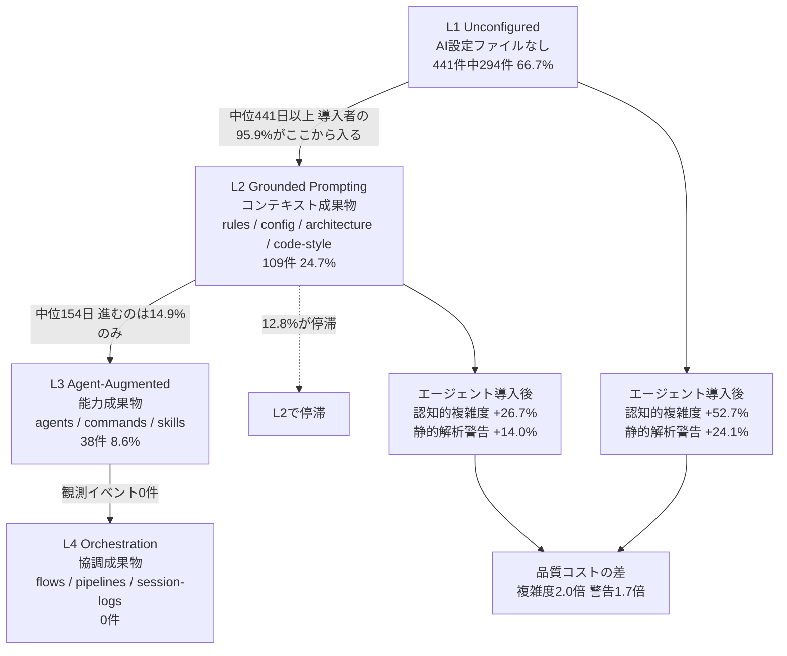
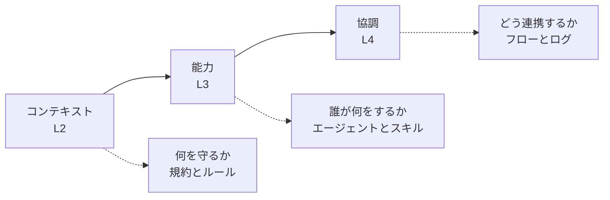
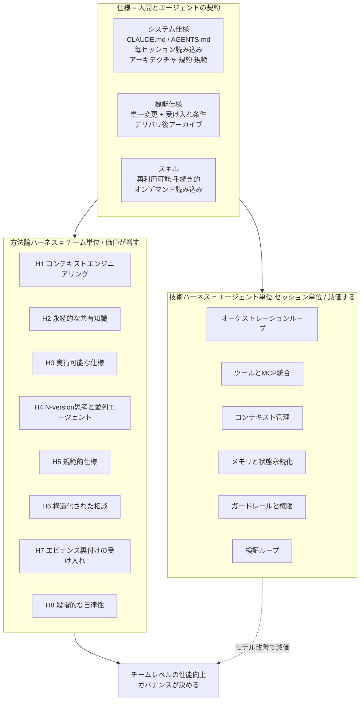
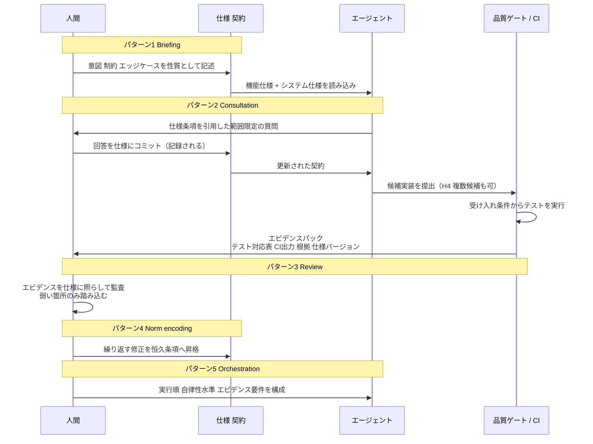
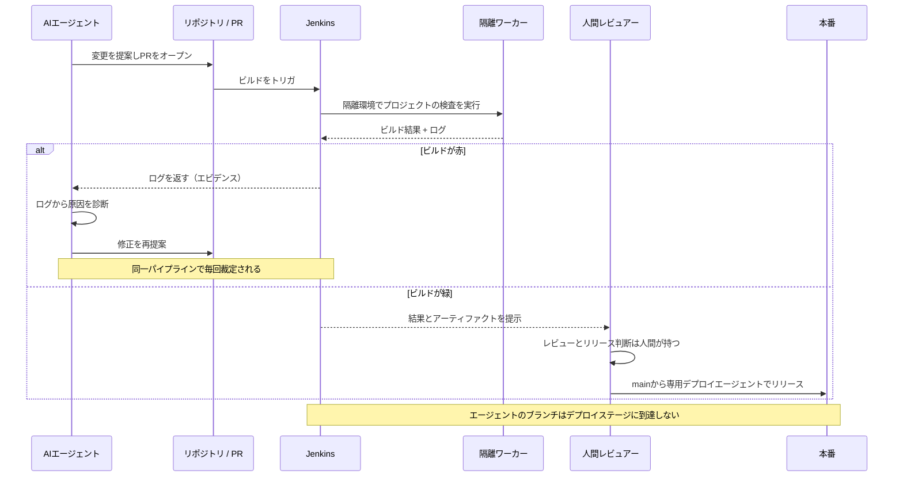
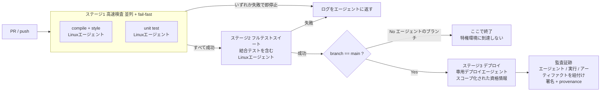

# Daily Briefing 2026-10-08

## 1. 数ページのMarkdown ── コミットされたAI設定とコーディングエージェント導入後の品質コスト低減（原題: A Few Pages of Markdown: Committed AI Configuration and Lower Quality Cost after Coding-Agent Adoption）

- **URL**: https://arxiv.org/abs/2608.25241
- **公開日**: 2026-08-26（v1）／2026-09-14（v2）、ASE '26（ミュンヘン, 2026年10月）採録
- **著者・媒体**: Yegor Denisov-Blanch, Shyam Agarwal, Pavel Azaletskiy, Hao He, Rylan Schaeffer, Brando Miranda, Bogdan Vasilescu, Sanmi Koyejo / arXiv (cs.SE), Proceedings of ASE '26, DOI 10.1145/3832783.3837546

### 本文翻訳

コーディングエージェントは開発を加速させるが、同時に技術的負債を積み増す。これまでの研究は導入企業全体の「平均」しか報告しておらず、チーム間の大きなばらつきを隠してしまっていた。本論文は **RAMP（Repository AI Maturity Profile）** を提案する。これはチームがAIツールを設定するためにバージョン管理下にコミットした成果物のみを根拠として、リポジトリの成熟度を4段階の累積尺度で測る指標である。

RAMPの4レベルは累積的であり、リポジトリのレベルは「検証済み成果物が1つ以上存在する最上位のレベル」で決まる。

- **L1（Unconfigured／未設定）**: AI関連ファイルが一切コミットされていない。AIはプロジェクト知識を持たず、セッションごとにゼロから始まる。
- **L2（Grounded Prompting／接地されたプロンプティング）**: *コンテキスト成果物*。振る舞いのルール・指示（rules）、AIツール設定（config）、アーキテクチャ・設計ドキュメント（architecture）、例付きのコーディング規約（code-style）。
- **L3（Agent-Augmented／エージェント拡張）**: *能力成果物*。役割とツール制限を持つ名前付きエージェント（agents）、再利用可能なコマンド・プロンプトテンプレート（commands）、ドメイン知識ガイド（skills）。
- **L4（Orchestration／オーケストレーション）**: *協調成果物*。タスク割り当てを伴うマルチエージェントワークフロー（flows）、フェーズと依存関係を持つパイプライン、エージェント行動の実行ログ（session-logs）。

著者はこの進行を「コンテキスト → 能力 → 協調」と要約する。

**手法**。開発用サンプルは商用27組織の非公開GitHubリポジトリ441件。初期スイープで1,931リポジトリから30,216件の候補成果物を検出し、1,046件を検証済みとした。12種のAIコーディングツールを43のファイルパターンで照合し、ツールパターン照合と埋め込み（nomic-embed-text-v1.5、768次元）によるパス・内容類似度を組み合わせて9カテゴリに分類する。尺度の妥当性はGuttmanスカログラムで再現性係数CR=0.997、スケーラビリティ係数CS=0.983。人手アノテーションでは3名が35リポジトリの195成果物をラベル付けし、ファイル単位の正解率81.7%、リポジトリ単位の完全一致34/35（97.1%）、二次重み付きκ=0.829を得た。

**レベル分布（441件）**: L1が294件（66.7%）、L2が109件（24.7%）、L3が38件（8.6%）、L4はこのサンプルでは0件。つまり約3分の2のリポジトリはAI設定を一切コミットしていない。

**導入のダイナミクス（研究1、2025年1月〜2026年2月のGit履歴、Kaplan-Meier分析）**。成果物の **73.8%は一度コミットされたあと一切更新されない**。導入者の95.9%はL2から入る。最初の成果物に至るまでの中位待機期間は441日以上（導入前履歴が測定可能なリポジトリでは633日）。導入者の83.1%は単一レベルにしか成果物を追加せず、L2からL3へ進むのは14.9%、逆行経路は2.1%。レベルの後退は0%、放棄は0.5%で、非遷移リポジトリの約12.8%はL2で停滞する。いったんL2に到達すればL2→L3の中位所要日数は154日（n=18）と初期待機より格段に速い。

**エージェントの効果（研究2）**。既存のオープンソースパネルを成熟度層別に再推定した（staggered difference-in-differences、Borusyak et al. の補完推定量）。処置群509リポジトリの内訳はL1が236、L2+が273（L2=210, L3=23, L4=40）。アウトカムはSonarQube指標の対数変換値。エージェント優位（agent-first）層での結果は以下のとおり。

| 指標 | L1（未設定） | L2+（構造化済み） | 比 |
|---|---|---|---|
| コミット数 | +37.6% | +27.5% | 1.4倍 |
| 追加行数 | +48.1% | +68.7% | 0.7倍 |
| 認知的複雑度 | +52.7% | +26.7% | 2.0倍 |
| 静的解析の警告 | +24.1% | +14.0% | 1.7倍 |
| 重複行密度 | +15.4% | +14.2% | 1.1倍 |
| コメント行密度 | +7.1% | +1.9% | 3.7倍（有意でない） |

コミット量の増加は成熟度に関わらず生じる。一方、**品質の劣化は複雑度と警告においてL1リポジトリに集中する**。プール分析では複雑度増加はレベルとともに減衰し、L1で+54.4%、L2で+39.8%、L3〜L4ではゼロと区別できない。ただしL4では重複が+31.4%と有意に増加した。

**実務への示唆**。決定的な差はL1とL2の間にある。L2に必要なのは基本的な成果物（ルールファイル、コーディング規約文書、基本設定）であり、しばしば「コミットされた数ページのMarkdown」に過ぎない。多くの成果物が一度設定されたら改訂されないため、**初期設定がプロジェクトの寿命を通じてエージェントの振る舞いを形づける**。妥当なデフォルトを与えるスターターテンプレートはL2到達を早めうる。分類器はアンケートや計測機構なしにリポジトリ内容だけで動くため、広範なエージェント展開の前にAI設定の薄いプロジェクトを洗い出すポートフォリオ審査に使える。ただし構造化された実践は劣化を軽減するが消し去らない（L2+でも複雑度は+26.7%）。本研究は成果物の「存在」を測るもので、その品質や強制力は測っておらず、観察研究であるため仮説生成的な位置づけである。

### 重要ポイント
- 商用441リポジトリのうち66.7%がL1（AI設定ファイルをまったくコミットしていない）。AI-Ready化は世間の印象よりはるかに進んでいない。
- エージェント導入でコミット量は成熟度に関係なく+28〜38%増えるが、**品質コストだけが成熟度で分岐する**。L1は認知的複雑度+52.7%／警告+24.1%、L2+は+26.7%／+14.0%。
- 効果が最も大きいのはL1→L2の一歩。必要なのは「数ページのコミットされたMarkdown」＝ルールファイル・コーディング規約・ツール設定だけ。
- AI設定成果物の73.8%は一度書かれたら更新されない。最初に雑に書いたファイルがプロジェクトの寿命にわたってエージェントを縛るため、初回の作り込みが決定的。
- 導入は前進一方向（後退0%）だが停滞しやすい。L2で止まるリポジトリが12.8%。L2到達後のL3化は中位154日で進むので、まずL2に乗せることが最優先。

### 図解





### 現場での適用方法

この論文の最大の実務的含意は「**L1のリポジトリをL2に上げる**。それだけで品質コストが半減しうる」であり、L2は数ページのMarkdownで達成できる。以下はそのための具体的成果物。

#### (1) L2到達のための最小 CLAUDE.md テンプレート

論文のL2定義に対応する4要素（rules / config / architecture / code-style）を1ファイルに畳み込んだ最小構成。`<...>` はプレースホルダ。

```markdown
# <PROJECT_NAME>

## アーキテクチャ（L2: architecture）
- 構成: `<src/>` アプリ本体 / `<tests/>` テスト / `<infra/>` IaC
- 依存の向き: `handler -> usecase -> domain <- repository`。逆流は禁止。
- 外部I/Oは必ず `<src/adapters/>` 配下に閉じる。domain層から直接HTTP/DBを呼ばない。

## コーディング規約（L2: code-style）
- 言語/バージョン: `<TypeScript 5.x / Python 3.12>`
- 命名: 関数は動詞始まり、boolean は `is/has/can` 始まり。
- エラー: 例外は必ず `DomainError` にマップして送出する。生の例外を上位に漏らさない。
  - 悪い例: `throw new Error("not found")`
  - 良い例: `throw new DomainError("USER_NOT_FOUND", { userId })`
- 日時は必ず UTC で保持し、表示層でのみローカライズする。

## 振る舞いのルール（L2: rules）
- 実装前に影響範囲を列挙し、変更するファイルを宣言してから編集する。
- 1つの変更に1つの関心事。無関係なリファクタを同じ差分に混ぜない。
- テストのない変更を完了扱いにしない。新規分岐には必ずテストを追加する。
- 既存テストを skip / xfail / コメントアウトして緑にしてはいけない。
- 依存パッケージの追加は提案のみ。勝手に `package.json` / `pyproject.toml` を書き換えない。

## 検証コマンド（L2: config）
- 整形: `<npm run format>`
- 静的解析: `<npm run lint>`
- 型チェック: `<npm run typecheck>`
- テスト: `<npm test>`
- 変更後は上記4つを必ず実行し、すべて緑になってから完了を報告する。

## 触ってはいけない領域
- `<src/billing/>`、`<src/auth/>`、マイグレーション済みの `<migrations/>` 配下は人間のレビュー必須。
  変更が必要な場合は差分を提案し、自動適用しない。
```

#### (2) 組織のポートフォリオをRAMPレベルで棚卸しするスクリプト

論文の分類器は「リポジトリ内容だけで動く」ため、同じ発想をファイルパターン照合で簡易再現できる。エージェント全社展開の前に「設定の薄いリポジトリ」を洗い出す用途。

```bash
#!/usr/bin/env bash
# ramp-scan.sh — リポジトリのRAMPレベル（簡易版）を判定する
# 使い方: ./ramp-scan.sh <REPO_PATH> [<REPO_PATH> ...]
set -uo pipefail

has_any() {  # has_any <repo> <glob> ...
  local repo="$1"; shift
  for pat in "$@"; do
    if find "$repo" -path "$repo/.git" -prune -o -iname "$pat" -print 2>/dev/null | grep -q .; then
      return 0
    fi
  done
  return 1
}

printf '%-40s %-6s %s\n' "REPO" "LEVEL" "DETECTED"
for repo in "$@"; do
  detected=()
  level=1

  # L2: コンテキスト成果物（rules / config / architecture / code-style）
  if has_any "$repo" 'CLAUDE.md' 'AGENTS.md' '.cursorrules' 'copilot-instructions.md' '.windsurfrules'; then
    detected+=("rules"); level=2
  fi
  if has_any "$repo" '.editorconfig' 'ARCHITECTURE.md' 'CONTRIBUTING.md' 'ADR-*.md'; then
    detected+=("architecture/code-style"); level=2
  fi

  # L3: 能力成果物（agents / commands / skills）
  if [ -d "$repo/.claude/agents" ] || [ -d "$repo/.claude/commands" ] || [ -d "$repo/.claude/skills" ] \
     || has_any "$repo" 'SKILL.md'; then
    detected+=("agents/commands/skills"); level=3
  fi

  # L4: 協調成果物（flows / pipelines / session-logs）
  if [ -d "$repo/.claude/workflows" ] || has_any "$repo" 'agent-flow*.y*ml' 'orchestrat*.y*ml'; then
    detected+=("flows"); level=4
  fi

  [ ${#detected[@]} -eq 0 ] && detected=("none")
  printf '%-40s L%-5s %s\n' "$(basename "$repo")" "$level" "$(IFS=,; echo "${detected[*]}")"
done
```

```bash
# 実行例: 配下の全リポジトリを一括棚卸し
./ramp-scan.sh ~/work/repos/*
```

#### (3) L1への逆戻りをCIで防ぐガード

論文が示す「初期設定がプロジェクトの寿命を支配する」「73.8%は二度と更新されない」への対策として、設定ファイルの存在をCIで必須化し、変更時はレビューを強制する。

```yaml
# .github/workflows/ai-config-guard.yml
name: ai-config-guard
on: [pull_request]

jobs:
  require-l2-artifacts:
    runs-on: ubuntu-latest
    steps:
      - uses: actions/checkout@v4
      - name: L2成果物の存在を必須化
        run: |
          missing=0
          for f in CLAUDE.md .editorconfig; do
            if [ ! -f "$f" ]; then
              echo "::error::RAMP L2 成果物が欠落: $f"
              missing=1
            fi
          done
          # 検証コマンドがCLAUDE.mdに書かれているか（configカテゴリ相当）
          grep -qiE '(lint|typecheck|test)' CLAUDE.md \
            || { echo "::error::CLAUDE.md に検証コマンドの記述がありません"; missing=1; }
          exit $missing
```

```
# .github/CODEOWNERS
# AI設定は「一度書いたら放置」になりがちなので、変更時にレビューを強制する
/CLAUDE.md              @<TECH_LEAD_HANDLE>
/.claude/              @<TECH_LEAD_HANDLE>
/.editorconfig          @<TECH_LEAD_HANDLE>
```

### 期待効果

- エージェント優位なリポジトリをL1からL2に上げた場合、論文の観察値では認知的複雑度の増加が **+52.7% → +26.7%（約2分の1）**、静的解析警告の増加が **+24.1% → +14.0%（約1.7分の1）** に抑えられる。コミット量の増加（+27.5%）はL1（+37.6%）と同程度に保たれるため、「スピードを落とさず品質コストだけ下げる」方向の効果が期待できる。
- L3まで到達したリポジトリでは、プール分析上の複雑度増加が統計的にゼロと区別できない水準まで減衰している。
- 一度L2に乗ればL2→L3の移行は中位154日で進む（初回到達の441日以上と比べて大幅に短い）。最初の一歩を支援する効果が後続にも波及する。
- 分類器ベースの棚卸しはアンケート不要なので、数百リポジトリ規模のポートフォリオでも「エージェント展開前にどこが危険か」を低コストで特定できる。

### 注意点

- **観察研究であり因果ではない**。著者自身が仮説生成的と明言しており、エンジニアリング規律の高いチームがそもそも設定をコミットしやすい（交絡）、モデル能力の違いなどが差の一部を説明しうる。
- RAMPは成果物の**存在**しか測らない。品質や強制力は評価対象外なので、「CLAUDE.mdを置けばL2」という形式的な達成は実効を伴わない。上記テンプレートのように検証コマンドと禁止事項まで書き切ることが実質的な条件。
- L2+でも複雑度は+26.7%増える。構造化は劣化を**軽減**するが消さない。レビュー体制や複雑度の計測（SonarQubeの Cognitive Complexity など）は別途必要。
- **L4は安全地帯ではない**。L4層では重複行密度が+31.4%と有意に増加している。マルチエージェント化は別種の品質問題（同じコードの並行生成）を持ち込む可能性がある。
- 開発用サンプルは商用27組織の非公開リポジトリ441件で、L4は観測されていない。オープンソースや別業種への一般化には留保が必要。

## 2. エージェンティック・ソフトウェアエンジニアリングのための仕様駆動開発 ── 人間とエージェントのチームワークを活用する（原題: Spec-Driven Development for Agentic Software Engineering: Harnessing Human-Agent Teamwork）

- **URL**: https://arxiv.org/abs/2609.00252
- **公開日**: 2026-08-31（v1）
- **著者・媒体**: Jessica Diaz, Joaquin Gayoso, Andrea Cimminio, Jorge Perez / arXiv (cs.SE)

### 本文翻訳

ソフトウェアエンジニアリングは、AI支援の「vibe coding」から、自律エージェントがゴールレベルのタスクを担う **Agentic Software Engineering（ASE）** へ移行しつつある。しかし産業界は生産性のパラドックスを報告している。個人の産出は増えるのに、チームのスループット、レビュー能力、安定性は低下するのだ。本論文は、チーム規模のASEを支える規律としてSDD（仕様駆動開発）の概念的・方法論的基盤を確立し、チームがエージェントの振る舞いを統治するために用いる機構群（ハーネス）を運用的に特徴づける。査読済みのエビデンスがまだ確立していないため、手法はビジョン論文・実践報告・講演・ツールといったグレー文献に基づく概念分析である。

**SDDの運用的定義**。チームが次の4条件を満たすときSDDの下にあるといえる。(1) 自明でない変更はすべて、契約として扱われる書かれた仕様から始まる。(2) 仕様はコードとともにバージョン管理される。(3) 成果物は仕様から追跡可能な由来をもって導出される。(4) 仕様と成果物が食い違ったときは**仕様が勝ち**、成果物を再導出するか仕様を修正して矛盾を解消する。

**仕様が解く3つの問題**。*契約*：曖昧なチケットは「もっともらしいが誤った」コードを生む。*協調*：並列エージェントは共有コードではなく、作業を分解しマージするための共有基盤を必要とする。*信頼*：人間はエージェント規模の出力を1行ずつ検査できないため、信頼は仕様に照らして検証されたエビデンスに置かれなければならない。

**2つの仕様レベル**。*システム仕様*は持続的なプロジェクト文脈（アーキテクチャ、規約、規範）を記述し、エージェントのルールファイル（CLAUDE.md、AGENTS.md など）として具体化され、毎セッション読み込まれる。*機能仕様*は単一の変更を受け入れ条件つきで記述し、デリバリ後にアーカイブされる。**スキル**は第三の成果物クラスで、再利用可能・手続き的・オンデマンド読み込みである。規範は常時有効なシステム仕様に置くべきで、スキルに置いてはならない。スキルに置かれた規範は、そのスキルがたまたま読み込まれたときだけ適用されてしまうからだ。

**技術ハーネス（エージェント単位・セッション単位）**。構成要素はオーケストレーションループ、ツール（MCP統合を含む）、コンテキスト管理、メモリと状態の永続化、ガードレールと権限、検証ループ。著者はこのハーネスを**過渡的**と位置づける。モデルの改善とともに減価し、モデルと共進化する。

**方法論ハーネス（チーム単位）**。こちらは時間とともに**価値が増す**。チームの意図と意思決定を符号化しているからだ。8つの機構がある。

| # | 機構 | 中核のコミットメント | 具体例（返金機能） |
|---|---|---|---|
| H1 | コンテキストエンジニアリング | チームが共有・バージョン管理されたエージェント文脈を維持する | wikiにあったUTCタイムスタンプの決定をシステム仕様の1行ルールへ移す |
| H2 | 永続的な共有知識 | 決定とその根拠がセッション・エージェント・ツールを越えて永続する | 初日に下した冪等性の決定を、新しいセッションとサブエージェントが取得できる |
| H3 | 実行可能な仕様 | 仕様はテスト可能で機械検査可能である | Given–When–Then の受け入れ条件が二重送信テストになり、所有者チェックがCIで走る |
| H4 | N-version思考と並列エージェント | 複数候補を生成し1つの仕様に照らして評価する。git worktree で隔離する | 冪等性の候補3案を比較し、check-then-insert 版はレースコンディションにより却下 |
| H5 | 規範的仕様 | チームの恒久的な規範を明示し、バージョン管理し、常時読み込む | レビューで繰り返し修正された結果「例外は DomainError にマップする」条項を追加 |
| H6 | 構造化された相談 | エージェントが中断し、仕様条項を引用した範囲限定の質問を記録付きで上げる | ページネーション戦略の質問を上げ、回答を仕様にコミットする |
| H7 | エビデンス裏付けの受け入れ | 「完了」とは仕様適合を示すエビデンスパックの提示を意味する | 生の差分を読む代わりに、テスト対応表・CI出力・根拠・仕様バージョンへのリンクを確認 |
| H8 | 段階的な自律性 | 自律性はタスククラスごとに明示的かつ改訂可能に設定する | 依存パッチは自律実行、認証変更は承認済みプランとステップ単位レビューを要求 |

**人間とエージェントの5つの相互作用パターン**。

1. **Briefing（ブリーフィング）**：人間は構造化された仕様を通じて意図を伝え、エージェントはその下で作業する。上流かつ契約的な相互作用。人間は意図・制約・エッジケースを述べ、「この操作は冪等でなければならない」といった**性質**で考える。チームは共有のブリーフテンプレートを必要とし、結果のコードだけでなくブリーフ自体をレビューする。
2. **Consultation（相談）**：エージェントが一時停止して範囲限定の決定を求める。エージェント発の相互作用で、範囲は限定され、やり取りは記録される。人間は常時監督する代わりに、呼ばれたとき素早く文脈をロードして専門性を提供する。チームは相談の種類を役割にマッピングするルーティング規則と、応答時間の規律を必要とする。未回答の相談は並列エージェントを止めてしまうからだ。
3. **Review（レビュー）**：人間はエビデンスパックを、元の仕様に照らして監査する。正しさを自分で再導出する代わりにエビデンスを読み、弱いエビデンスには選択的に踏み込む。チームはエビデンスを自動生成する品質ゲートと、エビデンスベースのレビューを受け入れる文化を必要とする。一部のシニアエンジニアは当初これを統制の喪失として体験しうる。
4. **Norm encoding（規範の符号化）**：人間は繰り返される修正を、システム仕様のルールファイル（agent.md など）の恒久条項へと転化する。この作業は累積的で、チーム全体に共有される。人間は個別の修正から一般規則へ抽象化する能力を要し、チームは規範的内容を規律をもって維持しなければならない。
5. **Orchestration（オーケストレーション）**：人間はマルチエージェントのワークフローを構成する。どのエージェントがどの順で、どの自律性水準で、どのエビデンス要件の下に走るかを決める。オーケストレータは流れを導き、品質ゲートを制御し、結果を統合し、最終責任を持つが、自らコードは書かない。サブエージェントは各自の隔離された文脈でコードを書くため、オーケストレータがボトルネックにならない。人間はエージェント能力のポートフォリオ思考、コスト意識、ワークフローのデバッグ能力を必要とする。

**結論**。ASEは、仕様が人間とエージェントの主要な協調成果物となる社会技術的再編成を要求する。個人の生産性向上がチームレベルの性能向上になるかどうかを決めるのは、モデル能力だけではなく**ガバナンス**である。著者はこの枠組みを検証済みの方法論ではなく概念モデルとして提示し、その主張を経験的に検証されるべき「反証可能な仮説」として位置づけている。

### 重要ポイント
- SDDの判定基準は明快な4条件。とくに「**仕様と成果物が食い違ったら仕様が勝つ**」を運用に組み込めているかが分水嶺。
- 技術ハーネス（コンテキスト管理、ツール、ガードレール）は**減価する**。モデルが良くなれば不要になる。価値が**増す**のはチーム単位の方法論ハーネス（H1〜H8）であり、投資先はこちら。
- 仕様は2層に分ける。**システム仕様**＝常時読み込みのルールファイル（持続する規約・規範）、**機能仕様**＝変更単位で作られデリバリ後アーカイブ。規範をスキルに書くのは誤り（読み込まれたときだけ効いてしまう）。
- 「完了」の定義を差分レビューからエビデンスパック（テスト対応表・CI出力・仕様バージョンリンク）に置き換える（H7）。レビューがボトルネックになる問題への直接的な処方。
- 人間の役割は5パターンに再編される。とくに Norm encoding（繰り返す修正を恒久ルールへ昇格）は累積的に効く唯一の作業。
- 概念分析であり経験的検証は未了。著者自身が「反証可能な仮説」と明言している。

### 図解





### 現場での適用方法

#### (1) システム仕様と機能仕様を分離するリポジトリ構成

論文の「2レベル＋スキル」をそのままディレクトリに落とす。

```
<REPO_ROOT>/
├── CLAUDE.md                  # システム仕様: 常時読み込み。規約と規範のみ。
├── .claude/
│   ├── skills/                # スキル: 再利用可能・手続き的・オンデマンド
│   │   └── db-migration/SKILL.md
│   └── commands/
│       └── brief.md           # Briefing テンプレートを呼ぶコマンド
└── specs/
    ├── active/                # 機能仕様: 進行中
    │   └── 0142-refund-idempotency.md
    └── archive/               # デリバリ後アーカイブ
        └── 0138-login-rate-limit.md
```

#### (2) H5（規範的仕様）: CLAUDE.md への追記例

論文が強調する「規範はスキルではなく常時読み込みのシステム仕様に置く」を実装する。Norm encoding（パターン4）で増えていく区画を明示的に設ける。

````markdown
## 規範的仕様（NORMATIVE — 例外なく適用。スキルではなくここに置く）

> このセクションはレビューで繰り返し発生した修正を恒久条項へ昇格させる場所。
> 追記は必ずPRで行い、根拠となったレビューコメントのURLを添える。

| # | 条項 | 昇格の根拠 |
|---|------|-----------|
| N-001 | 例外は必ず `DomainError` にマップして送出する。生の例外を層境界から漏らさない。 | `<PR_URL>` で3回同じ指摘 |
| N-002 | 日時は UTC で保持する。ローカライズは表示層のみ。 | `<PR_URL>` |
| N-003 | 外部APIを叩く操作は冪等キーを受け取り、冪等に設計する。 | `<INCIDENT_URL>` |
| N-004 | 既存テストの skip / xfail / 削除で緑にしてはならない。 | `<PR_URL>` |

## 仕様の優先順位（SDDの第4条件）
- 実装と `specs/active/<ID>-*.md` が食い違った場合、**仕様が勝つ**。
  1. まず仕様が正しいか確認する。
  2. 仕様が正しければ実装を再導出する。
  3. 仕様が誤っていれば仕様を修正するPRを先に出し、それから実装する。
- どちらを選んだかと理由を、変更のエビデンスパックに必ず記載する。

## 段階的な自律性（H8）
| タスククラス | 自律性 | 必要なもの |
|---|---|---|
| 依存パッチ、フォーマット、タイポ | 自律実行 | CI緑のみ |
| 新規機能、リファクタ | 計画承認後に実行 | 機能仕様 + エビデンスパック |
| 認証、課金、マイグレーション、権限 | ステップ単位レビュー | 承認済みプラン + 人間の逐次承認 |

## 構造化された相談（H6）
判断がつかない場合は推測で進めず、**相談**を上げる。形式は必ず以下。
```
CONSULT: <1行の質問>
SPEC-CLAUSE: <specs/active/...#セクション または N-00X>
OPTIONS: A) <案と帰結>  B) <案と帰結>
RECOMMENDATION: <推奨とその理由>
BLOCKS: <この質問が止めている作業>
```
回答を得たら、回答内容を仕様ファイルにコミットしてから実装を続ける。
````

#### (3) H3 + H7: 機能仕様テンプレートとエビデンスパック

```markdown
<!-- specs/active/0142-refund-idempotency.md -->
# 0142 返金APIの冪等性

- Status: active
- Owner: <OWNER_HANDLE>
- Spec-Version: 3        # 変更ごとにインクリメント。エビデンスパックから参照される。

## 意図（Briefing: 性質で書く）
返金操作は冪等である。同一の冪等キーによる再送は、副作用を追加せず初回と同じ結果を返す。

## 制約
- 既存の `POST /refunds` の互換を壊さない。
- 冪等キーの保持期間は24時間。

## 受け入れ条件（H3: 実行可能な仕様）
- AC-1
  - Given 冪等キー `K` で返金が1件成功している
  - When 同じキー `K` で同じ本文を再送する
  - Then HTTP 200 と初回と同一の `refund_id` を返し、返金レコードは1件のままである
  - Test: `tests/refund/test_idempotency.py::test_replay_returns_same_refund`
- AC-2
  - Given 冪等キー `K` で2つのリクエストが同時に到着する
  - When 両者が並行に処理される
  - Then 返金レコードは1件だけ作成される（check-then-insert は不可。一意制約 + ON CONFLICT を用いる）
  - Test: `tests/refund/test_idempotency.py::test_concurrent_requests_create_one`

## エッジケース
- 同じキーで**異なる本文**が来た場合は 409 を返す。

## 未解決（H6の相談ログ）
- [x] CONSULT: 保持期間はどこで切るか → 24時間。回答を上記制約に反映済み（Spec-Version 2→3）。
```

```markdown
<!-- PRテンプレート: .github/pull_request_template.md -->
## エビデンスパック（H7: これが「完了」の定義）

- 仕様: `specs/active/<ID>-<name>.md` / Spec-Version: `<N>`
- システム仕様の適用条項: `<N-001, N-003>`

### 受け入れ条件とテストの対応
| AC | テスト | 結果 |
|----|--------|------|
| AC-1 | `<test path::name>` | <pass> |
| AC-2 | `<test path::name>` | <pass> |

### CI出力
- lint: `<link>` / typecheck: `<link>` / test: `<link>`

### 設計判断の根拠
- <採った案と、却下した案とその理由。H4で複数候補を比較した場合はその比較結果>

### 自律性クラス（H8）
- `<自律実行 / 計画承認後 / ステップ単位レビュー>`

> レビュアーは差分を1行ずつ再導出せず、上記エビデンスを仕様に照らして監査する。
> 弱いエビデンス（対応テストのないAC、根拠の空欄）がある箇所のみ差分に踏み込む。
```

#### (4) H4: N-version思考を git worktree で回す

```bash
#!/usr/bin/env bash
# nversion.sh — 1つの仕様に対し複数候補を隔離生成し、同じゲートで評価する
# 使い方: ./nversion.sh specs/active/0142-refund-idempotency.md 3
set -euo pipefail
SPEC="$1"; N="${2:-3}"
BASE="$(git rev-parse --abbrev-ref HEAD)"
ID="$(basename "$SPEC" .md)"
# 自環境のテストコマンドに置き換える（<TEST_COMMAND>）
TEST_CMD="${TEST_CMD:-npm test}"

for i in $(seq 1 "$N"); do
  WT="../wt-${ID}-v${i}"
  git worktree add -b "cand/${ID}-v${i}" "$WT" "$BASE"
  (
    cd "$WT"
    # 候補ごとに独立したエージェントセッションで実装させる
    claude -p "仕様 ${SPEC} を読み、受け入れ条件をすべて満たす実装を行え。
CLAUDE.md の規範的仕様に従うこと。実装方針は候補 ${i} として他案と異なるアプローチを試みよ。
完了前に lint / typecheck / test をすべて実行し、結果を EVIDENCE.md に記録せよ。"
  ) || echo "候補 v${i} は失敗"
done

echo "--- 同一ゲートで候補を評価 ---"
for i in $(seq 1 "$N"); do
  WT="../wt-${ID}-v${i}"
  echo "== 候補 v${i} =="
  ( cd "$WT" && $TEST_CMD 2>&1 | tail -5 ) || true
done
echo "採択後: git worktree remove ../wt-${ID}-v<不採用番号>"
```

### 期待効果

- 「完了＝エビデンスパック」への移行（H7）により、レビュアーの作業が「差分の再導出」から「仕様への適合監査」に変わる。論文が出発点に置く生産性パラドックス（個人産出は増えるがチームのレビュー能力が低下する）に対する直接の処方。
- 規範の符号化（H5／パターン4）は**累積的**に効く。同じレビュー指摘が3回出たら恒久条項に昇格させる運用により、指摘の再発が構造的に止まる。
- 技術ハーネスはモデル改善で減価し、方法論ハーネスは価値が増す──という区別は投資配分の指針になる。ツール選定より、仕様・規範・エビデンス・自律性設計への投資を優先すべきという判断根拠が得られる。
- 段階的自律性（H8）をタスククラス表として明文化すると、「どこまで任せるか」の判断が属人的な勘からレビュー可能な設定に変わる。
- ただし本論文は概念枠組みであり、定量的な効果見積もりは提示していない。数値は読者側で計測する必要がある。

### 注意点

- **経験的検証が未了**。著者はグレー文献に基づく概念分析であること、構成概念は検証済み理論ではなく「反証可能な仮説」であることを明言している。そのまま組織標準にする前に自チームで計測すべき。
- **成熟度モデルは提示されていない**。論文はRA4（組織的な採用経路）を将来課題として明示的に先送りしており、「どの順でH1〜H8を導入すべきか」「部分採用は無採用より悪いのか」には答えがない。H5（規範）とH7（エビデンス）から始めるのは本ブリーフィング側の判断である。
- **H6（相談）には応答時間の規律が必要**。未回答の相談は並列エージェントを止める。相談の種類を役割にルーティングする規則と応答SLAを決めずに導入すると、かえってスループットが落ちる。
- **パターン3（Review）は文化的な摩擦を生む**。論文自身が「一部のシニアエンジニアは当初これを統制の喪失として体験しうる」と指摘している。エビデンス自動生成の品質ゲートを先に整えないと、単なるレビュー放棄に見える。
- H4（N-version）はトークンコストとレビュー対象が候補数に比例して増える。認証・課金のような高リスク領域に限定するか、候補数を2〜3に絞る運用が現実的。
- H3の受け入れ条件は「機械検査可能」でなければ意味がない。Given–When–Thenを書いてもテストに結び付けなければ、仕様は単なる願望になる。

## 3. JenkinsとAIエージェント ── より速いソフトウェアデリバリのための信頼できるエンジン（原題: Jenkins and AI Agents: The Trusted Engine for Faster Software Delivery）

- **URL**: https://www.jenkins.io/blog/2026/10/01/jenkins_in_age_of_sdlc/
- **公開日**: 2026-10-01
- **著者・媒体**: Stefan Spieker（ソリューションアーキテクト、長年のJenkinsコントリビュータ）/ jenkins.io ブログ

### 本文翻訳

AIエージェントは今や、リファクタリング、プルリクエストのオープン、修正の試行といった大きめのコーディングタスクを引き受けられる。本記事はこれがCI/CDシステムを不要にするという考えを否定する。**変更を生成したことは、それが動く証明にはならない**。リリース前に、なおコードをビルドし、テストを走らせ、制約を強制し、結果を報告する何かが必要だ。著者は、Jenkinsはエージェントが依存する実行エンジンとして残るのであって、AIに置き換えられるシステムではないと論じる。

**決定性が非決定性と出会う**。AIの出力は確率的であり、同じ依頼から異なるコード、異なる確信度が返ってくる。一方デリバリパイプラインは反復可能な検査（コンパイル、スタイル適合、テスト、性能・セキュリティ基準）に依存している。

Jenkinsは提案された変更を隔離されたワーカー上で実行し、プロジェクトの検査を走らせ、ビルド結果とログを返す。エージェントが得るのは安心感ではなく**エビデンス**である。ビルドが失敗したら、エージェントはログを使って原因を診断し、再試行できる。あらゆる試行が同一のパイプラインで裁定される。赤いビルドはログをエージェントに返し、緑のビルドは人間のレビューとリリースへ進む。

著者は注意を促す。緑のビルドは、ソフトウェアに欠陥がないことや、あらゆるビジネス要件を満たすことの証明ではない。しかしそれは、コードについて推論するだけでは得られない**具体的で反復可能なシグナル**である。

**より速いフィードバックのためのパイプライン最適化**。エージェントはより多くの変更とより多くのビルドサイクルを生成するため、パイプラインのレイテンシがこれまで以上に重要になる。推奨プラクティスは次のとおり。並列ステージを走らせる。効果的なキャッシュを使う。対象を絞ったテストを走らせる。ワーカーを適切にサイジングする。速く価値の高い検査を先に走らせる。そしてデプロイ前の完全なテストとリリースゲートは維持する。

記述されているパイプラインパターンは3段構成である。

1. **高速検査ステージ**：並列実行し、fail-fast を有効化して、1つが落ちたら他のブランチも即座に停止する。コンパイル＋スタイルのブランチと、ユニットテストのブランチを含み、どちらもLinuxエージェント上で走る。
2. **フルテストスイートステージ**：結合テストを含む完全なテストスイートをLinuxエージェント上で走らせる。
3. **デプロイステージ**：`main` ブランチでのみ、専用のデプロイエージェント上で走る。エージェント（AI）のブランチは決してここに到達しない。

**ガバナンスと監査可能性**。エージェント生成のPRが増えるとレビュー能力を圧迫し、資格情報の漏洩、テストの弱体化、エージェントの意図した範囲を超える変更といったリスクを高める。推奨される統制は、Jenkinsでのアクセス制御の強制、目的ごとにスコープを絞った資格情報、HashiCorp Vault などシークレットマネージャとの統合、アーティファクトの署名、各エージェントの権限の制限、信頼できない変更を特権環境から遠ざけること、そしてビルド記録・ソース管理・provenanceツールを用いて変更をエージェント・パイプライン実行・生成アーティファクトに結びつける監査証跡の維持である。この監査証跡が調査とロールバックを支える。

**異種混在のエンタープライズシステムへの橋渡し**。企業にはレガシーシステム、複数のクラウドプロバイダ、Kubernetesクラスタ、内製ツール、特殊なデプロイ手順が併存する。Jenkinsは長年これらをパイプラインとプラグインで接続してきた。チームは、エージェントとツールの組み合わせごとにカスタム統合を作るのではなく、既存のデリバリ手順をジョブとパイプラインステージとして**公開**すればよい。

`Jenkinsfile` はまた、エージェントと人間の共通言語としても機能する。パイプラインがコードであるため、エージェントはワークフローを検査し、変更を提案し、新規プロジェクト用のパイプラインを生成できる。レビュアーはそれらの変更をアプリケーションコードと並べて検査できる。著者は、エージェント生成のパイプライン変更にもアプリケーションコードと同じテストとレビューが必要だと強調する。

**結論と推奨**。AIエージェントを次第に自律的になっていくコントリビュータとして扱え。ただしその出力をデフォルトで正しいものとして扱うな。Jenkinsを、エージェントの提案した変更を同じ検査にかける反復可能・観測可能な層として使え。レビューとリリースの判断には人間の判断を残せ。本質的なゲートを取り除くことなく、速いフィードバックのためにパイプラインを最適化せよ。最小権限アクセス、スコープを絞った資格情報、完全な監査証跡を強制せよ。パイプライン定義にもアプリケーションコードと同じレビュー基準を適用せよ。著者は、信頼できるCIシステムを「確率的な出力の荒れた海における堅固な岩」と表現し、それがチームがエージェントへの信頼を築くために必要な一貫したエビデンスを提供すると述べる。

### 重要ポイント
- エージェントが得るべきものは「安心感」ではなく「エビデンス」。隔離ワーカー上のビルド結果とログが、推論では代替できない反復可能なシグナルを与える。
- エージェント導入で変更数とビルドサイクルが増えるため、**ボトルネックはパイプラインのレイテンシに移る**。並列化・キャッシュ・テスト絞り込み・高速検査の前倒しが効く。
- 3段パターン（並列fail-fastの高速検査 → フルテスト → mainのみデプロイ）で、エージェントのブランチが特権環境に到達しない構造を作る。
- ガバナンスの要は監査証跡。変更を「どのエージェント・どのパイプライン実行・どのアーティファクト」に結びつけ、調査とロールバックを可能にする。
- `Jenkinsfile` はエージェントと人間の共通言語になるが、エージェント生成のパイプライン変更にもアプリコードと同じレビューが必要。
- 緑のビルドは無欠陥の証明ではない。ゲートを削って速くするのではなく、ゲートを残したまま速くする。

### 図解





### 現場での適用方法

#### (1) 記事の3段パターンを実装した Jenkinsfile

記事が記述する構成（並列fail-fastの高速検査 → フルテスト → main限定デプロイ）をそのまま宣言的パイプラインに落としたもの。`<...>` は環境依存値。

```groovy
// Jenkinsfile — エージェント生成PRを前提にした3段パイプライン
pipeline {
    agent none

    options {
        // エージェントはPRを量産するため、古い実行を積み上げない
        buildDiscarder(logRotator(numToKeepStr: '30'))
        timeout(time: 45, unit: 'MINUTES')
        timestamps()
        // 同一ブランチの先行実行はキャンセルし、キューを詰まらせない
        disableConcurrentBuilds(abortPrevious: true)
    }

    environment {
        // キャッシュを効かせてレイテンシを下げる
        GRADLE_USER_HOME = "${WORKSPACE}/.gradle"
        NPM_CONFIG_CACHE = "${WORKSPACE}/.npm"
    }

    stages {

        // ---------- ステージ1: 速く価値の高い検査を先に、並列 + fail-fast ----------
        stage('Fast checks') {
            failFast true
            parallel {
                stage('Compile & style') {
                    agent { label '<linux-build>' }
                    steps {
                        sh '<./gradlew classes spotlessCheck>'
                    }
                }
                stage('Unit tests') {
                    agent { label '<linux-build>' }
                    steps {
                        sh '<./gradlew test>'
                    }
                    post {
                        always { junit '**/build/test-results/test/*.xml' }
                    }
                }
            }
        }

        // ---------- ステージ2: 結合テストを含むフルスイート ----------
        stage('Full test suite') {
            agent { label '<linux-build>' }
            steps {
                sh '<./gradlew integrationTest verify>'
            }
            post {
                always { junit '**/build/test-results/**/*.xml' }
            }
        }

        // ---------- ステージ3: mainのみ。エージェントのブランチは到達しない ----------
        stage('Deploy') {
            when {
                allOf {
                    branch 'main'
                    not { changeRequest() }   // PRビルドでは絶対に走らせない
                }
            }
            agent { label '<deploy-agent>' }  // 専用の特権エージェント
            steps {
                // 資格情報は用途ごとにスコープを絞る
                withCredentials([
                    string(credentialsId: '<vault-deploy-role>', variable: 'VAULT_ROLE')
                ]) {
                    sh '<./scripts/deploy.sh>'
                }
                // アーティファクト署名 + provenance で監査証跡に結びつける
                sh '<cosign sign-blob --key env://COSIGN_KEY build/libs/app.jar>'
            }
        }
    }

    post {
        // 赤いビルドはログをエージェントに返すための導線にする
        failure {
            echo "FAILED: ${env.BUILD_URL}consoleText"
        }
    }
}
```

#### (2) エージェントにJenkinsのエビデンスを読ませる CLAUDE.md 追記例

記事の中核「エージェントが得るのは安心感ではなくエビデンス」を、エージェント側の運用ルールとして明文化する。

````markdown
## CI はエビデンス源である（推測で修正しない）

変更を完了と報告する前に、必ずCIの実行結果を取得して確認する。

### 手順
1. ローカルの高速検査を先に通す（パイプラインのステージ1と同一コマンド）:
   - `<./gradlew classes spotlessCheck>`
   - `<./gradlew test>`
2. PRを出したら、CIが赤の場合はコンソールログを取得して**原因を特定してから**修正する:
   ```
   curl -fsSL -u "$JENKINS_USER:$JENKINS_TOKEN" \
     "<JENKINS_URL>/job/<JOB_PATH>/<BUILD_NUMBER>/consoleText" | tail -200
   ```
3. ログに現れた失敗テスト名・例外・行番号を根拠として示し、推測による変更を加えない。

### 禁止事項
- テストを skip / xfail / 削除して緑にすること。
- 失敗の原因を特定せずに「フレーキーだから」と再実行で済ませること。
  再実行が許されるのは、テスト本体が走る前に落ちた場合（チェックアウト、依存解決、ランナー喪失）のみ、かつ1回まで。
- `Jenkinsfile` の変更をアプリコードより軽いレビューで通すこと。
  パイプライン定義の変更はアプリコードと同じレビュー基準を適用する。
- デプロイステージの `when` 条件を緩めること。エージェントのブランチが特権環境に到達してはならない。

### 緑のビルドの意味
緑は「反復可能な検査を通った」というシグナルであり、無欠陥やビジネス要件の充足の証明ではない。
緑になったら人間のレビューへ回す。自分で完了判定を下さない。
````

#### (3) パイプラインレイテンシを可視化するスクリプト

記事の「エージェント導入でボトルネックはパイプラインレイテンシに移る」を計測する。最適化の前に現状値を取る。

```bash
#!/usr/bin/env bash
# pipeline-latency.sh — 直近N件のビルドについてステージ別所要時間を集計する
# 前提: JENKINS_URL / JENKINS_USER / JENKINS_TOKEN を環境変数で設定
# 使い方: ./pipeline-latency.sh <JOB_PATH> [N]
set -euo pipefail
JOB="$1"; N="${2:-30}"

curl -fsSL -u "$JENKINS_USER:$JENKINS_TOKEN" \
  "${JENKINS_URL}/job/${JOB}/api/json?tree=builds[number,result,duration]{0,${N}}" \
| jq -r '
    .builds
    | map(select(.result != null))
    | "ビルド数: \(length)",
      "成功率: \((map(select(.result=="SUCCESS")) | length) * 100 / length | floor)%",
      "所要時間(秒) 中位: \(map(.duration/1000) | sort | .[length/2|floor] | floor)",
      "所要時間(秒) 最大: \(map(.duration/1000) | max | floor)"
  '

echo "--- ステージ別（最新ビルド） ---"
LATEST=$(curl -fsSL -u "$JENKINS_USER:$JENKINS_TOKEN" \
  "${JENKINS_URL}/job/${JOB}/api/json?tree=lastCompletedBuild[number]" | jq -r '.lastCompletedBuild.number')

curl -fsSL -u "$JENKINS_USER:$JENKINS_TOKEN" \
  "${JENKINS_URL}/job/${JOB}/${LATEST}/wfapi/describe" \
| jq -r '.stages[] | "\(.name): \(.durationMillis/1000 | floor)s (\(.status))"'
```

### 期待効果

- 並列fail-fastの高速検査を先頭に置くことで、エージェントが誤った変更を出した場合のフィードバックが「フルスイート完走後」から「コンパイル・スタイル・ユニットテストのいずれかが落ちた時点」に短縮される。エージェントの再試行ループが回る速度が直接上がる。
- `disableConcurrentBuilds(abortPrevious: true)` とキャッシュにより、エージェントがPRを量産してもビルドキューが詰まりにくくなる。記事は「エージェントはより多くの変更とより多くのビルドサイクルを生成する」ため、レイテンシの可視性が高まると指摘している。
- デプロイステージを `main` かつ非PRに限定することで、エージェント生成の変更が特権環境と本番資格情報に到達しない構造的保証が得られる。権限設定の運用ミスではなくパイプライン定義で担保される。
- 監査証跡（ビルド記録＋署名＋provenance）により、「どのエージェントのどの実行がどのアーティファクトを生んだか」が追跡可能になり、インシデント時の調査とロールバックが成立する。
- なお記事は定量的な効果数値を示していない。上記の `pipeline-latency.sh` で導入前後の中位ビルド時間を取るなど、効果は自チームで計測する必要がある。

### 注意点

- **緑のビルドを完了判定にしない**。記事が明示するとおり、緑は反復可能な検査を通ったシグナルにすぎず、欠陥がないことやビジネス要件の充足を意味しない。人間のレビューゲートを残すことが前提。
- **速さのためにゲートを削るのは逆効果**。記事の推奨は「本質的なテストとリリースゲートは維持したまま」最適化すること。テストの絞り込みは変更影響に基づく選択であって、カバレッジの放棄ではない。
- **資格情報の扱いが最大のリスク**。エージェント生成の変更が特権エージェント上で走ると、資格情報の漏洩やスコープ外変更のリスクが現実化する。信頼できない変更は特権環境から隔離し、Vault などで用途別にスコープを絞る。
- **`Jenkinsfile` 自体が攻撃面になる**。エージェントはパイプライン定義を検査・変更・生成できるため、`when` 条件の緩和や資格情報スコープの拡大をPRに忍び込ませうる。パイプライン定義にアプリコードと同じレビュー基準とCODEOWNERSを適用すること。
- 上記 Jenkinsfile は記事の記述する3段構成を筆者（本ブリーフィング）が宣言的パイプラインとして具体化したものであり、記事に掲載されたコードそのままではない。コマンドやエージェントラベルは自環境に合わせて置き換える必要がある。
- `pipeline-latency.sh` は Pipeline Stage View API（`wfapi`）に依存する。該当プラグインが入っていない環境では最新ビルドのステージ内訳が取得できない。
