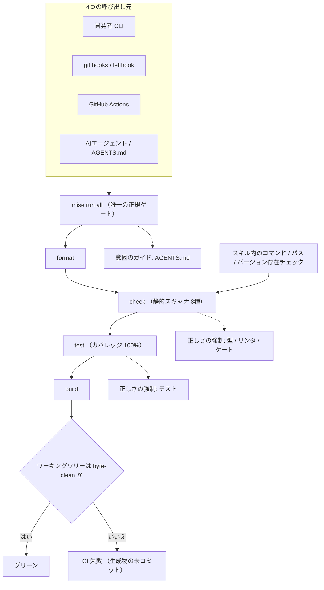
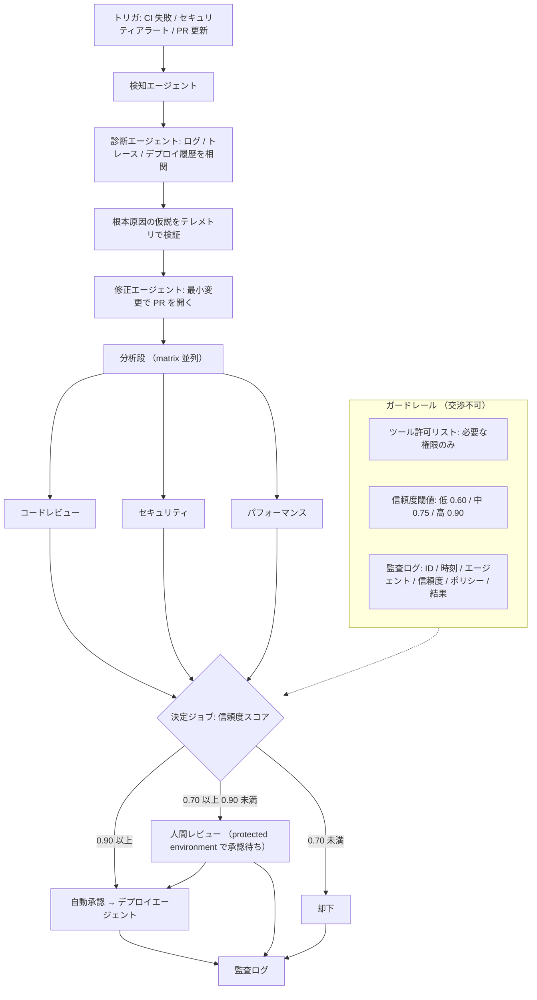
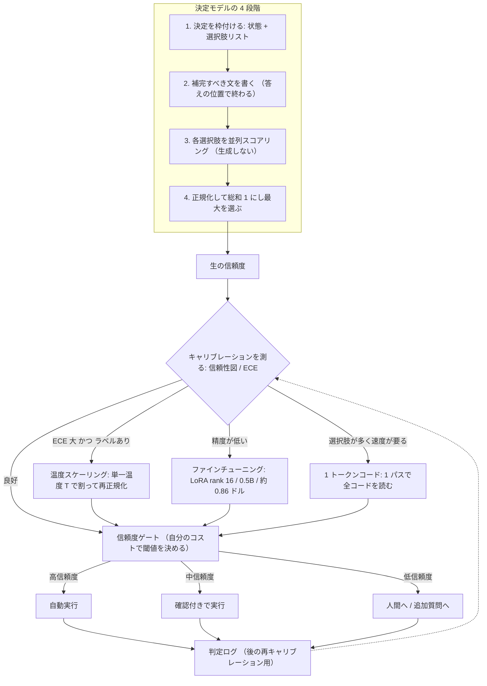

# Daily Briefing 2026-10-10

## 1. MLOpsの冒険は続く: AI/MLのためのAGENTS.md対応スタック（原題: The MLOps Adventure Continues: An AGENTS.md Ready Stack for AI/ML）

- **URL**: https://mlops.community/blog/the-mlops-adventure-continues-an-agents-md-ready-stack-for-ai-ml
- **公開日**: 2026-09-01
- **著者・媒体**: Médéric Hurier（Fmind）/ MLOps Community

### 本文翻訳

AIコーディングエージェントは、リポジトリの摩擦を増幅する。断片化したツールチェーン、重複したCIスクリプト、検証されていない指示書は、エージェントの実行ループを無駄に消費させる。単一の決定論的なゲートと機械可読なルールがあれば、エージェントの最初の試行が「ほぼグリーン」の状態に着地する。本記事は、MLOps Coding Course を支える4つのリポジトリに対する2回のリリースを通じた実践報告であり、設定・グルーコードを900行以上削除し、静的チェックを4種から8種へ増やし、テストカバレッジを100%に到達させた。

**1. 二重のコマンドリストはエージェントの罠である（単一ゲートパターン）**。pre-commit フック、開発者向けタスクランナー、CIのYAMLは、時間とともに必ず乖離する。監査の結果、CI側のリストからビルドステップが静かに脱落していたこと、そしてCookiecutterテンプレート自身のCIがテストを一度も実行していなかったことが判明した。解決策は、名前付きのゲートをひとつだけ持つことである。`mise` のタスクとして `all`（エイリアス `a`）を定義し、format → check → test → build を順に実行する。git hooks（`lefthook`）、GitHub Actions、そして `AGENTS.md` のすべてが、この同一タスクを呼び出す。さらにCIは、実行後にワーキングツリーがバイト単位でクリーンなままであることを検証する。

**2. 散文は実行されない**。`AGENTS.md` は Linux Foundation が管理するエージェント指示の標準であり、コンテキストとルールを記録するが、それを強制する仕組みは何もない。監査では、ベンダリングされた7つのエージェントスキルファイルが上流から最大183行も乖離しており、そのうち1つは数か月前に削除済みのツールを使うようエージェントに指示し続けていた。著者が引く境界線は明確だ。**`AGENTS.md` は意図を導くもので、正しさを強制するのは型・テスト・リンタ・ゲートである**。対策として、ベンダリングされた複製を削除して単一の情報源を指すようにし、スキル内で言及されるすべてのコマンド・パス・ツールバージョンが実際に対象に存在するかを自動検査するチェックを追加した。

**3. エージェント的テストにおけるデータベース状態**。MLflow 3 は SQLite をトラッキングストアの既定値にした。ユニットテストごとにマイグレーションを走らせると、スイート時間は34秒から339秒へ悪化した。解決策は、空のテンプレートDBに対して一度だけマイグレーションを実行するセッションスコープの pytest フィクスチャを用い、各テストはそのファイルを一時ディレクトリへコピーする方式である。これによりオーバーヘッドを約60%削減しつつ、実際のリレーショナルスキーマ上でテストを維持できた。

**4. ロックファイルの劣化と脆弱性の時計**。リリース `v5.0.0` の1か月後、セキュリティスキャン（`trivy` と `govulncheck`）が MLflow の推移的依存に25件の脆弱性を報告した。`cryptography` のパッチは存在したが、MLflow は `cryptography<50` をピン留めしていた。スキャナを抑制するのではなく、`pyproject.toml` に明示的なオーバーライドを追加し、双方向に検証した——オーバーライドありで全スイートが通ること、そしてオーバーライドを外すとセキュリティ監査が落ちること。

**5. トレードオフと限界**。型チェックでは Astral の `ty` が 1.0 前であり、動的な Pydantic/Pandera スキーマを完全にモデル化できない。6つのルールカテゴリをグローバルに無視し、`mypy` をフォールバックとして残している。依存では pandas 3.0 が出ているが MLflow が `pandas<3`、numba が `numpy<2.5` を上限とするため、互換可能な最新版で妥協する。ゲートの遅延は8種の静的スキャナにより1.5〜3.5分かかる。そこで高速なリンタは pre-commit で、フルスキャンは pre-push とCIで走らせる。

### 重要ポイント
- エージェント対応の本質は「AGENTS.md を書くこと」ではなく、**開発者・フック・CI・エージェントの4者が同一の単一ゲートを呼ぶこと**。二重のコマンドリストは必ず乖離し、ビルドステップの脱落のような静かな事故を生む。
- 指示書は意図のガイドにすぎない。**正しさの強制は型・テスト・リンタ・ゲートに委ねる**という責務分離が、エージェント時代の設計原則になる。
- 指示書・スキルファイル自体も腐る。ベンダリングした複製は上流から最大183行乖離し、削除済みツールの使用を指示し続けていた。**指示書に書かれたコマンド・パス・バージョンの存在をCIで自動検証する**。
- エージェントのフィードバックループ速度は直接の生産性指標。テストごとのDBマイグレーション（34秒→339秒）は、テンプレートDBコピー方式で約60%削減できた。
- セキュリティスキャナは絶対に抑制しない。明示的な依存オーバーライドを置き、「ありで通る／なしで落ちる」の双方向で検証する。

### 図解



### 現場での適用方法

**(A) 単一ゲートの定義（`mise.toml`。記事に掲載されている実コード）**

```toml
[tasks.all]
alias = "a"
description = "Format, check, test, and build the project (the canonical gate)"
run = ["mise run format", "mise run check", "mise run test", "mise run build"]
```

**(B) 同一ゲートを git hooks から呼ぶ（`lefthook.yml`）**

```yaml
# <REPO_PATH>/lefthook.yml
pre-commit:
  parallel: false
  commands:
    fast-lint:
      run: mise run format          # 速いものだけ
pre-push:
  commands:
    canonical-gate:
      run: mise run all             # フルゲート（1.5〜3.5分）
```

**(C) 同一ゲートを CI から呼び、生成物の差分を検出する（`.github/workflows/gate.yml`）**

```yaml
name: gate
on: [push, pull_request]
jobs:
  all:
    runs-on: ubuntu-latest
    steps:
      - uses: actions/checkout@v4
      - uses: jdx/mise-action@v2
      # CI 専用のコマンド列を書かない。開発者と同じ 1 本だけを呼ぶ。
      - run: mise run all
      # ゲート後にツリーが汚れていたら＝生成物が未コミット
      - name: assert byte-clean worktree
        run: git diff --exit-code && git diff --cached --exit-code
```

**(D) `AGENTS.md` への追記例（意図のガイドと強制の境界を明文化する）**

```markdown
## 検証の唯一の方法

変更を検証するときは、必ず次の 1 コマンドだけを実行する。

    mise run all

- 個別に `pytest` / `ruff` / `mypy` を直接呼ばないこと。コマンド列が CI と乖離する。
- このコマンドが通らない状態で完了報告をしてはならない。
- 実行後に `git status` が汚れている場合、生成物をコミットし忘れている。

## 境界線（重要）

- このファイル（AGENTS.md）は **意図のガイド** であり、強制力はない。
- 正しさを強制するのは **型・テスト・リンタ・ゲート** である。
- したがって「規約に従ったつもり」ではなく、常に `mise run all` の結果を根拠にすること。
- チェックを弱める方向（スキャナの抑制、テストの skip、閾値の緩和）で
  グリーンにしてはならない。必要なら明示的な override を置き、
  「override ありで通る／override を外すと落ちる」の双方向で検証する。
```

**(E) 指示書の記述が実在するかをCIで検証するスクリプト**

```bash
#!/usr/bin/env bash
# <REPO_PATH>/scripts/verify-agent-docs.sh
# AGENTS.md / スキルファイル内で言及される mise タスクが実在するかを検査する
set -euo pipefail

DOCS=("AGENTS.md" "CLAUDE.md")
TASKS="$(mise tasks --json | jq -r '.[].name')"
status=0

for doc in "${DOCS[@]}"; do
  [[ -f "$doc" ]] || continue
  # "mise run <task>" の形で参照されているタスク名を抽出
  grep -oE 'mise run [a-zA-Z0-9:_-]+' "$doc" | awk '{print $3}' | sort -u |
  while read -r task; do
    if ! grep -qx "$task" <<<"$TASKS"; then
      echo "::error file=$doc::存在しない mise タスクを参照しています: $task"
      status=1
    fi
  done
done

# ベンダリングされたスキルの乖離検出（上流 URL を 1 行目のコメントに書く運用）
for f in .claude/skills/*/SKILL.md; do
  [[ -f "$f" ]] || continue
  upstream="$(sed -n 's|^<!-- upstream: \(.*\) -->$|\1|p' "$f" | head -1)"
  [[ -n "$upstream" ]] || continue
  if ! curl -fsSL "$upstream" | diff -q - "$f" >/dev/null; then
    echo "::warning file=$f::上流と乖離しています: $upstream"
  fi
done

exit "$status"
```

**(F) 依存オーバーライドの明示（`pyproject.toml`。記事に掲載されている実コード）**

```toml
[tool.uv]
override-dependencies = ["cryptography>=50"]
```

### 期待効果
- 記事の実測値として、設定・グルーコードを**900行以上削除**、静的チェックを**4種→8種**、テストカバレッジ**100%**を達成。
- テスト用DBのテンプレートコピー方式により、スイートのオーバーヘッドを**約60%削減**（テストごとマイグレーションでは34秒→339秒に悪化していた）。
- エージェントの初回試行がグリーンに近づくことで、失敗→再試行の実行ループ消費（＝トークンと待ち時間）が減る。
- CIと開発者のコマンド列が構造的に一致するため、「ローカルでは通るがCIで落ちる」クラスの事故と、ステップの静かな脱落が消える。

### 注意点
- フルゲートは**1.5〜3.5分**かかる。すべてを pre-commit に寄せると開発体験が壊れるので、高速リンタは pre-commit、フルスキャンは pre-push / CI に段階化する必要がある。
- 単一ゲートは「すべてを1本に押し込む」ことではない。ゲート内部は段階化（format / check / test / build）し、各段は独立に呼べる状態を保つ。
- `ty` のようなプレ1.0の型チェッカは動的スキーマ（Pydantic / Pandera）を完全にモデル化できない。6カテゴリをグローバル無視し `mypy` をフォールバックとして残す、といった妥協が必要。
- 依存の上限ピン（MLflow の `pandas<3`、numba の `numpy<2.5`）は自分では解けない。オーバーライドは脆弱性パッチのような明確な根拠がある場合に限定し、双方向検証をセットにする。
- `AGENTS.md` の記述を検証するチェック自体がメンテ対象になる。上流URLの記録など、運用規約を先に決めてから自動化する。

## 2. エージェント運用型CI/CD: AIコーディングエージェントを実際に機能させるアーキテクチャ（原題: Agent-Operated CI/CD: The Architecture Making AI Coding Agents Actually Work）

- **URL**: https://alexlavaee.me/blog/agent-operated-cicd-pipelines/
- **公開日**: 不明（直近数週間以内）
- **著者・媒体**: Alex Lavaee（個人技術ブログ）

### 本文翻訳
AIコーディングエージェントから実際に価値を引き出しているチームとそうでないチームの違いは、モデルの選択ではなく**エージェントをCI/CDにどう配線しているか**にほぼ尽きる。本記事はそこに現れつつあるパターンを整理する。

**浮上しているパターン**は「検知 → 診断 → 修正 → デプロイ」の4段で、各段に専門化されたエージェントを1体ずつ置く。エージェントはビルド失敗やアラートで起動し、ログ・トレース・デプロイ履歴を相関させ、根本原因の仮説を立て、テレメトリに対して検証し、PRを開く。分析エージェントはPRをレビューし、セキュリティエージェントは脆弱性を指摘し、実行エージェントはデプロイを扱う。重要なのは、**それぞれにスコープされたツールと権限しか与えない**ことである。

**GitHub Copilot Autofix**。CodeQL のワークフローを main への push と PR、週次スケジュールで走らせる。JavaScript/TypeScript と Python をビルドステップなしで解析し、`security-extended` のクエリセットを使い、security events への書き込み権限を要する。CodeQL 有効リポジトリでは Autofix が既定で有効で、選択したアラートを Copilot に割り当てると修正PRが開く。公開ベータの実績として修正までの中央値は**1.5時間 → 28分**、SQLインジェクションは**12倍速（3.7時間→18分）**、XSSは**7倍速**。2025年後半のアップデートではアラート割り当てから**30秒以内**にPRが開く。GitHubの研究はタスク完了の**55%高速化**とし、記事は**マージPRが70%増**という主張も引く。

**OpenAI Codex: テストを通す最小の変更**。`workflow_run` でCIワークフローの完了を受け、失敗した場合のみ走る。失敗したコミットをチェックアウトし、依存をインストールし、`openai/codex-action@v1` を「テストを通す最小の変更だけを行え」というプロンプトで実行。workspace-write のサンドボックスで動作し、テストで検証して修正PRを開く。安全戦略は GitHub ホステッドでは `drop-sudo`（既定）、セルフホステッドでは `unprivileged-user`、探索時は `read-only`。

**Claude Code: テストが通るまでのループ**。`anthropics/claude-code-action@v1` をPRのオープン・更新時に走らせ、インラインコメント付きレビューを行う。contents は read、pull-requests は write。ツール許可リストはファイルの読み取り・検索と特定の `gh` コマンドのみを許す。別ワークフローではPR上の `@claude` メンションに反応し「なぜCIが落ちたか」を調査させる。こちらは contents / PR に write、Actions データに read が必要で、**Bash は既定で無効**、明示的に許可したコマンドのみ使える。Claude はワークフローファイルの変更やブランチ保護の回避ができない。

**オーケストレーションと信頼度ルーティング**。`needs` でジョブを直列化し、matrix で複数エージェントを並列化し、artifact を段間で受け渡す。分析段の出力を受けた決定ジョブが信頼度スコアを計算し、PRを自動承認・人間レビュー・却下に振り分ける。閾値は**0.90以上で自動承認、0.70以上0.90未満は人間レビュー、それ未満は却下**。人間レビュー経路は承認待ちする保護環境を使う。

**ガードレールは交渉不可**。(1) **ツール許可リスト**——レビューエージェントにデプロイ権限は不要、セキュリティスキャナに書き込み権限は不要。(2) **信頼度閾値**——リスク別に低0.60以上、中0.75以上、高0.90以上。(3) **監査ログ**——イベントID・タイムスタンプ・エージェントID・アクション・信頼度スコア・適用ポリシー・人間レビュア・結果を記録する。記事は最後に「自動化から自律性へ」の移行を論じ、完全なマルチエージェント・パイプラインのテンプレートと再利用可能なワークフロー・モジュールを参照実装として提示している。

### 重要ポイント
- 差を生むのはモデルではなく配線。**「検知 → 診断 → 修正 → デプロイ」の各段に、スコープされた専門エージェントを1体ずつ**置くのが収束しつつあるパターン。
- 主要エージェント（Copilot / Codex / Claude Code）はいずれも GitHub Actions ネイティブ統合を持ち、`workflow_run` でCI失敗を契機に自動起動できる。
- **信頼度閾値でリスク別にルーティング**する。0.90以上は自動、0.70〜0.90は人間レビュー（保護環境で承認待ち）、それ未満は却下。低/中/高リスクで0.60 / 0.75 / 0.90 と使い分ける。
- ガードレール3点セット（ツール許可リスト・信頼度閾値・監査ログ）は省略不可。Bash を既定で無効にし、ワークフローファイルの改変とブランチ保護の回避を構造的に禁じる。
- Copilot Autofix の実測では修正中央値 1.5時間 → 28分、SQLi は 12倍速。ただし「PRが70%増」のような引用値は一次情報の確認が必要。

### 図解



### 現場での適用方法

**(A) CI失敗を契機に最小修正PRを開く（`.github/workflows/agent-autofix.yml`）**

```yaml
name: agent-autofix
on:
  workflow_run:
    workflows: ["ci"]          # 監視対象の CI ワークフロー名
    types: [completed]

permissions:
  contents: write
  pull-requests: write
  actions: read                # 失敗ジョブのログを読むために必要

jobs:
  autofix:
    # 失敗したときだけ走らせる（成功時に起動しないこと）
    if: github.event.workflow_run.conclusion == 'failure'
    runs-on: ubuntu-latest
    steps:
      - uses: actions/checkout@v4
        with:
          ref: ${{ github.event.workflow_run.head_sha }}   # 失敗したコミット
          fetch-depth: 0

      - name: install deps
        run: <YOUR_INSTALL_COMMAND>    # 例: uv sync --frozen

      - name: fix with Codex
        uses: openai/codex-action@v1
        with:
          openai-api-key: ${{ secrets.OPENAI_API_KEY }}
          sandbox: workspace-write
          safety-strategy: drop-sudo    # GitHub ホステッドでは既定
          prompt: |
            直前の CI 実行が失敗しました。テストを通すための「最小の変更」だけを行ってください。
            - リファクタリング・整形・無関係な改善は禁止
            - テストの skip / 削除 / 閾値の緩和による回避は禁止
            - 修正後に <YOUR_TEST_COMMAND> を実行し、通ることを確認する
            - 落ちていた原因を 3 行以内で要約する

      - name: verify
        run: <YOUR_TEST_COMMAND>        # 例: mise run test

      - name: open PR
        uses: peter-evans/create-pull-request@v6
        with:
          branch: autofix/${{ github.event.workflow_run.head_sha }}
          title: "fix(ci): minimal fix for failing ${{ github.event.workflow_run.name }}"
          body: |
            CI 失敗に対する自動最小修正です。
            - 失敗した run: ${{ github.event.workflow_run.html_url }}
            - 対象コミット: ${{ github.event.workflow_run.head_sha }}
          draft: true
```

**(B) ツール許可リストを絞ったレビューエージェント（`.github/workflows/agent-review.yml`）**

```yaml
name: agent-review
on:
  pull_request:
    types: [opened, synchronize]

permissions:
  contents: read            # 書き込みは与えない
  pull-requests: write      # インラインコメントのため

jobs:
  review:
    runs-on: ubuntu-latest
    outputs:
      score: ${{ steps.review.outputs.score }}
    steps:
      - uses: actions/checkout@v4
      - id: review
        uses: anthropics/claude-code-action@v1
        with:
          anthropic-api-key: ${{ secrets.ANTHROPIC_API_KEY }}
          # レビューにデプロイ権限は不要。読み取りと検索と最小の gh のみ。
          claude-args: >-
            --allowedTools "Read,Glob,Grep,
            Bash(gh pr view:*),Bash(gh pr diff:*)"
          prompt: |
            この PR を「コード品質・セキュリティ・パフォーマンス」の 3 観点でレビューしてください。
            - 具体的な問題はインラインコメントで指摘する
            - 最後に 0.00〜1.00 の信頼度スコアを
              `score=<値>` の 1 行だけで $GITHUB_OUTPUT に書き出す
```

**(C) 信頼度ルーティングの決定ジョブ＋監査ログ**

```yaml
  decide:
    needs: review
    runs-on: ubuntu-latest
    outputs:
      decision: ${{ steps.route.outputs.decision }}
    steps:
      - id: route
        env:
          SCORE: ${{ needs.review.outputs.score }}
          # リスク別閾値。ラベルで高リスクを立てる運用。
          RISK: ${{ contains(github.event.pull_request.labels.*.name, 'high-risk') && 'high' || 'low' }}
        run: |
          set -euo pipefail
          case "$RISK" in
            high)   auto=0.90 ;;
            medium) auto=0.75 ;;
            *)      auto=0.60 ;;
          esac
          # 自動承認の上限は常に 0.90、人間レビュー下限は 0.70
          if   awk "BEGIN{exit !($SCORE >= 0.90 && $SCORE >= $auto)}"; then d=auto_approve
          elif awk "BEGIN{exit !($SCORE >= 0.70)}";                   then d=human_review
          else                                                             d=reject
          fi
          echo "decision=$d" >> "$GITHUB_OUTPUT"

      - name: audit log
        run: |
          jq -nc \
            --arg event_id "${{ github.run_id }}-${{ github.run_attempt }}" \
            --arg ts "$(date -u +%FT%TZ)" \
            --arg agent "claude-code-action@v1" \
            --arg action "pr_review" \
            --arg score "${{ needs.review.outputs.score }}" \
            --arg policy "confidence-routing/v1" \
            --arg reviewer "" \
            --arg outcome "${{ steps.route.outputs.decision }}" \
            '{event_id:$event_id,timestamp:$ts,agent_id:$agent,action:$action,
              confidence:($score|tonumber),policy:$policy,
              human_reviewer:$reviewer,outcome:$outcome}' \
            | tee -a audit.jsonl
      - uses: actions/upload-artifact@v4
        with: { name: audit-log, path: audit.jsonl }

  human_gate:
    needs: decide
    if: needs.decide.outputs.decision == 'human_review'
    runs-on: ubuntu-latest
    environment: pr-approval     # 保護環境＝承認待ちで停止する
    steps:
      - run: echo "承認されました。後続へ進みます。"
```

**(D) `CLAUDE.md` への追記例（エージェントに境界を宣言する）**

```markdown
## CI 上でのあなたの権限と境界

- あなたは `.github/workflows/**` を変更してはならない。
- ブランチ保護・必須チェック・CODEOWNERS を回避してはならない。
- Bash は既定で無効。許可されたコマンド以外は実行を試みず、
  必要なら PR コメントで「このコマンドの許可が必要」と報告する。
- CI 失敗への対応は「テストを通す最小の変更」のみ。
  テストの skip / 削除 / 閾値の緩和で緑にしてはならない。
- 自己判断で自動承認してはならない。信頼度スコアを出力し、
  ルーティングは決定ジョブ（confidence-routing/v1）に委ねる。

## 信頼度スコアの出し方

0.00〜1.00 で、次を根拠に出す。
- 変更範囲が自分の読んだコード内に収まっているか
- 失敗の再現と修正後の成功を両方確認できたか
- 不確実な箇所が残っていないか（残っていれば 0.70 未満にする）
```

### 期待効果
- Copilot Autofix の公開ベータ実測で、修正までの中央値が**1.5時間 → 28分**。SQLインジェクションは**3.7時間 → 18分（12倍速）**、XSSは**7倍速**。
- アラートを Copilot に割り当ててから修正PRが開くまで**30秒以内**（2025年後半のアップデート）。
- GitHub の研究としてタスク完了の**55%高速化**、記事引用として**マージPR 70%増**。
- CI失敗の初動（ログ相関・原因仮説・最小修正PR）が人間の着手を待たずに走るため、失敗から修正着手までの待ち時間がパイプラインのリードタイムから外れる。

### 注意点
- 記事自身に数値の不整合がある。ガードレール節は信頼度閾値を 0.60〜0.90 と書くが、まとめ節は 0.70〜0.90 と書いている。さらに完全パイプラインのテンプレートは `confidence-threshold` を入力として受け取るが実際には使わず、レビュースコアを 80 と比較している。**テンプレートをそのまま流用せず、閾値の実際の使用箇所を必ず読むこと**。
- 信頼度スコアをエージェント自身に自己申告させる設計は、キャリブレーションされていない限り危険（記事3のテーマと直結する）。自前の閾値は必ず自分のラベル付きデータで決める。
- `workflow_run` トリガは既定ブランチ上のワークフロー定義で実行される。フォークPRからのシークレット露出と、無限ループ（autofix の push が再びCIを落として再起動する）を防ぐガードが必須。
- 「PRが70%増」「55%高速化」などは一次情報の確認が取れていない引用値。社内説明の根拠には使わない。
- 自動承認経路を作る前に、ブランチ保護・CODEOWNERS・必須チェックが「エージェントには突破できない」状態になっていることを先に確認する。

## 3. Jevの仕組み: キャリブレーションされた決定モデル（原題: How Jev works: calibrated decision models）

- **URL**: https://victordibia.com/explainers/jev/
- **公開日**: 2026-09-24（改訂2: 2026-09-25）
- **著者・媒体**: Victor Dibia（個人技術解説サイト）

### 本文翻訳
TypeSafe の Jev のような決定モデルは、テキストを生成せずに選択肢のリストから1つを選ぶ。手法は4段階。(1) **決定を文として枠付ける**——状態（例: 顧客のメッセージ）と選択肢リストを組にする。(2) **補完すべき文を書く**——選択肢を列挙し、答えが入る位置で終わるプロンプトにする。(3) **各選択肢をスコアリングする**——その選択肢のテキストが補完として現れる確率を計算する。選択肢は事前にわかっているので何も生成せず、全選択肢を並列にスコアできる。(4) **正規化する**——合計で割って総和を1にし、最大を答えとする。例では「edit personal details」の生確率0.355が正規化後0.98になる。著者が主張する本質的価値は**キャリブレーションされた信頼度**であり、システムが自信のないときに「わからない」と言えるようになる。

**API**。System One エンドポイントに `state` と名前付きの `questions` を送る。質問型は `choice`（最大255選択肢から1つ）、`score`（2〜10段階で評価し重み付きスコアと信頼度を返す）、`noul`（はい/いいえを1確率で返す）。入力はテキストのみで temperature も seed もない。TypeSafe は1呼び出し**70〜500ms**、入力100万トークン**0.042ドル**（出力無料）と報告。

**速度の実測**（Qwen2.5-7B-Instruct、A10G 1枚）。ラベル1個の生成0.47秒、10選択肢の確率生成4.57秒に対し、スコアリングは**0.23秒**（確率生成比**7〜54倍速**）。ただしラベル1個の生成比では2選択肢で9.8倍、10で3.5倍、25で1.7倍、**77選択肢では0.5倍＝遅い**。選択肢が増えるとスコア対象トークンが増えるためである。

**1トークンコードの技**。各選択肢に1トークンのコードを与えると、1回のフォワードパスで全コードの確率が読める。7B instruct の精度低下は10選択肢で0.2ポイント、25で2.0ポイント、77で5.4ポイントに収まる。77選択肢×20問の読み取りが**0.54秒**（全選択肢スコアリングでは13.6秒）。ただし小さいモデルはコードを読めない。

**キャリブレーションと温度スケーリング**。10選択肢でのECEは base 7B が0.02、instruct 7B が0.10、instruct 1.5B が0.18。**ベースはほぼ校正済みで、instruct は過信する**。77選択肢では7B instruct が平均95%の信頼度で正答率64%だった。手順は、全選択肢スコアをラベル付き例でフィットした単一温度で割って正規化するだけ。順位は動かないので精度は不変。600件でフィットし別の600件でテストすると、ECEは**0.10 → 0.03**、信頼度90%超で誤った回答は**約108件 → 約23件**に減った。はい/いいえには2パラメータの Platt スケーリングを用いる。

**0.5Bモデルの学習**。Qwen2.5-0.5B-Instruct、全射影行列に LoRA rank 16（学習可能約880万）、1エポック、バッチ16、例ごとに選択肢文字をシャッフル。Modal の A10クラスGPU 1枚で3回**合計約0.86ドル・タスクあたり40分未満**。Snake のソルバ一致率はホールドアウト10x10で**42.2% → 100.0%**。Banking77（17インテントをホールドアウト）は学習済みインテント10選択肢で23.0% → 96.2%、未知インテント77選択肢でも0.0% → 49.3%。プロンプトインジェクション判定は精度48.1% → 99.3%、ECE 0.334 → 0.009 となった。

**Jevについて何がわかっているか**。TypeSafe はアーキテクチャもキャリブレーション手法 RLCD も開示せず、信頼性図もECEも公表していない。唯一の「信頼度別精度」（0.9超で30問中27問正解）は区間が広い。ベンチマークのラベルは他モデル応答の平均で作られるため、示される精度は**正しさではなく一致度**にすぎない。サードパーティ測定では Jev のECEは0.0588で、著者の素の7B instruct は同データ（662件）で0.061と**ほぼ同等**。

**4ステップの行動計画**。(1) ラベル付き**評価セットを作る**。(2) 信頼性図とECEで**精度とキャリブレーションを測る**。(3) **ギャップを埋める**——信頼度のずれは温度スケーリング、精度不足はファインチューニング、選択肢が多いなら1トークンコード。(4) **自分のコストから閾値を決め**、低信頼度は人間か追加質問に回す。

### 重要ポイント
- 決定モデルの速さは「生成しない」ことから来る。全選択肢を並列スコアして正規化するだけ。ただし**選択肢が多いと優位は消える**（77選択肢ではラベル1個の生成より遅い）。そこで1トークンコードが効く（77選択肢×20問で13.6秒 → 0.54秒）。
- **instruct モデルは過信し、base モデルはほぼキャリブレーションされている**。77選択肢で平均信頼度95%・正答率64%という乖離は、閾値運用を直接壊す。
- 温度スケーリングは安価で効果的。600件でフィットするだけでECE 0.10 → 0.03、「90%超で誤り」が約108件 → 約23件。順位は動かないので精度は劣化しない。
- ベンダの信頼度を無検証で信じない。TypeSafe は信頼性図もECEも未公表、ベンチマークのラベルは他モデルの平均（＝一致度であって正しさではない）。サードパーティ測定では Jev のECE 0.0588 に対し素の7B instruct が0.061で、**差はほぼない**。
- 0.5B モデルを**約0.86ドル・40分未満**でタスク特化学習でき、プロンプトインジェクション判定で精度48.1% → 99.3%、ECE 0.334 → 0.009。自前モデルが現実的な選択肢になる。

### 図解



### 現場での適用方法

**(A) 評価セット→ECE測定→温度フィットまでを1本で回すスクリプト**

```python
# <REPO_PATH>/scripts/calibrate_decisions.py
# 使い方: python -I scripts/calibrate_decisions.py eval.jsonl
# eval.jsonl の 1 行: {"state": "...", "options": ["a","b",...], "label": "b"}
import json, sys
import numpy as np
from scipy.optimize import minimize_scalar

def load(path):
    with open(path) as f:
        return [json.loads(l) for l in f if l.strip()]

def ece(conf, correct, bins=10):
    """Expected Calibration Error。conf は正規化後の最大確率。"""
    conf, correct = np.asarray(conf), np.asarray(correct, dtype=float)
    edges, total = np.linspace(0, 1, bins + 1), 0.0
    for lo, hi in zip(edges[:-1], edges[1:]):
        m = (conf > lo) & (conf <= hi)
        if m.sum() == 0:
            continue
        total += (m.sum() / len(conf)) * abs(correct[m].mean() - conf[m].mean())
    return total

def softmax(x, T=1.0):
    z = np.asarray(x, dtype=float) / T
    z -= z.max()
    e = np.exp(z)
    return e / e.sum()

def summarize(rows, scores, T, tag):
    conf, correct = [], []
    for r, s in zip(rows, scores):
        p = softmax(s, T)
        i = int(np.argmax(p))
        conf.append(float(p[i]))
        correct.append(r["options"][i] == r["label"])
    acc = float(np.mean(correct))
    e = ece(conf, correct)
    # 「高信頼度なのに誤り」の件数は閾値設計で最も重要な数字
    hi_wrong = sum(1 for c, k in zip(conf, correct) if c > 0.90 and not k)
    print(f"[{tag}] T={T:.3f} acc={acc:.3f} ECE={e:.4f} conf>0.90 かつ誤り={hi_wrong}")
    return e

if __name__ == "__main__":
    rows = load(sys.argv[1])
    # raw_scores: 自分のモデル / API から得た各選択肢の対数スコア（未正規化）
    # Jev のように生スコアが返らない場合は、返る確率の log を使う
    raw = [r["raw_scores"] for r in rows]

    half = len(rows) // 2
    fit, test = slice(0, half), slice(half, None)   # フィット用とテスト用を分ける

    summarize(rows[test], raw[test], 1.0, "before")

    # 単一温度を fit 側だけでフィットする（順位は動かないので精度は不変）
    def nll(T):
        if T <= 0:
            return 1e9
        out = 0.0
        for r, s in zip(rows[fit], raw[fit]):
            p = softmax(s, T)
            i = r["options"].index(r["label"])
            out -= np.log(max(p[i], 1e-12))
        return out / max(half, 1)

    T = float(minimize_scalar(nll, bounds=(0.05, 20.0), method="bounded").x)
    summarize(rows[test], raw[test], T, "after")
    print(f"\n採用する温度: T={T:.4f}  → 推論時は softmax(scores / T) を使う")
```

**(B) コストから閾値を決める設定ファイル（グローバル閾値を禁じる）**

```yaml
# <REPO_PATH>/config/decision_gates.yaml
# 閾値は「誤りのコスト」から逆算する。1 つのグローバル閾値は使わない。
calibration:
  temperature: 1.8700         # (A) の出力を貼る
  fitted_on: "2026-10-10 / 600 件のラベル付き社内トラフィック"
  recalibrate_when:
    - "選択肢（インテント/カテゴリ）の分類体系を変更したとき"
    - "モデル・プロンプトを差し替えたとき"
    - "月次の定期チェックで ECE が 0.05 を超えたとき"

actions:
  # 低リスク: 誤っても自動で巻き戻せる
  route_to_queue:
    auto: 0.60
    confirm: 0.45
    else: human
  # 中リスク: 顧客に見えるが可逆
  send_templated_reply:
    auto: 0.75
    confirm: 0.60
    else: human
  # 高リスク: 金銭移動・アカウント停止など不可逆
  refund_payment:
    auto: 0.90
    confirm: 0.80
    else: human
    require_human_always: true   # ラベル付きトラフィックで検証するまでは必ず人間
```

**(C) ゲートの実装（判定ログを必ず残す）**

```python
# <REPO_PATH>/app/decision_gate.py
import json, time
import numpy as np
import yaml

CFG = yaml.safe_load(open("config/decision_gates.yaml"))
T = CFG["calibration"]["temperature"]

def decide(action: str, option_scores, options):
    g = CFG["actions"][action]
    z = np.asarray(option_scores, dtype=float) / T      # 温度スケーリング
    z -= z.max()
    p = np.exp(z); p /= p.sum()                          # 正規化
    i = int(np.argmax(p)); conf = float(p[i])

    if g.get("require_human_always"):
        route = "human"
    elif conf >= g["auto"]:
        route = "auto"
    elif conf >= g["confirm"]:
        route = "confirm"
    else:
        route = "human"

    # 後から再キャリブレーションするために、生スコアごと残すのが肝
    with open("logs/decisions.jsonl", "a") as f:
        f.write(json.dumps({
            "ts": time.time(), "action": action, "choice": options[i],
            "confidence": conf, "route": route,
            "temperature": T, "raw_scores": list(map(float, option_scores)),
        }, ensure_ascii=False) + "\n")

    return options[i], conf, route
```

**(D) `CLAUDE.md` への追記例（決定モデルを扱うリポジトリのルール）**

```markdown
## 決定モデル（Jev / 自前スコアリング）を使うときのルール

1. 信頼度の閾値をコードに直接書かない。`config/decision_gates.yaml` の
   アクション別の値だけを参照する。グローバル閾値は禁止。
2. ベンダが返す信頼度を無検証で使わない。自前のラベル付き評価セットで
   ECE と信頼性図を測り、`scripts/calibrate_decisions.py` の温度を適用する。
3. 新しいアクションを自動実行させる前に、必ず
   `require_human_always: true` でシャドー運用し、ラベルが溜まってから閾値を決める。
4. 選択肢の分類体系を変更したら、キャリブレーションは無効になったものとして扱う。
   同じ PR で `temperature` の再フィットを行う。
5. 判定ログには必ず生スコアを残す。生スコアがないと後から再キャリブレーションできない。
6. 選択肢が 25 を超える場合は、1 トークンコード方式の採用を検討する
   （全選択肢スコアリングは選択肢数に比例して遅くなる）。
```

### 期待効果
- 温度スケーリングだけで、7B instruct のECEが**0.10 → 0.03**、「信頼度90%超なのに誤り」が**約108件 → 約23件**に減少（600件でフィット、別の600件で検証）。精度は不変。
- 1トークンコード方式により、77選択肢×20問の読み取りが**13.6秒 → 0.54秒**。精度低下は10選択肢で0.2ポイント、25選択肢で2.0ポイント程度。
- 0.5Bモデルのタスク特化学習が**約0.86ドル・40分未満**で可能。プロンプトインジェクション判定で精度48.1% → 99.3%、ECE 0.334 → 0.009。Banking77の学習済みインテント・10選択肢で23.0% → 96.2%。
- スコアリングは確率生成に対して7Bで**7〜54倍速**（2選択肢ならラベル生成比でも9.8倍速）。ルーティング・ガードレール・フォームフィル等のリアルタイム判定に実用的。

### 注意点
- **選択肢数のスケーリングに注意**。スコアリングの優位は選択肢が増えると消え、77選択肢ではラベル1個の生成より遅くなる（0.5倍速）。25を超えるなら1トークンコードを検討する。
- 1トークンコードは小さいモデルでは機能しない。1.5B instruct は10選択肢で10.5ポイント落ちた。モデルサイズとセットで検証が必要。
- 温度スケーリングには**自分のタスクのラベル付きデータが必要**。ラベルがないなら、まずシャドー運用でラベルを集めるのが先。
- ベンダの信頼度を信じる根拠は薄い。TypeSafe はアーキテクチャもRLCDの詳細も信頼性図もECEも未公表で、ベンチマークのラベルは他モデル応答の平均（一致度≠正しさ）。サードパーティ測定では Jev のECE 0.0588 に対し素の7B instruct が0.061で、ほぼ差がない。**ベンダ選定の前に自前の評価セットで比較すること**。
- 記事自身に数値の不整合がある。Banking77 の見出し数値（7% → 67%）が表の値（選択肢数により0.0% → 49.3%〜）と一致していない。著者も「引用前に出典で確認せよ」と注記している。
- 分類体系を変更すると、過去にフィットした温度は無効になる。再キャリブレーションを変更と同じPRで行う運用規約が必要。
- Jev には temperature / seed の設定がなく入力はテキストのみ。TypeSafe 自身のエンドポイント表記も情報源によって揺れがあるため、公式ドキュメントで確認する。
