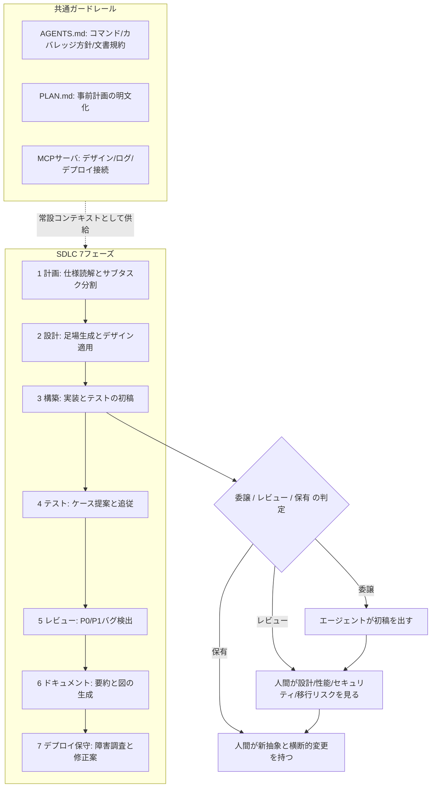
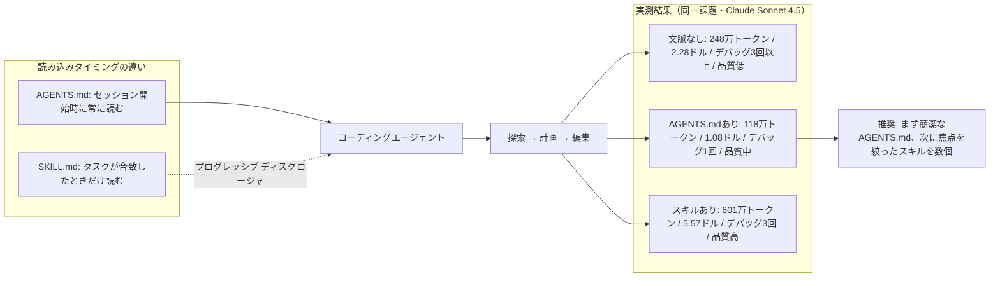
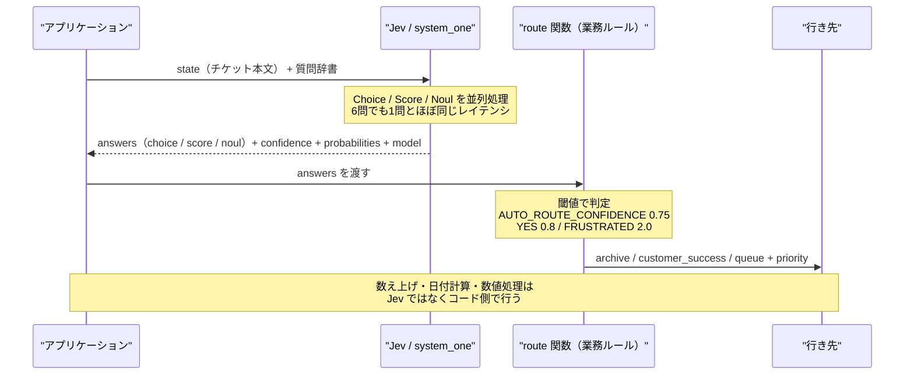

# Daily Briefing 2026-10-11

## 1. AI ネイティブなエンジニアリングチームの構築（原題: Building an AI-Native Engineering Team）

- **URL**: https://learn.chatgpt.com/guides/build-ai-native-engineering-team
- **公開日**: 不明（直近数週間以内に更新・継続メンテナンスされているガイド）
- **著者・媒体**: OpenAI（Codex 公式ガイド / developers.openai.com より移管）

### 本文翻訳

METR の計測では、2025 年 8 月時点で先端モデルは約 2 時間 17 分相当の作業を、正答率およそ 50% の確度で持続できた。この「遂行可能なタスク長」はおよそ 7 か月で倍増しており、数年前のモデルは 30 秒程度の推論しかできなかった。つまり計画・設計・開発・テスト・レビュー・デプロイという SDLC 全体が、すでに AI の射程に入っている。

この転換を可能にしたのは 4 つの能力である。**統合コンテキスト**（1 つのモデルがコード・設定・テレメトリを横断して読む）、**構造化されたツール実行**（コンパイラ・テストランナー・スキャナを実際に動かし、検証可能な結果を出す）、**永続的なプロジェクトメモリ**（長いコンテキストとコンパクションにより、提案からデプロイまで 1 つの機能を追跡できる）、**評価ループ**（出力をユニットテスト・レイテンシ目標・スタイルガイドに照らして検証する）。OpenAI 社内では、かつて数週間かかっていた作業が数日で出てくる例が観測されており、ドキュメント作成・依存関係の保守・フィーチャーフラグの掃除といった定型作業は Codex に委譲されている。

ガイドは各フェーズについて「委譲する / レビューする / 自分が持つ」の切り分けと、着手チェックリストを示す。

**1. 計画（Plan）**: イシュートラッカーに接続したエージェントが仕様を読み、コードベースと突き合わせ、曖昧さを指摘し、作業をサブタスクに分割し、難易度を見積もる。コードパスを辿り、その機能がどのサービスに触るかを提示できる。エンジニアは見積りとリスクをレビューする。優先順位付けと戦略的トレードオフは人間が主導する。着手はイシューのタグ付けと重複排除から始め、次にサブタスク生成、さらにチケットのステージ変更を契機としたエージェント実行を加える。

**2. 設計（Design）**: エージェントがプロジェクトの足場を作り、ボイラープレートを生成し、デザイントークンとスタイルガイドを適用し、モックアップをコンポーネントへ変換する。これにより高忠実度のプロトタイプが速く作れる。エンジニアは規約・アクセシビリティ・統合をレビューする。デザインシステム・UX パターン・アーキテクチャはチームが保有する。着手はマルチモーダルなエージェントを使い、MCP 経由でデザインツールとコンポーネントライブラリを接続し、デザイン → コンポーネント → 実装のワークフローを定義し、TypeScript のような型付き言語で有効な props をエージェントに伝えること。

**3. 構築（Build）**: エージェントが複数ステップの実装（データモデル・API・UI・テスト・ドキュメント）を協調した実行でこなす。数十ファイルにまたがる編集、既存規約の踏襲、発生したビルドエラーの逐次修正、コードと並行したテスト記述、PR メッセージ付きの差分一式の生成ができる。エンジニアは仕様の明確化、アーキテクチャのレビュー、重要なビジネスロジックの精緻化、そしてエージェントが従うガードレールと規約の設計へ移る。切り分けは、エージェントが初稿を出し、エンジニアが設計・性能・セキュリティ・移行リスクをレビューし、新しい抽象と横断的変更はエンジニアが保有する。Cloudwalk はスクリプトや不正検知ルールからマイクロサービス全体まで、役割を横断して Codex を使っている。着手は仕様が明確なタスクから始め、計画ツールかコミット済みの PLAN.md で計画させ、コマンドが実際に成功することを検証し、AGENTS.md を反復してエージェント自身がテストとリンタを実行してフィードバックを得られるようにすること。

**4. テスト（Test）**: エージェントが要件と機能コードからテストケースを提案し、エッジケースや障害モードを見つけ、コード変更に追従してテストを最新に保つ。テストを書く仕事が消えるわけではない。テストはエージェントが作り込む対象としての真実の源になり、エンジニアはカバレッジのパターンとエージェントの選択への反証に集中する。手抜きやスタブ化されたテストをレビューし、エージェントに権限と利用可能なテストスイートの認識を与える。仕様に対するカバレッジの保有と敵対的思考はエンジニアに残る。着手はテスト生成を別ステップに分け、実装前に新しいテストが**落ちる**ことを確認し、AGENTS.md にカバレッジ方針を書き、カバレッジツールをエージェントに渡すこと。

**5. レビュー（Review）**: 開発者は週あたりおよそ 2〜5 時間をコードレビューに費やしている。AI レビュアはコードの一部を実行し、実行時の挙動を解釈し、ファイル横断で論理を追える。P0/P1 のバグを見つけるよう訓練し、出力は簡潔に保つ必要がある。冗長でノイズの多い出力は無視されるからだ。AI レビューは重大な本番バグに対する安心を与える。実際の問題を見つけるため PR が速くなるとは限らないが、欠陥と障害を防ぐ。着手はゴールドスタンダードな PR の評価セットを作り、レビューに特化した製品を選び（汎用モデルは些末な指摘に流れがち）、PR コメントへのリアクションを品質シグナルとして追い、小さく始めて展開すること。Sansan は Codex レビューで競合状態や DB リレーションの問題、ハードコード、スケーラビリティの懸念を捕らえている。

**6. ドキュメント（Document）**: エージェントがコードを要約し、Mermaid などの図を生成し、機能開発中にドキュメントを更新し、コミットからリリースサマリを作る。AGENTS.md に常設のドキュメント指示を書けば、それが全プロンプトに載る。委譲できるのはファイル／モジュール要約、入出力の記述、依存一覧、PR サマリ。レビューすべきは中核サービスの概要、公開 API/SDK ドキュメント、ランブック、アーキテクチャページ。保有すべきはドキュメント戦略と、外部・法務・規制・ブランドに影響する全内容。

**7. デプロイと保守（Deploy and Maintain）**: MCP サーバ経由でロギングとデプロイのシステムに接続し、エンドポイントのエラーを調査させ、コードベースへ辿らせ、git 履歴から疑わしいコミットを確認させる。エージェントはホットフィックスの提案もできる。エンジニアは AI が出した根本原因を検証し、修復を承認し、高リスクまたは低確信の判断を下す。Virgin Atlantic は Codex の VS Code 拡張を Azure DevOps と Databricks の MCP サーバと組み合わせ、ログ調査と変更レビューを 1 か所で行っている。着手はロギングとデプロイのツールを接続し、アクセス範囲を定義し、再利用可能なプロンプトテンプレート（例「エンドポイント X のエラーを調査せよ」）を作り、模擬インシデントで試し、実際のインシデントのフィードバックで反復すること。

結論として、コーディングエージェントを SDLC 全体にわたる「初稿の実装者」かつ継続的な協働者として位置づけ、アーキテクチャ・プロダクト意図・品質の統制はエンジニアが保持する。小さくスコープを切ったワークフローから始め、ガードレールに投資し、エージェントの責任範囲を反復的に広げよ、というのが推奨である。

### 重要ポイント

- モデルが遂行できるタスク長は約 7 か月で倍増しており、SDLC の 7 フェーズすべてが委譲の検討対象になっている。
- 各フェーズを「委譲 / レビュー / 保有」に分解するのが実務上の核心。エージェントが初稿、人間が設計・性能・セキュリティ・移行リスク、新しい抽象と横断的変更は人間が保有。
- テスト工程では「実装前に新しいテストが落ちることを確認する」ことがエージェント利用時の必須ガードレール（スタブ化・手抜きテストの検出）。
- AI コードレビューは P0/P1 に絞り簡潔に保つ。汎用モデルは些末な指摘に流れるため、レビュー特化製品を選び、ゴールドスタンダード PR の評価セットで検証する。
- AGENTS.md がフェーズ横断の共通装置として機能する（テスト実行コマンド、カバレッジ方針、ドキュメント指示を常設コンテキストに載せる）。

### 図解



### 現場での適用方法

まず「委譲 / レビュー / 保有」をリポジトリの常設コンテキストに落とす。以下を `AGENTS.md`（Claude Code なら `CLAUDE.md`）に追記する。

```markdown
## エージェントの責任範囲

### 委譲してよい（初稿を出してよい）
- ファイル/モジュール単位のドキュメント要約、入出力記述、依存一覧、PR サマリ
- 既存パターンに沿った実装、テストの追加、フィーチャーフラグの掃除
- 依存関係の更新（破壊的変更がない範囲）

### 必ず人間レビューを通す
- 中核サービスの概要、公開 API/SDK ドキュメント、ランブック
- 性能・セキュリティ・データ移行に影響する変更

### エージェントは触らない（人間が保有）
- 新しい抽象の導入、複数サービスをまたぐ横断的変更
- 外部公開・法務・規制・ブランドに関わる文面

## テストの規約
- 実装前に必ずテストを先に追加し、`<TEST_CMD>` を実行して **失敗することを確認** してから実装に入る
- スタブや `assert True` で通すテストは禁止。最低カバレッジは <COVERAGE>%
- カバレッジ確認: `<COVERAGE_CMD>`

## 必ず実行するコマンド
- テスト: `<TEST_CMD>`
- リンタ: `<LINT_CMD>`
- 型チェック: `<TYPECHECK_CMD>`
上記 3 つがすべて通るまで作業完了を報告しないこと。

## 計画の規約
- 3 ファイル以上に触る変更は、着手前に `PLAN.md` に手順・影響範囲・ロールバック手順を書き、
  人間の承認を得てから実装する
```

ガイドが「再利用可能なプロンプトテンプレート」として推奨する障害調査を、Claude Code のスキルに固定する。`.claude/skills/incident-triage/SKILL.md`:

```markdown
---
name: incident-triage
description: 本番エンドポイントのエラー増加やアラートを調査するときに使う。ログを取得し、コードベースへ辿り、git 履歴から疑わしいコミットを特定して根本原因候補と修正案を出す。デプロイ直後の障害、5xx 増加、レイテンシ劣化の調査で起動する。
---

# インシデント初動調査

## 手順
1. 対象エンドポイント・時間窓・症状を確認する（不明なら人間に聞く）
2. ログを取得する（MCP 経由）: 対象期間のエラーログとスタックトレースを集約
3. スタックトレースからコードパスを特定し、該当ファイルを読む
4. `git log --since="<WINDOW>" -- <PATHS>` で時間窓に入るコミットを列挙し、
   症状と整合するものを絞る
5. 以下の形式で報告する（**修正の適用はしない**）

## 報告フォーマット
- 症状と影響範囲（影響ユーザー数・エラー率）
- 根本原因候補（確度順に最大 3 件、各々の根拠となるログ行とコード位置）
- 疑わしいコミット（SHA・作者・変更点）
- 推奨する次アクション（ロールバック / ホットフィックス / 継続調査）
- 確信が持てない点

## 制約
- 本番環境への書き込み、デプロイ、ロールバックの実行は禁止。提案までに留める
- 根本原因は必ずログ行またはコード位置で裏付ける。推測は推測と明記する
```

AI コードレビューを入れる前に、評価セットを用意する。

```bash
# 過去の「本物のバグが見つかった PR」を 20〜30 件集め、ゴールドスタンダードにする
gh pr list --repo <OWNER>/<REPO> --state merged --limit 200 --json number,title,url \
  | jq -r '.[] | [.number, .title] | @tsv' > /tmp/merged-prs.tsv

# 人手で「P0/P1 バグが指摘された PR」を選び、期待される指摘を書き出す
# evals/review-gold/<PR番号>.md に「検出されるべき指摘」を1行1件で記述し、
# AI レビュアを当てて再現率（recall）と誤検知率を測る
```

### 期待効果

- OpenAI 社内では、かつて数週間かかっていた作業が数日で完了する例が観測されている。
- 開発者が週 2〜5 時間を費やしているコードレビューの初期パスを AI に寄せられる。短縮そのものより「重大な本番バグの流出防止」が主効果と位置づけられている。
- AGENTS.md にテスト・リンタ・型チェックのコマンドを置くことで、エージェントが自分の出力を検証するループが回り、人間レビューに届く差分の質が上がる。

### 注意点

- METR の「2 時間 17 分」は**正答率 50% 時点**の数値であり、半分は失敗する前提。無監督の長時間実行を正当化する根拠にはならない。
- AI レビューは「PR が速くなる」指標では効果が出にくい。実際の問題を見つけるほどレビューは長引く。導入時の評価指標を lead time ではなく欠陥流出率に置くこと。
- 汎用モデルをそのままレビュアにすると些末な指摘が増え、チームが出力を読み飛ばすようになる。一度無視される習慣がつくと回復が難しい。
- ガイドは OpenAI の製品ガイドであり、事例（Cloudwalk / Sansan / Virgin Atlantic）は自己申告ベース。定量比較は示されていない。

## 2. IDE のためのコンテキストエンジニアリング: AGENTS.md とエージェントスキル（原題: Context engineering for IDEs: Agents.md & agent skills）

- **URL**: https://blog.logrocket.com/context-engineering-for-ides-agents-md-agent-skills/
- **公開日**: 2026-03-23
- **著者・媒体**: Chinwike Maduabuchi / LogRocket Blog

### 本文翻訳

コンテキストエンジニアリングとは、コーディングエージェントが探索・計画・編集を始める前に、適切なプロジェクト文脈を与えることである。実務上これは、リポジトリ単位の `AGENTS.md` とタスク単位のエージェントスキルの組み合わせで行う。エージェントは既定ではコードベースを理解していないため、構造を再発見するのにトークンと時間を費やし、避けられたはずのミスを犯す。

`AGENTS.md` はリポジトリルートに置く Markdown ファイルで、`README.md` のエージェント向けの対になるものだ。セッションを越えて効き続ける。一方エージェントスキルは、より狭く再利用可能な専門知識を `SKILL.md` と補助資料のフォルダとしてパッケージしたもので、関連するときにだけ読み込まれる（プログレッシブ・ディスクロージャ）。常に広く効く `AGENTS.md` とは対照的だ。Cursor、VS Code 系、OpenCode などはセッション開始時にこのファイルを提示できる。Claude Code は代わりに `CLAUDE.md` を使うので、その中で `@AGENTS.md` を参照する回避策が使える。

`AGENTS.md` の推奨構成は 6 節である。**プロジェクト概要**（何をする製品で誰向けかを 1〜2 文）、**エージェントへの指示**（パッケージマネージャや触ってはいけないブランチなど、コードからは読み取れない制約）、**プロジェクトコマンド**（エージェントが最も必要とするコマンド群）、**技術スタック**、**フォルダ構成**（主要部分の在処を示す刈り込んだディレクトリツリー）、**コードスタイル**（命名・import・整形・コンポーネントのパターン）。分量は 200〜400 行程度に抑え、簡潔に保つ。モノレポでは入れ子の `AGENTS.md` で文脈を局所化でき、エージェントは通常ディレクトリツリー上で最も近いファイルを優先する。セッションをまたいで繰り返し発生する誤りや訂正は、ルール化すべきシグナルとして記録しておくとよい。

著者はこれを実験で検証した。対象は Next.js・TypeScript・Auth.js の歯科予約プロジェクトで、患者側の認証フローだけが完成している小規模リポジトリ。モデルは Claude Sonnet 4.5。課題は PATIENT と DENTIST のロールベースアクセス制御とオンボーディングフローの実装。仕掛けとして、データベースセッション戦略が Edge ミドルウェアと衝突するという落とし穴を、意図的にプロンプトから省いた。計測項目は総トークン、反復回数、ツール呼び出し数、最初の実装が現れたターン。

結果は次の通り。**文脈なし**は総トークン 2,480,627、API 呼び出し 81 回、ファイル読み取り 15、新規ファイル 9、編集 17、デバッグ反復 3 回以上、初回実装はターン 5、コストは約 2.28 ドル、最終コードの洗練度は低。**`AGENTS.md` あり**は総トークン 1,175,645、API 呼び出し 42 回、読み取り 13、新規 6、編集 6、デバッグ反復 1 回、初回実装はターン 12、コスト約 1.08 ドル、洗練度は中。**スキルあり**は総トークン 6,013,893、API 呼び出し 108 回、読み取り 25、新規 10、編集 23、デバッグ反復 3 回、初回実装はターン 1、コスト約 5.57 ドル、洗練度は高。

各試行の中身はこうだ。文脈なしでは、探索用サブエージェントが実装に入る前に約 13 万トークンと 10 回の API 呼び出しを消費した。その後エージェントは複数の強制戦略を試し、何度もデバッグを要した。`AGENTS.md` ありでは、広域の探索を飛ばして関連ファイルだけを読み、Edge ランタイムの問題に 1 度だけぶつかった。著者はこれをコスト・速度・信頼性の最良のバランスと評価し、UI の出力も 3 試行中で最も良かった。スキルありでは、エージェントがミドルウェアに `auth()` を import して Edge 起因の失敗を引き起こした。報告後に分割コンフィグのパターンを適用したが、その修正が定着しなかった。さらに Mongoose のモデル初期化エラーとコールバック URL のハードコードという 2 つのバグが出た。著者の結論は、スキルは「強制ではなく文脈」であり、モデルが適切なタイミングでそれを適用しなければならない、というものだ。

スキルの探索パスはツール別に、Claude 系が `.claude/skills/<name>/SKILL.md`（プロジェクト）と `~/.claude/skills/<name>/SKILL.md`（グローバル）、OpenCode が `.opencode/skills/...` と `~/.config/opencode/skills/...`、Gemini CLI 系が `.gemini/skills/...` と `~/.gemini/skills/...`。ツールが許すなら `agents` フォルダが最も可搬性の高い慣習だと著者は推す。スキルの実践としては、1 スキル 1 ワークフローに絞る、description にいつ使うかを明示する（これがトリガになることが多い）、スキルディレクトリを清潔に保ち拡張ドキュメントとスクリプトを `SKILL.md` の隣に置く、期待通りに起動するかテストする、スキル作成を標準化するメタスキルを検討する。

総括すると、`AGENTS.md` は投資対効果が最も高く、出発点にすべき既定である。スキルはアーキテクチャ品質の上限を上げるがコストが高く、適用が遅れると回復サイクルを要する。文脈なしは最も無駄が多い。推奨される順序は、簡潔な `AGENTS.md` から始め、焦点の絞られたスキルを数個追加し、どちらも保証ではなく支援と捉えること。

落とし穴は 4 つ。**文脈の過積載**（膨れた `AGENTS.md` は重要な制約を埋もれさせる）、**スキルの肥大**（何でも入りのスキルは前方読み込みが過大で関連性を下げる）、**安全でないシェルアクセス**（シェルを走らせるスキルには破壊的・ネットワーク・環境変更操作の明示的な境界が必要）、**環境変数の露出**（デバッグ系スキルはアクセス範囲を絞らないと `.env` の秘密情報をログやプロンプトに漏らしうる）。著者は `AGENTS.md` もスキルも本番コード同様にバージョン管理し、レビューし、剪定することを推奨する。

### 重要ポイント

- 同一課題・同一モデルでの実測で、`AGENTS.md` ありは文脈なし比で総トークンが 248 万 → 118 万（約 53% 削減）、コストが 2.28 ドル → 1.08 ドル、デバッグ反復が 3 回以上 → 1 回に改善した。
- スキルありは初回実装がターン 1 と最速かつ最終品質は最高だが、総トークン 601 万・コスト 5.57 ドルで文脈なしより悪化。「速く着手する」ことと「安くきれいに終わる」ことは別物。
- スキルは強制ではなく文脈にすぎない。実験ではスキルが示した分割コンフィグのパターンを適用しても修正が定着せず、別のバグも出た。
- `AGENTS.md` は 200〜400 行、6 節構成（概要・指示・コマンド・スタック・フォルダ構成・コードスタイル）。モノレポは入れ子にし、最も近いファイルが優先される。
- セキュリティ上の落とし穴として、シェルを実行するスキルの境界設定と、デバッグ系スキルによる `.env` 漏洩に明示的な対策が必要。

### 図解



### 現場での適用方法

まず 6 節構成の `AGENTS.md` をリポジトリルートに置く。そのまま埋めて使えるテンプレート:

````markdown
# AGENTS.md

## プロジェクト概要
<PRODUCT_NAME> は <TARGET_USER> 向けの <WHAT_IT_DOES>。

## エージェントへの指示
- パッケージマネージャは <PKG_MANAGER> のみを使う（npm/yarn を混ぜない）
- `main` と `release/*` へは明示的な指示なしに push しない
- ビルドは依頼されたときだけ実行する（時間がかかる）
- コミットの author / committer に自分を加えない
- 主要機能・認証フロー・スキーマ・ルートを変更したら、この AGENTS.md を更新する
- 簡潔に書くこと。冗長な説明より動くコードを優先する

## プロジェクトコマンド
| 目的 | コマンド |
|------|---------|
| 開発サーバ | `<DEV_CMD>` |
| テスト | `<TEST_CMD>` |
| リンタ | `<LINT_CMD>` |
| 型チェック | `<TYPECHECK_CMD>` |
| ビルド | `<BUILD_CMD>` |

## 技術スタック
<FRAMEWORK> / <LANGUAGE> / <DB> / <ORM> / <STATE_LIB> / <CSS>

## フォルダ構成
（刈り込んだツリー。全ファイルを列挙しないこと）
```
<REPO_ROOT>/
├── app/
│   ├── (auth)/          # 認証ルートグループ
│   ├── (dashboard)/     # 認証必須のルートグループ
│   └── models/          # <ORM> モデル
├── lib/                 # DB 接続・ヘルパ
├── components/
└── auth.ts              # 認証設定のエントリポイント
```

## コードスタイル
- import は `@/*` のパスエイリアスを使う
- `interface` ではなく `type` を使う / strict モード必須
- コンポーネントは関数コンポーネント + props に型注釈
- 命名: コンポーネント PascalCase / 関数 camelCase / ファイル kebab-case
- 名前付き export を使う（default export は使わない）

## 落とし穴（繰り返し発生した誤りの記録）
- <PITFALL_1>: 例「DB セッション戦略は Edge ミドルウェアと衝突する。
  ミドルウェアでは `auth()` を import せず、分割コンフィグを使う」
````

モノレポでは入れ子にして文脈を局所化する（エージェントは最も近いファイルを優先する）。

```bash
# ルートには共通規約のみ、各パッケージには固有の制約を置く
cat > <REPO_ROOT>/AGENTS.md          # 全体の規約・禁止事項
cat > <REPO_ROOT>/apps/web/AGENTS.md # web 固有のコマンドとスタイル
cat > <REPO_ROOT>/apps/api/AGENTS.md # api 固有のスキーマとマイグレーション手順

# 200〜400 行を超えていないか定期的に確認する
find <REPO_ROOT> -name AGENTS.md -not -path '*/node_modules/*' -exec wc -l {} +
```

Claude Code では `CLAUDE.md` から参照する回避策を使う。

```markdown
<!-- CLAUDE.md -->
このリポジトリの規約は @AGENTS.md に従う。
Claude Code 固有の追加事項のみ以下に記す。
```

スキルは「1 スキル 1 ワークフロー」で、description にいつ起動するかを書く。`.claude/skills/<name>/SKILL.md` の骨子:

```markdown
---
name: <SKILL_NAME>
description: <WHEN_TO_USE>。「〜するときに使う」を具体的な作業名・エラー名・ファイル名で書く。これがトリガになるため抽象語は避ける。
---

# <SKILL_TITLE>

## 前提
- このスキルは <SCOPE> にのみ適用する。範囲外なら使わない。

## 手順
1. ...
2. ...

## 禁止事項（安全境界を明示する）
- `rm -rf` / `git push --force` / `DROP` を含むコマンドは実行しない
- 外部ネットワークへの送信はしない
- `.env` および `*.key` を読まない / 内容を出力に含めない
- 環境変数をログやプロンプトにそのまま出さない（必要なら存在有無のみ報告する）

## 参照（必要になったときだけ読む）
- `./reference.md` — 詳細仕様
- `./scripts/<SCRIPT>.sh` — 実行用スクリプト
```

`AGENTS.md` とスキルを本番コードと同じ扱いにする。PR で必ずレビューされるよう CODEOWNERS を置く。

```
# .github/CODEOWNERS
AGENTS.md            @<TEAM>
**/AGENTS.md         @<TEAM>
.claude/skills/**    @<TEAM>
```

### 期待効果

- 同一課題の実測で、`AGENTS.md` を置くだけで総トークンが 2,480,627 → 1,175,645（約 53% 削減）、コストが約 2.28 ドル → 約 1.08 ドル（約 53% 削減）、API 呼び出しが 81 → 42 回、デバッグ反復が 3 回以上 → 1 回に減った。
- 広域探索の省略効果が大きい。文脈なしでは探索用サブエージェントが実装前に約 13 万トークンを消費していた。
- 最終コードの洗練度も「低 → 中」に改善し、UI 出力は 3 試行中で最良だった。

### 注意点

- 実験は小規模な単一リポジトリ・単一課題・1 試行であり、統計的な裏付けはない。数値は方向性として読むべきもの。
- `AGENTS.md` ありは初回実装がターン 12 と最も遅い（文脈なしはターン 5、スキルありはターン 1）。先に文脈を読むため着手は遅く見える。速さの体感と総コストは逆方向に動く。
- スキルを足せば品質は上がるがコストは文脈なしより悪化しうる（601 万トークン / 5.57 ドル）。闇雲に追加しないこと。
- スキルは強制力を持たない。実験ではスキルが示したパターンの適用が定着せず、別のバグも発生した。品質保証はテストと CI で担保する必要がある。
- `AGENTS.md` の過積載は重要な制約を埋もれさせる。200〜400 行を上限の目安とし、剪定を習慣化する。
- シェルを実行するスキルと `.env` を読みうるデバッグ系スキルには、明示的な禁止事項を書くこと。

## 3. Jev チュートリアル: 型付き AI チケットルータの作り方（原題: Jev Tutorial: How to Build a Typed AI Ticket Router）

- **URL**: https://www.datacamp.com/tutorial/jev-api-tutorial
- **公開日**: 2026-09-24
- **著者・媒体**: Tom Farnschläder / DataCamp

### 本文翻訳

Jev は TypeSafe AI の「System One」モデルである。テキストを生成しない。状態（state）のブロックと型付きの質問を送ると、確率付きの型付き回答が返る。その回答をどう使うかは自分のコードが決める。

質問は 3 種類ある。**Choice** はラベル付き選択肢（1〜255 個）から 1 つを選ぶ。回答には勝った選択肢、各選択肢の確率、そして confidence が含まれる。**Score** は順序付きの水準（2〜10 段階）に対して状態を評価する。回答には水準の間に落ちうるスコア、位置と記述を対応づける legend、水準ごとの確率、confidence が含まれる。**Noul** は yes/no の質問である。criteria で「true」と「false」が何を意味するかを任意に記述できる。返るのは単一の確率で、confidence フィールドはない。1 つの数値が確率と決定性の両方を担うためだ。高い値が yes を意味するよう質問を書くこと。

セットアップは Python 3.10 以上と TypeSafe の API キー。新規アカウントには 5 ドルの無料クレジットが付く。`pip install typesafe-sdk` か `uv add typesafe-sdk` でインストールし、`TYPESAFE_API_KEY` 環境変数を設定する。クライアントは自動で読む。`TypeSafeClient()` で生成し、コンテキストマネージャとして使うのが望ましい。非同期クライアントもある。閾値がモデルの挙動に依存するようになったら、`jev-1.13.0` のようにモデルバージョンを固定すること。既定のエイリアスは新リリースとともに動く。`output_buffer_limit` に関する `TypeError` が出た場合は SDK の依存（httpx2、zstandard、brotli）を更新する。

最初の呼び出しでは `system_one()` に `state` 文字列と、名前付き質問の辞書を渡す。回答は同じ名前のキーで返る。レスポンスはどのモデルバージョンが答えたかと、トークン使用量を報告する。出力トークンは安いので、コストの大半は入力の state と質問が占める。

チケットルータの実装では 3 つの原則がある。**すべてを一度に聞く**。1 リクエスト内の質問は並列に処理されるため、6 個聞いても 1 個とほぼ同じレイテンシで済む。著者はまだ使っていない回答もログに残すことを勧める。**判断はコードに置く**。Jev は判定を供給するだけで、業務ルールの適用は普通の関数が行う。自動化された通知らしきものはアーカイブし、金銭的懸念に触れている不満顔の顧客はカスタマーサクセスに回し、キューの選択が低 confidence なら人間に渡し、緊急のチケットは当日対応として印をつける、といった具合だ。**閾値を校正する**。例示された閾値（confidence 0.75 など）はあくまで例示であり、実データから決めるべきだと著者は言う。

既知の弱点として、記事と TypeSafe の「jaggedness（ギザギザ）」リストが挙げるものがある。同じことを問う Noul と Choice は大きく異なる数値を返しうるため、閾値は質問種別をまたいで転用できない。Score は測定量ではなく順位上の位置を示すので、そこから実数値を内挿してはいけない。ユーザが提出した state は回答に影響を与えうるので、自動化する前に敵対的な入力で試すこと。Jev は数え上げ、日付の計算、数値の扱いが不得手である。その種の論理はコードに置く。質問は字義どおりに読まれ、水増しされた、あるいは無関係な state は精度とコストの両方を悪化させる。

本番運用の助言はこうだ。質問は明示的な条件として書き、1 質問 1 判定にし、criteria でエッジケースを覆う。各質問が必要とする state だけを送る。モデルバージョンを固定し、すべての回答で `response.model` をログに残す。閾値は 20 件以上の実データに対して検証し、質問・criteria・閾値をまとめてバージョン管理する。

著者の総括は、Jev は列挙可能な判断のための狭い道具であるというものだ。そして「ハルシネーションしない」が意味するのは回答がスキーマから外れないということだけであり、誤った回答が高い confidence とともに届くことはありうる、と注意する。

### 重要ポイント

- Jev はテキストを生成しない。state + 型付き質問 → 確率付き型付き回答。意思決定は呼び出し側のコードが行う（「Jev が what を決め、コードが what happens を決める」）。
- 1 リクエストに質問をまとめると並列処理されるため、6 問でも 1 問とほぼ同じレイテンシ。コストの大半は入力側（state と質問文）が占める。
- 閾値は質問種別をまたいで転用できない。Noul で校正した閾値を Choice に使ってはいけない。Score は順位位置であり実数値を内挿できない。
- 数え上げ・日付計算・数値処理は Jev の弱点。コード側に置く。
- 「ハルシネーションしない」はスキーマ適合の保証にすぎず、誤答が高 confidence で返ることはある。実データ 20 件以上で閾値を検証し、モデルバージョンを固定して `response.model` をログする。

### 図解



### 現場での適用方法

質問定義・呼び出し・判定を分離した最小構成。`questions.py`:

```python
from typesafe_sdk import Choice, Noul, Score

# Choice: 1〜255 の選択肢から1つ。criteria に各選択肢の意味を書く
queue = Choice(
    instructions="Which queue should own this ticket",
    criteria={
        "bug_triage": "A defect in a specific feature, reproducible, goes into the backlog",
        "incident_response": "A live breakage affecting multiple users right now, needs a responder today",
        "customer_success": "The account needs managing, not the code",
    },
)

# Score: 2〜10 の順序付き水準。criteria は「低い方から」並べる
goodwill_risk = Score(
    instructions="How much patience does this customer have left",
    criteria=[
        "Reporting a problem, no sign of frustration",
        "Mildly annoyed, still collaborative",
        "Visibly out of patience, mentions the cost to their work",
        "At the point of escalating over our heads or leaving",
    ],
)

# Noul: yes/no。高い値が yes になるよう書く。criteria は任意だがエッジケースを覆う
is_time_sensitive = Noul(
    instructions="The customer names a specific deadline",
    criteria={
        "true": "A date, day, or event the work must be done before",
        "false": "Urgency is implied but no deadline is given",
    },
)

QUESTIONS = {
    "queue": queue,
    "goodwill_risk": goodwill_risk,
    "is_time_sensitive": is_time_sensitive,
    # まだ使っていない質問もログ目的で足しておくとよい（並列処理なのでレイテンシは増えない）
    # "is_automated": is_automated,
    # "mentions_money": mentions_money,
}
```

`router.py`:

```python
import logging
from typesafe_sdk import TypeSafeClient
from questions import QUESTIONS

# 閾値がモデル挙動に依存するなら必ずバージョンを固定する（既定エイリアスは動く）
MODEL = "jev-1.13.0"

def judge(ticket: str):
    with TypeSafeClient(model=MODEL) as client:
        response = client.system_one(
            state=ticket,          # 各質問が必要とする state だけを送る
            questions=QUESTIONS,   # 全問まとめて送ると並列処理される
        )
    # モデルの変化と入力のドリフトを区別するため、必ず model と全回答をログする
    logging.info(
        "jev model=%s in=%d out=%d answers=%s",
        response.model,
        response.usage.input_tokens,
        response.usage.output_tokens,
        {k: vars(v) for k, v in response.answers.items()},
    )
    return response.answers
```

`routing.py` — 判定はすべてコード側に置く。

```python
# 閾値は実データ 20 件以上で校正する。種別をまたいで転用しないこと
AUTO_ROUTE_CONFIDENCE = 0.75   # Choice の confidence 用
YES = 0.8                      # Noul の確率用（Choice には使えない）
FRUSTRATED = 2.0               # Score の位置用（実数値ではなく順位位置）

def route(answers):
    if answers["is_automated"].noul > YES:
        return "archive", "auto"

    queue = answers["queue"]
    urgent = answers["is_time_sensitive"].noul > YES
    unhappy = answers["goodwill_risk"].score >= FRUSTRATED

    if unhappy and answers["mentions_money"].noul > YES:
        return "customer_success", "human_first"

    # 低 confidence は自動化せず人間に渡す
    if queue.confidence < AUTO_ROUTE_CONFIDENCE:
        return queue.choice, "human_first"

    priority = "today" if urgent else "normal"
    return queue.choice, priority
```

導入手順:

```bash
# 1. セットアップ（Python 3.10+）。新規アカウントは 5 ドルの無料クレジット
pip install typesafe-sdk
export TYPESAFE_API_KEY="<YOUR_KEY>"

# 2. output_buffer_limit に関する TypeError が出たら依存を更新する
pip install -U typesafe-sdk httpx2 zstandard brotli

# 3. ラベル付き実データで閾値を校正する（最低 20 件、できれば 100 件）
#    questions / criteria / thresholds を1つのディレクトリにまとめてバージョン管理する
#    <REPO_PATH>/jev/v1/{questions.py,thresholds.py,calibration.jsonl}
python calibrate.py --cases <REPO_PATH>/jev/v1/calibration.jsonl --model jev-1.13.0

# 4. 敵対的入力で試す（state はユーザ提出文なので回答に影響しうる）
python router.py --state "$(cat adversarial/prompt-injection-01.txt)"

# 5. シャドーモードで運用する。route() の結果は記録するだけで反映しない
#    人間の実際の振り分けと一致率を測り、合意が取れてから自動化する
```

質問・criteria・閾値を一体でバージョン管理するためのディレクトリ規約:

```
<REPO_PATH>/jev/
├── v1/
│   ├── questions.py        # Choice / Score / Noul の定義
│   ├── thresholds.py       # AUTO_ROUTE_CONFIDENCE / YES / FRUSTRATED
│   ├── calibration.jsonl   # ラベル付き実データ（20件以上）
│   └── MODEL               # "jev-1.13.0" を記録。モデル更新時は v2 を切る
└── v2/                     # モデル更新・質問変更のたびに新バージョンを切る
```

### 期待効果

- 列挙可能な分類・優先度付け・ルーティングの判断を、生成モデルより低レイテンシ・低コストで型付きに取れる。出力トークンが安く、コストの大半が入力側に寄るため、state を絞るだけで費用が下がる。
- 質問をまとめることで、6 問の判定が 1 問相当のレイテンシで済む。将来使う可能性のある判定を先にログに蓄積しておけば、後の校正データになる。
- 低 confidence を人間に渡す分岐を入れることで、自動化率と誤判定率をコード側の閾値で明示的にコントロールできる。

### 注意点

- 「ハルシネーションしない」はスキーマ適合のみの保証。誤答が高い confidence で返りうるため、confidence を正しさの証明として扱わないこと。
- 閾値は質問種別をまたいで転用できない。同じ内容を Noul と Choice で聞くと数値が大きく異なる。Score は順位位置であり実数値の内挿は不正。
- 数え上げ・日付計算・数値の扱いは不得手。その論理はコードに置く。
- state はユーザ提出文であり回答に影響しうる（プロンプトインジェクション相当のリスク）。自動化前に敵対的入力で検証する。
- 水増しされた、あるいは無関係な state は精度とコストの両方を悪化させる。各質問に必要な最小限だけ渡す。
- 既定のモデルエイリアス（`jev-latest`）は新リリースで動く。閾値を持つなら必ずバージョン固定し、`response.model` をログする。
- 記事中の閾値（0.75 / 0.8 / 2.0）はすべて例示値。校正せずに本番で使ってはいけない。
- 本記事は DataCamp の第三者チュートリアルであり TypeSafe の公式ドキュメントではない。SDK の呼び出し形（`client.system_one()`）は公式ドキュメントで確認すること。
