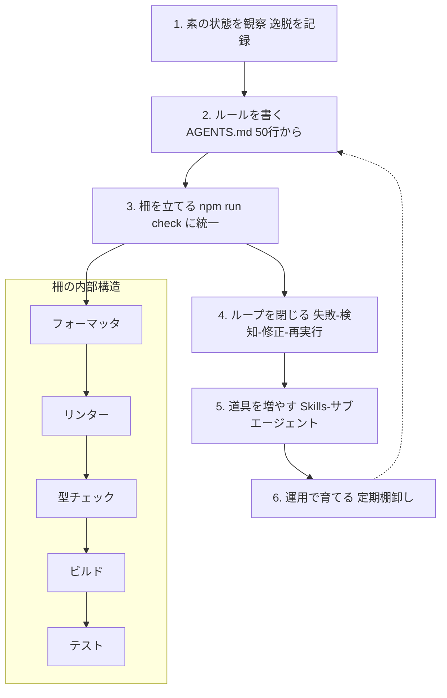
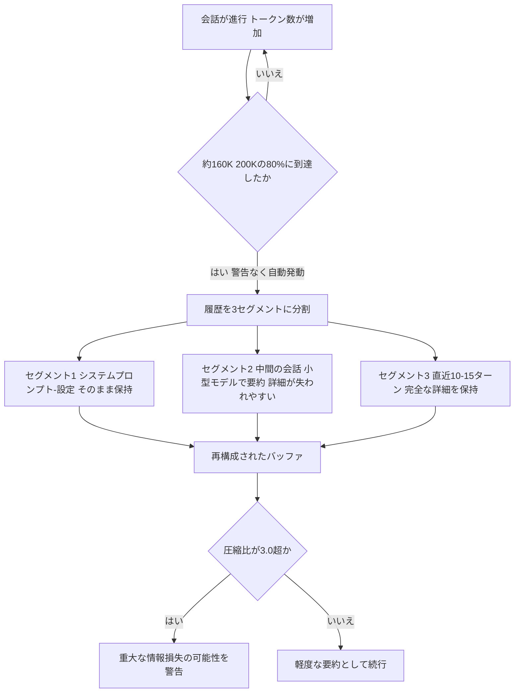
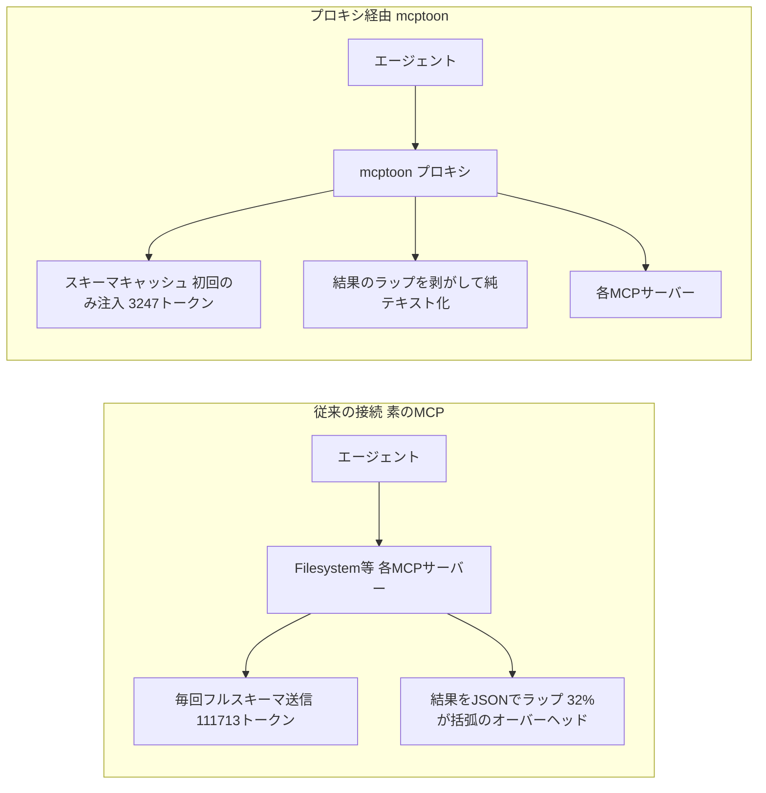

# Daily Briefing 2026-09-21

## 1. ハーネス設計入門——「プロンプト、コンテキストの次」に来る自走化設計（原題: ハーネス設計入門 〜プロンプト、コンテキストの次〜）

- **URL**: https://speakerdeck.com/kinopeee/hanesu-sekkei-nyuumon-kontekisuto-no-tsugi
- **公開日**: 2026-08-29
- **著者・媒体**: 木下雄一朗（Kinopee）／Speaker Deck（AirCle主催セミナー資料）

### 本文翻訳
本資料は「系譜」と「実践」の2部構成で、生成AIエージェントを自走させる設計技術を整理したセミナー資料である。

第1部では、2026年前半に乱立した「ハーネスエンジニアリング」の定義論を5つの流派に整理する。Chase派（LangChain）は「モデル以外のすべてがハーネス」という包括的な分類論を採る。Hashimoto派は失敗駆動の運用哲学で、実際に起きた失敗を防ぐルールをAGENTS.mdに積み上げていく。Fowler派は制御理論の観点から、事前の指示（guides）と事後の検証（sensors）を両輪とみなす。Chawla派はOS比喩を用い、LLMを「裸のCPU」、ハーネスをそれを動かす「OS」と位置づける。Codex派はスケール駆動で、本番環境で実際に起きる故障モードへの対処こそがハーネスだとする。資料は、この定義論争は2026年後半の標準化・制度化によって収束したと述べる。

第2部は「馬具・柵・ループ」の3要素による実践編である。「馬具」＝事前設計層の中核はAGENTS.mdで、目安は50行程度から開始し、プロジェクト概要・コマンド・プロジェクト固有規約を書き、一般常識・実装の詳細・長大な設計書は避ける。効く4原則は簡潔性・検証可能性・実例提示・運用による育成。ルール（常時効く基盤）に加え、プラン（タスク単位の事前合意）、Skills（定型作業の再利用手順書）、サブエージェント（役割分担と並列実行）を適用ツールとして使い分ける。

「柵」＝事後検証層は「1コマンドの門」に統一する：`npm run check = format && lint && types && test`。フォーマッタ（表記統一）→リンター（作法検査）→型チェック（整合性検証）→ビルド（成立確認）→テスト（振る舞い保証）の順に検証強度を上げる階層構造を取る。加えて、成果物への柵だけでなく「行動への柵」も必要とし、Hooksによるコマンド制限・許可リスト管理・サンドボックス環境で危険な実行を事前ブロックする。

「ループ」は、失敗→検知→修正→再実行という自動化サイクルで、判定結果をそのまま次の指示として渡す。

セキュリティ面では、間接プロンプトインジェクション（外部コンテンツ経由の悪意ある指示混入）、秘密情報漏洩（環境変数・認証情報の読み取り制限）、破壊的操作（rm・force pushの物理的禁止）、サプライチェーン（幻覚パッケージ対策として人間の承認を通す）の4リスクを管理対象とする。

実装順序は、①素の状態を観察して逸脱を記録、②ルールを書く（AGENTS.md）、③柵を立てる（checkコマンドの統一）、④ループを閉じる（自動化）、⑤道具を増やす（Skills/サブエージェント）、⑥運用で育てる（定期的な棚卸しを含む）という6段階を推奨する。実践例として、リリースノート作成Skill（git logの分類ツール）、Code Reviewerサブエージェント（規約・セキュリティ・テスト網羅の3観点）、バグ調査Skill（再現→ログ→原因仮説→修正→テスト設計）、Refactorerサブエージェント（重複排除に特化）が紹介される。

資料は最後に「ハーネスは隠れた技術的負債」という2026年後半の反論も取り上げ、モデルの進化により作り込んだハーネスが次世代で不要化しうることを認め、「薄く・軽く保ち、定期的に棚卸しする」ことを推奨している。

### 重要ポイント
- ハーネスエンジニアリングの5流派（Chase／Hashimoto／Fowler／Chawla／Codex）を「誰が何を強調するか」で整理
- 自走化の3要素は「馬具（事前設計＝AGENTS.md・Skills・サブエージェント）」「柵（事後検証＝1コマンドの門＋行動制限）」「ループ（失敗→検知→修正→再実行の自動化）」
- 検証は `npm run check = format && lint && types && test` のように1コマンドに統一し、強度順に段階化する
- 導入は素の観察→ルール→柵→ループ→道具→棚卸しの6段階で進める
- 「ハーネスは隠れた技術的負債」になり得るため、薄く軽く保ち定期的に棚卸しする運用姿勢が必要

### 図解


### 現場での適用方法

**CLAUDE.md への追記例**（AGENTS.md／ハーネス整備の指針をそのまま流用する形）:
```markdown
## ハーネス運用ルール（馬具・柵・ループ）
- 本ファイルは50〜150行を目安に保ち、プロジェクト概要・頻用コマンド・
  プロジェクト固有の規約のみを書く。一般常識や実装の詳細は書かない
- コード変更後は必ず `npm run check` を実行し、通過するまで完了扱いにしない
- 破壊的コマンド（rm -rf、force push、DB migration の直接適用）は
  必ず確認を挟む。Hooks の許可リストにも同じ制限を反映する
- 失敗したチェック結果は、そのまま次の修正指示としてエージェントに渡す
  （人間が要約し直さない）
- 月1回、このファイルと Skills/サブエージェント構成を棚卸しし、
  モデル更新で不要になったルールを削除する
```

**スクリプト化の例**（1コマンドの門を package.json に実装）:
```json
{
  "scripts": {
    "format": "prettier --check .",
    "lint": "eslint .",
    "types": "tsc --noEmit",
    "test": "vitest run",
    "check": "npm run format && npm run lint && npm run types && npm run test"
  }
}
```

### 期待効果
検証を1コマンドに統一しループを自動化することで、エージェントが「テストは通ったつもりで報告する」といった誤判定を人間が都度チェックする負担を減らせる。また実装順序を段階化することで、ハーネス整備を一度に作り込まず、観察に基づいて必要な部分だけを積み増していけるため、過剰な作り込みを避けやすくなる。

### 注意点
- 資料はセミナー用スライドであり、コード例やAGENTS.mdの具体的な文面は簡略化されているため、自チームの技術スタックに合わせて再設計が必要
- 「5つの流派」は2026年前半時点の議論の整理であり、標準化が進めば呼称・分類自体が古くなる可能性がある
- 著者自身が「ハーネスは隠れた技術的負債になりうる」と警告している通り、柵やSkillsを増やしすぎるとモデル更新時の保守コストが増す

## 2. Claude Codeのセッション圧縮を読み解く——コンテキスト要約の仕組みとエージェントが「忘れる」もの（原題: Claude Code Session Compaction in 2026: How Context Summarization Works and What Your Agent Forgets）

- **URL**: https://dev.to/jsmanifest/claude-code-session-compaction-in-2026-how-context-summarization-works-and-what-your-agent-forgets-am0
- **公開日**: 2026-09-19
- **著者・媒体**: jsmanifest／DEV Community

### 本文翻訳
著者は、Claude Codeの障害の多くが「200Kトークンのコンテキストウィンドウを無限のストレージだと誤解すること」に起因すると指摘する。実際には積極的な要約を伴う「ローリングバッファ」であり、典型的な失敗パターンは「重大な制約を学習してから50メッセージ後、圧縮時にそれを忘れる」というものだ。

圧縮は約160Kトークン（200Kウィンドウの80%）に達すると警告なく自動的に開始される。仕組みは3段階のパイプラインである。第1段階（保持選択）では会話履歴を3セグメントに分割し、システムプロンプト・設定指令を第1セグメント、最新の10〜15ターンを第3セグメントとして保持し、中間セグメントを要約対象とする。第2段階（要約生成）では、主会話より小さいモデルが要約を行うため「セマンティック圧縮ボトルネック」が生じる。たとえば「パフォーマンス重視のパス以外では関数型パターンを優先する」という制約は、要約後には「関数型パターンを使用」に単純化され、例外条件が失われうる。第3段階（バッファ再構成）では、元のシステムプロンプト＋生成された要約＋直近ターンの完全な詳細、という順で再構成される。

失われやすい情報の具体例として、①推論チェーン：アプローチA→B→Cと試行錯誤した記録が「型推論の問題を解決」に圧縮され、Bで何が問題だったかを参照できなくなる、②却下された選択肢：運用上の制約でRedisを却下しインメモリ方式に移行した経緯が「インメモリキャッシングを実装」とだけ要約され、後日エージェントが同じRedis案を再提案しかねない、③エッジケースの分析結論：「現在のアーキテクチャでは発生し得ない」というコメント付きの判断が要約で欠落し、後のリファクタリングで脆弱性が再導入されうる、④制約の明確化：「バンドルを200KB未満に」という要求とその後の「gzip圧縮の意味」というやり取りが、要約後は「バンドルサイズを最適化」とだけ残り、gzip要件が失われてデフォルト仮定に戻ってしまう、が挙げられている。逆に、命名された独立ファイル（DECISIONS.mdなど）、システムプロンプトの指令、直近10〜15ターンは圧縮を生き延びる。

対策として著者は、①制約・禁止事項・依存関係の許否・エッジケースをTypeScriptの型付きオブジェクト（ConstraintManifest）として外部ファイル化するパターン、②`compact()`メソッドにRetentionPolicy（保持したい制約・却下案・エッジケース・意思決定根拠、カスタム指示）を渡して要約フェーズ境界で明示的に手動圧縮する方法、③圧縮イベントを監視し圧縮比（元トークン数÷要約後トークン数）が3.0を超えたら重大な情報損失の警告を出す仕組み、④システムプロンプトから「詳細に推論を説明して」という要求を外すことでのトークン40〜60%削減、失敗した案の明示的な破棄宣言、応答長を500トークン程度に制限する、といったトークン規律を提示する。これらを組み合わせたセッションは80〜120Kトークンで複雑なタスクを完了し、圧縮自体を回避できたという。

結論として、圧縮は「セッション設計が圧縮を必然として受け止めていれば問題にならない」とし、状態管理を会話任せにせずアーティファクト化しているチームは、圧縮境界を越えても一貫性を保てると締めくくる。

### 重要ポイント
- 圧縮は約160K/200K（80%）で警告なく自動発動し、中間セグメントのみを小型モデルで要約する3段階パイプライン
- 推論チェーン・却下案・エッジケース分析・制約の明確化は要約で失われやすく、命名ファイル（アーティファクト）とシステムプロンプト・直近10〜15ターンは生き残る
- 圧縮比（元÷要約後）が3.0超なら重大な情報損失の疑い、2.0未満なら軽度と目安を提示
- 制約・意思決定根拠は会話内に留めずConstraintManifestのような外部ファイルに落とすことで圧縮耐性を持たせられる
- システムプロンプトの簡潔化だけでトークンを40〜60%削減でき、80〜120Kトークンに収めれば圧縮自体を避けられる

### 図解


### 現場での適用方法

**CLAUDE.md への追記例**（圧縮に耐える状態管理をエージェントに指示する）:
```markdown
## コンテキスト圧縮への対策
- 重要な制約・却下した設計案・エッジケースの結論は会話内に残さず、
  必ず docs/constraints.md や docs/decisions.md に書き出してから次の作業に進む
- 却下した案について再提案しないよう、却下理由をファイルに一行で残す
  （例: 「Redis案は運用制約により却下。インメモリ方式を採用」）
- 特に指示がない限り、説明は簡潔にし、詳細な思考過程を毎回書き出さない
- 会話が長くなってきたら、キリのよいフェーズの節目で明示的に要点を
  ファイルへ書き出してから区切ること
```

**スクリプト化の例**（制約を外部ファイル化するテンプレート）:
```typescript
// docs/constraint-manifest.ts
interface ConstraintManifest {
  architectural: { patterns: string[]; forbidden: string[] };
  performance: { bundleSize: { max: string; measured: "gzipped" | "uncompressed" } };
  dependencies: { allowed: string[]; prohibited: string[]; rationale: Record<string, string> };
  edgeCases: { description: string; handling: string; testCoverage: boolean }[];
}

export const manifest: ConstraintManifest = {
  architectural: { patterns: ["functional composition"], forbidden: ["class inheritance beyond two levels"] },
  performance: { bundleSize: { max: "200KB", measured: "gzipped" } },
  dependencies: { allowed: ["react", "typescript"], prohibited: ["moment"], rationale: { moment: "deprecated, use native Temporal API" } },
  edgeCases: [{ description: "null handling for empty arrays", handling: "explicit guard clause", testCoverage: true }],
};
```

### 期待効果
記事の報告では、アーティファクト化・簡潔なプロンプト・応答規律を組み合わせたセッションは80〜120Kトークンで複雑なタスクを完了でき、圧縮そのものをトリガーせずに済んだという。システムプロンプトの簡潔化だけでもトークン消費を40〜60%削減できるとされ、長時間セッションでの「学んだはずの制約を忘れる」再発を抑えられる可能性がある。

### 注意点
- 圧縮の閾値（160K/200K）や3段階パイプラインの詳細はAnthropic公式のドキュメントではなく著者による観察・逆解析に基づくため、製品アップデートで変わりうる
- エージェント自身は圧縮による情報欠落を検知できないため、圧縮イベントの監視や圧縮比のチェックは開発者側の責任として仕組み化する必要がある
- `compact()`のRetentionPolicyやイベント監視のAPIはコード例として示されたものであり、実際の呼び出し方法は利用環境のSDK/CLIのバージョンで確認すること

## 3. MCPサーバー10種をベンチマークしてみた——「こんにちは」を言うだけで4.7万トークンを消費するサーバーの正体（原題: I Benchmarked 10 MCP Servers — One of Them Burns 47K Tokens Just to Say Hello）

- **URL**: https://dev.to/mcptokensaver/i-benchmarked-10-mcp-servers-one-of-them-burns-47k-tokens-just-to-say-hello-7he
- **公開日**: 2026-08-23
- **著者・媒体**: MCP Token Saver／DEV Community

### 本文翻訳
著者は、よく使われるMCPサーバー10個を実際に接続し、ユーザーが最初の質問を打つ前にどれだけのトークンが消費されているかを実測した。結果は、合計847個のツール、JSONスキーマだけで111,713トークン、サーバーのステータスメッセージやヘッダー・エラースキーマまで含めると20万トークン超という規模だった。

内訳（ツール数・トークン数）は、Filesystem 11／3,847、GitHub 28／12,440、Postgres 19／8,231、Puppeteer 15／5,890、Brave Search 8／2,103、Memory 9／2,567、Sequential Thinking 3／890、Slack 22／14,672、Google Drive 31／47,293（最悪）、Notion 24／13,780。Google Driveが突出しているのは、ファイル操作・権限管理・共有・検索に関連する深くネストしたスキーマを持つためで、1ツールあたり約1,525トークン。比較として「シェイクスピア全集が約90万トークン」であり、Google Drive 1サーバー分のスキーマだけでその5%に相当すると指摘する。

トークンの内訳をさらに分解すると、ツール名＋説明文が35%（39,100トークン）、inputSchemaのプロパティが42%（46,920トークン）、ネストした型定義が15%（16,757トークン）、必須フィールド配列が3%、サーバーメタデータ＋ヘッダーが5%を占める。加えて、MCPのツール実行結果は`{"content":[{"type":"text","text":"..."}]}`という形式で毎回ラップされるため、実際のコンテンツが38文字でもラッピングだけで47文字消費され、1会話あたり20回のツール呼び出しを想定すると結果トークンの32%がJSONの括弧などの純粋なオーバーヘッドになるという。

経済的影響として、Claude 3.5 Sonnet（入力$3/百万トークン）換算で、1サーバー利用は1会話あたり$0.01、3サーバーで$0.06、5サーバーで$0.10、10サーバーで$0.34、10サーバー＋20回のツール呼び出しで約$0.54。10個のMCPサーバーを使い1日20回会話する開発者は、1日$10.80、月$216、年$2,592というコストになり、これはClaude Pro月額$20よりも高いと著者は強調する。

著者はこの問題への対策として、自作のプロキシツール「mcptoon」を紹介する。仕組みは、①ツール定義を1回だけ注入し会話ごとに再送信しない「スキーマキャッシング」、②結果のJSONラッピングを剥がして純粋なテキストに変換、③TOON形式による圧縮で847個のツールを111Kトークンから3.2Kトークンへと97%削減、の3点。比較データでは、ツール発見時のトークンが111,713→3,247（97%減）、1結果あたりのオーバーヘッドが47→0文字、20回のツール呼び出しが18,800→8,200トークン（56%減）、1会話全体が約180K→約45Kトークン（75%減）、会話あたりコストが$0.54→$0.14（74%減）となっている。導入は`pip install mcptoon`のうえ、`claude_desktop_config.json`で既存サーバーの起動コマンドを`mcptoon serve --stdio <元のコマンド>`で包むだけ。サイズ250KB・依存関係ゼロ・テスト486件（0.5秒）と、サプライチェーン攻撃面を抑えた設計を謳う。

測定方法は再現性を意識し、各サーバーを公式レジストリからnpx/pipでインストールし、stdio経由で`tools/list`を呼び出し、tiktoken（cl100k_base）でトークン数を計測、`tools/call`を20回呼んで結果ラッピングを測定するという手順を2026年8月23日時点の最新版で実施したとしている。

結論として著者は、MCPというプロトコル自体は評価しつつ、公式のサンプルは3〜5ツール（2〜5Kトークン）を想定しているのに対し、実運用では100〜847ツール規模が一般的になっており、その規模ではJSONのオーバーヘッドが支配的なコストになっている「誰も語らない効率問題」があると指摘する。MCPサーバー構築者へは説明文を50語以内にする・スキーマをフラット化する・未使用ツールを公開しないことを、利用者へはプロキシでの圧縮・接続サーバー数の見直し・会話間キャッシュの活用を推奨している。

### 重要ポイント
- 10個のMCPサーバー接続だけで合計847ツール・11万トークン超のスキーマが会話開始前に消費される
- 最悪のケース（Google Drive）は31ツールで4.7万トークン、1ツール平均1,525トークンという深いネスト構造が原因
- ツール結果のJSONラッピングだけで結果トークンの3割強を無駄にしている
- 10サーバー・1日20会話の利用で月$216、年$2,592という試算はClaude Pro月額を上回る
- スキーマキャッシング・結果アンラップ・TOON圧縮の組み合わせで、著者の実測では会話全体のコストを74%削減できたと報告

### 図解


### 現場での適用方法

**運用手順**（自分のMCP構成のトークンコストを棚卸しする）:
```bash
# 1. 現在接続しているMCPサーバー一覧を確認
cat ~/.config/<エージェント設定>/claude_desktop_config.json

# 2. 各サーバーの tools/list を取得し tiktoken でスキーマの
#    トークン数を計測（cl100k_base エンコーディングを使用）
python -c "
import tiktoken, json
enc = tiktoken.get_encoding('cl100k_base')
with open('<tools_list_response>.json') as f:
    data = json.load(f)
print(len(enc.encode(json.dumps(data))))
"

# 3. トークンコストが高く、かつ使用頻度が低いサーバーは
#    接続を外すか、必要なツールだけを絞ったカスタムMCPサーバーに置き換える
```

**CLAUDE.md への追記例**（MCP接続方針を明文化する）:
```markdown
## MCP サーバー運用ルール
- 常時接続するMCPサーバーは、実際に週次で使用するものだけに限定する
- 新しいMCPサーバーを追加する前に tools/list のトークンコストを計測し、
  1サーバーあたり5,000トークンを超える場合は導入可否をチームで確認する
- スキーマキャッシングに対応したプロキシ（mcptoon等）を経由できる場合は
  経由させ、会話ごとの再送信を避ける
```

### 期待効果
著者の実測では、スキーマキャッシング・結果アンラップ・TOON圧縮を組み合わせることで、10サーバー構成のツール発見コストを97%、会話全体のトークンコストを75%程度、会話あたりの金銭コストを74%削減できたと報告されている。MCPサーバーを多数接続している組織では、同様の棚卸しと圧縮策だけで月間APIコストを大きく圧縮できる可能性がある。

### 注意点
- 著者は記事内で紹介するmcptoonの開発者本人であり、自社ツールの効果を自己測定している点はバイアスとして留意する必要がある
- トークン数はサーバーのバージョンや設定によって変動するため、数値をそのまま流用せず自環境で計測し直すこと
- サードパーティのプロキシをMCP通信経路に挟むことになるため、本番導入前にセキュリティレビュー（通信内容の可視性、依存関係の信頼性）を行うべき
