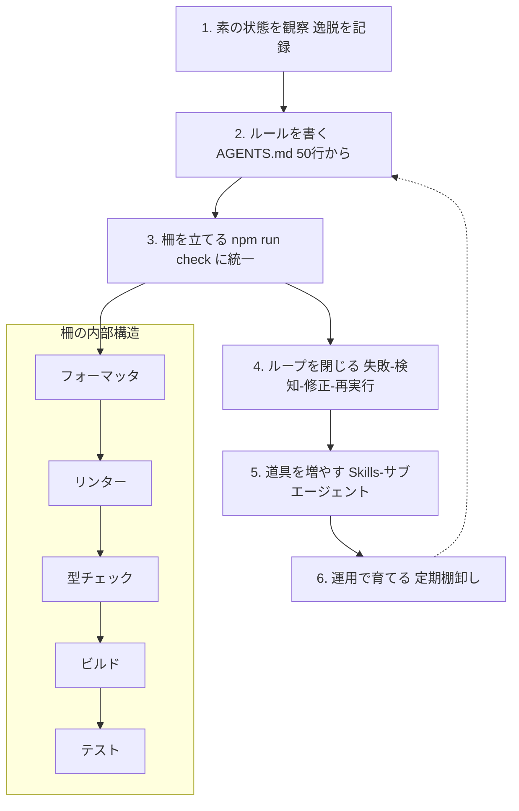
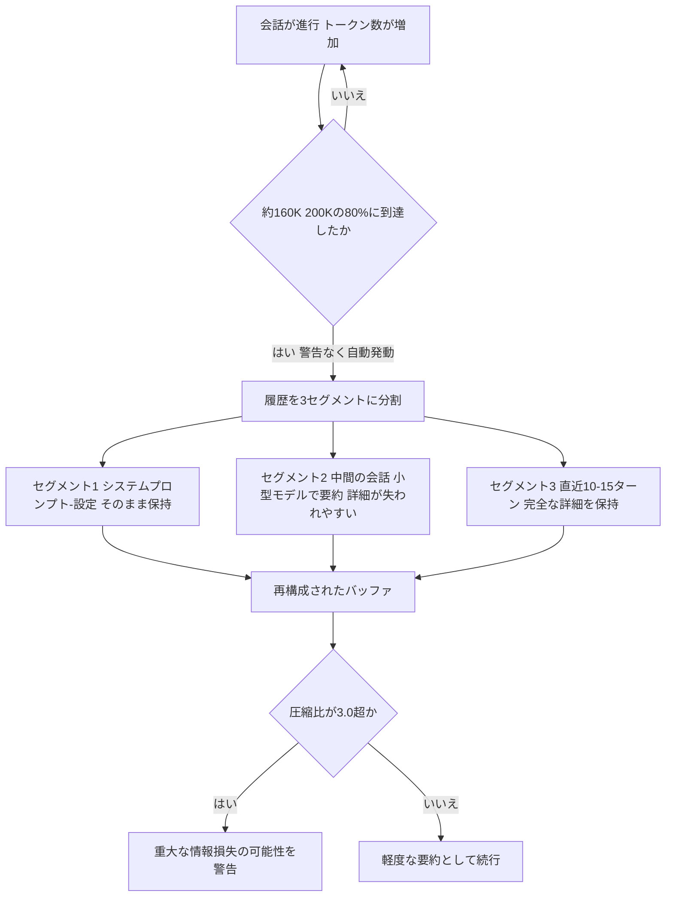
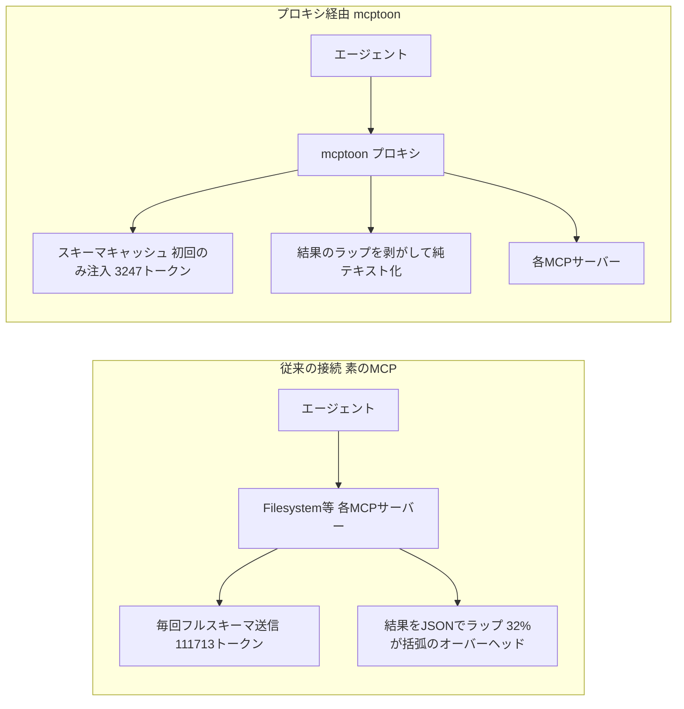
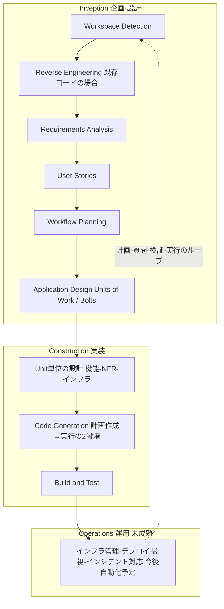
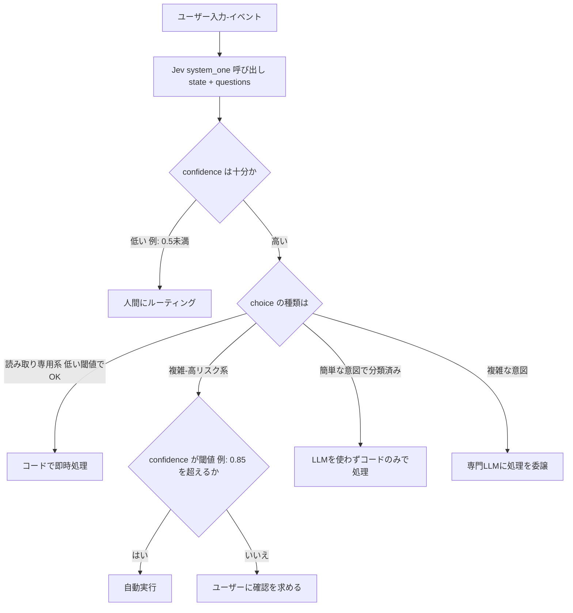
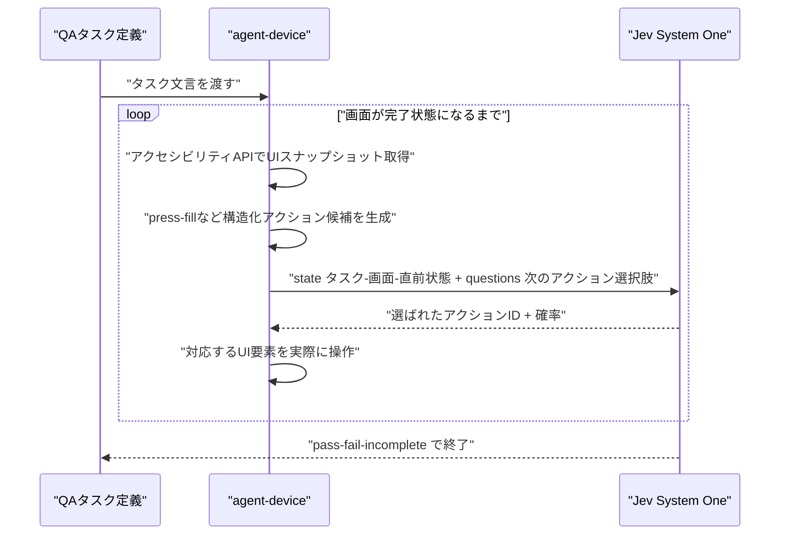

# Daily Briefing 2026-09-21

## 1. ハーネス設計入門——「プロンプト、コンテキストの次」に来る自走化設計（原題: ハーネス設計入門 〜プロンプト、コンテキストの次〜）

- **URL**: https://speakerdeck.com/kinopeee/hanesu-sekkei-nyuumon-kontekisuto-no-tsugi
- **公開日**: 2026-08-29
- **著者・媒体**: 木下雄一朗（Kinopee）／Speaker Deck（AirCle主催セミナー資料）

### 本文翻訳
本資料は「系譜」と「実践」の2部構成で、生成AIエージェントを自走させる設計技術を整理したセミナー資料である。

第1部では、2026年前半に乱立した「ハーネスエンジニアリング」の定義論を5つの流派に整理する。Chase派（LangChain）は「モデル以外のすべてがハーネス」という包括的な分類論を採る。Hashimoto派は失敗駆動の運用哲学で、実際に起きた失敗を防ぐルールをAGENTS.mdに積み上げていく。Fowler派は制御理論の観点から、事前の指示（guides）と事後の検証（sensors）を両輪とみなす。Chawla派はOS比喩を用い、LLMを「裸のCPU」、ハーネスをそれを動かす「OS」と位置づける。Codex派はスケール駆動で、本番環境で実際に起きる故障モードへの対処こそがハーネスだとする。資料は、この定義論争は2026年後半の標準化・制度化によって収束したと述べる。

第2部は「馬具・柵・ループ」の3要素による実践編である。「馬具」＝事前設計層の中核はAGENTS.mdで、目安は50行程度から開始し、プロジェクト概要・コマンド・プロジェクト固有規約を書き、一般常識・実装の詳細・長大な設計書は避ける。効く4原則は簡潔性・検証可能性・実例提示・運用による育成。ルール（常時効く基盤）に加え、プラン（タスク単位の事前合意）、Skills（定型作業の再利用手順書）、サブエージェント（役割分担と並列実行）を適用ツールとして使い分ける。

「柵」＝事後検証層は「1コマンドの門」に統一する：`npm run check = format && lint && types && test`。フォーマッタ（表記統一）→リンター（作法検査）→型チェック（整合性検証）→ビルド（成立確認）→テスト（振る舞い保証）の順に検証強度を上げる階層構造を取る。加えて、成果物への柵だけでなく「行動への柵」も必要とし、Hooksによるコマンド制限・許可リスト管理・サンドボックス環境で危険な実行を事前ブロックする。

「ループ」は、失敗→検知→修正→再実行という自動化サイクルで、判定結果をそのまま次の指示として渡す。

セキュリティ面では、間接プロンプトインジェクション（外部コンテンツ経由の悪意ある指示混入）、秘密情報漏洩（環境変数・認証情報の読み取り制限）、破壊的操作（rm・force pushの物理的禁止）、サプライチェーン（幻覚パッケージ対策として人間の承認を通す）の4リスクを管理対象とする。

実装順序は、①素の状態を観察して逸脱を記録、②ルールを書く（AGENTS.md）、③柵を立てる（checkコマンドの統一）、④ループを閉じる（自動化）、⑤道具を増やす（Skills/サブエージェント）、⑥運用で育てる（定期的な棚卸しを含む）という6段階を推奨する。実践例として、リリースノート作成Skill（git logの分類ツール）、Code Reviewerサブエージェント（規約・セキュリティ・テスト網羅の3観点）、バグ調査Skill（再現→ログ→原因仮説→修正→テスト設計）、Refactorerサブエージェント（重複排除に特化）が紹介される。

資料は最後に「ハーネスは隠れた技術的負債」という2026年後半の反論も取り上げ、モデルの進化により作り込んだハーネスが次世代で不要化しうることを認め、「薄く・軽く保ち、定期的に棚卸しする」ことを推奨している。

### 重要ポイント
- ハーネスエンジニアリングの5流派（Chase／Hashimoto／Fowler／Chawla／Codex）を「誰が何を強調するか」で整理
- 自走化の3要素は「馬具（事前設計＝AGENTS.md・Skills・サブエージェント）」「柵（事後検証＝1コマンドの門＋行動制限）」「ループ（失敗→検知→修正→再実行の自動化）」
- 検証は `npm run check = format && lint && types && test` のように1コマンドに統一し、強度順に段階化する
- 導入は素の観察→ルール→柵→ループ→道具→棚卸しの6段階で進める
- 「ハーネスは隠れた技術的負債」になり得るため、薄く軽く保ち定期的に棚卸しする運用姿勢が必要

### 図解


### 現場での適用方法

**CLAUDE.md への追記例**（AGENTS.md／ハーネス整備の指針をそのまま流用する形）:
```markdown
## ハーネス運用ルール（馬具・柵・ループ）
- 本ファイルは50〜150行を目安に保ち、プロジェクト概要・頻用コマンド・
  プロジェクト固有の規約のみを書く。一般常識や実装の詳細は書かない
- コード変更後は必ず `npm run check` を実行し、通過するまで完了扱いにしない
- 破壊的コマンド（rm -rf、force push、DB migration の直接適用）は
  必ず確認を挟む。Hooks の許可リストにも同じ制限を反映する
- 失敗したチェック結果は、そのまま次の修正指示としてエージェントに渡す
  （人間が要約し直さない）
- 月1回、このファイルと Skills/サブエージェント構成を棚卸しし、
  モデル更新で不要になったルールを削除する
```

**スクリプト化の例**（1コマンドの門を package.json に実装）:
```json
{
  "scripts": {
    "format": "prettier --check .",
    "lint": "eslint .",
    "types": "tsc --noEmit",
    "test": "vitest run",
    "check": "npm run format && npm run lint && npm run types && npm run test"
  }
}
```

### 期待効果
検証を1コマンドに統一しループを自動化することで、エージェントが「テストは通ったつもりで報告する」といった誤判定を人間が都度チェックする負担を減らせる。また実装順序を段階化することで、ハーネス整備を一度に作り込まず、観察に基づいて必要な部分だけを積み増していけるため、過剰な作り込みを避けやすくなる。

### 注意点
- 資料はセミナー用スライドであり、コード例やAGENTS.mdの具体的な文面は簡略化されているため、自チームの技術スタックに合わせて再設計が必要
- 「5つの流派」は2026年前半時点の議論の整理であり、標準化が進めば呼称・分類自体が古くなる可能性がある
- 著者自身が「ハーネスは隠れた技術的負債になりうる」と警告している通り、柵やSkillsを増やしすぎるとモデル更新時の保守コストが増す

## 2. Claude Codeのセッション圧縮を読み解く——コンテキスト要約の仕組みとエージェントが「忘れる」もの（原題: Claude Code Session Compaction in 2026: How Context Summarization Works and What Your Agent Forgets）

- **URL**: https://dev.to/jsmanifest/claude-code-session-compaction-in-2026-how-context-summarization-works-and-what-your-agent-forgets-am0
- **公開日**: 2026-09-19
- **著者・媒体**: jsmanifest／DEV Community

### 本文翻訳
著者は、Claude Codeの障害の多くが「200Kトークンのコンテキストウィンドウを無限のストレージだと誤解すること」に起因すると指摘する。実際には積極的な要約を伴う「ローリングバッファ」であり、典型的な失敗パターンは「重大な制約を学習してから50メッセージ後、圧縮時にそれを忘れる」というものだ。

圧縮は約160Kトークン（200Kウィンドウの80%）に達すると警告なく自動的に開始される。仕組みは3段階のパイプラインである。第1段階（保持選択）では会話履歴を3セグメントに分割し、システムプロンプト・設定指令を第1セグメント、最新の10〜15ターンを第3セグメントとして保持し、中間セグメントを要約対象とする。第2段階（要約生成）では、主会話より小さいモデルが要約を行うため「セマンティック圧縮ボトルネック」が生じる。たとえば「パフォーマンス重視のパス以外では関数型パターンを優先する」という制約は、要約後には「関数型パターンを使用」に単純化され、例外条件が失われうる。第3段階（バッファ再構成）では、元のシステムプロンプト＋生成された要約＋直近ターンの完全な詳細、という順で再構成される。

失われやすい情報の具体例として、①推論チェーン：アプローチA→B→Cと試行錯誤した記録が「型推論の問題を解決」に圧縮され、Bで何が問題だったかを参照できなくなる、②却下された選択肢：運用上の制約でRedisを却下しインメモリ方式に移行した経緯が「インメモリキャッシングを実装」とだけ要約され、後日エージェントが同じRedis案を再提案しかねない、③エッジケースの分析結論：「現在のアーキテクチャでは発生し得ない」というコメント付きの判断が要約で欠落し、後のリファクタリングで脆弱性が再導入されうる、④制約の明確化：「バンドルを200KB未満に」という要求とその後の「gzip圧縮の意味」というやり取りが、要約後は「バンドルサイズを最適化」とだけ残り、gzip要件が失われてデフォルト仮定に戻ってしまう、が挙げられている。逆に、命名された独立ファイル（DECISIONS.mdなど）、システムプロンプトの指令、直近10〜15ターンは圧縮を生き延びる。

対策として著者は、①制約・禁止事項・依存関係の許否・エッジケースをTypeScriptの型付きオブジェクト（ConstraintManifest）として外部ファイル化するパターン、②`compact()`メソッドにRetentionPolicy（保持したい制約・却下案・エッジケース・意思決定根拠、カスタム指示）を渡して要約フェーズ境界で明示的に手動圧縮する方法、③圧縮イベントを監視し圧縮比（元トークン数÷要約後トークン数）が3.0を超えたら重大な情報損失の警告を出す仕組み、④システムプロンプトから「詳細に推論を説明して」という要求を外すことでのトークン40〜60%削減、失敗した案の明示的な破棄宣言、応答長を500トークン程度に制限する、といったトークン規律を提示する。これらを組み合わせたセッションは80〜120Kトークンで複雑なタスクを完了し、圧縮自体を回避できたという。

結論として、圧縮は「セッション設計が圧縮を必然として受け止めていれば問題にならない」とし、状態管理を会話任せにせずアーティファクト化しているチームは、圧縮境界を越えても一貫性を保てると締めくくる。

### 重要ポイント
- 圧縮は約160K/200K（80%）で警告なく自動発動し、中間セグメントのみを小型モデルで要約する3段階パイプライン
- 推論チェーン・却下案・エッジケース分析・制約の明確化は要約で失われやすく、命名ファイル（アーティファクト）とシステムプロンプト・直近10〜15ターンは生き残る
- 圧縮比（元÷要約後）が3.0超なら重大な情報損失の疑い、2.0未満なら軽度と目安を提示
- 制約・意思決定根拠は会話内に留めずConstraintManifestのような外部ファイルに落とすことで圧縮耐性を持たせられる
- システムプロンプトの簡潔化だけでトークンを40〜60%削減でき、80〜120Kトークンに収めれば圧縮自体を避けられる

### 図解


### 現場での適用方法

**CLAUDE.md への追記例**（圧縮に耐える状態管理をエージェントに指示する）:
```markdown
## コンテキスト圧縮への対策
- 重要な制約・却下した設計案・エッジケースの結論は会話内に残さず、
  必ず docs/constraints.md や docs/decisions.md に書き出してから次の作業に進む
- 却下した案について再提案しないよう、却下理由をファイルに一行で残す
  （例: 「Redis案は運用制約により却下。インメモリ方式を採用」）
- 特に指示がない限り、説明は簡潔にし、詳細な思考過程を毎回書き出さない
- 会話が長くなってきたら、キリのよいフェーズの節目で明示的に要点を
  ファイルへ書き出してから区切ること
```

**スクリプト化の例**（制約を外部ファイル化するテンプレート）:
```typescript
// docs/constraint-manifest.ts
interface ConstraintManifest {
  architectural: { patterns: string[]; forbidden: string[] };
  performance: { bundleSize: { max: string; measured: "gzipped" | "uncompressed" } };
  dependencies: { allowed: string[]; prohibited: string[]; rationale: Record<string, string> };
  edgeCases: { description: string; handling: string; testCoverage: boolean }[];
}

export const manifest: ConstraintManifest = {
  architectural: { patterns: ["functional composition"], forbidden: ["class inheritance beyond two levels"] },
  performance: { bundleSize: { max: "200KB", measured: "gzipped" } },
  dependencies: { allowed: ["react", "typescript"], prohibited: ["moment"], rationale: { moment: "deprecated, use native Temporal API" } },
  edgeCases: [{ description: "null handling for empty arrays", handling: "explicit guard clause", testCoverage: true }],
};
```

### 期待効果
記事の報告では、アーティファクト化・簡潔なプロンプト・応答規律を組み合わせたセッションは80〜120Kトークンで複雑なタスクを完了でき、圧縮そのものをトリガーせずに済んだという。システムプロンプトの簡潔化だけでもトークン消費を40〜60%削減できるとされ、長時間セッションでの「学んだはずの制約を忘れる」再発を抑えられる可能性がある。

### 注意点
- 圧縮の閾値（160K/200K）や3段階パイプラインの詳細はAnthropic公式のドキュメントではなく著者による観察・逆解析に基づくため、製品アップデートで変わりうる
- エージェント自身は圧縮による情報欠落を検知できないため、圧縮イベントの監視や圧縮比のチェックは開発者側の責任として仕組み化する必要がある
- `compact()`のRetentionPolicyやイベント監視のAPIはコード例として示されたものであり、実際の呼び出し方法は利用環境のSDK/CLIのバージョンで確認すること

## 3. MCPサーバー10種をベンチマークしてみた——「こんにちは」を言うだけで4.7万トークンを消費するサーバーの正体（原題: I Benchmarked 10 MCP Servers — One of Them Burns 47K Tokens Just to Say Hello）

- **URL**: https://dev.to/mcptokensaver/i-benchmarked-10-mcp-servers-one-of-them-burns-47k-tokens-just-to-say-hello-7he
- **公開日**: 2026-08-23
- **著者・媒体**: MCP Token Saver／DEV Community

### 本文翻訳
著者は、よく使われるMCPサーバー10個を実際に接続し、ユーザーが最初の質問を打つ前にどれだけのトークンが消費されているかを実測した。結果は、合計847個のツール、JSONスキーマだけで111,713トークン、サーバーのステータスメッセージやヘッダー・エラースキーマまで含めると20万トークン超という規模だった。

内訳（ツール数・トークン数）は、Filesystem 11／3,847、GitHub 28／12,440、Postgres 19／8,231、Puppeteer 15／5,890、Brave Search 8／2,103、Memory 9／2,567、Sequential Thinking 3／890、Slack 22／14,672、Google Drive 31／47,293（最悪）、Notion 24／13,780。Google Driveが突出しているのは、ファイル操作・権限管理・共有・検索に関連する深くネストしたスキーマを持つためで、1ツールあたり約1,525トークン。比較として「シェイクスピア全集が約90万トークン」であり、Google Drive 1サーバー分のスキーマだけでその5%に相当すると指摘する。

トークンの内訳をさらに分解すると、ツール名＋説明文が35%（39,100トークン）、inputSchemaのプロパティが42%（46,920トークン）、ネストした型定義が15%（16,757トークン）、必須フィールド配列が3%、サーバーメタデータ＋ヘッダーが5%を占める。加えて、MCPのツール実行結果は`{"content":[{"type":"text","text":"..."}]}`という形式で毎回ラップされるため、実際のコンテンツが38文字でもラッピングだけで47文字消費され、1会話あたり20回のツール呼び出しを想定すると結果トークンの32%がJSONの括弧などの純粋なオーバーヘッドになるという。

経済的影響として、Claude 3.5 Sonnet（入力$3/百万トークン）換算で、1サーバー利用は1会話あたり$0.01、3サーバーで$0.06、5サーバーで$0.10、10サーバーで$0.34、10サーバー＋20回のツール呼び出しで約$0.54。10個のMCPサーバーを使い1日20回会話する開発者は、1日$10.80、月$216、年$2,592というコストになり、これはClaude Pro月額$20よりも高いと著者は強調する。

著者はこの問題への対策として、自作のプロキシツール「mcptoon」を紹介する。仕組みは、①ツール定義を1回だけ注入し会話ごとに再送信しない「スキーマキャッシング」、②結果のJSONラッピングを剥がして純粋なテキストに変換、③TOON形式による圧縮で847個のツールを111Kトークンから3.2Kトークンへと97%削減、の3点。比較データでは、ツール発見時のトークンが111,713→3,247（97%減）、1結果あたりのオーバーヘッドが47→0文字、20回のツール呼び出しが18,800→8,200トークン（56%減）、1会話全体が約180K→約45Kトークン（75%減）、会話あたりコストが$0.54→$0.14（74%減）となっている。導入は`pip install mcptoon`のうえ、`claude_desktop_config.json`で既存サーバーの起動コマンドを`mcptoon serve --stdio <元のコマンド>`で包むだけ。サイズ250KB・依存関係ゼロ・テスト486件（0.5秒）と、サプライチェーン攻撃面を抑えた設計を謳う。

測定方法は再現性を意識し、各サーバーを公式レジストリからnpx/pipでインストールし、stdio経由で`tools/list`を呼び出し、tiktoken（cl100k_base）でトークン数を計測、`tools/call`を20回呼んで結果ラッピングを測定するという手順を2026年8月23日時点の最新版で実施したとしている。

結論として著者は、MCPというプロトコル自体は評価しつつ、公式のサンプルは3〜5ツール（2〜5Kトークン）を想定しているのに対し、実運用では100〜847ツール規模が一般的になっており、その規模ではJSONのオーバーヘッドが支配的なコストになっている「誰も語らない効率問題」があると指摘する。MCPサーバー構築者へは説明文を50語以内にする・スキーマをフラット化する・未使用ツールを公開しないことを、利用者へはプロキシでの圧縮・接続サーバー数の見直し・会話間キャッシュの活用を推奨している。

### 重要ポイント
- 10個のMCPサーバー接続だけで合計847ツール・11万トークン超のスキーマが会話開始前に消費される
- 最悪のケース（Google Drive）は31ツールで4.7万トークン、1ツール平均1,525トークンという深いネスト構造が原因
- ツール結果のJSONラッピングだけで結果トークンの3割強を無駄にしている
- 10サーバー・1日20会話の利用で月$216、年$2,592という試算はClaude Pro月額を上回る
- スキーマキャッシング・結果アンラップ・TOON圧縮の組み合わせで、著者の実測では会話全体のコストを74%削減できたと報告

### 図解


### 現場での適用方法

**運用手順**（自分のMCP構成のトークンコストを棚卸しする）:
```bash
# 1. 現在接続しているMCPサーバー一覧を確認
cat ~/.config/<エージェント設定>/claude_desktop_config.json

# 2. 各サーバーの tools/list を取得し tiktoken でスキーマの
#    トークン数を計測（cl100k_base エンコーディングを使用）
python -c "
import tiktoken, json
enc = tiktoken.get_encoding('cl100k_base')
with open('<tools_list_response>.json') as f:
    data = json.load(f)
print(len(enc.encode(json.dumps(data))))
"

# 3. トークンコストが高く、かつ使用頻度が低いサーバーは
#    接続を外すか、必要なツールだけを絞ったカスタムMCPサーバーに置き換える
```

**CLAUDE.md への追記例**（MCP接続方針を明文化する）:
```markdown
## MCP サーバー運用ルール
- 常時接続するMCPサーバーは、実際に週次で使用するものだけに限定する
- 新しいMCPサーバーを追加する前に tools/list のトークンコストを計測し、
  1サーバーあたり5,000トークンを超える場合は導入可否をチームで確認する
- スキーマキャッシングに対応したプロキシ（mcptoon等）を経由できる場合は
  経由させ、会話ごとの再送信を避ける
```

### 期待効果
著者の実測では、スキーマキャッシング・結果アンラップ・TOON圧縮を組み合わせることで、10サーバー構成のツール発見コストを97%、会話全体のトークンコストを75%程度、会話あたりの金銭コストを74%削減できたと報告されている。MCPサーバーを多数接続している組織では、同様の棚卸しと圧縮策だけで月間APIコストを大きく圧縮できる可能性がある。

### 注意点
- 著者は記事内で紹介するmcptoonの開発者本人であり、自社ツールの効果を自己測定している点はバイアスとして留意する必要がある
- トークン数はサーバーのバージョンや設定によって変動するため、数値をそのまま流用せず自環境で計測し直すこと
- サードパーティのプロキシをMCP通信経路に挟むことになるため、本番導入前にセキュリティレビュー（通信内容の可視性、依存関係の信頼性）を行うべき

## 4. AI-DLC（AI駆動開発ライフサイクル）を9ヶ月運用してわかったこと——Inception・Construction・Operationsの3フェーズと職種の変化（原題: Notes on exploring the AI-Driven Development Life Cycle）

- **URL**: https://www.micahwalter.com/posts/notes-on-exploring-ai-dlc
- **公開日**: 2026-06-26
- **著者・媒体**: Micah Walter／Micah Walterブログ

### 本文翻訳
著者はAWSの顧客向けにAI-DLC（AI-Driven Development Life Cycle）ワークショップを月1〜3回、過去9ヶ月にわたり実施してきた経験から、この方法論を解説する。AI-DLCは「ソフトウェア開発のあらゆる段階でAIを中心的な協力者に据える方法論」であり、核となるメンタルモデルは「計画→質問→検証→実行」のループを数時間単位で繰り返すことだという。従来の「プロンプトを投げっぱなしにする」やり方でも、ウォーターフォール的な長期計画でもない、反復可能な構造化開発を狙う。

ライフサイクルは3フェーズに分かれる。「Inception（企画・設計）」では、まずプロジェクトが新規か既存かをWorkspace Detectionで判定し、既存コードにはReverse Engineeringでビジネス概要・アーキテクチャドキュメント・コンポーネント一覧を生成する。次にRequirements Analysisでユーザーリクエストを構造化要件に変換し、複雑度に応じて「最小・標準・包括的」の3段階を選択、AIが複数選択肢＋「その他」形式で明確化質問を行う。User Storiesはペルソナと受け入れ基準付きで作成され、MCPサーバー経由でJiraと連携できる。Workflow Planningは実行段階・順序・深度を適応的に決め、1行のバグ修正なら短縮フロー、新規マイクロサービスなら完全フローとなる。Application Designでは、コンポーネント・サービス・ビジネスルールを特定し、従来のエピックに相当する「Units of Work」に分解、さらに数時間〜数日サイクルの「Bolts」という単位を導入する。

「Construction（実装）」では、Unit単位で機能設計・非機能要件分析・設計・インフラ設計を条件付きで実施したうえで、Code Generationは「実装計画作成」→「コード・テスト実行」の2段階制とし、チェックボックス付き計画により出力の方向性を制御する。Build and Testではビルド命令・単体テスト・統合テスト指示を生成し、著者自身のブログでは`npm run build`を信号として活用した。

「Operations（運用)」はまだプレースホルダー段階で、インフラコード管理・デプロイ・監視・インシデント対応の自動化は今後AWS DevOps AgentやAWS Transformなどのツールで対応予定とされる。

ツール面では、ルール一式がawslabs/aidlc-workflowsリポジトリでオープンソース公開されており、Kiro・Cursor・Claude Code・GitHub Copilotに組み込める。Kiroのスペック形式はrequirements.md（要件・受け入れ基準）、design.md（アーキテクチャ・エラーハンドリング）、tasks.md（追跡可能な実装タスク）の3ファイル構成で、各フェーズに承認ゲートを置きAIの先走りを防ぐ。

Gitワークフローでは`cursor/<説明>-<ID>`というブランチ命名を推奨し、PRレビューは従来のコード行単位レビューから「PRとrequirements/design/tasksの総合レビュー」へシフトする。Git Worktreesで複数ブランチを並行チェックアウトし、前のPRをレビューしながら新機能を開発できる利点も挙げる。Confluenceは高レベルのビジョン・ロードマップに、Jira/GitHub Issuesは作業ステータス管理に使い、AI-DLCの成果物自体はリポジトリ内のバージョン管理下マークダウンとしてコードと共に保存する。

役割の変化として、PMは「要件を起案する」から「AIが起案した要件・ストーリーをレビュー・承認する」へ、エンジニアは「コード記述」から「コードレビュー・計画検証・判断」へ、DevOps/SREは「手動テンプレート作成」から「AIが提案したインフラ変更の妥当性判定」へとシフトする。著者自身、自分のブログをPR #74・#75で実装し、`aidlc-docs/`フォルダにliving docsを置き、GitHub Issuesをバックログに、`workflow-conventions.md`で独自ルールを定義した。

Spec-Driven Developmentとの関係については、Kiroのスペック形式を「AI-DLCの実装アーティファクト」と位置づけ、プロトタイピング向けのVibe Codingと、複雑機能・チーム協働向けのSpec-Drivenを使い分けるべきとする。著者は「仕様書なしのコード開発は1週間後に目的不明確になる」と自戒しつつ、自分自身も時々Vibe Codingに陥ると認めている。課題として、Operationsフェーズが未成熟であることと、小規模変更にはステージが重すぎる感覚があることを挙げている。

### 重要ポイント
- AI-DLCの核は「計画→質問→検証→実行」を数時間単位で回す反復ループで、丸投げのVibe Codingとも重厚長大なウォーターフォールとも異なる
- Inception（要件・設計）→Construction（実装）→Operations（運用・未成熟）の3フェーズ構成で、変更規模に応じてフロー深度を適応的に変える
- Kiroのスペックはrequirements.md／design.md／tasks.mdの3ファイル構成で、各フェーズに承認ゲートを設けてAIの先走りを防ぐ
- ルール一式はawslabs/aidlc-workflowsとしてOSS公開され、Kiro・Cursor・Claude Code・GitHub Copilotに組み込める
- PM・エンジニア・DevOpsの役割は「作成者」から「AI出力のレビュー・承認・判断者」へとシフトする

### 図解


### 現場での適用方法

**運用手順**（awslabs/aidlc-workflowsをClaude Codeに導入する）:
```bash
# 1. AI-DLC のワークフロー定義をリポジトリに取り込む
git clone https://github.com/awslabs/aidlc-workflows <TMP_DIR>
mkdir -p <REPO_PATH>/aidlc-docs
cp -r <TMP_DIR>/rules/* <REPO_PATH>/.claude/

# 2. スペック用のディレクトリと3ファイル構成を用意する
mkdir -p <REPO_PATH>/aidlc-docs/<UNIT_OF_WORK_NAME>
touch <REPO_PATH>/aidlc-docs/<UNIT_OF_WORK_NAME>/{requirements.md,design.md,tasks.md}

# 3. 変更用ブランチを命名規則に沿って作成する
git checkout -b claude/<変更内容>-<ID>
```

**CLAUDE.md への追記例**（承認ゲートとBolt運用をルール化する）:
```markdown
## AI-DLC 運用ルール
- 新機能・大きな変更は aidlc-docs/<unit名>/ 配下に
  requirements.md → design.md → tasks.md の順で作成し、
  各ファイルの内容をユーザーが承認するまで次工程へ進まない
- 1行修正など影響範囲が小さい変更は、このフルフローを省略してよい
- tasks.md はチェックボックス形式で管理し、実装が完了した項目のみチェックする
- PRの説明には requirements.md / design.md / tasks.md へのリンクを含める
```

### 期待効果
著者はこのループにより、AIに丸投げする「Vibe Coding」で1週間後に目的を見失う事態や、重厚な事前計画で身動きが取れなくなる事態の両方を避け、数時間単位で検証しながら開発を進められたと報告している。またPRレビューがコード行単位から要件・設計・タスクを含む総合レビューに変わることで、実装意図の把握がしやすくなるとしている。

### 注意点
- Operationsフェーズ（デプロイ・監視・インシデント対応の自動化）はまだプレースホルダー段階で、実運用の知見は限定的
- 小規模な変更にはフルフローが重く感じられ、著者自身も時々仕様書なしのVibe Codingに戻ってしまうと認めている
- 定量的な効果測定（工数削減率など）は記事内に明示されておらず、著者個人の定性的な観察が中心である

## 5. Jevの実践活用ガイド——テキスト生成ではなく型付き確率判定を返す「System One」モデルの使い方（原題: How to Use Jev: A practical guide to TypeSafe's System One model）

- **URL**: https://dev.to/valyuai/how-to-use-jev-a-practical-guide-to-typesafes-system-one-model-g5e
- **公開日**: 不明（直近数週間以内、TypeSafeのJevローンチである2026-09-15以降）
- **著者・媒体**: Prosper Otemuyiwa（Valyu AI）／DEV Community

### 本文翻訳
Jevは、TypeSafe AIが2026年9月15日にローンチした「テキスト生成ではなく型付きの確率的判定を返すフロンティアAIモデル」である。レスポンス時間は70〜500ミリ秒、入力コストは100万トークンあたり$0.042、出力は無料。著者は「Jevは安いLLMではなく、別の原始的操作（primitive）である」と位置づける。

Jevは3種類の質問プリミティブを提供する。「Choice」は最大255個の選択肢から1つを選び、`.choice`（選択値）・`.probabilities`（各選択肢の確率）・`.confidence`（信頼度）を返す。「Score」は2〜10段階の順序尺度上の位置を小数（例: 1.035）まで含めて返す。「Noul」はYes/Noの確率を0〜1の単一数値で返す。Python SDK（`typesafe-sdk`）とJS/TS SDK（`@typesafe-ai/sdk`）が用意され、`client.system_one(state=..., questions={...})`という形で、状態（state）と複数の質問をまとめて渡す。

著者は5つの実践パターンを紹介する。①「推測的ファンアウト」：質問は並列実行されるため、あらかじめ想定される質問をすべて一度に投げるとコストがほぼ増えない（13質問を1呼び出しにまとめると逐次呼び出し比で12.2倍安く10.0倍速いとの計測）。②「信頼度ゲートルーティング」：JevはRLCD（校正決定のための強化学習）で訓練されており、confidenceが低い場合は人間に、読み取り専用操作は低い閾値、送金承認のような操作は高い閾値（例: 0.85超）でルーティングを分岐する。③「複合スコアリング」：ファジーな判断を複数の独立したScore質問に分解し、重み付けはコード側で手動制御する。④「カスケード」：Jevで意図分類・複雑度判定を行い、コードで処理できるものはコードのみで完結させ、複雑なものだけLLMに渡す（記事内の試算では100万チケット処理がJevのみで約$6,480、フロンティアモデルでは$30,400、うち80万件は500ms以下で解決）。⑤「検索してから判定」：Jevは世界知識を持たないため、事前に検索・フィルタリングしたコンテンツをstateとして渡し、その範囲内でNoul/Score判定させる。

ローンチ48時間で報告された実例として、論文1,018本を$0.08で分類したケース（DeepSeek V4での要約は$3.99、Jevでの分類は$0.08、論文あたり中央値256ms）、ブラウザ操作エージェントが7.1秒・$0.0039でフライト予約を完了したケース、Computer Useの1ステップあたりコストがOpus 5の$0.032に対しJevは$0.0002という比較、Monadブロックチェーン上でブロック時間（約300ms）内に収まるマーケットメーカー、ドローンの2.5Hzでの戦術判定（500Hzの飛行制御・50Hzの安全反射はコード、15Hzのシーン解析は古典的CVで、Jevはあくまで勧告のみ）が紹介されている。

TypeSafe自身による4ワークフローのベンチマークでは、Jevの精度67.8%はClaude Sonnet 5と同等としつつ、コストは293分の1、レイテンシは195分の1だったと報告される（ただし精度評価はTypeSafe自身が実施し、独立検証はない）。

失敗モードとして、否定・スコープ・暗黙条件を字義通りに解釈してしまう、計算ができない、日付を順序データとして扱えない、コンテキストが増えると精度が落ちる、ユーザー制御コンテンツで判定を誘導されうる敵対的入力への弱さ、矛盾する基準への混乱、そしてテキスト・コード・要約の生成が一切できないことが挙げられる。コンテキスト上限はstate全体で64kトークン、単一質問では32kトークンで、レート制限はトークン250,000/秒・リクエスト1,200/分。用途としては、ルーティング・トリアージ・モデレーション・関連性フィルタリング・LLM出力のガードレール・大量タグ付け・秒未満判定に向き、テキスト生成・計算・監査証跡が必要な判断・開放的な推論には向かないとまとめる。

### 重要ポイント
- Jevは「型付き確率判定」に特化した別カテゴリのモデルで、Choice／Score／Noulの3プリミティブで意思決定を返す
- 質問は並列実行されるため、想定される質問をまとめて投げる「推測的ファンアウト」でコストをほぼ増やさず情報量を増やせる
- confidenceによるゲートルーティングで、操作のリスクに応じて人間確認・自動実行の閾値を変えられる
- カスケード構成（Jevで分類→簡単なものはコード完結→複雑なものだけLLM）で処理コストを大幅に削減できる（記事内試算で100万件処理が$30,400→$6,480）
- テキスト生成・計算・監査証跡が必要な判断には不向きで、あくまでルーティング・トリアージ用途に限定すべき

### 図解


### 現場での適用方法

**スクリプト化の例**（サポートチケットの一次振り分けをJevで実装する）:
```python
from typesafe_sdk import Choice, Noul, Score, TypeSafeClient

client = TypeSafeClient()  # 環境変数 TYPESAFE_API_KEY を使用

def triage_ticket(ticket_text: str, order_info: dict, policy_text: str):
    response = client.system_one(
        state={
            "ticket": {"messages": [{"from": "customer", "text": ticket_text}]},
            "order": order_info,
            "policy": policy_text,
        },
        questions={
            "department": Choice(
                instructions="どのチームが対応すべきか",
                criteria={
                    "billing": "支払い・請求に関する問題",
                    "technical": "不具合・連携の問題",
                    "sales": "料金・アカウントに関する質問",
                },
            ),
            "frustration": Score(
                instructions="顧客の苛立ちの度合い",
                criteria=["冷静に事実を述べている", "苛立っているが礼儀正しい", "強い言葉で非常に怒っている"],
            ),
            "refund_requested": Noul(instructions="顧客が返金を求めているか"),
        },
    )
    dept = response.answers["department"]
    if dept.confidence < 0.5:
        return "human_review"
    return dept.choice

# 使い方: triage_ticket("注文A-104が二重請求されました。返金してください。", order_info, policy_text)
```

**CLAUDE.md への追記例**（Jevのようなモデルをルーティング判断に限定利用する方針を明文化）:
```markdown
## 意思決定モデルの使い分け方針
- 単純な分類・ルーティング・Yes/No判定（例: 問い合わせの部署振り分け、
  内容の緊急度判定）には、低コスト・低レイテンシな判定専用モデルを検討する
- confidence が閾値を下回る判定は、必ず人間かより高精度なモデルへエスカレーションする
- テキスト生成・数値計算・監査証跡が必要な最終判断には使用しない
```

### 期待効果
記事内の実例では、論文分類でコストが約50分の1（$3.99→$0.08）、Computer Useの1ステップあたりコストがOpus 5比で約160分の1（$0.032→$0.0002）、100万件のチケット処理コストが約4.7分の1（$30,400→$6,480）になったと報告されている。ルーティング・トリアージ用途に限定すれば、LLM呼び出し回数そのものを削減しコストとレイテンシを大きく下げられる可能性がある。

### 注意点
- 精度ベンチマークはTypeSafe自身による自己計測で、第三者による独立検証はないと明記されている
- 計算・日付順序の把握・矛盾した基準の解釈が苦手なため、正確性が必須な業務ロジックの最終判断には使うべきではない
- ユーザーが入力を制御できる場面では、敵対的な文言で判定を誘導されるリスクがあるため、入力の信頼度に応じた設計が必要

## 6. モバイルQAエージェントにJevを組み込む——agent-deviceとの連携で14秒・$0.0023のE2Eテスト実行を実現（原題: Exploring Jev for AI-Driven QA with agent-device）

- **URL**: https://www.callstack.com/blog/exploring-jev-for-mobile-qa-with-agent-device
- **公開日**: 2026-09-17
- **著者・媒体**: Mike Grabowski（Callstack CEO & Founder）／Callstack Blog

### 本文翻訳
CallstackのCEOであるMike Grabowskiは、TypeSafeの意思決定モデルJevを、同社のオープンソースツール「agent-device」（エージェントがモバイルアプリを検査・操作するためのツール）と組み合わせたQAエージェントの実装例を紹介する。Jevの特徴である「70〜500ミリ秒のレスポンス、LLM比で193.6倍高速・444.6倍低コスト」という特性は、QAエージェントにおいては同じ予算内でより多くのテストを実行し、より早くフィードバックを得られることを意味すると位置づける。

実装のワークフローは次の通りである。まずagent-deviceがアクセシビリティAPIを通じてアプリのUI状態を収集し、`@e2 [text] "Canvas backpack"`、`@e4 [button] "Add to cart"`のような参照付きスナップショットを生成する。次に、各スナップショットを「アクションセット」に変換する。ボタンには`press`アクション、編集フィールドには`fill`アクションが割り当てられ、それぞれ`{"id": "a10", "kind": "press", "ref": "@e4", "target": "Add to cart", "description": "..."}`のような構造化データになる。

このアクション候補群をJevに渡し、次に実行すべきアクションを1つ選ばせる。TypeScript SDKでは、各アクションのIDと説明を`Choice`の選択肢として渡し、`state`にはタスク内容・現在の画面・直前の画面・直前のアクションを含める。Jevは選ばれたアクションのIDと確率（不確実性の指標）を返し、agent-deviceがそのIDに対応する要素を実際に操作する。新しい画面が読み込まれると同じプロセスを繰り返し、Jevは最終的に「pass」「fail」「incomplete」のいずれかでタスクを終了できる。

デモとして、iOSシミュレータの「設定」アプリで「アクセシビリティ→ディスプレイとテキストサイズを開き、Smart Invertまでスクロールしてスイッチが表示されていることを確認する（設定は変更しない）」というタスクをCLIから実行した例が示され、実行時間は14秒、推論コストは$0.0023だったと報告されている。

Jevがこの用途に向く技術的特性として、スクリーンショットや動画を処理せずテキストと構造化データに特化している点が挙げられ、これがアクセシビリティ情報ベースの操作と相性が良いとしている。

### 重要ポイント
- agent-device（UI状態の取得・アクション実行を担当）とJev（次アクションの選択を担当）を分業させるアーキテクチャ
- UI要素はアクセシビリティAPI経由で`@e2`のような参照ID付きスナップショットとして取得し、press/fillなど構造化アクションに変換してからJevに渡す
- Jevへの問い合わせは`Choice`プリミティブで「次に取るべきアクション」を選ばせ、確率値で不確実性も把握できる
- デモタスク（アクセシビリティ設定の確認）は14秒・$0.0023で完了
- Jevはスクリーンショット・動画を扱わずテキスト/構造化データに特化しているため、アクセシビリティ情報主体のQA自動化と相性が良い

### 図解


### 現場での適用方法

**運用手順**（agent-device + Jev でモバイルQAシナリオを試す）:
```bash
# 1. リポジトリを取得し依存関係をインストール
git clone https://github.com/callstack/agent-device <REPO_PATH>
cd <REPO_PATH> && npm install

# 2. TypeSafe の API キーを環境変数に設定
export TYPESAFE_API_KEY="<YOUR_TYPESAFE_API_KEY>"

# 3. iOS シミュレータ上で自然言語のQAシナリオを実行
npm run qa -- \
  --app <BUNDLE_ID> \
  --platform ios \
  "<自然言語で書いたテストシナリオ。例: 設定アプリを開き、Xの項目まで移動して状態を確認する。設定は変更しない>"
```

**スキーマ化の例**（自前のQAエージェントにJevの次アクション選択ロジックを組み込む骨子）:
```typescript
import { TypeSafeClient, choice } from '@typesafe-ai/sdk';

const jev = new TypeSafeClient();

async function pickNextAction(prompt: string, snapshot: string, previousScreen: string, previousAction: string, actions: Action[]) {
  const options = Object.fromEntries(actions.map(a => [a.id, a.description]));
  const { answers } = await jev.systemOne({
    model: 'jev-latest',
    state: { task: prompt, screen: snapshot, previousScreen, previousAction },
    questions: { nextAction: choice('Choose the next action for the task.', options) },
  });
  return answers.nextAction; // .choice に選ばれたアクションID、確率も取得可能
}
```

### 期待効果
記事のデモでは、UI操作を伴う実端末相当のQAシナリオが14秒・$0.0023という低コスト・低レイテンシで完了しており、著者は同じ予算でより多くのテストケースを回し、フィードバックをより早く得られる点をメリットとして挙げている。テキスト・構造化データに特化したJevの性質上、スクリーンショット解析を伴う従来のビジョンベースQAエージェントよりも軽量な構成になりうる。

### 注意点
- 記事は1分程度で読める短い紹介記事であり、失敗時のリトライ戦略や複雑なマルチステップシナリオでの安定性など、運用上の詳細は記載されていない
- Jevは画像を扱わずアクセシビリティ情報に依存するため、アクセシビリティツリーが不完全なアプリ（カスタム描画のCanvas UIなど）では適用が難しい可能性がある
- TypeSafeの外部APIに依存する構成のため、機密性の高いアプリのQAに使う場合は送信される画面情報の範囲を事前に確認すべき

### 補足
本日は手動再実行により合計6件（既存3件＋追加3件）の記事を選定した。
